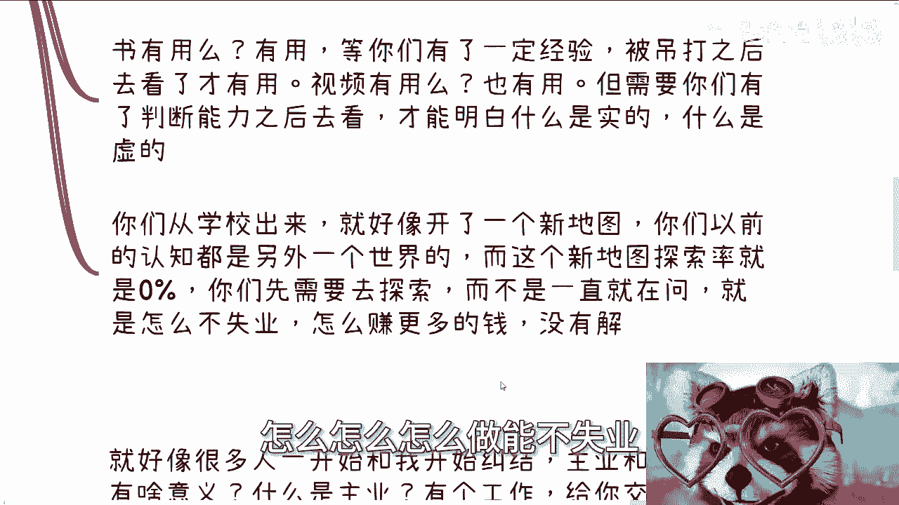
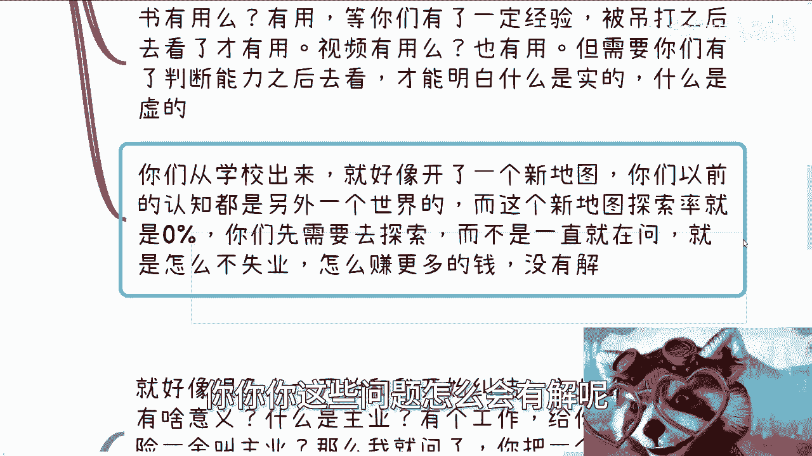

# 课程：什么是“接地气”？ - P1 🧠

在本节课中，我们将深入探讨“接地气”这一概念的真实含义。我们将剖析其本质，并理解为什么仅仅拥有学历或技能并不等同于“接地气”。通过本课，你将学会如何摆脱固有认知，真正理解社会的运作规则。

---

## 概述：什么是“接地气”？ 🤔

很多人询问“接地气”是什么意思。要理解它，首先需要明白“地气”指的是什么。这个词难以直接翻译，但其核心在于对现实世界的深刻理解。

上一节我们提出了问题，本节中我们来看看如何定义“接地气”。

---

## “接地气”的本质：理解真实世界 🌍

“接地气”的本质在于，你需要对社会、国家、制度、商业运作的真实情况有清晰的了解。记住，是**真实的情况**。仅仅通过实习或跟随导师做项目，并不能让你真正了解社会。那些经历往往只是让你扮演“工具人”的角色，接触不到核心。

许多人认为自己了解水面上的20%，但对水下的80%一无所知。以下是需要了解的关键领域：

*   **赚钱方式**：除了打工，你知道其他高性价比的赚钱方式吗？
*   **公司运作**：公司在什么条件下能良好运作？如何进行资本运作和融资？
*   **资源与晋升**：高校的经费从哪里来？企业内部的业务线如何划分？表面晋升制度下的实际运作规则是什么？
*   **行业规则**：协会、商会如何运作？国家标准、团体标准如何制定并产生作用？

如果你对这些没有概念，那么你很可能并未真正“接”到中国的“地气”。

---

## 如何获得“接地气”的认知？ 🛤️

讲完本质，随即而来的问题就是：如何“接地气”？答案是：自己主动去“接”。你无法指望别人替你完成这个过程。

学校与社会是两个平行的世界。从学校毕业，就像开启了一张探索率为 **0%** 的新地图。如果你不去主动探索，认知将永远停留在原地。不断追问“如何不失业”、“如何赚更多钱”而没有实际行动，这些问题永远无解。

**探索率 = 0%** 意味着你对真实世界的认知为空，无法解决现实问题。

---

## 打破固有思维：重新定义“技术”与“主业” 💡

在交流中，我发现很多年轻人缺乏独立的灵魂，被灌输的思维所束缚。这体现在对几个概念的误解上：

以下是常见的思维误区：

1.  **“主业”与“副业”**：许多人将一份自己毫无主动权、随时可能丢失的工作视作“主业”。而将具有成长性和积累性的项目贬低为“副业”或“外快”。这导致他们将所有精力投入一个没有未来的地方。
2.  **“技术”的误解**：认为只有写代码、写论文才叫“技术”。但在商业社会，真正的“技术”是**完善的商业思维和全局观**，是能为各方创造价值的解决方案。
3.  **被灌输的价值观**：许多想法（如必须追求稳定、必须在乎他人眼光）并非与生俱来，而是社会灌输的结果。成年后，你需要有独立思想，分辨哪些是应尽的义务（如孝顺父母），哪些是无谓的自我绑架。

真正的竞争力不在于一纸文凭或单一技能，而在于**积累强绑定的人脉与合作关系**，以及**对行业全局的深刻理解**。

---

## “真”与“假”的辨别 🎭

社会存在大量“真”与“假”的认知陷阱。

*   **假**：认为有好学历、好技术就能横行无忌；认为大公司里都是精英；认为读完书人生就一片光明。
*   **真**：真正的“横行”需要深厚的关系网络和商业资源。大公司里“九成一成”是常态，大部分人是“工具人”或平庸者。毕业仅仅是真实人生挑战的开始。

你认为自己接的“地气”，很可能只是别人制造出来的“地面”，并非真实的世界。

---

## 培养判断力：实践出真知 🔍

如何获得判断真假的能力？唯一的途径是**尽早进入真实社会进行实践**。

最好在大一、大二时就开始行动：
*   多接触社会上的各色人等。
*   多参与实际项目，无论结果是赚钱还是被坑。

只有通过亲身经历，你才能积累经验，形成自己的判断力。纸上谈兵或等待他人灌输，永远无法真正“接地气”。

---

## 总结 📝

本节课中，我们一起学习了“接地气”的深刻内涵。它并非一个虚词，而是指**对社会运作规则、商业本质和人性现实的透彻理解**。要获得这种认知，你必须主动跳出象牙塔，在实践中探索那张探索率为0的社会地图，打破被灌输的思维枷锁，培养独立的判断力和真正的商业思维。记住，真实世界看重的是你创造价值、链接资源的能力，而非一纸空文。