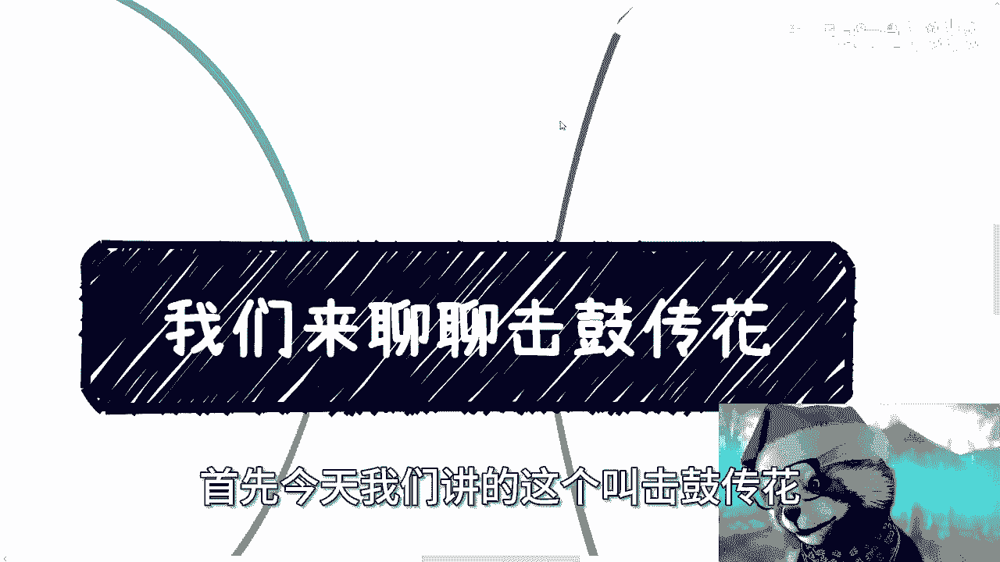
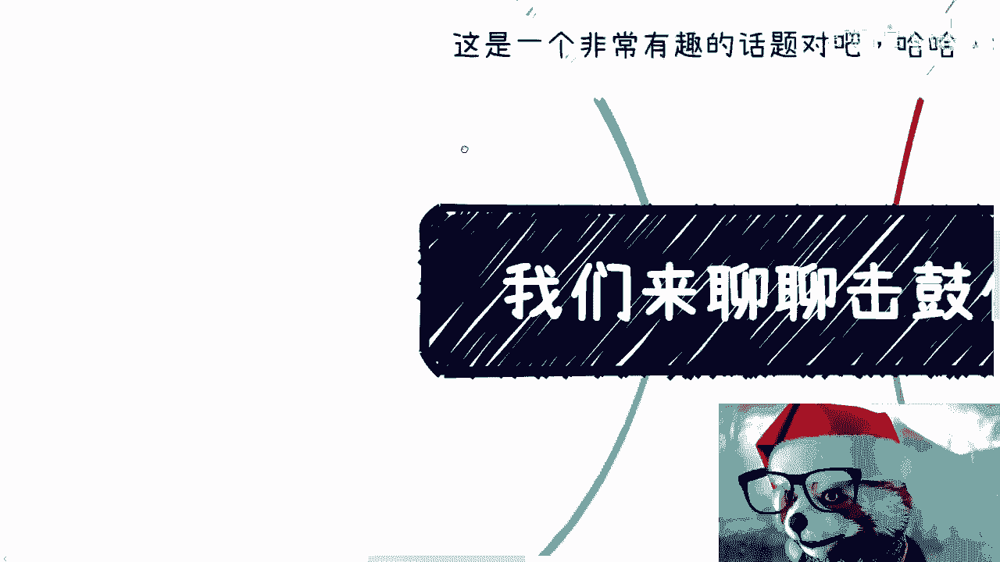
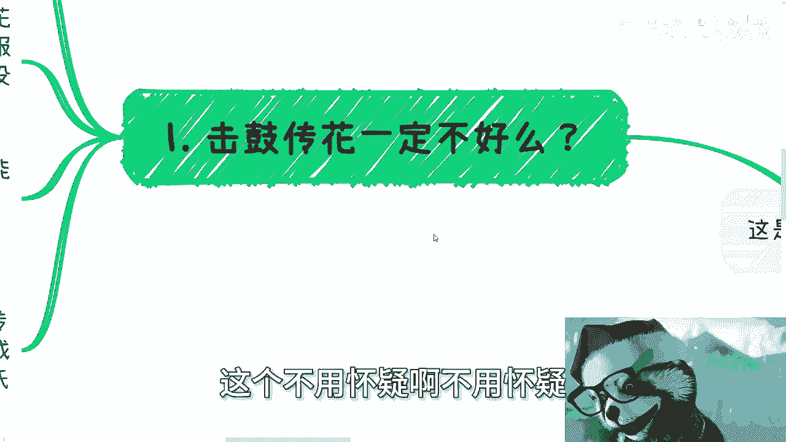
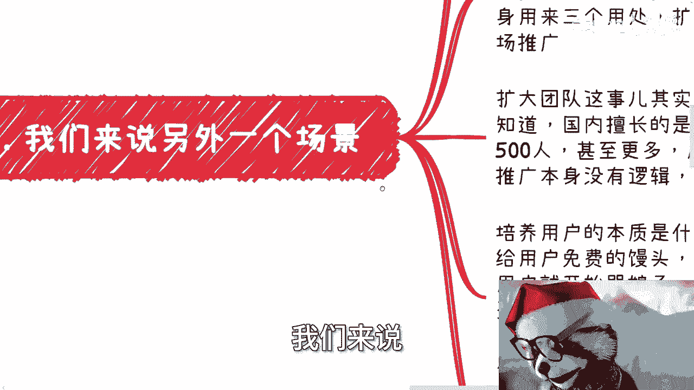
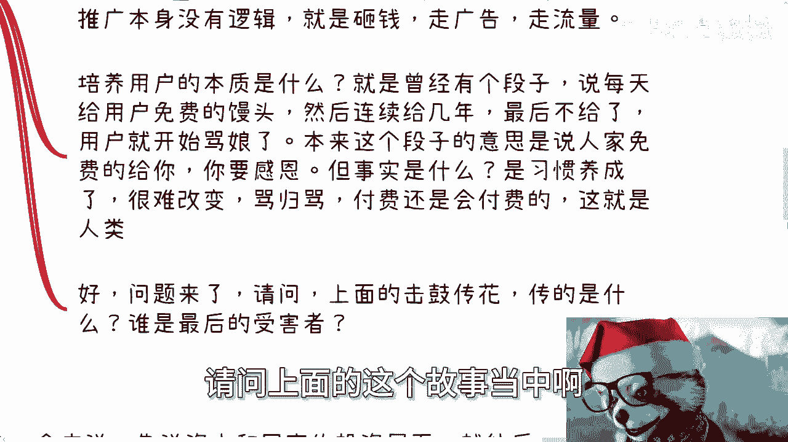
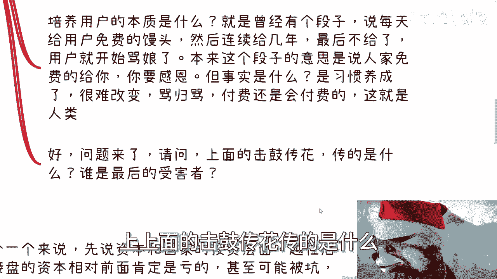
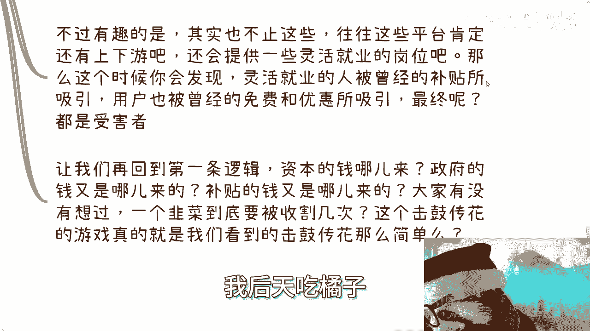
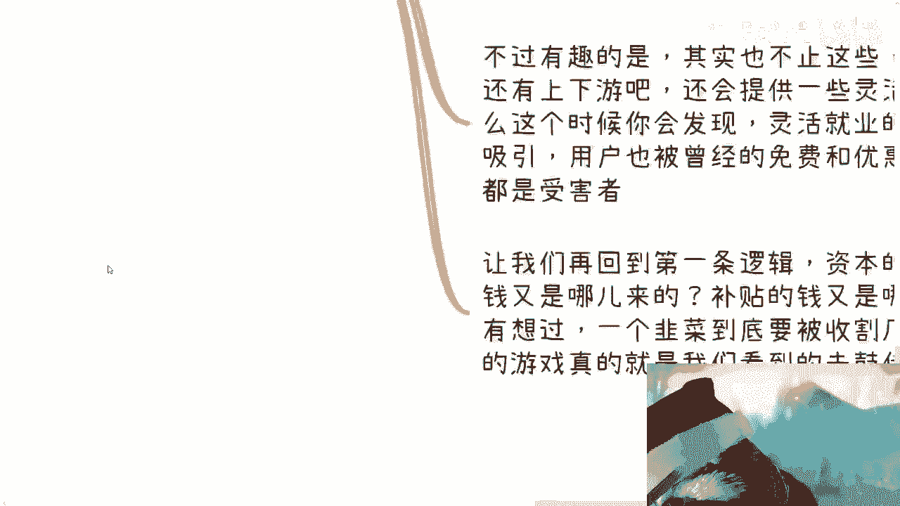
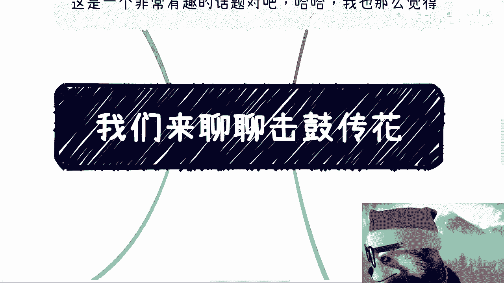

# 我们来聊聊击鼓传花吧 - P1 - 赏味不足 - BV15K421b7Aj

嗯好啊，这个我们今天来讲这个话题啊。

呃前两天小伙伴一直说我买一点点啊，我今天换了换成茉莉奶奶白了啊。

嗯哼首先今天我们讲的这个叫击鼓传花对吧。

我这边写了啊，这是一个非常有趣的话题对吧，我也这么觉得呃首先我先说结论啊。

结论就是你们也好我也好啊，我们都是嗯最后来接盘的啊。

这个不用怀疑不用怀疑呃。

首先第一点啊，击鼓传花一定不好吗啊，呃其实我觉得所有事情呢你只要做的有价值啊，或者说你有拥有这个价值，落地模式跟方式无所谓，击鼓传花呢只不过是一种形式对吧，就是说你价值能落地就好。

但是呢你会发现问题在于什么，问题是在于说嗯我们为什么要去击这个鼓，我们为什么要去传这个花，我打个比方，比如说啊，比如说我说我就是要吃苹果，而且我每天吃苹果吃的蛮开心的啊，然后你就跟我说不行。

你必须吃香蕉，那我也搞不懂我为什么吃香蕉对吧，那当然了，那对于我来讲，我这种愚昧的人来讲啊，我是吃苹果也好，吃香蕉也好，可能无所谓啊，我觉得也OK啊，好然后呢你就开始击鼓传花啊。

你就开始啊这个传传传传传啊，传了跟我说啊，你看啊，本来这个苹果呢我每天吃啊，我只要花一块钱，打个比方，我只要花一块钱，这个时候呢你击鼓传花传了一圈下来给我吃，吃到了香蕉啊，而且呢你还要不停的PUA。

我说你就必须吃香蕉，那么我也不知道为什么要吃香蕉，对吧好呃，你发我，我最后就会发现哦，我本来一块钱吃个苹果蛮开心的啊，而且我也没什么追求啊，你现在非要我十块钱买个香蕉嗯，我也不知道为什么。

但是你现在让我再去买苹果，买苹果买不到了，你们仔细想想看这个例子啊，你们仔细想想看这个例子好，我们往下来说，比如说今天有个事情开始击鼓传花了，我们假设啊，我们假设先不说这个鼓是什么，花是什么。

但是这个服务或者产品落地的啊，它能够满足需求，它能够造福产业或者人民，那我觉得就没问题啊，也就是说它必须满足真实的需求，他不能伪造个需求出来对吧好，那么同样的一个击鼓传花的东西落地之后。

如果真的能也能比较带来比较大的利益啊，比如说他消耗了一百一百个亿啊，那么在一段可接受的时间，就是说不是特别长的时间里面，它能够持续带来利润嗯，能够回本，然后最后最终赚钱，那我觉得也没啥问题啊。

也没啥问题好，那么说到这个词啊，说到这个击鼓传话，我觉得很多人想到的一定是传销是吧，就就我觉得你们脑子里面想到传销，或者PQ币啊，或者说虚拟货币啊，那么呃其实很多人脑子里面的击鼓传花呢。

就是不停的找人接盘，你说这句话对不对呢也对，但是还是那句话没有这么简单啊，那么最后呢他可能会演变成另外一个词，叫庞氏骗局啊。

但是事实上来讲有这么简单吗，肯定没有对吧，我们往后看啊，我们来说我们先来说一个场景。

这个场景比如说啊我们曾经在视频呃，在那个资本运作的视频里面有讲过专门的一期，说什么叫做资本运作对吧，在众多的资本运作当中有一条是什么，就是不停的融资，培养用户习惯，这个东西我以前去过啊。

然后最上走上IPO，或者说走上收购，或者说并购，或者说什么什么什么什么呃，这个这个收购别人对吧，或者说呃再继续融资的这么一种逻辑啊，那么嗯说到这个呢，我觉得很多人的脑子里面可能又会想出来哦。

可能陈老师讲的是A，可能讲的是B，可能讲的是C啊，但是呢我跟你们讲啊，不要对号入座，这种产品很多啊，我们不特指什么产品，或者你们仔细去探究的话，你会发现他妈的不是你们脑子里蹦出那些产品。

是大部分产品都这个吊样子啊，好那么我们假设啊，一开始这个业务本身需求上并不大，或者说他压根就没有需求啊，但是呢形态呢并不是一定要现在这个形态，就像我刚刚一开始的例子，就是我有没有吃东西的需求，有的。

但是我不想吃香蕉，你明白吧，就是我有这个需求，但是我不想吃香蕉啊，然后你就会发现啊，他就给我击鼓传花了啊，然后不停的融资，不融资ABCDE这样融下去啊，然后砸钱啊，砸钱呢本身有三个用处，扩大团队。

培养用户习惯以及市场推广，那么我们一个个来说啊，扩大团队这个事，其实在国内我可以说只要报过啊，也可能不一定互联网项目只要做过，就是国家类的，或者说网上申报项目的这种，我相信你们都懂。

就是国内擅长的是什么，国内擅长的是把一本来100个人做的事情，非要报成300~500个人，那问你你你不要问我为什么，这还用问吗，你们想看还用问吗啊，甚至更多，反正未来不行了，再裁员啊。

这就是你们现在所面临的问题，这也是形成当下问题的原因，众多原因之一啊，中国原因之一只是因为你们现在还太年轻，你们不知道以前发生了什么，对啊好，那么市场推广本身我跟你讲，这就是没有逻辑性的。

市场本身推广就是砸钱，就是烧钱，就是走广告，走流量，这个我们就没什么好多说的好，那么培养用户习惯的本质是什么，我们讲讲到这个，我就想到以前有个段子说什么，说有一个人开了个馒头店，做的蛮好的啊。

然后呢有人来乞讨，来乞讨，这个馒头店老板呢为了心思就就就良心发现啊，呃他就每天限量，比如说200个啊，给那个乞讨的人，然后一给给了几年，给了几年之后呢，他发现也不能一直做菩萨做下去，对吧好，怎么办呢。

他最后不给了，给了两年，最后不给了，然后你就会发现那些乞丐开始骂娘了，哎本来这个段子意思是什么，本来这个段子意思是说人家免费给你，你要感恩，对不对，但是你有没有发现一个问题，这个段子并没有结束，为什么。

因为从事实角度来讲，乞丐感恩也好，不感恩也罢，这个馒头店该收费还是会收费，因为他不可能一直进行免费的公益活动，对不对，好，那么结果是什么，结果就是由于乞丐养成了习惯，你就算收费了，哪怕收的贵了。

他也会过来付你钱，你不要管乞丐付得起，付不起，你懂吗，他也会过来付你钱好，首先这件事情为什么，因为你养成了一个习惯，你就想是养了很养了一些韭菜，养了一些绵羊，对不对啊，你很难改变，你骂归骂。

付费还是会付费的这种这什么呢，这就是人类怎么办呢，好吧好好说到这个啊，有人就要说了，他说陈老师不是的呀，那照你这么说，乞丐可以去别的地方乞讨啊，我为什么要付钱呢，别的地方也有免费的呀。

大哥你有没有想过一个问题，这个段子，比如说今天在这个路上有个店对吧，他是击鼓传花啊，他是击鼓传花，你说有没有别的免费的，有啊，那这就是另外一个激活传号的故事了，那你会发现你从宏观角度来讲。

你去哪个免费点有区别吗，有没有区别没有啊，因为你最终都要被割，你知道吗，你最终都是会接盘的那个人，就是早接晚接的问题啊，有意味了没有意义的呀，啊就是因为你要明白，你活在世界上是个很复杂的世界对吧。

就像就像你消费你买东西，你你是你，你要消费的地方多了，又不是只在一个地方消费，你每天吃一一那个吃穿住行对吧，或者其他各个地方你都会要去消费，你不仅仅只不过就是说，你到底今天是在哪个地方接盘而已啊。

不是说啊，你说啊这个这个地方没有免费的，我要到别的地方免费，这个世界如果能这么简单的话，也不至于发展成现在这个样子对吧好，那么我们继续往下讲好，那么问题来了，请问上面的这个故事当中啊。

上面的是不是说这个不是说这个段子啊，我就说这个那个那个那个那个这边啊，说这个业务形态啊，然后融资的这个事情，在上上述融资这个事情当中，上上面的击鼓传花传的是什么，以及谁最后是受害者好。

那么我们第3。1个个来说，先说资本跟国家投资层面啊，越往后的接盘的资本啊，或者说政府的这种资本相对前面肯定是亏的，甚至可能被坑啊，因为为什么，因为夜长梦多一个项目未来到底怎么样，没有人知道。

但是无论未来怎么样，之前的资本陆续都会在每次稍微退出一点，或者甚至陆续在C轮D轮左右的时间全部退出，那么无论最后怎么样，他们都是最后的赢家，因为他们那个时候已经沙滩游艇嫩模了，对吧好。

无论他们以前吹过多大的牛皮都没有用啊，无论你现在怎么去网暴，他们也没有用，因为事实证明他们赚到了钱，而且他们没有什么不合法的地方对吧好，那么除了早期的员工和股东以外，剩下进去的员工其实也是为什么。

因为咱就这么说，除了相对核心的业务的那些员工，既能得到钱，也能得到能力的锻炼以外，剩下的员工基本上就是陪衬啊，就是我们在招投标里面说的陪标啊，没什么区别的，就是说你剩下的员工基本上在能力上和赚钱上。

我可以我可以认为都是受害者，因为他们看似的确去了个不错的企业，他也看似拿了个不错的薪水，但其实他等于放弃了自己最好青春的时间，以及最好发展的机会，他认为我去了一个好的企业是能够得到发展的。

但其实他只是一个陪标，就这么简单，你可以说企业利用他们的无知，企业利用了他们的年轻，利用什么是不重要啊，重要的就是他们就是接盘的人，未来缩减的时候，这些人就是缩减对象对吧好，那么最后一定说的就是用户啊。

用户被钱砸出了习惯，甚至原本使用的，就像我刚刚说，我原本吃苹果，我他妈都吃不没，没苹果吃了，被资本干掉了，我只能吃香蕉对吧好，那么原本的苹果呢活不下去了，那么用户不得不从苹果的习惯，切换到香蕉的习惯。

那么你会发现，当砸钱结束之后，我是什么，我就是，为什么，因为你不吃香蕉怎么办，你不吃没得吃，你怎么办，你不吃也得吃，就像我刚刚说的，他喂你一口屎，你也得吃，对不对啊，好那么我们继续往下啊，还没讲完啊。

不过有趣的是，其实也不止这些，因为你会发现往往平台肯定它会有上下游，它不是一个单点的东西，对不对，他一定会有合作伙伴，会有上下游，对不对啊，我没有特指哪个平台啊，你们不要瞎想啊，那么那个是真。

那么这个时候你就会发现啊，对吧，用户呢也会被啊曾经的免费跟优惠所吸引，但是问题最终呢就是你每次被吸引的人，其实都是击鼓传花接盘的一部分，但是最终呢当这个花接不动，当当这个花那个船不动了呢，怎么办呢。

对不对啊，好那么让我们再回到第一条逻辑啊，请问资本的钱从哪里来的，政府的钱又是从哪里来的，补贴的钱，他他妈又是从哪里来的，大家有没有想过对吧啊，我就问，我作为一个原本吃苹果吃的蛮开心的人啊。

我原本作为一个没有一块钱买个苹果，没有压力的人，我到底要被割几次，因为我你们想想看啊，我今天吃苹果，他可以给我换成香蕉，我明天吃香蕉，他后天给我可以给我改成橘子，我后天吃橘子。

他大后天可以给我改成西瓜，我就问我到底要被割几次，那么你们再反过来想想看这个击鼓传花的游戏，真的像大家所看到表面上这么简单融资，然后大家来接盘这么简单吗，他背后有多少东西啊。

对吧好，第四点，让我们再来举个例子。

按照刚刚按二的案例啊，同样的养成用户习惯之后，产品跟服务降价了呢，比如说啊我今天一块钱买一个苹果，他给我非要弄成香蕉，十块钱诶，这个时候他把香蕉变成了五块钱，我跟你们讲，你们看好了，大部分的用户。

但是他妈的你就没想明白吗，为什么我们原本一块钱的苹果不吃呢，我们吃的不是蛮香的吗，你明白吗，他们从来不会去想，这些产品跟服务到底是不是本来就有需求，为什么需要，需求是什么，是不是刚需，他为什么又出现了。

如果一个东西不是刚需，那么它出现了，又同时通过资本的方式培养用户习惯，最后它降价了，哪怕他妈的最后他免费了，这跟强行喂了屎有什么区别，我就问这跟强行喂了屎有什么区别啊，有什么区别，他免费不免费。

不他妈还是从我身上薅的毛吗，对不对啊，好很多时候很多时候我们只能看到表面的东西，我们可能看不到那个鼓是什么，我们也看不到真正的花是什么，但是很多或者说几乎一切的背后，你会发现你只要了解的足够多。

我就告诉你们一个结论，大部分东西背后都是击鼓传花，没有区别的，什么意思，就是不要来跟我谈什么价值，不要来跟我谈什么落地，明白了啊，就像就像刚刚提到的，不要来PU，不要让别人来PUA。

你们说你们其实有吃的，相较于一定比苹果好，凭什么啊，凭什么对吧，就是只不过你会发现，每天每年击鼓的角色不一样，传话的流程不一样，但本质上都是看谁最后接盘，但是你们再想想看啊，从整个金融循环的角度来讲。

最终接盘的是谁，最终接盘是谁，你们在拉到这个视频最早的时候，我说的那句话，谁是，就是谁，对不对，真的我真的觉得就是就是很多时候怎么说呢，就是哎你也你也不能说，你也不能说就说这个问题出在什么地方。

你说出在人性上面呢，还是出在，就是说就是说这个这个人是容易被洗脑的呢，还是怎么样的，我也不清楚啊，啊还是说人的这种记忆就七天啊，还是说就就就一段时间就消失了啊，但是问题是。

就是说就是说你如果真的能从全局去看，就竟然真的还有这么多人属于那种被接盘了，被动接盘了，还要去帮别人数钱，然后最后还说句谢谢哦，我我是真不太明白，对吧啊行啊，咱咱就是说这么多啊，说这么多嗯。

反正一样的啊，你们在融资，如果你们在融资啊，职业规划，商业规划啊，合同啊，包括有些什么自己想要去做点什么事情，在流程当中，在合同当中，在细节当中有些不清楚的好吧，你们可以整理好好吧，我们在做咨询。

哎这话题很有趣啊，我想想回头再给你们拓展拓展。

