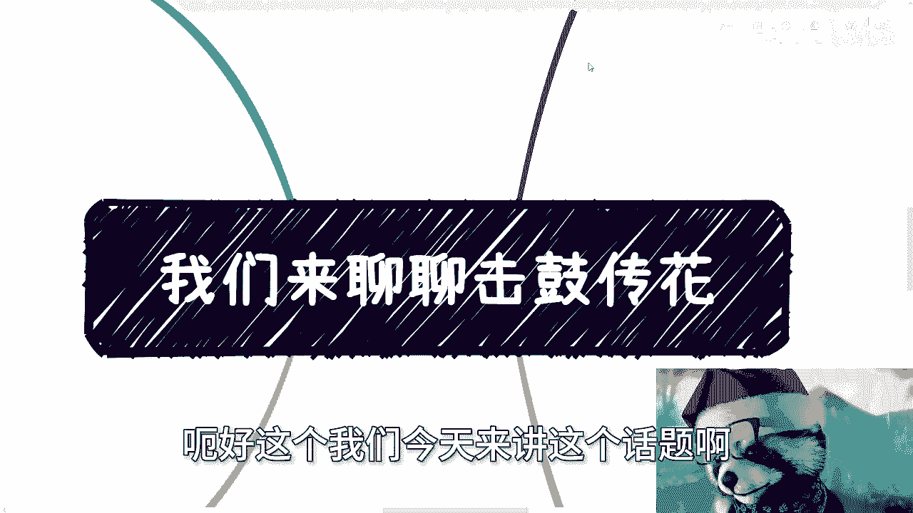

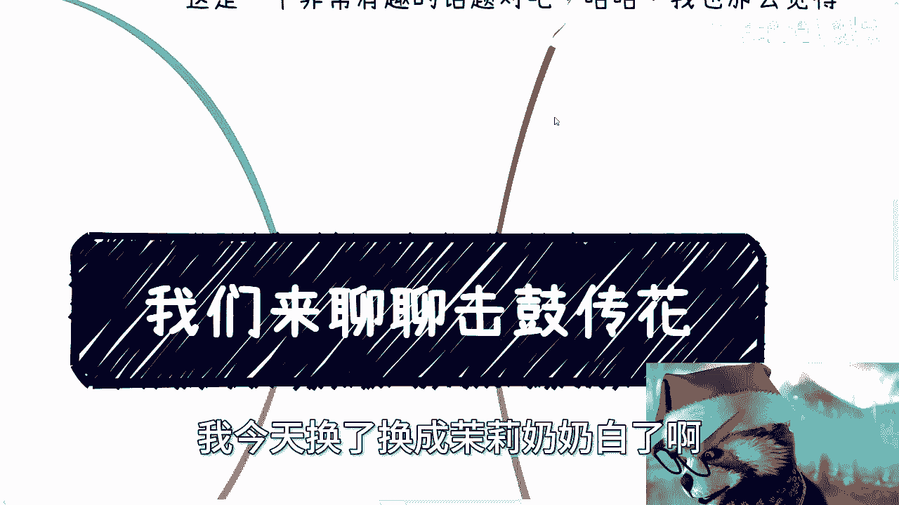

# 击鼓传花解析 - 课程P1 🥁

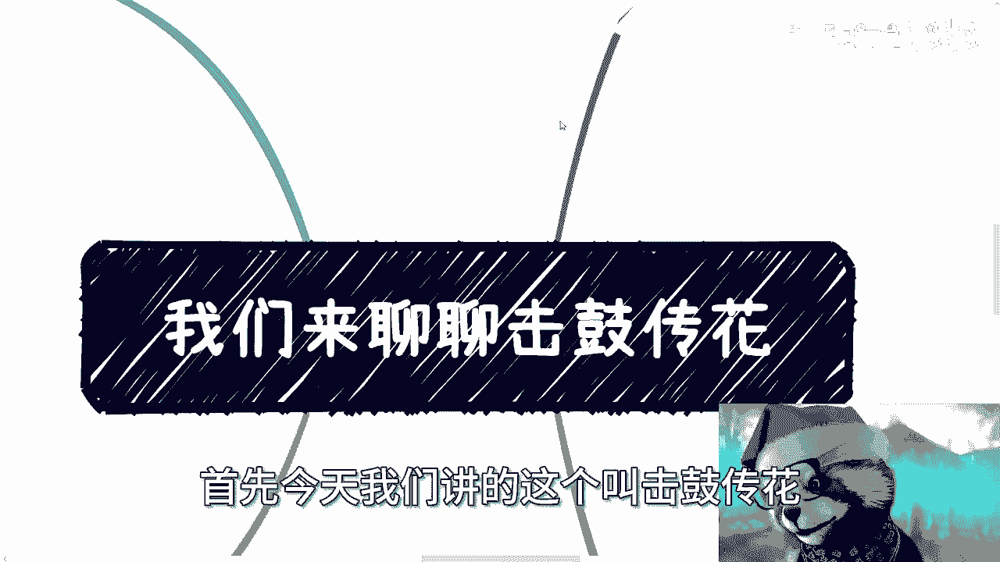

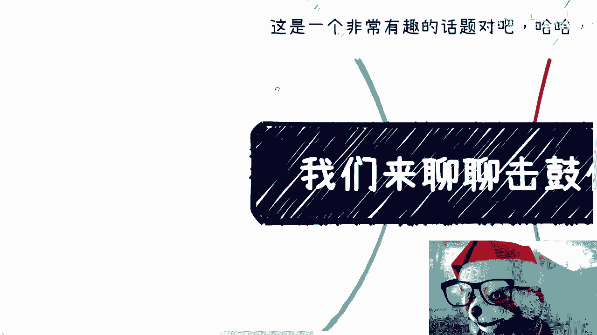

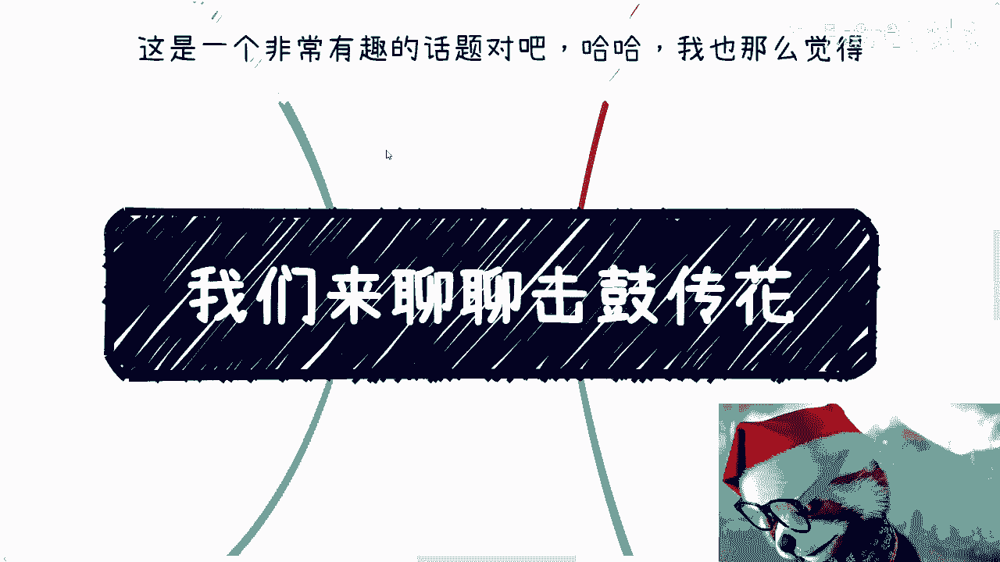

在本节课中，我们将要学习“击鼓传花”这一经济与商业现象的本质。我们将通过简单的比喻和逻辑分析，理解其运作模式、参与者角色以及最终的影响。

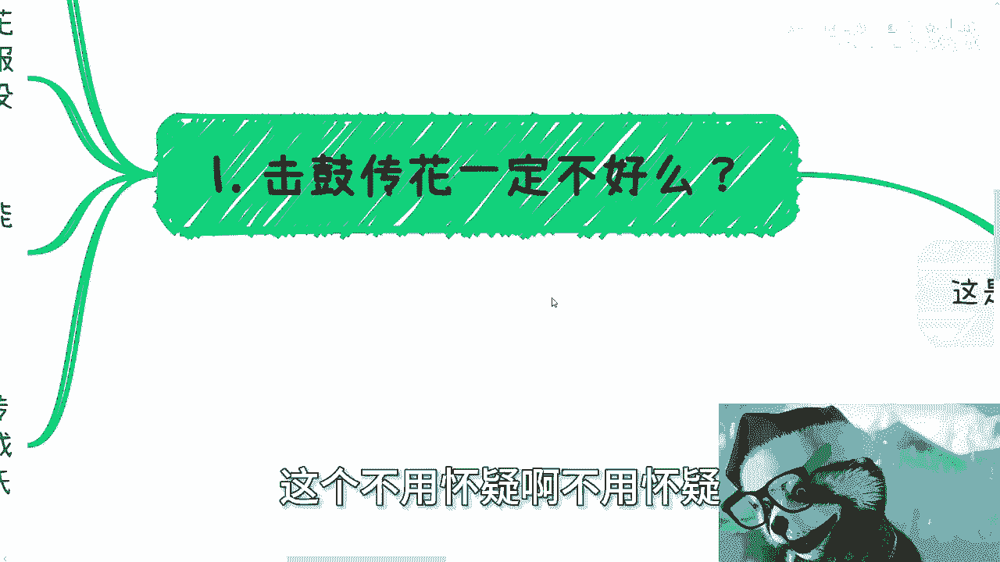

## 概述

“击鼓传花”是一种比喻，常用来描述一种价值或风险在参与者之间不断传递，直至最后一人接盘的模式。本节课将探讨这种现象是否必然负面，并分析其在不同场景下的具体表现。

## 核心概念解析

首先，我们需要明确一点：“击鼓传花”本身只是一种形式。关键在于所传递的“花”是否具有真实价值，以及价值落地的方式。

**公式：击鼓传花 ≠ 必然有害**
其性质取决于：`价值真实性` 与 `落地模式`。

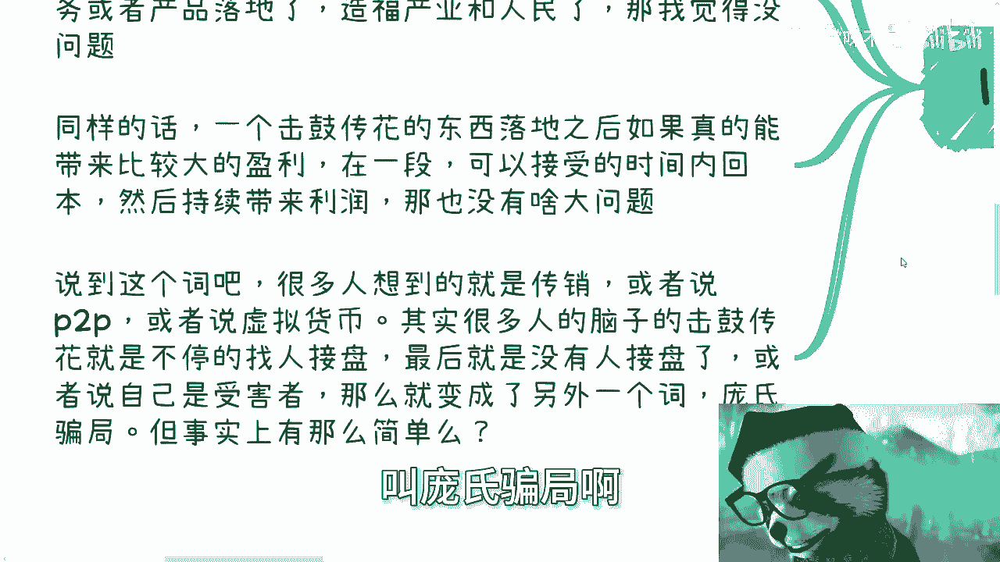

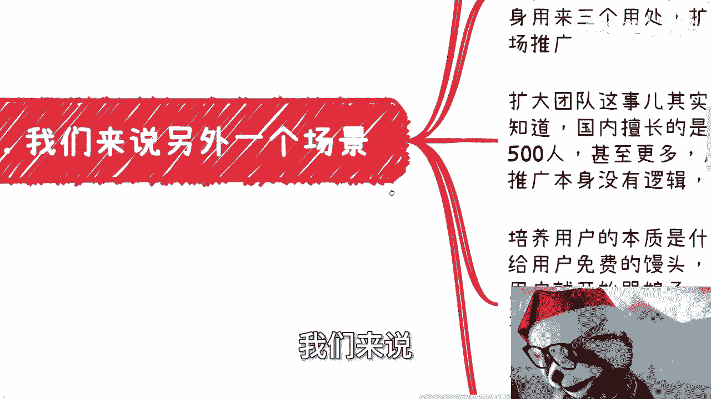

如果一项服务或产品能够满足真实需求、造福产业，那么即使采用类似“击鼓传花”的融资或推广模式，也可能没有问题。问题往往始于伪造需求。

## 一个生动的比喻：苹果与香蕉

为了便于理解，我们引入一个比喻。

假设一个人习惯每天花1元钱吃苹果，并且很开心。此时，有人开始“击鼓传花”，强行推广香蕉，并通过营销暗示“你必须吃香蕉”。过程如下：

1.  资本介入，通过补贴让香蕉变得便宜甚至免费，挤垮了苹果市场。
2.  用户习惯了获取便宜的香蕉。
3.  当市场形成垄断或习惯养成后，香蕉价格恢复至10元。
4.  此时，用户发现：原本1元的苹果已无处可买，只能接受10元的香蕉。

这个过程中，“鼓”是资本和营销攻势，“花”是从苹果到香蕉的强制需求转换。用户最终为不必要且更贵的产品接了盘。

## “击鼓传花”的常见形态与过程

上一节我们通过比喻理解了核心逻辑，本节中我们来看看它在商业世界中的具体实施过程。许多互联网产品的发展轨迹与之相似。

一个常见的场景是：一个需求不明确或本不大的业务，通过持续融资来“培养用户习惯”，目标在于上市（IPO）或被收购。

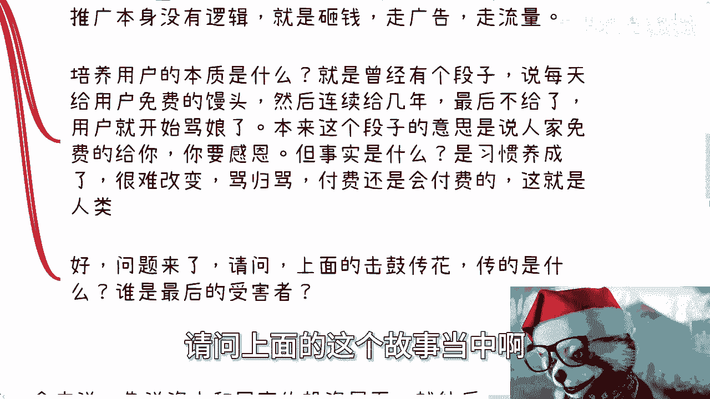

以下是其典型的资金用途拆解：

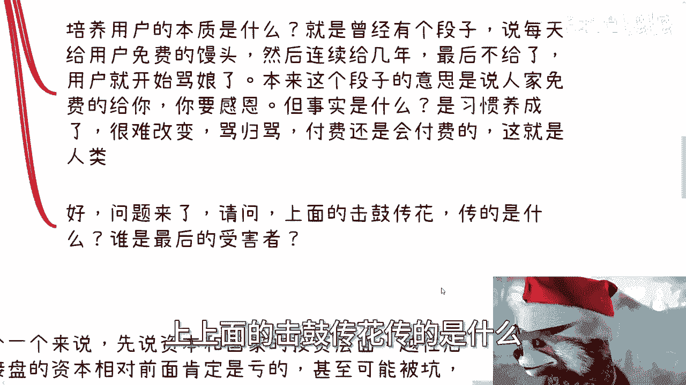

*   **扩大团队**：通常会将实际所需人力夸大，以便消耗更多融资，后期再行裁员。
*   **市场推广**：简单直接的烧钱模式，用于广告和获取流量。
*   **培养用户习惯**：这是最关键的一环。通过长期补贴、免费或优惠，使用户产生依赖，就像“馒头店长期免费送馒头给乞丐，一旦停止，即使收费乞丐也可能被迫购买”。

## 谁是“击鼓传花”的受害者？

理解了运作过程后，一个关键问题是：在这场游戏中，谁最终承担了损失？

以下是主要的受害者分析：

1.  **后期接盘的资本与投资方**：项目风险随时间增加，后期进入的资本或政府基金更容易亏损，而早期资本往往已获利退出。
2.  **非核心员工**：大部分员工只是“陪标”角色，他们付出了宝贵的职业成长期，却未必获得对等的能力提升或财富回报，并在裁员潮中首当其冲。
3.  **用户**：用户是最终的接盘者。他们被资本砸钱培养的习惯绑架，失去了选择更原始、更廉价替代品的权利，最终只能接受涨价后的服务或产品。
4.  **整个经济循环**：更深层次看，资本和补贴的钱最终来源于税收和社会财富。用户作为纳税人和消费者，可能在不同领域被反复“割韭菜”，从苹果到香蕉，再到橘子，循环接盘。

## 反思：降价或免费就是福音吗？

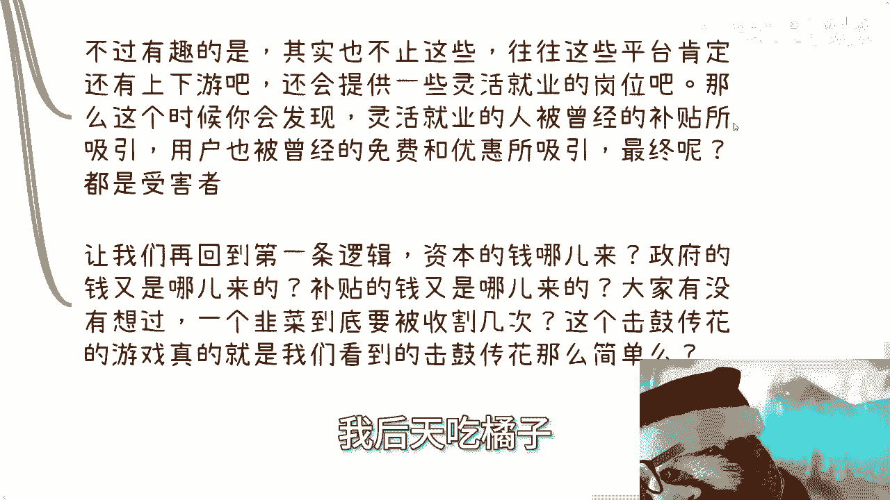

即使养成习惯后产品降价甚至免费，也值得警惕。关键在于，这个需求是否是真实的“刚需”。

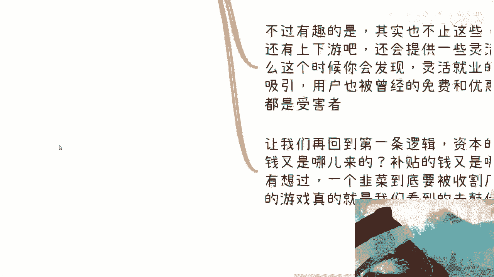

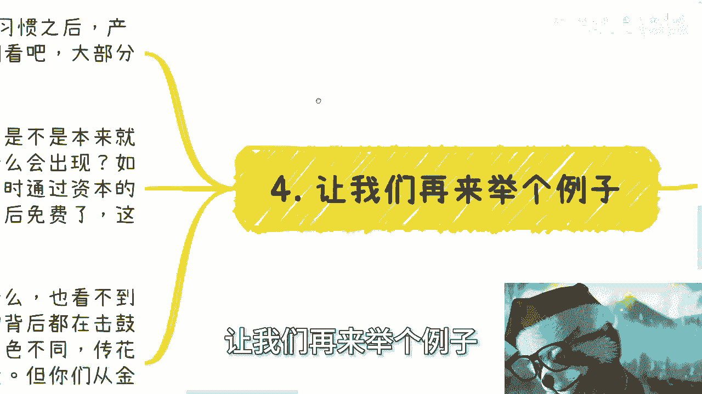

**代码逻辑描述：**
```python
if not 是真实刚需：
    if 通过资本强制培养习惯：
        无论最终价格如何，其本质都是“创造需求并让用户接盘”
```

如果一种产品本非必需，却通过资本力量强行创造需求并改变用户习惯，那么即使它后来免费，其成本也可能已通过其他形式（如数据变现、生态垄断）转嫁回用户身上。这与“强行改变选择”无异。

## 总结

本节课中我们一起学习了“击鼓传花”现象的本质。我们得出结论：

1.  其核心是**价值的传递与接盘**，形式本身中性，但常被用于传递虚假价值或转移风险。
2.  通过“苹果与香蕉”的比喻，我们理解了**伪造需求**和**习惯绑架**是如何使用户成为最终受害者的。
3.  在商业融资场景中，过程表现为**融资→烧钱扩大团队/推广→培养用户习惯→寻求退出**，受害者包括**后期资本、普通员工和用户**。
4.  最终，**整个社会经济循环**可能为此买单，用户在不同领域反复接盘。

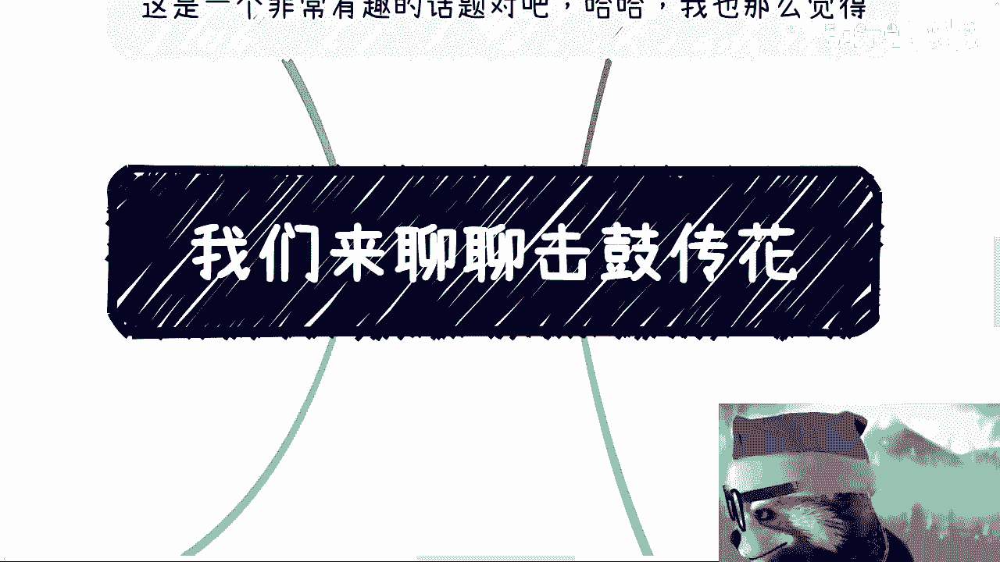

关键在于保持清醒：审视一个产品或服务是满足了真实需求，还是被资本创造出的伪需求。不要为不必要的“香蕉”支付“苹果”十倍的价格，更不要为接盘的行为鼓掌。