# 我们来聊聊商业上的“夫妻店” - P1 - 赏味不足 - BV1fU411K7pD

好大家好啊，这个前两天评论区啊。

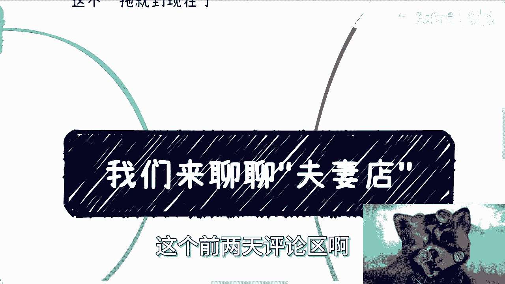

有人有小伙伴啊，这个让我聊一下夫妻店是吧，我那天跟他讲。

我说我会来聊一下的啊，但是这个嗯这拖累时间有点长了啊。

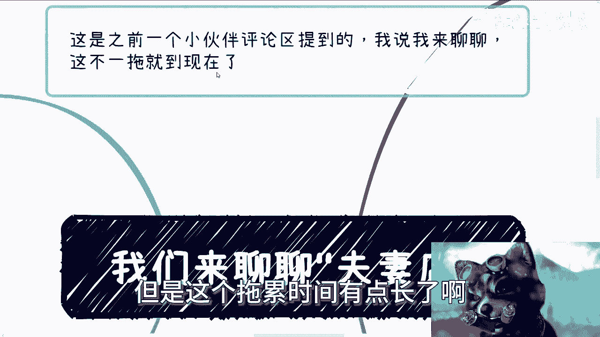

但是我还记得这个事啊，呃首先呢我们先来看看什么是夫妻店是吧。

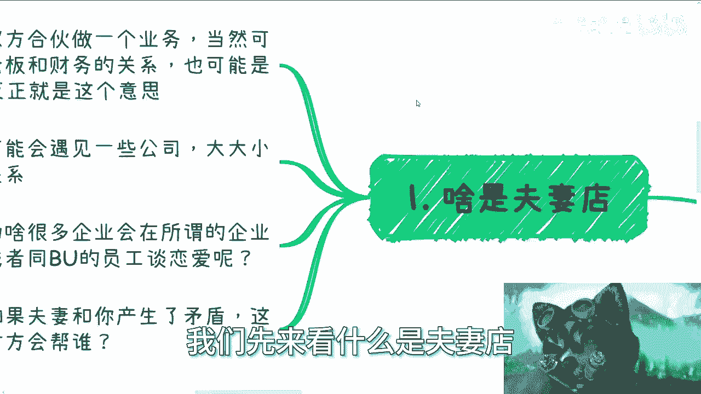

顾名思义啊，就是说夫妻双方合伙做一个业务，呃，当然也可以是合伙人啊，也可以是老板和财务的关系，就老板跟下属的关系都无所谓啊。

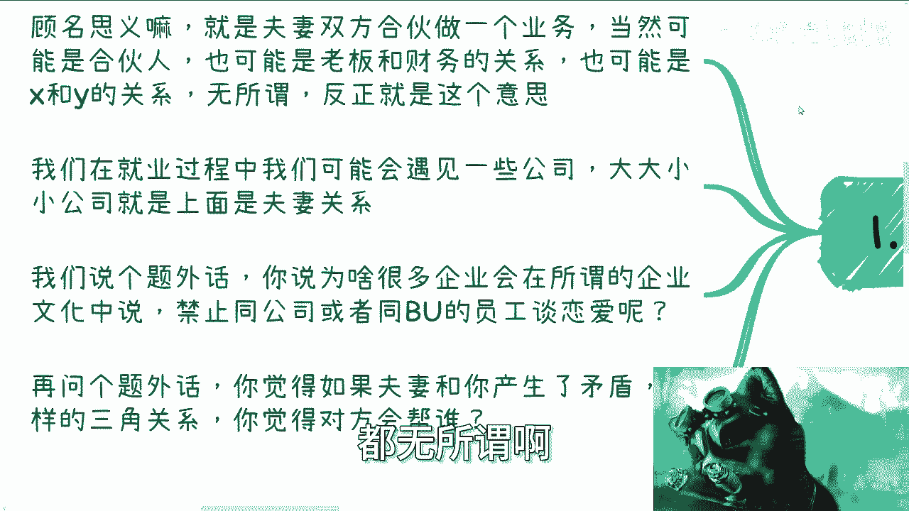

都无所谓呃，也可能是X跟Y的关系对吧，这个对吧，就是就我想表达的意思就是很抽象啊，无所谓啊，反正就这个意思啊，那么我们在过程当中可能会遇到一些公司啊，大大小小的公司呢，上面是这个夫妻关系啊。

呃我们说个题外话啊，你说为啥很多企业啊，会在所谓的企业文化当中啊，嗯提到一点，就是说禁止公司或者同一个这个business的啊，这个员工谈恋爱呢，对不对，你们想想看啊，你想想看对吧，就算他没有明文规定。

但是他也是不成文的规定啊，那么再说个题外话，你觉得夫妻如果啊，比如说今天是家夫妻店啊，他们双方跟你产生了矛盾，你处于这么一个三角关系，你觉得这个X跟Y它到底会帮谁。

啊你们想想看。

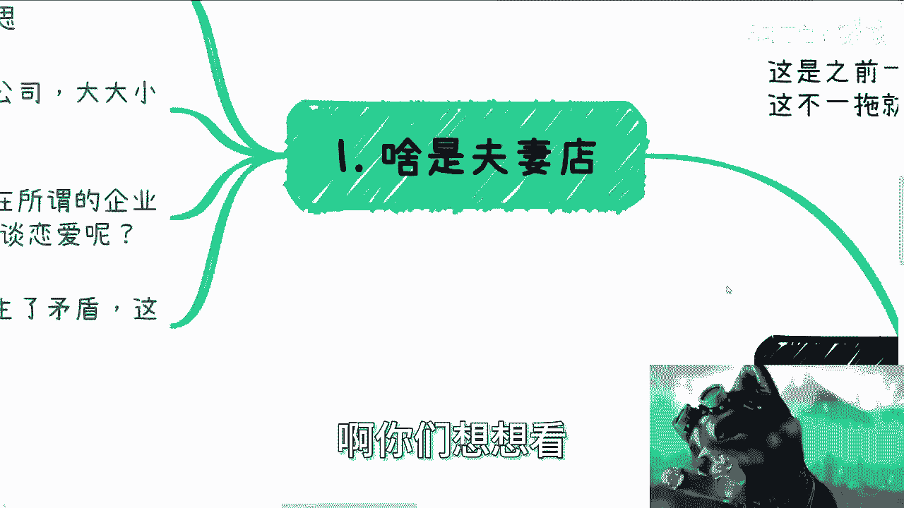

第二任何一个事情讲究一个平衡，什么意思呢，就是说其实你会发现，基本上是不存在真正的一言堂的。

无论在什么地方啊，总有所谓的平衡和制衡。

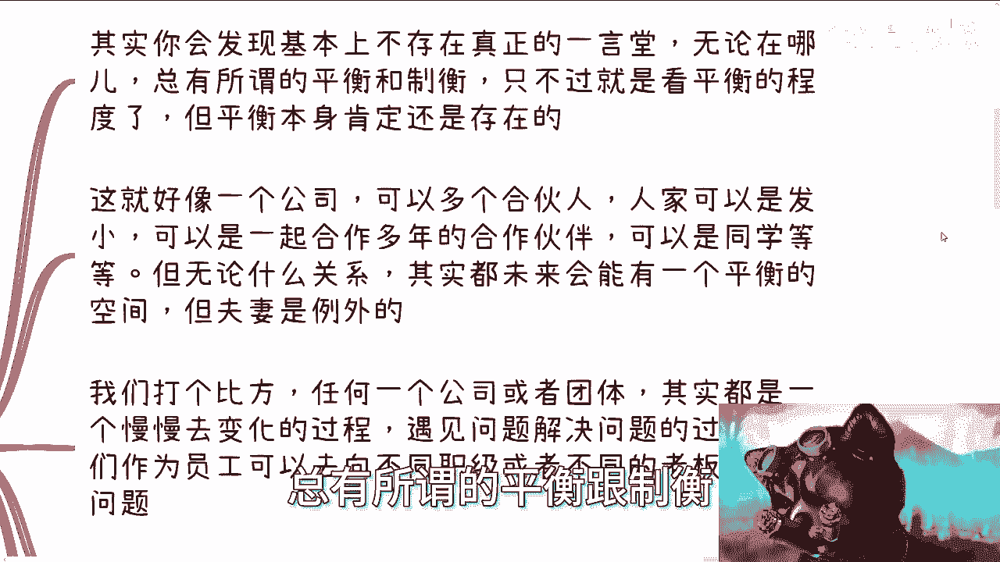

只不过就是看这个平衡的程度啊，但平衡的本身啊肯定是存在的，这就像我们就说我们一个公司啊，你可以是多个合伙人啊，人家比如说这些合伙人之间可以是发小，可以是一起合作多年的合作伙伴啊，也可以是同学啊。

Anyway，他们可能是各种各样的关系，但是无论是什么关系，其实都未来会有一个平衡的空间啊，但是你会发现夫妻是例外的。

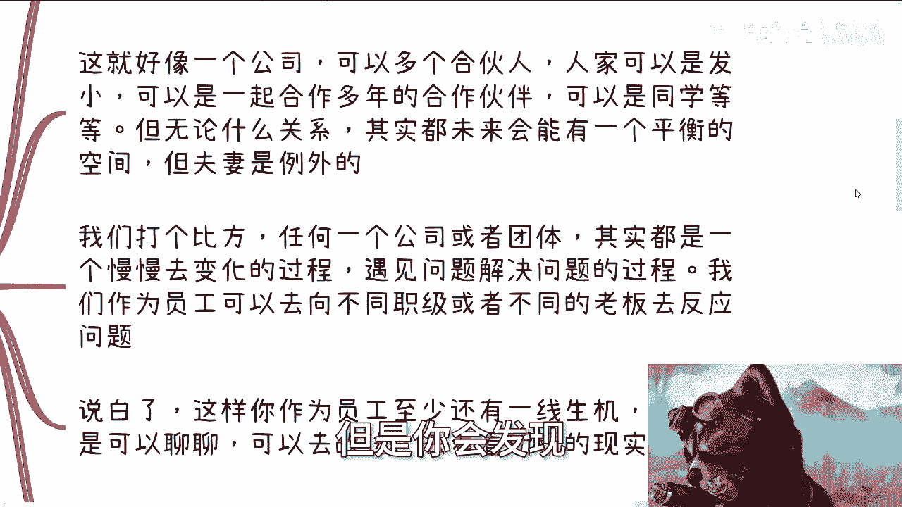

为什么你看我们打个比方啊，任何一家公司或团体，其实它都是一个慢慢变化的过程，也就是说你今天做一家公司，不管是这个公司文化，还是说这个公司的管理模式，还是说是大家沟通的这种这种方式。

它其实都是一个慢慢演演变的过程，或者慢慢进步的过程，对吧好，那么他怎么进步，进步就是要么就是比如说呃创始人老板啊，或者说hr他去发现问题，从而讨论出解决方案，要么就是由员工他向不同的职级。

或者他的直属领导啊，或者不同的老板去反映问题，因为大部分的这种创业公司，他的职级也不是那么分明对吧，反正这个跨级就跨级。

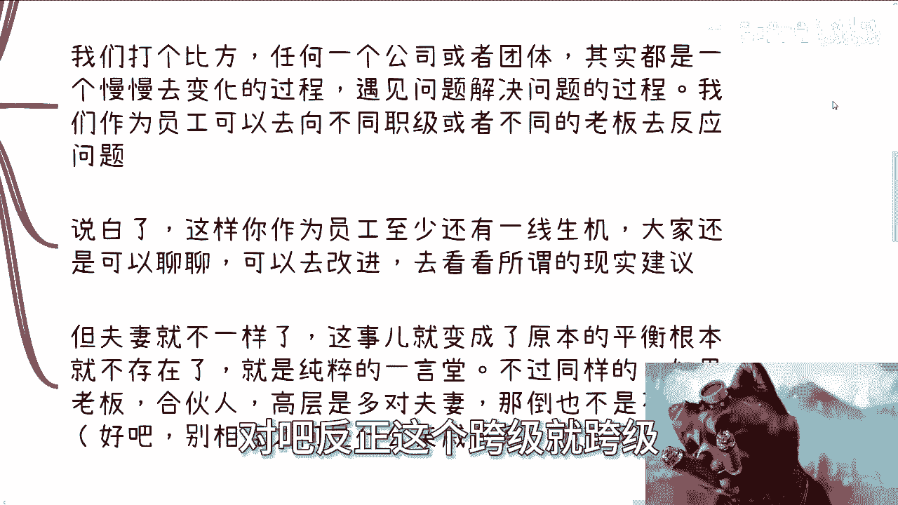

老板也不会太在乎这个事情啊，那说白了啊，这样子呢你作为员工啊，我就这么说啊，你作为牛马作为电池啊，作为早晚要被裁员的一份子呢，你至少还是有一线生机的啊，所谓一线生机。

就是说你至少还有一个可以反馈的一个地方啊，大家可能还是可以聊聊去改进，去看看所谓的现实当中的这个建议啊。

但是夫妻店就不一样，夫妻店就变成了什么，这事就变成了原本的一个平衡，它就根本就不存在了对吧，因为你夫妻店他就是一个一言堂，他就是一个人，你跟他谈什么东西呢对吧，你跟谁谈不是谈，但是你不能跟夫妻去谈啊。

当然同如果同样的啊，如果来说老板当中，合伙人当中高层当中有多对夫妻啊，那倒也不是说不行对吧，那当然啊我这边也严谨的跟你们讲的，如果那个别他们相互之间是个什么亲戚关系啊，那他妈又废了对啊。

所以说很多时候就是我们说制衡。

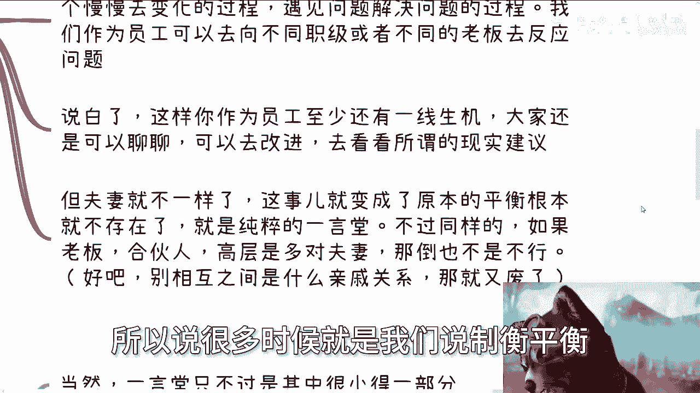

平衡就是这么个道理啊，那么第三点我们就来从实际角度出发，核心点病，其实你我就这么说，核心点不是在于它是夫妻店，你单纯说因为夫妻店，所以他不行，这个因因果逻辑是不成立的，对不对，但是核心逻辑在于哪里。

夫妻店往往是里到外也搞不好。

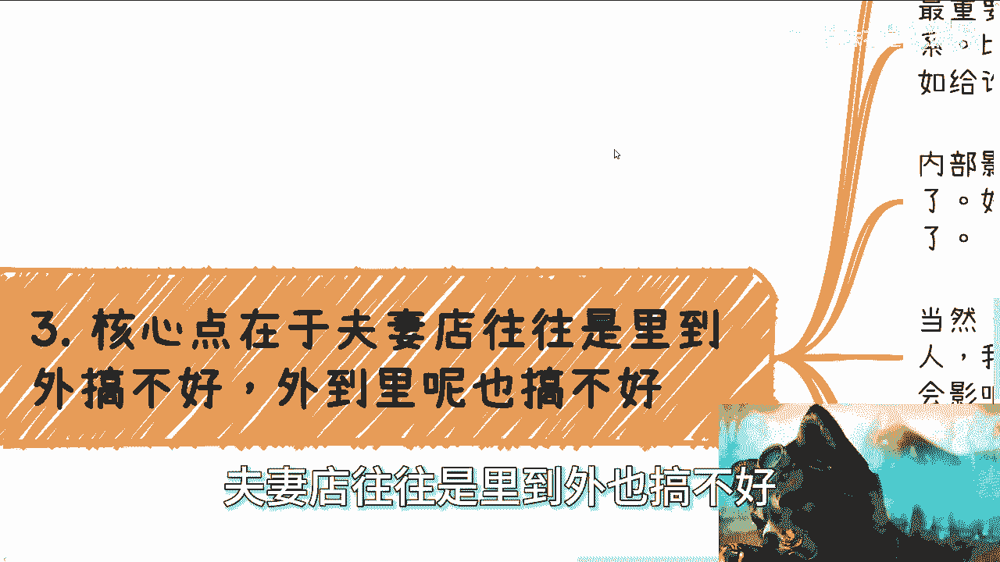

外道里呢也搞不好，你看啊，就像我这边说的，如果单纯只是一言堂，那无所谓啊，说实话真的无所谓，无伤大雅啊，那么最重要的是，外部的一些事情会影响到他们内部关系，比如说啊跟异性同事走得很近啦对吧。

比如说各种八卦关系啦，啊，比如说给谁工资多啦，对不对对吧，那那那那就相当于是他们内部矛盾了，那他们内部矛盾到底是怎么怎么引发的。

我们不知道啊，那么内部影响外部就更多了，你比如说他们两个人今天吵架了，闹不开心了，因为家庭琐事好了。

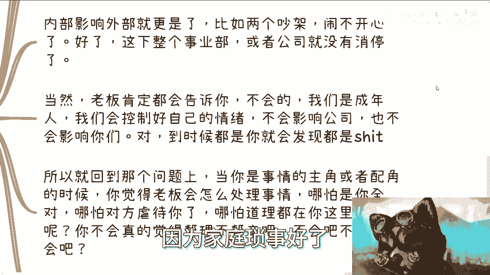

这下整个事业部或者整个公司它就没消停，你看着好了，没有办法的人就这个样子的啊，当然老板肯定会告诉你啊，不会的，我们是成年人，我们会控制好自己的情绪啊，不会影响公司，也不会影响你们，我跟你讲很正常。

他妈的是个人都这么讲，他总不可能跟你说啊，不行了啊，这个我们到时候闹矛盾，他妈拿你们开刀会不懒，会不来，你说是不懒对吧啊，但是我跟你讲，但凡这么说的，到时候你就会发现这些话都他妈是屁话啊。

所以回到那个问题上面，当你是这件事情的主角或者配角的时候啊，你觉得老板会怎么处理这件事情，就是什么意思，就是说如果当今天有就是闹闹了矛盾，你呢是一个当事人，或者可能是一个当事人的配角，那你就想想你。

你你觉得老板会怎么处理，哪怕你全对，哪怕对面虐待你了，哪怕对面把你按在地上摩擦了，哪怕道理都在你这边，然后呢你不会真的觉得帮你不会不帮亲吧啊，就那句话，不会吧不会吧，你不会真的这么觉得吧，对不对。

就我真的觉得就是大家幼稚也好，天真也好，也不能幼稚，天真到这个地步对吧，有人要说了啊，别那么绝对总有好的，对没有错，是总有好的，但是我告诉你什么叫总有好的和所谓好的，就是不可能让夫妻店这种模式存在。

你懂吗，他就不可能开这个头，你知道吗，但凡开了这个头，他妈就是，对不对，就这么简单一件事有啥好说的呢。

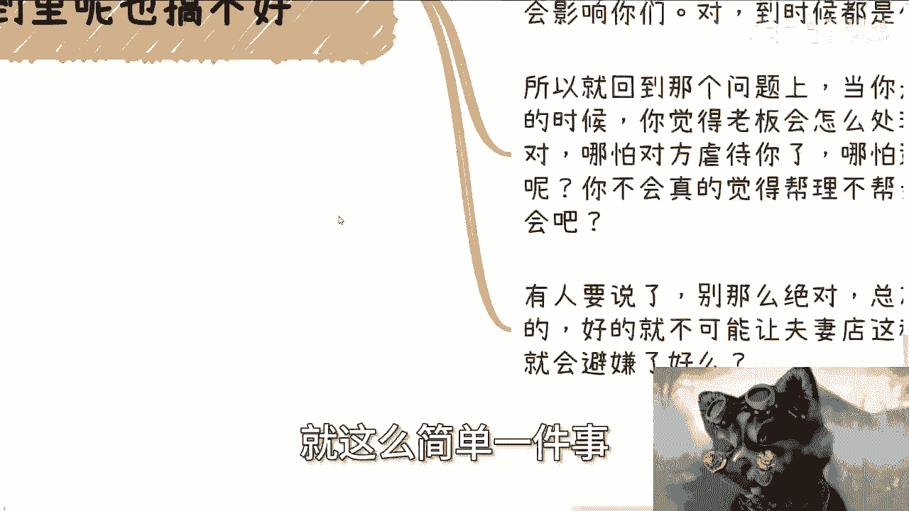

对吧啊，所以我们就一直说，我也跟大家说。

很多事跟问题它是可以避免的啊，就其实很多人问我怎么避坑，那B坑的前提是什么，前提是你得知道这是个坑啊对吧，就比如说我之前跟大家说对吧，股股权分配基本上是不能五五开，或者接近于五五开的。

卧槽还有人问我为什么不能五五开，那你怎么避开啊，避个屁啊，但是这类这类事你就算不了解，也容易去了解，你就扮猪吃老虎啊对吧，五五开也好，夫妻店也罢，你就出去问啊，你随便找些人问问朋友问问吧。

问社交里面的那些路人甲，路人乙问问，看看大家想法有什么不行啊，你就当作自己是个小白吗对吧，其实也都不是什么高深的问题，你聊两句就懂了对了，你问问别人爱股权能不能五五开，如果能，那为什么不能。

为什么不能多听听两句不就好了吗对吧，再不济你网上发个帖子问问，看看网友的说法，那也行啊，对不对，那很多事情我跟你讲，不是必须要做的，也不是说碰见了就一定要去做，什么意思呢，就是说也就是说什么。

也就是说你比如说你今天做一件事情，有人说哎我看好你，我想跟你一起合资，或者说我想拉你，让你当你当合伙人，你可能听下来觉得这个东西还不错啊，对方一顿操作猛如虎，说的你很心动，但这件事情必须要做吗。

不是对不对，你要去考虑对吧，要不要做，然后另外一方面就是你说今天有一个业务啊，这个业务可能很赚钱，但是需要你投资啊，那么也不是你必须要去做的，你也可以去了解对吧，然而呢你一定要去尽量的去拒绝你不清楚的。

不了解的东西，不要把所有的东西到你身上，比如说今天有人找你来，明天有人找你了，后天有人找你来，你不停的拉拉长战线，那你一直会很累啊，而且你累得没有成长，你累的也没有，也没有收入，你累了干嘛呢，对吧。

你只有拒绝掉尽可能多你不清楚不了解的东西，这样才能节省更多的时间了，对不对，那所以说你是其实夫妻店也是一个道理，你今天去去去去一家公司，你发现这是夫妻店，你就可以不去啊，我为什么要去呢，我为什么要去。

一定要去搏这个概率，觉得对方啊是一个好人对吧，对方一这这对人是非常帮你不帮亲的。

你们脑子有毛病，对不对啊，所以啊所以啊就你会发现很多很多事情，他就是个悖论对吧，就像我昨天跟你们说，良心那一期是一样的，就是我要但凡没有良心，你们就看不到我的视频，你们能看到我的视频。

就代表我可能还那么有保有保有我的初心，跟保有我的良心，对不对，但是同样的我也不是那么有良心，我但凡是一个非常情怀化，有良心的人，那我早就被这个社会弄死了对吧，我也活不到今天，可能早就抑郁症。

可能早就怎么样怎么样，自自闭了对吧，所以任何事情他都有因也有果对吧，所以说就是说但凡你看到夫妻店，你就不要去搏概率，有啥好搏的呢，他上来就说就已经摊牌，摊牌就告诉你了。

哼就是就说白了就是我们就是拎不清的对吧，但凡拎得清就没这个店，就没这个公司啊，我以前其实咳咳咳，也去过那种那个夫妻那个公司有的啊，但是虽然我我不能以偏概全嘛对吧，但是我所在的公司的情况也是一样的啊。

就是有任何的问题啊，你要让他们解决很难，因为当时我在那家公司，一个是老板，一个是财务嘛对吧，然后另外一方面，就是他们自己自己有矛盾的时候呢，对公司整个业务影响也很大，没有办法的，逃不掉的这个事情。

人人脉对吧好吧，然后呢，我觉得就是啊，这个这个B既然当时答应了那个小伙伴啊，那我就还是要说一下这个问题好吧，但是我觉得这个其实这个问题还是蛮简单的，也不用单独来讲啊。

所以说就就就就当年前给大家说说娱乐呗对吧，开心开心，哎呀行，那就这么着吧好吧，然后我待会晚上还会给你们再准备一期，充电的啊，我打算把就是在赚钱过程当中所忌讳的啊，我们称之为这个大忌哦，我会把它列一下。

反正希望大家举一反三吧，好吧行，那就这么着吧，那个呃你们反正有任何详细的问题，或者或者说也觉得就是说想找些正常的人沟通，沟通啊对吧，聊聊职业，聊聊商业，聊聊不知道的东西啊，那你们可以整理好。

