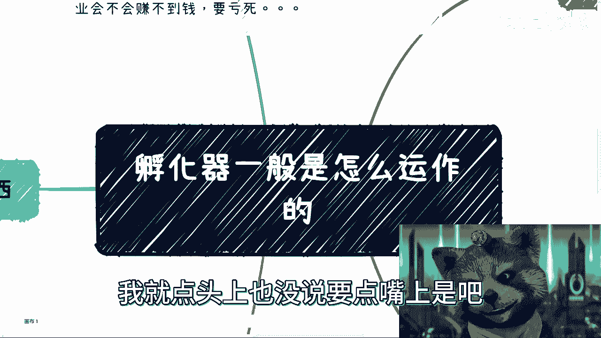
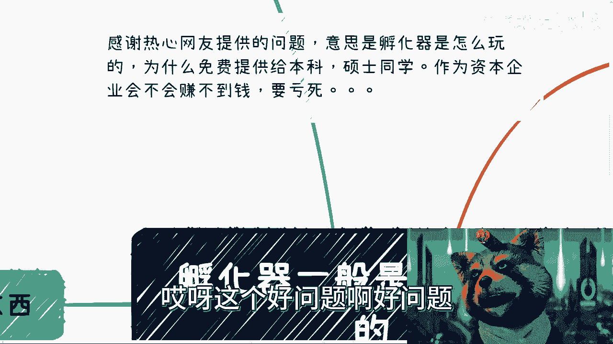
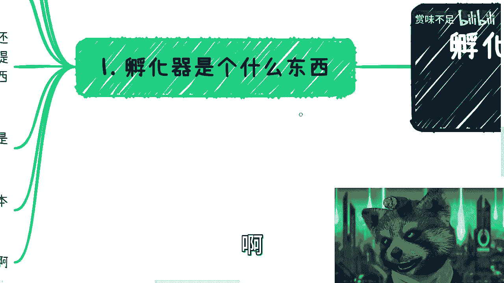
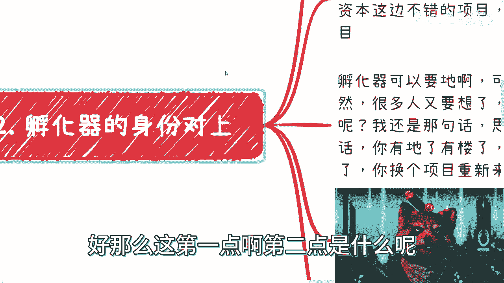

# 我们来聊聊孵化器怎么赚钱的 - P1 - 赏味不足 - BV1E14y1o7DV

啊大家好啊，这个小伙伴现在要求蛮高，校，就跟我说要点根雪茄啊，那你也没说点哪里是吧，我就点头上也没说要点嘴上是吧啊。

这个前两天呢有小伙伴私信问了这个问题。

哎我觉得这个问题特别好，哎真的就是吧。

我也很久没听到这个词了，他说热心网友是这么说的，他说呃孵化器是怎么玩的对吧，为什么免费提供给本科硕士的同学啊，作为一个企业家，作为一个资本企业会不会赚不到钱，要亏死是吧，哎呀这个好问题啊。

好问题是我这个之前还真没想到这个事儿啊，呃所以呢就是这个内容呢。

就孵化器一般怎么运作的啊，怎么运作的啊。

首先呢在这个地方我得先说一点对吧，那么魏老师为什么吕老师又懂了呢，因为我被坑的多啊，就这么回事，因为我被坑的多对吧，嗯孵化器是个什么东西啊，是这样子的，首先啊说实话啊，我很久没有听到。

跟这个别人跟我提过这个词了啊，因为很有可能因为经济差啊，也有可能就我身边搞这些东西的人少了啊，这一方面，第二方面呢就这玩意儿呢其实蛮好玩的啊，因为呃你可以有一个你虽然叫孵化器啊，或者叫孵化器源啊。

但是呢哎你会发现好玩在什么地方呢啊，你可以有一个实体的园区，你也可以有一栋楼，你也可以有一个办公室啊，当然我跟你们讲，只要你们胆子够大，你也可以什么都没有，无所谓啊，你就跑出去说嘛。

你说我现在有个孵化器啊，我老牛逼了，我就专门孵化企业的啊，这个我企业就孵化了一千一千多家了，哎我跟你们讲啊，就是很多东西啊，一点关系都没有的，你知道什么意思啊，这个啊意思就好像是说你比如说我现在对吧。

等一下啊对吧，意思就比如说我现在头上有两根雪茄是吧啊，就就这种感觉，那么简单来讲是什么意思呢，就是说有很多人跟我提过什么，跟我提，比如说那个学历对吧，我就跟他讲，我说什么意思啊。

我说你今天就算你跑出去跟跟别人说，你是MIT毕业的，怎么了呢，怎么了呢，他是当场问你要要要你学历截图，他没有的呀，你管这么多干嘛呢，干就完了呀，怎么了呢，对吧啊，然后孵化器对吧。

顾名思义你就跟一个孵小鸡一样来对吧，扶持长大一个东西好，那么问题来了啊，孵化这个东西啊，你说你是提供场地呢啊，还是提供免免税，免那个免税免税店呢，还是说提供人才扶持政策呢，还是说提供融资呢。

还是说提供各种机会呢，还是提供曝光呢，还是总共提供啥啊，是不是啊好，那孵化周期是什么，你比如说你只孵化天使轮之前的对吧，还是说你会这个孵化之后，就是说后续还有些比如说这个长尾的服务对吧，你说好。

我今天孵化出来之后，我把你扔给了这个红山对吧，我说扔给哪里了对吧，还是说我只针对大学生孵化，还是说我只针对某个行业孵化对吧，比如说我我只做这种大学生导师项目呀对吧，还是说我是只做AI对吧，怎么样的。

其实你会发现啊，我给你们列这些，你们可能会去想，但凡我不练啊，你们今天到外面碰到一个人，比如说碰到我，我就跟你们说啊，我做孵化的啊，我这边老牛逼了，叭叭叭叭叭一大堆对吧，你们也不会问我为什么。

因为其实这些问题没有人关心，而且大部分人关心不关心的原因是，大部分人他压根就不懂他关心什么玩意儿，他只会觉得哦牛逼牛逼牛逼，然后听懂鼓掌没了。

他还能有啥呢，没了就这么回事，基本盘就这个样子呀，你能指望他能问啥。

是不是对吧，我觉得提这个问题的同学唉，就是他会问我，是因为他思考了这个问题。

他至少不觉得这是个make sense的事情，对不对啊，好那么这第一点第二点是什么呢。

我们来看啊，这个最大的一点呢，那首先第二点呢，这个这个名字叫孵化器的身份，对上，什么叫孵化器身份，对上呢，孵化器本身其实是个旧上，就是个承上启下的一个聚合平台啊，那么你比如说最大的一点是什么呢。

就是可以招商引资，最最大的一点就是招商引资，我就这么跟你们讲，为什么，最大的一点是这个是因为你只有招商引资了，你才能增加当地的税收跟KPI，对不对，那么你才能用这个东西去吸引政府。

政府是喜欢这个东西的对吧，你才能去吸引企业，企业也是喜欢这个东西的对吧好，那么我在这方写的很清楚，叫做什么呢，叫做经典的打A牌，满足自己B的目的啊，我停个五秒钟，你们想想看什么意思。

明白吧啊看到这个东西，我跟你们讲啊，大部分人是这么问我的，他说那吕老师这个我找不到，上映不到，这怎么办，他妈的重要吗啊重要吗，不重要啊，你现在要的就是个抓手，你现在要的就是个title，就是个东西。

你要的就是跟别人说，我他妈这边有一个有一个孵化园，我这边有个孵化器，我是这么审核个身份，你就出去瞎猫碰死耗子，怎么了呢，找不找到怎么了呢，Who care，对吧啊，你现在有这个东西。

总比你每天在这边跟我说，哎呀我现在薪资不高啊，哎呀我明天要被企业开掉了，哎呀我没有工作怎么办，总比这些好对吧，那什么叫经典的打A牌，满足B的目的是简单来讲，就是说你所有的这些东西其实只是个抓手。

你的抓手是为了让你有能力，有这个机会去跟政府对接，然而你跟政府对接之后谈的是什么玩意儿，你可以是别的东西，这就叫经典的，打A的牌，满足你B的目的，就这么简单，对不对啊，孵化器的身份啊可多了。

我跟你讲可以对接基金啊，资本啊，这玩法不要太多对吧，你可以帮资本撮合项目，你也可以自己投资本那边的项目，你也可以让资本投资自己，孵化器的项目不要太多，你随便做A也好，做B也好，做C也好，你都能赚钱。

就这么简单是吧，好孵化器啊，孵化器还有个牛逼的地方来，可以要地啊，可以要楼啊，可以要各种东西，什么电脑啊，什么乱七八糟，这样这种东西不值钱是吧啊，你随便IMAC随便要对吧，Mac pro随便搞是吧啊。

那当然很多人要想了啊，那要这些招不招商怎么办，我还是那句话，思维要改变，招不招的，到这是后话，你有了地，有了楼，你怎么忽悠都可以，对不对，是不是啊，几百万几千万，这忽悠起来不要太快啊，是不是回头烂了。

你换换个项目重来就好了，我就问嘛，你是不是金字塔顶顶层的人，你又不是你对不了，你今天就算做个孵化器，你对上面来讲，你还是个电池，你还是个工具人，你管这么多干什么呢，总有人给你兜底的呀，对不对啊。

然后又有人说哎呀不行的对吧，我怕的对啊，你怕你就别做，你赚不了钱，拉倒吧啊啊就这个样子啊，哎呀这个说说差说差不说差吧，文明你我他啊是我的问题是吧，啊这个孵化器的身份很容易去接政府啊。

那么管委会的各种会议展会展览等项目啊，这是个天然的身份啊，呃在这个地方也说一句啊，这些项目的差价呢也非常的高啊，也非常高，这个懂得自然懂啊，就不能再说了是吧，孵化器做得好的话呢，其实还能做人才输出对吧。

通过一些标准需要钱，哎这个标准的各个地方政府不要太多，对不对，因为这些东西都是刚需啊，什么税收啊，人才啊，就业啊，这都是刚需啊，对不对，说到这啊，那么我们先回到这个问题上面来，我跟这位网友啊。

我提一嘴啊，你们可能不知道的事啊，在政府这边很多的东西啊，它其实是有所谓的团队要求和团队标准呢，什么叫团队标准呢，就是比如说博士率达到多少，硕士率达到多少，本，本科率达到多少，其实说白了啊。

你们就是都就跟打那个卡牌游戏，跟打炉石传说是一样的，你知道吧，你们去了，你们给不给钱不重要啊，免费就免费好了，他也没指望从你们身上赚的钱，说不好，听听你们他妈的有钱了没有钱呀，对不对。

你们都是炉石传说卡包里面的卡，你知道吗，他要的就是根据政府的要求，凑足多少张卡去要钱就好了，就这么简单，什么你们做什么不重要，哎，无所谓，爱咋地咋地，你们每天在里面打炉石传说都可以，那么第三个啊。

孵化器的身份对象对吧，那我跟你讲多了去了啊，真的多了去了就牛逼，你怎么吹怎么来怎么来，怎么怎么怎么怎么大，怎么吹啊，比如说我可以孵化，我可以投资，我可以解决政策问题，我可以解决就业问题。

我还可以解决公共问题，我简直就是神，我什么都可以解决，经典空对空对空什么意思啊，就是什么叫经典的空对空，就是你自己想想看，你如果你今天跟一个做孵化器的人，你觉得你跟他之间有什么差别。

就有什么东西是他有的，你没有的有吗有吗，有没有哪些是他一定很大的壁垒，很大的门槛，他有你没有的，没有啊，这些东西你也可以有啊，不就靠吹吗，吹谁不会啊，对不对，所谓的呀，然后这是第一个。

第二个呢就是说比如对接高校啊，你可以提供实验室啊对吧，可以提供就业啊，哇高校不要太开心了对吧，你你你今天有个楼，要有几个教室，我靠不得了了对吧，最终能不能就业，重要不不重要，来先挂联合挂个牌啊。

什么什么实训基地，对不对，什么什么人才培养基地对吧，复旦复旦交大同济对吧，什么什么什么北邮对吧，浮灵灵星灵龙挂个牌啊，就你要明白所有东西明先行啊，有利利先行，有明明先行，结果不重要啊，不重要。

就这句话不重要啊，比如啊对接企业来呀对吧，至少是个战略合作吧对吧，然后说不定还能收会费对吧，收费收费并不是只有企业可以收的啊，只要你想收，你自己去定所谓的权益对吧，来个年费会员也不难啊，对不对。

你看不用多是吧，10万块钱一年，我靠不要太爽，是不是啊，你你的那个叫什么孵化器，从本质上来讲，它就是个资源的聚合体，哪些东西呢，学校企业个人C端销售营销市场啊，包括阿里巴巴，百度这种企业等等等等等。

全部都可以，对不对，这个在商业层面就是叫做抓手，就是什么意思呢，就是说你可以没有任何实的东西，但是你要有个东西去撬动，你得有个理由去撬动，你总不能跑到跑到协会这边说啊，我是一个无业游民，我今天想来合作。

对不对，那你今天跑到百度去啊，我是一个无业游民，未来合作可能问了对不对，你要跑到那边，直接跑到那个区啊，省市区的这种，比如说协会或者政府单位，对不对，或者或者什么科委啊，金星委啊，你直接跑过去。

你就说哎我这边是做孵化器的啊，然后已经有个什么几百家企业了对吧，什么AI的或者怎么样的，卧槽我不说，咱不说，咱们是不是跪着舔他们，那至少大家平起平坐对吧啊，那么这个是三啊，那么四呢怎么赚钱，对不对啊。

这个东西这个不要太多啊，那你一年比如说培训的500人，培训个1000人对吧，做几场，每个省市区政府都有补培训补贴的，你知道吧，一年总共几10万是有的对吧，培训补贴拿到人才，比如说博士率，硕士率对吧。

怎么样的人才补贴总会有的，各种补贴多了对吧，每个地方不一样对吧，这不是钱吗，这这这这不就是你们作为这个叫什么，炉石传说的卡牌给他带来的利益嘛，对不对啊啊，然后第二个对吧，政府会议啊，会议啊，活动啊。

展览的承接，这承接里面差价不要太大哦，对不对，第三啊，高校这边毕业生，他可以把这个学生推荐给猎头，他有难度吗，没有难度，反正就是推荐成就成不成，拉倒外包公司也是一样的。

成了拿整个年费的package的百分之多少，这不是躺赚是什么呀，对不对，还可以做FA对吧，就是给基金啊，给资本啊和项目做撮合，顺便蹭点原始股不爽吗，不香吗是吧，会员一年收个10万15万，我觉得不过分啊。

对不对啊，然后他还可以自己弄点奖项啊对吧，各种收费啊，以整合资源的名义做点培训啊对吧，做个培训几百万不是轻轻松松的事吗，对吧就我说到这我要说一句话对吧，就又还是回到那个考研的问题上面。

就是所有的人往那边卷干嘛呢，这么多人这么多路，能走不走干嘛呢，对不对好，那么说到这呢，是这样子的啊，有的人又要来杠杠杠杠杠，就他妈知道杠，对不对啊，很多时候我们只需要一个抓手杠是什么意思呢。

就是说你们仔细想想看孵化器有啥壁垒，是什么护城河，有什么没有，其实啊你别说没有机会没有关系，我今天就算这句话，我他妈把机会把关系扔到给你们，这你们接不接嘛，大部分人不是没有关系，没有机会。

他们没有胆子接呀，为什么，因为从小到大受到的教育就PUA的，结果就是哎呀，我要付出对吧，我要付出才有成果，我就是个老实人对吧，我一定要比如说我手上炉这个炉石卡牌，卡包里面必须要有60张牌，我才能打。

有个屁呀啊，我跟你们说，他妈的这些孵化器的人哪个不是空卡包过去的，空着卡包过去，然后慢慢慢慢再把这个卡包里面打打，卖60张卡呀，有什么关系啊，谁一开始就有60张卡过去打的，我说不好听点。

我他妈要有60张卡，我还需要用孵化器车抓手吗，不用了，我直接出去打不香吗，对不啦，都这样子的呀，所以说我跟你们讲，抓手是最重要的，别的不重要，怕什么，没什么好怕的，你知道吗，我跟你们讲，你们所有的恐惧。

所有的怕，所有的不敢都是你们YY出来的，你们根本就不知道他妈的社会怎么运作，你怕什么东西呢，对吧哎呀我真的就很无语很无语。

你知道吗，真的就我跟很多人都说说呢，他就会他还死跟你杠杠什么呢，就是没有的，这些东西普通人做不了的，我们只有一条路对吧，考研，然后往上面卷，嗯哼哼呵呵是吧啊对吧，我有我还是那句话。

我还是想到了这个微博上上课那句话啊，特别经典对吧，就是之所以叫普通人，就是当你跟他说真话的时候，他不愿意相信你，知道吗，当你跟他说一些伪装好虚伪的东西，诶，他不但很信，深深信不疑，还要跟你说谢谢哦对吧。

就这么着吧好吧，那个这个问题呢，反正就差不多这么个情况啊，然后其他一样的好吧，有任何这种哎我希望大家多给我提提问啊好吧，提一些像这种对吧，就是就看上去比较通用型的问题啊，不要提一些对吧。

特别那种什么细节的或者垂直领域的，我觉得这个不太好的对吧，没有通，不具备通用性好吧，然后其他的话反正有什么呃，职业发展啊，咨询啊，其实最近找我咨询电动车行业，新能源的数字经济的蛮多的，好。

就为未来做准备，要做发展，我觉得蛮好行吧。

