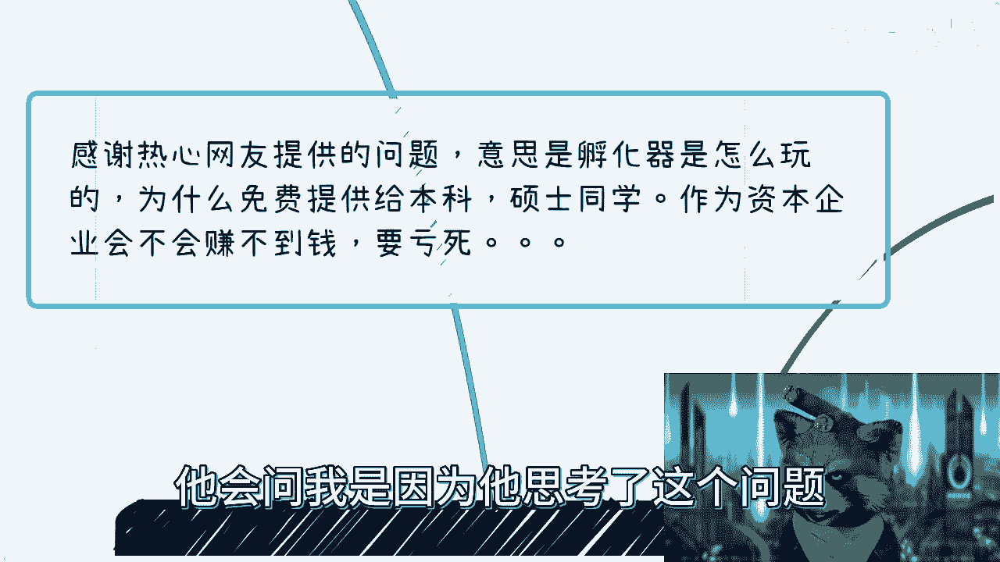

# 我们来聊聊孵化器怎么赚钱的---P1---赏味不足---BV1E14y1o7DV

在本节课中，我们将探讨创业孵化器的基本概念、运作模式以及它们如何实现盈利。我们将以简单直白的方式，解析这个看似免费提供资源给创业者的机构背后的商业逻辑。

---

## 概述

创业孵化器，顾名思义，旨在像孵化小鸡一样扶持初创企业成长。许多人好奇，一个免费或低价为创业者（尤其是学生）提供场地、资源和服务的企业，如何能够生存并盈利？本节课将为你揭开谜底。

---

## 孵化器的本质与运作模式

上一节我们概述了孵化器的概念，本节中我们来看看它的具体运作模式。

首先需要明确，孵化器本身是一个资源聚合平台，其核心作用是“承上启下”。它没有固定的形态，可以是一个实体园区、一栋楼、一间办公室，甚至只是一个概念。关键在于，它需要一个“身份”作为与各方对接的**抓手**。

以下是孵化器常见的几种运作形态：
*   提供物理空间（办公室、工位）。
*   提供政策咨询（如免税、补贴申请）。
*   提供人才与招聘支持。
*   提供融资对接服务。
*   提供行业资源与曝光机会。

其服务对象和周期也非常灵活，可以专注于大学生创业、特定行业（如AI），也可以只服务天使轮前的项目。

---

## 核心商业模式：身份即抓手

了解了孵化器的形态后，本节我们来深入其核心的商业模式。

孵化器盈利的关键不在于直接向入驻的创业者收费，而在于利用“孵化器”这个身份作为**抓手**，去对接更高层级的资源并实现利益交换。这被称为 **“打A牌，满足B的目的”**。

### 1. 对接政府，获取资源与补贴

这是孵化器最重要、最经典的盈利途径之一。政府有招商引资、增加税收、促进就业、吸引人才（如博士、硕士）的KPI需求。

孵化器通过聚集企业（无论这些企业实际运营如何），帮助政府完成这些指标，从而可以换取：
*   **直接补贴**：人才补贴、培训补贴、项目补贴等。
*   **物理资源**：低价或免费的土地、办公楼、设备。
*   **项目承接**：政府会议、展会、活动的承办权，其中存在可观的差价。

**简单来说**：入驻的创业者和团队就像是“炉石传说”卡包里的卡牌。孵化器需要做的是凑齐政府要求的“卡牌组合”（如一定数量的博士、硕士、注册企业），然后用这个组合去兑换奖励（补贴和资源）。卡牌（创业者）本身是否强大、是否付费，在初期并非首要考虑。

### 2. 对接高校与企业，整合资源

利用孵化器的身份，可以轻松地与高校和企业建立合作关系。

以下是主要的对接方式和收益点：
*   **对接高校**：挂牌成立“实训基地”、“人才培养基地”。高校需要就业出口和合作项目，孵化器提供场地和名义，实现共赢。
*   **对接企业**：建立“战略合作”，收取企业会员年费，提供资源对接、市场活动等服务。
*   **人才服务**：将孵化器内的人才推荐给猎头或企业，成功后收取佣金。
*   **财务顾问（FA）服务**：为投资机构和创业项目做撮合，赚取佣金或获取项目原始股。

### 3. 直接盈利项目

除了资源对接，孵化器也可以开发直接面向市场的盈利项目。

以下是几种常见的直接盈利方式：
*   **培训与认证**：开设创业课程、技能培训，并颁发证书，收取培训费。
*   **会费与会员制**：为入驻企业提供分级会员服务，收取年度会费。
*   **活动与奖项**：自主举办创业大赛、行业峰会，收取报名费、赞助费。

---

## 总结与核心思维

本节课我们一起学习了孵化器的商业模式。其核心可以总结为以下几点：

1.  **低壁垒与高灵活性**：孵化器本身没有太高的技术或资源壁垒，其威力在于“身份”和“叙事”。`成功 = 一个有力的抓手 + 持续的资源整合`。
2.  **抓手思维**：在社会运作中，很多时候你不需要万事俱备。你需要的是一个合理的、能让你介入游戏的身份和理由（即抓手）。有了抓手，资源、关系和机会才会随之而来。
3.  **空对空运作**：许多孵化器起步时并没有其宣传的雄厚资源，而是先利用“孵化器”这个概念打开局面，再在过程中逐步积累和兑现资源。这是一种常见的商业策略。

**最终结论**：孵化器并非依靠向初创者收费盈利。它是一个以“孵化”为名，行“资源整合与置换”之实的平台。其真正的利润来源于政府补贴、资源差价、中介服务以及利用聚合效应创造的新商业机会。对于创业者而言，理解这一点有助于更清晰地评估孵化器能提供的真实价值。