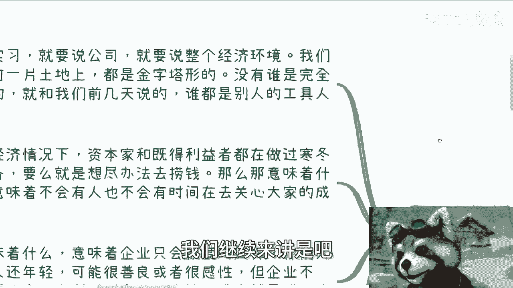
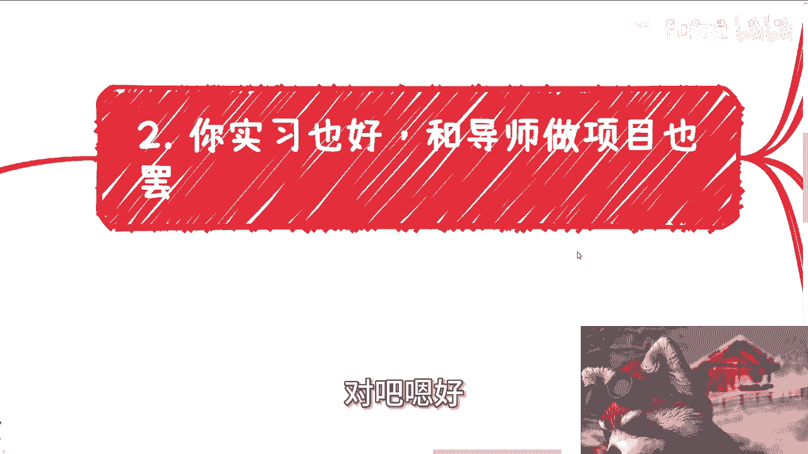

# 我们来聊聊实习和所谓的导师，还有同学吧 - P1 - 赏味不足 - BV1JE42137Yb

哈喽大家好，这个武汉活动我们继续报名啊，5月12号就是这周日啊，周日01：30到六点左右好吧，详情跟报名你们可以继续私信我啊。

那么今天呢跟着啊，我们上期说的那个读书的那个话题啊，和雪莉的那个话题，我们继续往下讲啊，呃就开始说这个实习啊。

还有导师，还有同学啊，为什么呢，因为在这当中这三个东西是提到最多的啊。

被被大众提到最多的啊，我们我们继续来讲是首先啊你要说实习。

就要说公司，因为实习这个东西是基于公司之下的，对不对，那公司就要说整个经济环境，因为公司也是要基于整个经济之下的对吧，那我们在任何一片土地之上，都是金字塔类型的啊，都是金字塔旅行的，没有谁是完全主动的。

就跟我们之前说的，谁他妈都是别人的工具人没什么区别啊，那么现在这种经济情况下面呢，资本家和既得利益者都在做过寒冬的准备，那么就是要想尽办法去捞钱，对不对，你不要去管他们，要脸不要脸，要脸不要脸。

不是资本家要去判断的啊，也不是他们要去考虑的，你们但凡是资本家，你们也是这么考虑，就这么简单啊，那么那意味着什么，意味着不会有人也这个人，也就是说公司老板或者hr，不会有人再有时间去关心大家的成长。

因为你们的成长不会带来钱，对不对，那么这意味着什么，意味着企业只会极度的压榨啊，你们大部分人其实还很年轻，可能很善良或者很感性啊，但企业不会因为企业之所以叫企业，商业之所以叫商业。

赚钱成本就是其唯一的衡量标准，没了，不要来跟我谈别的谈别的都他妈啊，谁走不是走啊，能赚钱，能活就第一位，那么你就说这种情况下，你实习除了能够满足你找工作的一些硬性要求，比如说有很多人觉得。

现在找工作必须要实习经验，对不对，好，那么除了能满足你找工作的一些硬性要求，或者来说某些工作的哼，我重复了啊，那么还能干嘛呢，对不对，你比如说昨天一些小伙伴说实习能去接地气，那不好意思，你接的是地气吗。

对不对，你无非是从一个象牙塔到了另外一个信用卡，你接了什么东西，底气啊，你接的无非就是老板PUA。

你的底气还有什么呢，还有什么呢，对吧嗯好第二你看啊。

实习也好，和导师做项目也罢啊。

就如一所说的，我们大部分人的象牙塔，就是我们的第一层象牙塔吧，就是我们的家庭。

我的父母，我们的老师，还有我们学校，这就是第一层象牙塔好，那么你从学校去了公司之后。

实习也好，跟导师做项目也罢，不管你在什么行业，也不管你做什么，也不管你是后端，就是后台，中台前台的这种岗位。

你的工作或者你的劳动模式，不还是单纯的接受任务吗，对不对，你比如说有很多人跟我说，爱车老师，我们选一个销售，选一个市场，选一个偏前端的岗位，是不是就更好一点，好什么东西呢，对不对。

你觉得你相对人家坐办公室的人，你在外面跟别人沟通就是好了对吧，你所谓的好无非也都是表面层面的，你真正有积累吗，你没有，你有什么积累，就还是那句话嘛，大部分人你但凡脱离这个公司，你屁都不是对吧。

那么你说你在公你再去实习也好，你跟这些叫什么导师合作也好，你想想看啊，你的工作不还是单纯的完成任务，我单纯的去去接受任务，然后循规蹈矩没了对啊，这就是你面临的问题，诶我的这个诶诶诶啊有了有了对吧啊。

那么你无非就是换一个分，换了个地方当电池当工具人有什么区别呢，哦那么无论你做的多好，也无论你的专业技能多过硬，当然啊就是如果你是那种就是改变啊人类生活，对吧，改变什么什么什么什么，比如说单片机啊对吧。

或者说什么什么什么什么诺贝尔奖啊，对吧啊，剩下的你但凡无论你做的多好，或者你的专业技能都过硬，你做的时间哪怕再再长，你也是不知道商业上的东西的，你也是不知道社会层面的东西的。

你你不会知道你所接触到这些任务，是如何从0~1获取的，你也不知道这些任务的来龙去脉是什么。

你对全局永远没有了解，你接什么地气啊，对不对，好，然后第三啊，我们再来说导师这个事情，目前来看导师其实就两种，一种是呆子，一种是人精没了对吧，那无论哪一种，我跟你讲，学生都不会有什么好处，为什么。

因为象牙塔就是这么出来的，导师的人脉是你的吗，你跟我说爱陈老师，我做一个什么业务啊，我现在什么专业啊，我想跟一个更好的导师，然后呢，我就问导师人脉是你的吗，导师的公司跟你有关系吗。

导师的项目你能借来用吗，导师未来的成就你能拿出来吹吗，能吗对吧，而且就算能，请问你拿出来吹的时候能赚钱吗对吧，这是你要去考虑的，不是说我跟着一个导师怎么样怎么样有用啊，那咱就这么说啊。

如果导师今天能为你的活动，为你的项目站台，你又能借导师或者导师门啊。

去积累你自己的关系链，那完全没问题，这就是条正道啊，如果你不能，比如说你拉来的甲方导师或者导师的公司，公司也不能承接，或者说还需要就导师一个人说了，不算啊，他还需要去学校去签三方或者四方。

那基本上这个单词就根本做不下来，而且你要明白，就算做得下来，也留不出什么利润给你了，因为什么，因为导师跟学校相对，你来讲不好意思，他们绝对比你不要脸，就这么简单啊，那么很多人还跟我说跟一个好的导师。

然后呢然后呢你就跟很多人跟我说，我选了个好的行业，然后呢跟你有关系，对不对，你要有逻辑性，你明白吗啊，最后就是同学啊，前两天呢还有好几个小伙伴跟我说，他说他说哎陈老师，我在学校里面对吧。

我比如说有个不错的硕士学校啊，然后我多了一些学生啊，怎么样啊，同学怎么样啊，我跟你讲我个人的观点啊，你们可以参考，不代表对啊，同学这种说不好听点，你在监狱里面，我也在监狱里面，大家既然都在监狱里面。

有啥好说的呢对吧，那么你在监狱里面要认识无非就两类人，要么就是家里有关系的，经商的，从政的，或者已经自己就是已经在，已经拥有了很强的这种商业成绩的对吧，也就是我们说的，大家既然都在监狱里面。

我得找找一些有关系的靠山对吧，剩下的其实你认识不认识，熟悉不认识，熟悉不熟悉又怎么样呢，对吧，而且我那天也跟咨询的人说了，我说你真的要去认识这些监狱里的人，对不对，你就用一个资本家跟企业家的角度去看。

什么意思呢，就是说这些人现在也好，未来也罢，你要认识的吧，可以的，你要记住，都是你的工具人，你要熟悉每个人的性格，每个人的特长，然后未来怎么去用，这就是你要去做的，否则呢怎么滴啊，谈朋友吗，谈恋爱吗啊。

当朋友吗，那你去过家家呗，你还谈什么赚钱呢，不要谈了呀，你说这些东西都是过家家，对吧，你就好像他们问我，哎陈老师，我认识我的这些同学有用吗，你这句话本身就他妈恨过家家，对不对，有没有用。

取决于你的目的是什么，总有办法有用对吧，那说到这里又要说了，很多人又要说了，哎呀你不能这样利益对吧，不能这样功利对吧，不能这样叉叉，我只能这么跟你讲，这些算个屁啊，这些皮毛都不算啊。

社会上比这些公立的要多了去了好吗，只有比这更功利的啊。

只有你们想不到的，没有他们做不到的，你明白吗，当然你们现在不明白对吧啊。

所以说有很多时候是这样子的，就是有很多事情你不了解，你会拒绝他，但是你现在已有的观点，很多东西你也不了解你，就像很多人跟我说，哎陈老师，我你说你说我找个好的实习对吧，我找个好的老师。

你觉得推推出一个结论是你能赚到钱，推出一个结论是你能找到好的工作，但问题是这个结论你也没有经验，你怎么就能推出这个结论，对不对，就是大部分人心中的结论，其实都是他们自己意淫出来。

比较就是偏向于自己想法的这么一个结论，但其实不管是他接触到的别的信息，还是他自己得出来，这个结论都是没有经过实践的，他然后他就很双标，你知道吗对吧，你包括很多事情，很多事情但凡比较露骨啊。

但凡比较就是说可能超出他们的三观啊，超出他们的接受度，他们就拒绝接受，他们就觉得这不是事实，那也很奇怪，对吧好吧，那么这个东西啊，我从深层次层面啊，就就就反正我现在开始擦边了嘛，对不对啊。

就擦点边的情况下面来跟大家讲清楚好吧，反正你们自己判断啊，嗯OK那就这么着啊，然后就是武汉这活动咱继续报名。

然后剩下的话就是职业规划，商业规划啊，股权啊，融资啊，股份啊对吧，分红啊，然后直接规划呃，呃商业计划书啊对吧，包括你自己的手上有什么牌，或者你没有牌啊，那么你觉得通过我的视角。

通过我的视野能够给你们更好的做一些规划的，好吧，你们可以整理好问题啊。

