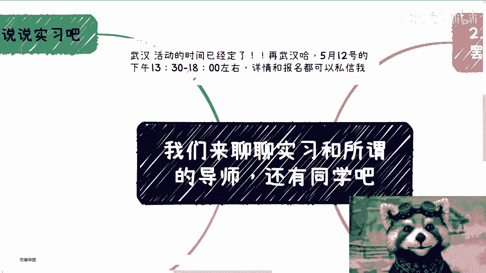
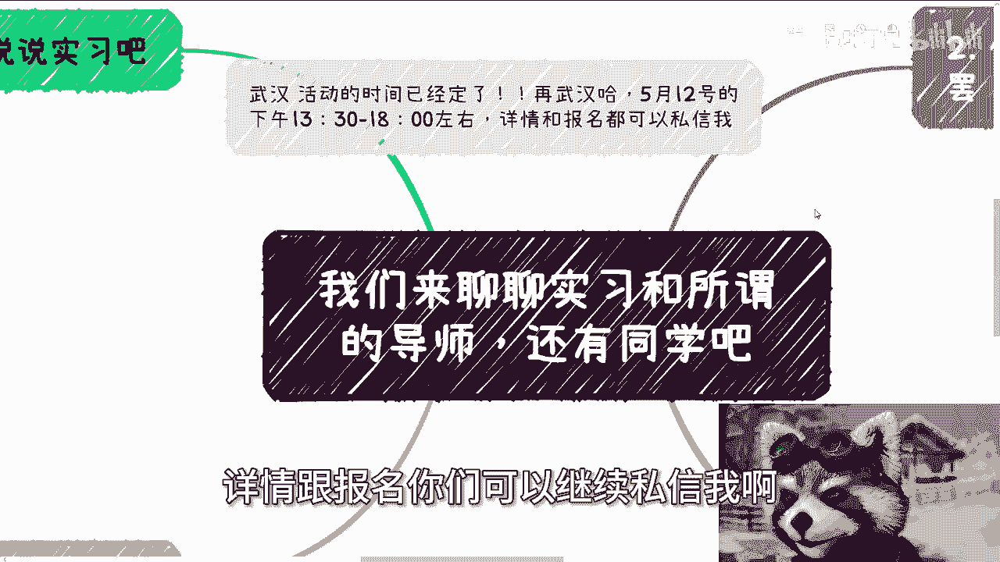
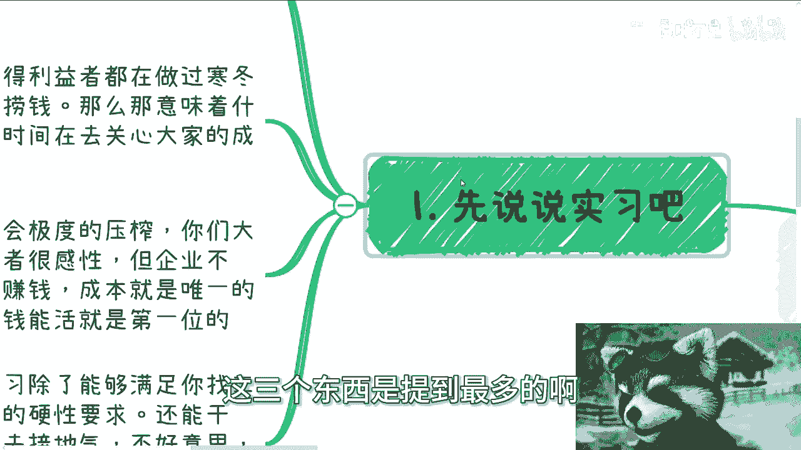
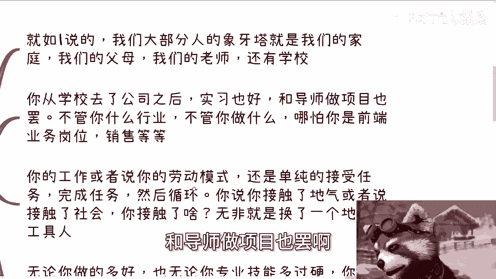
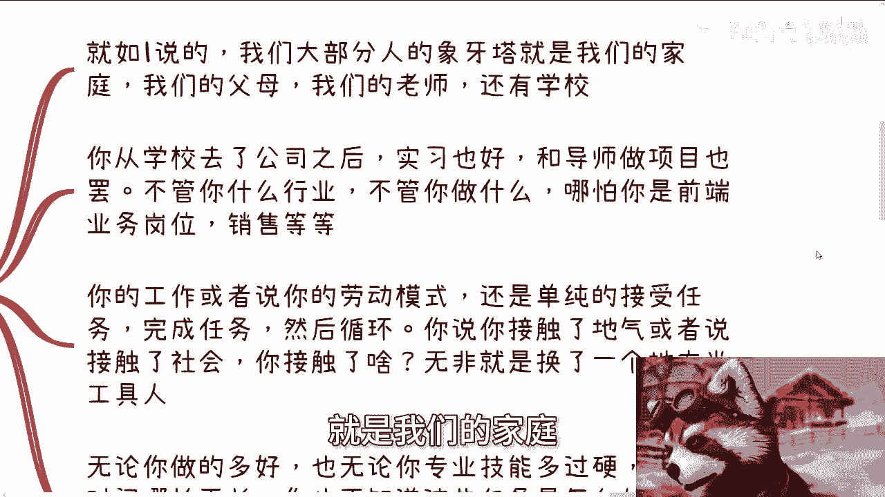
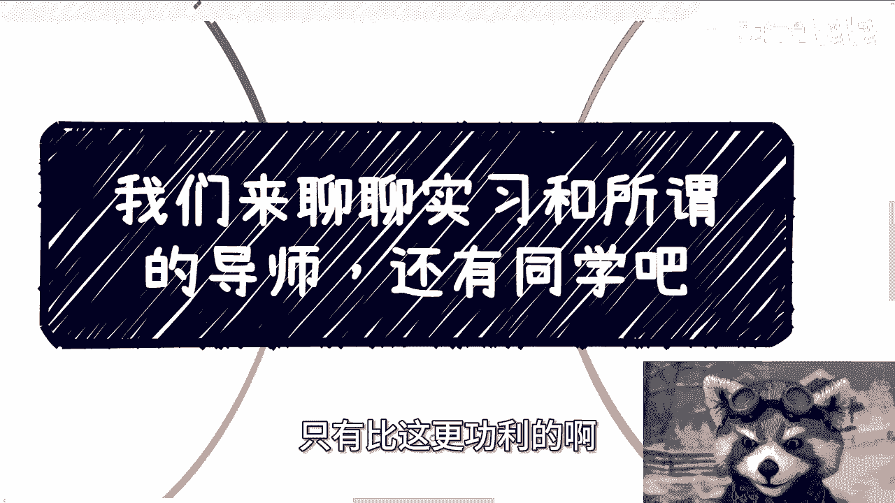
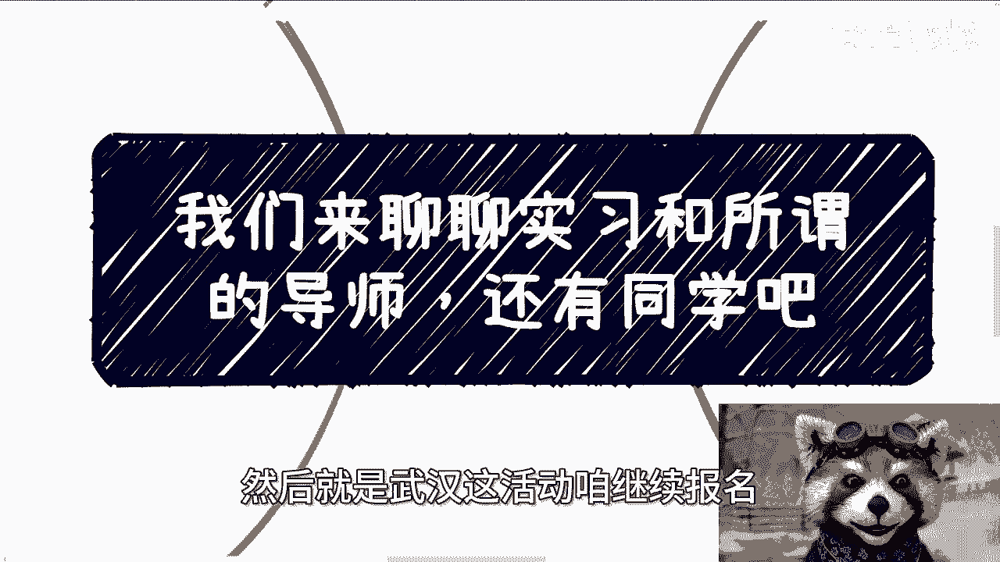
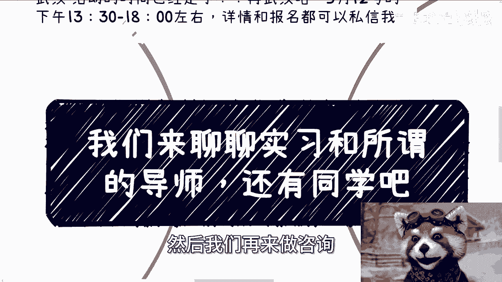

# 课程 P1：实习、导师与同学的本质剖析 🧐

在本节课中，我们将深入探讨大学生活中三个核心元素：实习、导师和同学。我们将从商业和现实的视角，分析它们在你个人成长与职业发展中的真实作用与局限性。

---

## 概述

我们将从宏观的经济环境出发，逐步剖析实习、导师和同学这三者在你当前阶段所能提供的实际价值。课程将帮助你理解，在当前的商业逻辑下，如何更理性地看待和利用这些资源，而非抱有理想化的期待。

---

## 一、 实习：经济环境下的“工具人”体验

上一节我们提到了读书与学习的话题，本节中我们来看看实习。要谈论实习，必须先谈论公司，因为实习是基于公司存在的。而谈论公司，又必须谈论整个经济环境，因为公司也基于经济环境运行。

在任何一片土地上，社会结构都是金字塔型的。没有人是完全主动的，正如我们之前所说，每个人在某种程度上都是他人的“工具人”。在当前的经济形势下，资本家和既得利益者都在为“寒冬”做准备，想尽办法获取利润。是否“要脸”并非他们首要考虑的问题。如果你是资本家，你也会如此考虑。

这意味着，公司老板或HR没有时间去关心员工的成长，因为员工的成长不直接带来利润。因此，企业只会极度压榨员工。许多年轻人可能善良且感性，但企业不会。商业的本质决定了**赚钱与成本控制是其唯一衡量标准**。

在这种情况下，实习除了能满足找工作的某些硬性要求（例如，许多工作确实要求有实习经验），还能带来什么？有人说实习能“接地气”。但你接的真的是“地气”吗？你无非是从一个象牙塔（学校）进入了另一个象牙塔（公司），你所接触到的，很可能只是老板的PUA（精神控制）罢了。

---

## 二、 实习与项目的本质：接受任务的循环

承接上文，无论是实习还是与导师做项目，其本质模式是相似的。我们大部分人的第一层象牙塔是家庭、父母、老师和学校。

当你从学校进入公司实习，或跟随导师做项目时，无论你在哪个行业、哪个岗位（如后端、前端、销售、市场），你的工作模式本质上仍是**单纯地接受并完成任务**。

许多人认为选择销售、市场等前端岗位会更好，因为需要与人沟通。但这种“好”只是表面现象。你真正积累了什么？大部分人一旦脱离公司平台，可能一无所有。你的工作依然是循规蹈矩地执行指令。

这与你换个地方当“电池”或“工具人”有何区别？无论你做得多好，专业技能多过硬（除非是能改变人类生活的突破性成就），只要你做的时间再长，你依然不了解商业和社会层面的运作。你**不知道任务如何从0到1获取**，也不知道任务的来龙去脉。你对全局永远缺乏了解，何谈“接地气”？

---

## 三、 导师：两种类型与有限的收益

接下来，我们谈谈导师。目前的导师大致可分为两种：一种是“呆子”，一种是“人精”。但无论哪一种，学生都难以从中获得实质好处。原因在于象牙塔的结构本身。

以下是几个关键问题，你需要自问：
*   导师的人脉是你的吗？
*   导师的公司与你有关系吗？
*   导师的项目你能借来用吗？
*   导师未来的成就能成为你的背书吗？
*   即使能，这些背书能直接为你赚钱吗？

如果导师能为你的活动或项目站台，并且你能借此积累自己的关系链，那这是一条正道。但如果不能，例如你拉来的业务需要导师的公司或学校层层审批（签三方或四方协议），那这件事基本做不成。即使做成，利润也所剩无几，因为导师和学校在利益分配上，绝对比你更“精明”。

很多人认为“跟一个好导师”或“选一个好行业”就有用。但关键在于：**这与你有关系吗？** 你需要有自己的逻辑和目的。

---

## 四、 同学：识别与利用“工具人”

最后，我们来讨论同学。有人问，在学校里认识同学，尤其是名校硕士同学，是否有用？

我的个人观点是，你可以将学校环境比作一个“监狱”。既然大家都在“监狱”里，你需要认识的无非是两类人：
1.  **有资源背景的人**：家里从商、从政，或自己已有很强商业成绩的人。他们是潜在的“靠山”。
2.  **有特长潜力的人**：了解他们的性格和特长。

认识他们的正确角度，应该是从一个**资本家或企业家的视角**出发。这意味着，你现在或未来要认识的人，都可以被视为潜在的“工具人”。你需要思考的是如何熟悉每个人的特点，并规划未来如何利用这些资源。否则，如果只是为了交朋友、谈恋爱，那与过家家无异，与赚钱无关。

“认识同学有没有用？”这个问题本身就很幼稚。**有没有用，完全取决于你的目的**。只要目的明确，总有办法让其产生价值。

有人会批评这种观点过于功利。但我想说，这只是皮毛。社会上的竞争远比这更功利、更现实，只有你想不到，没有别人做不到。

---

## 五、 思维误区与双标

很多时候，人们会因为不了解而拒绝接受某些现实观点。但同时，他们自己得出的许多结论（例如“好实习=好工作”）也未经实践检验，仅仅是基于个人意愿的臆想。

这是一种双标：对于超出自己认知和三观的“露骨”现实选择拒绝，认为那不是事实；但对于自己臆想出的美好结论却深信不疑。这需要警惕。

---

## 总结

本节课我们一起学习了如何以现实的商业视角，重新审视实习、导师和同学：
1.  **实习** 在当下经济环境中，主要价值是满足简历要求，其“成长性”和“接地气”作用有限，本质仍是接受任务的工具人体验。
2.  **导师** 分为“呆子”和“人精”，学生能获得的实质利益有限，关键在于能否将导师资源转化为自身的人脉与机会。
3.  **同学** 应以识别和利用“工具人”的视角看待，区分有资源背景者和有特长潜力者，为未来积累人力资本。

理解这些元素的本质，有助于你更清醒地规划大学生活，将有限的精力聚焦于真正能积累资本、提升认知的事情上。

---
*（附：武汉活动报名及个人规划咨询信息略）*