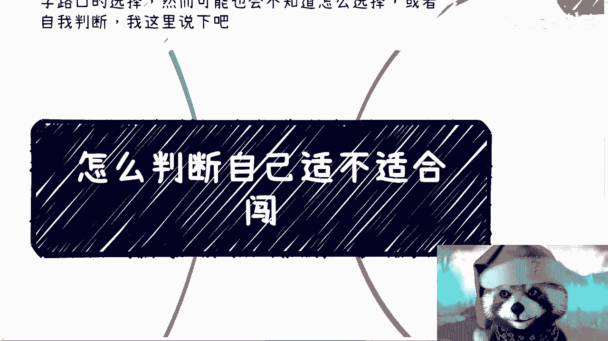
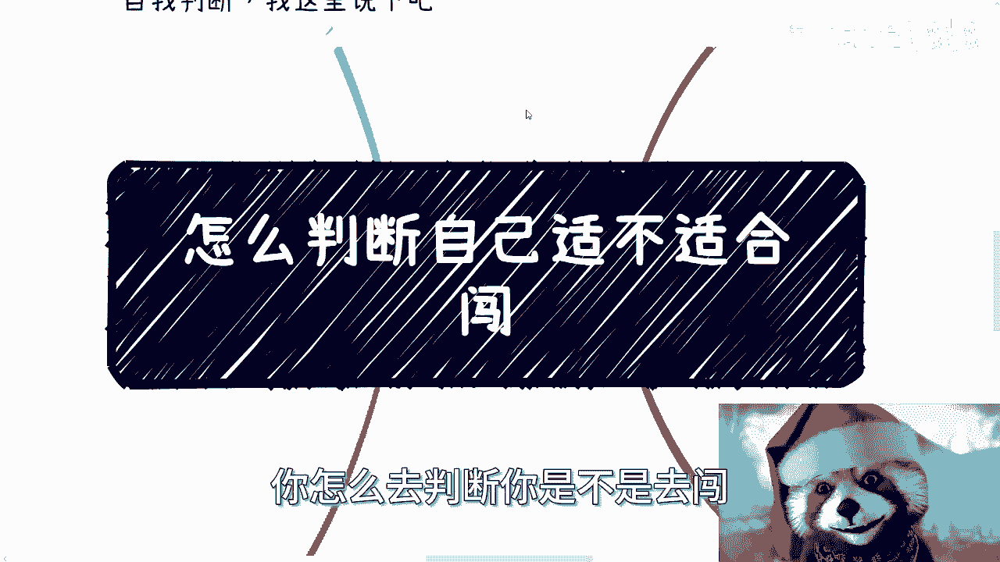
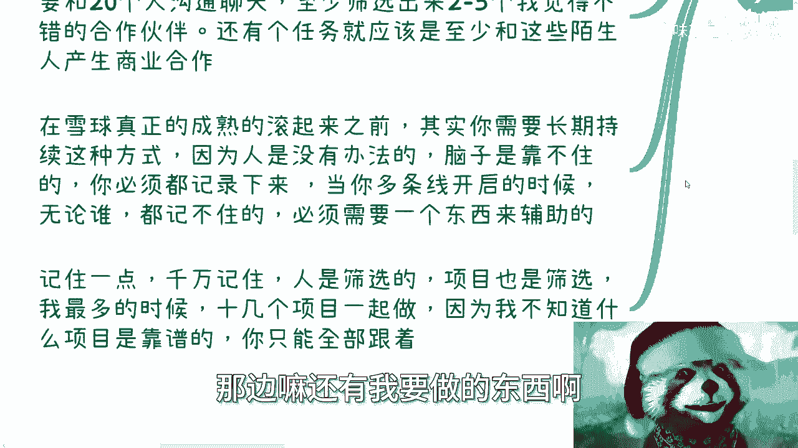
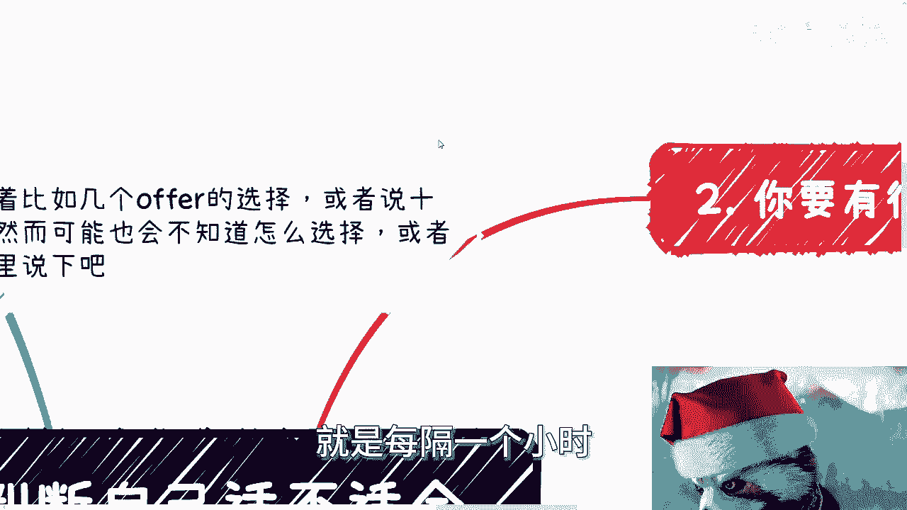
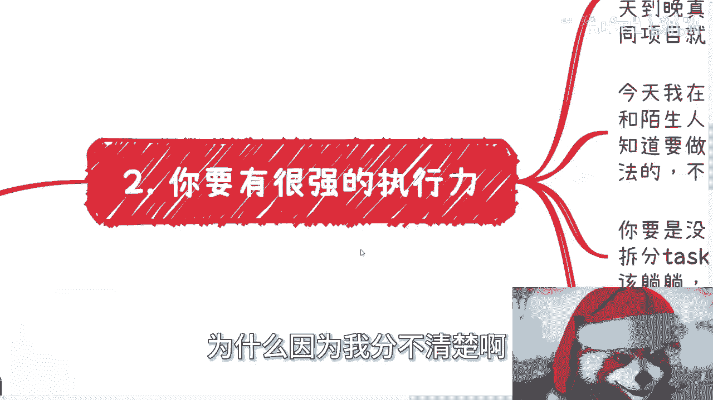
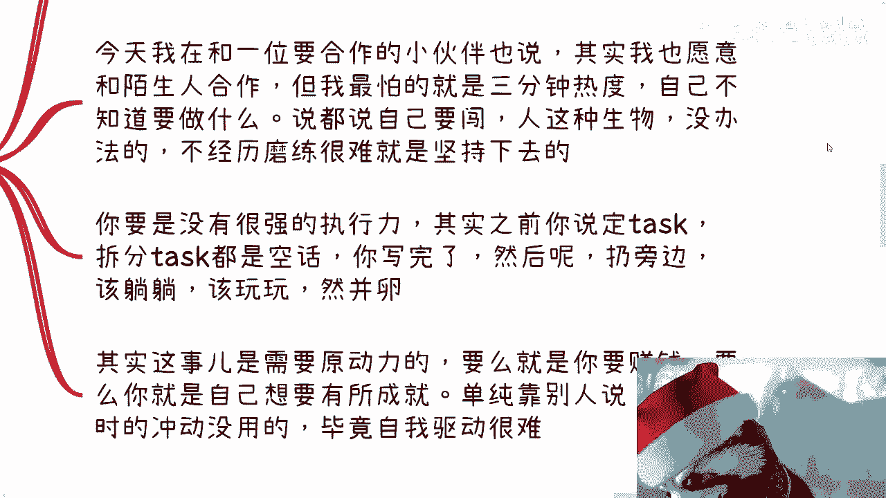
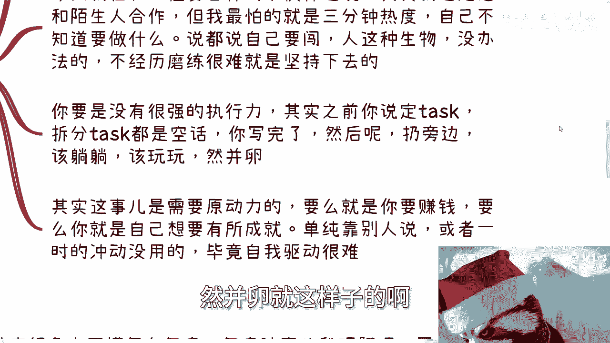
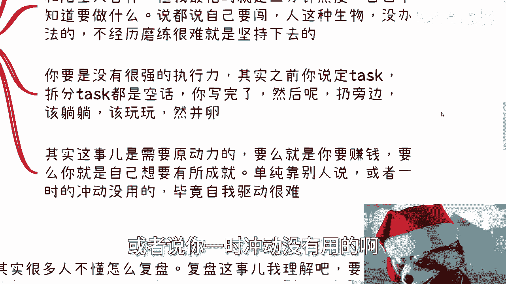
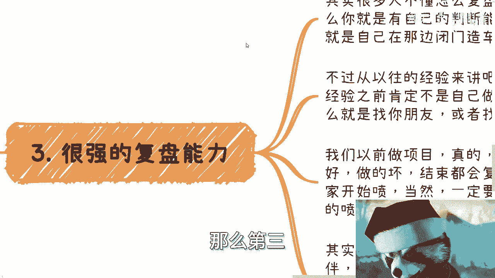
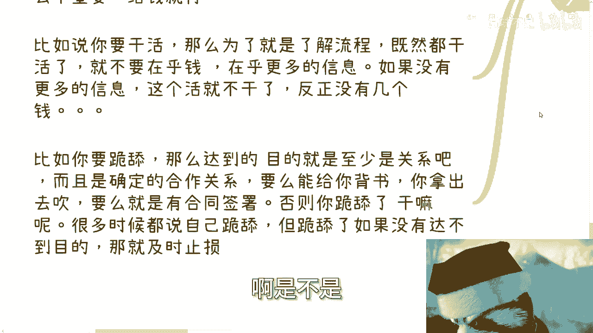

# 我们来聊聊怎么判断自己适不适合闯荡 - P1 - 赏味不足 - BV1gj421D7RT

好大家好呃。

这个很多人啊，其实面临着这个比如说一些offer的选择啊，或者来说十字路口的选择，然而可能呢就是他也这个不知道怎么选，或者说自我判断，就是说他并不知道我能不能去做啊。

或者说我选了好不好，我感觉我这里说一下，就是包括就是说大家觉得啊我想去闯吧，我想去做点东西，我跟你讲啊，你怎么去判断你是不是要去闯。

我列了这些点，第一啊你得学会拆分task。

就是我之前就跟大家讲过，就是很多人讲话呢，它是空话，你知道吗，就是说所有的东西你说你问他就跟之前评论区，我真的我每次都想拿出来讲，就是你问他啊，他跟我说，他说啊，那个高考啊，是我唯一的一个。

从小县城到大城市的这么一个路径对吧，我说好，没问题，然后我再我再问他，我说那你到了大城市之后怎么办呢，他就跟我说，努力生存下来，这他妈不是屁话吗对吧，对我来讲，就是大家都想努力生存下来。

你知道怎么努力吗，你知道怎么什么生存吗，你只有找到路线才是最重要的，你妈的，否则讲这屁话有什么用呢对吧，然后他们就觉得哎呀，这好像好像这个这个这个逻辑很通通个屁啊，通对吧啊。

然后我之前就推荐过一个软件叫TIMBATION啊，大家可以回头也可以，这个用一些别的都无所谓啊，我的意思就是说你必须要有个看板，而且呢主要这个就这个东西呢，是为了帮助大家去把任务去细化的去记录。

去写deadline，去提醒大家，你比如说啊你说我要开始闯了好，那么接下来呢对吧，就像就像就像有很多人跟我说，老师我觉得我很适合，那我不管你适不适合，那你接下来闯这件事情也是个很空的东西，你怎么闯呢。

对不对，你得给自己列目标吧，而且目标其实有大有小啊，啊而且有的目标有时间周期，就有的目标是短时间周期，有的目标是长时间周期，你只有分好轻重缓急，你才能不浪费时间啊，比如说大任务打个比方，我随便打个比方。

比如说大任务一个月内啊，我要参加四场活动啊，或者市场产业的活动，那么你的小的task是什么，就是细节到每天，比如说细节到今天周三，你说好，我今天task就是，我今天必须到网上找到四个产业的活动。

然后完成报名，那么这个task从未完成，拖到完成不就好了吗，对吧，你task得要去列，你得去分啊，然后你去了，我都在干嘛呢，你也可以定，你说哎，比如说我一个月的task是，我至少要跟20个人沟通聊天。

然后从20个人当中筛选出两到五个，我觉得不错的合作伙伴，还有一个任务，就应该是至少跟这些陌生人产生商业合作，对吧好，那么当然啊，这个产生商业合作也比较虚，但是你没法再往下细化了对吧。

就是你你因为你要展示什么商业合作，得要你跟别人聊了，你才知道你可以跟别人聊了之后，你再去细化，你说哎我比如说今天我聊了啊，有有做电商的啊，有做跨境贸易的，那么你说好我电商可能啊可能啊。

你说我电商跟别人合作是销售啊，商务这个市场啊，运营等等等等，那你可以再去细化啊，但是当下你还没聊的时候，那么你只能说先到这么一个颗粒度嘛对吧，那么你所有的这个商业合作啊。

在你的雪球真正的成熟的能滚起来之前。

其实你需要长期的持续这种方式，这种方式就是你不停的要去呃列task，不停的去把task完成，不停的去列，不停的完成，不停的练，不停完成，因为人没有办法，我跟你讲，脑子是靠不住的，你必须记下来。

因为当你有多条线开启的时候，我给你讲，无论是谁都记不住的，因为你想想看啊，每条线每一个状态，每一个时间点都不一样，你怎么知道当下什么情况，你都靠你脑子记吗，要命了，你肯定会记混的对吧。

所以你一定需要一个东西来辅助的，所以你记住一点啊，你怎么才能从没有到有对吧，就像很多人说啊，陈老师，我是个普通人，我什么都没积累一样的呀，所有人都会从没有到有的，那你怎么从没有到有呢，只能是一个筛选。

那除非是有贵人相助，你比如说我帮你们对吧，但是不可能对不对，我帮不过来啊，我也不是菩萨是吧，那记住一点，人需要通过筛选的项目，也是通过筛选的，雪球也是通过筛选的，就是我以前最多的时候十几个项目一起做的。

咱不夸张不夸张的说，十几个项目一起做，为什么要十几个项目，因为我不知道哪个项目靠谱啊，就是我会发现可能从我的角度看啊，每个项目可能都有希望，但是我并不呃并不能很好地分析出来，对方哪个人给我画饼。

那怎么办呢，我我我我没有办法啊，我只能去都做啊，对不对，那你想想看，十几个项目一起做要命了，我怎么记得住哪个项目到哪个环节，对不对，然后每个项目里面哦，这边还有海报哦，那边还有我要做的东西哦。

这边还有人对接，要命了，我靠这这你你怎么想的过来，想不过来的，你知道吗，就是那个时候基本上是什么，就是每隔一个小时。

每隔半个小时我就要去看一下那个team vision，为什么，因为我分不清楚。

谁知道他妈的现在什么情况啊，然后第二点就是你要有很强的执行力啊，其实我觉得很多人真的应该去经历一下，所谓的真正的创业公司或者创业环境，就我们以前做项目的时候，真的是一天到晚就是不夸张的说。

24小时在开会，因为团队分散在各地，不同项目就排不同的时间，而且有的在美国，有的在澳大利亚，有的在哪里不知道的，新加坡对吗，那今天我比如说，今天白天我还跟一位要合作的小伙伴。

我也说我说其实我也愿意跟陌生人合作，哪怕你们什么都没有，我也可以合作，但是我不担心合作本身，我担心的是你们3分钟热度啊，就是你比如说你说你说啊，我们介绍一些关系，介绍一些合作，没问题啊。

我不吝啬这些关系的，但是问题是不要说哦，我介绍这些关系，回头你们就做个什么，一两个月好了，不做了，那他妈的不是了，对不对啊，就是说说呢我跟你讲说呢，都说自己要闯的。

这就像我们一直说那句话，我考不上清华，是我不想考吗，对吧哦，你说我在社会上赚不到钱，是我不想赚吗，不是啊，就是很多时候人没办法的，人这种生物就这个样子，就是你不经历一些磨难，不经历一些过程。

你是很难养成这个这个坚持的习惯的啊，你要没有很强执行力呢，其实我跟你说。

你之前就像我们那个上一节，就是刚刚第一个里面说的，你如果没有很强执行力，你说定task也好，拆分task也好，其实也都是屁话，你写完了，然后呢，然后呢往旁边一扔，该躺躺，该玩玩，该吃吃，该喝喝，然并卵。

就这样子的啊。

然后其实这个事呢我觉得是需要原动力的，因为唉没办法，每个人都不一样，就是我不关心你的原动力是什么，但是你得找到你的原动力，就是有的人说我想赚钱，有的人说我就想有所成就，有的人说我就不想虚度一生都行。

随便啊，我不关心你的原动力是什么，但是你得自我驱动哦，你如果没有，你单纯靠别人说，或者说你一时冲动没有用的哦。

你做不下去的，那么第三就是你要有很强的复盘能力好了。

那这个时候又要来了，有很多人说复盘这两个字啊，他懂的，但是他他你要从实际角度来讲，他不知道什么叫复盘啊，我觉得是这样子的啊，复盘这个事我理解啊，很简单很很简单，记住一件事情，看问题要从多个角度看。

如果你有多个角度的能力，你就去看，如果你没有多个角度的能力，你就找别人看，这就叫复盘，你懂吗啊，就是说从以往经验来讲，复盘这个事啊，在你有一定经验之前，我觉得你自己做是没有用的，诶就很简单了。

就像就像一个人做错一件事，你让他自己在那边复盘，他能复得出个屁啊是吧，哎你要么就找你的合伙人一起付，要么就找你的朋友或者找外面的专家一起付，你总归要找一个第三方客观的视角来付的，这才叫复盘啊。

好我跟你们讲啊，我们以前做项目真的无论大家做的怎么样，比如说这个项目做的好啊还是坏啊，结束复盘的时候其实都是在喷的，为什么，因为复盘复盘，复盘复盘就是为了下次更好的去做，你一定是喷缺点啊。

你你复盘在那边啊，大肆赞扬嗯，我做的不错，嗯这个地方做的不错，这他妈复什么盘，有什么好复的，这叫庆功宴啊，对吧啊，那么复盘就是要喷的，但是呢你一定要明白，一定是对事不对人的哦，不要什么上来说哎这个人。

那个人没什么意思，你喷人家有什么意思呢，对不对，就是你喷人家，我喷你，你喷我了，毫无毫无毫无进展对吧，就正常来讲应该是什么，应该是互道，然后结束对吧，而不是说哦大家互帮互道，最后一起合作。

那你合作个屁啊啊，所以说你不要发泄式的去喷，你要说出来你为什么喷，然后喷了之后你怎么改进对吧，那么其实呢我跟你讲，你不找外面的专家也行，你可以找一些合作的伙伴或者好朋友，你可以就当闲聊。

你就说哎比如说你说我最近做了个事啊，可能比如说我做了个小红书目对吧，我做了个什么东西啊，那个流量不好，或者说赚的不多，或者说别人没跟我合作对吧，那你只要没有什么太大的商业机密，你跟别人说说看吧。

你说哎从你的角度，你看看这当中可能会有什么问题，或者说哎为什么别人不跟我合作啊，为什么我流量不高对吧，可能有什么问题，那其实你要这么想的，你多聊几个人也就都有了，这是一个正常的逻辑啊，就是我告诉你们啊。

我们在找那种供应商，就是我不是一直说找乙方找供应商嘛，我们在找供应商的时候，其实往往我们会呃虽然我们不招投标，但是我们会去找多个供应商，为什么，因为我们一方面是不相信单个供应商，另外一方面是多个供应商。

也能够让我们更好的知道哪些方案是呃，就是就是能够得出一个更更完整具体的方案，因为无论这个人或者这个团队多么专业，他一定是有这个视野盲区的，一定是有他的局限性的，你想都不用想了啊，你别管他多么牛逼。

他一定是有局限性的对吧，所以说就是说你找多个供应商，找多个乙方，这样的话才是真正的啊，就是在社会上做事的方式，那么第四个呢就是你逻辑要清晰，不能被影响啊，这一点也是我觉得最重要的，就是无论碰到什么事情。

什么人你都要看本质，别去容易被带歪了哦，就是无论对方说什么，你都要关注你本来就要关注的东西，然后不停的去想你关注的东西对不对，然后你关注的东西能不能得到啊，你比如说每个人都有成长期，都有积累的东西。

都有积累的时候都有一个阶段，什么阶段要钱，什么阶段干活，什么阶段是跪舔，你自己要清楚，不是说啊，我今天好像陈老师说要赚钱好，我这辈子就赚钱啊，好像好像我这辈子干活啊，我现在干活，好像我这辈子就干活啊。

或者说我现在好像这个有很多时候，我没办法要跪舔别人，我就一辈子跪舔别人，没有这种事情的，你每个阶段都要会做不同的事情，这没一个人逃得掉他啊，所以说你想想看啊，比如说我要钱，OK那我就要钱。

我要的就是性价比高的钱或者辛苦钱对吧，你自己心里清楚，你定义清楚，只要你觉得不亏，干什么不重要，因为什么，因为你的目的就是钱，你不要到时候就说哦，我我问你干嘛，你说我要钱，然后呢，你又在那边纠结，哎呀。

我觉得我干的这个事情没有进展，我觉得这个对我没有提升，那他妈的这就叫既要又要还要，你怪谁啊啊谁不想既要又要还要啊，你这样子最终只会竹篮打水一场空，没有意义的啊，然后再比如说你说我要干活对吧好。

那么你干活为了什么，你干活绝对不是只为了干活吧，你干活是为了通过干活要了解流程，了解上下游吧对吧，那么问题就像我们刚刚说的，既然你干活了，你就不要在乎钱对吧，你要在乎的是更多的信息。

如果你获取不了这个信息，那他妈的这个活就不干了，反正也没几个钱，这逻辑不是很清晰吗，啊你不要就是说哎一边干活啊，然后一边又被别人PUA啊，旁边有些人吹吹风，哎呀你干这个活，你看钱又不多好了。

你又陷入自我怀疑了，哎呀哦对哦，好像钱不多，怎么样子，大哥你摸清楚你的逻辑，摸清楚你的本来的目的是什么，你不要既要又要还要啊，不可能的呀对吧，你就像大家找工作，都说我要活少钱多离家近。

那他妈能有几个人找得到钱，我我活少钱多离家近的呢，啊啊你比如说你要跪舔，那么达到目的就是至少关系要有吧，而且要确定的合作关系吗，而且这个关系要么就能给你背书对吧，要么就是说啊能拿出去吹。

要么就是有合同的签署，否则你跪舔的干嘛呢，啊你跪舔了就是让自己跪舔吗，那那没有意义的啊，你你很多时候你说自己跪舔，但是跪舔呢如果你自己脑子要清晰吗，如果你觉得跪舔来一次两次达不到你的目的，那及时止损啊。

有什么好舔的呢，啊那我换个人舔不行吗，舔谁不是舔啊啊，是不是。

那所以啊我们就说啊判断你自己适不适合闯，其实不是说啊，你说我是个社牛，知道吧，我是我是恐怖分子啊，我这个我我社牛恐怖分子，我这个什么什么啊，很开朗对吧，我怎么样子，那些都是怎么说呢，都是都是面上的事情。

就是核心点还是在于你自身思路呃，呃呃判断力啊，执行力，然后是不是耐得住寂寞，是不是说啊能够就是说顺顺势也好，逆境也好，你都要有字，又要要有自己的节奏，因为很简单，你再去闯的时候，你一定会有啊。

你可能一下子赚的很好，也有一定会有甚至一两年赚不到钱的，你像我在这个疫情的时候，甚至比如说一两年两三年都赚不到钱对吧，一年可能就是很少的一点钱，那你要耐得住啊，你不能自乱手脚啊对吧，你不要到时候说哎呀。

好像就那么一两个月，三四个月啊，很着急对吧，然后你说哎我我不行了对吧，我要我要我要去做一些这种有的没的事情，那好了，你整个节奏就打乱了对吧，所以说其实坚持很重要，我以前就跟大家讲过，就是方向不要乱变。

你乱变就是也许你能赚到一些钱，但是你对身边的合作伙伴来讲，你就是一个没有目的性的人，你就是个没有积累的人，谁会找你合作啊，是不是好吧行，那就这么着啊，大家这个职业商业好吧，然后合同。

然后什么什么什么什么股权对吧，呃或者说一些合作上，或者说想要呃结合自己情况，我来帮你们聊一下，就是你们未来的这个比较适合你们的发展呢，或者怎么样的啊，你们可以整理好。

