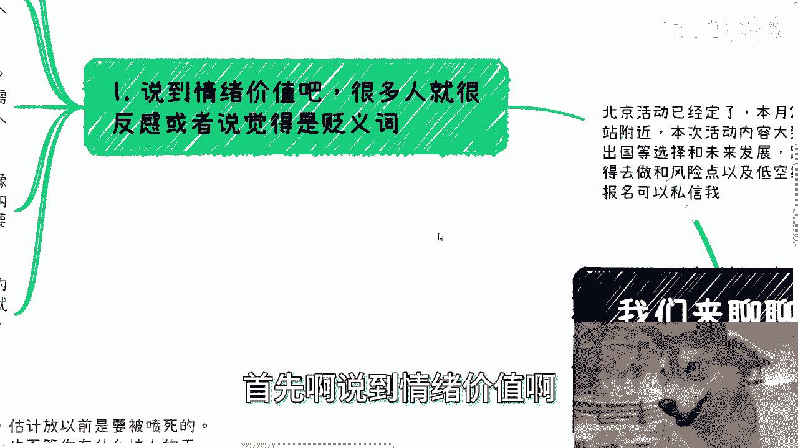

# 我们来聊聊情绪价值，当下人类最需要的一种东西 - P1 - 赏味不足 - BV12S421X7dn

啊今天我们来讲的这个词儿，大家也看到过很多次了啊。

情绪价值是吧啊，我后面补了一句，我说当下人类最需要的一种东西啊，嗯我我先说句实在话啊，可能这个话说的很多人呢听了不开心啊，呃为什么我说是人类最需要的一种东西啊，是因为不是因为人类别的东西不需要。

是因为大部分人想要别的别的东西的时候，他实现不了啊对吧，那么我想财务自由啊，那么自由不了啊对吧，你说我想我想他妈上海买五套房啊，买不起啊，对不对，那我我想他妈的呃叫什么，就是怎么样怎么样。

那那我没这本事啊对吧。

那那那怎么办呢，那那只有情绪价值了，你说是吧，那那这个无奈啊啊呃，首先啊本北京活动已经定了好吧，就是下周日下周日28号好吧，然后下午在东直门地铁站附近啊，本次活动内容呢，大致就是说一个呢跟上次一样的。

就是私企啊，国央企，外企，出国这些工作等选择的一些这个未来和发展，那另外一个呢是跨境电商，就个人角度来讲，比如说做跨境电商啊或者自媒体啊，是否还值得去做，以及一些风险点嗯。

还有一个呢就低空经济的这个知识普及啊，那么了解详情和报名的呢。

可以去私信我啊，好那我们来讲啊，首先啊说到情绪价值啊。

很多人就很反感啊，或者说就是觉得是个贬义词啊，呃呃我跟你们讲没必要啊，真没必要，因为你们最终啊我不管你们现在多大，就不管怎么样啊，最终你们就会发现很多人的反感呢，不是因为他真的反感。

那也是因为他情绪价值到位嘛，对吧，他反感了，为什么呢，因为自己在里面得不到好处或者赚不到钱啊，那么他会他会反感，但是反为什么反感呢，那么因为反感本身也是满足他的情绪价值啊。

这事放哪都一样，我跟你们讲，而且很多人呢做一件事情啊，当沉没成本很高的时候啊，他只要看到别人说不好啊，他就会冲出去冲出去喷啊，冲去反驳，哪怕呢他没有任何理由，没有任何逻辑性，他不不管他。

因为他本身目的不是来跟你辩论的，他妈就是为了喷而喷啊，然后呢他要自我安慰，也是情绪价值，为因因为他不想让自己的成不成本白付出，因为一旦你说的是对的，那么他就会否定自己。

否定自己就等于等于否定以前所有的付出，这就是情绪价值，这就是人性嘛对吧，那后面我再单独开一期啊哈这个事我跟你们讲，为什么也是之前这个有有有一条内容，不是讲公务员吗，你知道吗，哎呦我的。

你们是不知道什么什么呃呃呃有体制内的对吧，事业编的卧槽全帮他妈来喷哦，你知道吗，然后我后来找了几个人，我到他们主页一去看哦，怪不得啊，原来他们就是所谓的既得利益者，哎但是呢只不过他们是底层啊。

然后呢好像我说的东西就触及到他们利益一样，怎么搞得很搞笑哈，那么说回情绪价值啊，当下社会的确是蛮需要的，为什么，因为毕竟上班很累了，社会给的压力也很大，谁都需要缓解啊。

这就好像像我每天凌晨都要开始打游戏对吧，每个人都有自己的方式，情绪价值呢有的是自己给的，有的是别人给的啊，那就好像有的人呢，我不知道你们有没有一种，就有人跟你们讲过这种想法。

其实这种这种想法很多人跟我讲过，就是他就好像有的人觉得自己，是有一根活动值的，你知道吧，有有一个阈值啊，然后呢只要和人沟通，只要去做事情就会消耗这个阈值啊，就就会消耗消耗整个这这这这这这跟贴这根条。

你们可以理解为啊，然后呢，一定他每天比如说24小时休息之前啊，一定是需要去满足这个情绪价值，来补充这个值的啊，那么就如我们以前说的释放啊，有的人啊摔东西是释放对吧，你你像我们我不知道现在还有没有啊。

以前我们去过那种的，就是什么花钱啊，给你妈扔酒瓶啊，扔啊，反正让的发泄啊，那么有的人呢花钱是发泄啊，快乐啊，花钱就快乐，然后怎么让快乐怎么呃，怎么让自己快乐，怎么来啊，不过呢有的人也很扭曲。

比如说家暴啦或者极端人格啦对吧，什么什么跟你谈恋爱谈不下去了，就自己他妈的跪跪在地上扇扇自己，对吧啊，不但不管怎么样啊，不管说说到底都是情绪价值啊。

那么我们来看第二个就是从众消费变现。

说白了也是情绪价值，你比如说你在线下啊，看到个小摊位促销，或者说我们买彩票啊，吃饭都是一样的，你看到一个饭店，你看到一个彩票店啊，你看到个摊位，你就算啊，我们就说这个地方点评评分十分，你的闺蜜。

你的基友跟你说，卧槽这地方他妈的巨他妈好吃对吧，怎么样怎么样，你也不一定会去，为什么，因为你觉得没人啊，没人就是你会用各种理由说服你自己，什么没有烟火气啦对吧，肯定肯定你你你那个朋友啊。

这个个可能是一个个个例对吧，可能幸存者偏差，你知道吗，会找无数个理由来说服自己啊。

但但是啊如果一个点评可能就给三分一个地方，但是他妈爆满啊，每次你去他妈都爆满啊，你一次去不了两次，去不了三次，去不了，还会去啊，你每次去都他妈排队，那么你势必一定会去一趟，这是什么。

这就是从众的情绪价值导致了你的消费，当然你可能会明白，我相信有的人理智的，比如说你今天谈了个女朋友啊，或者谈了个男朋友啊，我不管性别啊，就是你你他可能会跟你说，哎那谁啊，这个我觉得这个东西哎不太行。

可能都他妈是托对吧，可能怎么样子，哎妈叫什么叫叫叫饥饿营销啊，怎么样，但是我跟你讲啊，你就算心里面明白你是个韭菜，无所谓，你最终会会发现，你还是会用无数种理由来说服你自己啊，不管你怎么想的。

你只有被割了，你才会死心，为什么，这就是从众对吧，你包括我们以前说的那种什么投资群啊，其实也是一样的，就是你可能啊比如说去了一个群，500个人啊，你知道这500个人里面他妈的啊。

我不说200多他妈过分了啊，那比如说50多吧，100个人嘛都是托啊，但是呢你每天看到那个群里面消息啊，啊我这个项目好啊对吧，我投1万，那人投5万，那人投10万对吧，那人投几10万，卧槽我跟你讲。

你每天看到这种东西就是洗脑，你知道吧，其实就是洗脑，然后不停的给你增加情绪价值，当你那个到了你那个阈值的时候，你就会冲动去投。

为什么这就是情绪价值对吧，你包括以前买房也是一样的，有什么区别呢，没有区别的呀，你问他为什么要买，不知道啊，然后然后你问他哎买了有什么用啊，啊你现在你现在你觉得现在是刚需吗，不是那你为什么要买。

大家都说要买呢对吧。

那当然当下社会呢，其实还有个当下的这个这个独特的问题啊。

就很多人说以前苦啊，很多以前困难啊，现在日子好过了，这话呢其实没有错啊，没毛病，但是啊我们我们要明白一点啊，就是苦这个东西和叫什么，就是心里的这个这个这个焦虑啊，包括心理的问题啊。

它不会因为你时代不同而不一样，就是他只是因为时代不同，他的展现形式不一样，你比如说以前苦可能饭吃不上，那现在苦饭虽然吃得上，但别的地方感觉苦啊，对不对，但你不能说它不苦啊啊。

你要说生活上的确没有以前这么艰难，毕竟生活条件是好的对吧，但人的心理问题，情绪上的空缺，安抚他还是要的，那还是那句话，我们看问题呢不要从自己角度出发，你觉得啊，今天有一个比如说我们叫呃情绪价值的。

你说课程也好，直播也好，或者其他的一个东西也好对吧，你觉得这种程度的安慰可能对你来讲毫无意义，或者说你把他一棒子就打打打成一个骗局，但是你要明白对你没有意义，本身就是没有意义的，为什么，因为这个东西。

任何一个东西它都是对一个特定人群有价值的，你说哪个东西对所有人群有价值的啊，那你最近特朗普被打了，那他妈你你看嘛，你是100%有人支持吗，还是100%有人反对，也不是啊，对不对，你哪来的。

我们我们以前叫什么叫银弹对吧，什么叫银弹，就是一个一个解决方案，能解决所有的问题，不存在的呀，我一直跟大家说活在当下，什么叫活在当下，活在当下，其实有两点，一个就是不要浪费当当下的时间，都去做积累。

都去做沉淀，你妈停在想想他妈没有卵用，对不对，有没有效果，做了再说，别太思前想后啊，当然活在当下，还有另外一个点是什么，就是你要开心，你要快乐，对不对，你要不愿意做，那就不做，那么我就会一直跟你们讲。

有的人是什么呢，他很很很很怎么说呢，那个词叫很扭曲，就是你问他想不想做不想做，那你为啥要做呢，哎呀我不我我又我又想赚钱对吧，不做嘛，又怕我落后别人，那你到底想怎么样，对不对，就就很拧巴，你知道吧。

就把自己搞得很拧巴又何必呢，对吧，那当然啊，这个时候又有人要说了，他说那我觉得很多人根本不知道想要什么，对呀，真的吗，这你说这句话才叫重点，就是因为很多人根本他妈的不知道要什么。

所以现在当下情绪价值会爆发的原因呀，这就是根本原因，也就是因为大部分人他不知道，所以很多短视频，很多人很多这种机构他才提供给你情绪价值，要是知道了，他他妈怎么赚钱，对不对啊，那么第四存在即合理。

我最近一直说的一句话叫什么，就是我估计放在以前肯定会被喷死啊，估计放到现在也会被喷死，就是我不管你什么学历，我也不管你是什么学校毕业的，我也不管你是有用，又有什么惊人的天赋啊，我就告诉你99%。

你努力做一个视频或者做一件事情，真不如人家长得小好看的小姐姐跳舞3分钟，就这句话对吧，就这句话你不要去啊，想着说哎呦，我的，你这样讲他妈的啊，侮辱我对吧，怎么样子，我管你侮不辱你啊。

他妈的确不是围着你转的，关我吊事，对不对，我跟你讲，是你可以看不起人家，你可以觉得粗俗，你可以清高，so what呢又怎么样呢对吧，但你们有没有想过，就是因为你们认为的这种粗俗。

你们认为的这种下沉市场才会有拼多多，才会有抖音，才会有快手啊，你们你们不想想看他妈的怎么怎么起来的吗，对不对哦，个个都像你们这么清高，那我跟你讲，今天不会有这种平台的啊，绝对不会有的，你有没有想过对吧。

哪怕啊我们不看这些大企业，我们就说啊这些下沉的你们看不起的土味的，很多东西养活了多少人，你们知道吗啊，你你放眼看看整个中国的基数养活了多少人，如果他们每天都是之乎者，也早他妈饿死了，我跟你讲，对吧哦。

那我跟你们这样说，很多人看似很年轻，但思维很固化，就是你会发现很多人什么十几岁，20几岁，他的思维非常的腐朽，就是我们要接受社会的变化，我们要接受科技带来的变化，同时我们要明白人性本身的不变，对不对。

就是你今天我们说拼多多也好，抖音也好，快手也好，土味视频也好，包包括别的东西也好，他无非只是展现形式不一样，但是它满足人性的需求，跟人性的情绪价值永远是不变的，只不过以前满足他的需求的方式可能是别的。

比如说早年的时候，比如说呃这个这个年轻人到什么那个迪厅对吧，蹦迪或者怎么样，他只是展现形式不一样，但是本身是不变的对吧，你不能说他们很粗俗，你不能就说他们下沉，因为粗俗和下沉本身就是人性需求。

你能说什么呢，对不对，你搞得好像自己很清高一样，没有必要，我不认为谁比谁清高对吧，至少我是这么觉得啊，那么情绪价值其实都一直是刚需，只是不同形式就不同时代他表现形式不一样，你们想想看。

对不对啊，你不要觉得就说哎呀，好像现在有个新的词叫情绪价值对吧，妈的听多了就感人，觉得都是骗局或者怎么样子，有什么区别，往前推20年，当年卖保健品的，卖什么东西的，那不也是情绪价值吗。

没有情绪价值怎么卖的出去啊，你告诉我怎么卖的出去啊，那老年人也不是啊，对不对啊。

仔细想看，你们仔细想看啊，好啊就就这么就就就说这么多啊，然后那个活动好吧，就那个了解详情或报名的继续私信我，然后剩下的话就直接规划商业规划啊，你们在现在在做的过程当中，比如说股权啊，期权啊。

包括你们自己有什么项目，或者自己有什么资源对吧，有些什么牌呃，看看想怎么打的，希望通过跟我的沟通，通通过我的一些视野，或者通过我的一些，对于当下经济形势的一些认知，能够给你们一些更接地气的一些建议。

或者规划的话，那么你们整理好对应的问题跟个人的背景好吧，然后我们再来走咨询啊。

