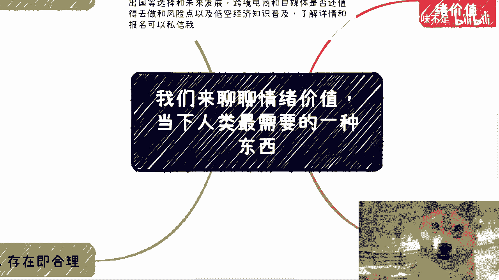
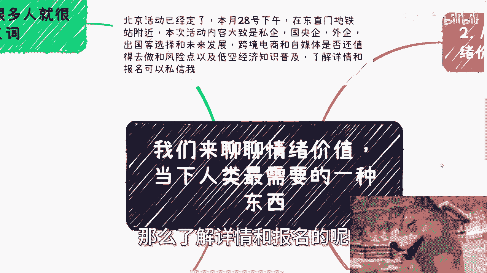
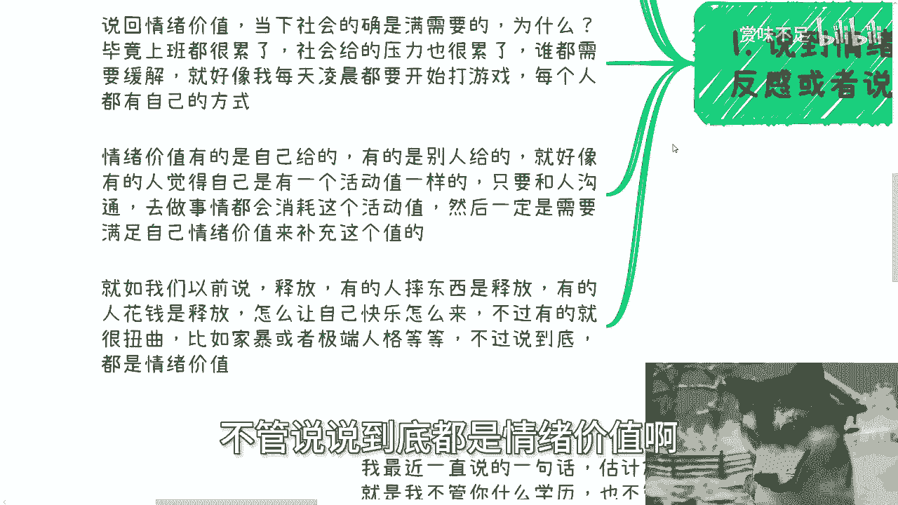
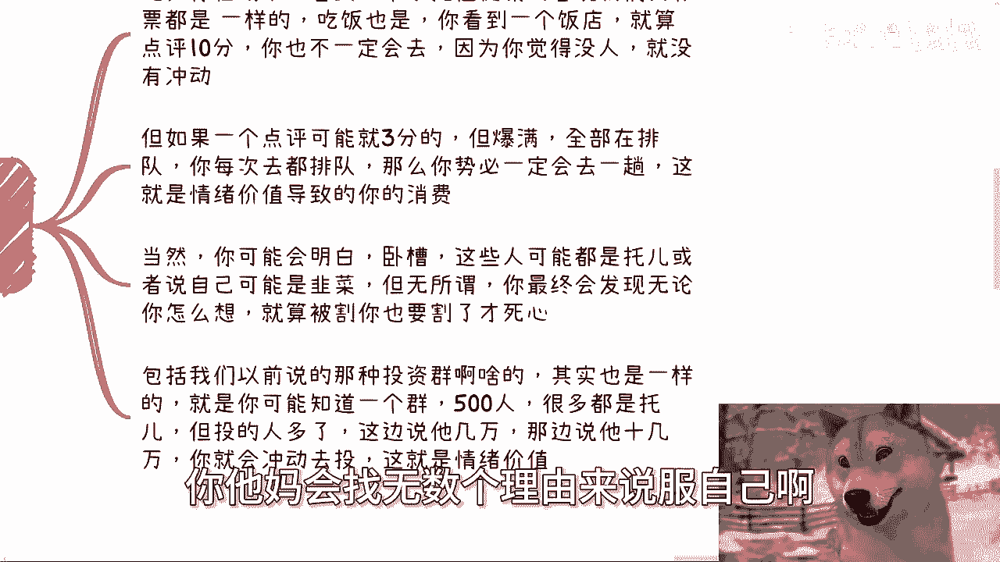
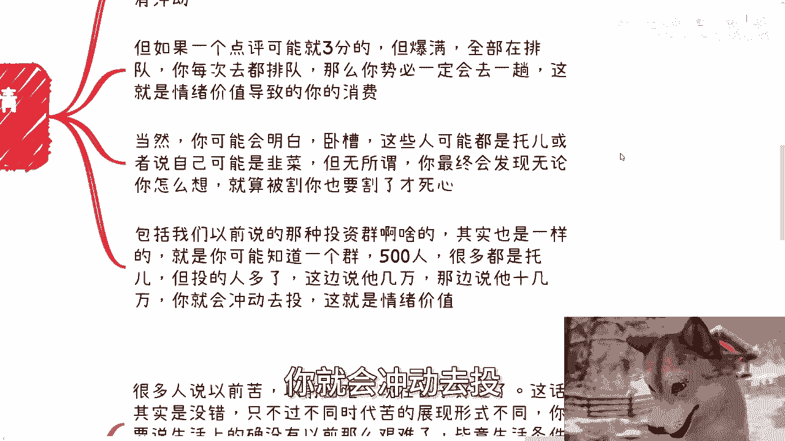
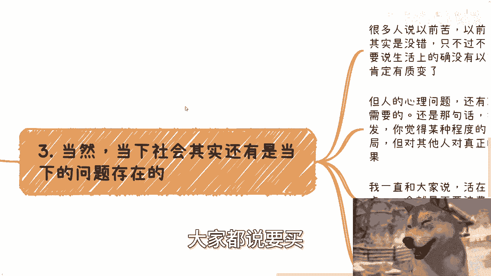
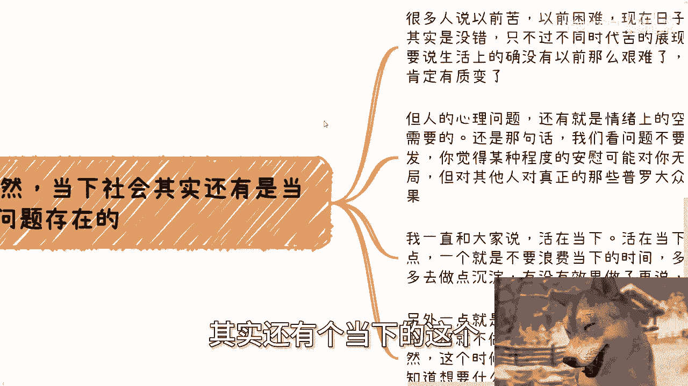
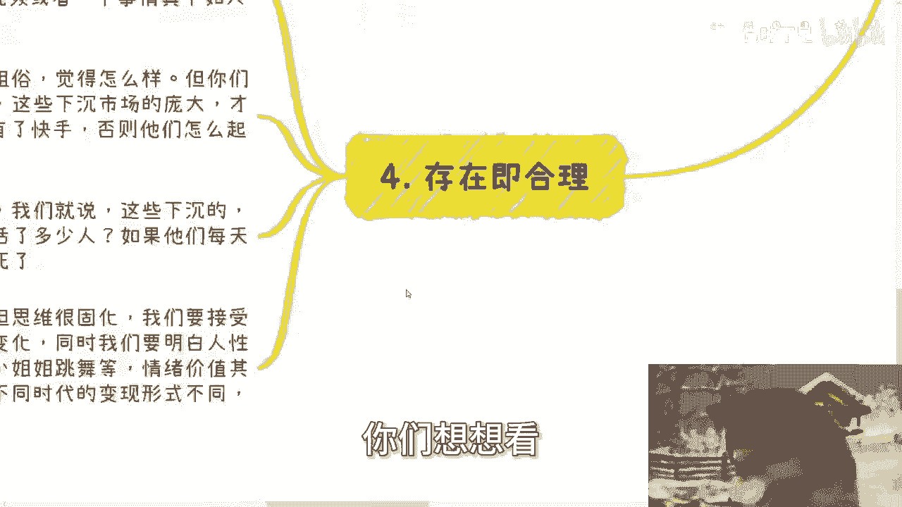

# 我们来聊聊情绪价值-当下人类最需要的一种东西---P1---赏味不足---BV12S421X7dn_

在本节课中，我们将要学习“情绪价值”这一核心概念。我们将探讨它为何在当下社会变得尤为重要，分析其在不同场景下的表现形式，并理解其背后的人性逻辑。通过本课，你将能更清晰地认识到情绪价值如何影响我们的决策、消费乃至生活方式。

---

## 概述：什么是情绪价值？

情绪价值是指能够满足个体情感需求、带来心理慰藉或愉悦感的无形价值。它并非物质回报，而是一种心理上的满足与支持。

当下，许多人渴望实现财务自由或购买房产等具体目标，但往往难以达成。在这种情况下，获取情绪价值成为一种普遍且可及的心理需求。

---

## 第一节：为何情绪价值备受关注？🤔

上一节我们概述了情绪价值的概念，本节中我们来看看它为何在当今社会备受关注。

许多人最初对“情绪价值”一词感到反感，认为它带有贬义。这种反感情绪本身，往往源于个人无法从中获益或获利，而表达反感恰恰是为了满足其自身的情绪价值需求。

当人们在一件事上投入了很高的“沉没成本”（即已付出且无法收回的成本）时，即使面对负面评价，他们也可能会情绪化地反驳。其目的并非理性辩论，而是通过“喷”或“反驳”来寻求自我安慰，维护自身情绪价值，避免否定自己过去的付出。

公式表示：
**情绪价值 = 心理满足感 - 实际物质收益的落差**

当前社会压力巨大，工作劳累，每个人都需寻找方式缓解压力、补充情感能量。这就像游戏中的“活动值”或“阈值”，日常社交与事务会消耗它，而我们需要通过特定方式（如娱乐、消费）来补充这个值，以满足情绪价值需求。

以下是几种常见的情绪价值获取方式：
*   **自我释放**：例如打游戏、摔东西（在特定场所）、购物消费。
*   **人际给予**：来自伴侣、朋友或家人的理解与陪伴。
*   **扭曲表达**：例如家暴、极端人格行为（如自虐），这些是情绪价值获取的病态形式。

---

## 第二节：从众消费与情绪价值 🛒

理解了情绪价值的个人层面后，我们来看看它如何驱动我们的消费行为，即“从众消费变现”。

从众消费的本质也是追求情绪价值。例如，面对一家餐厅，即使好友强力推荐或评分很高，如果店内冷清，我们仍会找理由（如“没烟火气”、“可能是个例”）说服自己不去。

反之，一家评分一般但总是爆满、需要排队的店，却会强烈吸引我们前往尝试。这种“大家都去，所以我也要去”的冲动，就是从众心理带来的情绪价值，它直接导致了消费行为。

即使我们理智上明白可能是“托”或“饥饿营销”，内心仍会找理由说服自己参与。只有亲身经历、感到被“割韭菜”后，才会死心。这种现象在投资群、房产购买热潮中同样常见。群内热烈的氛围和他人成功的案例，会不断为个体提供“别人都赚了”的情绪价值，当这种价值积累到阈值，就会引发冲动投资。

从众消费的公式可以简化为：
**消费冲动 = 群体行为带来的安全感（情绪价值） + 对错失机会的恐惧**

---

## 第三节：时代变迁与不变的人性需求 🔄

从众消费展示了情绪价值如何被外部引导，本节我们将视角拉回个体内心，看看时代变化下不变的核心。

有人说过去生活艰苦，现在物质条件更好。这话没错，但“苦”与心理焦虑并不会因时代不同而消失，只会改变表现形式。过去可能是吃不饱饭，现在则可能是其他方面的精神压力。因此，心理上的情绪安抚需求始终存在。

看待事物不应仅从自身角度出发。你认为毫无意义的“安慰课程”或“情感直播”，对特定人群却可能极具价值。世界上不存在能解决所有人问题的“银弹”（万能解决方案）。

“活在当下”有两层含义：
1.  **不浪费时间**：专注于当下的积累与行动，而非空想。
2.  **寻求快乐**：做让自己开心的事，如果不想做就不必勉强。许多人处于“拧巴”状态——既想赚钱又怕行动，既不满现状又不愿改变，这种自我矛盾消耗了大量情绪能量。

许多人根本不清楚自己真正想要什么，这正是当下“情绪价值”产品和服务爆发的原因。因为迷茫，所以需要外部提供情感寄托和方向指引。

---

## 第四节：存在即合理——接受多元价值形态 🌐

认识到需求的普遍性后，我们需要以更开放的眼光看待满足这些需求的各种形式。

一个现实是：**99%的人努力制作的视频或完成的事情，其带来的关注度和影响力，可能真不如一位好看的小姐姐跳三分钟舞**。你可以认为这粗俗、清高，但社会并不围绕个人的喜好运转。

正是这些被认为“粗俗”、“下沉”的内容和市场，孕育了拼多多、抖音、快手等平台，并养活了数量庞大的从业者。如果所有人都只追求“阳春白雪”，这些平台和生态根本不会出现。

许多年轻人思维固化，年纪虽轻却观念陈旧。我们需要接受社会与科技的变化，同时理解**人性底层需求的不变**。拼多多、土味视频等只是满足人性需求（如娱乐、认同、实惠）的新形式。从前年轻人去迪厅跳舞，和现在看短视频跳舞，在满足情绪价值这一点上并无本质区别。

情绪价值一直是人类的“刚需”，只是在不同的时代有不同的载体和表现形式。往前推二十年，卖保健品的针对老年人的营销，利用的同样是他们对健康、关爱的情绪价值需求。

公式：
**人性底层需求（不变） + 时代技术/载体（变） = 当下情绪价值产业**

---

## 总结与行动建议 📝

本节课我们一起学习了“情绪价值”的核心概念。我们探讨了它为何成为现代人的重要需求，分析了它在个人心理调节、从众消费中的作用，并理解了其背后永恒不变的人性逻辑，以及随时代变迁的多元表现形式。

总结要点：
1.  情绪价值是满足心理与情感需求的无形价值。
2.  对情绪价值的追求或反感，都源于人性中自我安慰与肯定的需要。
3.  从众消费、投资决策等行为背后，常有情绪价值的驱动。
4.  时代在变，但人对情感安抚、快乐、认同的需求不变，变化的只是满足方式。
5.  应以开放心态看待不同的价值创造形式，“存在即合理”在于它满足了特定群体的需求。

认识到情绪价值的力量，既能帮助我们更好地理解自己和他人的行为，也能在商业和社会活动中更有效地洞察需求。无论是规划个人发展，还是思考商业项目，理解并善用“情绪价值”都将是一个关键视角。

（注：文中提到的北京活动及商业规划咨询为视频原内容，此处仅作保留，不构成任何建议。）