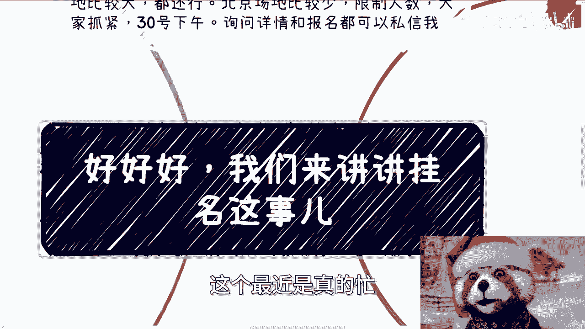
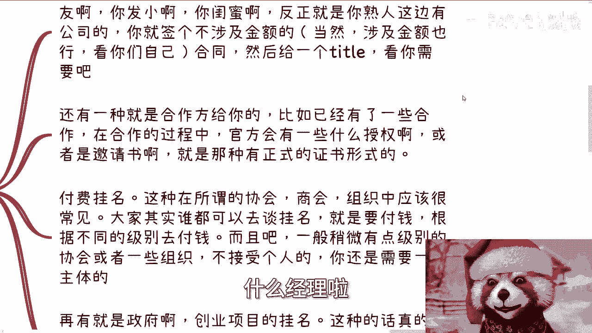
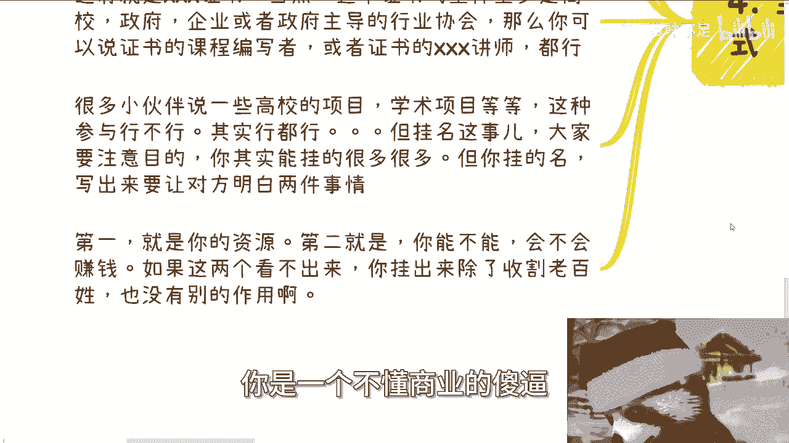

# 我们来聊聊挂名这个事儿 - P1 - 赏味不足 - BV1ut421G7dR

好大家好啊，这个最近是真的忙。

我他妈现在又已经凌晨了几点，我看看对，正好12点午夜场是吧，呃首先上海北京活动继续报名啊，上海是24号下午好吧，场地比较大，反正也都还行，人可以多一点，北京场地呢就比较小，而且呢他限制人数。

反正大家抓紧好吧。

30天2月30号下午啊，然后询问跟那个报名都可以私信我啊。

那么今天这个主题呢，就那个之前小伙伴问我的啊，就是说关于这个挂名啊这个事。

首先啊我们先说一下挂名这个事啊，就挂名这个事呢其实有很多种方法啊，有的是股东挂名啊，有的是兼职挂名，有的是合同挂名，有的是没有合同呃，呃呃有的是没有那种合同挂名啊，有的是无中生，有的挂名啊。

反正就是方式方法很多啊，看你们的目的是什么，呃其实我们说的这么说啊，为什么要挂名，主要是对于大部分老百姓普通人来讲啊，嗯他不挂名寸步难行，他就是个死局对吧，你说你要去搞关系，要合作。

你需要一些title，当你有了一定积累，需要更多的合作时候呢，还是需要这些态度去积累啊，那么你又说我当下没有这些合作，那就可能没有这些抬头啊，那就变成了一个现有机现有单的问题。

那么大部分人我觉得如果来说自己没有，这个怎么说呢，就是思思维不是特别灵活的话，那基本上就就就死在这了啊，那当然啊我只是告诉大家，现实当中存在的一些操作，并不是说啊这些操作都是对的啊。

或者说都是我建议大家去做的啊，在整个的这个描述当中啊，没有什么对跟不对的啊，而且我说的东西也没有什么任何鼓励或者，偏向性的属性，反正就是说你们自己去判断啊，想怎么做怎么做，那当然啊，之前有小伙伴跟我说。

比如说学历跟一些学术得奖啊，是不是也可以作为挂名放在上面呃，咱就这么说啊，社会上的东西是看大家共识的，当大家觉得学历很稀缺，你挂着是有用的啊，当大家觉得学历都已经泛滥了，你挂着啊可能就没那么有用了。

而且更何况啊，我还是那句话，我们今天随便说啊，你今天出去做一个商业啊，或者跟别人呃这个社交啊，或者跟别人介绍你挂一个清华，挂一个北大在那边，请问你能给对方带来带来钱吗，不能我就这么问。

对方看到对方是在社会上不认识北大的吗，还是不认识清华的，只认识你这一个啊，那么你挂着有什么用呢，也没有用啊。

对吧啊，好那么第二个啊，我们讲一个个来说。

第一呃，第一类叫做常见的寻常的挂名，那么常见的寻常挂名呢，比如说什么意思啊，比如说你家里呀朋友啊，发小啊，闺蜜啊对吧，反正就是你熟悉的这边啊，这边的人啊，有公司，那么你就签一个不涉及金额的。

当然涉及也可以啊，这个看你们自己啊，那一般不涉及不涉及金额的这种合同，然后给一个title，比如说什么VP啦，什么经理啦对吧。

什么什么反正都可以嘛对吧，看你需求啊，那么还有一种呢就是说合作方给你的，比如说啊你们已经有了一些合作，在合作的过程当中，官方可能会有一些授权啊，或者邀请书啊，或者证书啊对吧，就有这种东西的。

那么你相当于是一个挂名的方式啊，那么第三类就是付费挂名，那么这种在所谓的协会商会组织当中，其实很常见，呃，其实我也告诉你们，就是这种付费挂名的，其实你们谁都可以去挂啊，他没有要求的要求就是钱啊。

只要你付了钱，根据不同的等级去付钱，你就可以挂啊，而且呢一般啊稍微有点级别的协会或者组织呢，他肯定是不接受个人去挂的，除非说你跟他关系特别特别好对吧，你比如说我跟书交所。

那我跟书交所这边其实就就不谈这些什么企业，什么不企业的问题了，就我想去挂就随便挂对吧，但问题是你你大部分的一般的这种情况，你去了解，你肯定还是需要一个主体的啊去挂的，那么再有就是比如说政府啊。

那么比如说创业项目的挂名啊对吧，政府的挂名啊，这种就是说真的就是为了挂名而挂名的，也就是说政府今天需要满足某些项目的要求啊，比如说要多少个硕士啊，多少个博士啊对吧，多少个这种行业专家啊对吧。

那那那你进去就凑个数，凑个人头对吧，那你进去那挂个名，那创业也是一样的对吧，就比如说项目需要几个顾问啊，需要几个咨询啊。

大家其实就是进去挂个名呢，你问他你在这项目里面干嘛，他回答你妈，我什么都不干啊。

那么好，那么第二类呢，就是常见的那种不太寻常的挂名啊，那么最常见的就是那种既没有合同，也没有利益绑定，也没有实质联系的挂名，就是三无产品啊，那么这种挂名其实很多，说白了就是我今天是一个草台班子。

我是一个小企业，我是个人，对方也是个草台班子，对方也是个小企业，也是个人，那大家相互草台班子底下有什么关系呢，对不对，那中国80%以上都是小微企业，谁他妈知道什么样子对吧，我随便打个比方。

比如说你今天是做教育的，对方是做电商的，可能你们都是只是空壳公司，没有全职的员工，那如果你们相互给对方挂个抬头，那怎么了呢，那双方不就是各多一个业务吗，对吧，你们相当于是一个是一个1+1。

完全大于四这么一个逻辑，那这种很常见啊，双方也不吃亏啊，还有就是比如说这种那种就是说你是个人对吧，对方可能是一个有一定规模的这种企业，那么就像我之前说的走兼职销售，兼职商务，那么最容易的一个问呃。

其实这种方式最容易的这个事儿，我跟你讲很简单，找对方企业的商务去聊啊，然后你的切入点就是能给对方带来单子啊，当然这个饼看你怎么画啊，因为就像我们说的战略方向，我可以跟你们讲微操，你们自己去抄啊。

那我微创也得我帮你们抄这么个抄法呀对吧，然后看看怎么签兼职的合同，谈好分润就好了，而且我觉得这种事情呢你也不用多想，你尽管提，那对方同不同意无所谓啊，你提了之后就算不同意。

怎么了呢，你又不少块肉，对不对啊，那么第四个就是还有很多别的光明方式。

比如说协会组织，有很多地方有一个东西叫什么叫专家智库，你可以想办法加入或者去沟通，能不能加入，哎就说白了不择手段，随便随便有，有什么问题，你实在不行，出点钱对吧，也可以，那么这种光明很多。

比如说某某某协会专家对吧，那么还有就是说国标啊，呃团标啊，航标啊，这种找机会去切也可以作为一种挂名的东西，比如说叉叉标准的编写者之一对吧，专家之一，你就跟我写那个区块链应用操作员的这个股票，是一样的。

那你说除了我当时整个专家组有多少人啊，大概十十个人左右吧，那肯定不止我一个人啊对吧，那我能参与进去能能叫什么，就是在里面混一下，那有什么不好呢啊，还有就是什么叉叉叉叉证书，那就比如说这种证书呢。

至少主体啊，但他至少得要是个高校，政府企业或者政府主导的行业协会，那么你可以说是证啊，这个证书的，比如说课程编写者啊，或者证书的参加讲师啊都行啊，那么很多小伙伴呢可能会说一些高校的项目。

比如说教授带的这种学术项目，或者说是跟国家呃，叫什么申申报国家这个经费的某些项目啊，这种参与行不行，其实行，我告诉你啊，都是行的，但是你要明白一件事情，我们所说的挂名，我们一定要明白我们的目的是挂名吗。

不是我们的目的是为了挂完名之后写出来，让对方明白两件事情，哪两件事情，第一就是你的名，能够第一眼就让对方明白你是有资源的，第二就是你的名，你能让对方明白你是一个会不会懂不懂，能不能赚到钱的人哦。

如果这两个东西看不出来，你挂出来除了收割老百姓，我觉得没有别的作用，就像回到一开始，你说我挂个清北清北出来，我就问你嘛，你挂个清北出来，你要么有本事挂一个什么挂一个，比如说清北的啊，什么什么党支部对吧。

或者说什么什么，那也就算了，你说我就毕业于清华，毕业于北大，那我就问你啊，毕业于清华毕业，北大代表你有什么资源，你有吗，你有啥不知道对方看不出来，满地都是清华北大对吧，然后第二就是能不能赚钱。

那不好意思，更看不出来对吧，你反而你挂这个东西，只会让我觉得你像一个，你是一个不懂商业的。

就这么简单，好吧，啊那个这个事就这么着吧。

啊那么活动呢反正大家继续报名好吧，然后那个充电视频，因为最近实在太忙了，明天我给你们补一个吧，好吧，明天来补一个呃，然后剩下的就是职业规划，商业规划啊，呃那个股权融资啊。

因为最近好像也是有些小伙伴来找我，那个讨论那个股权融资的股权融资，然后是个人规划啊，然后你们手上的牌啊，根据呃真正的这个中国的或者全球的这个情况，你们接下来怎么打啊，你们觉得有必要的话。

你们可以整理好背景和问题，然后我们再来做咨询好吧行。

