# 我们来聊聊社群的商业闭环逻辑 - P1 - 赏味不足 - BV1wN411G7h9

哈喽大家好啊，这个今天在早上在B站上面，我就看到非常多的视频，我不知道为什么，反正推给我就说这个社群的事情正好对吧，我来跟大家聊一下，我对于社群的这个商业逻辑的看法以及对吧，其实也有很多小伙伴跟我说过。

社群的事情，我就一直没有做对吧，甭管你看啊，我包括我在每一个视频下面我还写了啊，就是说我还特地强调了，我说我没有这个社群啊，我没有这个怎么样啊，为什么要去强调，是因为这里面的风险很高啊。

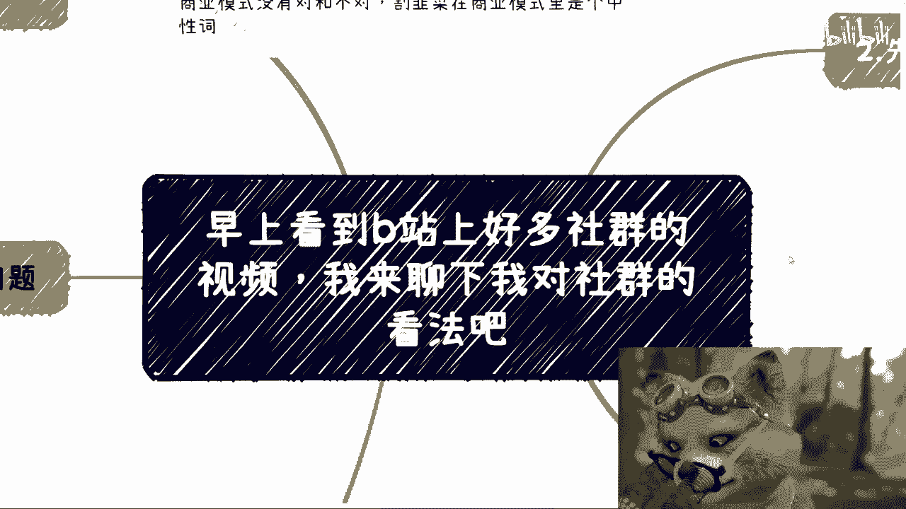

呃首先啊我们先来看一下啊，先说几个问题，首先我可以跟你们讲，我肯定不做啊，以后也不可能做啊，我但凡以后做了，你们就举报我好吧，就这句话啊，那先说说B站上的一些观点啊，你说拉社群大概率不是骗子啊。

他有的人是这么说，他说有人敢拉，就说明大概率不是骗子啊，或者怎么样子。

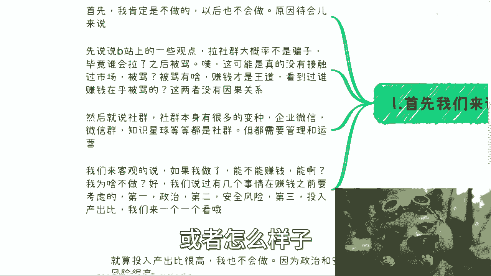

毕竟谁拉了之后会被骂，哎我感觉说这种话的人就特别天真啊，没有根本没有遭受过毒打，你知道吗，也没有这个经历过市场对吧，就是什么叫被骂。

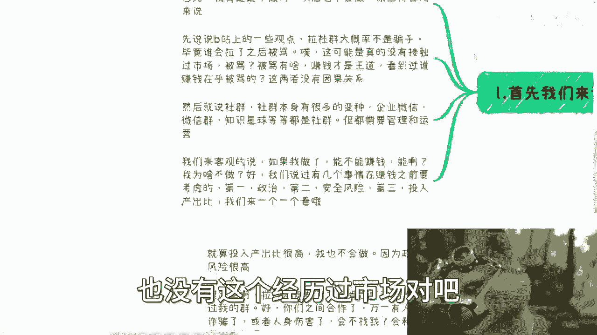

什么叫拉拉社群，就是拉社群啊，跟这个是不是骗你，这有因果关系吗，毫无因果关系对吧，我就搞笑了，你想想看，从历史到现在被骂被骂有啥呀，那被骂是问题吗，你但凡有人想要去赚钱的，你是资本家，赚钱是王道。

你看过有谁在赚钱，在乎被骂的，那么搞笑呢对吧，那有的人为了赚钱还他妈特别特地被骂呢，双方还他妈故意挑撕逼对吧，这两者没有任何因果关系了，我就发现就是就是说出这种观点人啊，就是我不是说他这个叫什么。

就是来那句话怎么说的，就是说出这种观点，人不是坏就是蠢，就这句话啊，那么然后就是说社社群，社群社群本身呢有很多变种对吧，企业微信微信群，知识星球等等都是社群，但这些东西都是需要管理和运营的，对吧好。

那么我们客观来说。

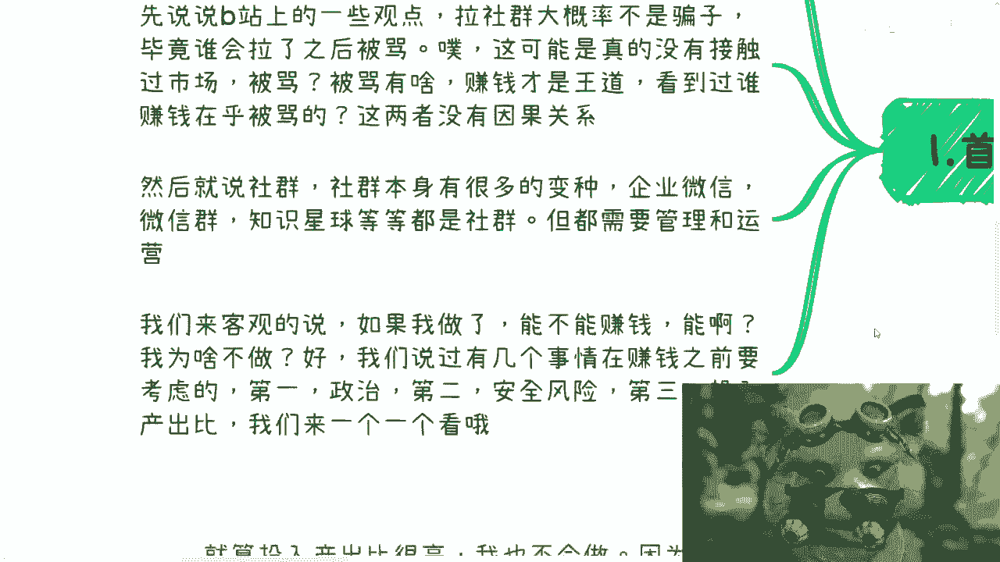

哎呀我这个背景我想换一下，这个背景太绿了，这个对吧，就我们客观来说，如果我做了，对我们来讲，我们如果我做了，能不能赚钱，能啊对吧，那很多人你说你说啊，那你作为资本家，你为什么不做，对吧好，那很简单。

我我告诉你们啊，我们以前说过有几件事情。

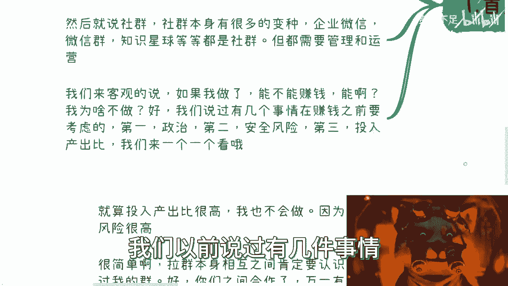

它的优先级是比赚钱更重要的对吧，因为你在这个国家，你要必须要考虑第一政治。

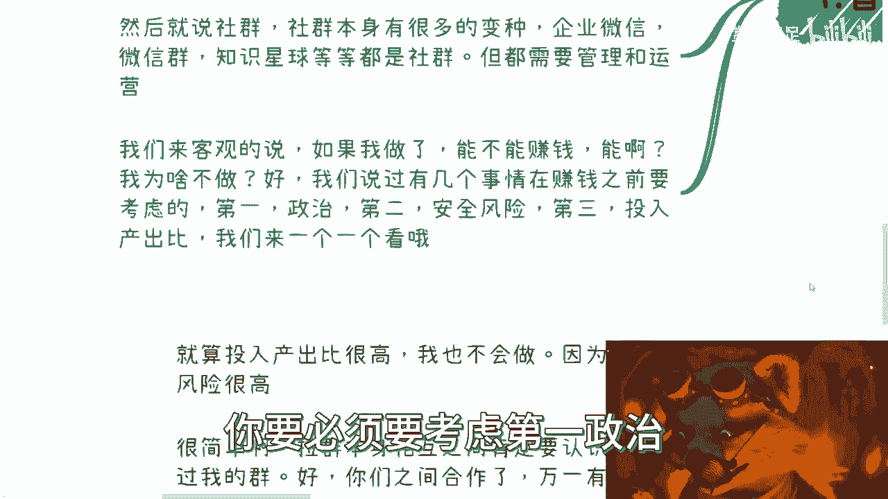

第二安全风险，第三投入产出比对好，这个东西我后面一个给你们来练啊，我为什么不做。

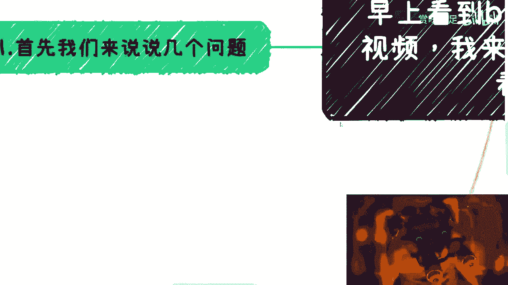

很简单，我他妈做了，我跟你讲，我做了，我觉得你们才会觉得我啊，首先啊你看啊，我看了好几个视频都在说这个社群的事情，基本上就是说一个人六百七百一千的加，那么只要认真看了他的说法，只要认真看。

总终究是有学习的，有进步的好我们来看啊，首先就是我说的能在里面吹水的啊，不是说这些level高不高，也许有很多人level很高啊，这个我不排除，但是他们能在里面吹水出来的内容，你们觉得会有多大价值。

对吧，就我就说啊，如果你们现在已经是一个雷欧很高的身价，我不说几个亿吧，就是几千万的这种产业，有产业的，你们在一个500人，在一个一圈人的这种老百姓的群里面，你去吹水。

你觉得你会把所所谓的真正有价值的东西，吹出来吗，有会吗，我就问你自己，摸着你良心问问看对吧，你所谓的觉得博学无非就是各种八卦跟八卦，美丽啊，对不对，因为你要明白，你当你是那个level的时候。

你在里面是为了娱乐，你在里面其实就是一种发泄，就是一种就是日常的这种这种这种这种生活，你不是说跟大家一样去学习的啊，你说我我是吃饱了撑的做慈善了，在里面我还是想没有用的，我跟你讲。

你会发现老百姓是什么群体，就是你跟他们认真讲，讲完之后，他还得怼你，就他会觉得他比你专业，对不啦，没有办法，就这个样子的人类就这个样子对吧，其次你看到信息多的是二手啊，你想想看你所谓主观我也搞笑了。

你主观的什么你主啊，你说你学习我也搞笑了，你说你学习的永远是别人的，这个主观上面的这种观点，或者说二手的观点，你学习个屁呀对吧，你正规的信息来源，你不学，你学这些有的没的啊。

然后个人都是个人感觉主观性比较强的东西，对吧，哦你你要是聊聊天吹吹水，其实我觉得无所谓，但是你聊聊天吹吹水，你花个六七百块钱，那我觉得你除非就是就是已经是很有。

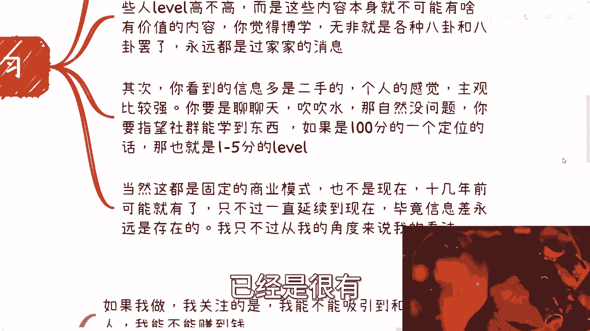

这个怎么说呢，就是能够很高的性价比去赚钱了，否则你说你不是这么一个点，你说我花这个钱，主要的目的是在社群里面指望能学到东西，你觉得可能没啦，你别自欺欺人了呀对吧，如果我们说整个的一个一个一个社会啊。

它是一个0~100分的这个定位，那这个社群最多也就是一到，15到十分的level，你顶天了，你也只能学到十分的这个level的东西，而且还不一定是真的，你指望啥呢，你我就说嘛。

你每个人哪怕你能活100岁，你能够高效的学习，比如说有40年的学习时间，你能指望你这你通过社群能得到达到什么label，对不啦，我觉得但凡有点脑子的人都明白点，那当然不好意思。

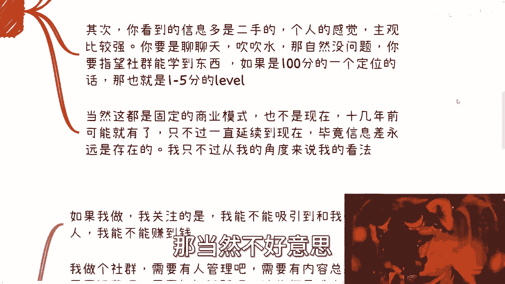

现在有脑子的人太少对吧好，那么当然啊，这就是固定模式啊，就像我们说的，这个不是现在十几年前可能就有了啊，也不用可能十几年前就有了，我跟肯定就有了啊，只不过呢这种商业模式是延续到现在的。

毕竟信息差永远是存在的，对吧啊，那那以上只不过是从我的角度看我的看法啊，那么大家就像我说的，我觉得国家家对吧，你们觉得不是过家家，那无所谓，那爱咋地咋地啊对吧。

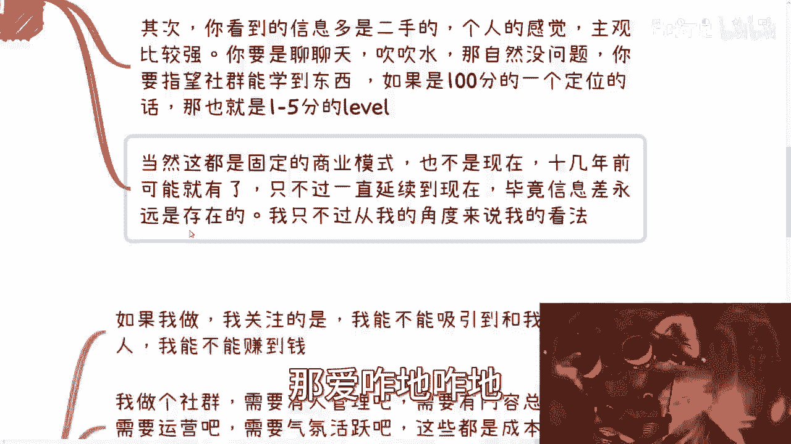

那你反正我又不少块肉，我又不亏钱，我又不赚钱跟我有什么关系呢。

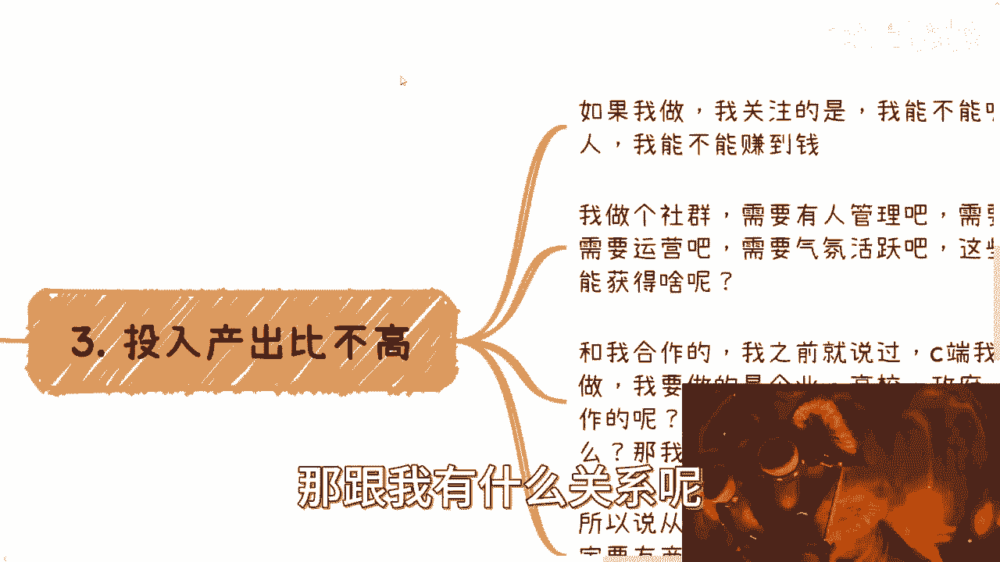

对不对好，那么接下来就说我为什么不做，对吧好，第一反过来先说啊。

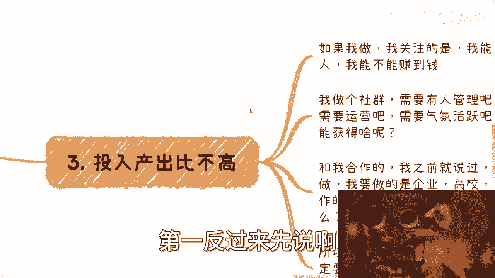

第一投入程度又高，为什么，如果我做很简单，我只关注啊，我们来分析嘛对吧，我只关注我能不能吸引到和我合作的人，所谓间接的赚钱，以及我能不能直接赚到钱，对不对好，那么你想想啊，如果我做个做个社群。

需要有人管理吧，需要有内容总结吧，需要运营吧，需要气氛活跃吧，这都是成本，那请问我获得了什么对吧好，我们客观的来评价我获得了什么，我获得的是你们进社区的门槛，对吧好，那么你说我如果要获得进社区的门槛。

那是什么，那就是钱啊，那么我就说啊，我但凡要赚到钱，我必须设门槛，但是我设门槛，我就说这个社群里面能给你们带来有价值吗，没有，那我设一个门槛，我跟我哥你们有什么区别呢，对不对好。

那么第一个商业模式就出来了，就是一定是割，你不割是不可能的，你不割怎么赚钱，我做慈善吗，对不对，好，第二你要找到跟我合作的，我早就说过了，C端我能不做，尽量我就不做，我要我一直以来做的都是政府企业。

高效的动生意啊，包括服务，那么请问在整个普罗大众层面，能有几个人能跟我合作很少，那请问我这个社群开在那的意义是什么，每天看彩虹屁吗对吧，每天在那边说哦，群主牛逼对吧，不好意思。

我已经过了那个自我PUA的阶段对吧好。

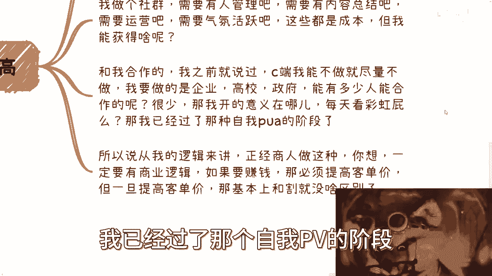

那么所以说你想想看啊，你从我的商业逻辑来讲，正经的商人做这种东西，它一定是要有商业逻辑，一定要有商业闭环的，我不赚钱不可能做对吧，那但凡我要赚钱，我就要去收所谓的门槛费，就要去提升我的服务客单价。

但是一旦我说了门槛分哥哥提高客单价，那基本上跟哥就没什么区别，那不好意思，我不想做这个事对吧。

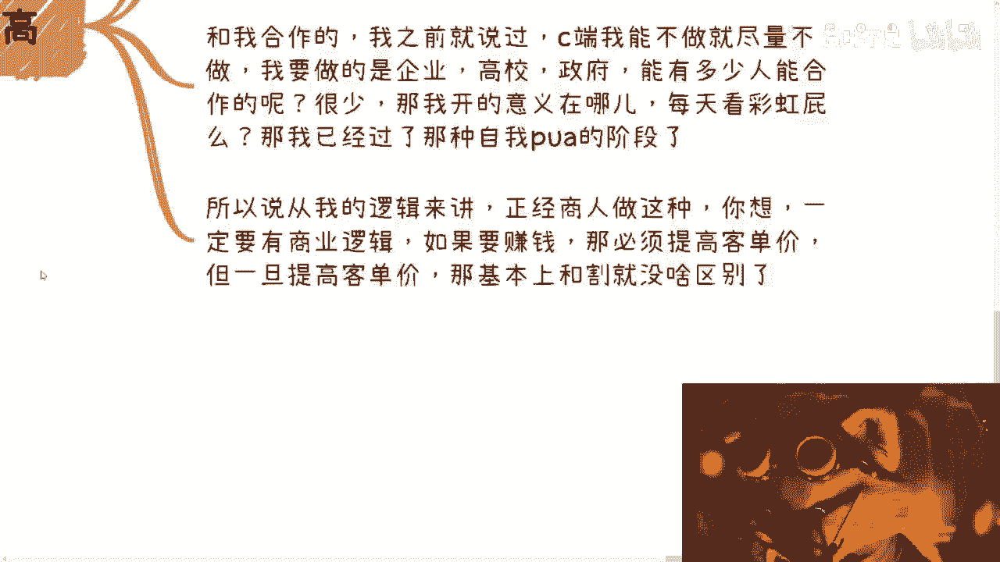

或者说我不接受这种商业模式，但是我认为这是一个商业模式。

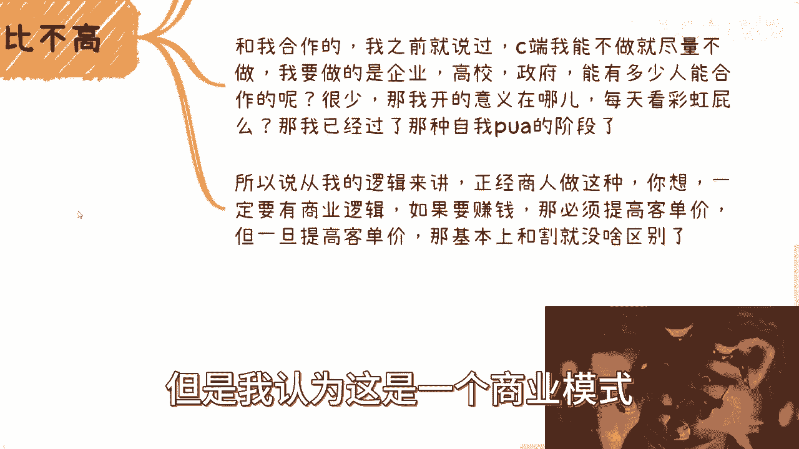

这是一个正经的商业模式，因为在商业模式里面，我们在这地方说的很清楚。

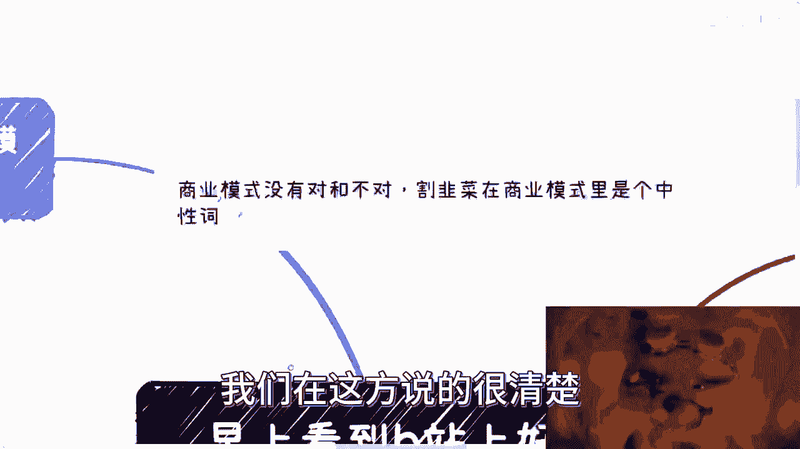

在商业模式里面没有对，跟不对啊，没割韭菜并不是一个贬义词，也不是个褒义词。

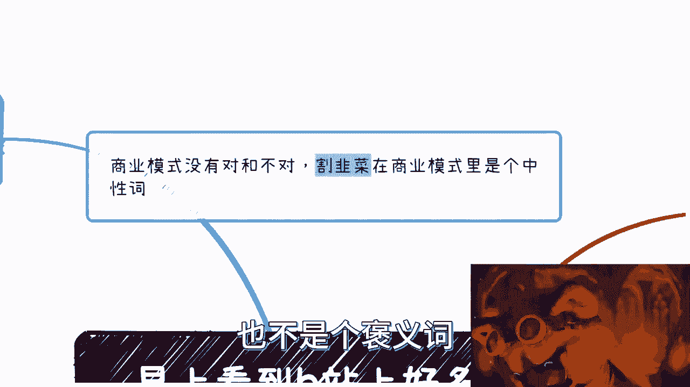

在商业里面它就是个中性词，明白吗，这就这就跟我们一开始说的。

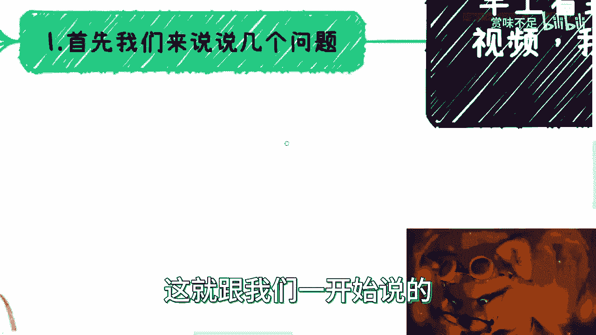

就是说骂不骂不重要，赚钱是王道啊，好那么再来我们来说一下政治和安全对吧。

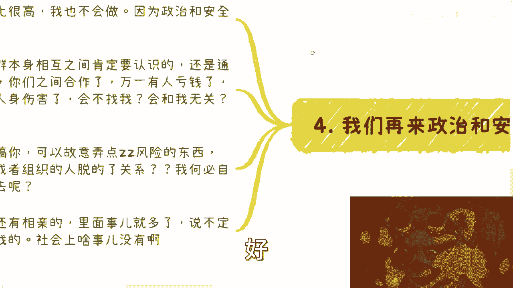

你看啊，就算投入产出比更坑，我也不会做，因为政治跟安全风险很高，这个在我国是第一优先级的，private就是零啊，P0的那个严重程度，也就是说拉群本身相互之间肯定是要认识的，这是人性逃不掉的对吧。

而且这个群还是我我组的，我拉的好，那你请问啊，你们之间合作了赚钱我不要啊，我也没指望有对吧好，但是问题在哪里，万一有人亏钱呢，万一有人被诈骗了，万一有人人身伤害呢，会不会找我，肯定会找点，你妈搞笑了。

唉吕老师，我在你群里面，我今天碰到一个什么人，你认识吗对吧，哎呀那个人把我骗了对吧，怎么样怎么样吧，有的骗钱，有的骗色对吧，怎么样，你让我怎么回，我怎么回，我该怎么回。

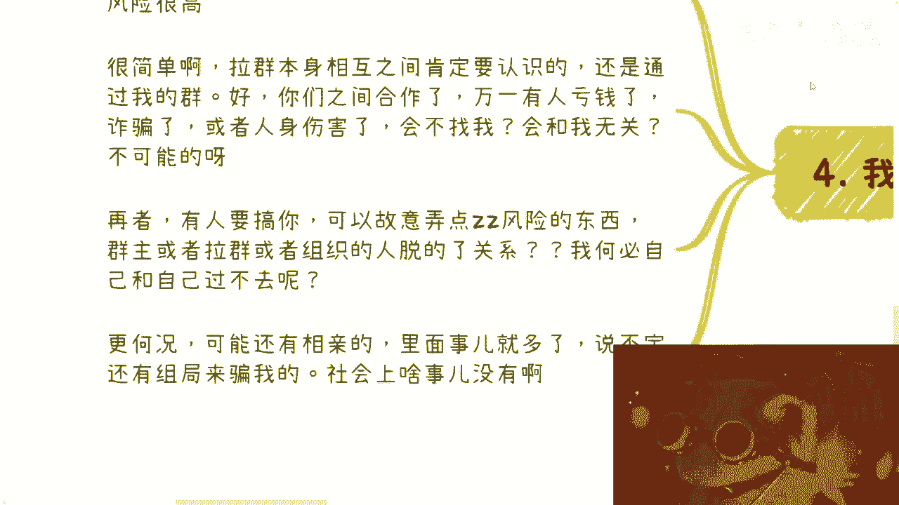

你们想想看，哎，我是一个商人，我要考虑的是赚钱跟风险啊，我我我你觉得这种空气我要去考虑吗，我任何消耗时间的事情，我就考虑他干什么对吧，那多一事不如少一事，为什么吃饱了撑呢对吧。

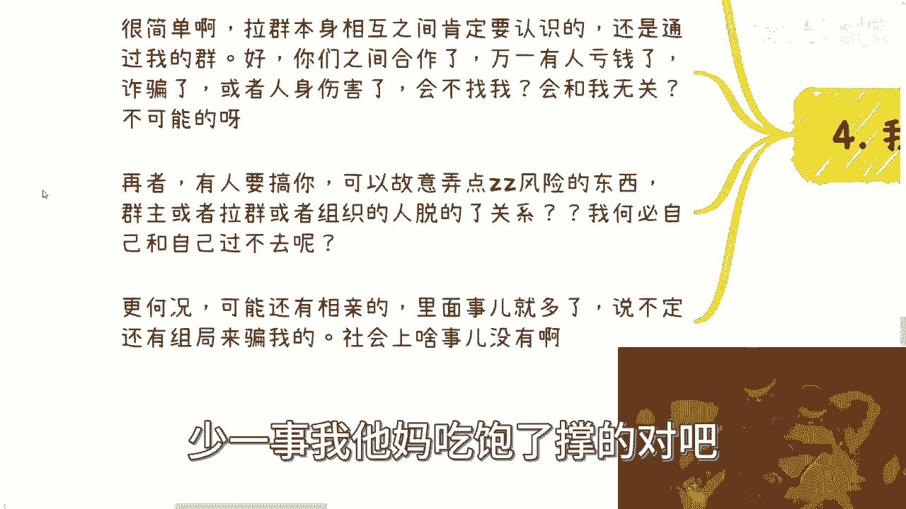

再者有人要搞你，他可以故意搞点政治风险的东西对吧，群主或者拉群的人或者组织人脱得了关系吗，啊我就问脱得了关系吗，啊我可以用我的实际这几年的实际的经验，告诉你们脱不了关系的，你你你再再不济，再不济。

你也得进去做个笔录对吧，我自己跟自己过不去。

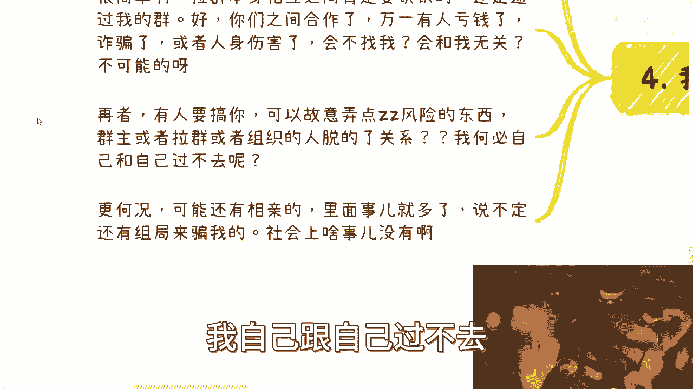

我他妈吃饱了撑的吧，更何况可能这里面比如说除了钱，还有色对啊，这里面或者说可能还有黄赌毒，卧槽这事情多了对吧，还有可能有些你的你的这个图那个地方对吧，对方对立者组织渠来骗你，唉这社会上什么事没有啊。

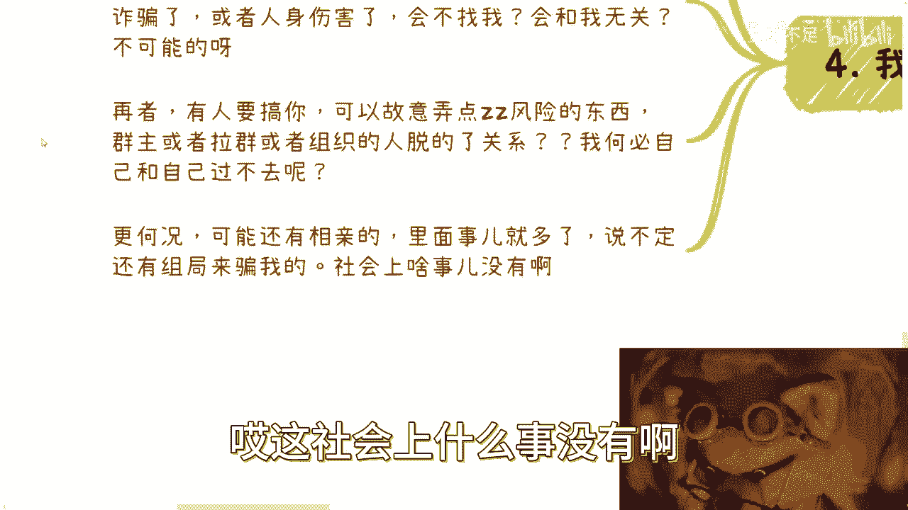

那而且呢，我昨天晚上那个我那个小伙伴还在那边说呢。

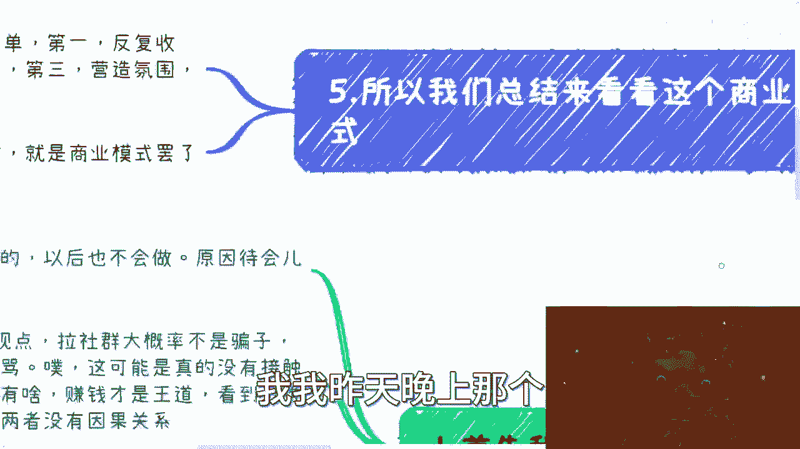

说那个借钱，那我就问嘛，你们万一里面有些人哎呀实在不行了，跟跟我开始说了，哎呀我家里癌症对吧，我家里这样不好，那样不行，哎呀，吕老师借我点钱，你让我怎么弄啊，我每天是妈的。

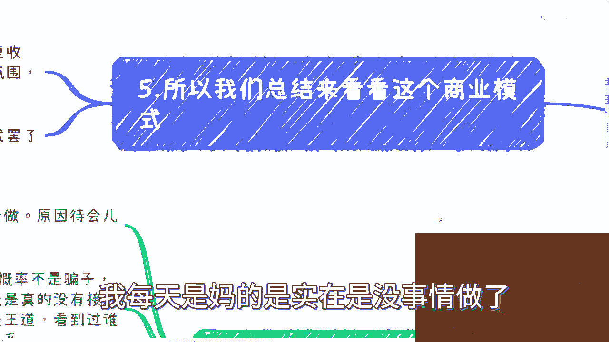

是实在是没事情做了，我他妈开始回答一下这些信息是吧对吧，所以你们我们来总结总结这个商业模式。

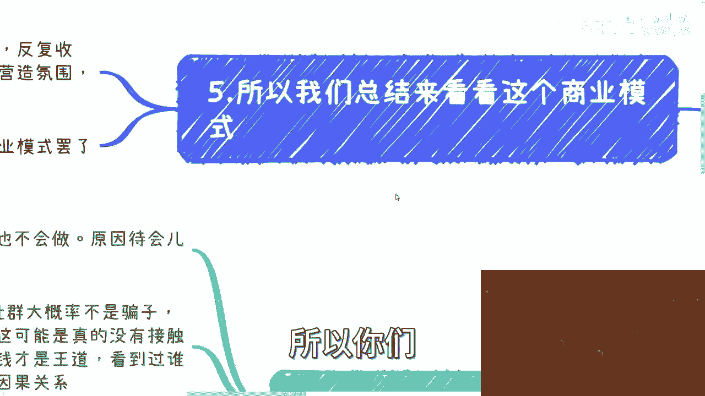

就但凡是个商人，他会让自己没事情做，去接触这种事情不会对不对，那但凡他这种道理，他能做到一个赚钱的人，我相信他一定能明白，那么如果他明白这个道理，他还会去拉社群，为什么很简单。

第一他要做的是反复收割漏斗模型，就是先做社群，比如说一两千人，三四千人做完，他在提供高净值的服务，比如说现在进来是五六百对吧，好后面再提供五六千，最后再提供五六万万的服务，但是我告诉你们。

从我的根本逻辑来讲，一样的道理，都是过家家的服务没有区别的，只不过是通过信息差让你们觉得非常的好像哦，很专业，很怎样子，没卵用，嗯好这是第一点，第二点流量估值，也就是说我拉社群。

可能我并不是从你们身上赚钱，而是或者说我不仅仅从你们身上赚钱，我除了从你们身上赚钱以外，我还会去拉别的甲方，拉品牌方，拉资方来做流量的估值或者流量变现对吧，这是第二点，那说白了就是工具人。

你们就是工具人吗，连人都不如对吧，第三营造氛围，听懂鼓掌对吧，就是什么，就是每天500人，1000人群里面啊，群主牛逼啊，哥比如说1000人里面200个人拖，100个人拖对吧。

或者100个人洗完脑袋对吧，群群主牛逼，各种彩虹屁对吧，好剩下的人一冲动好，我也要付费，我也要付费，好听懂鼓掌对吧，不就这样子嘛，但是但是还是那句话啊，就是说这个东西没有对跟不对，这都是商业模式啊。

你从我的角度来讲，能做出来都很牛逼啊，都是人中龙凤啊，这没毛病啊，但是如果你从商业逻辑上面，我都是认可的，但是只不过就是说你从我角度来讲，我不愿意做这些事，你明白吗，但是我不认为他错或者对。

因为世界上不是所有事情都是错和对。

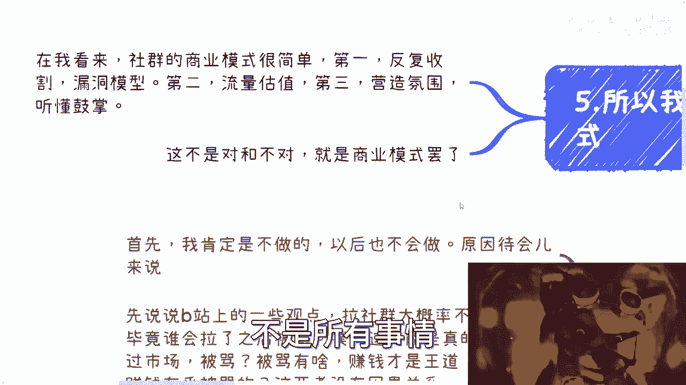

两个东西来判断的啊。

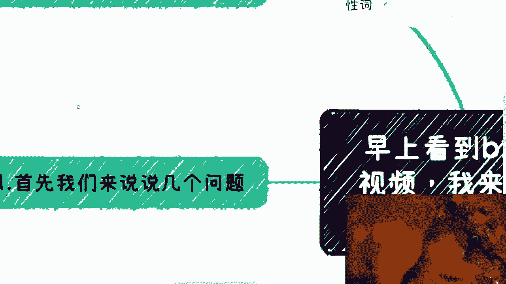

好吧，所以说呢我就觉得就是说愿者上钩上钩嘛对吧，因为所有这种商业模式既然已经存在这么多年，存在即合理，一定是有道理的啊，要么就是说它原本这个商业模式就非常成立，要么就是说这个商业模式在在中国的这种。

普罗大众，在中国这种上下层一线到五线也好，或者怎么样也好，就是这种信息差非常大的，这种国家就非常的成立，没有办法的呀，否则的话你说大家如果认知都非常的，也不叫高吧，就录制都认知都非常正常的话。

你说啊今天在上面画个图对吧，七天我就说啊，七天收益100%，14天收益300%，20，一天收益500%，这种东西会有人信吗，但是我告诉你们，不好意思啊，中国的土地上面就是这种东西。

他妈的一天下午骗个两三千万，三四千万常有的事呀，那为什么呢，不就是因为信息差嘛，对不对，不就是因为氛围烘烘托到了吗，不就是因为就是人来疯吗，对吧，你说你说你在背后骂他啊，骂割韭菜吧，怎么样又怎么样呢。

人家又不少块肉啊，好吧，所以就是说我呢只想告诉你们吧，正常的呃，企业家或者商业的人，他怎么去思考这个问题的啊，至于他做不做一定有他的道理，做一定是因为赚得到钱，不做一定是因为风险高。

而不是说这个逻辑不对啊，这个逻辑我觉得一点毛病都没有，好吧行，那就这么着吧啊啊希望我讲明白了啊啊行吧，那同样的啊，反正呃咨询你们继续走好吧，就是副业啊，或者其他地方啊对啊，当然了，我也说一嘴吧。

我为什么要做这种点对点的咨询，就是因为大锅饭没有用，我帮不到你们，我不知道你们是谁，就是你说昨天评论区也有人问我，他说啊我这个二本我怎么样怎么样，我说我不知道我怎么帮你啊。

因为你得告诉我的是你的性格对吧，你的背景，你以前做过的事情以及你感兴趣的东西，你有很多东西，你得你得属于你的那个属性的东西，你告诉我，我才能给你出主意，我才能告诉你手上牌怎么打，对吧哦。

你但凡我我早就说过了，但凡是一个解决方案，能够解决所有人的问题，那这个解决方案肯定是假的呀，怎么可能嘛，对不对，好吧行。

