# 我们来聊聊社群的商业闭环逻辑---P1---赏味不足---BV1wN411G7h9

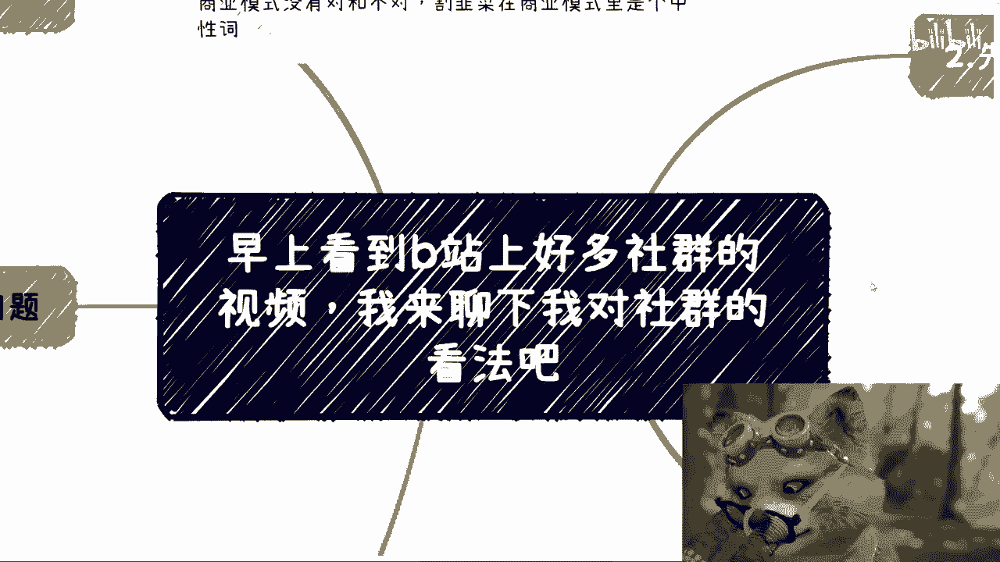

在本节课中，我们将要学习社群背后的商业闭环逻辑。我们将分析为什么有人创建付费社群，以及从商业角度评估其运作模式、潜在风险和收益。课程内容将帮助你理解社群经济的本质，并建立更理性的判断。

---

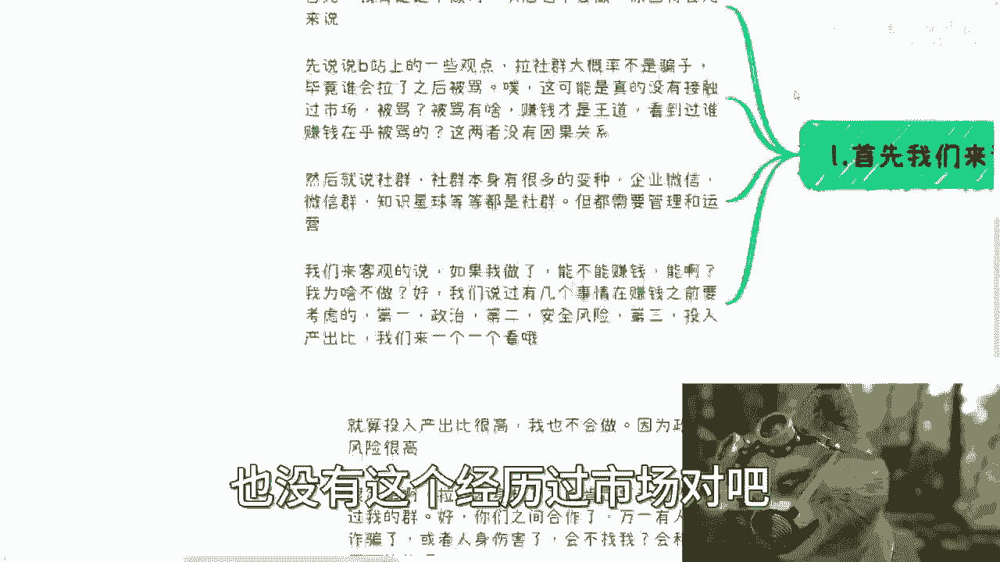

上一节我们概述了课程目标，本节中我们来看看社群的基本定义和常见形式。

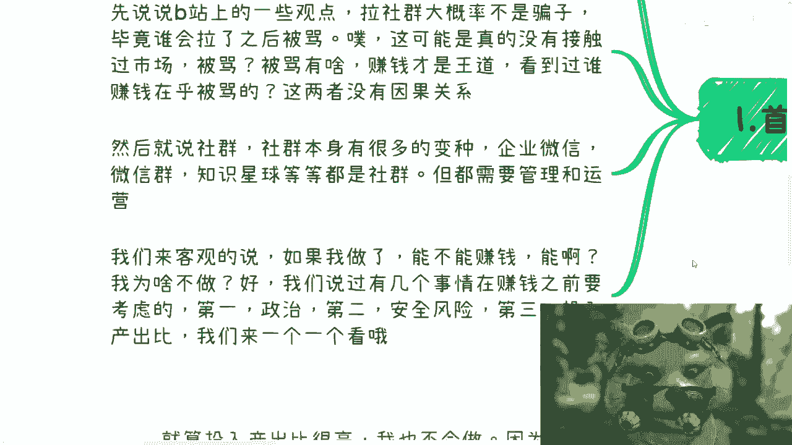

社群有多种变种，例如企业微信群、微信群、知识星球等。这些社群都需要管理和运营。

---

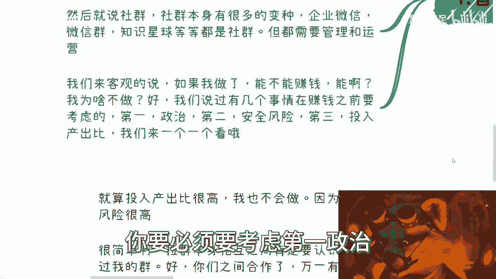

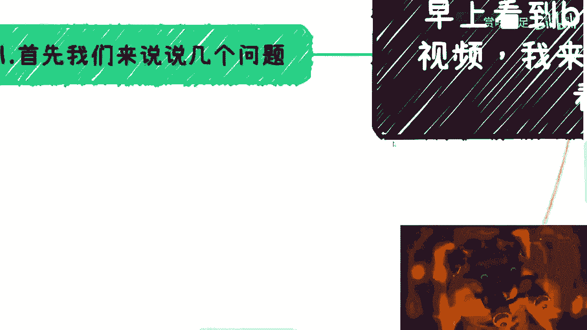

上一节我们介绍了社群的形式，本节中我们来看看关于社群的一个常见误解。

有人认为“敢于拉社群的人，大概率不是骗子”。这种观点认为，拉社群后会面临被骂的风险，因此拉群者需要勇气。

然而，这种观点并不正确。被骂与是否是骗子之间没有因果关系。从商业历史看，被骂从来不是赚钱的障碍。许多商业行为甚至故意制造争议来获取流量和关注。因此，用“是否敢拉群”来判断对方是否可信，是天真且缺乏依据的。

---

上一节我们澄清了一个误解，本节中我们来客观分析创建社群能否赚钱。

从纯粹的商业角度看，运营付费社群确实能赚钱。模式通常是收取数百至上千元的入群费。

但赚钱并非商业决策的唯一标准。一个理性的商业决策需要权衡多个因素，其优先级顺序可能如下：
1.  **政治与安全风险**
2.  **投入产出比**
3.  **直接盈利**

对于我而言，不做社群的首要原因并非不能盈利，而是其他因素的权重更高。

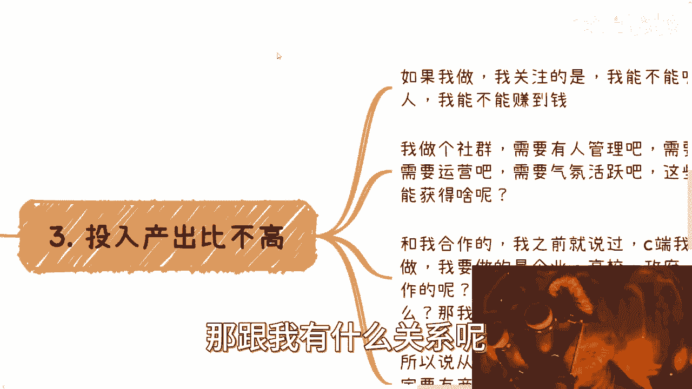

---

上一节我们提到了决策的优先级，本节中我们深入探讨为什么不将“直接赚钱”作为最高优先级。

即使忽略投入产出比，我也不会创建社群，因为政治与安全风险太高。这在我国是最高优先级的考量。

创建社群意味着成为组织者。如果群成员之间发生纠纷，例如金钱诈骗、人身伤害甚至涉及黄赌毒等违法内容，组织者很难完全脱离干系。最轻的情况下也可能需要配合调查，消耗大量时间和精力。

从风险控制的角度看，这是一种“高投入、高不确定性、低必要性”的行为，理性的商人会避免涉足。

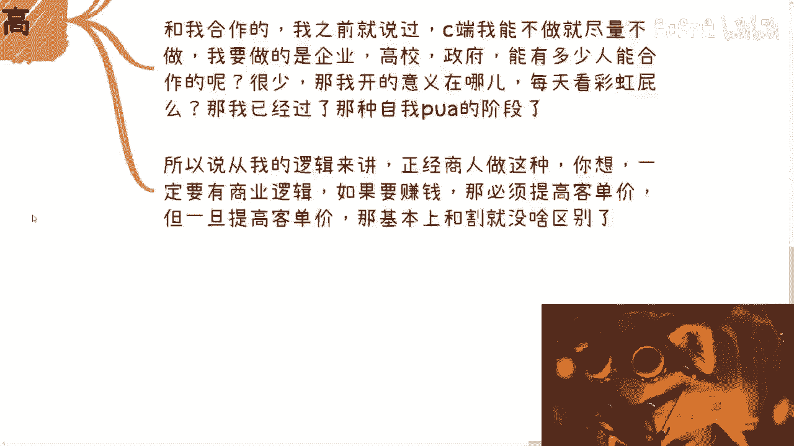

---

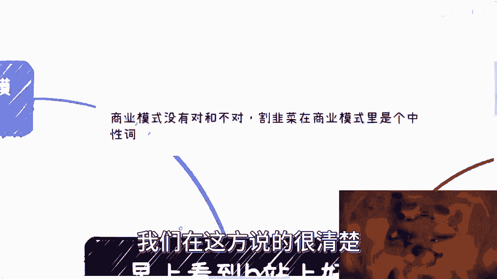

上一节我们分析了风险，本节中我们来看看社群对成员的实际价值。

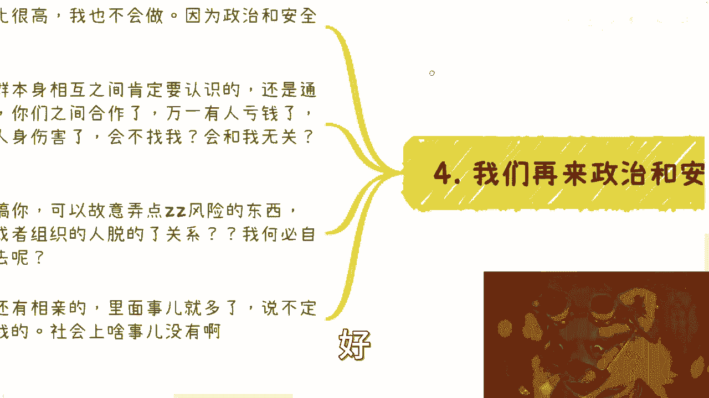

付费社群承诺提供价值，但成员能获得的真实价值有限。

以下是社群价值的几个局限性：
*   **信息质量不高**：高水平的成员在普通社群中更多是娱乐和放松，而非分享核心价值。你能接触到的多是二手信息和个人主观观点。
*   **学习效率低下**：通过社群聊天能学到的知识，其深度和系统性远不如正规学习渠道。如果把社会认知比作0-100分，社群可能只能提供1-15分的内容。
*   **氛围可能虚假**：社群内可能存在“氛围组”（托儿）营造活跃、崇拜的氛围，诱导其他成员冲动消费。

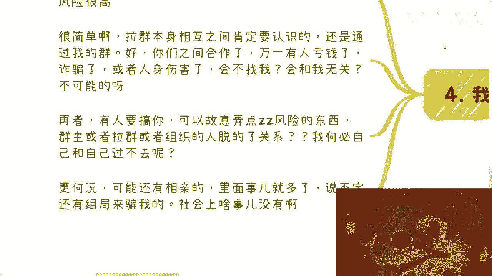

因此，抱着“花几百元就能在社群中学到改变命运的知识”的期望，是不现实的。

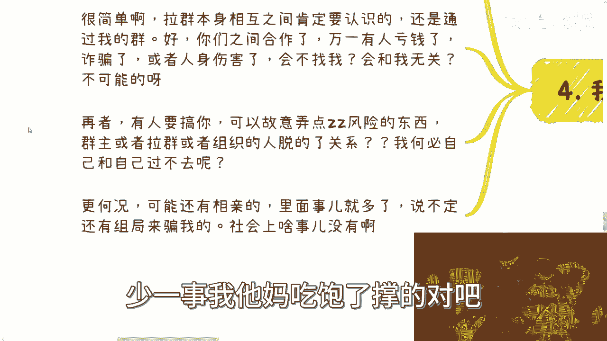

---

上一节我们评估了社群对用户的价值，本节中我们从组织者角度，拆解社群的商业闭环逻辑。

一个旨在盈利的社群，其商业逻辑必须形成闭环。以下是几种常见的商业模式：

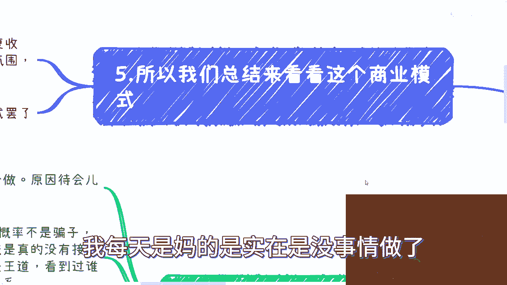

以下是几种核心的社群商业模式：
1.  **漏斗模型与层级收割**：
    *   **公式**：`免费/低价引流 -> 建立信任 -> 推出高价服务`
    *   **描述**：先建立基础社群（如几百元门槛），筛选出高意向用户，再向其销售数千甚至数万元的高阶课程或服务。
2.  **流量估值与变现**：
    *   **描述**：社群本身不是利润终点，而是“资产”。组织者通过运营一个活跃社群（工具人集合），向品牌方、投资方证明自己的影响力和流量价值，从而获得投资或广告合作。
3.  **氛围营销与冲动消费**：
    *   **描述**：在社群内利用“托儿”或忠实粉丝营造“群主牛逼”、“听懂鼓掌”的氛围，激发其他成员的从众心理和冲动情绪，促进付费转化。

这些模式在商业上是中性的，它们利用信息差和人性弱点，本身是一种存在的“商业模式”。其核心在于 **`利用信息差创造感知价值，并通过运营实现变现`**。

---

上一节我们剖析了社群的商业逻辑，本节中我们来总结并提升认知。

社群商业模式能长期存在，源于巨大的“信息差”。在中国这样地域辽阔、发展不均衡的市场，不同群体间的认知差异显著，这为各种基于信息差的商业模式提供了土壤。

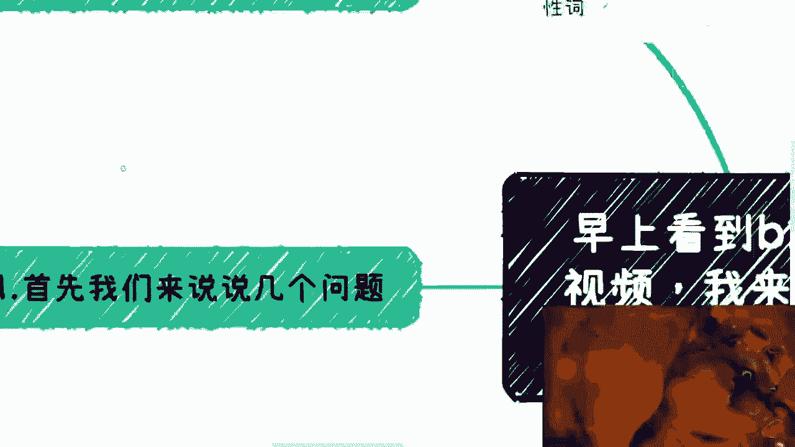

一个商业行为是否被执行，关键取决于决策者的权衡：
*   **执行**：一定是因为在当前条件下，**收益 > 风险 + 成本**。
*   **不执行**：一定是因为 **风险 > 收益**，或存在更优选择。

因此，看待社群不应简单用“对错”或“道德”评判，而应将其理解为一种**特定的商业产品**。它的目标用户是那些存在特定信息需求、并愿意为此支付溢价的群体。

---

本节课中我们一起学习了社群经济的商业逻辑。我们首先定义了社群，并驳斥了关于它的常见误解。然后，我们从组织者角度分析了决策时需权衡的风险、成本与收益。接着，我们评估了社群对成员的真实价值，并揭示了其背后的几种核心商业模式：漏斗收割、流量估值和氛围营销。最后，我们认识到这一切的根源在于“信息差”，并理解了商业决策的本质是权衡利弊。

希望本课能帮助你更理性地看待各类付费社群，看清其商业本质，从而做出更符合自身利益的判断。