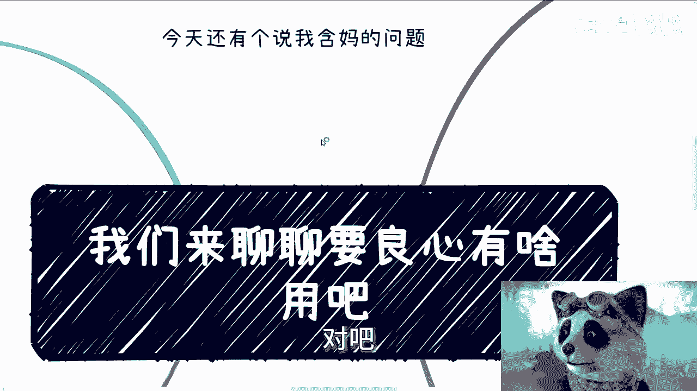
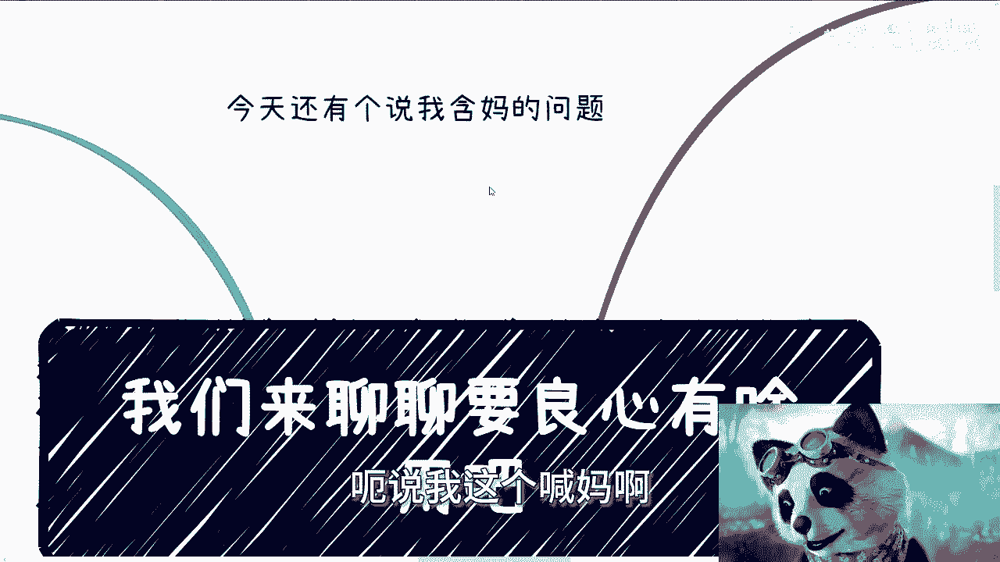
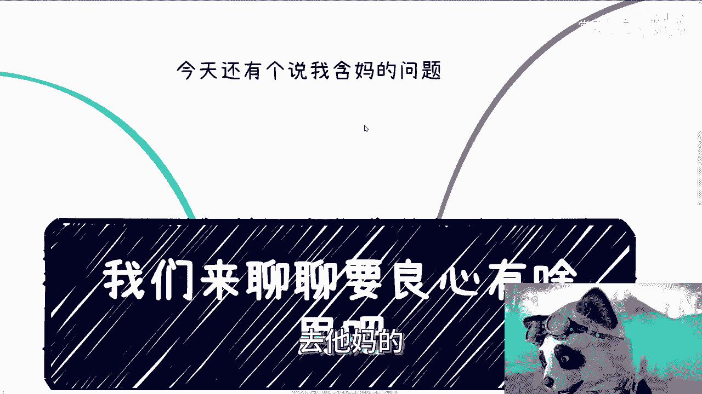
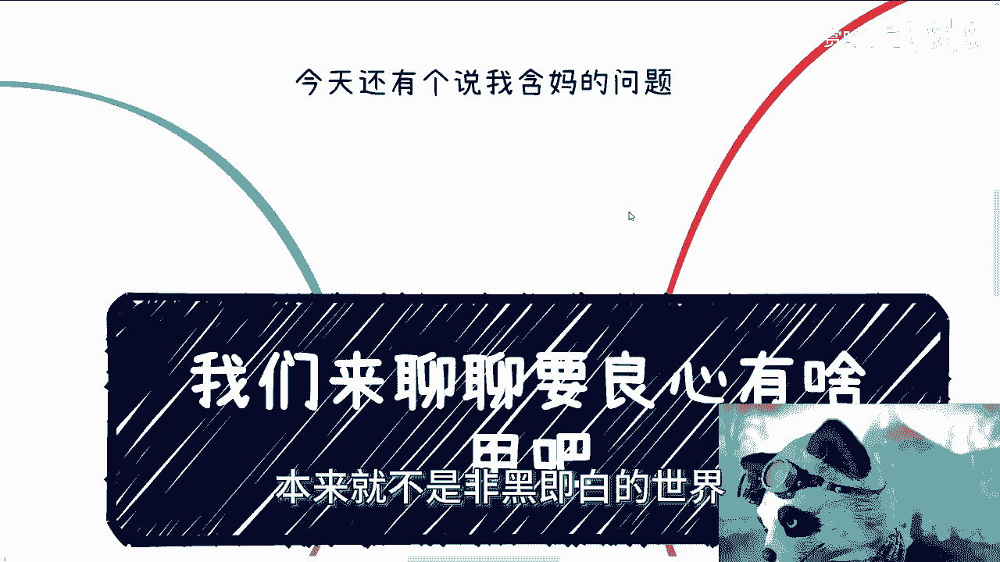
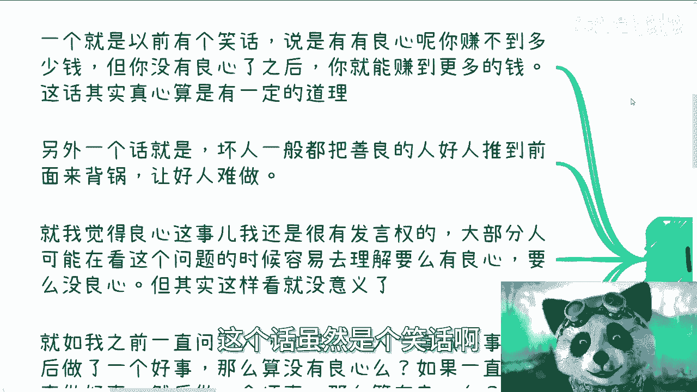
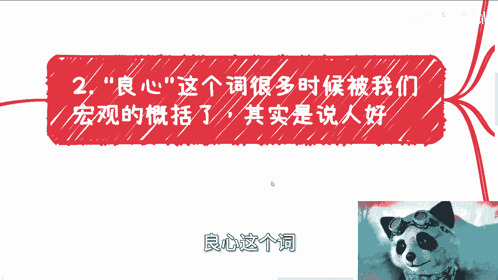
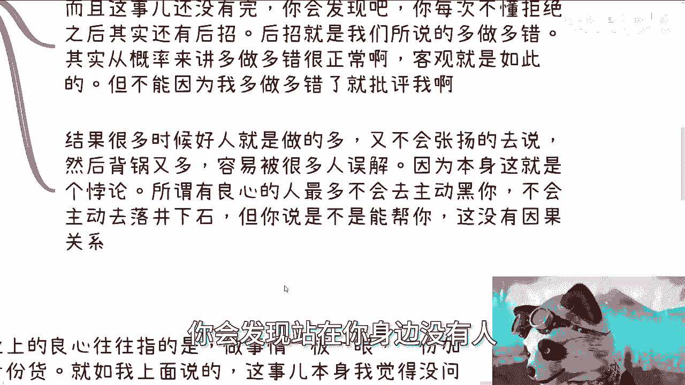
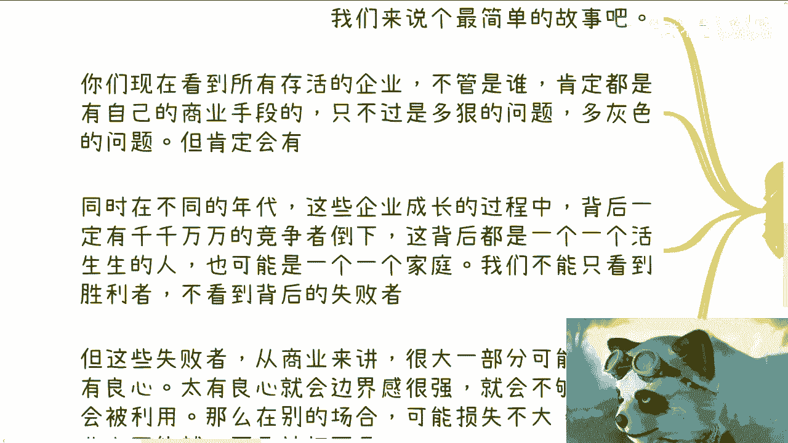
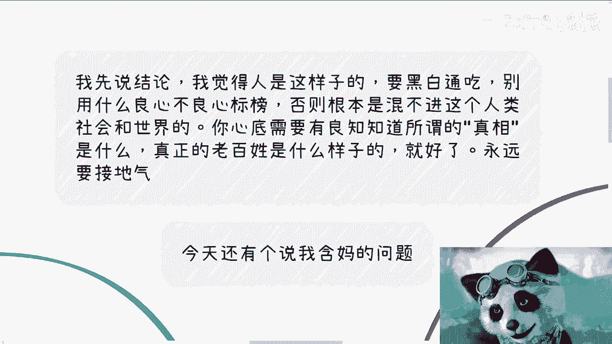

# 我们来聊聊要良心有啥用 - P1 - 赏味不足 - BV1zZ421z7JX

大家好，我今天忙了一天。

哎，现在才有空回来啊，然后那个因为过年了嘛对吧。

我们也可以聊一些稍微轻松一点的话题是吧，因为这两天也都在聊聊应试教育啊，然后我也看到了很多人，很多小伙伴跟我聊这个商业的问题。

呃，首先我得先说一点啊，昨天评论区有一个人啊就被我拉黑了啊，他说什么呢，说啊我这个录视频啊，为人师表啊，呃说我这个韩妈啊。

就是他妈的这个含妈的量太高啊，然后觉得好像啊，我不符合这个什么什么什么要求，什么什么什么东西啊，说了半天啊，嗯我只想说一点啊，连B站这个平台都还没管，哪里轮得到你来管我啊，诶奇了怪了，为人师表。

我不觉得我为人师表，你要觉得那是你的事情，跟我他妈的什么关系，对不对啊，我觉得我就是自己录个视频，怎么了呢，你还来管我怎么录啊，我只想回一句啊，去他妈的啊。

然后来说说这个良心，因为这两天聊商业的时候呢。

很多小伙伴跟我聊到了这个良心啊，说这个良心，我先说结论啊，我觉得人是这样子的，首先你这个人不能太黑，你也不能太白，不能太正，不能太邪，你必须要亦正亦邪，为什么，因为这个社会就是这个样子。

否则你看不到全貌啊，也就是说千万不要用什么良心，不良心去标榜自己啊，否则你是混不进人类这个社会跟世界的，我不管，因为我看到这两天评论区很多人我也知道了，大家还很年轻嘛对吧，还在学校嘛，还没有出来嘛对吧。

你等你记住我现在这句话，你们回头总归要进去的对吧，总归要进入这个社会跟世界的，你不可能一辈子独善其身的，当然你要有本事，那最好我觉得也无所谓啊，嗯所以说呢我觉得就是你心底需要有良知。

去知道所谓的真相是什么，我不管你怎么对外去说，我也不管你怎么去割别人啊，但是你内心得要知道，你不要自己把自己骗了，你也要知道真正老百姓是什么样子的，我觉得就好了啊，你要让你永远接地气。

当然不要再去用什么啊，我有良心或没有良心，本来就不是非黑即白的世界。

你单纯这么说有什么用呢，好那么第一啊让我想到这两句话。

一个呢就是以前有个笑话说什么说呢，你有良心呢，你就赚不到多少钱，但是你没有良心，你就能赚到更多的钱，这话虽然是个笑话啊。

但是也算有一定道理，另外一个话是什么呢，就说啊这个坏人一般呢把善良的人呢，往往前面推啊，推了呢来背锅，让所谓的好人难做对吧好呃，就我觉得良心这个事儿我还是很有发言权的，为什么呢。

因为大部分人可能在这看这个问题，很容很很容易去理解，就是要么就是有良心，就没良心对吧，就是非零即一啊，但其实呢这样看本身没有意义啊，你就如我之前一直问别人，我说如果一个人一直做坏事。

然后突然做了一件好事，那算有良心吗，还是算没有良心，那如果一个人一直做好事，然后做了一件坏事，那么算有良心还是不算有良心对吧好，那么我们我再给你们讲讲个点啊，如果你们今天做了一件事情。

蝴蝶效应之后导致了20步，30步，甚至20天，30天，30年，40年之后某一件事情啊，比如说杀人放火了，或者说伤害到了别人，那我就问你算不算一个有良心的人，对吧啊，就是很多时候我觉得有些人是蠢。

有些人是坏，那也就是说他可能明明知道他做某些事情，是会伤害到别人，但是呢他属于不直接伤害，间接伤害，然后呢他还能站在高德的制高点来跟大家说，你看我我没有，我什么都没做对吧，那你说这种人算是有良心。

没有良心好。

那么接下来我们继续来讲良心这个词。

我觉得很多时候被我们宏观的概括了，其实是说人好啊，就是人好这个事啊，我觉得是很好的对吧，那当然了，我总不能觉得人很坏很好吧，对不对，但是我们所受到的教育，让我们的所谓的好扩散到了太多的地方。

就是你好没问题，但是你不能什么都好对吧，就像我们一直说的，柿子挑软的捏，为什么，因为软的好捏对吧，然后有很多人跟我说，那陈老师我不会的，我就不会，那不好意思，我就告诉你了，我曾经视频里面也提到过。

只是你今天没有这个契机，你屁股没有到那个位置，你到了你也会，你为什么，因为别的不好捏，这就是人性啊对吧，比如我们以前说过的，不懂拒绝哎，我跟你讲这事啊，比如说那个谁小张啊，这是你加个班啊。

双休生你做一下啊，公公司合伙之后对吧，比如说他总是把那个脏活累活分配给你，很多时候我觉得这些人心里不是不懂啊，他们会跟朋友会跟闺蜜吐槽，他们怎么会不知道呢，人又不傻对吧。

但是为什么他不反抗爱与所谓的人好，他不懂拒绝，就什么叫做刀子嘴豆腐心，就是她跟朋友跟闺蜜吐槽的时候，可以说是110的好手，但是在跟别人嗯，就是跟真正的这些当事人对接的时候，你就会发现好了，唯唯诺诺。

对不对，或者说就是笑脸相迎，那怎么办呢，对吧，而且你会发现这些事吧，往往往往呢他没有完，你会发现啊，你每次不懂拒绝之后，其实还有后招啊，后劲很大啊，你比如说啊后招就是我们所说的啊。

他会把什么多做多错挂你头上，你说从概率学角度来讲，多做多错，他发的很正常，对不对，客观就是这样子的，有什么问题呢，但是你不能因为我多做多错啊，或者说因为我去多做了，然后用多做多做多错。

这个这个所谓的这个这个，这个这个这个莫名其妙的东西来批评我吧对吧，那结果很多时候呢好人就是做的多啊，但是呢又不会去张扬的去说啊，那么正因为不会张扬，所以知道的人很少，然后背锅就开始多了啊。

容易被很多人误解，因为这个事件本身就是个悖论，为什么，因为所谓有良心的人，所谓那些好人，他最多是不会去主动黑你，也就叫我人不犯我，我不犯人，他不会主动去落井下石，但是你说他是不是真的会帮你。

这没有因果关系，所以这也是为什么你会发现出了事的事情，出了事的时候，你会发现好像帮你的人很少或者怎么样子，那是因为就像我们刚刚说的，不会落井下石，不代表会帮你，但是不帮你的人。

他落井下石的概率就很高对吧，这不就是一个道理吗，所以你到最后会发现两边就是我们两军对战，你会发现站在你这边没有人。

第三我们说商业上的良心是什么。

商业上的良心往往指的是什么，做事情一板一眼，一份价格一份货，我他妈字打错了啊，一份价格一份货啊，然后不会用手段，就老老实实，这叫商业上的两性，就如我上面说的，这事本身我觉得没有问题，也是必须大力提倡的。

但是由于环境和土壤到今天是如此的，它导致最终就是不得好死，你知道吗，我在微博上早就说过了，就老实人，这就是不得好死啊，我们很多人的内心是什么，就是当我做一件事情的时候，我一定要做好。

哪怕今天我他妈不赚钱，我也要争口气，我知道没问题，所有人都这么过来的啊，你说这个事对不对对啊，但是我得跟你分析是什么意思，就是如果你有别的收入来源，如果你翅膀够硬，你有足够的家底，那是没问题。

那的确是对的，该争就争对吧，我可以不赚钱甚至贴钱，但如果你没有呢，你连生存都有问题，那我告诉你啊，你这叫自我感动，这叫啊，这叫活该，你懂吗啊，人善被人欺，这在商业上更加淋漓尽致的就是嗯。

咳咳就是你会发现一个善良的人，在商业上最常见的现象是什么，就是不停的被白嫖，就是不停的被白嫖，然后白嫖了还赚还赚不到钱啊，然后赚到钱就是比如说给你点钱吧，这就叫有良心，在商业上有良心的人啊。

因为我聊下来，我发我发现很多人内心他是这样子的，就是我对别人好，我要去维护这个关系，我要我我我希望就是说未来有商业项目的时候，他能够帮我，我对别人好，别人就会对我好，这两件事情没有因果关系，你知道吗。

就是很多人都会觉得有因果关系，怎么会有因果关系，你哪怕今天你是一个有良心的人，对方也是个有良心的人，我也不能完全认为你对别人好，别人就会对你好，这他妈就没有因果关系对吧，你对我们自己来讲是什么。

我觉得能做到的是什么，就是如果你有两项，我觉得能做到的是什么，就是人不犯我，我不犯人，但是但是我对别人好，别人对我怎么样，我他妈的鬼知道啊，天知道啊，我们再来说故事啊，我们来说个最简单的故事。

就是你们现在你们想想看啊，我在咨询的时候，其实一直会问别人这个问题，我说你们如果要说这个灰色不灰色，你们如果要说好跟坏，我就问我说你们觉得现在存活到现在，所有的企业，不管是谁，他算好还是算坏啊。

那很多很多人就跟我说，我跟你讲，95%以上的人都跟我说，好的，给社会做出贡献，提供了非常多的就业岗位，对吧，好，没问题，我告诉你们啊，不管是谁，他只要能活到现在，肯定都有自己的商业手段。

只不过是多狠的问题，他也一定有他的灰色地带，只不过是多灰色的问题，不可能是零的啊，因为是零，他就活不到现在啊，而且同时在不同的年代，这些企业的成长过程当中，他背后也一定有千千万万的竞争者，是倒下的对吧。

这背后都有一个一个活生生的人，这人的背后也是一个活生生的家庭，我们不能只看到这些，记得这些胜利者，既得利益者活到现在的幸存者，不看到背后的失败者，他的比例可能是一比1000，可能是一比1万了。

背后的失败者才是真正值得我们学习的对吧，然而这些失败者从商业角度来讲，很大一部分可能就是因为他有良心，你懂吗，他有良心注定会什么，会边界感很强，而且这种边界感很容易是自我营造出来的。

这个自我感动的边界感啊，而且就会不够狠，就会被利用，那么你在别的场合可能就是说损失不大，你知道吗，在别的一些一些一些场景当中，可能损失不大，但是你在商业上它可能就是致命一击啊对吧，所以我们就来问啊。

这些企业今天无论捐多大的款，做多少事情，提供多少岗位，你能单纯的用好和不好来判断吗，你能去说他有良心和没有良心吗，不能对吧，就是我们如果真的要去判断，我们只能说在这当中，如果他们别人不犯，他们。

他们不会主动去坑别人，害别人，或者说怎么样，那我觉得这个聚焦就有良心的，但是我可以大概率的说，不可能，因为就算创始人是好的，这公司里面这么多的公关，这么多的销售，这么多的这种员工，谁能保证啊。

我一个公司，比如说几万人，十几万人都他妈是好人啊，可能吗。

所以说啊我们回到最核心的这个点，所以说你还是那个观点是什么意思呢，就是，社会发展规律，人类世界发展规律，它就是这个样子的对吧，因为如果我纯粹的是一个完全有良心的人，我就是背后那堆尸体对吧。

但是如果我又是一个纯粹没有良心的人，那你们今天就看不到这个视频，你怎么来判断呢，对吧，或者说你们能看到这个视频，或者能看到我500多个视频，但是我500多个视频不会给你们讲这些东西。

我全部给你们灌心灵鸡汤，怎么了呢，怎么了呢，中国14亿人，总有人能吃这一套，怎么了呢，我不懂，是因为我不懂吗对吧。

你们知道吗，咨询的时候还有人问我，他说陈老师，你为什么在政企合作，在很多东西上面你不往上再去走一些，我说大哥大姐不是我不能走，但是我不想走，你知道吗，因为我知道再往上走，他很多东西我不是我接受不了。

我装不出来呀对吧，你们从我视频当中就能知道，我不是这么个油滑的人啊，我装不出来啊，你让我面对一个，然后笑脸相迎来表示爱，你不是个，你是个牛逼人，不好意思，我做不到，就这么简单啊，嗯嗯行啊，就这么着。

那个其他反正有任何问题的啊，呃商业啊，合同啊，什么什么BP啊，计划书，什么职业规划或者别的东西，你们有详细问题或者想了解一些更多的对吧，我们说我没有办法，在在在这种公开平面上面给你们讲了。

