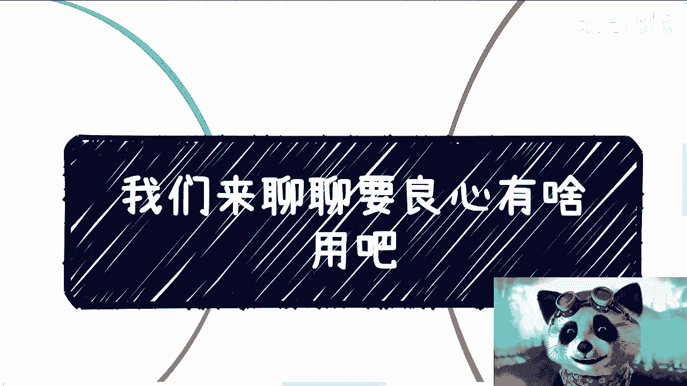

# 课程 P1：聊聊“良心”有什么用？🤔

在本节课中，我们将探讨“良心”这个概念在现实社会与商业环境中的复杂角色。我们将分析为何单纯用“有无良心”来评判人或事是片面的，并理解在真实世界中保持内心良知与应对外部规则之间的平衡。

---

## 开场白与背景

我今天忙碌了一整天。

现在才有时间回来。因为临近过年，我们可以聊一些相对轻松的话题。这两天讨论了许多关于应试教育的内容，我也看到很多朋友与我探讨商业问题。

首先需要说明一点。昨天评论区有一个人被我拉黑了。他说我录制视频、为人师表，但视频中“含妈量”太高，认为我不符合某些要求。

我只想说，连B站平台都尚未管理此事，轮不到你来管我。我并不认为自己“为人师表”，如果你这样认为，那是你的事，与我无关。我只是自己录制视频，你无权干涉我如何录制。对此我只想回应一句：去他的。

---

## “良心”的二元误区

现在我们来谈谈“良心”。因为在讨论商业时，很多朋友提到了“良心”。

我先说结论。我认为人是这样的：首先，一个人不能太黑，也不能太白；不能太正，也不能太邪。你必须亦正亦邪。因为社会本身就是如此，否则你看不到全貌。千万不要用“有良心”或“没良心”来标榜自己，否则你无法融入人类社会与世界。

我知道评论区很多人还很年轻，仍在学校，尚未步入社会。但请记住我这句话：你们最终总要进入社会和世界的，不可能一辈子独善其身。当然，如果你有本事，那最好，我觉得也无所谓。

因此，我认为你心底需要有良知，去了解真相是什么。无论你对外如何宣称，无论你如何“割”别人，但你内心必须清楚，不要自己欺骗自己。你也需要知道真正的老百姓是什么样子，让自己永远接地气。不要再使用“我有良心”或“我没有良心”这种说法，因为世界本就不是非黑即白的。

---

## 关于“良心”的两个常见观点

单纯这么说没有意义。首先，我想到两句话。

第一句话是一个老笑话：**“你有良心，就赚不到多少钱；你没有良心，就能赚到更多钱。”** 这话虽是笑话，但有一定道理。

另一句话是：**“坏人通常把善良的人推到前面背锅，让所谓的好人难做。”**

关于“良心”这件事，我很有发言权。因为大部分人看待这个问题，很容易理解为要么有良心，要么没良心，即 **`非0即1`**。但这样看待本身没有意义。

就像我一直问别人的：如果一个人一直做坏事，突然做了一件好事，那算有良心还是没良心？如果一个人一直做好事，然后做了一件坏事，那算有良心还是没良心？

我再讲一个点。如果你们今天做了一件事，其蝴蝶效应在20步、30步之后，甚至在20天、30天、30年、40年之后，导致了某件坏事（比如杀人放火或伤害他人），那我问你，这算不算一个有良心的人？

很多时候，我觉得有些人是蠢，有些人是坏。他可能明明知道做某些事会伤害别人，但这属于间接伤害。他还能站在道德制高点说：“你看，我什么都没做。” 那你说这种人算有良心还是没良心？

---

## “好人”的困境与人性现实

接下来我们继续讲“良心”这个词。我觉得很多时候它被我们宏观地概括为“人好”。“人好”这件事当然很好，我总不能认为“人坏”很好吧？

但我们所接受的教育，让我们把所谓的“好”扩散到了太多地方。你好没问题，但你不能什么都好。就像常说的：柿子挑软的捏。为什么？因为软的好捏。

很多人跟我说：“陈老师，我不会的，我就不会。” 那不好意思，我告诉你，我在视频里也提到过：只是你今天没有那个契机，你的屁股没坐到那个位置。你到了，你也会。为什么？因为别的不好捏。这就是人性。

例如，我们以前说过的“不懂拒绝”。比如，小张，你加个班，双休日你做一下，公司合并之后…… 比如，他总是把脏活累活分配给你。很多时候，我觉得这些人心里不是不懂，他们会跟朋友、闺蜜吐槽，他们怎么会不知道呢？人又不傻。

但为什么他们不反抗？源于所谓的“人好”，他们不懂拒绝。什么叫“刀子嘴豆腐心”？就是她跟朋友、闺蜜吐槽时，可以说是“110”的好手，但在跟真正的当事人对接时，你就会发现她唯唯诺诺，或者笑脸相迎。那怎么办呢？

而且你会发现，这些事往往没完。每次不懂拒绝之后，其实还有后招，后劲很大。后招就是我们所说的：他会把“多做多错”挂在你头上。从概率学角度讲，多做多错很正常，客观就是如此，有什么问题呢？但你不能因为我“多做多错”，或者因为我多做了，就用“多做多错”这个莫名其妙的东西来批评我吧？

结果很多时候，好人就是做得多，但又不会去张扬地说。正因为不会张扬，所以知道的人很少，然后背锅就开始多了，容易被很多人误解。因为这事件本身是个悖论。

为什么？因为所谓有良心的人，所谓那些好人，他最多是不会主动黑你，也就是“人不犯我，我不犯人”，他不会主动落井下石。但你说他是不是真的会帮你？这没有因果关系。

所以这也是为什么你会发现，出了事的时候，好像帮你的人很少。那是因为，就像我们刚刚说的：不会落井下石，不代表会帮你。但是，不帮你的人，他落井下石的概率就很高，对吧？这不就是一个道理吗？

所以你到最后会发现，两军对战时，站在你这边没有人。

---

## 商业世界中的“良心”

第三，我们说商业上的良心是什么。商业上的良心往往指的是：做事情一板一眼，一份价格一份货（注：此处为“一份价格一份货”），然后不会用手段，就老老实实。这叫商业上的良心。

如上所述，这事本身我觉得没有问题，也是必须大力提倡的。但由于环境和土壤到今天为止是如此，它导致最终就是“不得好死”。我在微博上早就说过了：老实人，这就是不得好死。

我们很多人的内心是：当我做一件事情的时候，我一定要做好，哪怕今天我不赚钱，我也要争口气。我知道没问题，所有人都这么过来的。你说这个事对不对？对。

但我得跟你分析是什么意思：如果你有别的收入来源，如果你翅膀够硬，你有足够的家底，那是没问题，的确是对的，该争就争。我可以不赚钱甚至贴钱。但如果你没有呢？你连生存都有问题，那我告诉你，你这叫自我感动，这叫活该。

人善被人欺，这在商业上更加淋漓尽致。你会发现一个善良的人，在商业上最常见的现象就是：不停地被白嫖。白嫖了还赚不到钱，然后赚到点钱，别人就觉得这叫“有良心”。

在商业上有良心的人，因为我聊下来发现很多人内心是这样想的：我对别人好，我要去维护这个关系，我希望未来有商业项目时，他能够帮我。我对别人好，别人就会对我好。

**这两件事情没有因果关系。** 你知道吗？就是很多人都会觉得有因果关系。怎么会有因果关系？你哪怕今天你是一个有良心的人，对方也是个有良心的人，我也不能完全认为“你对别人好，别人就会对你好”。这根本就没有因果关系。

对我们自己来讲，我觉得能做到的是：**人不犯我，我不犯人**。但是，我对别人好，别人对我怎么样？我鬼知道，天知道。

我们再来说个故事。你们想想看，我在咨询时，其实一直会问别人这个问题：我说你们如果要说灰色不灰色，你们如果要说好跟坏，我就问，你们觉得现在存活到现在的所有企业，不管是谁，他算好还是算坏？

那很多人就跟我说，我跟你讲，95%以上的人都跟我说：好的，给社会做出贡献，提供了非常多的就业岗位。好，没问题。

我告诉你们：不管是谁，他只要能活到现在，肯定都有自己的商业手段，只不过是多狠的问题。他也一定有他的灰色地带，只不过是多灰色的问题，不可能是零的。因为是零，他就活不到现在。

而且同时，在不同的年代，这些企业的成长过程中，他背后也一定有千千万万的竞争者是倒下的。这背后都有一个一个活生生的人，这人的背后也是一个活生生的家庭。我们不能只看到这些胜利者、既得利益者、活到现在的幸存者，而不看到背后的失败者。他的比例可能是1:1000，可能是1:10000。

背后的失败者才是真正值得我们学习的。然而这些失败者，从商业角度来讲，很大一部分可能就是因为他有良心。你懂吗？他有良心注定会边界感很强，而且这种边界感很容易是自我营造出来的、自我感动的边界感。而且就会不够狠，就会被利用。

那么你在别的场合，可能损失不大，在商业上它可能就是致命一击，对吧？所以我们就来问：这些企业今天无论捐多大的款，做多少事情，提供多少岗位，你能单纯地用“好”和“不好”来判断吗？你能去说他有良心和没有良心吗？不能。

就是我们如果真的要去判断，我们只能说：在这当中，如果他们“别人不犯他们，他们不会主动去坑别人、害别人”，那我觉得这就叫有良心的。但是我可以大概率地说：不可能。因为就算创始人是好的，这公司里面这么多的公关、这么多的销售、这么多的员工，谁能保证？我一个公司，比如几万人、十几万人，都是好人啊？可能吗？

---

## 核心观点与个人选择

所以说，我们回到最核心的这个点。我的观点是：社会发展规律、人类世界发展规律，它就是这个样子的。因为如果我纯粹是一个完全有良心的人，我就是背后那堆尸体。但是如果我又是一个纯粹没有良心的人，那你们今天就看不到这个视频。你怎么来判断呢？

或者说，你们能看到这个视频，或者能看到我500多个视频，但是我500多个视频不会给你们讲这些东西，我全部给你们灌心灵鸡汤，怎么了呢？怎么了呢？中国14亿人，总有人能吃这一套。怎么了呢？是我不懂吗？

你们知道吗？咨询的时候还有人问我，他说：“陈老师，你为什么在政企合作、在很多东西上面，你不往上再去走一些？” 我说大哥大姐，不是我不能走，但是我不想走。因为我知道再往上走，很多东西不是我接受不了，是我装不出来呀。

你们从我视频当中就能知道，我不是这么个油滑的人，我装不出来。你让我面对一个人，然后笑脸相迎来表示“你是个牛逼人”，不好意思，我做不到，就这么简单。

---

## 总结与结尾

在本节课中，我们一起探讨了“良心”这一概念的复杂性。我们了解到：

1.  世界并非简单的非黑即白，用“有无良心”来标签化地评判人或事是片面且无意义的。
2.  “好人”在现实和商业环境中可能面临更多困境，如被利用、背锅和难以生存。
3.  在商业世界，纯粹的“良心”可能意味着竞争力不足，而成功存活的企业往往需要在规则与手段间找到平衡。
4.  最重要的是保持内心的良知，了解真相，同时理解外部世界的运行规则，做到“人不犯我，我不犯人”，而非天真地期待“我对别人好，别人就会对我好”。

核心在于：**内心保有良知与清醒认知，对外懂得社会运行的复杂规律，在“正”与“邪”之间找到属于自己的生存之道。**

其他有任何关于商业、合同、BP计划书、职业规划等详细问题，或想了解更多内容，我们无法在这种公开平台详细展开讨论。