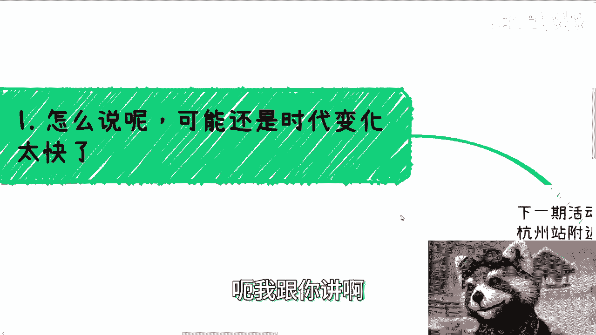
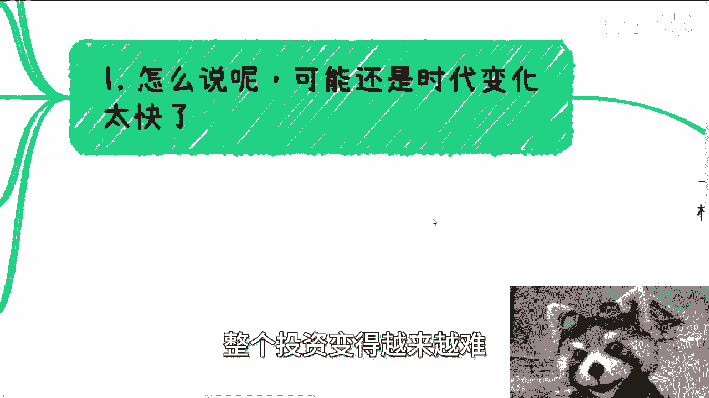
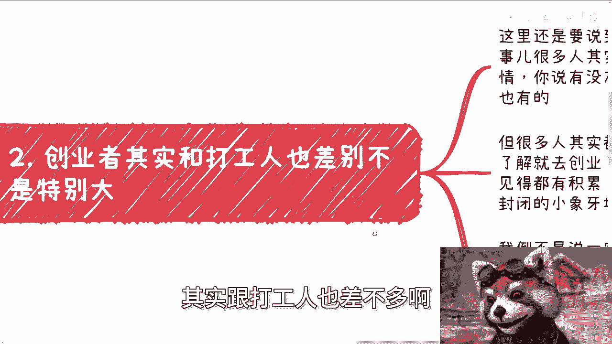
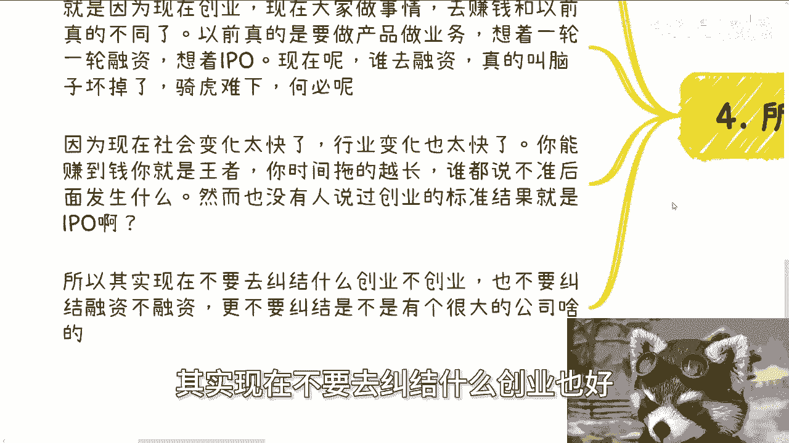

# 我们来聊聊身边所谓的创业者吧 - P1 - 赏味不足 - BV1pJ4m1N7TA

好大家好，今天难得又是白天能给大家来录，啊，呃下一期活动定了，5月25号下午在杭州好吧，活动地点在杭州站附近啊，我顺便提一点啊，杭州有个站就叫杭州站啊，你别来问我了吗，杭州站是哪个站吧。

杭州站就叫杭州站啊，呵呵好吧，详细内容跟报名可以私信啊，然后那个今天我们讲的这个内容呢，就是因为之前我们讲的学历对吧，讲了同学啊，讲了导师啊，那我们再来讲讲身边的这个创业者啊，呃我跟你讲啊。

其实本质上呢还是因为时代变化太快，就是呃很多人呢对创业或者创业者的概念呢，还停留在其实也不叫很老的时代，但还是因为变得太快啊，就停留在可能可能56年前，78年前这个样子啊。

那么创业呢就跟现在很多人做自媒体一样的，基本上就是在当年就全民在做，毕竟啊你们去查一下，以前是有政策的啊，以前是真的有政策啊，就全全民创业啊，那么创业者呢其实跟现在很多自媒体呢一样。

他就是说呃就很多人来做呢，他其实都是他妈的什么都不懂的啊，你别以为好像妈牛逼啊，没啥牛逼的啊，然后就说呃感觉好像这个几个人凑在一起，或者有个idea就他妈去做了，妈的，你们看看。

现在身边做自媒体的不都也这个吊样子吗，对吧一样的呀，那他就说的好听呀，那人家问你在干嘛哦，我在创业，牛逼啊对吧，牛逼个屁，我跟你讲啊，那当然啊我们不得不说以前呢能做的原因呢，一方面因为市场经济都还不错。

另外一方面呢政呃政府政策也非常扶持，另外在另外一方面呢，中国也吃到了互联网跟移动互联网的红利啊，如果这三个里面缺任何一个，当时都不至于这么鼎盛啊，说实话也不至于这么鼎盛，而且你们也不可能就说。

听到很多人说什么创业啊对吧，怎么样怎么样啊，不现实的啊，虽然都是幸存者偏差，但是呢也没有这么的幸存者偏差啊，但其实你们简单了解一下就知道啊，真正的风投其实没有几年啊，叫做风险投资真的没有几年啊。

后来就变成了对赌投资啊，变成了要求很高，或者说啊变着法儿的啊，让创创业者给投资人打工啊。

那么呃里面的具体概念我们就不去讲他了啊，但是核心点就是说整个投资变得越来越难。

整个创业变得越来越难啊，那么创业者呢其实跟打工人也差不多啊。

差别不大啊，为什么，因为这里我们要说的一个是社交跟积累的，这个关系啊，就是说创业这个事，很多人其实他做的是什么，他做的是个业务，做的是个产品，做的是个服务，对不对，那他做的是个事情，你说有没有企业呢。

有的你说有没有商务拓展呢，也有的，但其实很多人他是草台班子，也就是说他自己完全也不知道怎么是是什么，是创业，他就去创了，而且这个过程当中呢，就像我们说的，就是说你你说他跟打工的有什么区别呢。

就是说他也是集中在自己的自己的业务，自己的服务，自己的产品当中，这过程中不见得能有多大的成长，也不见得能有多大的积累，因为其实很多创业者他做的时候，他就是把自己也是封闭在一个，很小的象牙塔里面啊。

呃当然啊我不是说一定要去做咨询这种，比如说啊啊好像去对外的，或者说了解，能了解更多业务的这种这种这种创业啊，而而而而是说不管我们创业也还好，不创业也罢，我们需要跟社会接轨，而不是说我们就套个名头。

你知道吗，就很多人哎我觉得很多人很奇怪，他他就是说他就觉得就是我们叫做呃不争不争，什么什么东西争口气对吧啊，那那那你想嘛就是你争口气有什么用呢，你不要被这种话剧PUA啊对吧，你说你今天创业也好。

不创业也罢，你是为了更好的了解这个世界，更好的了解这个社会，更好的了解这个社会本质的水下的一些内容，对不对，那不是说你就在那边说，卧槽他妈的对外说我在创业的吧，我怎么怎么地怎么怎么地对吧。

我做了一个好像好像就是呃，这个做了一个和自己理想比较相关的对吧，或者实现自己理想的，这些都是空话啊对吧，你还是要去多多了解别人怎么做，别人项目啥样子的，才能够了解更多，而不是说单纯的自己就去创业。

然后好像就要就貌似啊自己换了个身份，但他们本质上没什么区别啊，那么第三就是很多人其实在寻找，就寻找一个标准答案，我跟你讲，其实这就很离谱，就真的最近咨询了很多问题，也是这个样子的。

就是说你可以问我一个行业大概的比例，或者说融资的估值，这都没问题，但很多人还是在寻找一种方法论，我跟你们讲啊，以前我就说过了，方法论这种东西你说有吗，它也许是有的，但是它有的前提是什么。

他得有各种上下文跟跟很多前提条件，而现在很多人我跟你讲，真的他妈被应试教育已经学傻了，学了啊，就是寻找的方法论是什么，他说陈老师，我什么都没有哦，然后呢有没有方法让我开始开始有，就从没有到有。

然后123456，哪来啊啊，哎我他妈奇了怪了啊，你要说今天有没有个方法论，能能让你从没有到有，然后123456，那他妈中国老百姓全部财务自由了呀，那他妈还还做什么东西了，对不啦。

你想想看就知道不可能了啊，然后我我举个例子啊，比如说你办大会，我可以告诉你，你完全可以盈利，而且你可以赢很多的利对吧，而且你也有非常多的盈利模式，这是方法论，你知道吗，就整个方法论你要可以。

我可以完全跟你讲，其中每一个细节我都知道对吧，因为你从小活动到中型活动，到大型活动，到给政府，我他妈都办过什么，没有办过对吧，但你前提得要有东西啊，就是你要有嘉宾吧，你要有合作方吧，你要有合作渠道吧。

你要有场地吧，你要有背书吧，你要有指导单位吧等等等等等等，对吧，你现在很多人就是说自己根本就不去积累啊，然后就寻找方法论，我跟你讲，真的他妈的叫做卷子，做多了，就想翻答案啊，对然后答案翻出来个略。

就这种样子的对吧，我跟你们讲，你们越是到社会上翻答案，你们只会你们只会得到一个结果是什么，就是被割没了，就这么简单啊，所以啊我们来讲啊，为什么这么这么长时间，包括我包括其他人会去提轻资产啊。

说真的我跟你们讲，我我是去年的时候提的，我提的时候真的没有想到啊，后面会有这么多教授啊，大佬啊也在提，但是你们有没有想过，为什么大家都要提，是因为现在整个创业的环境天时地利人和，跟以前不一样了。

现在大家去做事情，去赚钱，跟以前也不一样了对吧，你以前是真的做产品，做服务，做业务，想着一轮一轮融资，想着IPO，现在呢谁他妈去融资啊，啊融资的吗，叫做脑子瓦特了，有毛病，为什么，因为你本来赚赚钱。

你的目标不香吗对吧，赚赚钱不香吗，你为什么一定要去融资，一定要骑虎难下呢，为什么一定要去对赌呢，对不对啊，为什么一定要去让别人控制你呢，妈奇了怪了对吧，因为现在这个社会变化太快了，行业变化也太快了。

你能赚到钱，我告诉你就是王者，你时间拖得越长，谁都说不准后面发生什么，然而也没有人说过创业的标准就一定是IPO对吧，所以说其实现在不要去纠结什么创业也好。

不创业也好，什么纠结融资也好，不融资也好，更不要纠结有没有什么大公司哦，我跟你们这么说。

之前还有个人这个咨询我的时候，我跟你讲啊，他跟我说，他说他说我就想就是他认为的融资啊，就是要要啊，他认为的创业啊就是要融资，然后呢要要要有很多员工啊，然后怎么样子，然后问他为什么。

他说那以后就是呃给爸妈对吧，给亲戚给其他人看起来倍儿有面子对吧，我说我就不明白了，你的目标是什么，你目标是给投资人当牛做马，还是说你想去赚钱对吧，我告诉你，但凡融资一融融融，你的团队要扩大。

你最后一定是一个当牛做马的角色，你想赚到钱很难的，你知道吗，你要是为了赚钱，你为什么一定要融资呢，为什么一定要有个门面呢，为什么一定要有很多员工呢，没有道理的呀，那按照你这么说吧。

现在大很多那种什么直播带货的很多，这种网红很多，这种什么自媒体，他就不要赚钱了对吧，那我们随便说，比如说山东那边有一个直播带货的，他一年流水可以50多个亿，那照你这么说。

他员工妈的几千几千个员工会吧啦不会的呀，你说他有自己的团队，我相信的，你说他有公司，我相信的，但你说你说啊我这个东西啊要有多少门面对吧，要把团队扩多大，唉有毛病吗，这不是，对不对啊。

所以说就是说你们要明白，就说创业它是个虚的词，它是个很宏宏观的词，身边很多创业者也不代表他们就脱离了象牙塔，大部分人还是对吧，因为为什么，因为他只要他只，他只要没有搞明白当下的整个的大环境。

他只要没搞明白天时地利人和，他只要没有搞明白，以前的创业跟现在创业有什么区别，他只要没有搞明白他做创业的目的是什么，那有什么用呢，哦就标榜自己是个创业者，图啥呢，对不对，就很多事情我跟你们讲。

不要去跟风啊，也不要去就说道听途说，人家说啊怎么样怎么样对吧啊。

或者说就好像只有创业，只有打工对吧，只有怎么样子，就只能二选一对吧，怎么样子等等的，也没有，具体还是要看你们怎么做，你们的执行力对吧，但是呢不要去慕强啊，就是看到一个人哦，说自己创业者，说自己什么。

以前连续创业者说自己什么，到纳斯达克敲过钟的，你们觉得啊牛逼牛逼牛逼牛逼啥呀，牛逼个屁呀，对不对啊，好啊，大概就这么个情况好吧，反正就是我跟你们大概聊聊，就说一下，不要就说一概而论啊，因为真的我跟你讲。

10年前跟现在他妈的一个天一个地啊，好那活动就说5月25号啊，在杭州，然后在杭州站附近啊，详细内容和报名可以私信啊，然后剩下的话就直接规划商业规划。

股权融资对吧，分润，然后商业计划书，然后你们手上有什么牌，或者说没有什么牌了，然后就希望通过我的一些视角，或者跟你们沟通之后，你们想得到一些啊，更多的一些规划好吧，那么你们可以整理好问题。

我们再来走咨询啊，走咨询啊。