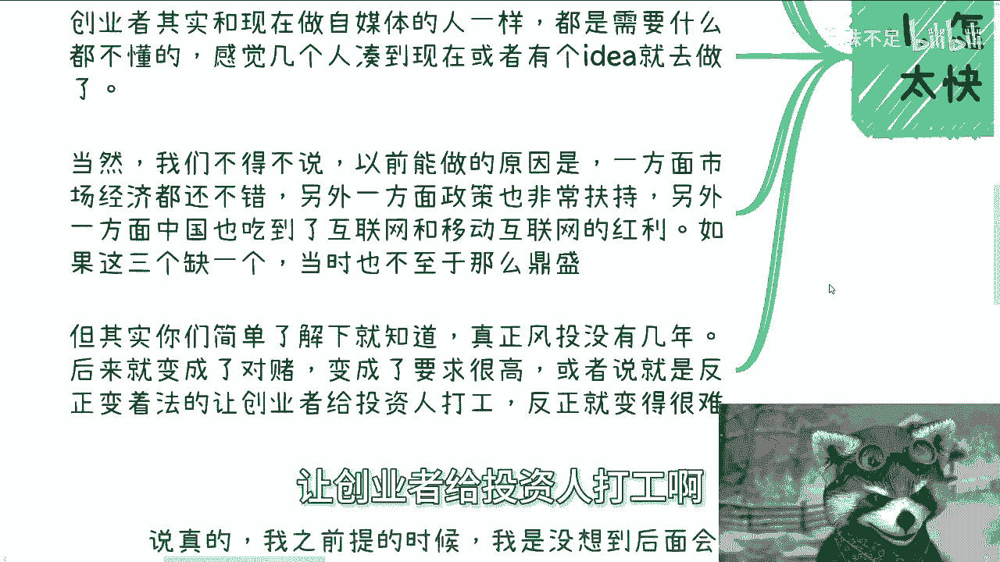
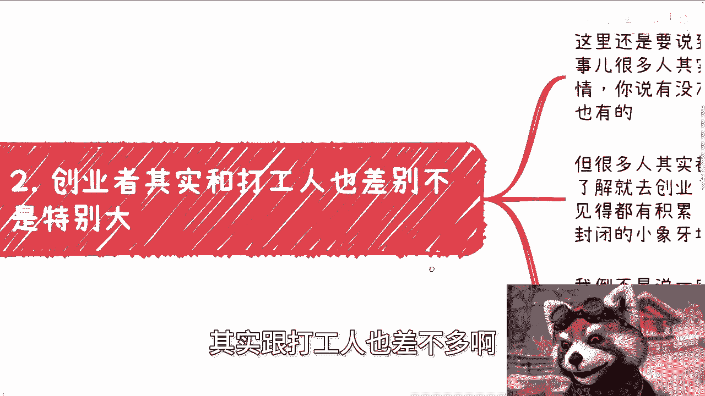
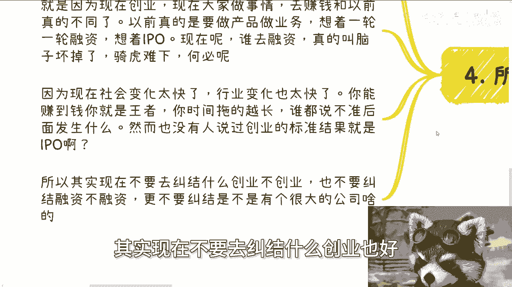
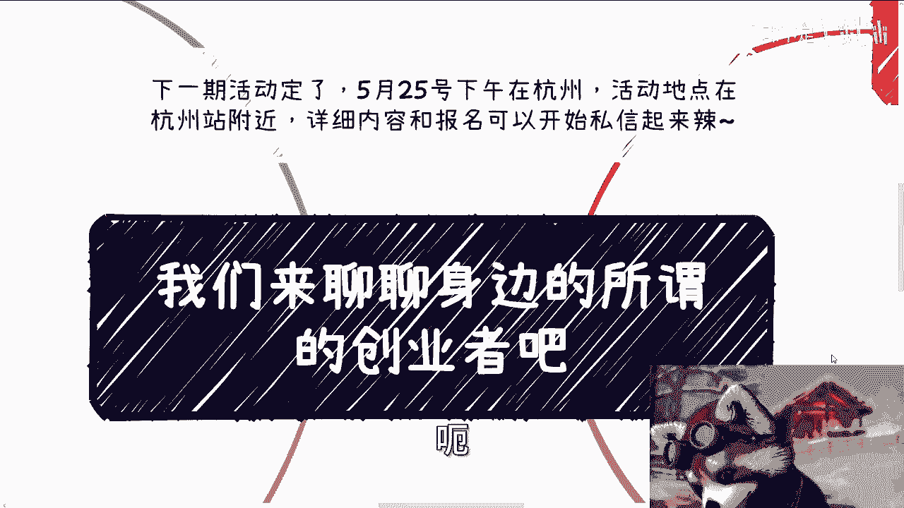

# 课程：聊聊身边的“创业者” - P1 🧑‍💼

在本节课中，我们将探讨“创业者”这一概念在当今时代的真实含义。我们将分析过去与现在创业环境的差异，并澄清一些关于创业的常见误解。课程旨在帮助你理解创业的本质，避免盲目跟风，并找到适合自己的发展路径。

## 时代变迁与创业概念的演变 🕰️

上一节我们介绍了课程概述，本节中我们来看看创业环境是如何随时间变化的。

时代变化非常快。许多人对创业或创业者的概念，认知还停留在五六年前，甚至七八年前的样子。那时的创业，与现在很多人做自媒体类似，几乎全民参与。当时确实有政策鼓励全民创业。

当时的创业者与现在的许多自媒体从业者一样，很多人其实并不真正懂行。他们可能只是几个人凑在一起，或仅仅有一个想法就去行动了。现在身边做自媒体的人，很多也是类似的状态。

当时创业能够盛行，有几个关键原因：市场经济状况良好、政府政策大力扶持、中国享受了互联网和移动互联网的红利。这三个条件缺少任何一个，当时的创业热潮都不会如此鼎盛。人们也不会频繁听到关于创业的讨论。

虽然存在幸存者偏差，但偏差程度没有想象中那么大。真正的风险投资活跃期其实并不长。后来，风险投资逐渐演变为对赌投资，对创业者的要求变高，或者以各种方式让创业者实质上为投资人打工。

以下是投资环境变化的核心点：
*   整个投资行为变得越来越困难。
*   整个创业过程也变得越来越困难。

## 创业者与打工人的本质异同 👥

上一节我们讨论了外部环境的变化，本节中我们来看看创业者自身的状态。

许多创业者其实和打工人差别不大。这里要讨论的是社交与积累的关系。很多人所谓的创业，只是做一项业务、一个产品或一种服务。他们可能有公司实体，也需要进行商务拓展，但很多是“草台班子”。他们自己并不完全理解什么是创业，就开始了。

在这个过程中，他们与打工者的区别并不明显。他们都专注于自己的业务、服务或产品。这个过程不一定能带来巨大的个人成长或资源积累。因为很多创业者在做事时，也把自己封闭在一个很小的“象牙塔”里。

这并不是说一定要做咨询这类对外性强、能了解多方业务的创业。核心在于，无论创业与否，我们都需要与社会接轨，而不是仅仅套一个“创业者”的名头。很多人被“争口气”这类话术影响。

你今天创业也好，不创业也罢，目的是为了更好地了解世界、了解社会、了解水面之下的商业本质。而不是对外宣称“我在创业”，或者做一个看似与理想相关的事情。这些都是空话。你需要多了解别人怎么做、别人的项目什么样，而不是单纯地自己去创业，然后仿佛只是换了个身份，本质上却没有区别。

## 对“标准答案”的盲目追寻 ❓

上一节我们分析了创业者的工作状态，本节中我们探讨一个常见的思维误区。

第三点是很多人其实在寻找一个“标准答案”。最近咨询的很多问题也反映出这一点。你可以询问一个行业的大致比例或融资估值，这没问题。但很多人仍在寻找一种“方法论”。

方法论也许存在，但它的前提是拥有各种上下文和先决条件。现在很多人被应试教育影响过深，学“傻”了。他们寻找的方法论是：“陈老师，我什么都没有，有没有方法让我从无到有，步骤123456？”这很奇怪。如果存在一种能让人从无到有、按部就班成功的方法论，那中国老百姓早就全部财务自由了。想想就知道这不可能。

举个例子，比如举办大型会议。我可以告诉你完全能够盈利，并且有很多盈利模式。这是一套方法论，其中的每个细节我都可以讲解，因为我从小型活动到大型活动，乃至政府活动都办过。但前提是你得有东西：你需要有嘉宾、合作方、合作渠道、场地、背书、指导单位等等。现在很多人根本不去积累这些前提条件，就只想寻找方法论。这真的像是“卷子做多了，就想翻答案”，而翻出来的答案往往是“略”。

越是到社会上寻找这种“标准答案”，你越可能得到一个结果：被“割韭菜”。就这么简单。

## 为何倡导“轻资产”模式 💡

上一节我们指出了寻找捷径的弊端，本节中我们来看看在当前环境下更可行的路径。

所以，我们要讨论为什么这么长时间以来，包括我和其他许多人，都在提倡“轻资产”模式。说真的，我去年提出时，没想到后面会有这么多教授、大佬也在提。但你们有没有想过为什么大家都要提？因为现在整个创业的环境，在天时、地利、人和方面都与以前不同了。

现在大家去做事、去赚钱，跟以前也不一样。以前是真的做产品、做服务、做业务，想着一轮轮融资，想着IPO（首次公开募股）。现在呢？谁还去融资？去融资的人可能是脑子有问题。为什么？因为你本来赚钱的目标不香吗？赚钱不香吗？你为什么一定要去融资，让自己骑虎难下呢？为什么一定要去对赌呢？为什么一定要让别人控制你呢？这很奇怪。

因为现在社会变化太快，行业变化也太快。你能赚到钱就是王者。时间拖得越长，谁也无法预测后面会发生什么。而且，也从来没有人规定创业的标准就一定是IPO。

所以，其实现在不要去纠结于是否创业、是否融资，更不要纠结于是否要有大公司。之前有个人咨询我时，他说他认为的创业就是要融资，要有很多员工，等等。问他为什么，他说这样以后给爸妈、亲戚看起来倍有面子。我就不明白了，你的目标是什么？是给投资人当牛做马，还是想去赚钱？我告诉你，一旦融资，你的团队要扩大，你最后很可能就是一个当牛做马的角色，想赚到钱会很难。如果你是为了赚钱，为什么一定要融资？为什么一定要有门面？为什么一定要有很多员工？这没有道理。

按照这种逻辑，现在很多直播带货的网红、自媒体人就不赚钱了？我们随便举例，山东有个直播带货的，一年流水可以做到50多亿。照你这么说，他得有几千名员工吧？但并没有。他有自己的团队和公司，这我相信。但你说要把团队扩得多大、门面搞得多豪华，这不是有毛病吗？

所以你们要明白，“创业”是一个很虚、很宏观的词。身边的很多创业者，也不代表他们就脱离了“象牙塔”，大部分人仍然身处其中。为什么？因为他只要没有搞明白当下的大环境，没有搞明白天时、地利、人和，没有搞明白以前和现在创业的区别，没有搞明白自己创业的目的，那有什么用呢？就为了标榜自己是个“创业者”吗？图什么呢？

很多事情，不要去跟风，也不要道听途说。别人说怎么样就怎么样。或者说好像只有创业和打工二选一，等等。并非如此，具体还要看你们怎么做，看你们的执行力。但是，不要去“慕强”——不要看到一个人说自己是创业者，是连续创业者，说自己去纳斯达克敲过钟，就觉得“牛逼”。这没什么了不起的。

## 总结与行动建议 🎯

本节课中，我们一起学习了“创业者”概念在当下的真实内涵。

我们分析了创业环境从过去到现在的巨大变迁，指出许多创业者实际的工作状态与打工人相似，并批判了寻找“标准答案”的思维误区。最后，我们探讨了在当前快节奏、高不确定性的环境下，“轻资产”和以赚钱为核心的务实路径更为可取。

记住，不要被“创业者”这个标签所迷惑或束缚。关键在于理解商业本质，积累核心资源，并采取符合当下环境的灵活策略。你的目标应该是创造真实价值并获得回报，而不是追求一个空洞的身份或遵循过时的剧本。

---
**附：活动与咨询信息**
*   **活动**：5月25日下午在杭州（杭州站附近）举行。详细内容与报名请私信。
*   **咨询**：如需进行商业规划、股权融资、分润设计、商业计划书梳理，或评估自身资源并希望获得更多规划视角，请整理好问题后进行咨询。