# 我们来说下高举高打-同样付出努力和时间-我们就要得到最大的回报---P1---赏味不足---BV1X

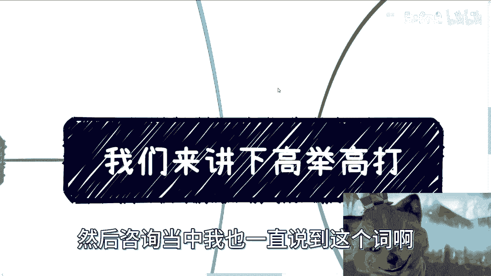

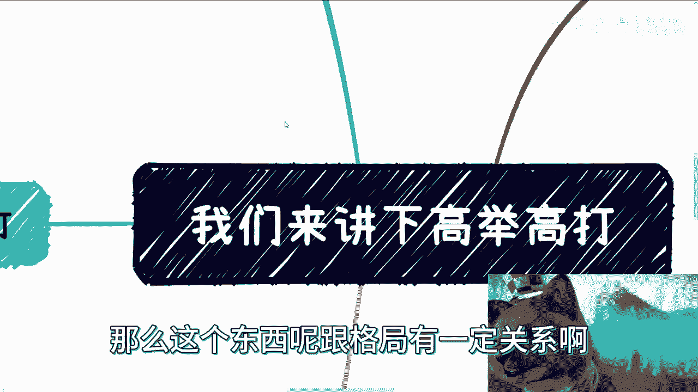

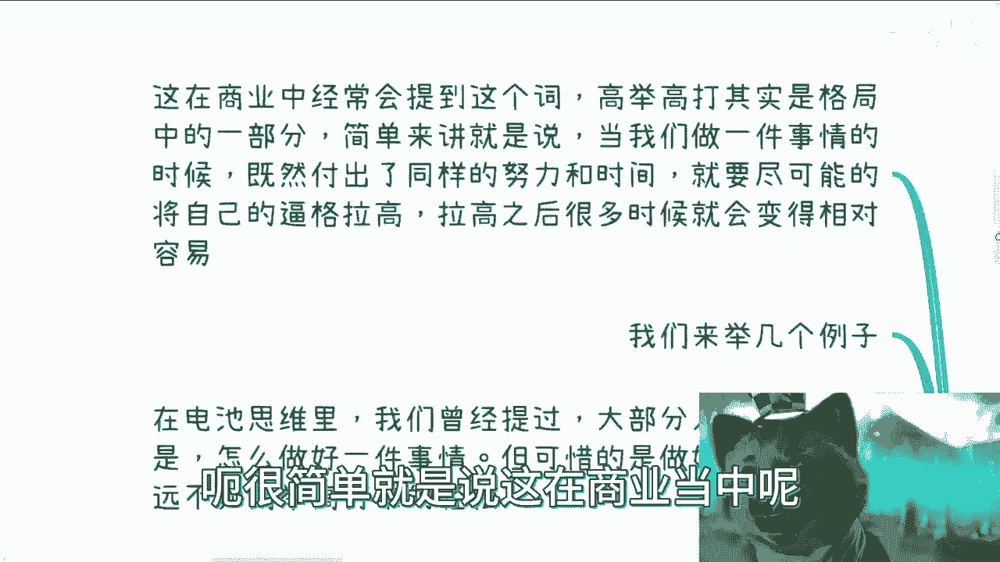

在本节课中，我们将要学习一个重要的商业和个人发展概念——“高举高打”。我们将探讨其核心含义，并通过多个领域的实例来理解如何应用这一策略，以最小的努力撬动最大的回报。

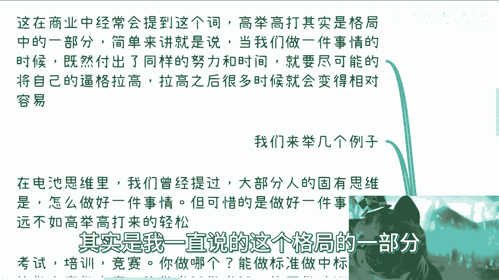

## 什么是“高举高打”？🎯

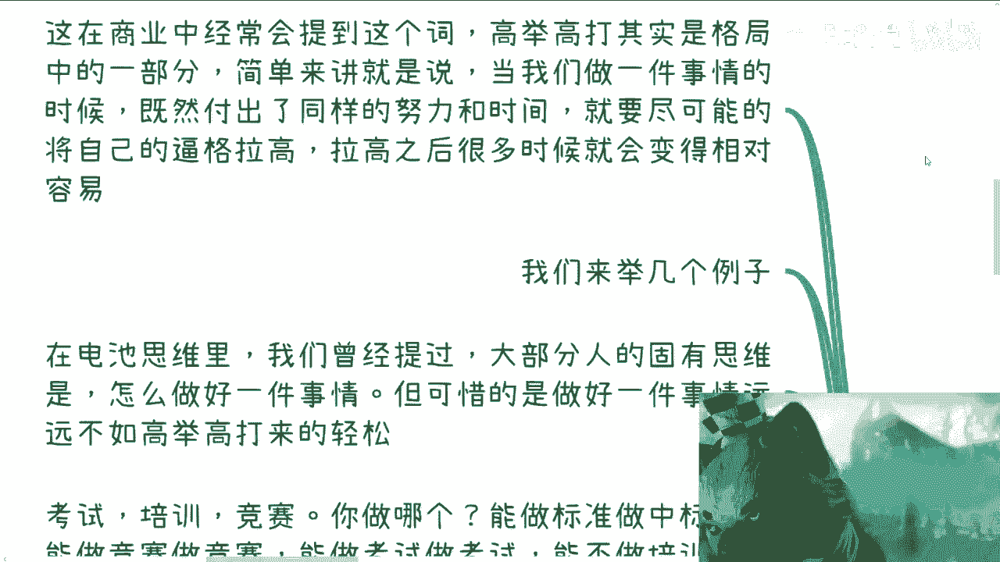

上一节我们介绍了课程主题，本节中我们来看看“高举高打”的具体定义。

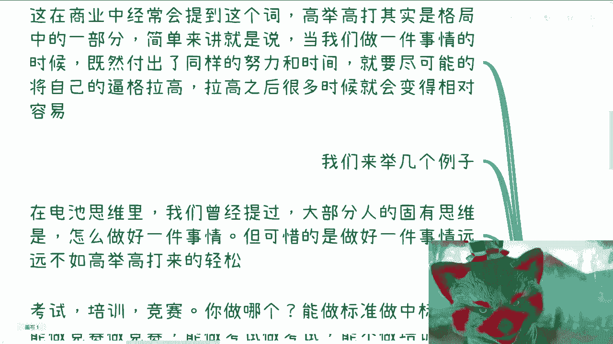

“高举高打”是商业领域中经常被提及的策略，它也是个人格局的一部分。简单来说，其核心思想是：**当我们付出相同的努力和时间时，应尽可能提升自己的定位和起点**。定位拉高之后，许多事情会变得相对简单。

换句话说，其目标是：**付出同等努力与时间，应尽可能更轻松地获取回报**。

## “高举高打”的应用实例 💡

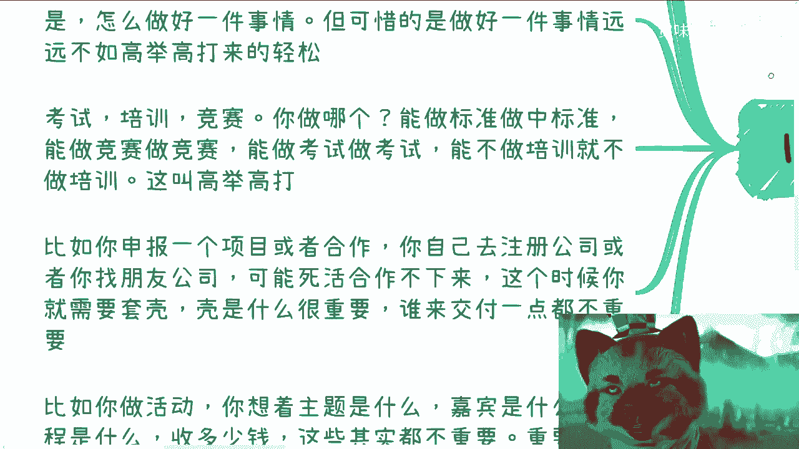

理解了基本概念后，本节中我们来看看“高举高打”在不同场景下的具体应用。

以下是几个领域的例子：

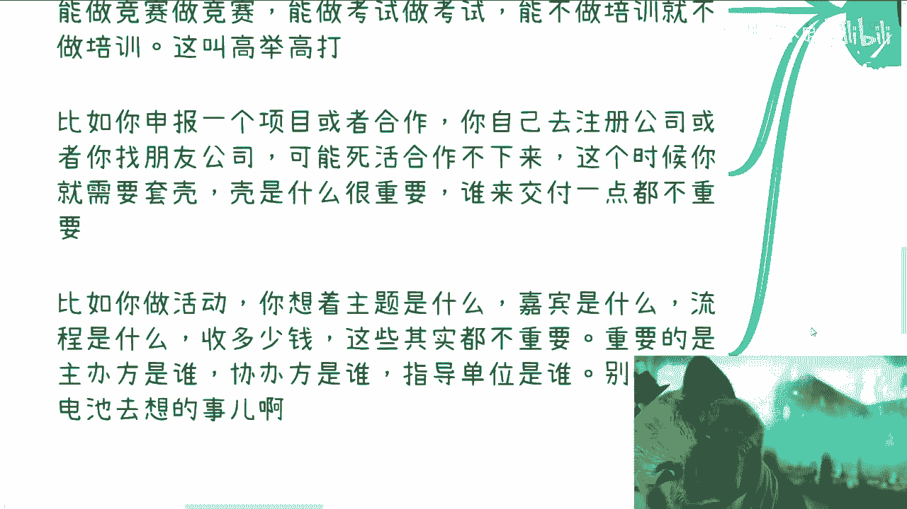

**1. 行业选择与定位**
在电视思维中曾提到，大部分人的固有思维是如何“做好”一件事。例如想做自媒体、电商或考研。但关键在于，做好之后如何变现？从商业角度看，“做好”一件事往往不如“高举高打”来得轻松。
以教育培训行业为例，中国各地都有考试、培训、竞赛等业务。应用“高举高打”策略的选择优先级是：
*   **能做标准则做标准**
*   **能做竞赛则做竞赛**
*   **能做考试则做考试**
*   **能不做培训就不做培训**

这个逻辑是：**能用名望（标准、竞赛）赚钱，就不要做苦力（培训）；能通过考试躺着赚钱，也不要做苦力**。只有当以上都做不到时，才考虑做培训。

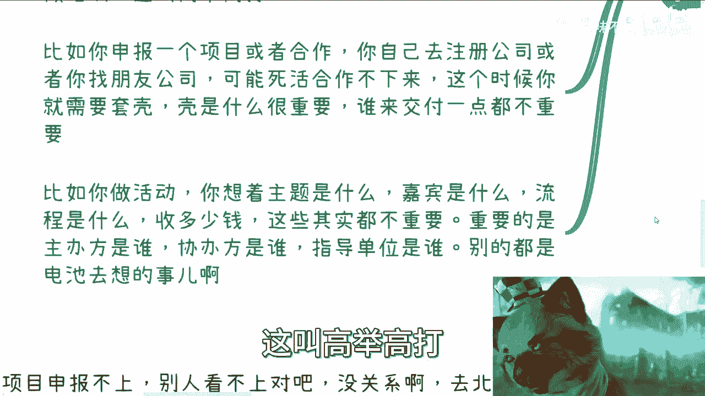

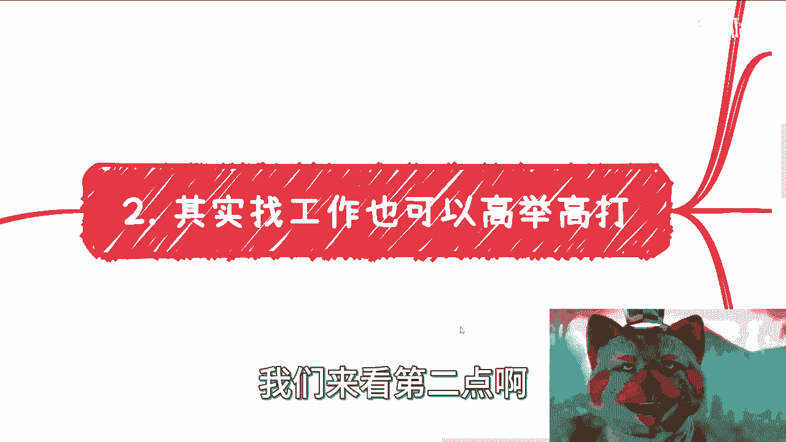

**2. 项目申报与合作**
当你申报项目或寻求合作时，自己注册的小公司可能因资质不足而被拒绝。这时就需要“套壳”。
“壳”的选择至关重要，应按照以下优先级寻找：
*   **套用国企、央企**
*   **套用大型企业**
*   **套用有资质、有年头的中小型企业**

关键在于：**套用谁的“壳”很重要，而实际由谁交付并不重要**。对方是否与你合作，取决于项目能赚多少钱以及你愿意分多少钱。只要商业逻辑清晰并能给对方带来利益，对方并不在乎你是谁。

**3. 活动策划**
策划活动时，许多人会纠结主题、嘉宾、流程和收费。然而，应用“高举高打”策略，最重要的是：
*   **主办方是谁**
*   **协办方是谁**
*   **指导单位是谁**

其他执行细节是执行者（“电池”）需要考虑的事情。拥有强大的背书方，活动就成功了一半。

## “高举高打”在求职中的应用 👔

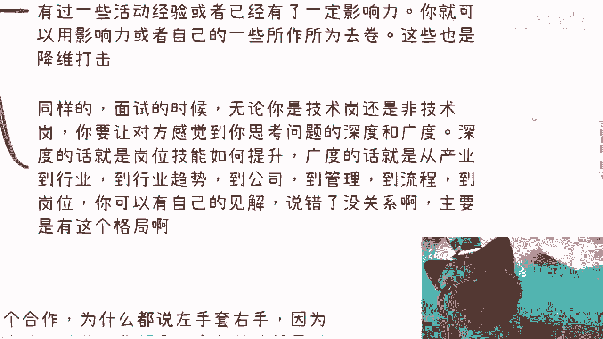

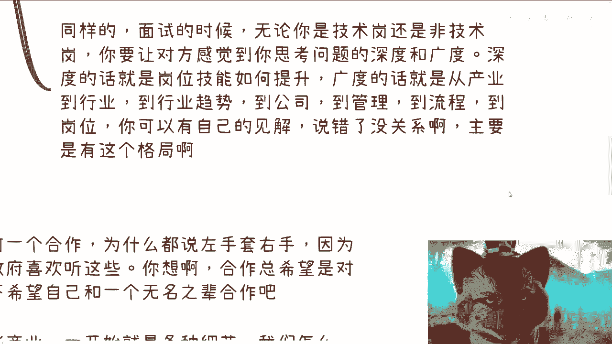

上一节我们看到了商业领域的应用，本节中我们来看看这一策略如何应用于个人求职。

找工作同样可以“高举高打”。除了在招聘平台海投简历，还有更高效的方式。

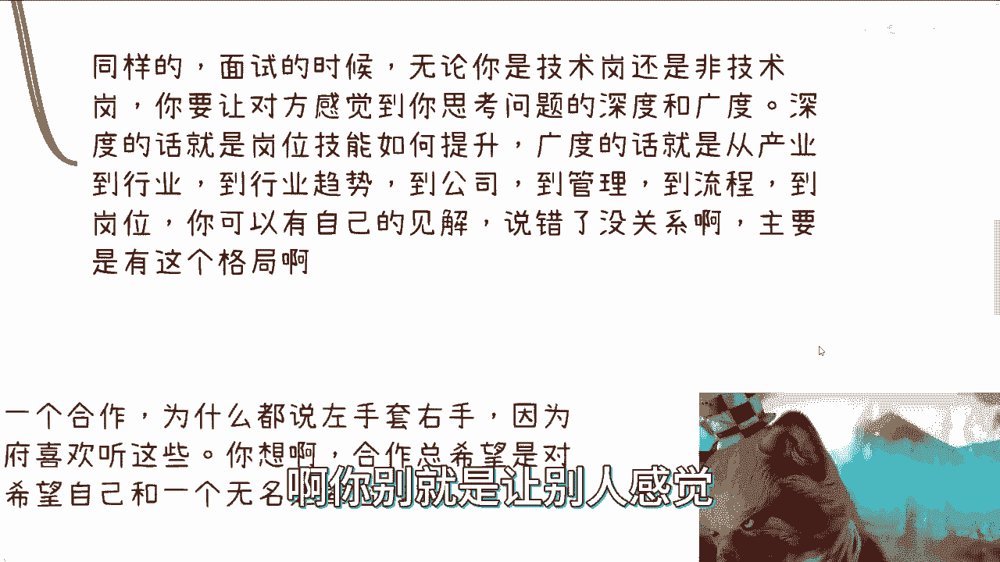

**1. 拓展求职渠道**
在活动中主动结识HR或老板，比直接投递简历更“高级”。因为在活动场景下，对方更容易认为你是一个有主动性、自驱力强，且品位与公司文化相近的人，这天然拉近了距离。

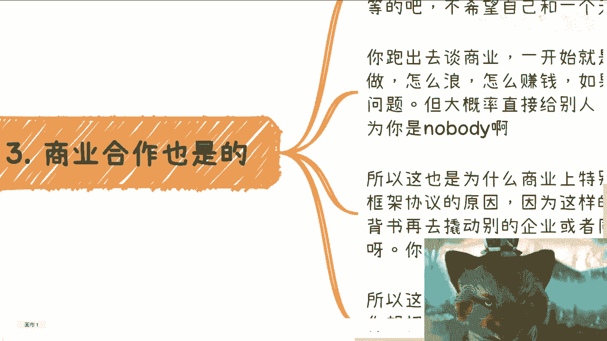

**2. 打造差异化优势**
面试时，大多数人都千篇一律地介绍自己的学校和技能，对产业和商业缺乏认知。要想脱颖而出，你需要展示：
*   **活动经验**：如参与过某个项目、大赛或大会的举办。
*   **影响力**：即使是借助“壳”资源获得的间接影响力，也是加分项。

这些经历能对仅拥有学历和技能的候选人形成“降维打击”。

**3. 展现思考的广度与深度**
无论是技术岗还是非技术岗，面试时要让对方感受到你思考问题的广度与深度。
*   **深度**：对岗位技能提升、自我发展路径有清晰的逻辑和想法。
*   **广度**：能从产业趋势、行业动态，谈到公司战略、管理流程，最后落到具体岗位，形成从宏观到细节的见解。

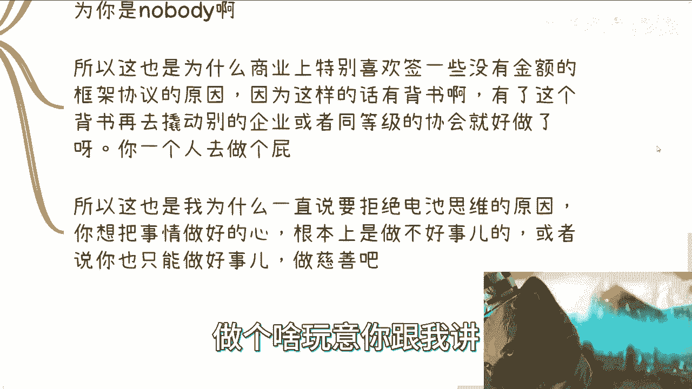

重要的是展现你的思考格局，避免让对方感觉你只是一个可替换的“执行电池”。

## “高举高打”在商业合作中的应用 🤝

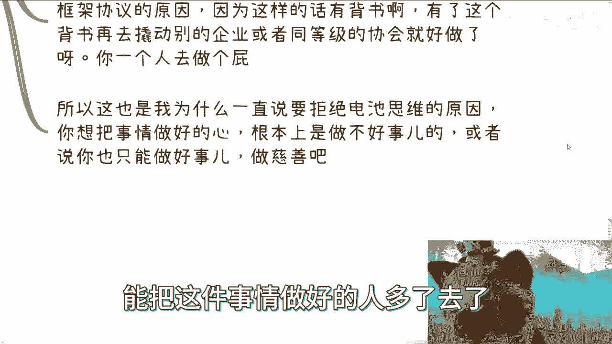

理解了求职中的应用后，本节中我们来看看在商业合作中如何实践这一策略。

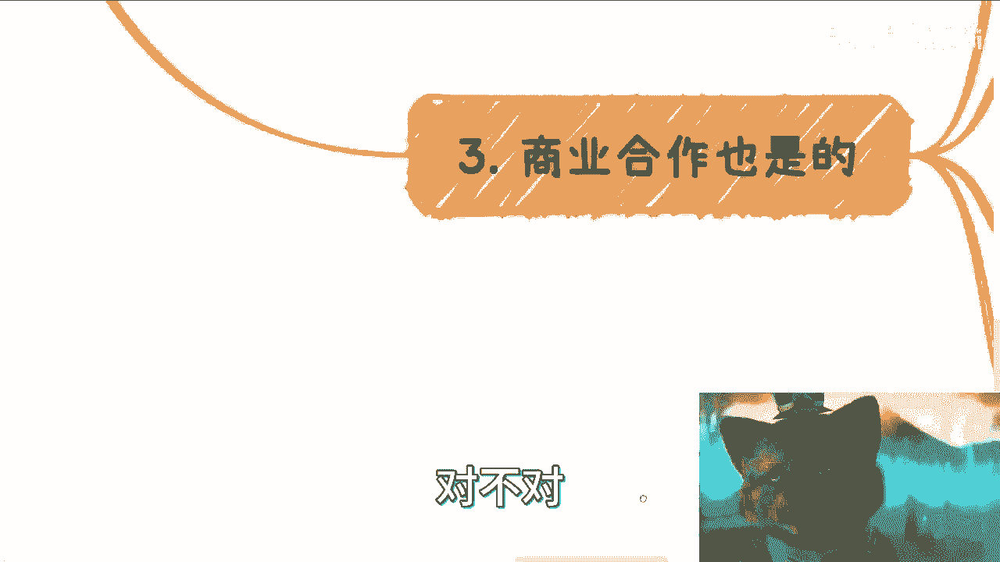

商业合作尤其需要“高举高打”。这就是为什么我们常说“左手掏右手”，因为企业和政府喜欢与对等的伙伴合作。

**1. 避免陷入细节**
谈合作时，如果一开始就纠结各种执行细节，而你对商业逻辑又不够清晰，很容易让对方觉得你是个“骗子”或“无名之辈”（nobody）。对方不希望与一个没有背书的个体合作。

**2. 善用框架协议**
因此，商业上特别喜欢签署**没有具体金额的框架协议**。这种协议能为你提供宝贵的背书。有了这份背书，你再去撬动其他企业或同等级别的协会，就会容易得多。一个人单打独斗很难成事。

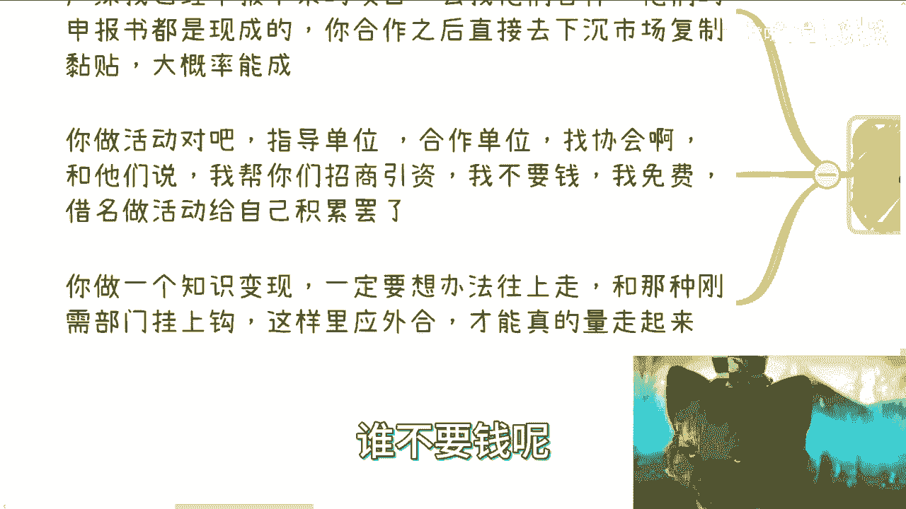

**3. 拒绝“电池思维”**
“电池思维”是指只想把事情“做好”的心态。但在社会上真正成事，需要懂得规则、借力打力和商业逻辑。仅仅是个“好人”或只想“做好事”是不够的，因为能做好事的人太多了。关键在于，**为什么选择你**？

## 更多实践策略与思维转变 🧠

掌握了核心场景的应用后，本节中我们通过更多例子来深化理解，并完成关键的思维转变。

以下是更多“高举高打”的实践思路：

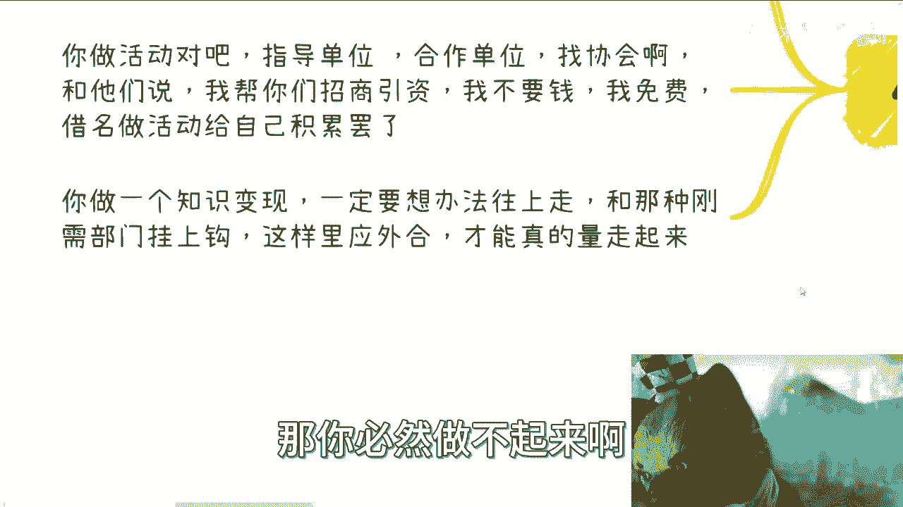

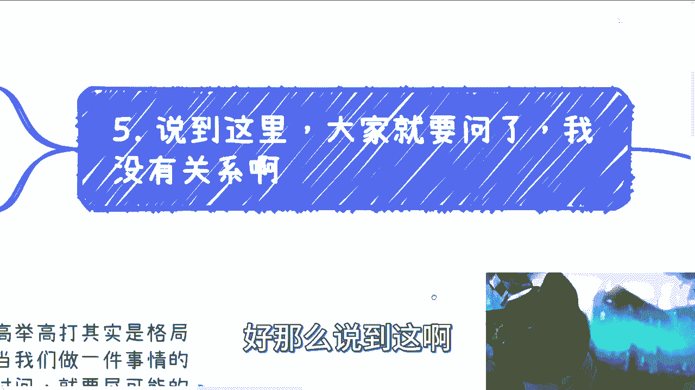

**1. 项目申报：复制与下沉**
如果你的项目在当地申报不上，没关系。可以去北上广深寻找已经成功申报的项目，与他们合作。他们的申报书是现成的，你合作后直接复制到下沉市场，成功率很高。关键在于包装自己，让对方相信你能帮他们赚钱。

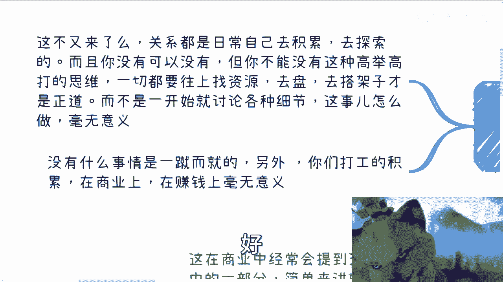

**2. 活动策划：借势与共赢**
做活动时，主动寻找协会等机构作为指导或合作单位。你可以告诉他们：“我帮你们招商引资，甚至可以免费做。”借助协会的名头举办活动，为自己积累资源和声誉。对方需要政绩和资金，这是一个共赢的起点。

**3. 知识变现：向上挂钩**
知识变现要设法与**刚需部门或广场（指有广泛需求的官方或半官方场景）挂钩**，里应外合才能起量。例如在职校、技校领域，每年的“1+X”证书、竞赛、双创项目等都是现成的“高举高打”形式。你要思考的是如何靠近、打入这个体系，分得自己的一亩三分地。闭环的关键在于，你的产出必须满足政府或学校的KPI。

## 常见问题与核心思维 🔑

在学习了大量实例后，你可能会遇到一些普遍疑问。本节中我们来解答最关键的问题。

**问：我没有关系和资源，怎么办？**
关系是日积月累出来的，可以从现在开始去探索和积累。更重要的是，**即使暂时没有资源，也不能没有“高举高打”的思维**。许多人不仅没有资源，连这种想法都没有，一开始就埋头苦干，这是“电池行为”。你应该做的是**向上寻找资源、盘活资源、搭建框架**，成为一个思考战略的人。

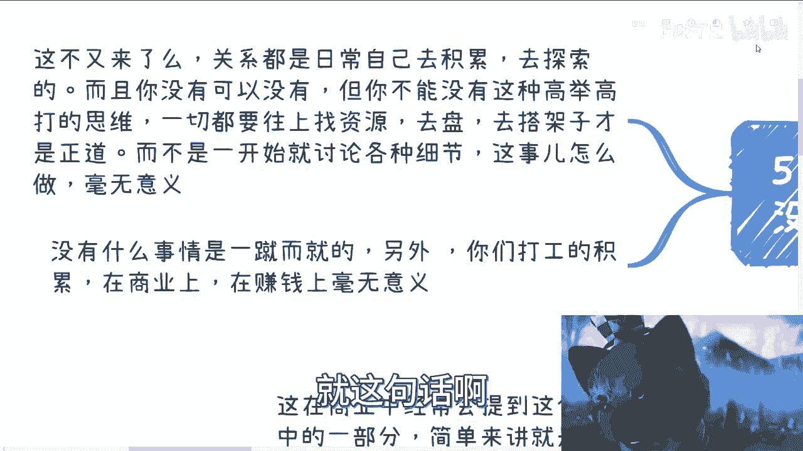

**问：具体应该怎么做？**
以自媒体为例，第一步不应是思考视频怎么做，而应该思考：**我应该在哪个平台、通过什么方式、吸引哪类用户（“割韭菜”的逻辑）**。要想清楚为什么别人会为你付费，整个商业逻辑必须通顺。在中国，仅靠“做好内容”很难脱颖而出，因为能人太多。

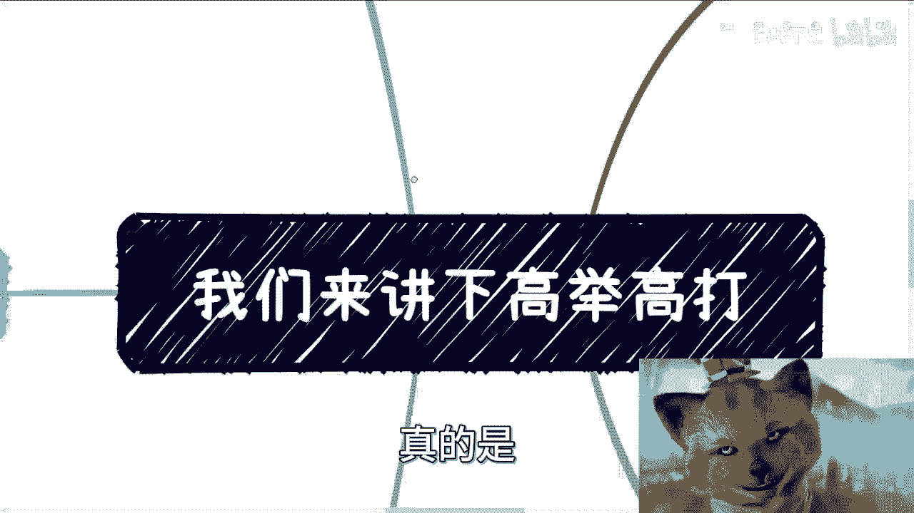

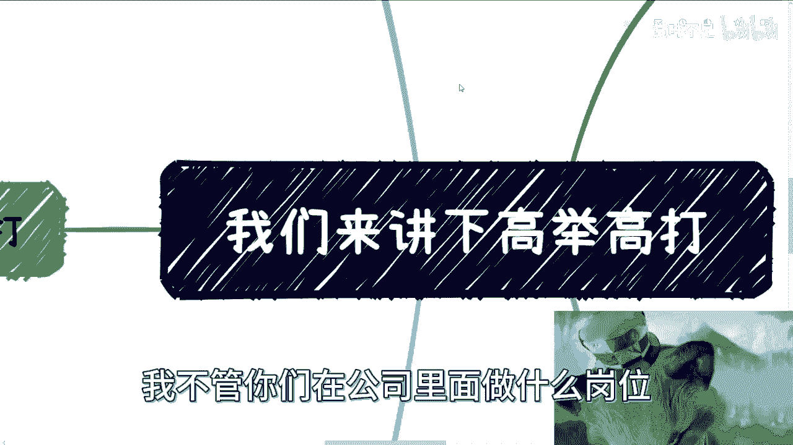

**重要提醒**
1.  **任何事情都不是一蹴而就的**：认识人、积累资源不要怕拒绝。不要总想“凭什么对方理我”，被拒绝后就换下一个。地球很大，在不断碰壁中才可能有积累和突破。
2.  **打工积累的商业价值有限**：必须清醒认识到，**打工积累的经验在独立商业赚钱上，价值非常有限**。在公司里，你很少能接触到“单子怎么来的、为什么值这个价、合同怎么签的”等核心商业逻辑。因此，在商业世界里，你可能如同婴儿，需要从头学起。

## 总结 📝

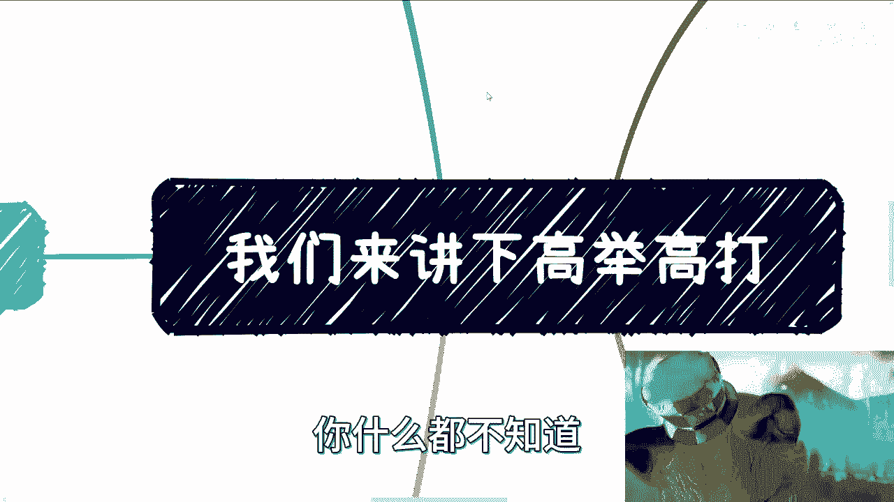

本节课中我们一起学习了“高举高打”的核心策略。

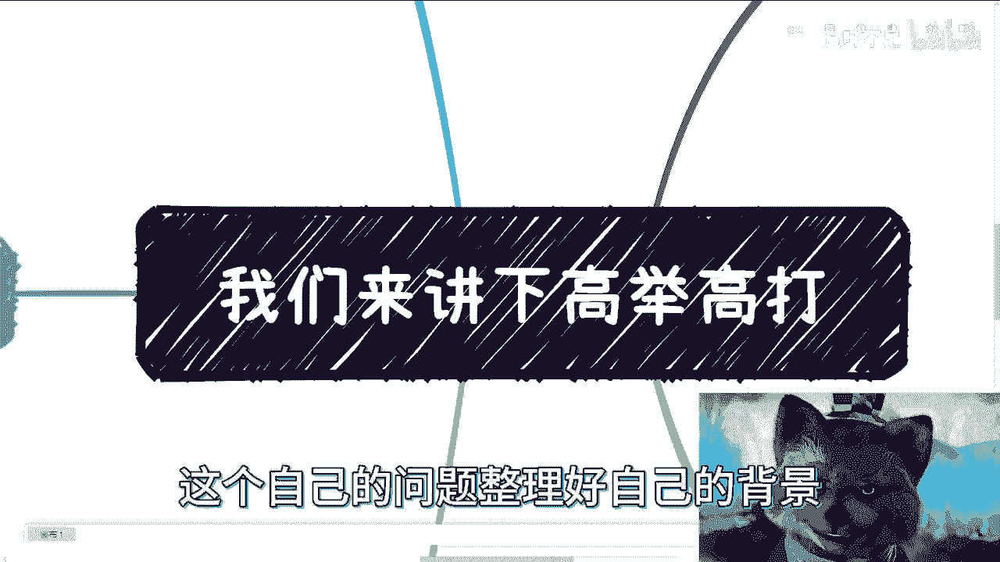

我们首先定义了“高举高打”，即**在付出同等成本时，通过提升定位和起点来最大化回报**。接着，我们探讨了它在行业定位、项目合作、活动策划、求职面试以及商业谈判等多个领域的应用。关键思维在于**拒绝“电池思维”，注重资源整合、借势背书和战略规划**，而不是一味埋头执行细节。记住，关系的积累需要时间，但思维的转变可以从现在开始。拥有“高举高打”的格局，是走向更高效成功的第一步。