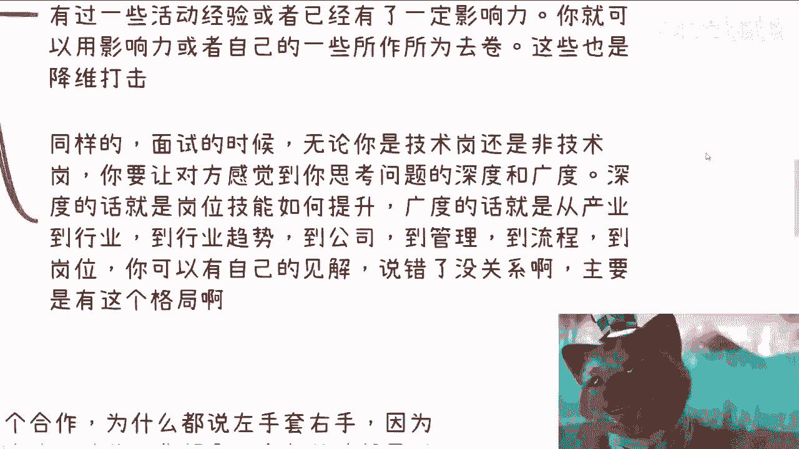
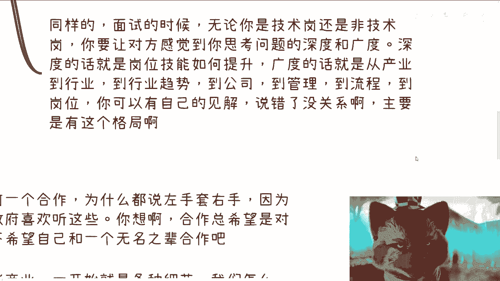
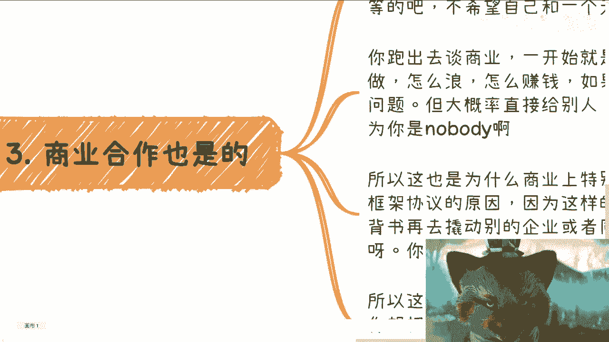
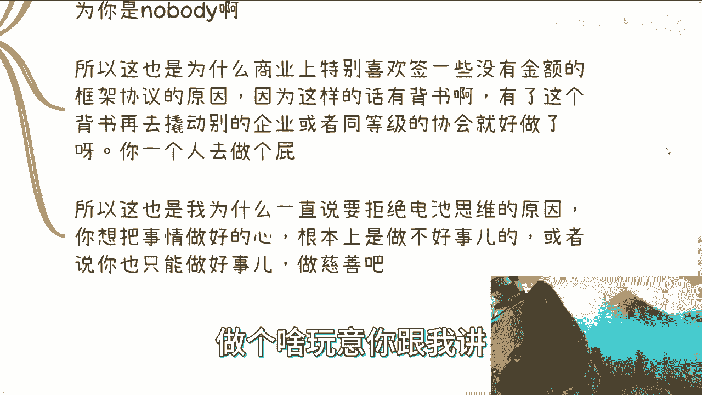
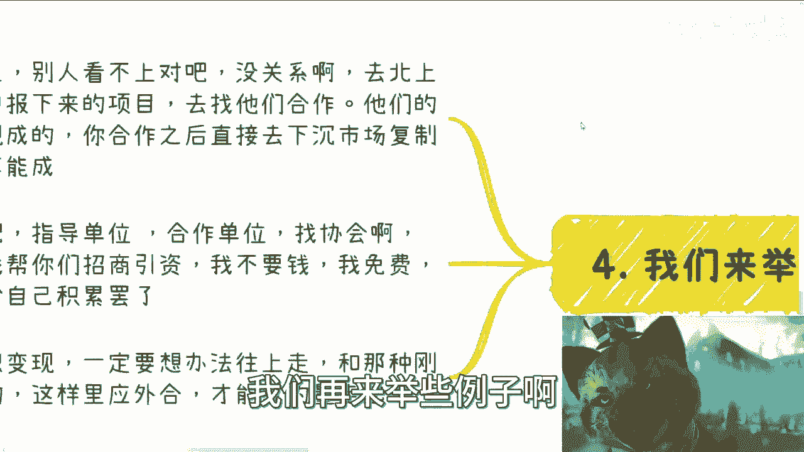
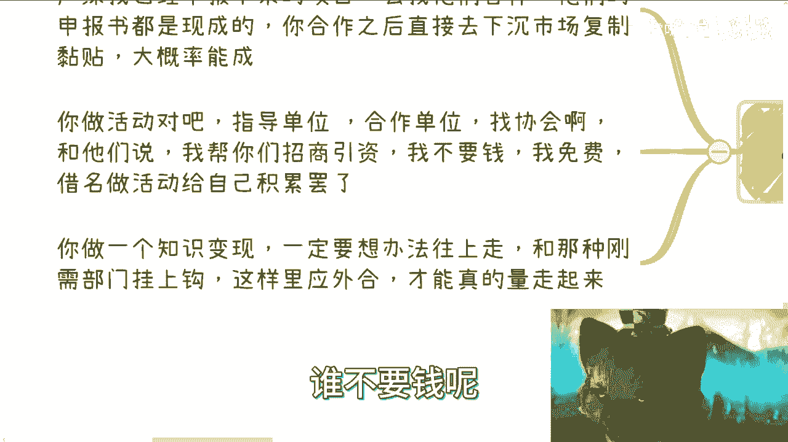
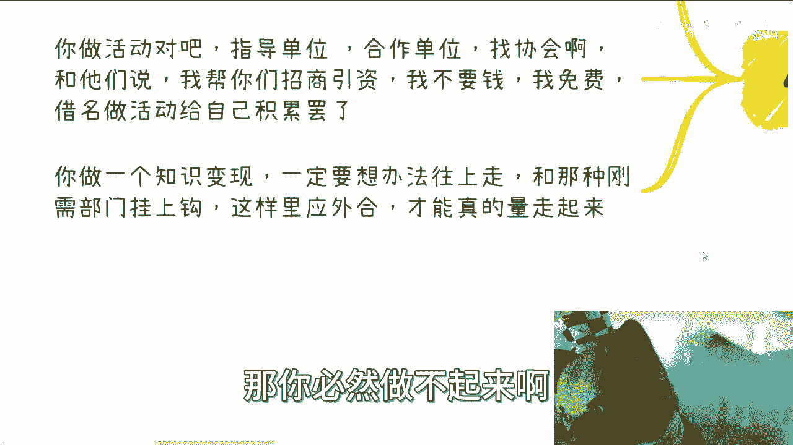
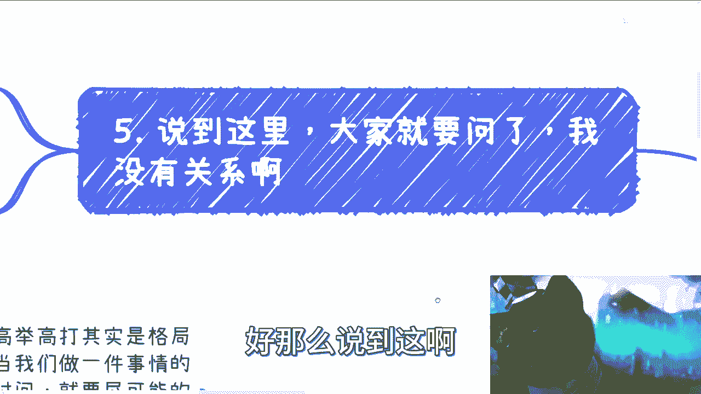
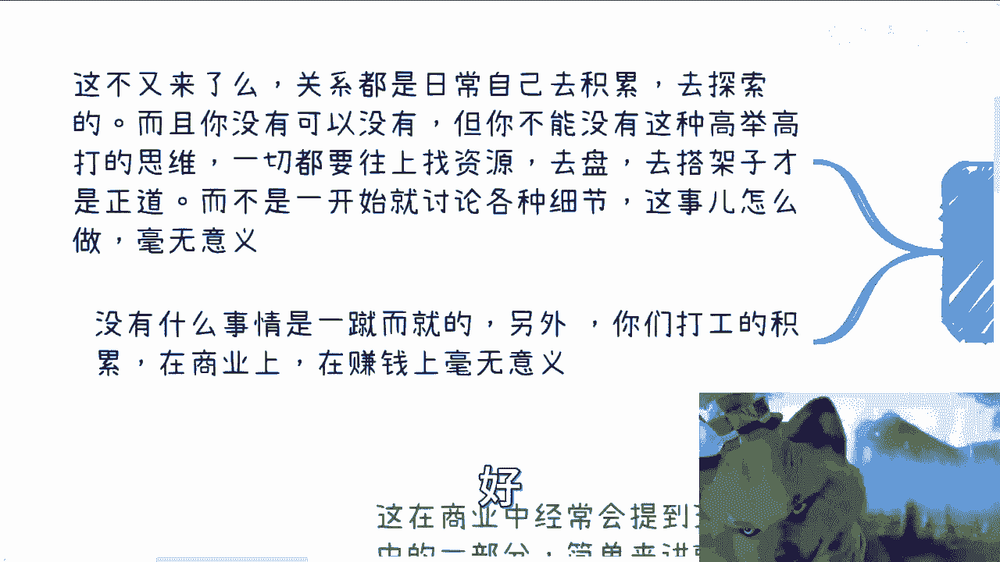
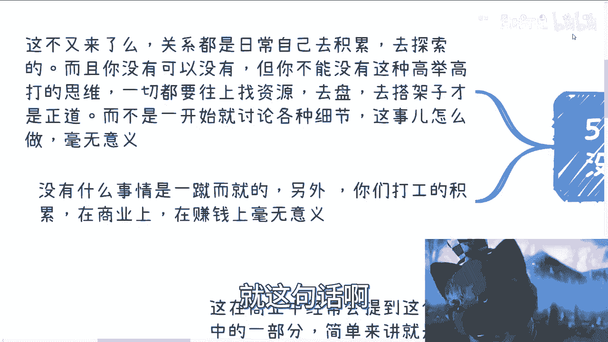

# 我们来说下高举高打，同样付出努力和时间，我们就要得到最大的回报 - P1 - 赏味不足 - BV1XN411v7yb

好大家好啊，这个今天啊我们来讲这个高举高打啊，呃日常当中呢我也提到过这个词，然后咨询当中我也一直说到这个词啊。

那么这个东西跟格局有一定关系啊。

我现在这个地方先跟大家说一下对吧，什么是高举高打啊，嗯很简单。

就是说这在商业当中呢经常会被提到，那么高举高打呢，其实是我一直说的这个格局的一部分啊。

那么简单来讲就是说当我们做一件事情，你要去想一件事情是什么呢，就是我既然付出了同样的努力，付出了同样的时间对吧，呃要尽可能的将自己的逼格拉高，拉高之后啊，很多时候事情就会变得相对简单。

或者来说你换句话来讲，我付出了同样的努力跟时间，就要尽可能的让自己相对来讲更轻松的去赚钱。

对吧，这个也是高举高打的一部分对吧，那么我们后面来举例子，就随便这么来说啊。

比如说我们举举几个例子啊，在电视思维里面，我们曾经提到过大部分人的固有思维是什么，是怎么去做好一件事情对吧，比如说你们想做自媒体，比如说你们想做电商，比如说你们想考读研对吧，但很可惜的是。

你们一直想的是做好这件事情，但请问这件事情做了好的之后，他怎么变现呢，不知道对吧，这就是非常神奇的一件事情，而且从大部分的商业角度来讲，你做好一件事情远远不如高举高打来的轻松，什么意思呢。

比如说啊考试培训竞赛对吧，中国各个行业啊，各个省市区都有考试培训竞赛啊，下到野鸡机构都有，我就问你如果你要做，你做哪个对吧，你做哪个呢，能做标准就做标准，能做竞赛则做竞赛，能做考试则做考试。

能不做培训就不做培训，这叫高举高打，你懂吗，哦也就是说你能够用名去赚钱的，你不要去做苦力对吧，你能够比如说做竞赛四两拨千斤的赚钱。

你也不要去做苦力对吧，你要通过考试能赚考试费，躺着赚钱的，你也不要做苦力，只有这些都做不了的，那你只能去做培训对吧，那么这叫高举高打啊，比如说你申报一个项目或者合作对吧，你自己去注册一家公司。

或者你找你的朋友啊，这个做一家公司啊，无所谓啊，可能死活合作不下来啊，就别人觉得这个要么不合作，要么觉得你没有资质，那这个时候你就需要套壳啊对吧，壳是什么很重要啊对吧，你去套一个国企，套个央企。

掏个大企业，套一个就是中小型的对吧，就可能有些资质，有些年头的企业都可以啊，随便套啊对吧，你会发现套壳很重要，谁来交付一点都不重要，对吧嗯，那这个时候又要有人来说了，他说那为什么人家吊你呢。

人家不，你取决于这个项目能赚多少钱，取决于你分多少钱给别人，对不啦，没有什么不你的呀，我跟你讲，你但凡今天只要是个商业思路清晰的，能给别人赚到钱的，他管你是谁呀，对不对，不吊你只是因为你不懂，你不知道。

但是你又不愿意迈出第一步对吧，然后每天都在纠结人家为什么吊我，那人家是不会你啊，对不对啊，比如你做活动对吧，你想着主题是什么，嘉宾是什么，流程是什么，收多少钱，这些都是都不重要，重要的是什么。

重要的是主办方是谁，协办方是谁，指导单位是谁对吧，别的这些东西都是应该电池去想的事情，跟我们没有关系，这叫高举高打对吧。

嗯好我们来看第二点啊。

其实找工作啊也可以高质高价，什么意思呢，找工作对吧，你除了我，我曾经也说过啊，除了boss直聘等平台，大家一起去卷以外，你明明有很多别的卷的方式啊对吧，你比如说活动当中认识一些hr或者老板啊对吧。

你们的认识方式就比你去应聘来的高级高达，为什么呢，因为你是一个会让他觉得，你跟他在同一个活动当中，你是一个这个有ownership，就是有主动性，主动就是比较自驱型的对吧。

或者说品位跟公司hr领导相似的，那你自然更亲近一些对吧，比如你去面试啊，别人都说自己什么学校会什么千篇一律对吧，或者对产业商业啊，这个总结一下，总结下来就是他对产业商业行业毫无认知。

我不管你985211出来都一个吊样子，你知道吗啊说白了我就这么告诉你们，现在的大学生出来除了应试教育，它是有逻辑性的，对于任何别的东西，他自己没有自己的任何思考能力，就这么回事儿对吧。

你要但凡想要去卷的过的那很简单，你如果有一些活动经验或者有一定的影响力，我不管这个影响力真的假的对吧，你哪怕就像我们刚刚说的，你是套别人的壳也好，怎么样也好，这不重要啊，你可以用一些影响力。

或者自己的一些所作所为去卷对吧，你说我可能参与过什么项目，我可能这个参与参参加过什么活动啊，大赛的举办，我可能参加过什么大会的举办，这些都是你的加分项啊对吧，你非要跟别人去卷一些什么啊，我什么学校的。

我会什么有什么好卷的吗，对不对，你本身这些都是降维打击啊对吧，当然当然同样的面试的时候啊。

无论你是技术岗还是非技术岗啊，我就跟你们这么说啊，就是说。

你要让对方感觉到，你思考问题是有广度跟深度的啊，那么深度的话就是岗位的技能应该如何提升，自我发展，应该怎么发展，你要有一个想法，你得有自己的一套逻辑啊，广度的话就是说从产业到行业。

从行业到行业趋势到公再到公司，再到管理，再到流程，再到这个岗位，你要从宏观再到细节，得要有自己的见解对吧，你得有思考啊，你说错了没有关系，主要是你得有这个格局吧，啊你别就是让别人感觉卧槽他妈一张口。

你就是个电池，哼，那有什么好好谈的呢。

对不对，你是卷不过人家，那么第三点。

好第三点，商业合作也是商业合作，比如说啊你去谈任何一个合作，为什么我们一直说左手掏右手，因为企业或政府喜欢听这些对吧，你想啊合作他总希望是对等的吧对吧，你跑到一个协会，跑到一个什么政府单位。

跑到什么地方，他总不希望自己跟一个无名之辈合作吧，对不对啊，那么怎么让他们觉得我们不是无名之辈呢，那很简单啊，你跑出去跑商跑谈商业，你一开始就是谈各种细节，我们怎么做，我们怎么让我们怎么赚钱。

如果你逻辑是清晰的，你懂得商业规则，那完全的确没问题，但是大概率你是不懂的对吧，你上来就是说啊，我们可能怎么做，或者你要问的问题就是纠结各种细节，那么你大概率给别人，你就是个骗子感觉。

因为你是nobody，你明白吗，不是说你做说出来的话不对，而是说你大概率如果来说，你对商业逻辑不够清晰，你上来就来抠细节的话，没有人会听你的，你知道吗，所以所以，所以，这也是为什么。

商业上特别喜欢签一些没有金额的框架协议，因为这样的话有背书啊，啊因为对大家都好有好处啊，你有了这个背书，再去撬动别的企业或者同等级的协会，就好做了呀，对不对，你一个人你去做做做，做个啥玩意儿，你跟我讲。

对不对啊，所以这也是我为什么一直跟大家说，你要拒绝电池思维的原因，因为你想把事情做好的心，根本上是做不好事的，或者说你如果来说也只想只能做好事的话，那么你就做慈善，你明白这句话吗，什么意思呢。

就是说你要真正在社会上做好事情，你得懂得规则，你得懂得借力打力，你得懂得很多的一些逻辑方式，而不是说就告诉大家，我是一个好人，我就想把这事情做好，那不好意思，想把这件事情做好。

能把这件事情做好的人多了去了对吧。

为什么选你呢，对不对。

那么我们再来举一些例子啊。

项目申报不上，别人看不上对吧，没有关系，你可以去北上广深找已经申报项来的项目，就申报已经下来的项目，你去找他们合作，他们的申报书都是现成的，你合作之后直接去下沉市场，复制粘贴大概率就能成。

对吧你我跟你讲啊，不要再来问哦，不要再去想说，为什么这些已经申报下来的项目，能够愿意跟我合作呢，有什么不愿意了，我还是那句话呀，只要你包装的好啊，只要你告诉他们，我能给你们赚钱，谁不愿意啊，对不对。

不愿意就是你包装的不好，你不懂，你讲出一句话，让别人觉得你很外行，对不对啊，你做活动对吧，指导单位，合作单位找协会啊对吧，你和他们说，我帮你们能招商引资，我不要钱，我甚至免费的做对吧，然后借着协会。

借着这些别的地方借名做活动，给自己积累也可以呀，对不对，谁不要招商引资呢，谁不要钱呢对吧。

你做一个知识变现，你一定要想办法往上走，什么意思呢，就是说你要和和那种刚需部门广场挂上钩对吧，那么你这样里应外合才能够真的量走起来，什么意思，就是说这就是中国在职校技校，在很多地方。

他其实每一年都有很多，真正就是知识变现的东西，只不过它的形式并不像大家所看到的那样，比如说那个知识星球或者别的东西，这些太low了，你知道吗，有很多形式都是都是现成的，就像我之前跟大家提过的一加X。

比如说竞赛对吧，比如说一些什么双创对吧，会有别的东西，这些东西都是高举高打的对吧，但是你从逻辑上就要明白，就是不是上来自己就开始PV自己说哦，这个东西政府的跟老百姓有什么关系呢，我们凭什么去做了。

你但凡了解一下就知道对吧，多少东西是政府的，它只是牵头啊，那下面落地的不还是老百姓吗，对不啦，那你要去做的是什么，你要去做的，我们要去做的是什么，就想办法我们去去靠，去打这个关系。

我们想办法去往里面挤啊对吧，就我们只要能分得自己的一亩三分地就好了，这不重要啊，别的东西，对吧，你只有整个的这个知识变现的闭环对吧，就是你产出的东西是这个达到政府KPI的，或者说是这个满足学校KPI的。

那你周六就能走啊对吧，你但凡做很多事情，你说我一开始做了对吧，他比如说最终的量在什么地方，最终钱哪里来，最终为什么付这个钱，你都不清楚，你就去做这个事情，那你必然做不起来啊。

好那么说到这儿啊。

大家就要问了，他说我没有关系对吧好。

这不又来了嘛对吧，关系是什么关系，就是你日积月累，日常自己开始去积累的对吧，从现在开始去做去探索啊，而且你没有可以没有，但是你不能没有这种高举高打的思维啊，你知道吗，就很多人做事情他的确没有。

但是他也没这个想法对吧，一切就是上来就是我要干，你干干没有用的，干就是电池的行为啊，啊一切都是你要网上找资源，去盘资源，去搭架子，你要做的就是一个宏观的做战略的这么一个人，你你才有可能赚到钱好。

而不是一开始就是讨论各种细节对吧，然后说我要做个自媒体，我今天就开始讨论啊，我今天就开始思考我这个视频怎么做对吧，我这个账号怎么做，没有用的哦，没有用的，你要真的想要去做自媒体对吧，我就告诉你。

你一开始第一步想的就是我应该怎么去割韭菜，你明白吧，就是你应该在什么平台上搁，你应该找谁帮你哥对吧，而为什么这些人会被你哥，你要把逻辑想清楚啊，啊而不是上来就说我把视频做好，那不好意思啊。

我觉得大部分人没这个能力啊，因为整个中国能做好的人太多了，凭什么流量给你呢，没有道理的呀，你你你你用你的脑子去思考一下，整个逻辑不通的呀对了，而且任何事情不是一蹴而就的，你就让你知道我曾经就说过。

就是你们去认识人也好，去积累也好，不要怕拒绝啊，你不要上来就思考，凭什么人家，你那不嘛，就不吊了，你再去知识认识啊，地球这么大了，对不对对吧，你没有事情一蹴而就的，你总归是不停的碰壁，你才有可能有积累。

才有可能有突破啊对吧，另外你们打工的积累在商业上，我告诉你们，你们打工的积累在商业上，在赚钱上毫无意义，就这句话啊，我我不管你们积累出来什么东西毫无意义，就这句话了啊，就是。

虽然我也不能一棒子打死吧对吧，99%对吧，你出来我不管你做什么样子，你在商业上就跟一个婴儿是一样的，就这句话啊。

别指望跟我说什么，我在公司里面能能积累能怎么样子，还积累个屁，真是对吧。

我就跟你们讲了，我不管你们在公司里面做什么岗位对吧。

你们想想看这个单子怎么来的，这个单子凭什么到你们公司来，这个单子，你们公司又凭什么要这点钱，对方又为什么愿意给你们这点钱对吧，而这个单词凭什么最终能够签下来，这到底怎么签的，己方去签。

签的里面到底有没有哪些，比如说前提条件，或者有哪些尾款，呃，那个那个那个那个叫什么违约条款，对吧等等等，你什么都不知道，你你你能了解商业什么东西，你什么都不知道。

对不了，好吧好，就这么着吧啊嗯，行吧好吧，大家反正有什么问题的啊，这个你觉得啊不知道手上牌怎么打的，或者说希望知道未来怎么打的啊，你也希望更多的了解接近老百姓的啊，更贴近于我们自己的一些东西。

或者说你希望能够听到一些，可能你们平时PV你们的话术不一样的东西的话，那你可以整理好这个自己的问题，整理好自己的背景好吧。

然后你可以私信我。