# 我们来说说几年后的毕业问题 - P1 - 赏味不足 - BV1z2421L7yv

好大家好啊，今天我在外面，所以可能会有些背景音乐，哈哈这个我也控制不了啊，我们这一期呢来讲讲几年后的这个毕业。

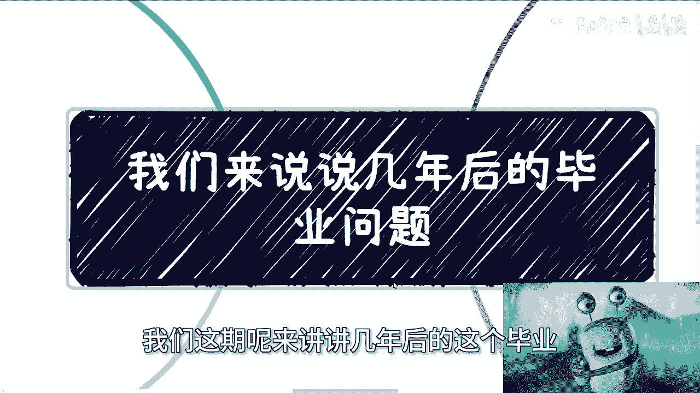

毕业问题啊，大概两年到3年左右吧，没有办法的好吧，就是呃我觉得是这样子，就是我们先说一下情况，但是呢我们无论如何都是要面对的，因为我们改变不了对吧啊。

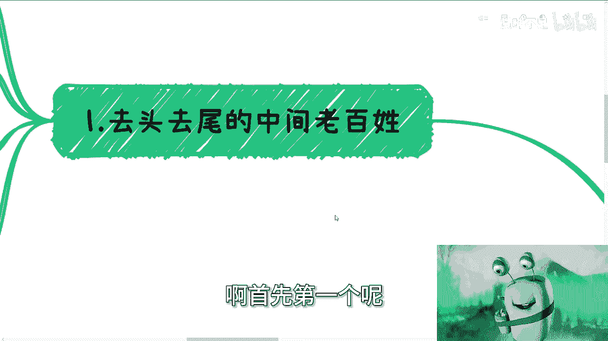

首先第一个呢就是去头去尾的，这个中间的老百姓，因为我觉得所谓去头去尾呢就是把关系户啊。

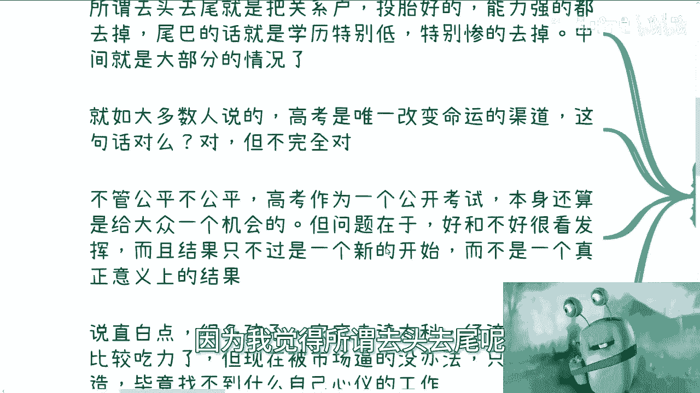

投胎好的对吧，能力强大都去掉啊，呃尾巴的话呢就是说比如说学历特别低的啊，然后家境特别惨的，我们也去掉，那么中间的呢其实是大部分这个情况啊，那么当然啊我觉得嗯还是我之前说的那句话，就是大家进。

因为大家可能也没去过太多的城市啊，也没看到过太多的人啊，甚至呢可能也不知道啊，就是说现在大部分的一些情况，所以其实在我看来啊，其实很多人呃大家是不接地气的啊，那么所以说呢就是说不要太去纠结于啊。

就是说哎呀好像我过得很不好，或者别人过得很好啊，这没有意义啊，因为好的呢，你们我打赌啊，你们也没见过不好的呢，你们也没见过，你知道吗，这个才是正常的啊，那么就如大部分人说的啊。

高考就是唯一改变命运的这个方式和渠道，这句话对不对对啊，但也不完全对，因为什么呢，因为不管公不公平啊，高考作为一个公开的考试，本身还是算啊给大众一个机会的啊，这个我们不得不承认啊。

嗯但是问题在于好跟不好呃，一方面是很看发挥，另外一方面呢就是说你看啊，你说决定一个人的这个命运对吧好，那决定一个人命运，难道就是高考之后的学校吗对吧，还是说就是说十几岁之后，20几岁就决定命运了。

这个话也不对嘛对吧，你单纯从简单逻辑我给你们去分析，你们也觉得这不对吗对吧，所以说就是说结果呢，他只不过就说是个新的开始，而不是说真正意义上的这么一个结果啊，这个事我觉得嗯就是一样的，就怎么说呢。

大家当他是个事儿啊，但是你别当它完全好像是这么个事，那么诶啊好，那么说白一点呢，就是说很多孩子呢家庭去读本科，经济情况已经比较吃力了哦，捉襟见肘，但现在呢被市场逼得没办法，他只能继续深造啊。

或者说就就继续二战一战啊。

毕竟找不到自己心仪的工作嘛，对吧哎呀就还是那句话嘛。

人活的通不通透啊，通不通透，做一件什么事情。

往往最大的心魔是自己，真的就是我，你比如说我聊下来这么多人啊，有些人问他，我说为什么哎呀，我就是想要一个这个硕士的学历，我就是想要个博士学历，说我说你干嘛呢，图啥呢，不知道啊，我就很很执着对吧。

执念那能说啥呢对吧，就就就你要我话来讲，就是你自己非要跟自己过不去，那别人他妈的怎么救得了你呢，对不对啊，二这么市场呢。

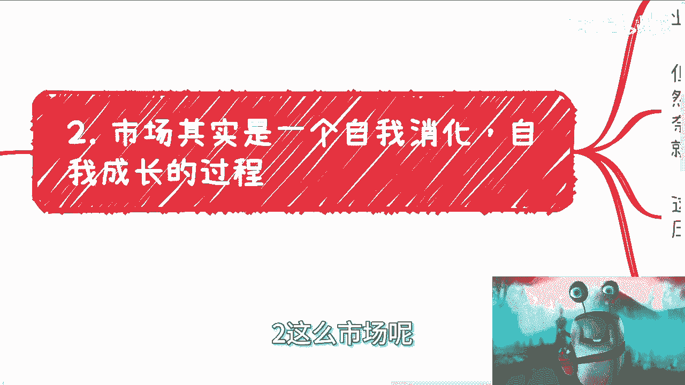

其实是一个自我消化和自我成长的过程，什么意思呢，就是说无论是什么市场啊。

市场本身其实是一个平衡，就是它相当于是一个那个无限的去保持，平衡性的这个过程，我们举个例子，比如说很多人看到的是本科对吧。

研究生现在就业也不好就业H呃，那个headcount也很少对吧。

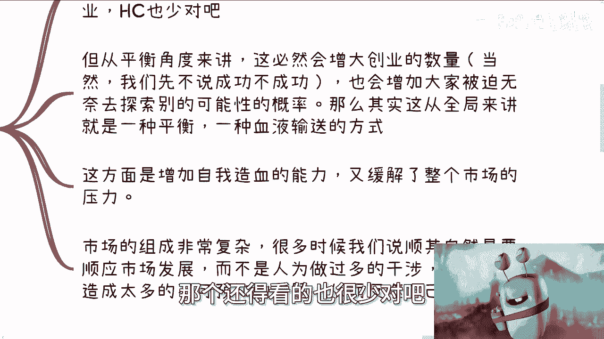

但从平衡性角度来讲，这也是必然的，增大创业的数量对吧，当然啊我们先不去说这个创业成不成功啊，也会增加大家被迫无奈，去探索别的东西的可能性，对不对好，那么这其实从全局来讲就是一种平衡，对不对。

因为一样的嘛，你不能说哦，一大群人怕全部在那个独木桥上面去挤对吧，然后然后没有一些别的这个，这个创新的东西出来对吧，那虽然咱们说创新的东西或者别的方式，叫什么啊，这个这个这个成功率很低啊。

但是我们不能说没用啊。

那么这方面呢是增加自我造血能力，就整个社会的自我造血能力。

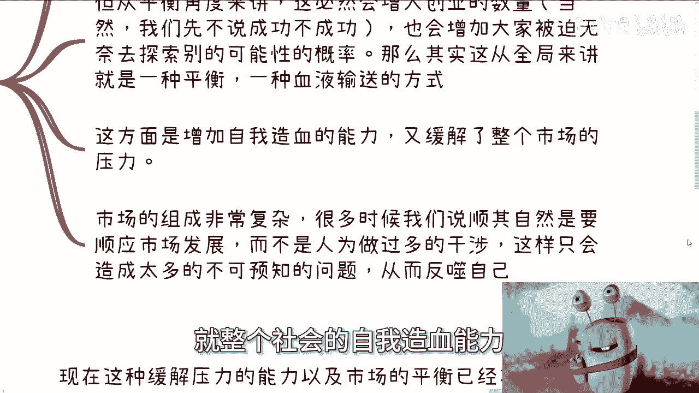

而且也会缓解整个市场的压力啊。

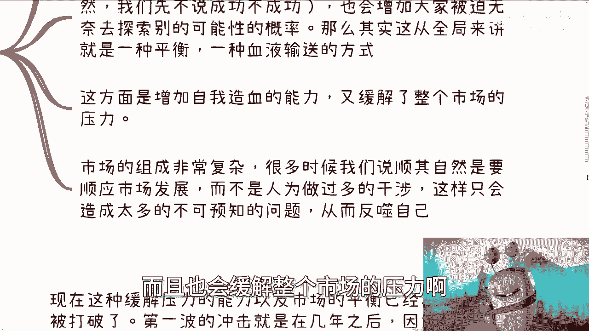

因为市场的这个组成啊它非常复杂，很多时候我们说啊顺其自然，就是要顺应整个市场发展，不要有太多的这个人为的过多的干涉，这就跟我们说那个什么啊，这个生二胎生三胎对吧，买房一个道理，就现在为什么会这样的。

就是因为人为的干涉太多对吧，这个我们就不深入讲了，那么这样呢他只会造成很多的不可预知的问题。

从而去反思自己，对不对啊，好那么我们来看几年后的情况啊。

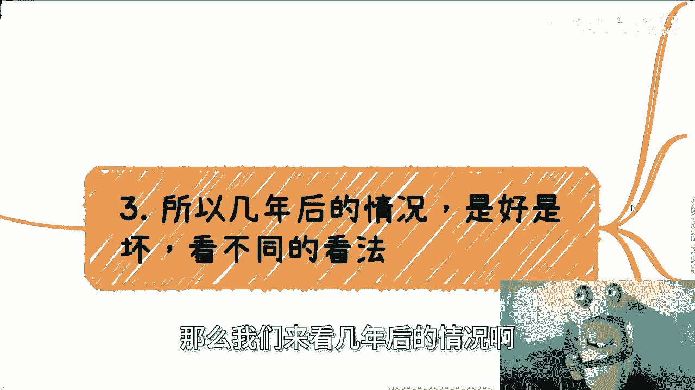

最好啊是好是坏啊，你看不同的看法啊，呃现在这种缓解压力的能力以及市场的平衡呢，已经在慢慢被打破了，因为第一波冲击基本上就是在几年之后啊，市场上并你会发现，就是说整个市场。

他并没有对找不到工作的人和群体进行消化啊，而是大众自己选择了后呃，风险的后置，比如说全部去考研啊，考公啊，甚至二战三战啊，来延缓这个风险的爆发，而什么叫做这个叫什么，就是进行消化，经营效果很简单。

就是那你们要用全局的眼光去看，就是所谓进行消化，不是说一定有好的结果和不少好的结果，好的结果更不好的结果都是消化对吧，你就像你就像就说那个那个那个生老病死对吧，包括就是说是那个全球的病毒对吧等等等。

你从一个更全局的，你从地球整体来讲，他也是这种进行消化呀对吧，也是这种人员的优化呀，这有什么问题呢，对不对，当然你从个体来讲，可能你会觉得哎呀这个好像很残忍对吧，这个好像很可怜，但是你从全局来看。

它就是一种自我消化的过程，你能控制吗，你不能对不对，那么你说找不到工作，那么有的人去创业的，有的人从一线退到二线，有的人回老家了，这也是一种消化呀，对不对，你总不能说啊，大家不消化啊，大家都不管啊。

全部往一条船上挤，那就要船做船了，怎么办对吧，因为因为你要明白一点啊，就是整个市场的消化过程，它是一个顺其自然的过程，你说不管是大家真的，我们随便讲啊，比如说你从一线退到二线，二线退到三线啊。

还是说你是创业还是怎么样子，你不会觉得是有人在逼你啊，你会觉得这件事情是自我的一种选择对吧，那么大家都是自我的选择，都顺其自然，这件事情往后就不会有很多的问题，就是他也不会怨天尤人对吧，也也不会就说诶。

我的啊也不会就是进行很大的反噬，因为否则的话，如果你会发现大部分的情况，你说哎我今天天选这个东西，我他妈不是我想选的啊，是被人逼我的，好了，你看着好了，到最后就是心中的这种怒火会越来越大。

早晚有一天会爆发啊，这个就是我们所说的反噬，但同样的我们不能说啊，这个人为的造成的风险或者啥的呢，嗯就当下这种情况，我们不一定说一定是认为造成风险，也可能就因为当下这个情况而更是顺其自然。

市场规律我们也不知道啊，但无论是什么，事实已经是如此了对吧，两到3年内不可能会有什么改观，然而我们所有人都要面对这些问题，为什么很简单啊，年龄大的要面临年年纪轻的来卷，年纪轻的要面临年纪更轻的来卷对吧。

然后年纪更轻人就要面面临所有的人，跟他们一起竞争工作，那没有办法，谁都逃不掉的啊，那么到那个时候竞争会非常激烈，人非常的多，head count其实还是那么些，当然我我我不敢说啊，就一定说怎么样。

甚至会更少啊，然后大家也可能继续去卷博啊，说白了，哦我打错了啊，我说大家也不可能继续去卷播，为什么，因为说白了人生的1/3可能都要过掉了，那么我相信大部分人到那个时候，虽然对全局可能没什么了解。

但是他多多少少也会明白点事情，首先要明白一点事情，就是我不能再这么读下去了，再这么下去我就废了对吧，我相信多多少少心里面都会有这个呃，有这个有这个叫什么声音的啊，所以在我看来。

市场的自然规律就是让更多的人需要主动也好，被迫也好，选择不同的生存方式在社会上生存，否则的话你怎么平衡对吧，就像我们刚刚说的，所有的东西，所有的人都往一端去走，早晚要沉啊啊，当然哦咱不得不说啊。

过程肯定是痛苦的，肯定是难受的，当然就像我说的，有的人在过程当中是炮灰，有的人在这当中也能成功，对不对，但是我们不要去纠结于别人，我们要看的就是从全局来讲，这意味着更多的机会正在出来啊，你还有啊还有啊。

就是有很多人跟我纠结，说哎呀这个这个这个某些政策对吧，或者怎么样，是不是意味着更多机会怎么样怎么样，你不要去纠结他，你懂吗，就是你只要知道有更多的机会，然后你就去寻找他。

你不要来问我爱陈老师是不是有更多机会出来，这种问题没有意义，你你你明白吧啊但是你就是得要明白，就不要再去一味的去卷一些，就是就是对这个社会已经已经已经，比如说卷的没有价值的一些东西啊。

好那么最后诶啊最后。

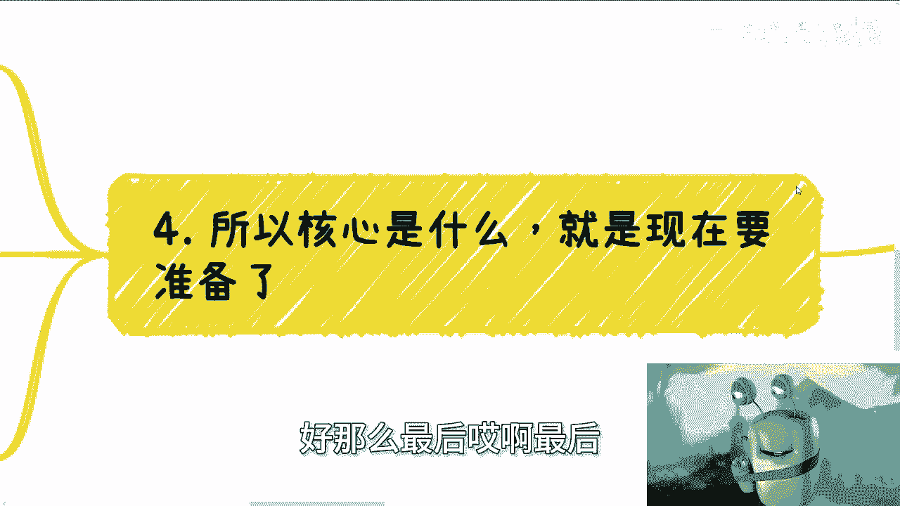

所以我们说核心是什么，就是现在要准备对吧，就从123年我其实一直在说这个话，就是嗯就是说话呢都听得懂，但是怎么做不知道啊，嗯不管你是做自己的项目还是去融资啊，还是选择出国还是选择社交赚钱随便啊。

但是你得准备，为什么，因为到那次到那第一波冲击过来的时候，你就想想看吧，你怎么挡得住这波吗，对不对，然后你怎么在未来到你30多岁，40多岁，就是就是能够这个这个有一定立足之地嘛对吧，因为你们要明白啊。

就是你们因为现在还年轻，你们没太大压力，但是没有办法的，你知道吗，人就是这么一个生物，人生就这么个过程，你到30多岁，你总归要面临父母的一些这个，这个生理疾病对吧，或者说更多的一些照顾。

你也得面临自己的家庭，甚至面临自己的孩子，你后面有的反了，你再到后面说哦，我要去积累，你积累个屁，积累个鸡，对不对啊，我希望大家能明白，整个人类社会归根结底它就是关系跟金融，无论你们做什么。

最后都是一样的，我们一直说的那句话叫什么叫当雪崩来的时候，没有一片雪花是无辜的，什么意思，就是你比如说很多人跟我说哦，很多优秀的人在学校是潜心做研究的，他不管那些有的没的，然后呢不你是不管那些有的没的。

但是你要知道你往上很多的，你说你潜星座有件，你在网上看呢，朝上看呢，你这些研究不还是被别人来利用赚钱吗对吧，那有人赚钱就有人亏钱啊，对不对，所以说所以说没有用的，不要自己当鸵鸟。

然后还用鸵鸟的理论来来来验证一些东西，没有意义的，因为我们都是个体，整个社会不会因为我们而改变的对吧，所以说我们要做的是什么，我们更多要做的就是不停的去探究，它的本质是什么啊，当然我们可以有良心。

但是就是说你说啊，就是说我们可以达到一定高度，我们也可以有良心，但是至少你得让自己先达到这个高度吧对吧，先有这个看全局的意识吧，就让朝总归是要来的啊，当然也你也可以选择出国或者别的一些东西。

方式方法很多，每个人有每个人的牌，对不对，你你你你你打开自己的视野，认知格局才是最终的解决方案，呃呃我们一直说什么叫圣人鱼不如授人鱼嘛，对不对，那你到底哪个鱼呢，现在大部分人都是都是都是只看眼前啊。

然后就说哎我就我就我就之前躲几年能躲几年，十几年没有用的呀，对不了，我就说了嘛，人都是这么过来的吧，我也是这么过来的，但是就像我跟你们讲的，我们当年有缓冲带，你们现在没这么大的缓冲带啊。

所以说就说现在不解决。

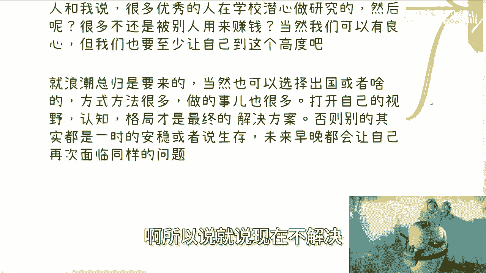

你早晚还是要解决这些问题啊，所以就目前这个数据。

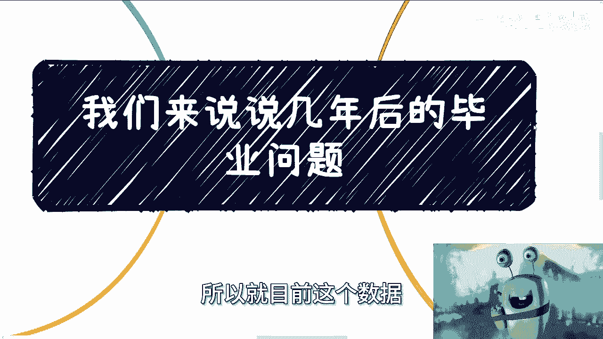

本来呢觉得可能就是说是个问题，但不是什么太大的问题，但但是从这个这两天这个新闻，关那个披露出来的，比如说清华同济啊啊复旦啊，那你其实往下映射就更别说了嘛对吧，就甚至还有那些就是说啊我也没考研。

我也没考研，但呃不是啊，我也没没没考公，我也没读研，到最后就在那边一战二战的，相当于也是一种这个往后拖嘛对吧，所有人每个人都用自己的方式往后拖，但是没有用的。

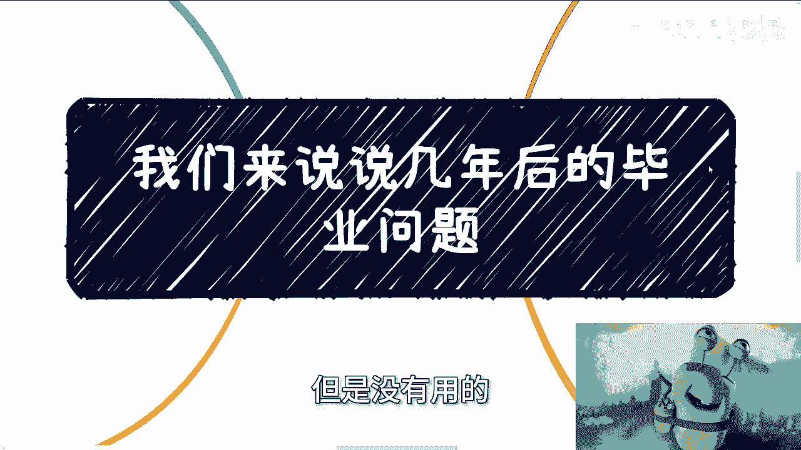

这两三年后大家还是要工作的，我再往后拖吗，怎么拖，就像我这边写的这个普通老百姓怎么拖啊，这现在读书奖学金啊，或者很多有一些小贷款啊，已经捉襟见肘了，还怎么拖，再不赚钱怎么办对吧。

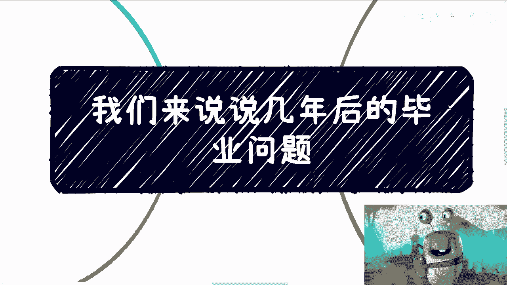

好吧，所以我觉得这样子的就是嗯，你们不要再去想着说啊，很多人就是啊怎么样怎么样，很多人是很多人，我们不是很多人啊，当然你是不是很多人取决于你怎么做啊，你不要一上来就跟我说，哎很多人怎么样怎么样怎么样。

那还说什么东西了，对了我跟你讲，我现在只要看到评论区说什么，很多人怎么样怎么样，我都拉黑，没什么好讨论的，有什么好讨论的了，那照这么个说法，所有东西都可以用，很多人不怎么样开头的，那那还说啥呢。

没啥好说的，对不对啊，行好吧，那么这一期就这么着好，反正大家有啥。

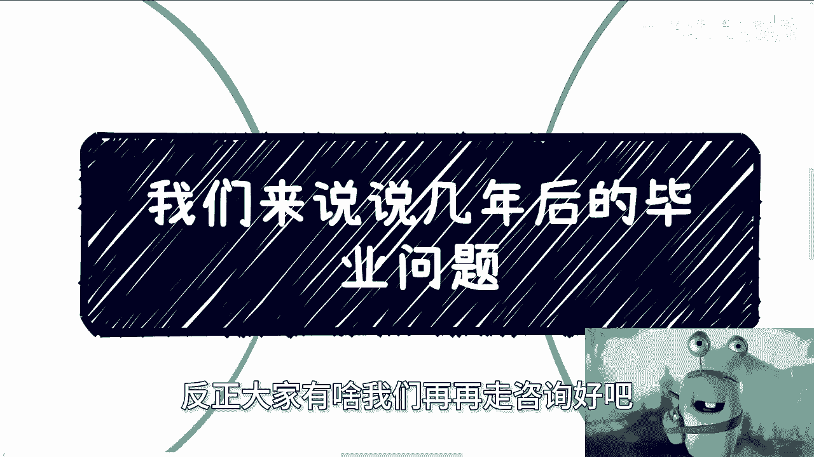

我们在在走。