# 课程：毕业问题分析与应对策略 - P1 📚

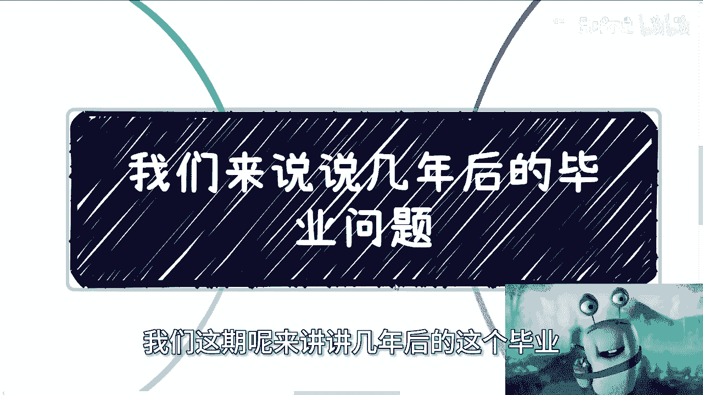

在本节课中，我们将要学习如何理性看待几年后可能面临的毕业与就业问题。我们将分析当前的市场环境、个人心态，并探讨有效的应对策略，帮助大家为未来做好准备。

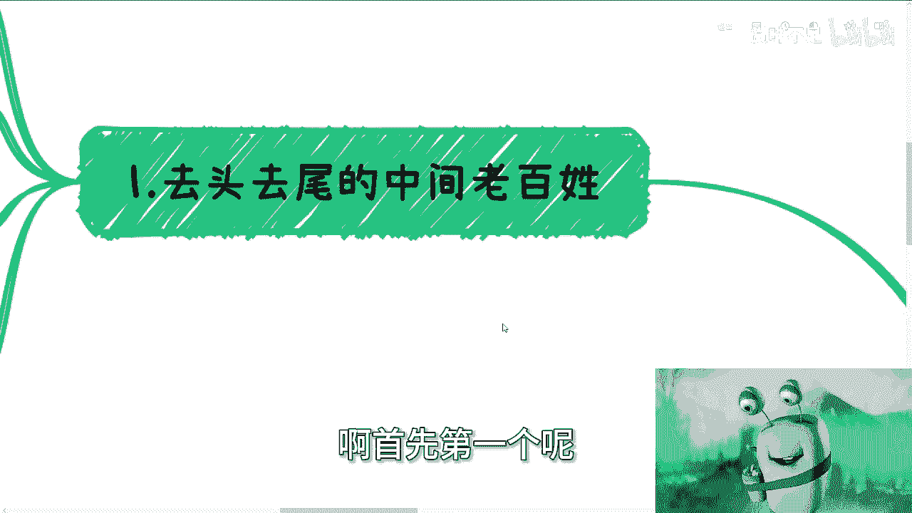

---

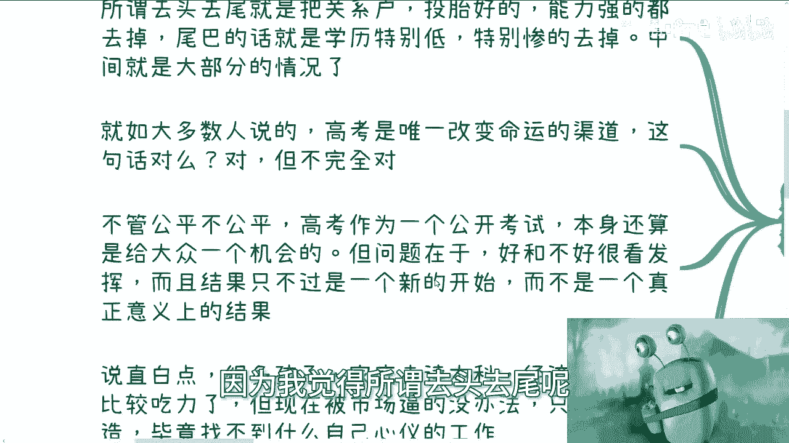

## 概述：我们面临的现实 🎯

毕业问题大约在两年到三年后出现，这是一个无法改变的现实，我们必须面对。

首先，我们需要聚焦于“去头去尾”后的大多数普通人。所谓“去头”，是指排除掉那些有特殊关系、家庭背景优越或能力极强的人。所谓“去尾”，是指排除掉那些学历特别低或家境特别困难的人。中间这部分人代表了大多数人的普遍情况。

很多人可能没有去过太多城市，没有见过太多人，甚至不了解当前社会的普遍状况。因此，很多人对现实缺乏接地气的认识。不必过于纠结自己过得不好或别人过得很好，因为大多数人既没见过极好的，也没见过极差的，这才是常态。

---

## 高考与命运的重新审视 🧠

上一节我们介绍了大多数普通人面临的普遍现实，本节中我们来看看如何看待“改变命运”的关键节点——高考。

很多人说，高考是唯一改变命运的方式和渠道。这句话对，但也不完全对。无论公平与否，高考作为一个公开考试，确实为大众提供了一个机会。

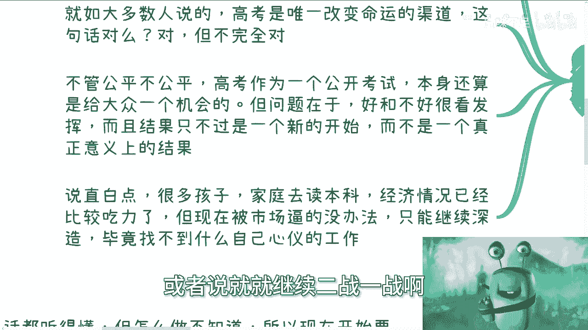

然而，决定一个人命运的，不仅仅是高考后的学校，也不是在十几岁或二十几岁就一锤定音。从简单逻辑分析，这显然是不对的。高考的结果更应该被视为一个新的开始，而非最终结局。

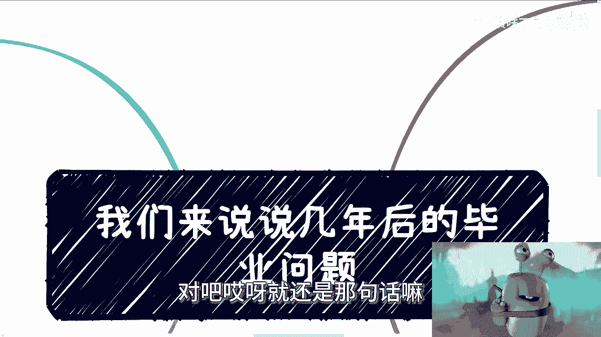

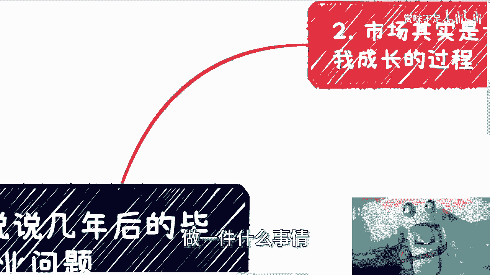

大家需要重视它，但不要将其视为决定一切的唯一事件。

---

## 深造背后的经济与心理压力 💸

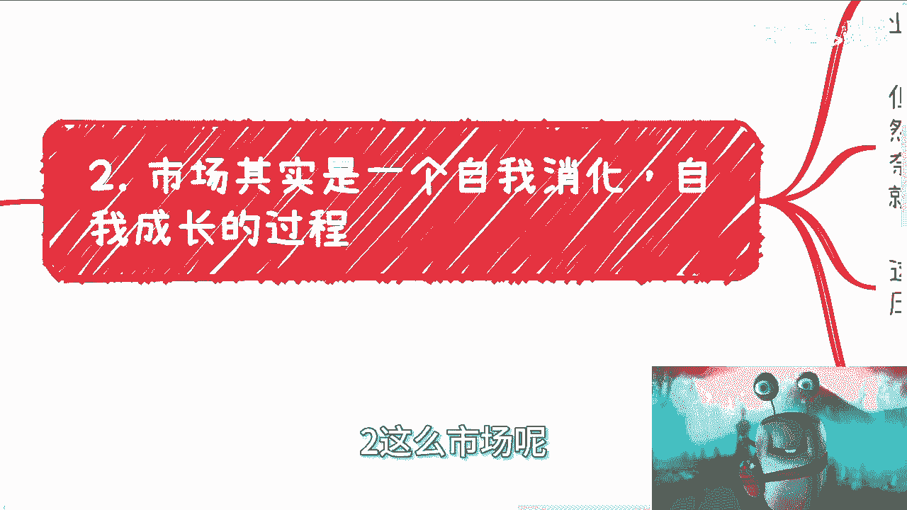

说直白一点，很多家庭供孩子读本科已经经济吃力、捉襟见肘。但现在被市场所迫，学生只能选择继续深造，或者进行“二战”、“三战”考研，毕竟找不到心仪的工作。

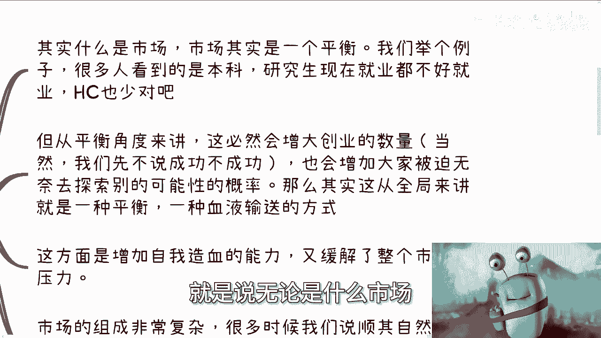

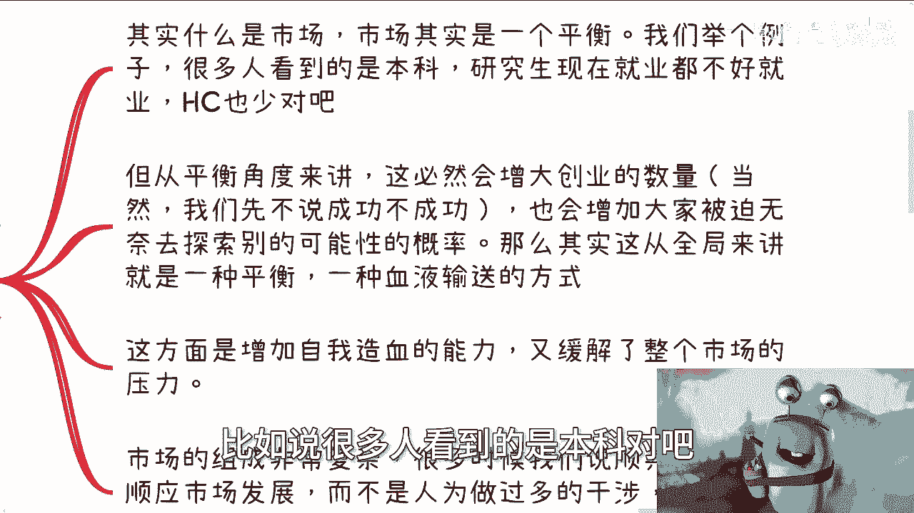

人活得是否通透，做一件事情最大的心魔往往是自己。例如，很多人执着于要硕士或博士学历，但当被问及原因时，却回答“不知道”，这只是一种执念。如果自己非要跟自己过不去，别人是无法拯救的。

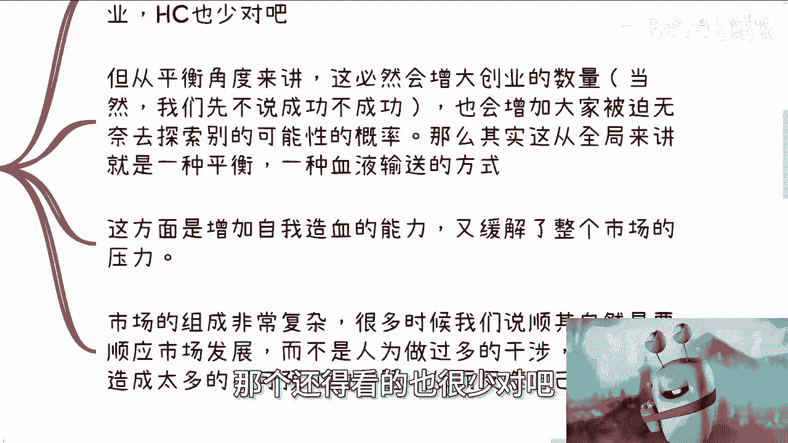

---

## 市场的自我平衡与消化机制 ⚖️

上一节我们探讨了个人选择背后的压力，本节中我们来看看宏观的市场规律。

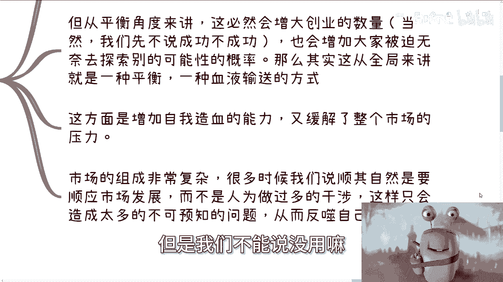

市场本身是一个追求无限平衡的过程。无论是什么市场，它都像一个自动调节器。

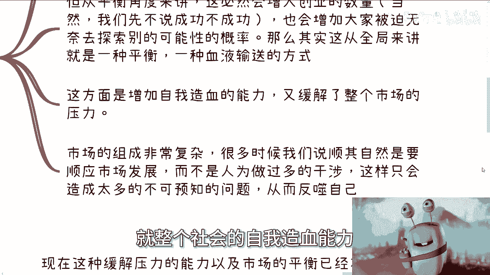

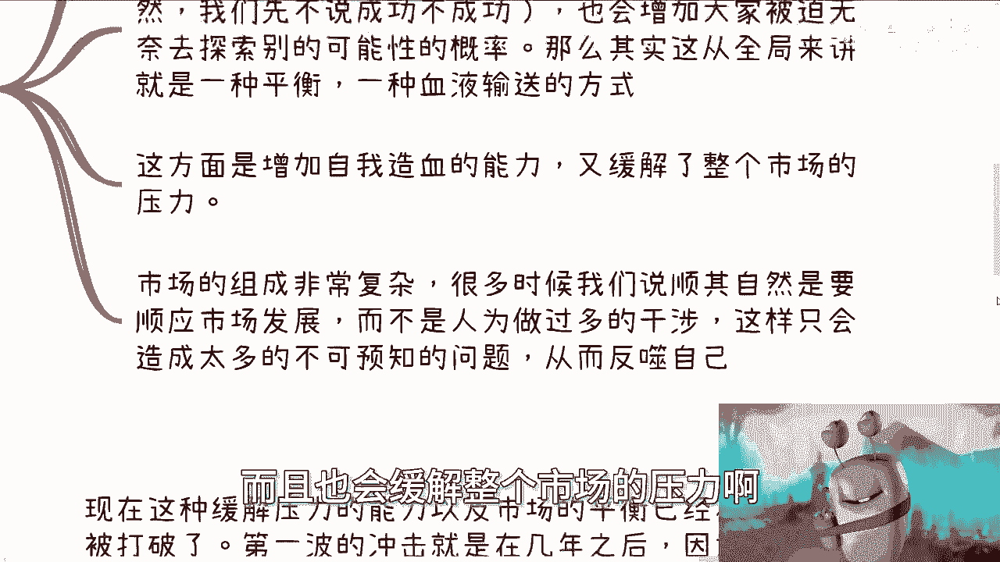

我们举个例子，很多人看到本科生、研究生就业困难，岗位（`headcount`）很少。

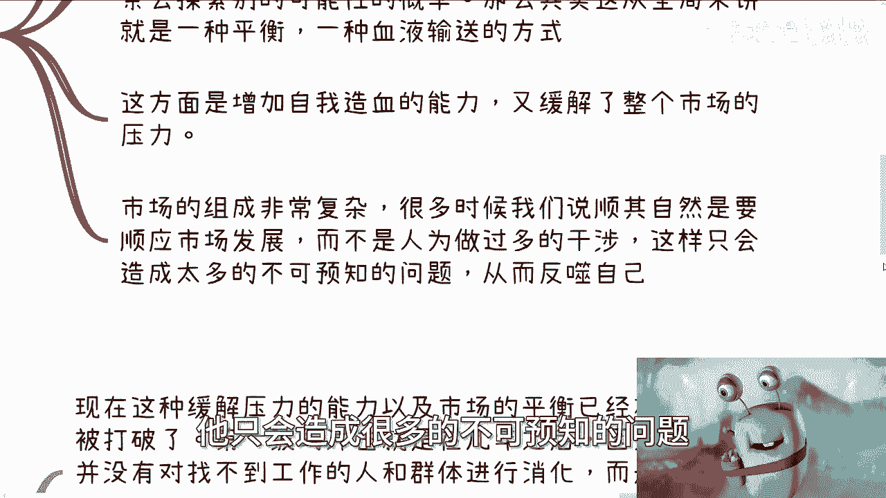

但从平衡性角度讲，这是必然的。这会倒逼出其他可能性，例如：
*   增大创业数量（无论成功与否）。
*   增加人们被迫探索其他出路（如从一线城市退回二三线）的可能性。

从全局看，这就是一种平衡。不能让所有人都挤在一条独木桥上。虽然新路径成功率可能低，但不能说没用。

这方面增加了社会的自我造血能力，也缓解了整体市场压力。

市场的组成非常复杂。很多时候我们说“顺其自然”，就是要顺应市场发展，不要有过多人为主导的干涉。过多干涉只会造成许多不可预知的问题，从而促使人们反思自己。

---

## 几年后的挑战与风险后置 ⏳

好，那么我们来看几年后的情况。好坏取决于不同的看法。

当前这种缓解压力和维持市场平衡的能力正在被打破。第一波冲击基本就在几年之后。你会发现，市场并没有消化找不到工作的群体，而是大众自己选择了**风险后置**——例如全部去考研、考公，甚至二战、三战，以延缓风险爆发。

那么，什么是“进行消化”？

要用全局眼光看。所谓消化，不一定都是好结果，好结果和不好的结果都是消化。就像生老病死、全球病毒，从地球整体来看，也是一种人员优化和消化过程。从个体看可能残忍，但从全局看，这是自然的自我调节，无法控制。

找不到工作的人，有的去创业，有的从一线退到二线，有的回老家，这也是一种消化。总不能所有人都不消化，全部往一条船上挤，船会沉的。

整个市场的消化是一个顺其自然的过程。无论是退居二线还是创业，人们会觉得这是自我的选择。大家都是自我选择，顺其自然，往后就不会有太多怨天尤人的问题，也不会产生巨大的反噬。反之，如果人们觉得是被逼的，心中的怒火会越来越大，早晚会爆发，这就是反噬。

当然，当下的情况不一定是人为造成的风险，也可能是市场规律使然。但无论原因是什么，事实已是如此。两到三年内不可能有太大改观，所有人都要面对这些问题。

原因很简单：
*   年龄大的要面临年轻人的内卷。
*   年轻人要面临更年轻人的内卷。
*   更年轻的人要面临所有人的竞争。

谁都逃不掉。到那时竞争会非常激烈，人非常多，而岗位可能还是那么多，甚至更少。

大家也不可能继续去“卷”博士，因为人生的三分之一可能都要过掉了。我相信大部分人那时虽然对全局了解不多，但多少会明白：不能再这么读下去了，否则就废了。

在我看来，市场的自然规律就是让更多的人——无论是主动还是被迫——选择不同的生存方式在社会上生存。否则无法平衡。就像之前说的，所有人都往一端走，船早晚要沉。

过程肯定是痛苦和难受的。有的人会成为炮灰，有的人也能成功。但我们不要纠结于别人，要从全局看，这意味着**更多的机会正在出现**。

不要纠结于某些政策是否意味着更多机会。你只需要知道有更多机会，然后去寻找它们。不要再去一味地“卷”那些对社会已经没有太多价值的东西。

---

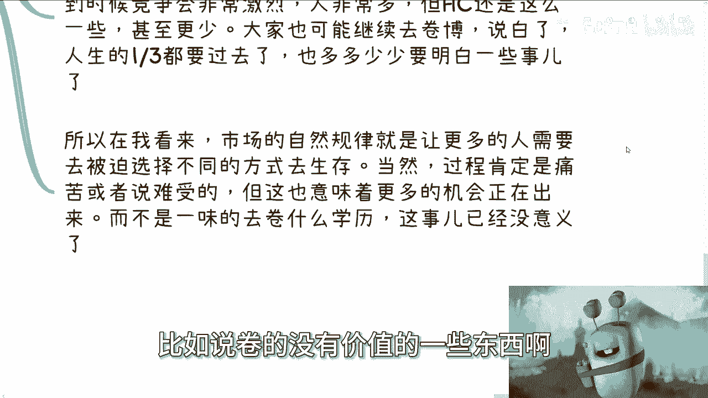

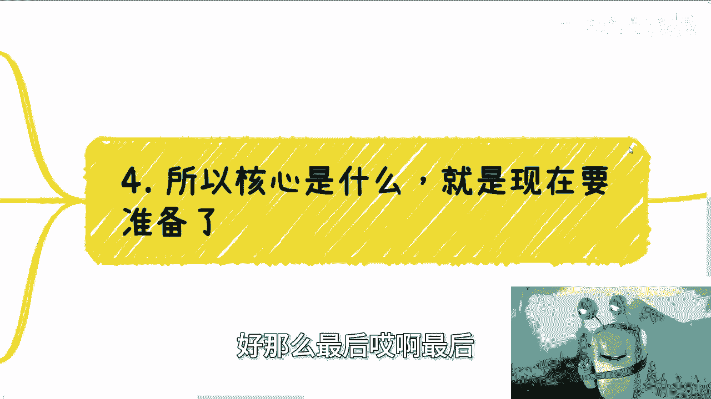

## 核心策略：立即开始准备 🚀

上一节我们分析了未来的严峻挑战，本节中我们来看看唯一的出路——立即行动。

所以我们说核心是什么？就是**现在要准备**。这一两年我其实一直在说这个话。话都听得懂，但是怎么做不知道。

不管你是做自己的项目、去融资、选择出国、还是学习赚钱，你必须准备。

为什么？
因为当第一波冲击来临时，你想想看，你怎么挡得住？你怎么确保自己在未来三十多岁、四十多岁时能有一定立足之地？

你们现在还年轻，压力不大。但人就是这么个生物，人生就这么个过程。到三十多岁，你总要面临父母的健康问题、需要更多的照顾，也要面临组建自己的家庭、养育孩子。到时候再说“我要去积累”，就来不及了。

我希望大家明白，整个人类社会归根结底就是**关系**与**金融**。无论做什么，最后都绕不开这两点。

我们常说：“当雪崩来临时，没有一片雪花是无辜的。” 很多人说，优秀的人在学校潜心做研究，不管别的。但你要知道，你往上看，这些研究最终不还是被别人用来赚钱吗？有人赚钱就有人亏钱。所以，不要自己当鸵鸟，用鸵鸟的理论来验证东西，没有意义。社会不会因个体而改变。

我们要做的是不停探究事物的本质。当然，我们可以有良心，但至少先让自己达到一定高度，拥有看全局的意识。

浪潮总归是要来的。你也可以选择出国或其他方式。方法很多，每个人有每个人的牌。**打开自己的视野、认知和格局，才是最终的解决方案**。

我们常说“授人以鱼不如授人以渔”。你现在是想要“鱼”还是“渔”？现在大部分人都只看眼前，想着躲几年。但就像我说的，我们当年有缓冲带，你们现在没有这么大的缓冲带。

所以说，现在不解决，早晚还是要解决。

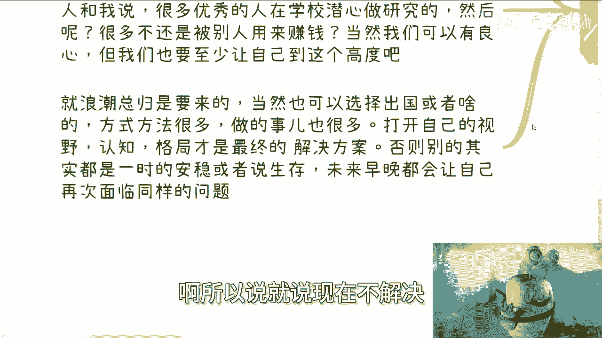

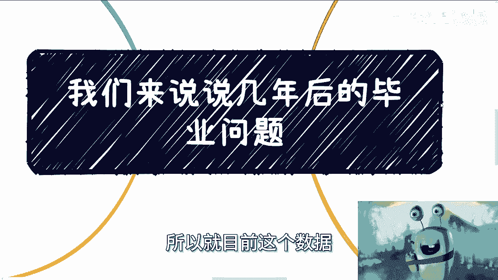

就目前的数据来看，本来觉得可能是个问题，但不是什么大问题。但从这两天披露的新闻（如清华、同济、复旦的就业数据）看，往下映射，情况更不容乐观。甚至还有那些没考公、没读研，就在那里一战、二战的人，相当于也是在往后拖。

每个人都用自己的方式往后拖，但没有用。

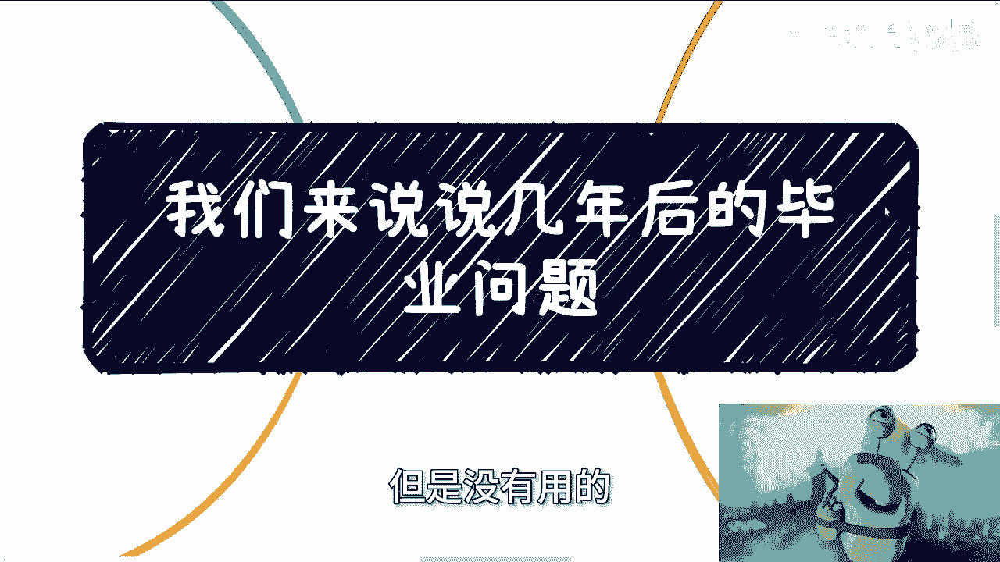

两三年后大家还是要工作的。还能怎么拖？普通老百姓怎么拖？现在读书的奖学金、一些小贷款已经捉襟见肘了，再不赚钱怎么办？

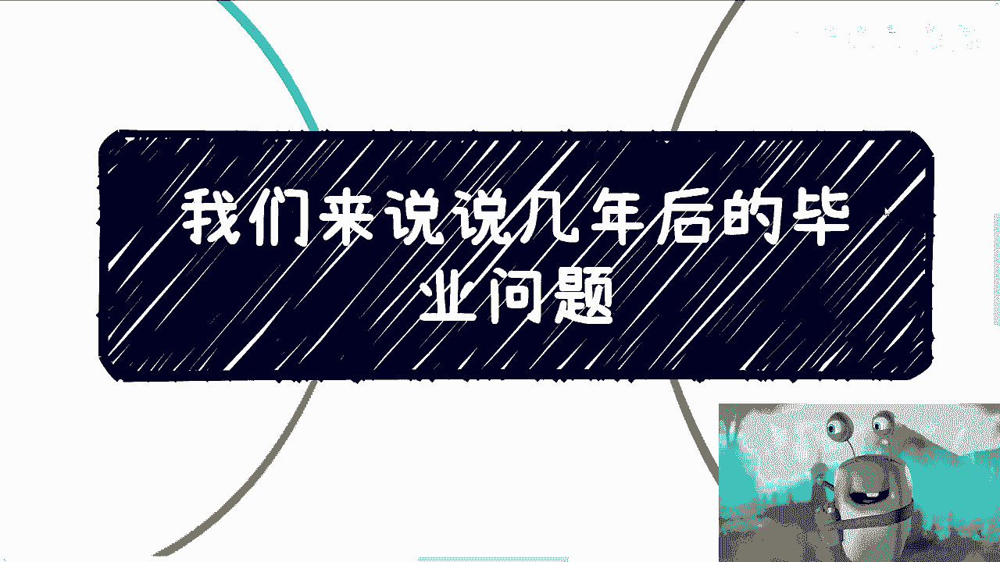

所以，你们不要再去想着“很多人怎么样怎么样”。很多人是很多人，我们不是很多人。当然，你是不是“很多人”取决于你怎么做。不要一上来就说“很多人怎么样”，这无法讨论。如果所有事都可以用“很多人不怎么样”开头，那就没什么好说的了。

---

## 总结 📝

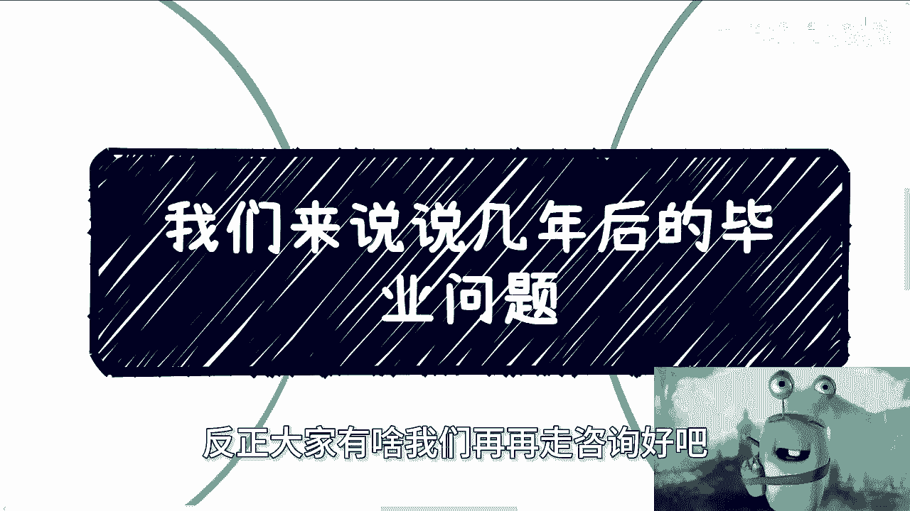

本节课中我们一起学习了如何理性面对几年后的毕业与就业挑战。我们分析了聚焦普通大多数人的重要性，重新审视了高考的意义，认识了深造背后的经济与心理压力，理解了市场自我平衡与消化的机制，预见了风险后置带来的未来冲击，并最终明确了**立即行动、提前准备**是应对一切不确定性的核心策略。记住，打开视野和认知格局，为自己寻找多样化的生存方式，才是通往未来的关键。