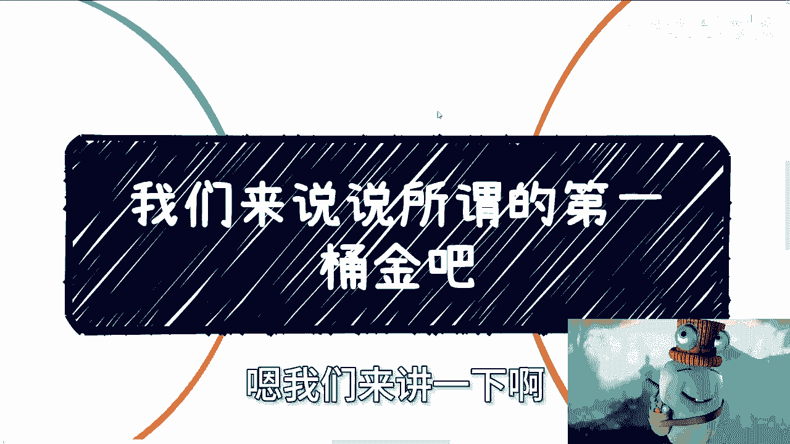
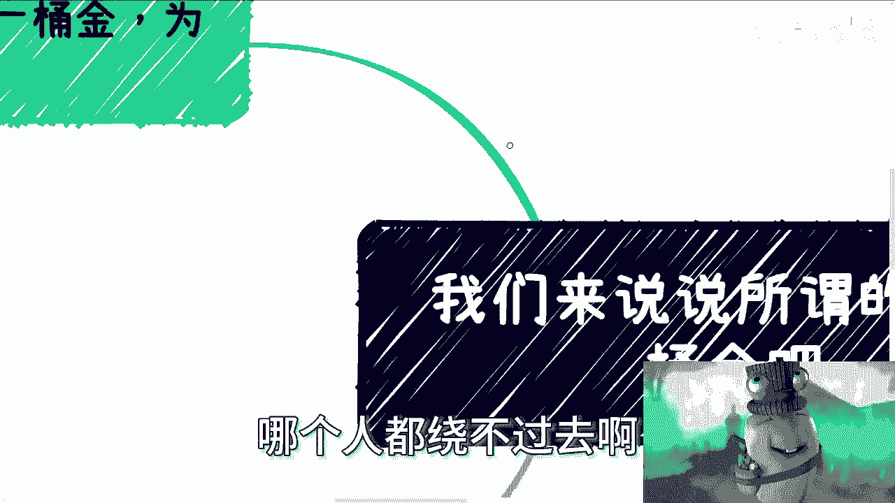
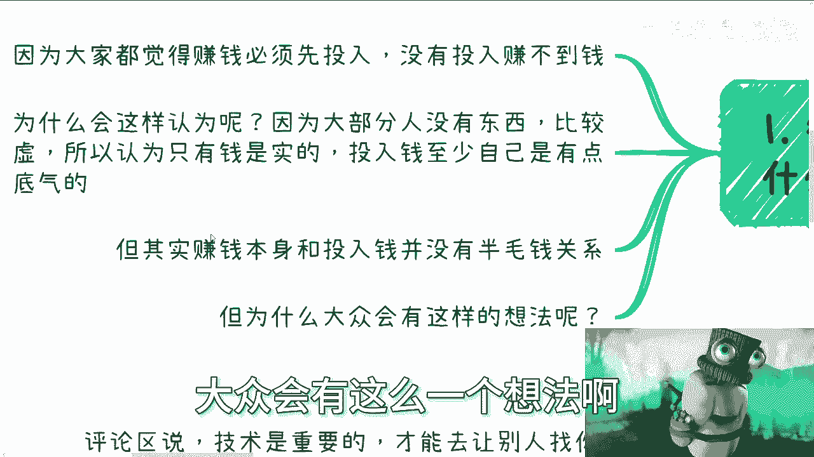
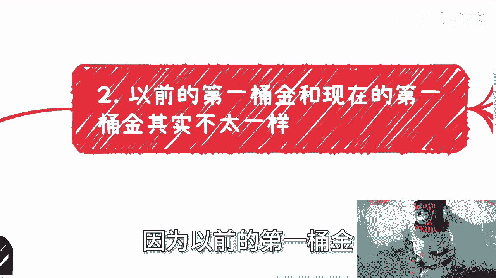
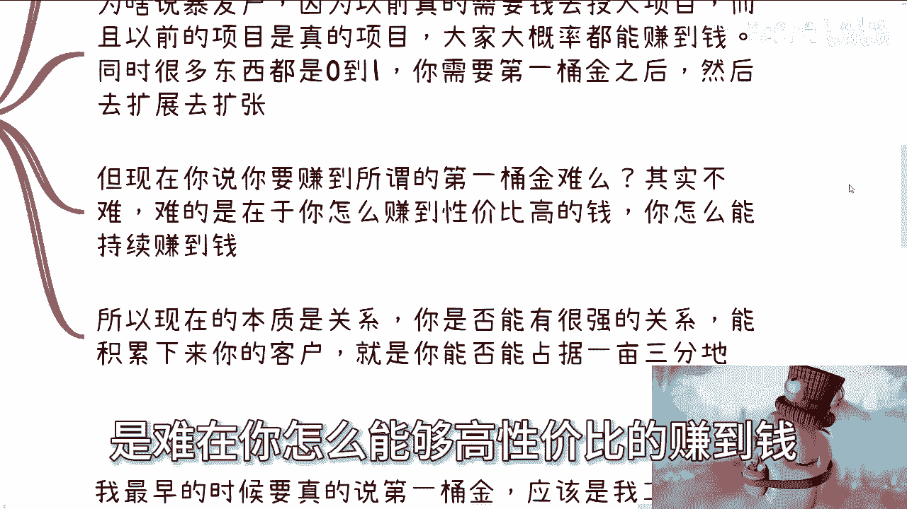
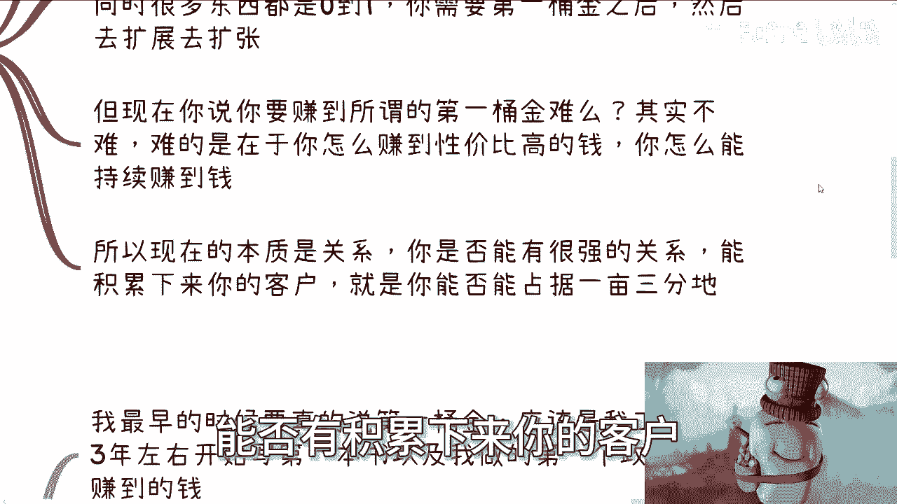
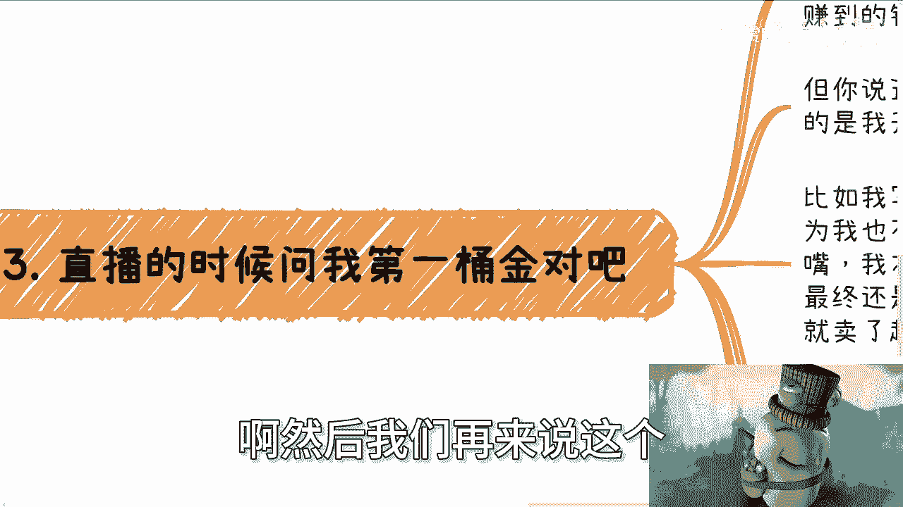
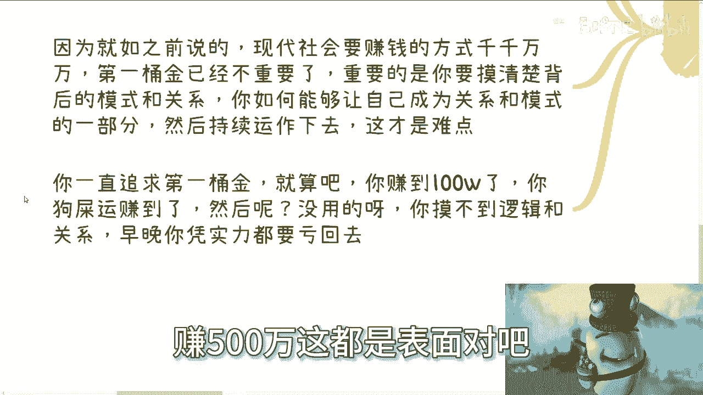
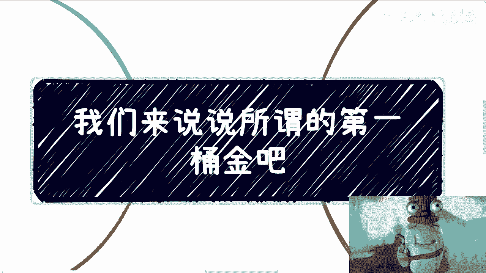

# 我们来说说第一桶金到底是什么吧 - P1 - 赏味不足 - BV1Lw411u7RK

嗨大家好，我这边就是在装修啊，这个背景有背景音乐是吧啊嗯我们来讲一下啊。

所谓的第一桶金啊，这个事儿呢也有很多人关心是吧，每个人都绕不过去啊。

嗯很多人会关心这个第一桶金，为什么啊，因为因为大部分人他觉得赚钱必须先投入啊，没有投入赚不到钱，我跟你讲，这他妈的就是最大的陷阱，谁他妈说赚钱必须要投入的，这不扯淡嘛，对不对啊。

你赚钱你要投入的是你的时间，你的精力，你的模式对吧，你的脑子，而不是说投入钱，那当然啊咳咳为什么会有这么多人这么认为啊，他也是有道理的，因为大部分人没有东西比较虚，所以说呢认为钱才是实的。

投入钱呢至少自己有点底气，但是你们用你们的膝盖想一想，如果投入钱就能有底气，或者投入钱就是你们的资本的话，那他妈所有人投入钱都有资本呗，所有的钱都有都有底气呗，那你跟别人有什么区别呢，如果你跟别人没有。

那凭什么你能赚钱呢，对不对，你用你的脚趾头想想就知道了呀，没有意义的呀，除了赌博，其实就是赌博心理啊，我觉得就是说很多人他不是不明白，但他没有办法是吧啊，嗯所以说呢就是说其实赚钱本身啊。

跟投入这个钱没有半毛钱关系啊，但是为什么我们说这个大众会有这么一个想法。

就是我们来看一下啊，很简单啊，因为以前的第一桶金。

跟现在第一桶金其实不太一样，为什么你想想看以前为什么在乎第一桶金啊，因为大家没有钱呢，因为以前没有现在这么多机会，没有这么多的零散的机会，但是以前的机会是真的机会，就是真的能够那种四两拨千斤。

能够让你翻身的机会，但现在机会不一样，现在机会很多都是外快散钱，你知道吧，首先这第一点，第二点啊，就是说为啥我们说暴发户，暴发户对吧，以前我们都说这个暴发户，为什么，因为以前很多项目。

它是的确是真的需要钱去投入的啊，而且以前的项目呢就像我刚刚说的，它真的是项目，大概率呢你投进去钱，它你是能赚到钱的，为什么，因为你社会在发展中对吧，世界在发展中，很多东西它就是0~1，你就像我之前说的。

就是你能赚到钱，不是因为你牛逼，仅仅是因为天时地利人和你有这么个机会对吧，这就这就像我说的，我不管什么马云，什么什么刘强东或者其他人，他妈都是，为什么，因为你把他放到现在，你能转吗，转个屁，对不啦。

他只是天时地利，任何选出来的这么一些人，或者能抓住机会的这些人而已，你说他格局有多大，我觉得没有什么格局了，在他能赚到钱之前，他能知道他赚到钱吗，这他妈知道个屁呀，对不对，没有人是先知啊，谁能知道啊。

啊那么那以前呢你就是需要第一桶金。

然后去扩张，去拓展，但现在这个时代，你想想看啊，你说你要赚到所谓的第一桶金难吗难吗，我就问啊，所谓什么叫第一桶金，第一桶金多少钱算第一桶金，对不对，你要赚到所谓的第一桶金，是指说你在副业上能赚到钱呢。

还是说你先赚到第一个100万呢，其实这都不难，为什么，因为难是难在你怎么能够高性价比的赚到钱。

你怎么能够持续的赚到钱，这个是难的对吧，所以说现在的本质是关系，你是否能有很强的关系，能否有积累下来。

你的客户，你就能否就是说占据自己的一亩三分地，这个是难的对啊，然后我们再来说这个直播的时候。

你说直播的时候有人问我第一桶金对不对，好，你看啊，我最早的时候要真的说第一桶金，应该是我工作两三年左右对吧。

写的第一本书，以及我做的第一个政企的咨询赚到的钱，但你说这个钱对我重要吗，没有意义的，我当时拿到这笔钱，然后呢，我他妈投到股市里嘛，不是呀，因为什么，因为我没这个能力。

我也没有这个天时地利人和的机会对吧，所以说你说这钱对我多重要吗，不重要。

但是重要的是什么，重要的是整个这件事情，他对我开启了这个0~1的这条路，你比如说我写书，在我写之前，我从来没有想过有这条路，为什么，因为我语文从来不及格对吧，因为我从来不了解哦，原来还能出书对吧。

然后我一直觉得妈的出书都是牛逼的大佬对吧，去做的对吧，直到清华大学出版社主编跟我提了一嘴，我才发现哦，原来我也可以做啊，当然你说我做之前我有底吗，我也没底，我是先知吗，我能知道这本书写出来能卖多少钱吗。

不知道对吧，但是最终是你得去做，包括申申请书号，申请版号对吧，包括你要立项对吧，你得去写，你得一审二审三审，你不做，你怎么会知道呢，我不做这些事情，我如何来跟你们讲这些东西呢。

对吧哦我就听别人讲没有用的，就像我昨天在深圳活动那个群里面，我跟大家说的对吧，就所有东西我只关心是什么，就是要么我参与过的，要么就是我看着别人参与，我听别人讲故事，我就只当故事听，我不会当真的，为什么。

因为这里面水分肯定很多的呀对吧，你只有做了你才能明白你道听途说的，只能是道听途说啊，就是说你做事情，这只是需要一个契机啊，但是我们说结果对吧，其实第一年我那本书就已经卖了超过1万本了，对吧。

那我也很开心，出版社也很开心，就是两双赢，对不对，但是还是那句话，这第一桶金对我重要吗，不重要，这个逻辑，这个模式，这个合作伙伴对我才是重要的，对吧啊，然后我们来说政企咨询这个事儿。

我大概最早的一次是在四五千一天，但对我来讲当时已经很高了，因为当时我第一份工作，我月薪才500啊，然后再做了一段时间之后，我稳定差不多在1万5到2万块钱一天，对吧，然后我也可以告诉你们。

我一年可能他妈的365天，有2/3的双休日，我都在外面做，你自己去算算对吧，虽然是辛苦钱，但这个辛苦值得啊，为什么，因为这个辛苦性价比高啊，因为同时我辛苦的同时，我还能积累出来关系啊，对不对。

但是这钱对我重要吗，不好意思，不重要，我要持续发展才是重要的对吧，我要摸清楚他们背后的关系，我摸清楚他们背后的逻辑，我能不能持续接单，这才是重要的哦，这他妈的第一桶金四五千对我重要。

个屁啊啊我靠这四五千能活到现在吗，没有用的啊，所以现代社会我跟你讲就更是如此，比如说比如说啊，评论区说啊，技术很重要，你要是没有背景，没有什么金钱，你需要有技术才能让别人别人找你合作，这他妈的搞笑啊。

中国满地都他妈是技术，你会个屁啊啊你告诉我你会什么东西，别人不会的，有卵用啊，对不对，技术我笑掉大牙了，真的就真的我跟你讲，这他妈就是最大的最大的啊，然后来说第一桶金，我跟你讲一样的道理。

今天就算第一桶金，你赚了10万又如何呢对吧，你除了用这个东西能够在自媒体，自媒体上吸引一些人的眼球以外，你说老子第一桶金赚了10万对吧好，然后吸引了一群对吧，这个中国的普罗大众啊，说的好听点叫普罗大众。

说的不好听点就是，你还有什么用呢，我就问你还有什么用呢对吧，因为就像我之前说的，现代社会你要赚钱的方式千千万万，第一桶金早就已经不重要了，重要的是你要摸清楚背后的关系跟逻辑，对不对，你就像我们说的。

你一直追求第一桶金，你一直被PUA感觉自己要去赚第一桶金，我就算啊，你今天狗屎运赚到了100万，然后呢又如何呢，没有用的，你只要摸不清楚逻辑和积累不了关系，你早晚这点钱是要凭实力亏回去的，你知道吗。

就是你在赚钱的时候，你会很轻飘飘，你会觉得卧槽老子牛逼了，老子他妈的要要上人生巅峰，迎娶白富美了，但是其实没有用，你知道吗，所以我一直在跟你们讲，你们碰到任何事情，不管是就是高潮还是低谷对吧。

你都要把你的时间线拉长，因为你要活一辈子了，你不是只活这点时间啊对吧，不是说你赚了100万你就不活了，对不对哦，你要把时间线拉长去思考这件事情，所有的挫折，所有的坎坷，所有的就是说这种成功其实都不重要。

你知道吗，在你回过头看来看的时候，都是蜻蜓点水，但是重要的是什么，重要重要的是你背后的逻辑，你的积累的关系，你得你做事情得要去摸清楚它的核心，而不是一味的追求表面，你说我今天第一桶金赚100万。

赚500万，这都是表面对吧。

你包括还有很多人很搞笑的就跟我说，那他妈你扯淡了对吧，我要赚到500万，我他妈就找个小地方，就他妈的躺平了，对你口嗨，没问题啊，你真的赚500万，能有几个人找个小地方躺平啊，你躺给我看看啊。

你躺着我看看绘本了，你口嗨谁不会了，对不啦，就我觉得中国人啊，就是很多的这些人他就有这种毛病，就是什么呢，就是你没有工资，单命得了一身公子的病对吧，就永远要装逼，永远口嗨，还我还是那句话，你要装逼。

你要口嗨，没问题，你有本事用你的装逼跟你的口嗨去赚钱，那是你的真本事啊，你不要就是这边杠那边杠啊，然后好像在在自己亲戚里面，自己朋友炫耀一下，这没有用的啊，好吧，就我觉得大家既然活着就活得透彻一点。

是不是好吧好。

那就这么着啊，你们有什么这个问题详细的可以总结出来。

