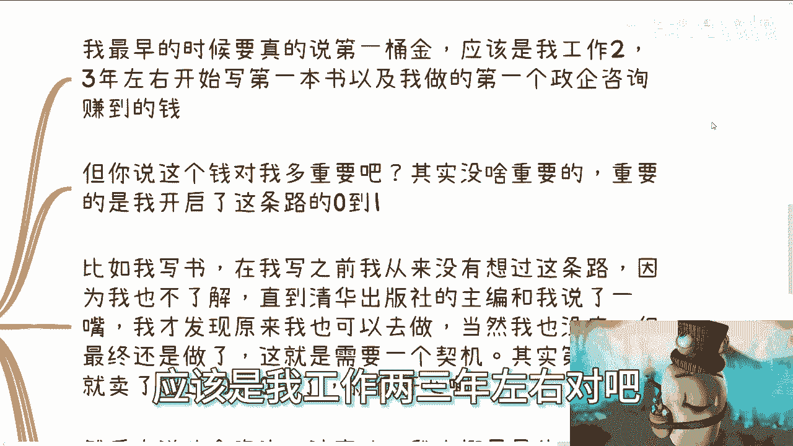

# 我们来说说第一桶金到底是什么吧---P1---赏味不足---BV1Lw411u7RK

在本节课中，我们将要学习“第一桶金”这一概念的真正含义，并澄清关于赚钱与投入的常见误解。我们将探讨过去与现在“第一桶金”的不同，并理解在现代社会，什么才是持续赚钱的核心。

---

许多人关心“第一桶金”这个概念，每个人都绕不过去。

很多人关心第一桶金，是因为大部分人认为赚钱必须先投入金钱。没有金钱投入就赚不到钱。这是一个巨大的陷阱。赚钱需要投入的是你的时间、精力、模式和头脑，而不是金钱。

为什么会有这么多人这么认为？这也有道理。因为大部分人觉得自己的知识或技能比较虚，所以认为钱才是实在的。投入金钱至少让自己有点底气。

但是仔细想一想，如果投入金钱就能有底气，或者投入金钱就是资本，那么所有人投入金钱就都有资本和底气了。你和别人就没有区别。如果你和别人没有区别，凭什么你能赚钱呢？除了赌博，这没有意义。很多人不是不明白，但没有办法。

赚钱本身与投入金钱没有关系。但为什么大众会有这个想法？

---

上一节我们讨论了赚钱与金钱投入无关，本节中我们来看看大众产生这种想法的原因。

很简单，因为以前的第一桶金和现在的第一桶金不太一样。

以前为什么在乎第一桶金？因为大家没有钱，以前没有现在这么多零散的机会。但以前的机会是真正的机会，是能让你翻身、四两拨千斤的机会。现在的机会很多是外快、散钱。

其次，以前我们常说“暴发户”。因为以前很多项目确实需要金钱投入。而且以前的项目是真正的项目，大概率投钱进去就能赚到钱。为什么？因为社会在发展，世界在发展中，很多东西是从0到1。你能赚到钱，不是因为你厉害，仅仅是因为天时地利人和，你有这个机会。

就像我说的，不管什么马云、刘强东，把他们放到现在，他们能成功吗？不能。他们只是天时地利人和选出来、能抓住机会的人而已。在他们赚到钱之前，他们能知道自己会赚到钱吗？没有人是先知。

以前你需要第一桶金去扩张、去拓展。但现在这个时代，赚到所谓的第一桶金难吗？什么叫第一桶金？多少钱算第一桶金？是指副业上能赚到钱，还是先赚到第一个100万？这都不难。

难的是如何高性价比地赚钱，如何持续地赚钱。现在的本质在于关系，在于你能否有很强的社会关系，能否积累下你的客户，能否占据自己的一亩三分地。这才是难的。

---

上一节我们分析了时代变化带来的差异，本节中我们结合实例来探讨“第一桶金”的实际意义。

直播时有人问我第一桶金。我最早的第一桶金，应该是我工作两三年左右，写的第一本书以及做的第一个政企咨询赚到的钱。

这笔钱对我重要吗？没有意义。我当时拿到这笔钱，然后投到股市里了吗？没有。因为我没有这个能力，也没有天时地利人和的机会。所以这钱对我多重要吗？不重要。

重要的是什么？重要的是整个这件事情，为我开启了从0到1的这条路。比如写书，在写之前，我从未想过有这条路。因为我语文从来不及格，也从不了解原来还能出书。我一直觉得出书都是很厉害的人做的事。直到清华大学出版社主编跟我提了一句，我才发现原来我也可以做。

我做之前有底吗？没底。我是先知吗？我能知道这本书写出来能卖多少钱吗？不知道。但最终你得去做。包括申请**书号**、**版号**，包括你要**立项**，你得去写，要一审二审三审。你不做，怎么会知道？我不做这些事情，如何来跟你们讲这些东西？

我听别人讲没有用。所有东西我只关心是什么，要么我参与过，要么我看着别人参与。我听别人讲故事，只当故事听，不会当真。因为这里面水分肯定很多。你只有做了才能明白，道听途说只能是道听途说。做事情需要一个契机。

结果呢？第一年我那本书就卖了超过1万本。我很开心，出版社也很开心，是双赢。但这第一桶金对我重要吗？不重要。这个逻辑、这个模式、这个合作伙伴对我才是重要的。

再来说政企咨询这个事。我最早的一次是四五千一天，当时对我来讲已经很高，因为我第一份工作月薪才500。做了一段时间后，我稳定在差不多1万5到2万块钱一天。我一年可能有2/3的双休日都在外面做。虽然是辛苦钱，但这个辛苦值得。因为性价比高，同时辛苦的过程中还能积累关系。

但这钱对我重要吗？不重要。我要持续发展才是重要的。我要摸清楚他们背后的关系，摸清楚他们背后的逻辑，我能不能持续接单，这才是重要的。那第一桶金四五千对我重要吗？没有用。四五千能活到现在吗？没有用。

---

上一节我们通过个人经历说明了“第一桶金”的象征意义大于实际价值，本节中我们进一步探讨现代社会的赚钱逻辑。

现代社会更是如此。比如评论区说技术很重要，要是没有背景、没有金钱，你需要有技术才能让别人找你合作。这很搞笑。中国满地都是技术，你会的东西别人不会吗？没有用。

技术我笑掉大牙了。这就是最大的误区。第一桶金也是一样的道理。今天就算第一桶金你赚了10万又如何？你除了用这个在自媒体上吸引一些人的眼球以外，还有什么用？就像我之前说的，现代社会赚钱的方式千千万万，第一桶金早就已经不重要了。

重要的是你要摸清楚背后的关系跟逻辑。你一直追求第一桶金，一直被PUA感觉自己要去赚第一桶金。我就算你今天狗屎运赚到了100万，然后呢？没有用。你只要摸不清楚逻辑和积累不了关系，你早晚这点钱是要凭实力亏回去的。

你在赚钱的时候，会很轻飘飘，会觉得要上人生巅峰，迎娶白富美了。但其实没有用。所以我一直在讲，你们碰到任何事情，不管是高潮还是低谷，都要把你的时间线拉长。因为你要活一辈子，不是只活这点时间。不是说你赚了100万就不活了。

你要把时间线拉长去思考这件事情。所有的挫折、坎坷、成功其实都不重要。在你回过头看的时候，都是蜻蜓点水。但重要的是什么？重要的是你背后的逻辑，你积累的关系，你做事情得要去摸清楚它的核心，而不是一味追求表面。我今天第一桶金赚100万、赚500万，这都是表面。

---

上一节我们强调了长期思维和核心逻辑的重要性，本节中我们最后对一些常见的逃避想法进行剖析。

还有很多人很搞笑地跟我说，赚到500万就找个小地方躺平了。你口嗨，没问题。你真的赚500万，能有几个人找个小地方躺平？你躺给我看看？口嗨谁不会？

我觉得很多人有这种毛病，就是没有王子的命，却得了一身公子的病。永远要装逼，永远口嗨。我还是那句话，你要装逼、要口嗨，没问题。你有本事用你的装逼跟你的口嗨去赚钱，那是你的真本事。你不要这边杠那边杠，然后在亲戚朋友里炫耀一下，这没有用。

大家既然活着，就活得透彻一点。

---

本节课中我们一起学习了“第一桶金”的本质。我们澄清了赚钱不等于投入金钱的误区，分析了时代变迁下“第一桶金”含义的变化，并通过实例说明，在现代社会，**持续赚钱的核心在于积累关系、摸清逻辑、建立模式，而非追求一次性的金钱数额**。短期的成功或失败都不重要，重要的是拉长时间线，构建属于自己的可持续系统。