# 我们来说说职场和商业上的红黑脸的事儿 - P1 - 赏味不足 - BV1Vi4y1a7e3

啊大家好啊，今天礼拜一哎。

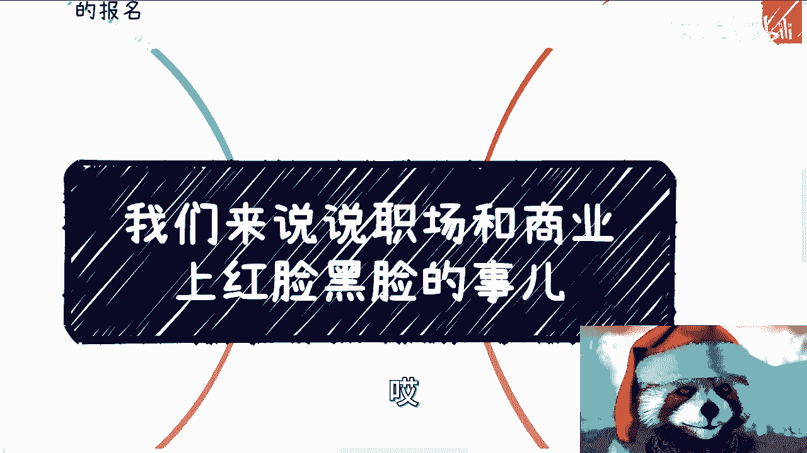

这次我跟你们讲，这次是真的有点感冒了，之前是没有感冒。

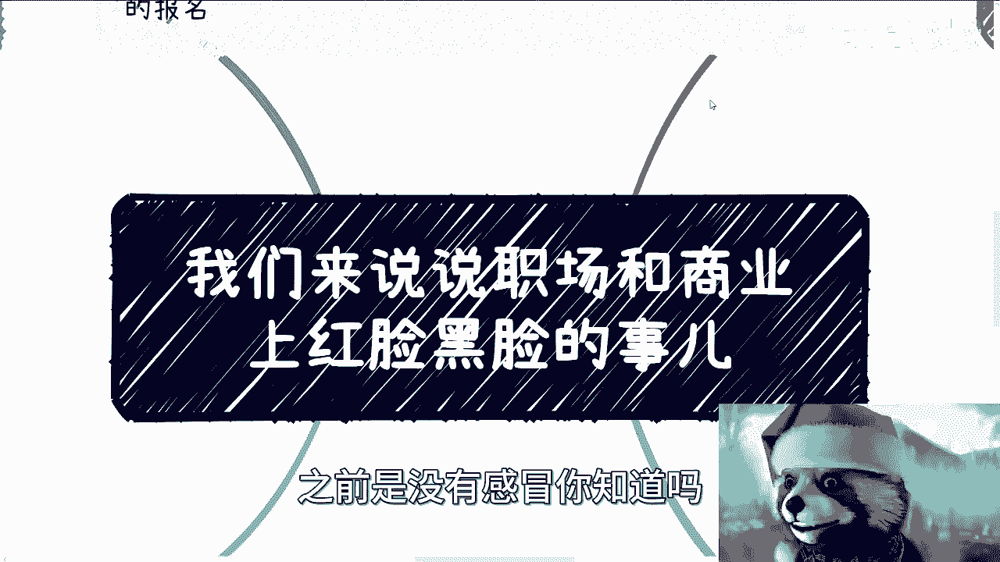

你知道吗，之前就是咳嗽没好，哎妈蛋疼，真的是首先这样子的啊。

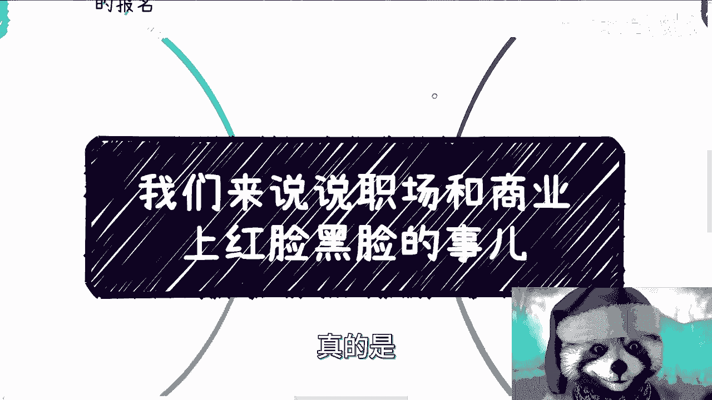

深圳活动已经定了在1月13号的下午，哎，但有一说一啊，我定一个2024年的时间，我都觉得不太真实，哎呀具体具体大家看我动态好吧，报名的话私信我，然后这次场地反正足够大。

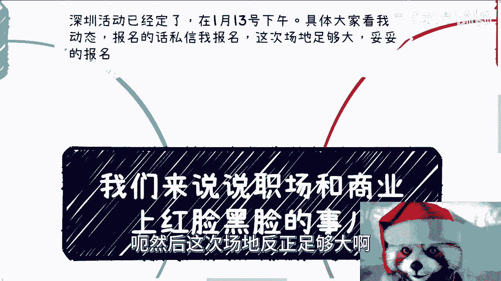

大家报吧，问题不大，嗯这个主题啊，我觉得有些小伙伴呢因为估计看了呢，他就明白怎么回事啊，那有些可能还不太清楚啊，我正好来讲一下，谁给我发这么多消息，我要把声音关了，嗯好啊。

然后呢呃第一个呢就我跟很多人说过。

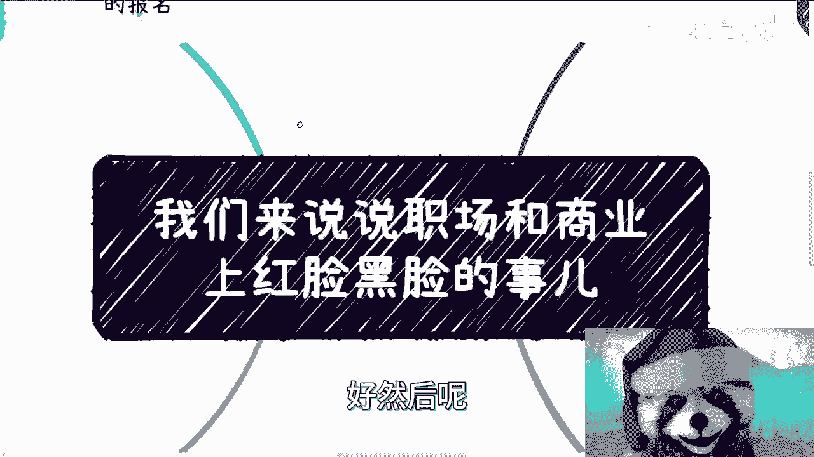

做事情呢一个人往往是做不了的，什么事啊，这里面是两层含义，因为第一个呢就是说，无论在职场还是商业战场上面，你一个人的能量呢肯定是有限的，而且你一个人时间有限对吧，你一天就24小时，你能怎么折腾呢。

对不对，你而且并且呢你不可能而眼观六路，耳听八方对吧，你但凡能做到对所有的信息都把握得住，那么你是一定需要合作伙伴的，当然这里面还有另外一层意思，就是说很多事情呢不同的场景，不同的切入点呢。

你也需要合作方，不能什么事都你去做，因为一方面你什么事都去做，就等于你什么事都做不精对吧，你会让别人对你的标签，对你的所擅长的东西是混淆的啊，你也会让别人觉得你很low啊，你很low啊。

那么因为毕竟做一些事情呢，能拉起来团队的人啊，能组织资源的人，能明白把每个人放在适合的位置上面，能真正推动视频网站往前走的啊，同时能够让利益最大化的人，他其实最有价值啊。

而不是说像我们从小到大一直被PV出来说啊，你要多能干对吧，你要多能表现对吧，你要都怎么样没有用啊，真没有用，因为什么，因为我们太渺小了啊，你也许很聪明，你也许智商很高，但是你再能干。

你一个人也是没有用的对吧，你就像马斯克一样的道理，你就算造火箭，你一个人能造吗，你需要资本吧对吧，你也需要合伙人吧对吧，最早期配票创始人时候一个人吗对吧，不可能的，大家以后可以分道扬镳对吧。

因为天下没有这个不散的宴席，这无所谓对吧，但是一个人都终终究得要对自己，一个人得要有点逼数啊，当然啊嗯我们不得不说的就是PUA，别人或者PUA员工的时候呢，我们也经常说红脸黑脸，为什么。

因为这就是人性啊，这就好像就是说比如说今天我让你加一个群，如果这群里面对吧，只有三个人，你加进来第三个人你就会觉得卧槽，我是个韭菜对吧，但是如果这个群加进去500个人呢，也许498个人都是机器人或者托。

但是你就会觉得卧槽，我他妈很幸运，我是最后一名幸运儿，那怎么办呢。

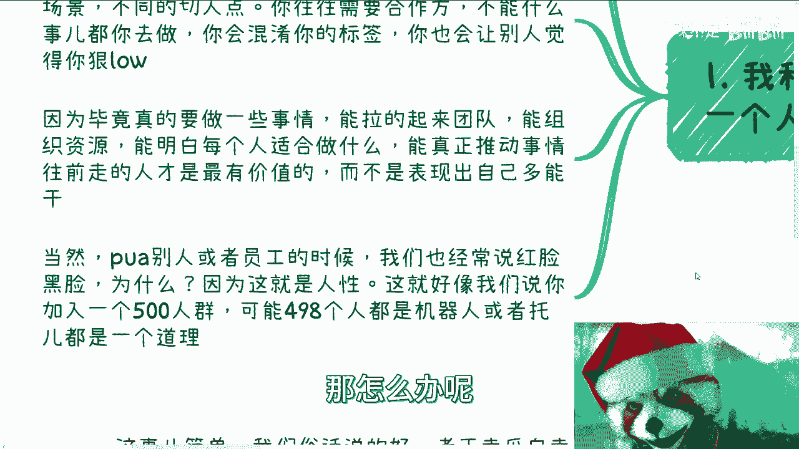

人就这样子啊，对不对啊，哎呀回个消息。

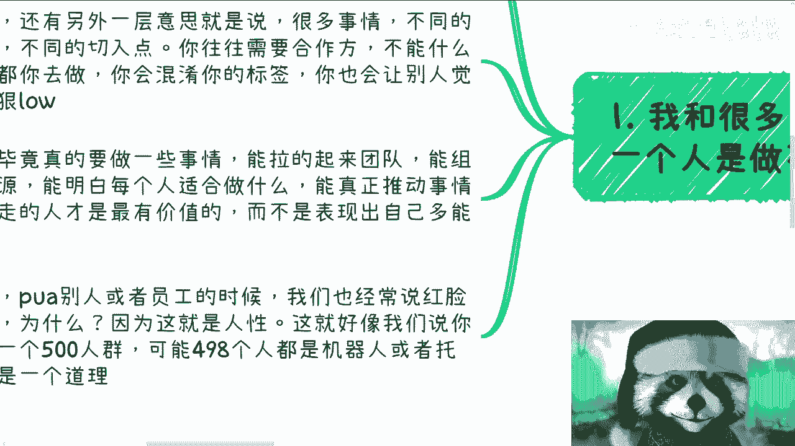

然后我们来说第二点，我们来举个例子，比如说你今天去谈一个业务，你说我也许是赞同的啊，也许是反对的。

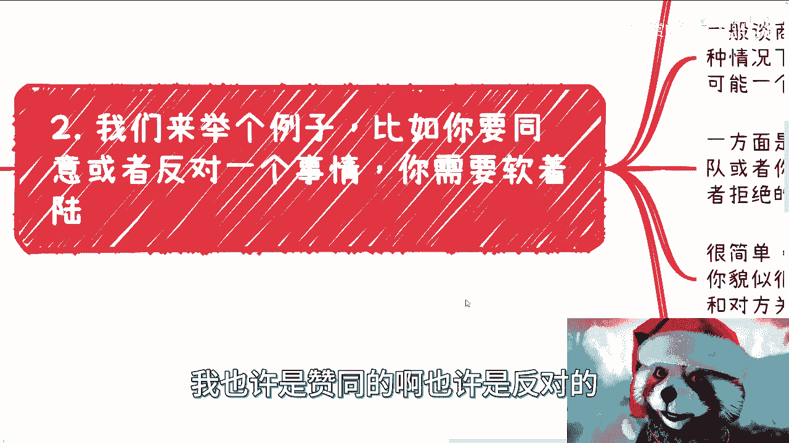

但是呢你在做很多事情时候呢，你是需要软着陆的啊，什么意思啊，就是说无论你今天面对的是散户还是企业端，还是政府端还是大学啊，无论你面对任何一端，就是我们之前说的任何事情都有个拉扯对吧，那么这个问题就来了。

怎么个拉扯法啊。

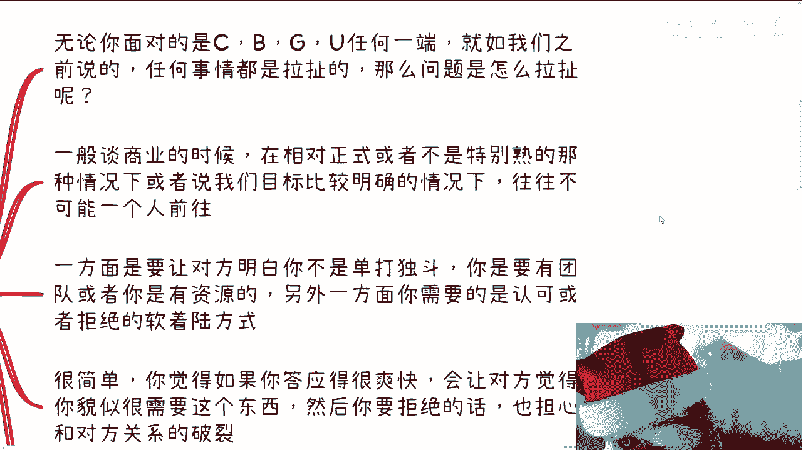

一般谈商业的时候，在相对证实或者不是特别熟的那种情况下面啊，呃我们出去谈业务，一般来讲啊不太会单独一个人去谈。

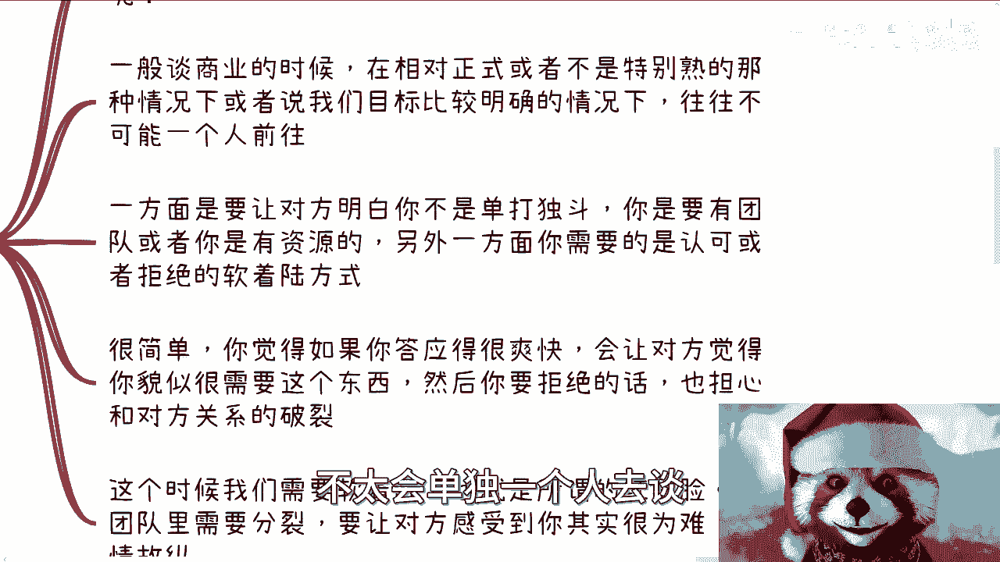

你都是需要有团队或者你是有资源的啊，那么另外一方面呢，你也需要你也需要就是说认可啊，就是将你的认可或者说拒绝的这个方式。

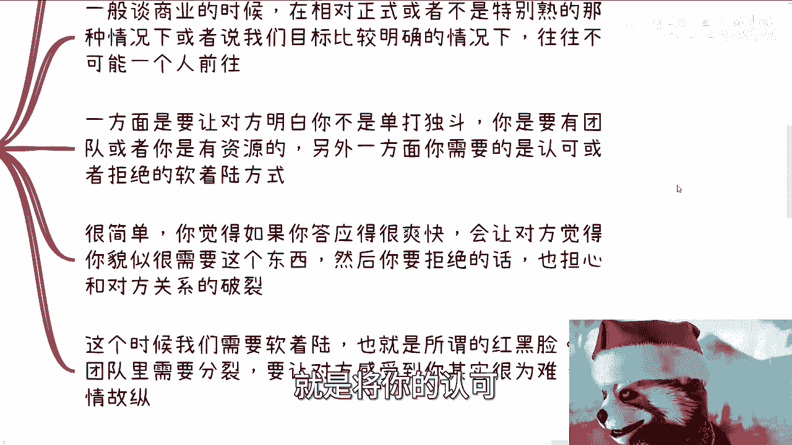

进行一个软着陆啊，因为很简单，你比如说你说今天我跟你谈个东西啊。

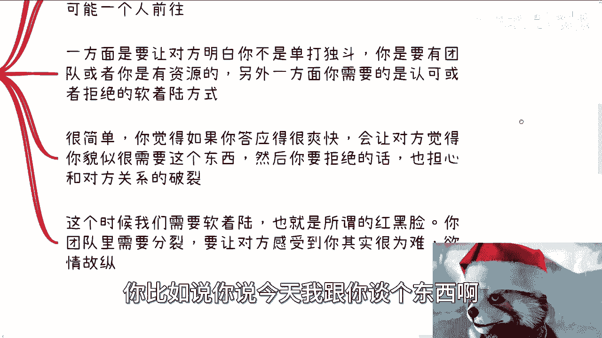

你可以很爽快的答应，但是呢你会就我相信，有一定这种叫什么经验的人，他可能会觉得哎我答应的太快，会不会让对方觉得我很好拿捏，对吧啊，是不是让对方觉得我是个软柿子啊，然后呢你要说这个这个这个你拒绝的话对吧。

又担心说你跟对方关系破裂，那怎么办呢对吧，你总不能因为说哦我就担心怎么样怎么样，我本来是拒绝的，那现在我接受了啊，也不能因为怎么样，我现在我原本是接受的。

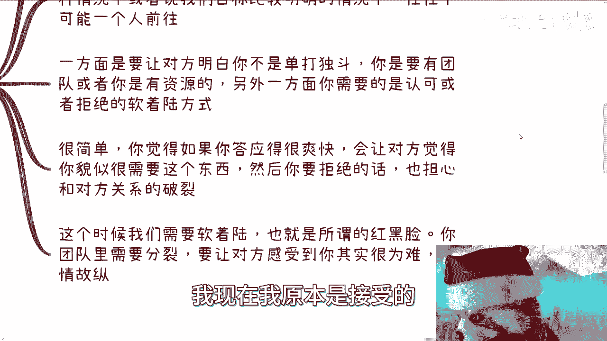

现在拒绝了，那这个不符合你的初心啊对啊，那么这个时候呢我们就需要软着陆啊，所谓软着陆就是所谓的红黑脸对吧，也就是说你要的是你的团队进行分裂啊，进行内部分裂，而要让对方感觉到你是很为难啊。

欲擒故纵怎么办呢对吧，就这么个逻辑，就是说你如果想答应啊，你答应你把锅给别人对吧，你让你的合伙人背锅，你合伙人就是个黑脸对吧，就是我就不同意，我觉得他妈的不好动对吧，最好越激烈越好。

因为越激烈会让对方觉得你站在对方这边。

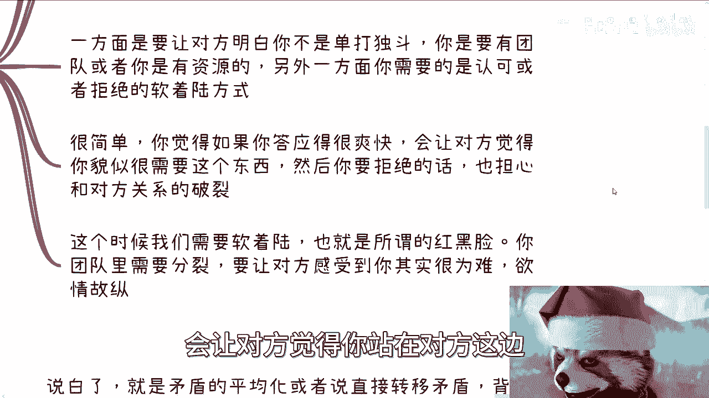

会让对方对你的好感倍增啊，对不对。

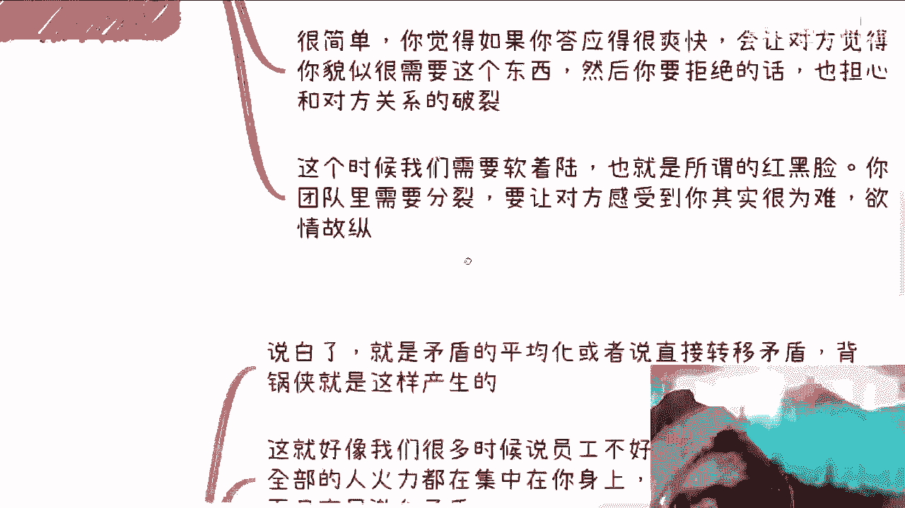

第三啊在职场里面也是这样子的，说白了就是矛盾的一种均化，或者说直接的一种转移矛盾啊。

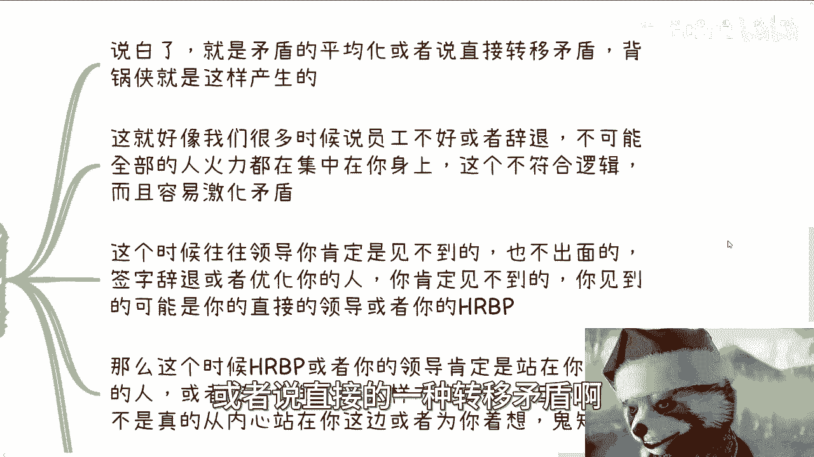

背锅侠就是这么来的呃，这就好像我们很多时候说员工不好，或者要辞退啊，你想看啊，从上大老板到直接的领导，到到你的小leader，到HIPP，难道所有的人把火力火力集中在你身上吗，不合适吧对吧。

因为你想想火力集中在你身上，一方面对你情绪，对你的心理造成很不好的影响，第二方面是对企业也没有好处啊对吧，企业的目标是什么，把你优化掉，你滚就可以了对吧，而且你要乖乖的滚，你别给我出什么乱子，对不对。

那他越是激发你的矛盾，对他有什么好处呢，对不对，嗯好啊。

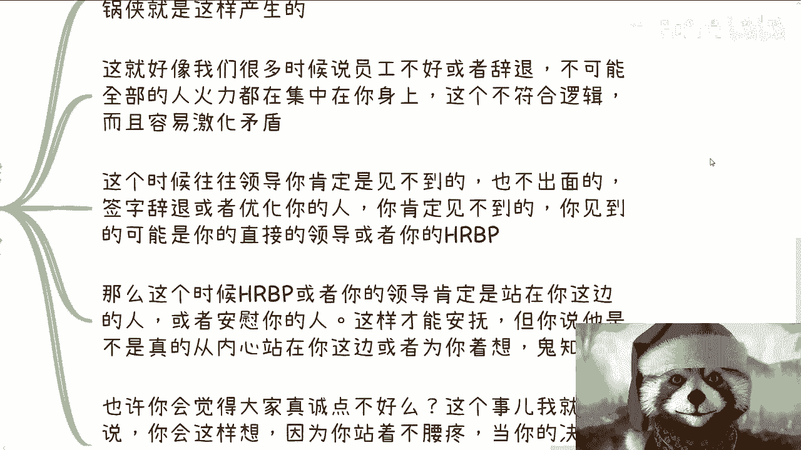

这个时候呢领导肯定会就大领导签字的，这个人他一定是不出面的对吧，你也见不到，那么你见到的可能是你的直系直系领导，或者你的hr BP，那这个时候很简单，H2BP或者你的领导。

他但凡这当中总有一个人是站在你身边的，或者安慰你的人，为什么，因为你这样才能中和你的情绪啊对吧，这样才能安抚啊啊，然后你说哎我就他是不是真的从内心站在内心，站在你这边，或者为你着想的，Who care。

对不对，我就说who care对吧，而且另外一方面很多人他是当局者迷对吧，你说你现在听我这么讲，你也许是明白的，但是当你是咳咳，当你是这个人的时候，身边有个人安慰你，你肯定会觉得他真心点，为什么。

因为人性就是这样子对吧，你的label还没有高到，能够跳出自己所在的情绪，和所在的这个这个这个角色来，从全局来看，你不行啊，好那我们说到这，也许有些小伙伴就要说了，大家真诚点不好吗对吧。

大家直接点不好吗对吧，那大家非要搞这些有的没的干嘛呢对吧，多此一举是吧，好我就这么跟你讲啊，这个事儿我就这么告诉你，你会这样想，是因为你站着说话不腰疼，什么意思，也就是说当你是那个签字的领导的时候。

你毕竟你必须会从全局去考虑，你全局去考虑之后得出一个最大的结论是什么，就是双管齐下对吧，就是既严厉的批评，既严厉的优化，又要安抚对吧，恩威并用，以前有个词叫恩威并用，为什么，因为只有这样子。

你才是做的最稳的，你你才是最最非常的稳定的这么一个状态，并且同时没有风险对吧，你说我不会的啊，我他妈就是个真诚人，那我告诉你不好意思，你永远走不到那个位置上，就这么简单好吧。

所以说呢我觉得如果你能做到那个位置上，你也许比我说的更不真诚好，那么最后来讲这个太low的事情。

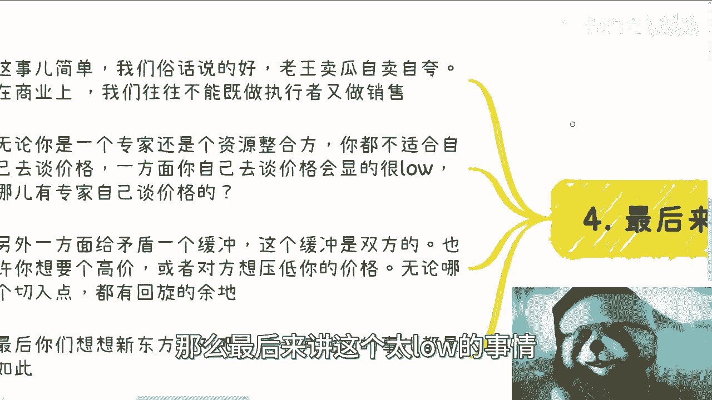

这个事也简单啊，我们俗话说得好，老王卖瓜自卖自夸啊，在商业上呢，你大概率啊你不能既做执行者又做销售啊，你也说不能既做裁判员，也做运动员，什么意思呢，就是说无论你今天是一个专家的角色。

还是一个资源整合的角色，你一定是希望自己能够越做越大，越做越高的，对不对好，那么你想想看啊，你既然想越做越大，越做越高，那么你就不适合自己去谈价格对吧，一方面你自己去谈价格会显得很low啊。

你说哪有价格是自己专家跑出去谈的有吗，你不得招个助理吗，你们有助理搂成包搂成狗了对吧，另外一方面就是你要给一个矛盾的缓冲，什么意思啊，就是说，也许想谈个高价，想去割对方啊，或者说对方想压低价格。

想白嫖你，这个都是双方正常的思维对吧，那么无论哪种切入点，你都需要中间一个缓冲带吧，对吧，你否则你怎么跟人家谈啊，你你说你作为一个专家或者你作为什么样子，我觉得大概率大部分的人啊。

他也许在专业能力上面是有能力的，但是他不会谈价格，他一旦跟别人去谈价格，就会被别人压着打对吧，本来一个比如说5万块钱单子，直接可以压到1万块钱，为什么就因为他懦弱对吧，他不会弹别人说什么。

他就觉得啊行行行行行啊，做就可以了对吧，或者怎么样子，这叫什么，这不叫，就是就是很多人会觉得这个叫什么叫做啊，我就是希望有个单子对吧，我希望现在做这不对的啊，你知道吗，就是这种让别人压着价格打。

就说白了叫做自己看不起自己，你自己都压着你价格走，那别人更压着你走了，那你以后还怎么做对吧，就我以前就跟你们说过这种类型的人，这种类型团队，但在对方的眼里就是什么，就是一个能够压低价格的团队，外包团队。

为什么，因为对方很清楚啊，你们自己都不知道自己价值价格多少，那他妈就压呗，往死里压，压到哭对吧，压到你不做，因为什么，因为他他拿捏死你，他知道你不会不做的，对不对，好那么你想想最后你们再想想新东方对吧。

再想想新东方最近的事。

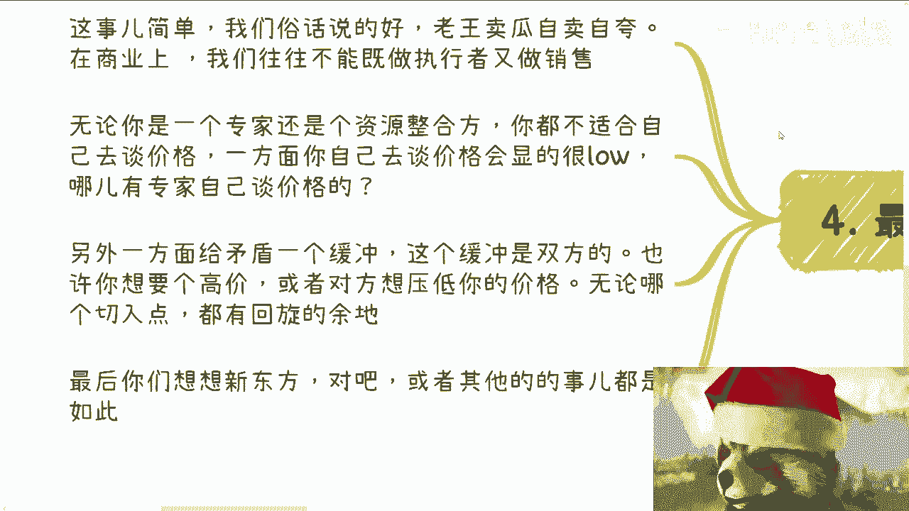

咳咳咳啊，所有的事我跟你讲都一样。

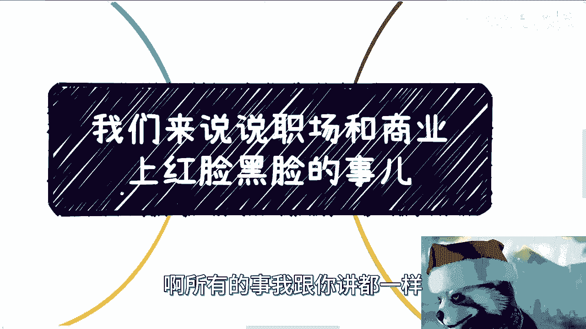

没有什么区别，所以呢这也是为什么，我上一次那个充电视频里面讲的，就是所有网络上的东西，你看看就得了，为什么，因为我们不知道它背后是什么样子的对吧，到底是真实情况就是这样子呢，还是说是他们做戏这样子呢。

还是怎么样子，没人知道，这就像你今天去谈判也是一样的，大家坐在台面上，大家放事情放到台面上来谈，你怎么知道对方怎么样子的，对方可以当着你的面吵的他妈的不可开交，马上就他妈的这公司要解散了对吧，为了什么。

为了博取你的信任，为了能够把这个case做下去，为了能够以更高的价格谈这个case，有什么不行，对不对，一个道理，那么你还是我回到刚刚那个问题啊，如果你觉得哎呀好复杂，哎呀，我们为什么要这样子哎呀。

怎么样怎么样怎么样怎么样都可以啊，我就告诉你。

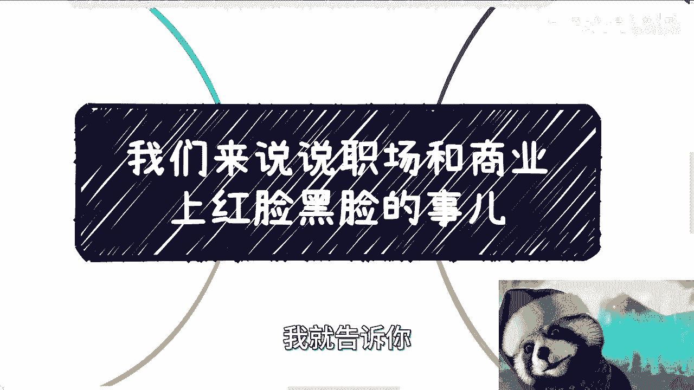

你越是这么想，你以后就别赚钱，你赚不到钱，没有办法，怎么办呢，你跟我说，你是个你是个个体啊，你是一个怎么样，你要改变时间，让你去改变对吧，你要觉得你改变的，那你去改变，OK那我只能告诉你。

现在的游戏规则是怎么样子的，好吧行啊，那个，活动要报名的，私信我好吧，然后剩下的就是说商业或者发展，或者说规划其他方面，你们想就是聊一聊的对吧，然后你们你们希望我能够协助你们一起规划的，那你们整理好。

然后我们再来咨询，随缘啊。

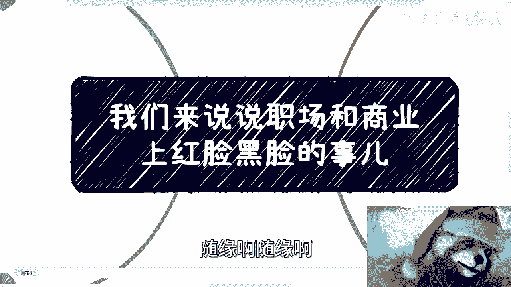