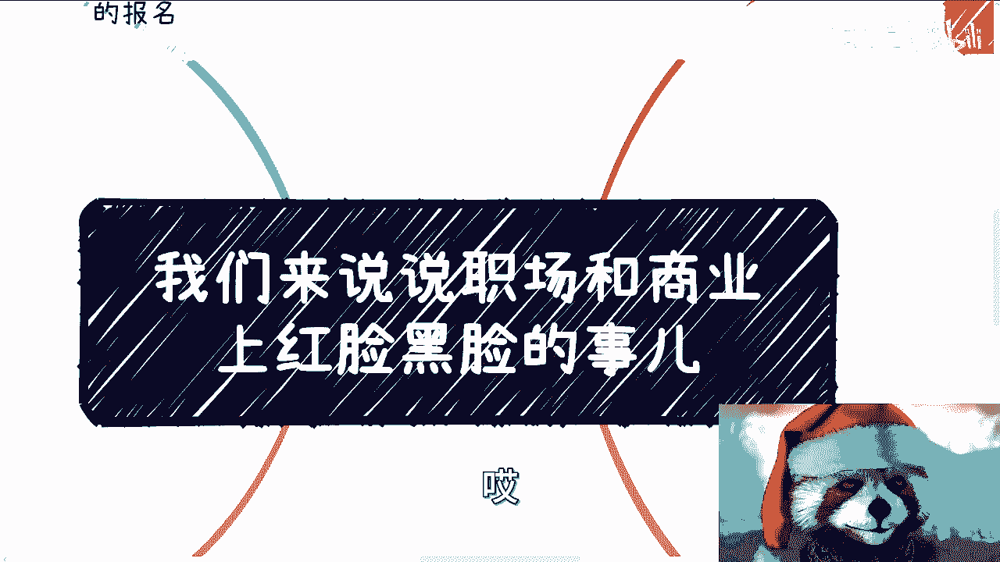
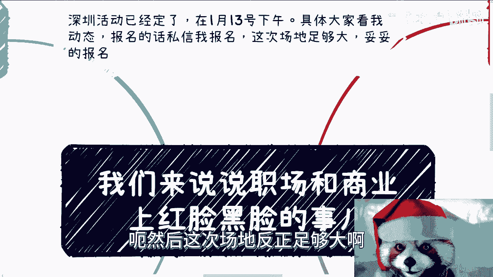
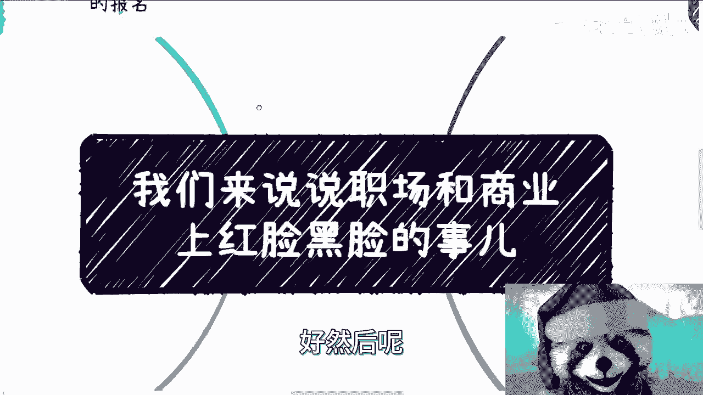
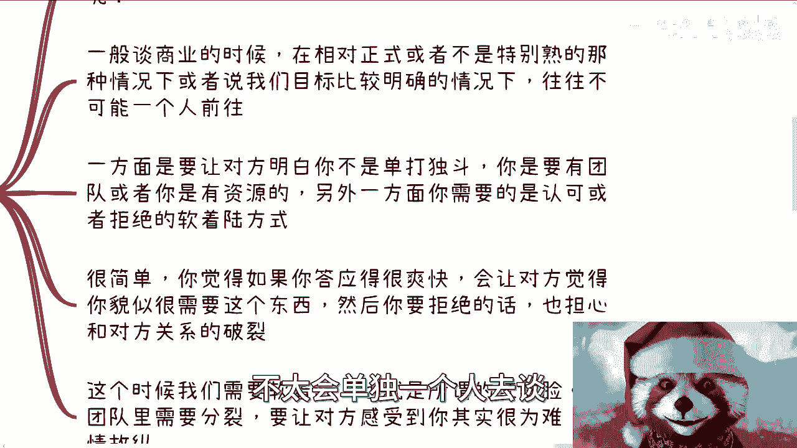
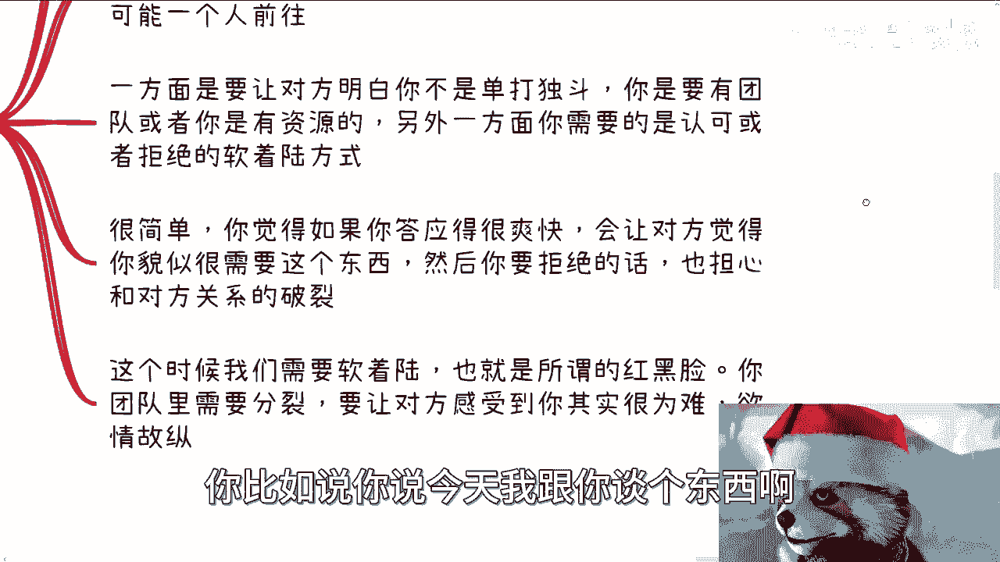
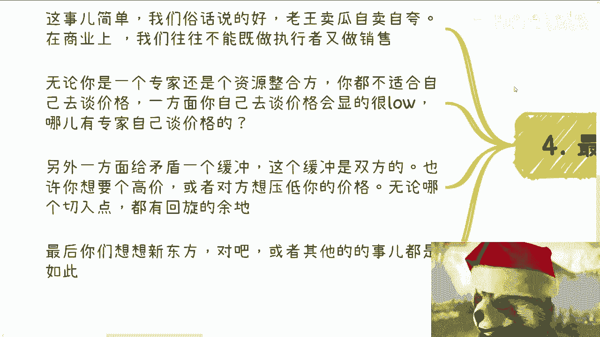
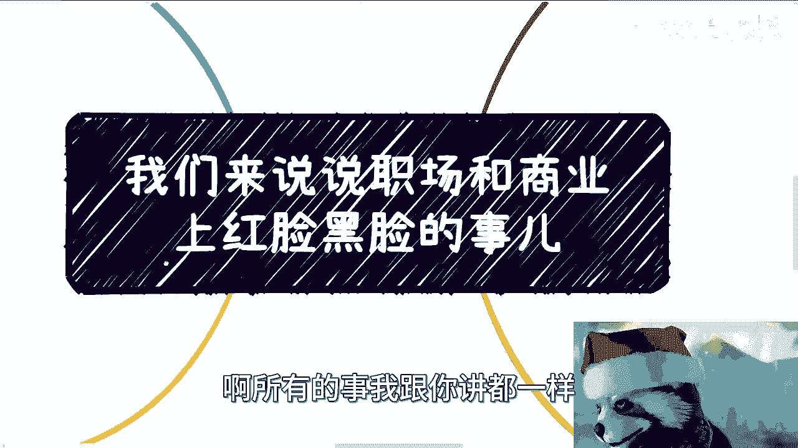

# 我们来说说职场和商业上的红黑脸的事儿---P1---赏味不足---BV1Vi4y1a7e3




在本节课中，我们将要学习职场与商业中一种常见且重要的策略——“红黑脸”策略。我们将探讨其背后的逻辑、应用场景以及如何在实际中运用它来达成目标。



---



## 概述：为什么需要红黑脸策略？

在职场和商业活动中，一个人的能量和时间是有限的。你无法做到面面俱到，也不可能精通所有事情。因此，合作与团队协作是必然选择。红黑脸策略正是团队协作中一种高效的分工与沟通方式，其核心在于通过角色扮演，实现目标并管理各方关系。

---

## 第一点：个人力量的局限性与合作的价值

上一节我们介绍了课程的整体方向，本节中我们来看看红黑脸策略存在的根本原因。

无论在职场上还是在商业战场上，个人的能量都是有限的。你一天只有24小时，无法做到眼观六路、耳听八方。要把握所有信息并推动事情前进，你必须依赖合作伙伴。

此外，不同场景和切入点也需要不同的合作方。如果你试图包揽所有事情，结果往往是每件事都做不精。这会让别人对你的专业标签产生混淆，甚至可能让人觉得你的层次不高。


真正有价值的人，是那些能够组织资源、知人善任、推动项目前进并使团队利益最大化的人。这并非我们从小被灌输的“个人要多么能干”的观念，因为个人的力量在复杂系统中是渺小的。


**核心公式**：
```
个人价值 ≠ 个人能力
个人价值 = 组织资源 + 知人善任 + 推动项目 + 利益最大化
```

就像马斯克造火箭，他一个人无法完成，需要资本和合伙人。早期的PayPal也不是一个人创立的。合作是必然，即便未来可能分道扬镳。




---


## 第二点：商业谈判中的软着陆与角色分配



理解了合作的必要性后，我们来看看红黑脸策略在具体场景中的应用，例如商业谈判。

在商业谈判中，无论是表示赞同还是反对，你常常需要一个“软着陆”的过程。这意味着你不能将态度表达得过于直接或生硬，以免破坏关系或让自己陷入被动。


以下是谈判中常见的困境及解决方案：

*   **困境一：答应得太快**。担心对方觉得你好拿捏，是个软柿子。
*   **困境二：拒绝得太直接**。担心导致双方关系破裂。


这时，“红黑脸”策略就派上了用场。其本质是**团队内部进行角色分工**，让对方感觉到你的“为难”，从而实现“欲擒故纵”的效果。


**核心操作逻辑（代码描述）**：
```python
# 假设你想最终“同意”某个提案
def negotiation_strategy(proposal):
    # 你的角色：红脸 (Good Cop)
    you = “表示理解与倾向同意”
    # 你的合伙人角色：黑脸 (Bad Cop)
    partner = “激烈反对，提出各种困难”
    # 过程：内部“分裂”，激烈争论
    internal_debate(you, partner)
    # 结果：你“艰难地说服”合伙人，最终同意
    outcome = you_persuade(partner, proposal)
    return outcome # 返回：达成合作，且对方对你倍增好感
```

通过让合伙人扮演“黑脸”激烈反对，你作为“红脸”最终说服团队同意，会让对方觉得你站在他们那边，从而大幅提升对你的好感。


---

## 第三点：职场管理中的矛盾转移与情绪安抚

红黑脸策略不仅用于对外谈判，在对内的职场管理中同样常见，其核心是**矛盾的均化与转移**。

以优化（辞退）员工为例。公司的目标是让员工离开，且过程平稳，不出乱子。如果所有管理层都将火力集中在该员工身上，不仅对其心理造成巨大打击，也可能激化矛盾，对公司无益。

因此，流程往往是这样的：
1.  **决策者（大领导）**：不出面，是最终签字的人。
2.  **执行者（直系领导或HRBP）**：出面传达决定，扮演“黑脸”或中立角色。
3.  **安抚者（另一领导或HRBP）**：扮演“红脸”，表示理解与安慰，中和员工情绪。

**核心目的**：通过“红脸”的安抚，让员工情绪平稳，接受现实，顺利过渡。至于安抚者是否真心，并不重要。因为人在当局时，很容易因为得到安慰而产生信任感，这是人性使然。


有人可能会问：大家真诚点、直接点不好吗？何必多此一举？答案是：当你处于决策者位置，必须全局考虑时，你会发现“恩威并用”（红黑脸结合）是**风险最低、最稳妥**的方式。纯粹的“真诚”在复杂的管理情境中往往难以推行。

---

## 第四点：避免显得“很low”与建立价值缓冲带

最后，我们来谈谈为什么红黑脸策略能帮助你避免显得“很low”，并建立价值缓冲。

俗话说“老王卖瓜，自卖自夸”。在商业中，你很难同时做好“执行者/专家”和“销售/谈判者”两个角色。这就像不能既当裁判员又当运动员。

如果你想提升自己的专业形象和价值，就不适合亲自去讨价还价。原因有二：
1.  **显得很low**：专家亲自谈价，会自降身价。
2.  **缺乏缓冲**：谈判中，对方想压价，你想抬价，这是正常博弈。如果没有中间缓冲带（即“黑脸”角色），你很容易被对方压着打。

**反面案例**：一个团队如果总被客户压价，在客户眼中就会沦为“可以随意压价的外包团队”。因为对方看准了你不知道自己价值几何，或者不敢坚持价值。这本质上是自我贬低。





**现实应用**：无论是新东方的案例，还是任何网络热点，其背后都可能存在我们看不到的“角色扮演”和策略安排。台面上的争吵、分裂，可能是为了博取信任或争取更高利益的表演。如果你觉得这些太复杂、不真诚，那么你可能很难在现有的商业游戏规则中赚到钱。

---

## 总结


本节课中我们一起学习了“红黑脸”策略在职场与商业中的应用：

1.  **根源**：源于个人力量的局限，强调合作与分工的价值。
2.  **对外谈判**：通过团队内部分饰“红脸”（赞同/安抚）和“黑脸”（反对/施压）角色，实现目标的“软着陆”，并提升对方好感。
3.  **对内管理**：在如员工优化等敏感事件中，通过角色分工转移和均化矛盾，确保过程平稳，降低风险。
4.  **价值维护**：避免专家亲自谈价而自降身价，通过建立缓冲带来维护自身价值和谈判地位。


这是一种基于人性和博弈论的实用策略，理解并善用它将有助于你在复杂的职场和商业环境中更有效地达成目标。