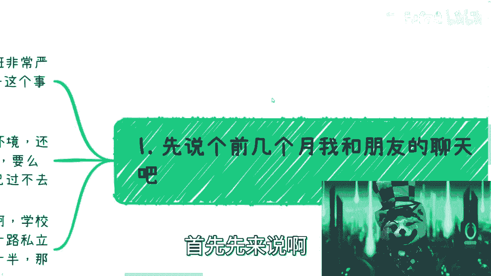
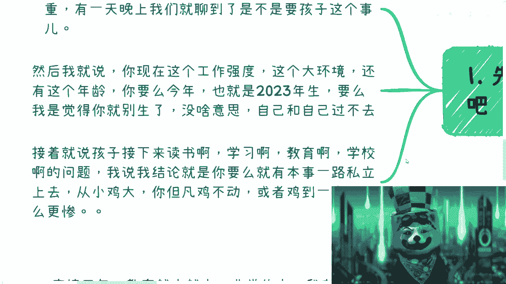
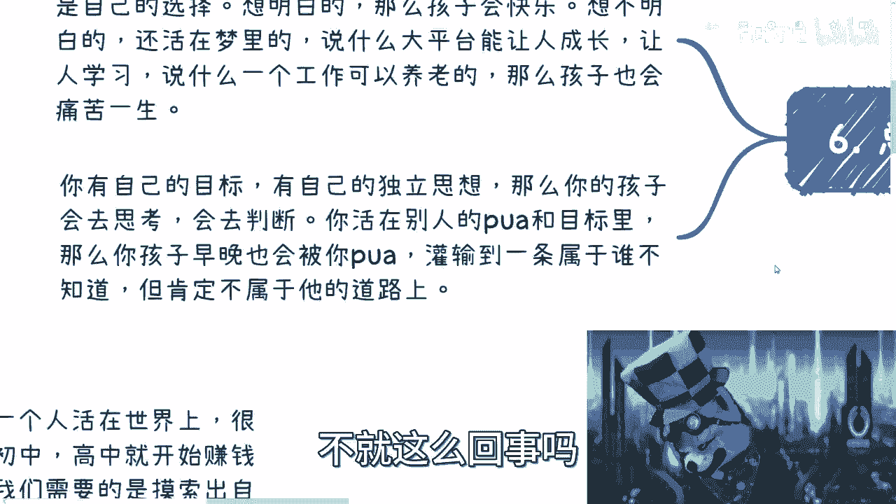

# 我们来谈谈“鸡娃”这件事情 - P1 - 赏味不足 - BV1vg4y1P73D

啊这个小伙伴啊，前两天这个私信我跟我说了一下。

这个鸡娃这个事情是吧，我主要是我思考了一下这个东西呢，我往哪个合集里面放，我想了一想呢，嗯啊还是往这个这个新的这个合集里面放吧。

啊呃首先呢是这样子的啊，当然要不要娃怎么养对吧，怎么个家庭教育，这个不在我们本次讨论范围里面啊。

呃而且呢就现在整个这个年轻人的趋势对吧。

就像我们这两天说考研这个事情一样啊，就现在年轻人的这些认知啊。

我对这个未来孩子还还有社会发展很是担忧啊。

对首先先来说这样子啊，首先先来说啊。

前几个月我跟我朋友聊天啊，这么一个故事啊，啊我有个朋友呢30岁了啊，就做开发，加班呢非常严重，虽然他再加外企啊，呃有一天晚上呢我们就聊到了，说他他他就在说嘛，要不要孩子这个事啊，然后呢我就跟他这么讲。

我说你现在这个工作强度啊，还有整个这个大的环境，还有你现在这个年龄啊，你要么就今年2023年，你要么生，要么我觉得你就别生了，你以后就别升了对吧，没什么好升的对吧，如果说你整体这个情况。

就自己跟自己过不去对吧。

我觉得你30岁这个情况在家，现在整个这个教育情况就临界点了，就是对吧，那接着接着说呢，他就在说嘛，说这个孩子生下来之后对吧，要读书对吧，要学习要教育啊，那么就要去买房子对吧。

那这个买房子呢这个学区房就得考虑对吧，那个在上海反正又贵嘛啊，然后我就跟他说嘛，我说了半天啊，然后我说我这个结论呢，我说就这么回事啊，就是你要么有本事，你就一路私立上去啊，就从小就开始私立幼儿园。

就开始私立托儿所，就开始私私立啊，一路私立上去对吧，然后你从小记到大，你但凡击不动的啊，或者你积到一半的，我跟你讲，那更惨啊，就是我说的这个什么意思呢，就是说你要么就别急对吧，你要是去积累啊。

但凡你说你原本没这个本事去记的，你非要去记对吧，那我跟你讲这个事情哎呀都出现过，你知道吗，就哎这个社会上这种事情多的是啊啊，我们来看啊。

这个鸡娃本身，我觉得呢其实跟这个当然啊，我觉得跟这个b站上的小伙伴，离的可能还有点远啊，这个其实呢跟996007差不多啊，什么意思呢，就是说这个词儿哦，还有这个内容。

我觉得呢其实是应该让人民群众去警醒的啊，但是呢现在这个词说着说着呢，你会发现很神奇对吧，到了很多地方就变成褒义词了，也不是不好意思，我就变成大家诶，这好像也没有什么不好嘛对吧，这使劲鸡你知道吗啊。

那么我们来讲啊，你比如说首先啊以前这个互联网公司啊，其实现在互联网公司也这样，老板一直在pua啊，什么pv呢，就说人家微软怎么样怎么样啊，人家这个腾讯阿里怎么样怎么样对吧，人家google怎么样怎么样。

我们呢这个不如人家啊，我们也要更加努力，所以我们要加班啊，但是没有加班费对吧，巴拉巴拉巴拉啊，嗯我跟你们讲，你们往后看啊，就按照目前这个卷的样子，就目前这么一个人数的样子往后去卷。

反正早晚你们都卷卷都得卷成这样子的对吧，我之前有个视频就说的很清楚是什么呢，就是最终把我们卷死了，其实是我们自己卷吧，啊没关系，这个早晚都是要自己付出代价的，我跟你讲啊，这个孰不知呢，人家我跟你们说啊。

就很多人这么讲，但殊不知呢，你说google啊对吧，阿里啊对吧，其他公司人家有这个实力对吧，人家也有这个能力，人人家是有整个上下文的，是有一个发展周期的对吧，但中国的企业家呢就知道无脑模仿，你知道吧。

这背后其实就是攀比，就别再这样了，我们也要这样，那为什么要这样，不管啊，不重要，反正就要这样啊，你管他这样，我说我他妈作为你老板，我说了算对吧，就这个意思啊，那鸡娃这个事情呢。

我觉得本质上跟996007啊，这种事情其实大差不差的啊，就是说本质上呢有的人是填补自己的遗憾啊，比如说自己感情不顺啊，非要让孩子结婚，结的很早对吧，或者你就不停的给我相亲，反正你必须给我结啊，不结你家。

你家门别回，对吧啊啊，不管喜不喜欢，反正你就去你你就得结，啊那么第二个呢就是说这个，啊这个第二个呢就是在说这个学历不高是吧，那有些人还在说啊，这个自己学历不高，工作不好啊，那就强迫自己孩子对吧。

这个必须学好啊，必须往往好了卷啊，你不往好里卷，反正就是就各各种骂对吧，各种pv啊，反正就是你不行啊，这不就是现状吗，是吧嗯还有就是自己喜欢某个领域呢，以前可能没有机会做好对吧。

非要让自己的孩子去这个领域对吧，比如说有些学法的，学医的对吧，学教数学的对吧啊非要学，反正往死里学啊，你喜不喜欢我不重要啊，不关心，反正就是学啊，等一下啊，好然后呢这个还有说什么呢，当然这只是一部分啊。

这个从小从小呢在这个家庭里面开始，就是无脑的这个电池养成啊，然后最后呢其实苦的还是孩子对吧，明明一一代人的执念也不叫一代人的执念吧，一代人的遗憾，一代人的莫名其妙的被pua成电池，人的这种感觉对吧。

非要变成两代人甚至更多啊，为什么呢，因为你你去pua你的孩子，就跟你现在被你家长pua是一样的对吧，你你慢慢慢慢还是那句话，你要么就是成为别人的电池，你要么就是会去啃老，就很多东西会反噬到自己身上。

都是一样的，你知道吗，那很多年轻人教，因此这个因此应的是什么，就是因为这些无脑袋这个鸡对吧，然后去焦虑，去抑郁对吧，我一直说人活着为了自己活着对吧，得要去思考为什么自己活着，自己到底要什么。

现在能有几个人做得到对吧，不得不说洗脑是很成功啊，真的很成功对吧，然后还有我跟你讲，还有搞笑的呢，就是在跟我说，他说哎呀这个对吧，能有几个人在大学的时候能想得明白，能有几个人怎么样子，何必pua自己呢。

别人想不想的明白跟我们有什么关系啊，关注到自己不就好了吗，啊那照你这么说，他妈的中国这么多普罗大罗大众对吧，这么多老百姓，那他妈卖煎饼的多了，你咋不去卖煎饼，那莫名其妙的真的是对吧啊。

那剩下的呢其实就攀比，攀比这个事呢现在是深入骨髓的啊，你们去看吧，反正就是这个孩子在学校里面，从小开始攀比对吧，当然了，这些东西自然得到了家长的真传对吧，因为家长就在那边攀比啊。

这个社会上也是一样的对吧，动不动就是啊我家里有人对吧，我上面是谁对吧，怎么样怎么样啊，一样的都一样一样的啊，就是说很简单啊，核心的点就在于说什么呢，就是反正自己过得不好啊，我也不希望别人过得好啊。

同样的，你让我关心我自己，我就不想关心我自己，你不用你来关心对吧，我就就喷别人，我就不停的喷就可以了对吧，那你就问这些要去鸡娃的对吧，为啥要了，干嘛他也不管啊，他这意思就是说你看朋友圈啊。

别让孩子去哪里哪里玩对吧，别人孩子干嘛干嘛，学什么什么东西我也得有对吧，别人没有的，我们也得有对吧，反正反正就是这个样子啊，但关关键是什么呢，你有没有这个经济水，平，有没有这个这个能力。

以及你孩子愿不愿意学，他都不管，啊好，然后呢我来给你们解释一下，我给我朋友的这个观点啊，这观点是什么呢，就是疫情3年啊，疫情3年要教育本身是越来越水的啊，因为有很多的这种线上课啊，很多东西啊。

嗯我呢在上海看到的水，别的城市我觉得就跟别人说了啊，肯定更水啊，小子别想，这个不是说优越不优越性的问题，就是中国本身从上到下就这个样子啊，再加上之前的双减对吧，本质上现在学校老师跟以前就完全不一样了啊。

这个老师的教学深度啊也不如以前，当然这个也不仅仅只是9年制义务教育啊，别的都是一样的啊，呃负责呢当然也是不如不如前啊，所谓真正的学习跟教育其实要靠家长啊，那么按照这个逻辑呢，首先你看啊，我跟他讲。

我说我说你要买学区房，是不是，我说看看房子对应的是什么学校啊，区重点市重点啊，怎么样啊，但我说就按照现在这个教育情况来讲呢，我说本质上已经差别不大，为什么呢，因为简单来讲整体的上限都在下降。

下限也在上下降，那么本来你一个上限比较高的对吧，那大家之间距离蛮多的对吧，那你去记一下，我觉得是没毛病的对吧，包括就是说十几年前20多年前对吧，很多人去这个嗯，那个区重点市重点是有道理的对吧。

但是你现在由于大家的下限都下降了对吧，上限也在下降，那么你去一个区重点市重点，你说本质上有这么大的差别吗，有非常大的差别吗，你说有我是我承认的，但你说有非常大的差别吗，这个是要打问号对吧。

啊那么所以呢我觉得在这一代，包括现在的年轻人，很多已经是没有思想的工具人啊，就这么简单啊，呃别来杠啊，工具人来杠，我一律拉黑，没什么好说的，他跟跟跟工具人讲不通对吧，为什么还要让下一代这样子撸。

所以我就跟他说嘛，我说如果你要升呢，你要么就快乐教育对吧，你别去攀比，当然我说我以我对你的了解，你也不会去攀比吧对吧，你别去攀比，别去积对吧，有能力有基础的，你可以让他多接触点信息对吧，多出出国对吧。

或者多去去很多地方旅游，看看外面的世界什么样子，多让他尽早的接触一些商业的东西对吧，有商业的思维，对不对，你否则就别扯了，就结束了，就这么简单，对不对啊，当然了，以上这个是我跟我朋友讲的啊。

没有说对大众说的这个意思，反正仅供参考，啊那么再就来说呢，我一个这个发小哦，他这个鸡娃的例子，家里没有钱啊，很普通啊，自从有了孩子之后呢，非要急啊，而且不是为了未来怎么样，就是为了攀比啊。

俗称打肿脸充胖子，就是攀比啊，然后呢就是不停的借钱啊，欠钱，然后啃老，骗父母的钱，骗父母的房子啊，就是各种骗啊，让害自己的孩子呢从小去读私立穿名牌啊，反正就是笔嘛，就各种笔嘛，那比这个东西大家都知道。

他没有没有没有头的对吧，没有没有底线的这个东西啊，那我以前说这个商业合作时候也提到过，我说其实无论是创业合作，还是说我们去做一些这种轻资产的，这种业务的这种合作，我说尽量嗯不用和千万。

就尽量别去和那些非常缺钱的人合作，为什么呢，因为他们的处境，会让他们失去对事情的判断能力，嗯很容易做出一些很极端的事情，就他们没有自己的判断，他可能都不觉得自己在象牙塔里面，或者他觉得是。

但是他也不愿意改变，反正就那样啊，所以呢这种风险其实是非常高的啊，无论是这个商业上还是日常的这种合作上，都一样啊，当然这个只是客观的描述啊，我没有说对这个穷人有任何的不尊啊，那么同样的啊。

其实这样的人呢也不少，就是自己对社会对世界啊，对很多呃商业啊，他都没有足够的认知对吧，自己都活不下去，那还是个孩子啊，就开始生孩子，然后就开始pua对吧，哎呀那你说对吧，这个不就是重复嘛对吧，循环啊。

嗯呀，啊那么第五点呢我在这个地方就说了，我说很多事情呢其实就是这样不停的重复，不停的重复，不停的重复，你比如就像我们这两天说考研的事情对吧，一个人活在世上，很多人可以走对吧。

但是呢很多人从小就被p u a，他觉得哎我只有这个叫什么考试对吧，读书对吧，然后非要去卷对吧，我为什么考试，为什么读书，我不知道呢，啊我也不想知道对吧，那你请你有什么好说的呢，对吧啊，我就这么跟你们讲。

方法很多很多有人有能力的人，人家自己人家初中高中就开始赚钱了，对吧，和有没有学历没有任何直接的关系对吧，我觉得考不考都可以无所谓啊，你上不上学啊，上不上大学也无所谓对吧，但是我觉得需要的是。

你摸索出自己有擅长的是什么，让自己活出自己的价值对吧，而不是循规蹈矩的是过日子对吧，自己为什么做实验，为什么选择专业，什么都不知道，就听别人的对吧，那很多人还要来杠啊，那照你这么说，高中不要读了。

初中不要读了，小学也不要读了，对不对，那我就说呀，你要有本事想的明白，你可以不读啊，有本事不是没有呀，你读了你想不明白，对不对啊，然后还有很多人很好玩，说什么呢，说考研为了让普通人能够去更高的平台。

看到更多的世界，我跟你们讲，看到个屁哈，看到啥啊，你要看你就直接出去去干对了，冲出去直接想办法赚钱对吧，直接到社会里面去滚，这个才叫看啊，你考研出来打个工，除了逃避，除了继续被pua为自己去找借口。

还能干嘛，对不了，然后呢，我觉得大部分人年龄慢慢大了之后，到结婚了，生孩子了，其实还是不知道自己活着要干什么对吧，还是不知道自己擅长什么，还是不知道自己到底是喜欢什么，不晓得的啊，所谓结婚了生孩子。

其实更多的也像完成家里人的任务对吧，那你自然这种悲哀不就延续到下一代吗，不就是这个样子吗，对吧，我是觉得啊就已经发展到2023年啊，这个很多人还是如此的与迂腐啊，就是让我真的是没有想到的。

我一直是觉得年轻人应该是有活力的，应该有独立思想啊，但是我没想到是这样子，那么总结一下呢，我觉得呢就是鸡娃，这个事情呢跟考研跟选专业对吧，跟996007都是一样的，但本质上都是自己的选择啊。

想明白自己要什么啊，那么你的孩子就会快乐对吧，想不明白还活在梦里的，说什么大平台当能让人成长的对吧，能让人学习的对吧，说什么一个工作可以养老的啊，那么对吧，就这个样子的啊，就是你有自己的目标。

有自己的独立思想，那么我觉得你鸡也好，不羁也好，不重要，就是鸡娃不鸡娃，我觉得这个就跟你我们刚刚说的那些，所有东西都一样，就是没有说鸡娃一定对，或jy一定不对对吧，本质上你要只要有自己的思想。

你会去判断，那我觉得你就算去鸡娃，你也会是一个合理的鸡娃的方式对吧，你也会是一个非常考虑到对方感受的一个，计划的方式对吧，你但凡没有自己独立的想法，你活在别人的p u a的目标里面。

那你去鸡娃也是为了别人鸡娃，你根本不知道你要什么，你也不知道你孩子要什么对吧，那你最终只会把他灌输到一条属于谁，我们不知道，但是肯定不是属于他，也不是属于你的道路上，不就这么回事对吧。

所以说啊我觉得在这地方再强调一下啊，就是所有的内容啊，没有一个东西是一定要这么做，一定不要这么做的啊，但是前提是你得想好，你这么做的目的是什么对吧，你你就像很多人跟我说，我考研我是为了有一个稳定的工作。

那我就问你，你怎么知道能有稳定的工作，稳定在哪，你从何得出这个结论对吧，就你所有东西你都不清楚，然后你就在pua自己说，我想明白了啊，我就为了这个目的，那我就没什么好说的，有什么好说的。

好吧希望这个大家能想明白吧，好吧，这个孩子这个事情呢，我觉得真的就反正对自己负责也是对。

