# 课程：理解“鸡娃”现象与个人选择 🐔👶 - P1

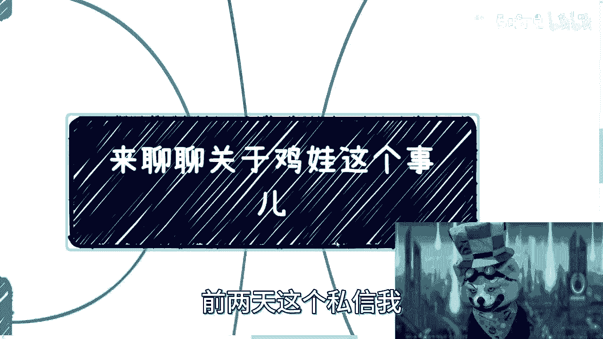

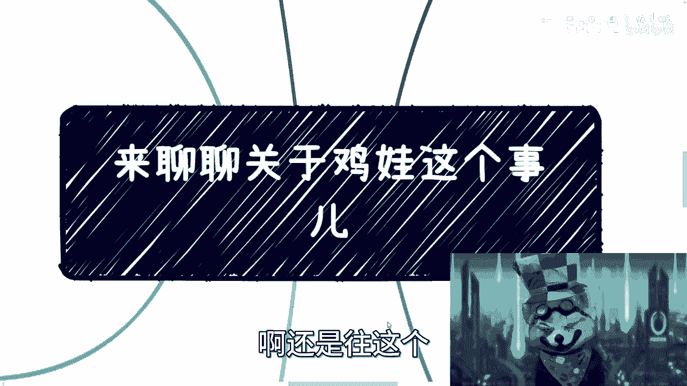

在本节课中，我们将探讨“鸡娃”这一社会现象。我们将分析其背后的动机、与类似社会压力（如996工作制）的共性，并讨论在当今环境下，个人应如何进行独立思考与选择。课程内容基于一段私人对话的反思与延伸。

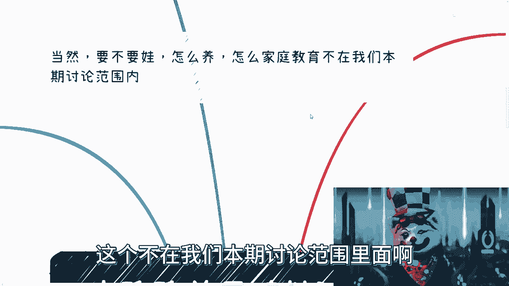

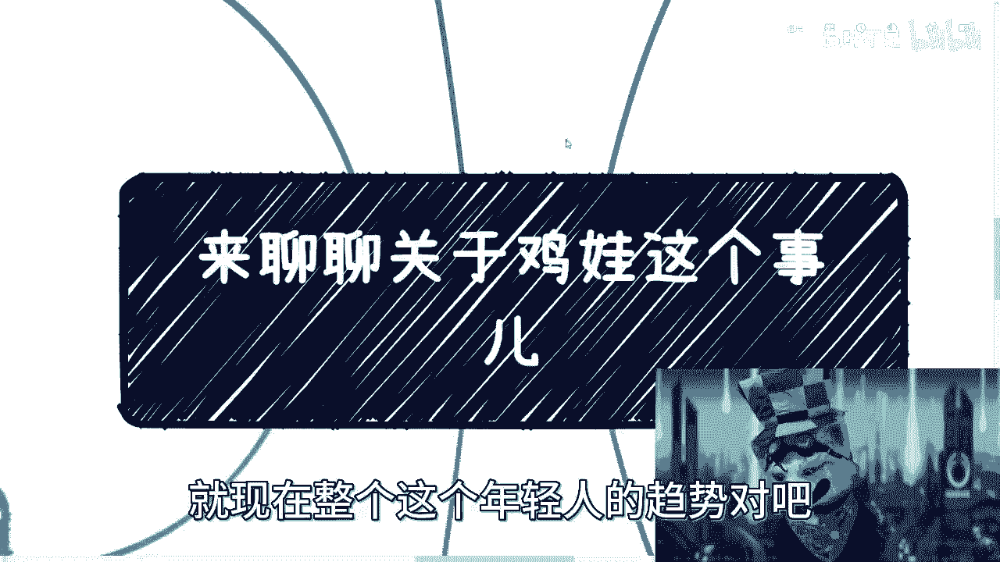

## 课程概述

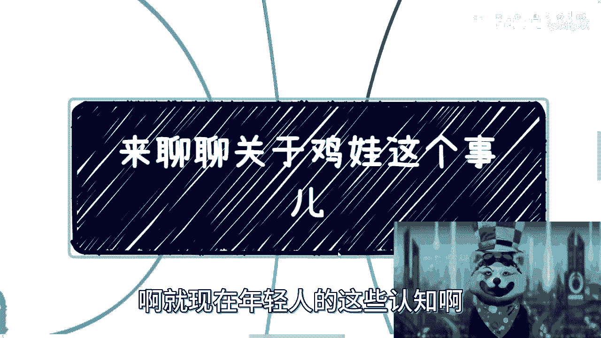

“鸡娃”指的是家长通过密集安排学习、活动等方式，过度激励或逼迫孩子竞争的行为。本节课程将首先通过一个具体的朋友案例引入话题，然后剖析“鸡娃”现象的本质、其背后的社会心理（如攀比、弥补自身遗憾），并最终回归到独立思考与个人选择的核心议题上。

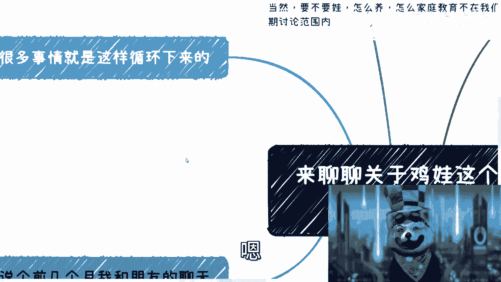

## 从一则对话谈起

前两天，一位朋友通过私信与我交流。经过思考，我决定将关于“鸡娃”的讨论放入一个新的合集。

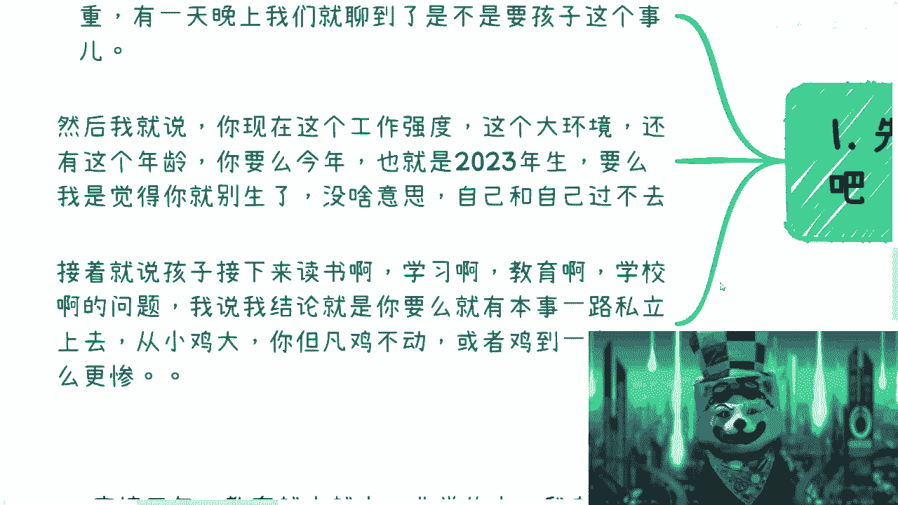

是否要孩子以及如何进行家庭教育，不在本次讨论的范围内。

当前年轻人的整体趋势，如同我们近日讨论考研话题时所观察到的，其认知模式让我对未来孩子的发展乃至社会走向感到担忧。

首先，我想分享几个月前与一位朋友聊天的故事。这位朋友30岁，是一名开发人员，加班非常严重，尽管他在外企工作。某天晚上，我们聊到了是否要孩子的话题。

我对他当时的处境进行了分析：以他的工作强度、所处的大环境以及年龄来看，如果决定要孩子，2023年可能是最后的时机；否则，或许就不该再考虑此事。若不顾自身实际情况强行为之，无异于自我为难。

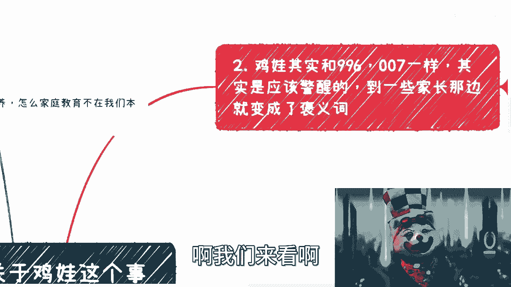

我认为，以他30岁的状况结合当前的教育环境，正处在一个临界点。他接着谈到，孩子出生后需要读书、接受教育，这就涉及到购买学区房的问题，而在上海，学区房价格昂贵。

我与他深入交流后，给出了结论：除非有能力让孩子一路就读私立学校——从私立幼儿园、托儿所开始，直至完成全部学业——即将“鸡娃”进行到底。否则，如果无力持续“鸡娃”或半途而废，情况可能更糟。

我的意思是，要么彻底放弃“鸡娃”，要么就坚持到底。如果原本不具备“鸡娃”的条件却勉强为之，社会上此类悲剧屡见不鲜。

## “鸡娃”的本质：一种社会压力模式

“鸡娃”这个词及其内涵，或许离B站的年轻用户还有些距离。但其本质与“996”、“007”等工作制相似。

这个词及其代表的现象，本应引起大众的警醒。但神奇的是，它在许多语境下逐渐变成了一个中性甚至略带褒义的词，仿佛“拼命鸡娃”也并非不可接受。

我们可以类比来看。以前（现在也如此）互联网公司的老板常进行“PUA”，例如鼓吹微软、腾讯、阿里、谷歌如何优秀，对比自身公司的不足，从而要求员工无偿加班。

按照当前内卷的趋势和人口基数来看，这种状态将持续下去。我之前的一个视频说得很清楚：最终让我们陷入内卷困境的，正是我们自己。这迟早要付出代价。

殊不知，谷歌、阿里等公司拥有相应的实力、能力、完整的发展背景和周期。而许多中国企业家只知无脑模仿，其背后是纯粹的攀比心理——“别人这样，我们也要这样”，至于“为什么这样”则不予深究。老板的意志就是准则。

“鸡娃”这件事，本质上与“996”、“007”大同小异。

## “鸡娃”背后的常见动机

以下是驱动“鸡娃”行为的几种常见心理：

1.  **弥补自身遗憾**：例如自己感情不顺，便强迫孩子早结婚、不停相亲。
2.  **转移自身焦虑**：例如自己学历不高、工作不好，便强迫孩子必须好好学习、拼命内卷，否则便加以责骂或PUA。
3.  **强加个人喜好**：例如自己喜爱某个领域（法律、医学、数学）却未能有所成就，便强迫孩子投身该领域，无论其是否喜欢。
4.  **普遍的攀比心理**：攀比现已深入骨髓。孩子在学校攀比，这往往源于家长的言传身教。社会上也充斥着类似比较。核心在于：自己过得不好，也不愿看到别人过得好；或是逃避关注自身，转而通过批评他人获得存在感。

对于想要“鸡娃”的家长，他们通常不考虑“为什么”——只是看到朋友圈里别人的孩子去了哪里、学了什么，自己也要有，甚至要别人没有的。他们不关心自身的经济水平、实际能力，以及孩子是否愿意学习。

## 对当前教育环境的观察

接下来，我解释一下给那位朋友的观点。疫情三年，教育质量整体在下降，因为线上课程等因素。我在上海的观察如此，其他城市可能更甚。这并非优越感，而是中国的普遍现状。

加之“双减”政策，本质上现在学校的老师与以前完全不同，教学深度和责任心都不如以往。这不仅仅指九年义务教育，其他阶段亦然。真正的学习与教育重任落到了家长肩上。

按照这个逻辑，我对他想买学区房的想法进行了分析。我问他是否查看房子对应的学校（区重点、市重点）。但按照当前的教育情况，本质上差别已不大。因为整体的教育上限在下降，下限也在下降。

过去，区重点、市重点与普通学校差距明显，“鸡娃”或有道理。但现在由于大家的下限都在下降，上限也在降低，区市重点与普通学校的差距是否还有那么大？这需要打一个问号。

因此，我认为这一代人，包括现在的许多年轻人，已经成为没有思想的“工具人”。既然如此，为何还要让下一代重蹈覆辙？

所以我对他说，如果要生孩子，要么选择“快乐教育”，不要攀比，也不要“鸡娃”。以我对他的了解，他也不会去攀比。如果有能力和基础，可以让孩子多接触信息、出国看看、旅游增长见识，或尽早接触商业知识培养商业思维。否则，就算了。

以上是我对朋友的个人建议，仅供参考。

## 一个极端的“鸡娃”案例

我的一位发小，提供了一个极端的“鸡娃”例子。他家里并不富裕，但自从有了孩子，非要“鸡娃”，目的不是为了孩子的未来，纯粹是为了攀比，俗称“打肿脸充胖子”。

为此，他不惜借钱、欠债、啃老，甚至骗取父母的钱和房子，只为让孩子从小读私立、穿名牌。攀比是没有尽头的。

我以前在谈商业合作时提到，尽量避免与非常缺钱的人合作。因为他们的处境会使其失去对事物的判断力，容易做出极端行为。他们可能意识不到自己在象牙塔中，或意识到却不愿改变。这种风险很高，无论是商业还是日常合作。

当然，这只是客观描述。同样，社会上也有不少这样的人：自身对社会、世界、商业缺乏足够认知，自己都难以立足，却早早生孩子并开始PUA下一代。这无疑是一种恶性循环。

## 重复的困境与独立思考的重要性

很多事情就是这样在不停重复。就像我们讨论考研时说的：一个人活在世上本有很多路可走，但许多人从小被PUA，认为只有考试、读书、内卷这一条路。他们不去思考为什么考试、为什么读书。

方法其实很多。有能力的人，初中高中就开始赚钱了，这与学历没有直接关系。考不考研、上不上大学都无所谓。重要的是摸索出自己擅长什么，活出自己的价值，而不是循规蹈矩地过日子。

很多人会反驳：照你这么说，高中、初中、小学都不用读了？我的回答是：如果你有本事想明白，可以不读。但问题是，很多人读了也想不明白。

还有人认为，考研能让普通人登上更高平台、看到更广阔世界。但我想说，看到什么？要想看世界，就应该直接出去闯荡、想办法赚钱、到社会中去历练，那才叫“看世界”。考研后打工，除了逃避现实、继续被PUA和自我安慰，还能做什么？

我认为，大部分人随着年龄增长，结婚生子后，依然不知道自己活着要干什么，不知道自己喜欢和擅长什么。所谓结婚生子，更像完成家庭任务。这种悲哀自然会延续到下一代。

发展到2023年，许多人依然如此迂腐，让我意想不到。我一直认为年轻人应有活力和独立思想。

## 课程总结

本节课我们一起探讨了“鸡娃”现象。

总结来说，“鸡娃”与考研、选专业、996/007等现象一样，本质上都是个人选择。关键在于想明白自己要什么。

如果你的目标是明确的，拥有独立思想，那么无论“鸡娃”与否，你都会采取合理的方式，充分考虑孩子的感受。反之，如果你活在别人的PUA和目标里，没有独立想法，那么你的“鸡娃”行为也只是为了别人。你既不知道自己想要什么，也不知道孩子想要什么，最终只会将孩子引向一条不属于他、也不属于你的道路。

## 最终强调

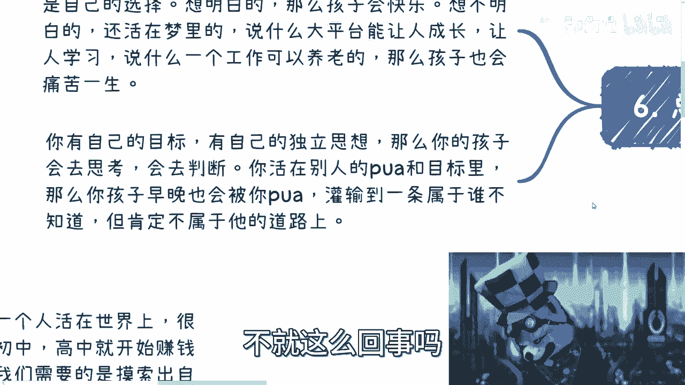

在此再次强调：所有事情，没有什么是“一定要做”或“一定不要做”的。

前提是，你必须想清楚你这么做的目的是什么。就像很多人说“考研是为了有稳定工作”，那么你需要追问：你怎么知道能有稳定工作？稳定体现在哪里？这个结论从何得出？

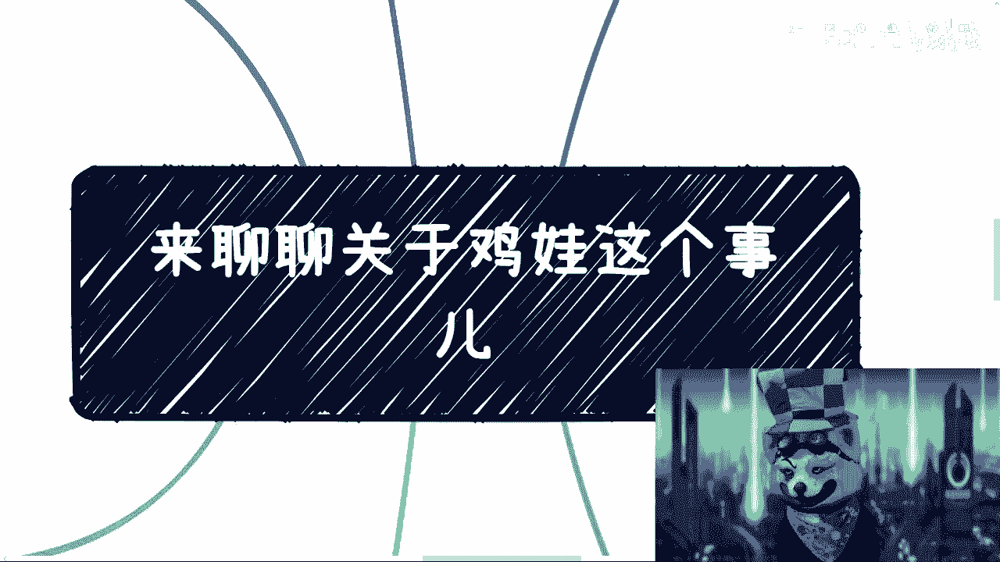

如果你对所有事情都不清楚，却用PUA自己的方式说“我想明白了”，那就没什么可讨论的了。

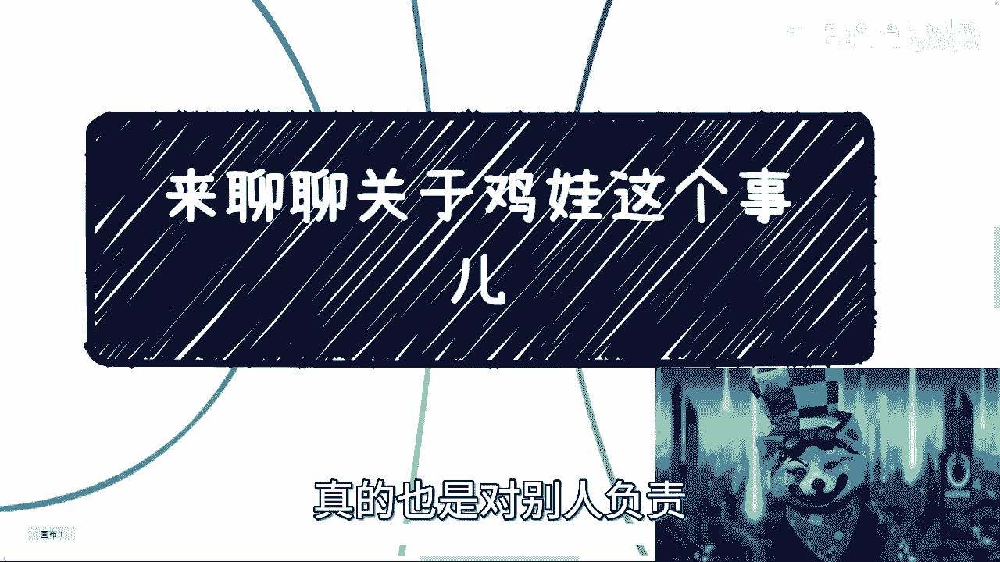

希望每个人都能想明白。关于孩子的事情，终究需要对自己负责。