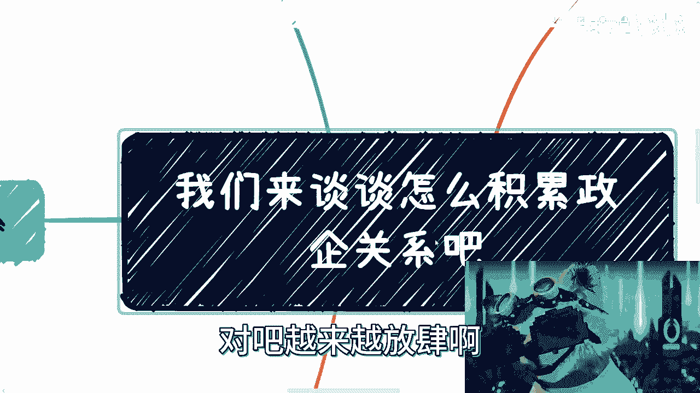
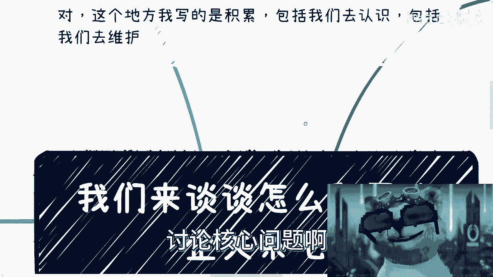
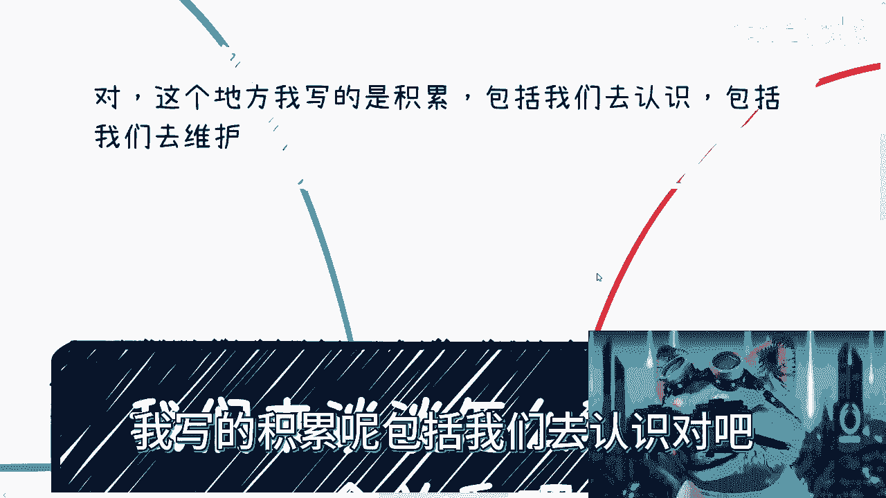
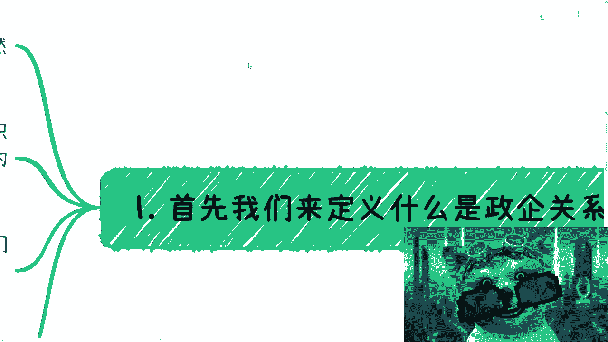
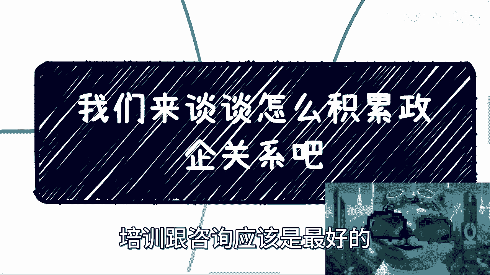
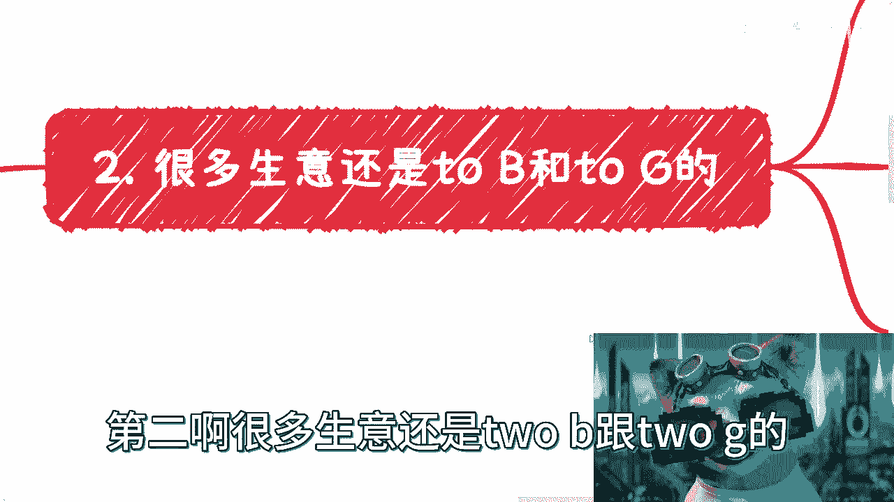
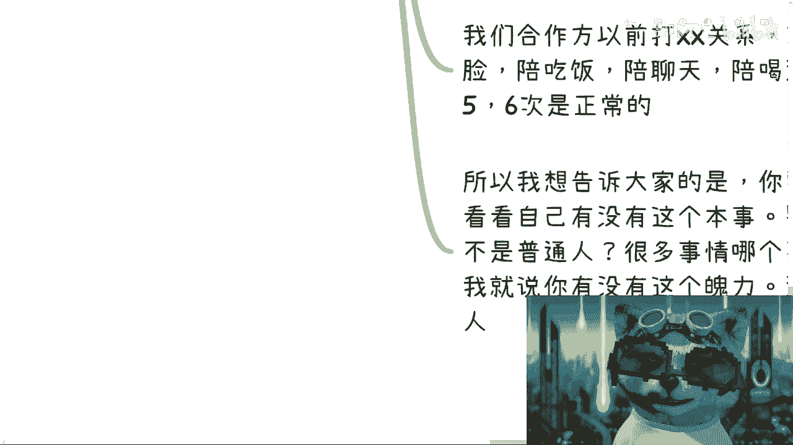
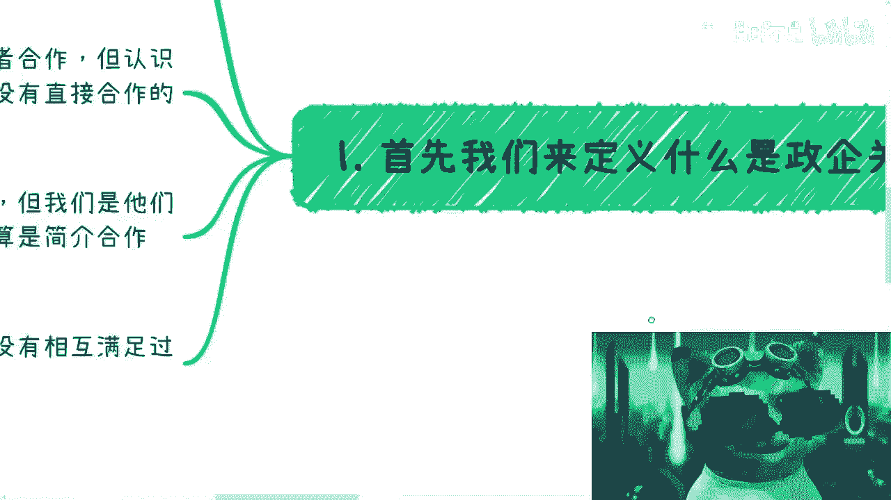
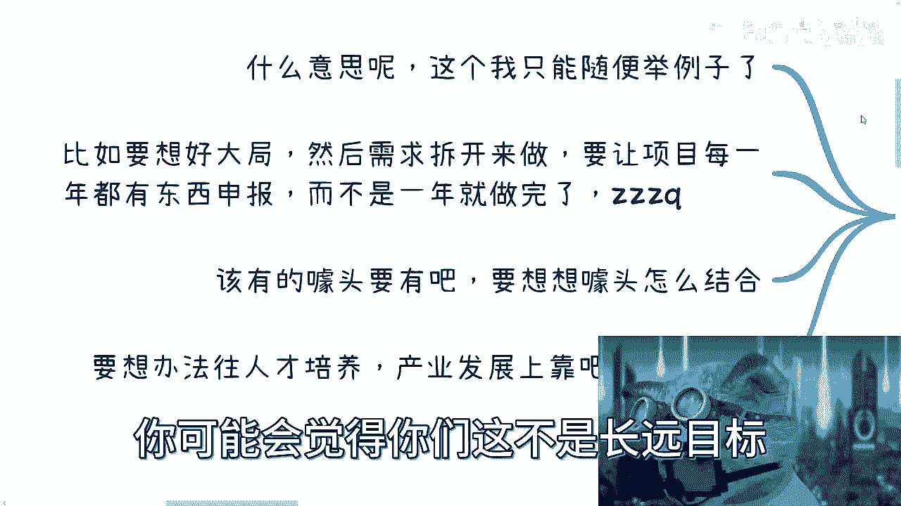

# 我们来谈谈怎么认识维护政企关系吧 - P1 - 赏味不足 - BV1KN411Q7Qy

好各位小伙伴大家好是吧，我说了嘛对吧，越来越放弃啊。

越来越放弃，那放弃就要开始对吧，讨论核心问题啊。

对这个地方呢我写的积累呢，包括我们去认识对吧。

包括我们去维护啊，我本期呢我主要是讲了一些内容啊，然后呢我也举了很多例子啊，后面还会有故事会对吧，大家都知道对吧，日常就讲故事啊，故事会我主要是希望能让大家明白一点呢，就是现实是什么样子的啊。

嗯当然方法我也会跟大家讲的，不是说每个人都能做的啊，首先呢我们怎么来定义这个正企业关系啊。

是这样子的，首先啊我们可以有最最直接的关系，比如说啊这个我跟某个厅局啊，某个司啊，区长啊，我直接认识啊，我日常跟他们吃个饭啊，怎么样怎么样对吧，那这种呢我觉得这个跟普通人关系不大啊，关系不大。

那这是第一个啊，第二个呢就是说呃我们今天要做一些业务对吧，做些项目啊，做些产品嗯，在这个地方呢就像我要提一嘴啊，就是说程序员啊，或者这么说吧，就是没有接触过政企项目的人，他能不能懂得去做政企项目。

或者在没有人带的情况下面，他能不能去做，这他妈绝对是靠天赋，我就这么说，就是要么就是天赋，要么就是你有没有这个悟性啊，为什么你们听到后面你们就知道了啊，嗯第二种呢就是说你们可以通过别的关系啊。

去间接间接认识啊，举个例子啊，比如说你说这个这个我今天没有对吧，好没关系啊，我跑到协议啊，跑到什么什么经信委下属的一些什么协会啊，对吧，或者来说科委对吧，这个这个什么团委对吧。

下面各个这个直接或间接的协议啊，商会对吧，我就去认识那协会商会，你认识起来总方便吧对吧，总比你直接跑到金星委屈好吧是吧，哦那么这个这个或者合作啊，但是呢你说我要通过协议直接再去认识上面的，科委的领导啊。

啊科技司的领导啊，基本上就不太可能了啊，不太可能了，那么或者说呢这个就算认识就算啊，你们今天能一起吃饭对吧，这个见一面啊，呃本质上你们也没有直接的合作啊，还是间接的合作，这一点呢我给你们讲。

但凡经历过的懂，也真的都懂啊，呃呃当然了，这什么幼儿园幼儿园说了，那驴老师你怎么什么都懂是吧，切我跟你讲，为什么什么都懂，就是他妈的，因为这些事情，这些屁事我他妈什么都经历过是吧啊。

很多呢我们也不直接认识啊，还有呢也不见，也没有间接认识，但是呢我们跟他们的白名单供应商认识对吧，我们跟他们的白名单供应商，可以是这个战略合作啊对吧，或者说是合作的一部分的这个关系啊。

那么其实本质上你也可以理解为是间接合作，唉我又写错了啊，无所谓不改了对吧，反正就这个意思啊，那么说白了啊，就是说啊有没有诶等一下啊，对说白了呢就是说你没有合作啊，没有赚钱。

没有相互满足过KPI也就不算关系，你知道吗，就说大家大家去喝酒，大家去吃饭，这种事情很正常哦，你你的关系也就仅此仅限于此了哦，仅限于此了好吧，就说你要找方式很多来了。

当然还有一种方式，你就跟我一样对吧，你说我这个专门做政企的培训和咨询，那可以啊，你也这么做，对不对，那我觉得政企培训和咨询应该是最好的。

能够接触到政企高层的方式来了啊，没有之一，对不对，就这么简单啊，第二啊，很多声音还是to b和to g的。

为什么首先to c的生意就很难做啊，也不是说每个人或者每个企业，都有这个天赋和这个能力去做啊，你会发现to c的声音为什么说难做呢，是因为C端的整个商业逻辑闭环，它是不稳定的，你知道吗。

你就比如说今天你跟我说你的日活是多少多少，对不对，你说日活一个亿对吧好，那你能不能保证你明年日活也一个亿呢，不能吧对吧啊，那你说不定过了半年你产品就倒闭了，你还日活一个亿呢对吧。

你日活日活有个2000万，2000万100万就不错了，是吧啊，那么这第一个第二个呢，C端属于要就是这就是俗话说的好啊，C端属于钱少屁事多，你知道吗这么一个群体啊，但为什么割韭菜往往对着C端格。

是因为割韭菜根本就不用管C端的屁事，你知道吗，就是就是你们但凡去做一件事情，如果想要去管C蛋的屁事，那他妈就不叫割韭菜，你懂吗啊，就是说就像整个产业这个商业链条一样，就是说你可以只管售前。

你只管寿终对吧，你你你只管这个业业务当中，你售后什么东西没有的，PP都没有的对吧，账户子账户已销毁，是不是啊，而且患有呃对对，另外一方面来讲，你对着B和G之歌，你有风险对吧，你看到过对着企业跟政府割。

对不对，有没了没有的呀，对不对，所以我我昨天还是前天讲那个内容的时候，我也说过对吧，企业跟政府不能叫哥对吧，你最多叫薅羊毛，你怎么能叫哥呢，对不对啊，你这有有几个有你有几个胆子是吧。

哦你这第一点第二点呢，虽然哦很多做的是C端生意，但是我们叫做什么叫做b to b to c，或者g to b to c，或者b to g to c，什么意思呢，就是说我们可以做C端生意。

但是我们并不直接面对C端，因为有很多的企业和政府，它本来的业务就是面向C端的，而我们是可以面向这些面向C端的企业跟政府，你知道吧，就在编程里面有一个东西叫做面向对象，编程对吧，面向对象开发。

那我们叫什么，我们叫做面向企业跟政府，这个这个做做做创业对吧，虽然我们不叫哥啊，虽然我们的用户是C端，但是我们不直面用户，让擅长面对用户的人去面对用户，对不对啊，这是第二点。

第三点呢就是to b和to g啊，它相对是稳定的，而且能够做大，就是你去C你要做的其实是很难的啊，就是我只能做到什么概念，我跟你们这么讲，就是比如说一年啊你的纯纯利润啊，比如说嗯就这么说吧。

就是说赚快钱的情况下面对吧，你比如说一年有个小几百万啊，或者这个大几百万吧对吧，这种呢其实都算做快钱，都算做小生意哦，所谓大生意是什么，就是你整个链路是能够自运行的，就整个商业是可以滚起来的。

然后你的企业是有规模的，同时你的企业是能够，就是说就是比如说拿补贴政策啊，拿各种东西你要去拿的，你知道吧，那么这种的话其实是很难面向C端的，你面向极端这种生意是很难就是规模化去做的，那除了像教培对吧。

就是什么成人教育啊，成人培训啊，来了这种东西可能还好说啊，但是你会发现成人教育，成人培训这种东西做到后面，他也不能仅仅做培训，做教育，他一定是产品化的，你知道吧，所以这个东西呢就是就是没有办法。

因为唉就就这么回事吧，啊嗯但是呢你做C在做B端和G端的生意呢，你有两个问题是避不开的啊，死活都是避不开的，嗯一个是回款周期跟回款率啊，一个是关系维护回款周期跟回款率这事儿啊，我跟你们讲了。

但凡做过的懂得懂得都懂得都懂啊，就是啊你要这个合同对吧，签个一年啊，然后呢啊你说我回款啊，或者说这个回款的叫什么啊，时间对吧，说是一年给的，那一年能不能给呢，你不知道对不对，那你说你说给多少钱。

卧槽我的小熊猫啊，好了就是给多少钱对吧，那到底是这个这个最终给不给呢对吧，还是说分之周期给呢，你反正都不知道啊，反正就是说他的回款周期很长，你得有足够的资金流，资金链去维护这件事情啊，那这个是一方面。

第二方面呢就是关系维护，哦好那么接下来就开始讲故事了，讲故事啊，进入故事会模式，哎呀我的手机卡成狗了，微信真的卡成狗了，谁给我发消息对吧，讲故事啊，这个故事就好玩了对吧，首先啊比如说我们以前晚上吃饭。

当时在哪里呢，在青岛啊，晚上来了一个上层的叉叉啊，我就不方便讲了，叉叉啊，我们创业呢，这个创始人是个小姑娘啊，说好了不能喝酒的啊，然后呢这叉叉就故意倒酒，倒满倒满，各种倒满，最后就无奈啊。

无奈还是喝了三个高脚杯对吧，而且是大的那种啊，大的那种对吧，喝的他妈的人都傻了，我跟你讲啊啊这是第一个，第二个呢，你比如说我们以前合作方以前在北京啊打关系，有的呢是不为底的，有的是呢是投资方的啊。

反正就是酱香型，就是你只要吃饭，我跟你讲，就他妈的吃什么不重要，就他妈酱香型就他妈干啊啊吃饭，其实我跟你讲，吃饭就跟受罪是一样的，哎我跟你讲这个呃，就说到这个我真的有件事情就很不开心对吧。

前两天呃评论区还有人说我呢，你这素质太差啊，韩妈去补助，素质实在太差对吧，素质这么差，你居然还说B站的人素质差，而数字素质差，是不是，然后我我跟你们讲啊，是这样子的，第一呢啊啊对我来讲啊。

所有表面的东西我从来不care啊，从来不关系啊，第一点第二点是啊，我也从来没说过被这个B站的用户素质差啊，主要第二点第三点是什么，我跟你们说，你们但凡要赚钱，但但凡往上走啊，素质差算什么。

素质差已经是好的了啊，不把你弄死已经他妈不错了，你知道吗啊我跟你讲，你不但要想好怎么说话，你不但要想好怎么夹菜，你知道吧，还要想好怎么喝，你知道吗，你晚你要喝酒，喝到晚上吐，吐的满地都是。

然后当时咳出血，真的血的那种，一点都不夸张，我跟你们讲，这这才叫普通老百姓，这才叫商业，这才叫搞关系，你们懂吗，还有一次呢我们之前去潍坊啊，也是很牛逼的啊，当地跑过去，当地就跟我们说。

哎我们有自己的一套流程啊，你跟你讲什么左左上右上什么乱七八糟，反正我也不懂对吧，反正意思就是什么呢，意思就是一套流程下来，基本上普通人就他妈死了啊，你就呆在那啊，就他妈没知觉的那种，对吧啊。

然后就是对吧，然后呢还有一种呢就我们合作方以前打关系啊，就是每天呢每天都是刷脸，每天都陪吃饭，每天都陪聊天，每天都陪喝酒，我跟你讲，就是那种五六点我就问他来了，你在这干嘛呀，拍一张照片对吧。

就是二锅头是吧啊一年因为喝酒对吧，去医院，妈的我他妈这什么，输入，是是是输入法不，我我啊，一年对吧，因为喝酒去医院五六次啊，所以呢啊我为什么跟大家说这些事情，妈的今天是小熊猫，不行啊。

啊我把这个光遮一遮啊，就是为什么，所以我要告诉大家是什么呢，就是你要切关系，你要切正起，没有问题，不是不能切，没什么不能切的，你就先看看你有没有这个本事，你有没有这个魄力，你有没有这个胆量对吧。

你别老普通人，普通人的谁他妈不是普通人啊，很多事情哪个不是普通人用命去换的啊，对吧哦，你一边说我是普通人，一边又他妈的没有胆子，不敢去豁，豁出去冲，那你说一你没有魄力，你说什么说来了，没什么好说的呀。

对不对，就说白了所有人都只会躲在屏幕后面，羡慕哎呀，我羡慕你，我羡慕这个羡慕那个对吧，但是我跟你们讲了，有有几个人敢说呢，啊是不是不就这个道理吗。

对吧好，然后第四个，那么自然就有人要问了，他说啊是不是一定要这样去维护呢。

对吧好，我们举个例子啊，举例子啊，比如说你问我要不要送礼呢，其实我觉得没有必要啊，这礼有什么好送的了，有些不但送礼直接送钱啊，有什么好送的，但是卷了呀，什么叫卷啊，我为什么一直说老百姓卷卷卷。

卷到后面是把自己卷死啊，卷的意思就是说你不送别人也会送，那你送不送呢，对不对，你不但送，你还要跟别人比诶，我送的是不是比别人好哈，是吧嗯，这是第一个第二个公司，你马票要不要拍呢，本来是不要的。

但卷了之后就要拍了，为什么你不拍，别人也会拍啊，还要拍看谁拍的好，拍的精妙对吧，拍的拍的他妈的察言观色啊是吧，第三你说简历要不要包装呢，要不要吹嘘呢，当然我也认为不要，但你一个硕士，一个本科。

一个博士出去，你不包装有卵用啊，别人也会包啊，你不吹没有卵用啊，别人也会吹啊，怎么办呢，对不对，当然啊，有人要说了，他说驴老师，你以前不是说了要做自己对吧，很多事情不是缺了谁，地球不转的。

我们可以另辟蹊径，是不是对，没毛病，但并不是所有事情都能找得到的，你知道吗，今天如果有个人在你面前，他非要你干嘛干嘛，你可以不管他，你可以找别人，但是有些时候，已经变成了一个行业的一种潜规则，你怎么办。

你逃得掉不来，你逃不掉的，因为到哪儿都这样，对不对，没有办法的，那当然有一个办法，你先强大你自己对吧，你先把你自己他妈的变成一个牛逼的人，那可以是吧。

然后最后一点也是最重要的最最最最重要的啊，我不能多说了，多说他妈的切是吧，懂得都懂啊，什么意思呢，这个我只能随便举例子啊，比如说要想好大局，什么意思啊，就是你今天要去给别人做项目啊，要你要想好大局。

然后需求拆开来去做，要让项目每一年都有东西申报，而不是一年就做完这件事情，就是真的哈，我为什么说所有一开始就说了所有的程序员啊，所有的那些没有接触过政府项目的人，真的都不适合做政府项目啊，做做政企项目。

是因为你们要明白，做政企项目项目并不重要，重要的是重要的还是汇报，重要的是KPI，重要的是他的宏观，重要的是，那我我这个话就不讲了，重要的是什么，是啊ZZZQZQ啊，那么该有的噱头要有对吧。

要想想噱头怎么结合，要想办法往人才培养上靠，要想办法往企业发展上靠，一定要想办法往宏观上面靠，而不是说我今天这个项目做的做的多么接地气，多么牛逼对吧，做的多么的有难度，做的做的做的怎么样，这不重要。

没有人关心啊，哥哥们姐姐们，没有人关心哦，你要让想好，让领导要明白，要让上面的人民，要让上面的人明白，这个东西不但今年能做，明年还能做，后年还能做，还有很多余地能做，而不是你自己把它做的很完美啊。

你不要把你自己想的是一个很聪明的人，你想得到的别的东西，别人一定想得到，别人不做的原因是因为别人有长远目标，别人有长远的眼光，而你没有对吧，当然你可能会觉得你们这不是长远目标。

你们这个不是常长远的眼光，你们是腐朽的眼光，你们是一个叫什么。

就是就是非常虚的眼光，那不好意思，那我倒想问问看啊，这个世界这个资本，这个社会是围着你转呢啊，还是围着围着人家上面的人转啊，是你屁股值钱，还是人家屁股值钱，唉对吧，就这么着吧啊就这么着吧啊哎呀。

多说多说多多多多多说就说不了了啊。

