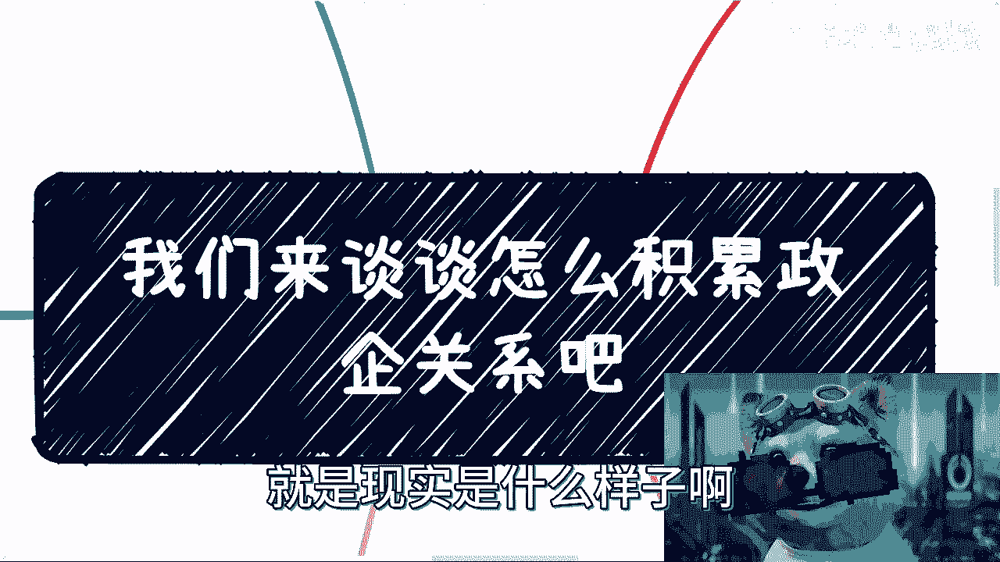
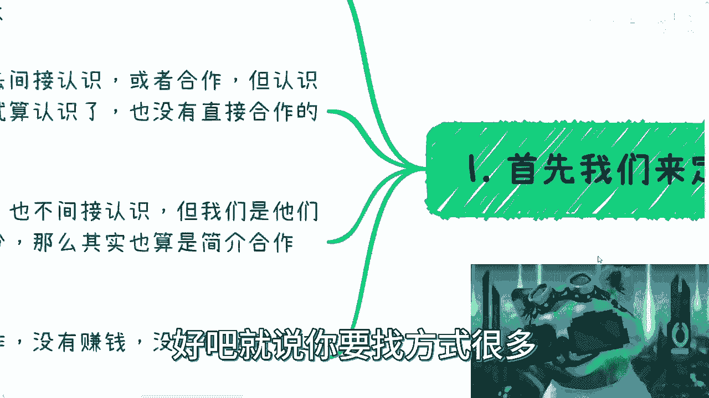
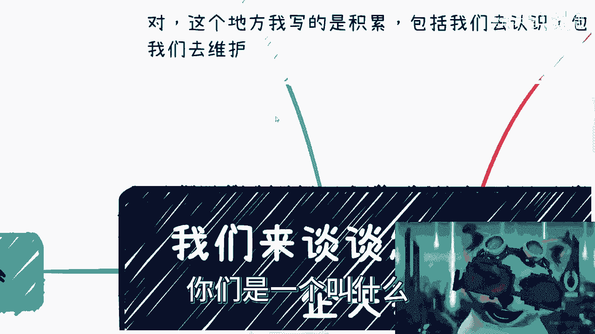
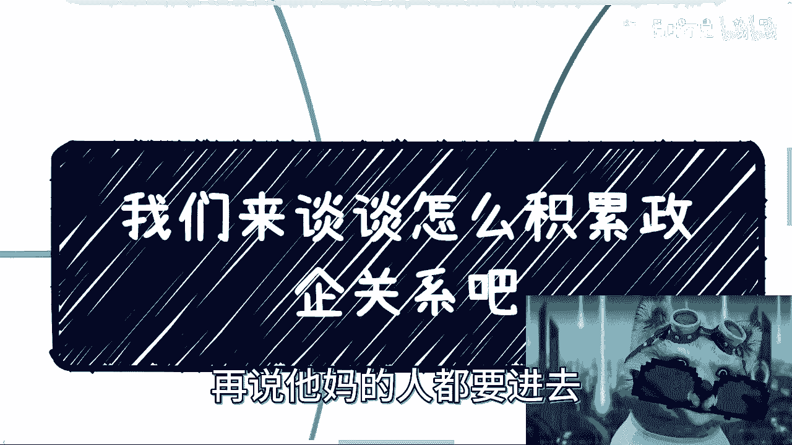

# 我们来谈谈怎么认识维护政企关系吧---P1---赏味不足---BV1KN411Q7Qy

在本节课中，我们将学习如何认识和维护政企关系。课程将涵盖政企关系的定义、建立关系的不同途径、面向企业与政府（To B/To G）业务的特点、关系维护中的现实挑战，以及开展此类业务的核心思维方式。

## 政企关系的定义与层次

首先，我们需要明确什么是政企关系。政企关系并非单一概念，而是存在不同层次和建立方式。

以下是几种常见的政企关系类型：

1.  **直接关系**：指个人直接认识政府或国企的特定人员（如某厅局、某司、区长等），并能进行日常交往（如吃饭）。但这种关系对普通人而言建立难度较大。
2.  **间接关系**：指通过其他组织或个人作为桥梁来建立联系。例如，通过加入或接触经信委、科委、团委等政府部门下属的协会、商会，从而间接地与相关体系产生联系。然而，想通过协会直接结识上级主管部门的领导，通常非常困难。即使能见面吃饭，本质上仍属于间接合作。
3.  **供应商合作**：指与政企单位的“白名单”供应商建立战略或项目合作关系。这本质上也是一种间接合作。

关系的核心在于**是否有实质性的合作、能否共同创造价值或满足彼此的KPI**。仅仅吃饭喝酒，关系就仅限于此。

## 接触政企高层的有效途径

上一节我们介绍了关系的几种类型，本节中我们来看看一种被认为非常有效的接触途径。

从事**政企相关的培训和咨询业务**，被认为是接触政企高层决策者的最佳方式之一。这种方式能提供一个相对正式且高效的沟通平台。

## To B 与 To G 业务的特点

认识了建立关系的途径后，我们来看看为何要选择面向企业（To B）或政府（To G）的业务。与面向消费者（To C）的业务相比，它们有显著不同。

以下是To B/To G业务的主要特点：

1.  **稳定性与可规模化**：To C业务的商业闭环往往不稳定（如用户日活波动大），难以保证持续增长。而To B/To G业务一旦建立合作，相对稳定，且更容易形成规模，获得持续的政策或资源支持。
2.  **不直接面对终端用户**：可以采用 **`B -> B -> C`** 或 **`G -> B -> C`** 的模式。即，你的客户是那些本身面向C端的企业或政府机构，而你无需直接处理C端用户的复杂问题。这类似于编程中的“面向对象”思想，我们则是“面向企业与政府”。
3.  **风险与责任**：针对企业和政府提供服务，无法像某些C端业务那样“割韭菜”后消失。这要求业务必须扎实，承担长期责任，最多可称为“薅羊毛”，但绝非一锤子买卖。

## 无法回避的两大挑战

尽管To B/To G业务有优势，但其中有两个挑战是任何从业者都无法回避的。

1.  **回款周期与回款率**：政企项目合同周期长，回款时间不确定，可能约定一年支付，但实际到账时间难以保证。这要求企业必须有充足的资金流来维持运营。
2.  **关系维护**：这是核心挑战，其现实情况往往比想象中复杂和艰辛。

## 关系维护的现实故事（故事会）

关于关系维护的艰辛，以下通过几个真实经历来具体说明：

*   **被迫饮酒**：在青岛，一位女性创业者事先声明不喝酒，但对方领导反复斟满酒杯，最终被迫喝下三大高脚杯白酒，导致身体严重不适。
*   **社交负担**：在北京维护关系时，饭局的核心常常是“酱香型”（白酒），吃饭本身变成一种负担和受罪的过程。
*   **健康代价**：为了维护关系，有人需要每天陪吃饭、聊天、喝酒，曾因饮酒一年内去医院五六次。在潍坊，当地有一套复杂的敬酒流程，足以让不习惯的人难以招架。
*   **素质与生存**：在商业应酬中，仅仅“素质差”可能已是温和情况。你需要考虑如何说话、如何夹菜、如何喝酒，甚至喝到吐血。这些是许多普通人用健康和勇气换来的生存之道。

切入政企关系领域并非不可能，但需要评估自己是否具备相应的魄力、胆量和承受能力。空有羡慕而无实际行动，则难以成事。

## 关于“内卷”与潜规则的思考

那么，是否一定要以如此艰难的方式维护关系呢？这就引出了“内卷”的问题。

当一种做法成为行业潜规则时，个体往往难以逃避：

*   **送礼**：你认为没必要，但别人会送。为了竞争，你不仅得送，还要送得更好。
*   **拍马屁**：本来不需要，但“卷”起来后，就需要比拼谁拍得更精妙、更察言观色。
*   **简历包装**：作为硕士、博士，你不包装，别人也会包装，在竞争中可能处于劣势。

当然，你可以选择另辟蹊径，做自己。但有些潜规则 pervasive，难以完全避开。最根本的破局之道，是先努力提升自身的实力，让自己变得足够强大。

## 政企项目的核心思维 🎯

最后，也是最重要的一点，涉及开展政企项目的核心思维方式。这与纯技术或产品思维有本质区别。

对于政企项目而言，**项目本身的技术难度或完美程度往往不是最重要的**。核心在于以下几点：

*   **大局观与持续性**：要让项目每年都有内容可以申报、可以汇报，而不是一年就做完。关键在于规划项目的可持续性，而非追求一次性完美。
*   **汇报与KPI**：项目成功与否，很大程度上取决于汇报效果和是否满足了相关方的KPI（关键绩效指标）。
*   **宏观结合**：要善于将项目与**人才培养**、**企业发展**、**宏观政策**等高大上的主题相结合，制造合适的“噱头”。
*   **理解规则**：要明白，这个体系并非围绕个人技术理想运转。你需要理解并适应现有的规则和评价体系，而不是一味抱怨其“虚”或“腐朽”。思考是谁的决策更有分量，并据此调整策略。

**总结**

本节课中我们一起学习了政企关系的多层次定义，了解了接触政企高层的可能途径，分析了To B/To G业务的特点与挑战，并通过真实故事揭示了关系维护的艰辛与“内卷”现实。最后，我们探讨了开展政企项目所需的核心思维——即重视大局规划、汇报效果和宏观结合，而非单纯追求技术完美。理解这些，是踏入这个领域的第一步。