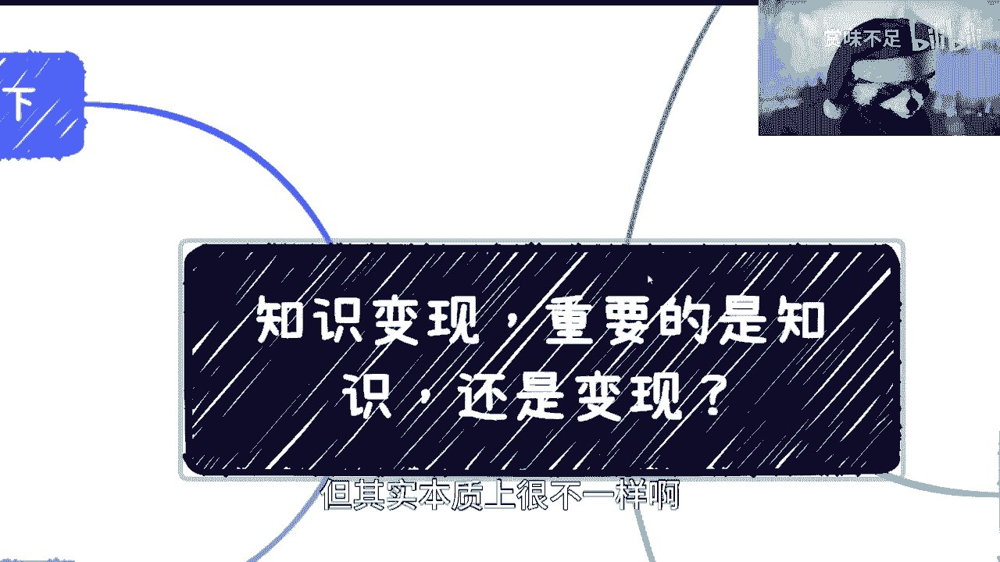
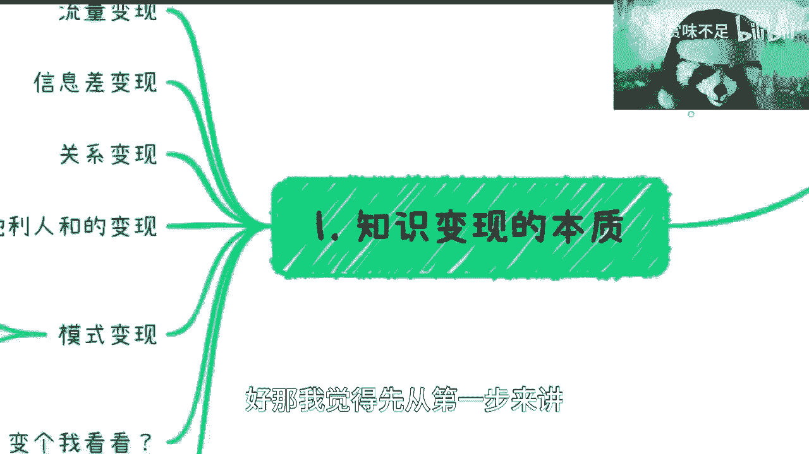
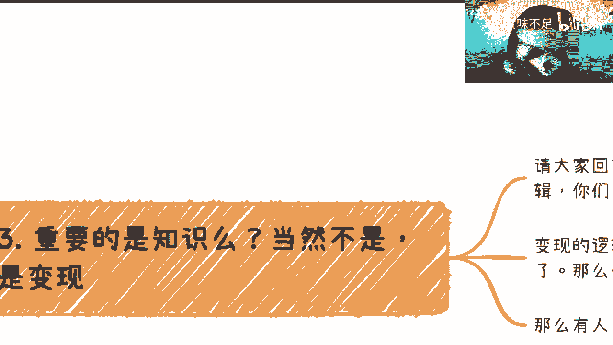
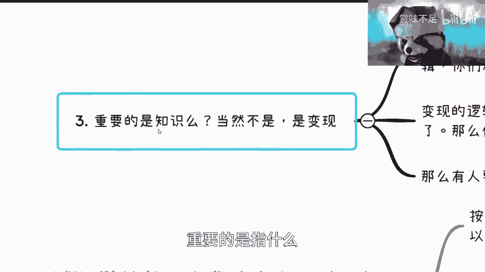
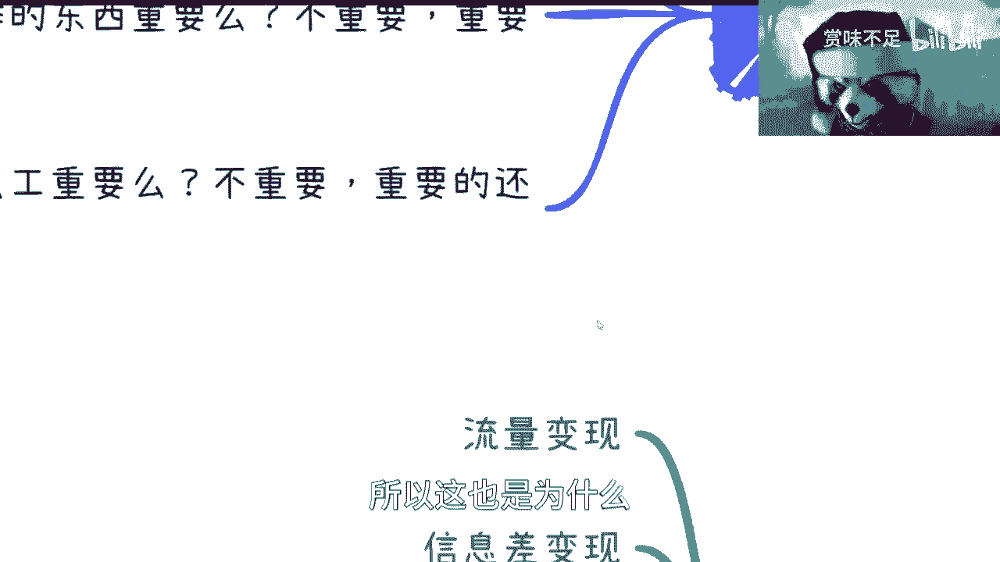

# 我们来谈谈知识变现，重要的是知识？还是变现？ - P1 - 赏味不足 - BV18o4y187Rj

好啊，前两天答应这个小伙伴讲的这个叫知识变现啊。

我们来讲一下啊，有很多小伙伴呢觉得这个东西啊，跟之前那一期培训呢还是很一样。

但其实本质上很不一样啊，那首先我们来说啊，知识变现，知识变现你们觉得重要的是知识还是变现啊，对吧，你们想想看，那我觉得你们要是在别的地方呢，你们估计就算不知道对吧，你们也这个就是二选一对吧。

你在我这边我觉得就很简单。

肯定是变现嘛对吧，知识重要吗，哼对吧啊，就知识值钱吗，值钱的知识不值钱吗，的确不值钱啊。

我们来往下讲啊，首先第一点知识变现的本质。

你看啊知识变现的本质啊，你们去拿那些你们知道的知识变现的平台，或者什么公众号，或者anyway别的各种各样的东西啊，拿出来啊，你们参考一下啊，流量变现对吧，信息差变现对你比如流量变现。

比如说你现在有个私域流量对吧，几万人啊，然后你去变现啊，信息差变现对吧，就比如说拆gb t对吧，就是属于信息差变现对吧，或者来说很多很多很多类似的，其实都是信息差变现啊，关系变形对吧。

比如说呃某某是我爸对吧，跟某某企业对吧，这个创始人是我妈对吧，啊关系本性啊，呃天时地利人和变形什么意思呢，就是红利期对吧，就是比如说以前买房啊对吧，互联网啊，这个这个叫什么这个直播啊对吧。

很多很多啊叫做这个这个变形啊，那还有呢比如说模式变现，什么叫模式变现呢，就比如说啊你今天会有会销模式对吧，各种营销模式叫做模式变现，因为营销这个东西呢是一个学问，啊营销这个东西是个学问啊。

你们不要觉得营销很虚啊，很多企业每1年花在营销费用上面，这个几百万也很正常啊，营销是一个学问，然后呢那我们来看啊，就是首先你看这边我列了这么多对吧，知识变现，你首先这个东西哪个东西跟知识有关。

就所谓知识变现是什么意思啊，是指你懂得流量怎么变现，你懂得信息差怎么变现，你懂得怎么去搞关系，你懂得天时地利人和是什么时候，你懂得会消，是这些东西，知识变现，不是说他把他卖的东西叫知识变现，你们懂吗。

哼啊就这个东西叫知识变现啊，好那所以说你说知识变现单纯的知识变，有很多人不理解啊，他说我今天懂一个技术啊，比如说甲烷啊，开发python开发，我就去变现了，你咋变啊，你变给我看看。

你你第一步还不是说我要开始做ip对吧，我要开始做品牌，我要开始做什么，但你会吗，你不会，那你怎么变现啊，变个p呢，是不是啊，那么你比如说前面一期我们讲的这个培训啊，只能说是知识变现里面的什么呢。

一个某一种模式，而且是一种比较特殊的模式啊，因为培训这个东西呢，它嗯怎么说呢，就是说有很多种，就它比较固定啊，而且呢就是说to c to b to g，它都有不同的这种方式，但是呢它是独立于上面这些的。

因为他有自己的玩法啊，那么所以说呢首先第一步啊，我们得要明白，所谓知识变现不是你要卖的东西是知识，而是你要懂得这些东西才叫知识，而这叫知识变现啊，好那我觉得先从第一步来讲。

已经筛掉了99%的人啊，对吧好。

这是第一点啊，第二点我们假设啊你没有知识，你想看，如果你没有指示，就是你没有去卖的那个知识啊，没有卖的啊，没有卖的知识，你能不能变现呢对吧。

那按照我的认知啊，可以完全可以非常可以必须可以是吧，为什么呢，你比如说拿g p t来举个例子，比如说你可以花钱去买gb的账号，呀呀呀呀呀呀呀呀呀呀，你可以花钱去买gp的账号，然后卖给别人，对不对啊。

好你可以雇人做服务，你说我不会嘛对吧，没关系，你雇个人做个服务对吧，你比如说画个几千块钱对吧，卖卖然后卖对吧，第三你可以做知识星球啊，这投资星球没有门槛啊，你做呗，对不对。

第四你可以做短视频吸引流量啊对吧，就蹭热点对吧，就是说我就讲很多gp的内容啊，然后就是说吸引流量以后再卖别的东西，你管我卖什么对吧，我卖卖什么，我反正都先有流量，对不对，然后呢你可以做线下培训班对吧。

你可以做jpd结合商业案例哦，这个东西不要太火啊，我跟你们说啊，啊你们就去做这个这个结合商业案例，对吧啊啊然后你对吧，那那那我们就来问啊，就说有很多小伙伴要问了，他说哎那你说做知识星球里面放什么呢。

放什么还不容易吗，你直接微博上小红书各个地方，你你你不会没问题啊，你妈超会不会来，对不对，你做个搬运工会不会来往里面搬嘛，对不对，那你会搬里面花钱的人就不会搬呀，不就这么回事吗，你要不会搬，你也花钱呢。

对不了啊，然后这是一个第二个线下培训班，也不是一样的吗对吧，你会不会你不会没关系，搬对吧，jpd结合商业逻辑会不会不会搬对吧，到处搬啊，你google一下百度1下对吧，冰一下，然后那个那个那个叫什么啊。

找一下各个各个什么报告对吧，那么你你就算微信微信里面没有吧，你微信群里面倒出各种各样的东西，总会有吧对吧，所以我让你们认识人呢，加一些杂七杂八的总归有用的是吧啊，然后你说这些我就问你们这些需要你懂吗。

不用吧对吧，你要懂gbt吗，不用吧，你要懂预训练模型吧，不用吧对吧，你你要懂这个叫什么，就是整个g p t是怎么发展的，模型量有多少，预训练为什么是预训练，对吧等等等，你要懂吗，不需要啊。

这上面哪个东西需要了，不用啊，就直接变性对吧，但你要懂的是什么，你要懂得是怎么变现啊，怎么变现才是知识，知识不是知识，你懂吗啊。

那这个是第一第二个，是吧。

第三个是什么呢，你看啊，重要的是知识吗，哎呀重要的是指什么。

当然不是对吧，重要的是什么，是变现的知识变现，这个这个叫什么这个模式的知识对吧。

那你比如说好，我们来举个例子，比如说请大家回想我所有视频里面所说的，商业闭环和商业逻辑，你们有技术，你们有技术有用吗，没有对吧，我非常抱歉的告诉你们没有有，就好像现在所有的人这个私信我对吧。

这个咨询我的时候就问啊，我选什么选选什么公司啊，二选一啊，三选一啊，我选什么专业啊，不好意思，对我来讲都是垃圾，没有用有什么用，是没有用呀，因为你们不能赚到钱啊，你们学的东西不能变现，有什么用的。

没有用的呀，对不对，你空有18般武艺，有什么用没有用，是不是，你今天就在再跟我说，你说你的技术做的很牛逼，我说了，你只要不做到一个天花板对吧，你是中间那那80%，或中间那95%，那么对我来讲。

我觉得没什么区别，因为对资本家来讲，你都是不能变形的，有什么区别了，对不对啊，所以说你要我再给你们举个例子，这就好像什么，这就好像今天有一个人能造造房子，就是有一个人是能一个人造出一个房子啊。

有一个人是一个人不能造房子，但是呢他能够，但他只能在那边造整个结构对吧，还有个人呢人家结构都造不出来，他只会在那边堆火柴，对吧好，那我就问对资本家来讲，这三个有什么区别，没有区别。

因为这三个不能直接变形，有什么用啊，没有用的对吧，你不能说哦这个有个火柴啊，在这边堆堆柴火就能变性了，不能吧对吧，你做个框架能吧，不能吧，你搭了一个房子能吗，也不能啊对吧，那话又说回来。

如果你今天是堆火柴的对吧，堆柴火的那个人对吧，然后呢你有自己的一套模式啊，然后我不管这套模式到底是怎么一个合理也好，不合理也好，但是你能变现哇，那你牛逼对吧，你比那些能造房子牛逼的多，就结束了。

你们懂吗，但是很可惜的事对吧，我也看到有非常多的小伙伴在问他说诶，那我们有没有看什么书啊对吧，我们能不能有什么视频啊，很可惜的是，所有的商业逻辑不是看书能看得来的，因为你包括去看视频也好。

你哪怕付钱也好，你所拿到的东西是什么，你所拿到的东西是有一定参考价值的，但是前提是有两个大的前提，第一个前提是你得吸收得了这些东西，第二个前提是你最终还是需要自己实践去，就是掌握也好，或者去摸索也好。

属于你自己的商业逻辑啊，因为如果我们打个比方，你任何的商业闭环跟逻辑，它是能ctrl c ctrl v的话，那我就说白了，那今天随便哪个东西，这个没有什么信息，就除了一些非常非常机密的信息。

我没什么信息不透明的，那大家都去肯trl c v好了，对不对，那没这么简单的嘛，这个事情啊，那么所以说你会发现呢，其实本质上变现的逻辑是最重要的，变现的逻辑你自己要走通，那么对你来讲，你变啥不是变对吧。

你今天可以变gbt，明天可以大变活人对吧，后边可以变，随便变对吧，但是如果你今天变现逻辑没有，那你在那边学半天啊，我要学18般武艺，我要学72变，又用了没有用的呀，哎哟我真的我我觉得是这个事情是什么。

是大家的思维问题，你知道吧，就说就说你们是这样子的，你们来咨询我对吧，你们在咨询我之前，你们一定要先把这个思维转变过来，你知道吧，就是你不要来咨询我的，是说唉吕老师，我现在有两个选择对吧。

是高效a高校b我有两个选择，是企业企业b没有意义的，有意义了，没有意义的呀，对了，你要想好是什么，你要想好就说哎我可能选了个大方向，比如说吕老师，我选了个金融，选一个医疗对吧。

那我们比如说你花500块钱来找我，然后呢你说这一个小时我们来聊一聊，比如说你觉得金融里面，医疗里面有哪些变现的方式对吧，或者说这里面有哪些坑，唉这个是可以的对吧，你别让我去做那种。

就是对我来讲毫无意义的选择，因为对我呢，看来未来你们选什么没有什么很大区别，有什么区别没有区别啊，那么你比如说我们举个例子，比如说开会啊，那有很多人就觉得哎开会这个东西啊又烦啊，又又又花精力对吧。

又不讨好，那说明什么，那说明你没有明白开会的精髓对吧，你们要知道会销这件事情多么赚钱，赚起飞啦啊，你要知道2018年2019年，我在上海这边一个几百人的会销，一一下午可以收几个亿啊啊这算什么事情啊。

哎哟办会这种事情啊，你你单纯的收入有非常多种门票对吧，赞助对吧，金牌赞助，钻石赞助对吧，然后是什么伴手礼赞助对吧，然后那个那个叫什么撮合关系的，当中的渠道费对吧，然后包括你里面所卖的服务。

因为你今天卖卖的虽然是个会，但是会里面还能卖服务，那你卖产品卖服务，卖产品卖服务的渠道费啊，这个转的起飞了对吧，关键是你会不会做，关键是你懂不懂对吧，这个东西我就问你们学校会教吗，不会吧。

请你在一家企业会叫吗，不会吧，你今天就算在家会交公司不会会教你吗，不会的，因为为什么，因为你就是个打杂，你就是个螺丝钉就结束了，你知道吗，这也是为什么我跟你们讲，学校跟企业里面，你们学不到任何东西。

对吧，那有人要问了，他说吕老师编写逻辑是不是通用的，不是你只能参考，不存在通用的，因为你必须自己走一遍，你不走，你是不能从文字上一定明白，这里面的问题在什么地方的。

你知道吧啊那么第四个，比如说我们话又说回来对吧，就是虽然啊你说知识变现，你懂得要变现对吧，知识不重要，但是呢你该做的样子还是要做的什么意思呢。

你比如说对吧，不管做线上线下对吧，你该有的海报啊，易拉宝啊等营销物料，你该准备准备吧对吧，你不能说啊，两手一摊，一穷二白对吧，好我就来，我就开始变现了，那不可能的，你你该做的东西要做好的呀。

你说是不是啊，第二个你至少要用过吧，就就咱们别说你懂不懂，懂不懂肯定是不懂的对吧，但你至少得用啊对吧，我不管你是自己账号也好，别人账号也好，你反正借一个账号，你得用一下吧是吧。

那你另外一个就是说你至少知道一些术语对吧，你虽然你说哎预训练模型是什么，你不知道，但是这预训练模型这几个字，这术语你总得知道吧对吧，然后你比如说google的那个bird，你总得知道吧，是个什么东西吧。

啊对吧，然后new being in对吧，是个什么东西吧对吧，你你总归得知道一下，就虽然你技术不懂，但是你总会知道一下吧，知道一下花不了你多少时间嘛是吧，然后呢，你还要明白所谓变现本质上就是借力打力。

拉帮结派是什么呢，就是关系就是你到底是一个关系来合作，还是多个关系来合作，就是说到底你还是要去找关系的，否则你怎么变现，靠你自己变不了现的啊，然后另外最后这一点呢，就是我真的咨询了这么多人对吧。

然后聊了这么多人，我真的我在这个对吧，叫什么，就是摸着我的良心啊，说一嘴啊，你真的别自己真的去支持变现了，就是哼哼，就你知道吗，我觉得很很好笑的是什么，就是很多人是被舆论所教育的啊。

就真正说的就是有时候说一些真的话，或者说一些为他们好的话，他们是不听的啊，就他们都是被不被舆论所教育的，什么叫舆论教育呢，就是啊我要创业了啊，我要做副业了，怎么怎么做啊，先做短视频，我要做知识变现。

知识变形的屁呀，你真的去做知识变现，就是个韭菜，你知道吧，你就别真的去做知识变现，你别自己真的像个傻子一样说，哎我手上有这些技术啊，这其实这些技术我整理整理我就去变现了。

你说搞笑吗，在是不是。

真的我很焦虑，我我有时候我也不知道怎么讲法对吧，你比如说我们第五点啊，我们举一反三一下，首先我们之前讲过酒香，这个时代是酒香很怕巷子深的时代，对不对，好，但是呢你说你能不能打破打破规则，可以打破对吧。

不可以打破的意思是什么呢，就是说你要么就已经掌握了，我们说的变现的逻辑，要么就是说你在一个不是那么卷的地方，要么你就是说在一个就是啊，一个一个全新的一个领域，相对比较有红利期的领域对吧，因为你想想看啊。

我们还是拿那个去我那个那个短视频来举例子，现在很多人要去做副业，第一想法就是我要去做ip啊，我要制作短视频对吧，好，我就问你嘛，短视频发展到今天，你虽然不懂啊，你也你也可能不知道。

短视频怎么跟跨境贸易挂钩是吧，你也不知道短视频背后这个经纪公司对吧，包括供应商，整个供应链，整个这个经纪公司多么的复杂，你可能不知道，但是你知道一点吧，短视频发展到今天这么多年，卷成老狗了已经啊。

我就问你，你懂什么，你觉得你能卷的过人家啊，我就不明白了，你是觉得我他妈python很牛逼，我甲板很牛逼，还是我我做某个技术很牛逼，有卵用啊啊你再牛逼还不如人家跳个舞，有用了，没有用的呀，怎么不明白呢。

对不对，我就觉得就很神奇，你知道吧，这是第一点，第二点是你们要明白所有的领域，你们有的合作，所有的合作其实都一样的，就是你们想想看，今天你撮合一个合作合作的东西重要吗，或者你今天去申请一个项目。

这个项目重要吗，对吧，或者来说我们说今天就是这个你你咨询我对吧，我跟你说了，还有很多模式，很多模式，至于这个模式里面，你你比如说啊这个这个项目的本身对吧，或者技术本身你觉得重要吗，都不重要对吧。

因为重要的是整个变现的模式，你明白吧，就重要的为什么我们一直说商业闭环，商业闭环是你变现的模式，这就像我们那天说创业的那一期也是一样的，就是你在整个商业计划书里面讲，你的产品讲的再天花乱坠。

你变现模式不合理，或者不符合整个社会发展规则，不符合这个世界发展规则，不符合人类发展规则，那你谈个pi没有用的对吧，所以说你说这个东西有用吗，没有用啊，所以说呢我们再往下讲，你现在跟我说读专业打什么工。

重要吗，不重要，重要的还是怎么变现，但很可惜这些东西在你们的专业跟打工里面，你们是学不到的，而且也不可能让你们学到对吧，而且那这个时候又有人问了，那吕老师，你我我去花钱对吧，我花个十几20万，不好意思。

我可以告诉你，你就算花十几20万，你是读过nba，你依然是学不到的，为什么，你知道吧，因为在很多那个nba也好，nba也好，课程里面，的确它是包括工商管理对吧，他很多地方那个他会跟你讲的。

就是比如说商业逻辑或者说商业变现，商业的一些模式都会讲的，但是你们要明白一点，第一他们讲的很多东西，无论是谁培训，这个东西一定是落后于现在的对吧，因为现在时代发展太快了，一定是落后于现在的。

甚至它还落后于法律的更新，对这第一点，第二点是所有的商业逻辑，你听完，你吸收最多也就吸收那么50%甚至更少，而你真正要明白，你必须自己去踩坑，自己去把流程走一遍，那么所以说这个东西不是你们想的。

说我今天花笔钱对吧，看本书或者看几本书就能解决的，解决不了，所以这也是为什么。

我一直以来从头到尾跟你们讲的是，你们要出去认识人，你们要出去认识人，你们要走出第一步，你们要出去认识人，为什么你们不走出第一步，不走不出去认识人，这一步早永远是没有的，因为你们这就好像当中有个圆对吧。

是变现商业变现逻辑，而你们永远绕着那个圆再走，永远不跳进去，有用了没有用的呀，对吧，所以呢我觉得就是说你们看啊，知识变现这件事情，它的核心逻辑和培训本质上是不一样的啊，本质上是不一样的，好吧。

唉我讲了多久了啊，差也差不多好吧，我觉得就是这块东西呢，就是呃我不指望你们能学的能能明白多少啊，但是不管怎么样，你别自己坑自己就好了好吧。

