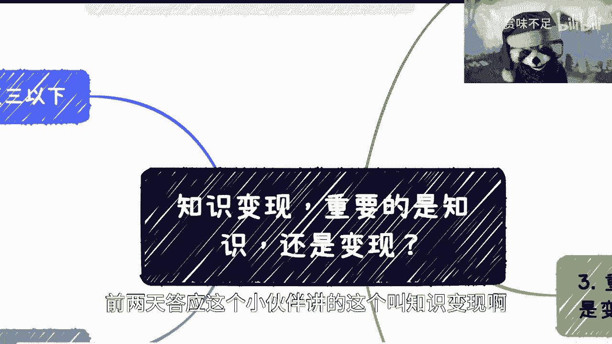
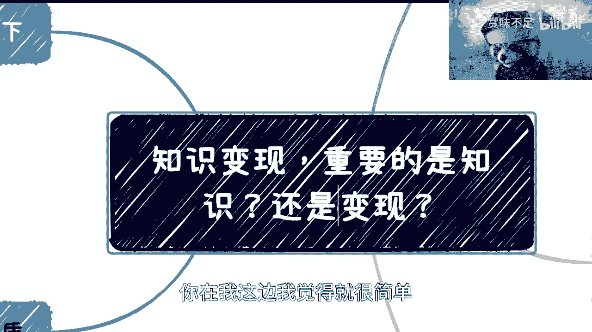
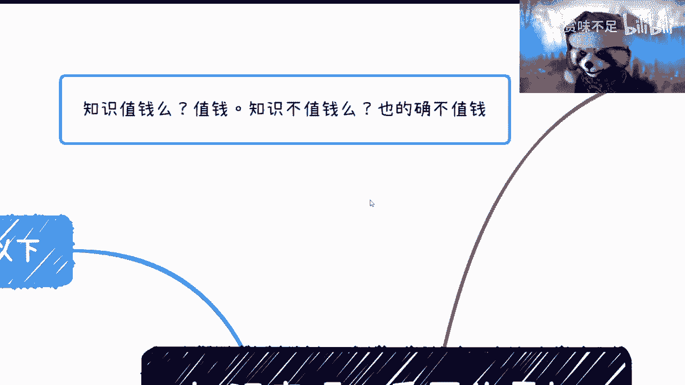
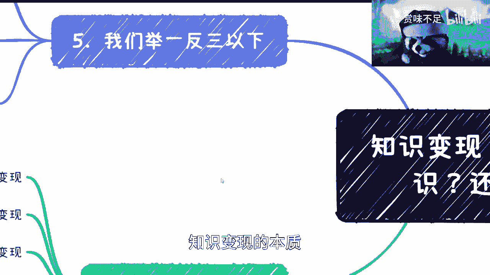
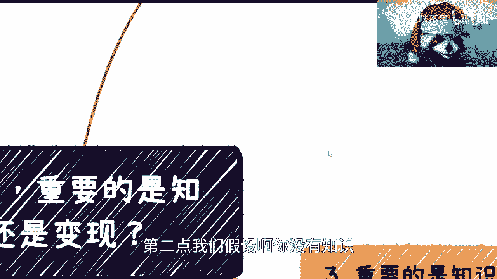
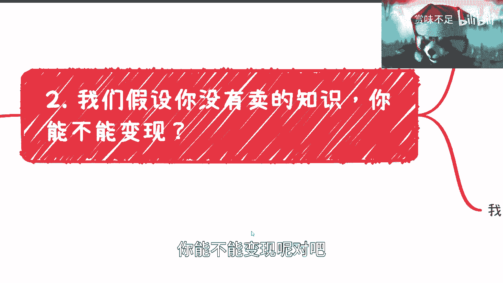
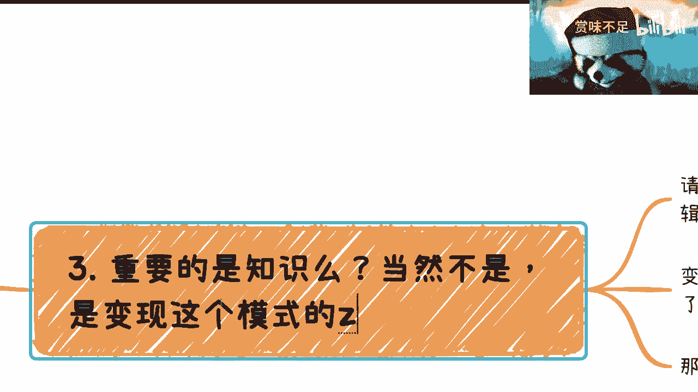
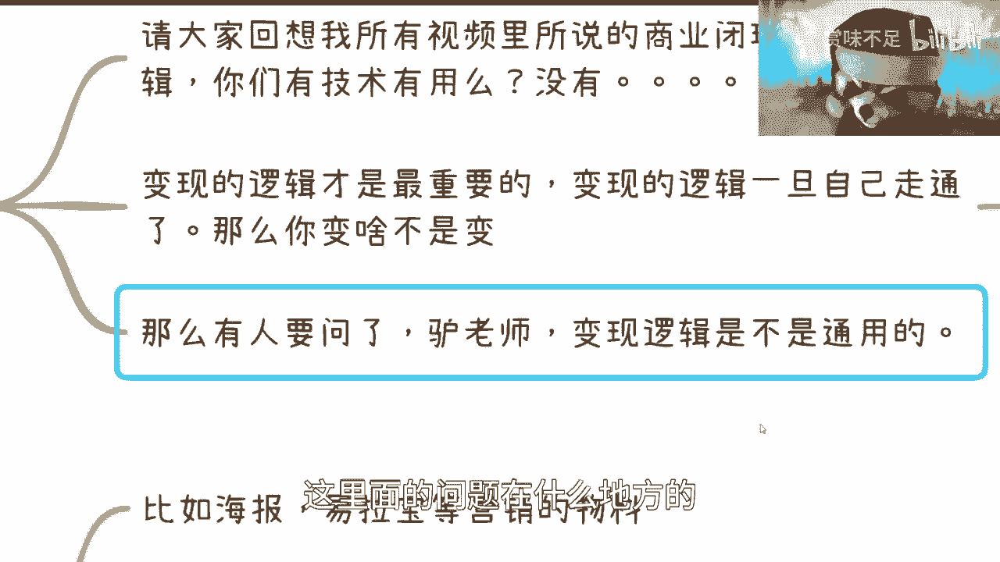
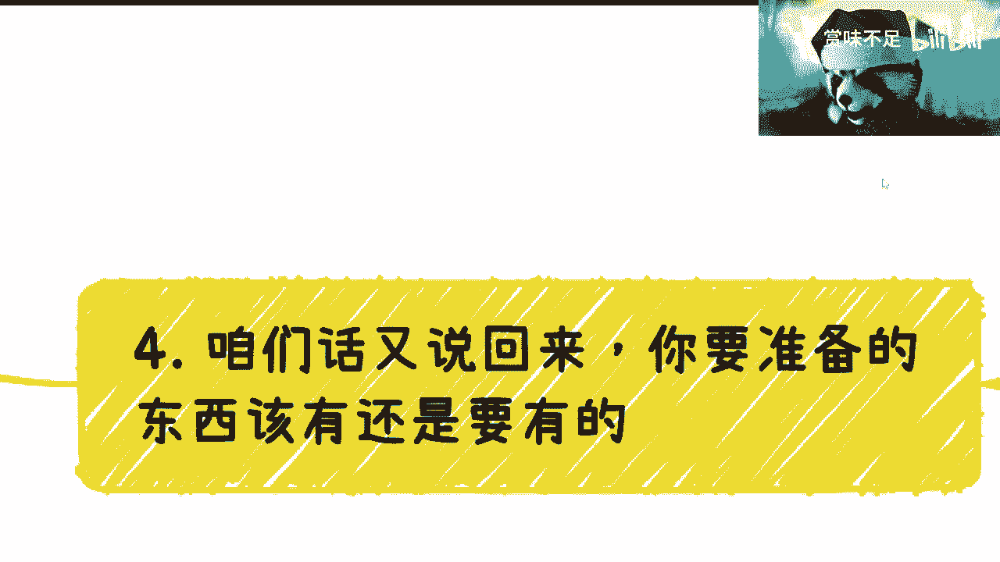
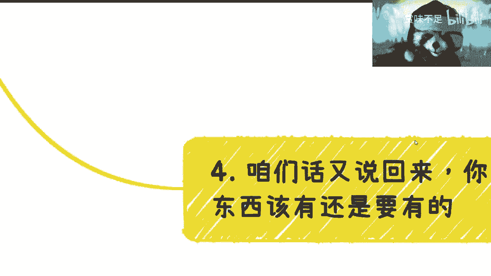

# 知识变现：核心逻辑与误区解析 - 课程 P1 🧠💰

在本节课中，我们将探讨“知识变现”这一概念的核心。许多人误以为知识变现的重点在于“知识”本身，但我们将揭示其真正的本质在于“变现”的逻辑与模式。我们将通过清晰的逻辑拆解和实例分析，帮助你理解如何绕过常见误区，抓住变现的关键。

---

## 1. 知识变现的本质 🤔

上一节我们提出了核心问题，本节中我们来看看知识变现的真正本质是什么。

知识变现的本质并非出售你掌握的某项具体知识（如Python编程或甲烷化学式）。其本质是掌握**如何将资源转化为收入**的模式与逻辑。这些模式通常包括以下几种：

以下是几种常见的变现模式：
*   **流量变现**：拥有私域流量（如几万人的社群）后，通过广告、带货等方式获利。公式可简化为：`收入 = 流量 × 转化率 × 客单价`。
*   **信息差变现**：利用他人不知道的信息获利，例如早期提供ChatGPT注册与使用服务。
*   **关系变现**：借助特殊人脉关系（如家庭背景）获取商业机会。
*   **天时地利人和（红利期）变现**：抓住某个领域的早期红利，如早期的房地产、互联网或直播行业。
*   **模式变现**：掌握并运用特定的商业营销模式获利，例如会销（会议营销）模式。

所谓“知识变现”，是指你懂得**流量变现、信息差变现、关系运作、识别红利期、操作会销**等这些“知识”。你要卖的不是“甲烷分子式”，而是“如何卖东西的方法”。

---

## 2. 没有“可卖的知识”，能否变现？ ✅

理解了本质后，一个自然的问题是：如果我没有任何值得卖的“知识”，还能变现吗？答案是肯定的。

我们以利用ChatGPT（GPT）热点为例，即使你完全不懂其技术原理，也有多种方式参与变现。

以下是几种无需深厚专业知识的变现路径：
*   **资源倒卖**：购买GPT账号，转售给需要的人。
*   **服务外包**：雇佣懂行的人提供GPT相关服务（如提示词优化、内容生成），你负责对接客户和营销。
*   **创建社群**：建立知识星球或付费社群，充当信息搬运工，从公开平台收集整理相关内容发布到社群内。
*   **内容引流**：制作关于GPT的短视频或文章吸引流量，后续通过广告或其他产品变现。
*   **组织培训**：举办线下培训班，内容可通过整合网络公开资料和行业报告来准备。
*   **方案包装**：将GPT与商业案例结合，包装成解决方案或咨询产品进行销售。

这些操作的核心要求不是懂得GPT的技术细节，而是懂得**如何找到客户、如何完成交易、如何设计盈利模式**。这才是你需要掌握的“知识”。

---

## 3. 为什么“变现逻辑”比“知识本身”更重要？ ⚖️

我们已经看到，没有专业知识也能启动变现。那么，什么才是决定成败的关键？答案是“变现的逻辑”或“商业闭环”。

拥有技术或专业知识，若无法转化为市场价值，其商业意义有限。这好比三个人：一个能独立造房，一个只能搭结构，一个只会堆火柴。如果三人都无法将自己的技能直接变现，那么在资本家眼中，他们的商业价值没有本质区别。

反之，如果那个只会堆火柴的人，设计了一套吸引人付费观看“花式堆火柴”的商业模式并能盈利，那么他就比前两者更具商业价值。

商业逻辑无法通过简单看书或听课完全掌握，因为它：
1.  **需要深度内化**：听到的理论最多吸收50%，必须结合自身实践。
2.  **无法直接复制**：成功的模式受具体资源、时机、执行者影响，无法`Ctrl+C/V`。
3.  **需要亲身实践**：必须自己走通从引流、转化到交付的完整闭环，才能理解关键节点。

因此，纠结于“选A技术还是B专业”意义不大，应思考“在A或B领域，有哪些可行的变现路径和潜在坑洼”。

---

## 4. 必要的“样子”与核心动作 🎭

虽然我们强调“变现逻辑”重于“知识本身”，但必要的专业形象和基础工作不可或缺。你不能空手套白狼。

在行动时，你需要做好以下基础准备：
*   **物料准备**：线上线下活动所需的海报、易拉宝等营销物料应准备齐全。
*   **基础体验**：对你所要涉及的领域（如GPT），至少要有最基本的使用体验。
*   **术语了解**：不需要深究技术原理，但需了解基本术语（如“预训练模型”、“Bard”、“New Bing”）。
*   **借力关系**：变现常需“借力打力，拉帮结派”，积极寻求合作，单打独斗很难成事。

同时，务必警惕一个误区：不要真的把自己变成那个“出售自己专业知识”的韭菜。舆论常鼓吹“用你的知识变现”，这容易让人误以为只需整理自己的技术就能成功。真正的重点在于**构建围绕（任何）知识或资源的变现模式**。

---

## 5. 举一反三：在“酒香也怕巷子深”的时代 🌐

最后，让我们将这一逻辑应用到更广阔的语境中。这是一个“酒香也怕巷子深”的时代，但规则可以被打破。

打破规则的前提是：要么你已掌握成熟的变现逻辑，要么你身处竞争不激烈的蓝海或红利期领域。例如，当前许多人想做副业的第一选择是“做IP、拍短视频”。但短视频行业已极度内卷，除非你有独特的变现模式或渠道，否则仅凭“技术好”很难脱颖而出。

在任何合作或项目中，**项目本身的内容或技术往往不是最重要的**，最重要的是支撑其运行的**变现模式与商业闭环**。这就像商业计划书，产品讲得再天花乱坠，若盈利模式不合理，也毫无意义。

因此，纠结于“读什么专业”、“打什么工”意义有限。真正的关键——“如何变现”——在学校和常规职场中很难学到。即便花费高昂学费攻读MBA，所学理论也常滞后于实践，且无法替代亲身踩坑获得的经验。

**核心建议是：你必须主动走出去，连接不同的人，获取多维信息，在实践中摸索属于自己的变现路径。** 永远在理论外围打转，而不跳入实践闭环，是无效的。

---

## 总结 📝

本节课中我们一起学习了“知识变现”的核心逻辑：
1.  **本质是“变现”**：知识变现的核心是掌握流量、信息差、关系、模式等变现方法的“知识”，而非出售某项具体学科知识。
2.  **专业知识非必需**：通过资源整合、信息搬运、模式复制等方式，即使没有深厚专业知识也能启动变现。
3.  **变现逻辑至上**：比拥有知识更重要的是设计并跑通一个完整的商业闭环和盈利模式。
4.  **形象与基础工作**：必要的专业形象和基础功课是信任的起点。
5.  **实践是唯一途径**：真正的商业逻辑无法完全从书本或课程中获得，必须通过实践、试错和与人连接来掌握。

希望本课程能帮助你扭转思维，从“我要卖我的知识”转向“我如何为任何东西设计变现模式”。