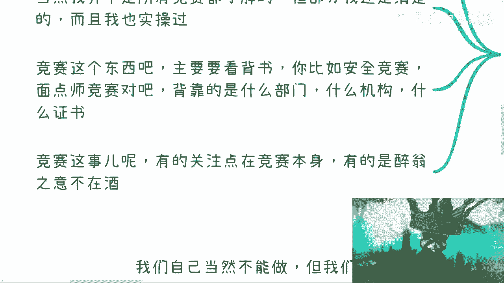

# 我们来谈谈竞赛这个事儿是不是慈善吧 - P1 - 赏味不足 - BV1nh4y1y7YC

啊大家好啊，这个最近小伙伴私信我说我没有以前啊，什么玩意儿，真的是麦克风差点炸啊，说我没有以前勤奋了啊。

我表示我要勤奋一下啊，我要勤奋了啊，我要勤奋了啊，呃然后之前小伙伴说让我来谈谈竞赛这个事儿，可以啊，嗯这个水很深，首先第一点啊，小伙伴问这个竞赛是不是纯公益的对吧。

一般怎么做啊，这个呢但凡看我视频看到现在的对吧，有点脑子的一定会明白，那他妈的哪来公益的事，对不对啊，公益啊，公益是什么意思啊，公益就是当你赚够了钱才叫公益啊，这是想多了啊，首先肯定不是公益的。

但是呢你说是不是暴力啊，这个得要分开来说啊，简单来讲什么意思呢，就是呃高情商啊，这个不是公益啊，但是也不见得暴利啊，低情商啊，这个也就是赚多赚少啊，那么当然啊我并不是说所有竞赛都了解啊。

部分呢我还是清楚的，我也实操过啊，那么竞赛这个东西呢主要看背书，你比如说安全竞赛了，面点师竞赛了对吧，什么什么各种鸟毛竞赛啊，很多很多哎呦我看这跟你们讲的老多了啊，啊但是但是呢我跟你们讲核心是什么。

核心是你要看这个竞赛背靠的是什么部门，什么机构，什么证书，然后呢竞赛这个事儿呢有的啊，我只能说少部分关注点是在竞赛本身。

但是大部分啊醉翁之意不在酒好。

那我们展开来说一下啊，首先先说竞赛本身这个事啊，一般都是背靠某个机构协会，人社部，然后呢当地的叉叉叉协会啊有很多，这个呢我跟你们讲，你们但凡这个在你们当地任何一个地方，就是各省市区，你们了解一下啊。

这里面我跟你们说，就是满地都是黄金，满地都是黄金啊，呃二呢竞赛本身啊其实目的是多种多样的，呃很多时候呢竞赛并不是一个竞赛，只不过是一个幌子啊，也就是说目的绝对不是在于竞赛啊，这个我们后面会讲啊。

竞赛本身呢它是可以申请政府补贴的啊，至于怎么申请，申请多少，申请的条件是什么，以及是否是单纯的补贴，以及或者说是根据你的啊，这个这个这个竞赛的，比如说投入按比例补贴等等等啊，这个都要看当地的政策。

也就是说这个东西每个地方不一样，但是这个东西一定是有明文规定的啊，无啊无非就是要么就是网上的网站啊，要么就是那个红头文件一定是有的啊，我在这个地方先跟你们说一点，我后面会给你们补个视频是什么呢。

就是所有的合作啊，你是一定要看到东西的，这个东西就是一定要证明他是个官方的东西，因为在商业市场上面，我们我可以说啊，就是啊别人我不知道啊，就我也好，我身边人也好，因为这个事情已经被坑了无数次了啊。

那么竞赛的频率啊，模式方法方式，以及其背靠主体和证书是有关系的啊，而且每种不同的证书，每种不同的部门啊，每个不同的切入点它都是不一样的，虽然你们从面上都叫精彩啊，而且我跟你们这么说。

就是大部分人你们竞赛啊，它是分成两个东西的，一个是对外的文件，也就是所谓的public公开的文件，还有一个是内部的叫做什么呢，叫做叫做竞赛的，比如说筹备文件，我就这么跟你们讲啊，对外的这种竞赛文件。

你们最多也就看到时间地点对吧，然后比如说流程对吧，然后竞赛比如说是怎么个竞赛法等等等，但是你们要知道内部的文件，就是这个筹划的文件，他起码可能有六七十页，七八十页哦，而且东西这东西里面东西很多很多。

而且这多呢都是钱啊，都是钱，那么竞赛本身呢还有一种啊，竞赛本身就算不赚钱，也是可以赚名的，那么呃截止到就是2022122年左右啊，大部分中国土地上面各省市区要去拿政府的钱，或者就是呃这种协会啊，学校啊。

就是办政府机构的钱已经很难了，所以说呢很多人变聪明了，他们做什么事情呢，他们不再是直接问政府要钱了，他会去问政府要明啊，然后用这个名去换钱，因为我跟你们讲，你们但凡操作过，你们就会知道直接要命去换钱。

比你们直接要要钱要来的爽的多的，多的多的多的多的多的多的多的多哦，而我这么跟你们讲，一直要命，一直爽，真的一直爽啊，嗯还有呢竞赛本身呢还有一种可能性，就是我之前说的那种是什么呢。

就是说纯粹为了完成KPI啊，就比如说一年啊，你必须是完成呃多少个多少个竞赛对吧，或者说对于一些管委会啊，对于一些对一些这种叫什么就是呃叫什么，就是运营方啊，某某某产业园运营方对吧。

或者某某某什么东西运营方这种都是有KK的，啊你们但凡去做过一些运营方，或者跟一些运营方交流过，你们就会明白他一年KPI里面一定是有的，什么什么小会啊，大会啊，竞赛啊一定是有的啊。

那么我们来说竞赛本身的目的啊，竞赛本身啊这个东西目的啊，啊这可真多了去了啊，我只能说只有大家想不到的，没有做不到的啊，而且当然我跟你们讲的也许也都是冰山一角啊，那么首先第一个啊。

有的竞赛是一种供应商的筛选以及idea的筛选，这就很简单了，我跟你们讲啊，就是说这竞赛啊看上去是一个竞赛啊，然后呢这个大家各司其职，各显神通对吧，就跟就就跟就是以前叫竞赛嘛对吧，现在我们叫什么叫hex。

对不对，黑客松啊，我跟你们讲很多的竞赛，很多的黑客松，它的本质都是一样的，你知道吗，就是说啊我们找一些供应商啊，找一些赞助商可能给点钱对吧，然后呢我们甚至可以集到global的，就是全球的id。

卧槽这多爽啊，对不对，其实就是在众筹啊，或者说你要我说的可能说的不好听点，就是白嫖对吧，其实就是白嫖，就是各种项目和各种供应商，各种id，这是第一种，第二种是什么呢，就是各省市区政府想要去做项目对吧。

但是政府又不知道哪些供应商靠谱，怎么办呢，哎那我们办个竞赛吧对吧，那里面挑选一些人啊，那个挑选一些不错的项目方做供应商，然后又要到说到这里啊，这个小伙伴要问了，他说有这么好的事情啊，那我去参加。

我不就成白名单供应商了吗，我跟你们讲，不好意思啊，你们如果得到了第一名，大概率你们并不是白名单供应商，而是你们是白名单的供应商的供应商，哈哈好懂吗对吧，这是第二点，第三点呢，第二种是什么。

就是有的竞赛呢，它就是纯白嫖啊和解决方案，那这个地方呢我可能都要提一点，就是什么呢，就是那些大学生竞赛呃，你去看有非常多的大学生什么创业竞赛啊，什么大学生什么叉叉竞赛啊，就还是那句话。

就是说他可以有赞助商，他也可以有第一名，第二名，第三名的奖，但是就是大学生的这个定位的竞赛啊，不管是从学校角度还是从这种协会和商业角度，基本上啊我可以说99。9啊，这个大学生都是被白嫖的啊，什么意思呢。

就是说就算啊最终这个项目有有有一些好处啊，或者是项目有一些东西，这个东西也落不到大学生手上，也就是说他落不到真正的操作和直接的人手上，他落到的是导师或或者导师是跪舔的，那个协会或者某一个机构上，对吧好。

那么这是第二个，第三个呢就是说有的竞赛呢其实是为了啊，有的竞赛呢其实是为了推广证书啊，这种人应该说是目的性最强的啊，而且是而且是可能性最高的啊，你们大部分看到的竞竞赛，基本上都是归属于某一类证书下面的。

而这些竞赛为什么要做竞赛，就是因为这些竞赛，它相比普通的那个呃培训考试来讲，它是能够跳级的啊，这是竞赛的优势，它是可以跳级的，而且还有些竞赛我在这个地方提一句，还有些竞赛的第一名哦。

第一名他是在某些地方的政策上面是可以，比如说给予更多的啊，比如说什么直接落户哦，直接怎么样，有的你们去了解，有的哦很牛逼的啊，那么还有的竞赛呢其实是为了推广软件平台啊，所谓的比如说考试平台啊。

培训平台啊，实训平台啊，嗯这个东西呢我可能得要这个强调一下，是什么呢，就是竞赛这个东西啊，它其实就是个幌子啊，就是个幌子，你们要知道啊，就是说真正的赚钱的东西，软件平台，考试平台，实训平台。

这种东西很赚钱，这种东西有的是靠卖账号赚钱，有的是直接靠采购赚钱的啊，我可以跟你们讲这个东西利润利润率有多少钱，我就不说了，利润率可以是两倍到30倍甚至50倍不等，就这么简单啊，你说不暴不暴力啊。

那就看你本事多大了啊，那么有的竞赛呢就是纯耗政府羊毛啊，就是需要这个补贴，要什么东西呢，那么简单来讲啊，竞赛这个事呢，可以说属于投入产出比极高的一个东西啊，因为这里面可以穿插的东西很多。

也可以笼络很多资源，什么意思呢，就是说今天如果你去做个竞赛，你不单单能够通过上面我们所说的这一切，一切一切去拿到你想要的东西，更多的是你可以通过这个竞赛去笼络，当地的政府以及高校。

以及任何一个你想去笼络的东西，为什么，因为这我们呃我们去跟政府合作，跟企业合作，我们一直提到一个东西叫什么叫抓手，对啊，这个词叫抓手，就什么叫抓手，就竞赛就是个很好的抓手。

因为你没有一个支点让你去很好的跟别人合作，你跑到那边，你跟别人说啊，那个我吹牛逼吹半天，人家问你，那你做什么的呢对吧，你现在手上有什么项目吗，好你不知道，你说我没有对吧，那这个就很难。

就是你一定要去找到个支点对吧，一个抓手，那么竞赛就是个很牛逼的东西啊，虽然你从我角度来讲啊，这他妈的是一个垃圾对吧，但是啊从商业角度来讲，从大部分人角度来讲，牛逼啊，就两个字牛逼啊。

那么接下来我们继续来说啊，你说我们能不能做呢，当然你说我们自己要做，我们肯定不能做，因为我们没有资质，但是我们自己呢也可以做啊，而且很容易怎么做呢，我们需要找到一个切入点，一个抓手啊。

那么寻找合作的协会，你就可以开始做了啊，一点毛病都没有的，或者找一个高校也可以的啊，那么我们的切入点呢可以很多，比如说啊你说我们可以提供软件，我们提可以提供专家智库哦，我们可以提供招生通道啊。

我们可以提供，比如说什么什么竞赛的题目啊，都可以，没什么问题的啊，你说我提供评委啊都可以啊，实在不行，你说我赞助点钱对不对。

那又有啥啥大问题呢，对不对啊，所以说呢就是说啊。

本质上这个东西玩法很多很多，那当然这个地方接下来啊呃内容啊。

我觉得差不多啊，就这些东西我希望大家能明白，但是呢我在这个地方提一点，咱们要举一反三，什么意思呢，中国这片土地上面类似于竞赛的这种东西，数不胜数不胜数啊，满满地都是什么意思呢。

也就是说满地都有这些既可以薅羊毛，又可以醉翁之意不在酒，又可以，这件事情本身我当做公益来做，但是背后我可以它的衍生品，可以赚很多钱的东西，很多很多很多这种东西只可以说多如牛毛啊，但是这也是为什么。

我一直包括所有的人看我视频，看到现在应该很明白了，就是你们的打工，你们的工作和整个商业世界，它是完全两个平行的世界，而且没有交集的对吧，这就好像这就好像我觉得我觉得是垃圾。

我觉得就是这些东西已经没什么花头了对吧，我觉得这个东西就是就怎么样，但是对于很多人来讲，诶，他根本就不知道这个东西，他甚至还会觉得卧槽，他妈的竞赛是一个慈善活动对吧，那那就就怎么说呢。

你说对吧啊所以说呢就是说类似的东西啊，其实在这片土地上很多很多啊，呃所以啊这也是为什么我一直跟大家讲啊，就是我们去看待一件事情的时候，千万不要只看它的表面，你看它的表面没有用的对吧，你要看它背后。

你往往觉得这件事情卧槽好像很很牛逼对吧，然后很慈善对吧，或者或者很很高大上很怎么样，但其实你要明白，再高大上的事情背后真正的操作方，真正的运营方没有什么技术含量的，就大部分我就说除除了你要造火箭是吧。

除了你要你要去什么卡，有些卡脖子的技术或者单光光刻机对吧，怎么样子，你剩下大部分总体我跟你们讲，你们但凡了解它的本质，你会发现这个东西的确有很多人就问我，他说他说刘老师按照你这说法，那他妈高中高中毕业。

大学就不要读了，可以工作呀，是的呀，你我哥，我今天就跟你们这么讲，你们回头去看看，你们但凡去了解了解，你们去告诉我有哪些事情，他妈的高中时做不了的都能做，有什么不能做的，没有什么不能做的呀，对不对。

就单纯从单纯的从执行角度来讲，毫无技术门槛，毫无任何的学历要求，毫无任何的认知要求干就完了，对不对，只不过是什么，只不过就是说由于信息的不流通，由于就是各方面的一些问题，导致大家对这件事情。

有自己的一个一个迷之幻想，有一个迷之歪歪在那个地方，所以觉得卧槽牛逼对吧，但其实对吧也就那样好吧行啊，那我就说这些吧啊这个再说下去，人都没了是吧嗯行，那就这样子啊，那个其他的啊。

这个大家有什么职业规划好吧，大家有什么啊商业的想法啊。

或者有些这个对于未来迷茫的点啊，这个可以整理好问题。