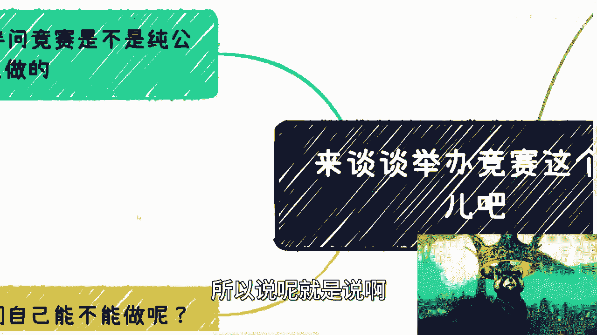

# 课程：竞赛的商业本质解析 - P1 🏆

在本节课中，我们将深入探讨各类竞赛（如安全竞赛、技能竞赛等）背后的商业逻辑与真实目的。我们将解析竞赛为何通常不是纯粹的公益活动，并揭示其背后多样化的运作模式和盈利点。

---

## 竞赛是公益还是商业？🤔

上一节我们介绍了课程主题，本节中我们来看看竞赛的基本属性。

竞赛并非纯粹的公益活动。公益通常是在赚够钱后才考虑的行为。竞赛首先肯定不是公益的。

但是，竞赛也未必都是暴利行业。高情商的说法是：这不是公益，但也不见得暴利。低情商的说法是：这只是赚多赚少的问题。

---

## 竞赛的核心：背书与目的 🎯

上一节我们明确了竞赛的商业属性，本节中我们来分析其核心运作要素。

竞赛的核心在于其“背书”，即竞赛背靠的部门、机构以及颁发的证书。竞赛的种类繁多，但大部分竞赛的关注点并不在竞赛本身，而是“醉翁之意不在酒”。

竞赛本身可以申请政府补贴。申请方式、金额和条件取决于当地政策，这些信息通常有明文规定，例如官方网站或红头文件。

在商业合作中，必须看到官方证明文件。市场上因此类问题受骗的情况屡见不鲜。

竞赛的频率、模式、方法与其背靠的主体和证书类型密切相关。虽然表面上都叫“竞赛”，但内在差异巨大。

---

## 竞赛的两类文件 📄

上一节我们提到了竞赛的多样性，本节中我们来具体看看支撑竞赛的两类关键文件。

大部分竞赛涉及两类文件：
1.  **对外公开文件**：包含时间、地点、流程等基本信息。
2.  **内部筹备文件**：可能长达六七十页，包含大量细节，而这些细节往往与“资金”密切相关。

即使竞赛本身不赚钱，也可以赚取“名声”。截至2022年左右，直接从政府或相关机构获取资金已变得困难。因此，许多人转变思路，改为争取“名望”，再用名望去换取资金。这种方式通常比直接要钱更有效。

此外，有些竞赛纯粹是为了完成KPI。例如，一些产业园运营方或机构，其年度KPI中明确包含举办若干会议或竞赛的任务。

---

## 竞赛的多元目的 🎭

上一节我们了解了竞赛的运作文件，本节中我们来剖析竞赛背后五花八门的真实目的。

竞赛的目的多种多样，以下是一些常见类型：

以下是竞赛的主要目的分类：

1.  **筛选供应商与创意**：许多竞赛或“黑客松”的本质是众筹创意和解决方案。主办方通过竞赛汇集全球的项目创意和潜在供应商，这实质上是一种高效的资源筛选方式。
2.  **政府项目的前期调研**：地方政府为了启动项目但不确定哪家供应商可靠，会通过举办竞赛来筛选优秀的项目方。但需要注意的是，竞赛的优胜者往往并非直接成为政府的“白名单供应商”，而可能成为白名单供应商的次级合作方。
3.  **低成本获取解决方案（特别是大学生竞赛）**：许多面向大学生的创业或创新竞赛，其本质是“白嫖”学生的创意和劳动力。即使项目最终产生效益，利益也大多流向导师或关联机构，而非学生本人。
4.  **推广证书**：这是目的性最强、也最常见的竞赛类型之一。竞赛相比普通培训考试的优势在于可以“跳级”获取证书资格。某些竞赛的优胜者还可能获得如直接落户等特殊政策奖励。
5.  **推广软件或平台**：竞赛有时只是幌子，真正的盈利点在于推广配套的考试平台、培训平台或实训软件。这些软件通过销售账号或直接采购获利，利润率可能极高。
6.  **获取政府补贴**：部分竞赛的主要目的就是申请和消耗政府提供的专项补贴。

---

## 竞赛作为商业“抓手” 🤝

上一节我们列举了竞赛的各种目的，本节中我们来看看竞赛在商业合作中扮演的特殊角色。

竞赛属于投入产出比极高的活动，因为它能穿插多种资源并实现多重目的。更重要的是，竞赛是一个绝佳的“商业抓手”。

“抓手”是指一个支点，能让你有效地与政府、高校等各方展开合作。如果你空有想法而没有具体项目，合作很难推进。竞赛就是一个现成的、有力的合作项目。虽然其本身可能技术含量不高，但从商业拓展角度而言，它非常“牛”。

---

## 个人如何参与竞赛运作？💡

上一节我们了解了竞赛的桥梁作用，本节中我们来探讨个人或小团队如何切入这个领域。

我们自己没有资质主办竞赛，但可以参与运作。关键在于找到一个“切入点”或“抓手”。

以下是寻找合作切入点的几种方式：

*   **寻找合作协会或高校**：与有资质的协会或高校合作是起点。
*   **提供资源**：你可以提供软件支持、专家智库、招生渠道、竞赛题目或评委资源等。
*   **提供赞助**：直接提供资金赞助也是一种直接的参与方式。

本质上，竞赛的玩法多种多样，关键在于找到自己的优势并与之结合。

---

## 举一反三：类似模式遍地开花 🌱

竞赛只是中国商业环境中一种特定模式的代表。这片土地上充满了类似的事物：它们表面可能像公益，或有一个高尚的名义，但醉翁之意不在酒，其衍生品可能带来丰厚利润。

这类机会多如牛毛。许多打工者所处的世界与真实的商业世界是平行的，缺乏交集。我们认为稀松平常或已无新意的模式，对很多人而言可能仍是未知领域。

看待事物不能只看表面。许多看似高大上的活动，其背后的运营逻辑可能并无太高技术门槛。从单纯执行的角度看，很多商业活动对学历、认知的要求并不像想象中那么高，核心障碍往往在于信息不对称。

---

## 总结 📝

本节课中我们一起学习了：
1.  **竞赛的商业本质**：竞赛通常不是慈善，而是带有明确商业目的的活动。
2.  **核心运作要素**：竞赛的核心在于其“背书”（主办机构、证书）和内部筹备文件。
3.  **多元化的真实目的**：包括筛选供应商、获取创意、推广证书/平台、完成KPI、获取补贴等。
4.  **作为商业“抓手”**：竞赛是连接政府、高校、企业资源的有效工具。
5.  **个人参与路径**：可以通过提供资源、赞助等方式与有资质的方合作切入。
6.  **模式的普遍性**：类似“竞赛”这种“表里不一”、蕴含商机的模式在社会中广泛存在。

关键在于，要培养穿透表面看本质的能力，识别出各类活动背后的真实逻辑与机会。