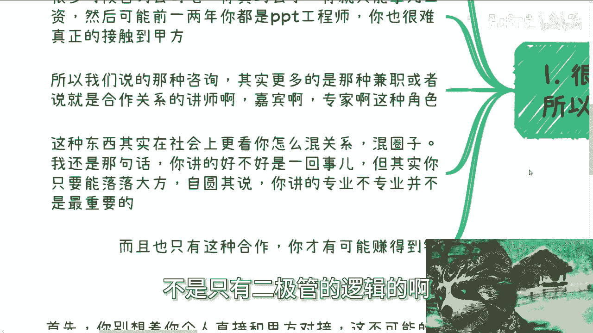
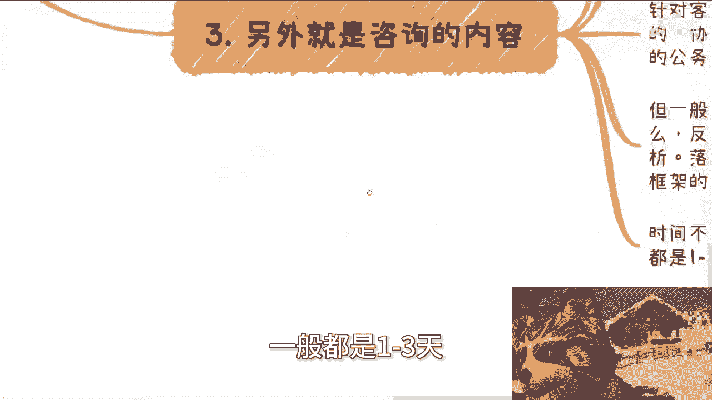
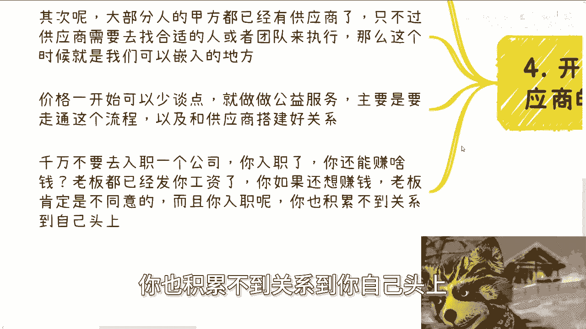
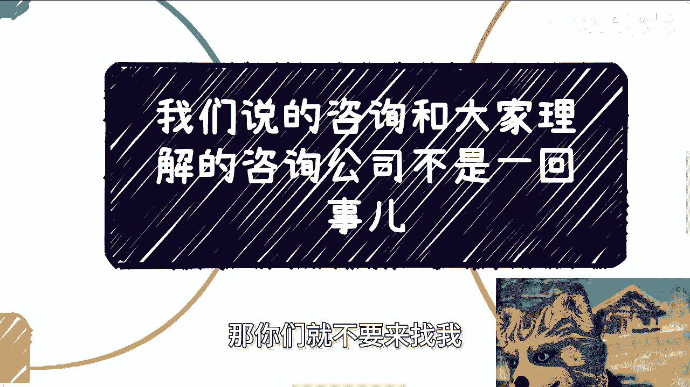

# 我们的咨询和大家理解的入职咨询公司不是一回事儿 - P1 - 赏味不足 - BV1js421g7GN

嗯好大家好啊，这个今天我们来讲的这个内容呢。

是说我们说的这个咨询啊，跟大家理解的这个咨询公司啊，它不是一回事。

就我发现很多人可能对这个咨询这个，这个我讲的这个业务啊，他有误解啊，就很多时候入职。

你记住啊，入职是赚不到钱的，所以我们说的呢都是外部合作，因为中国这个市场啊，很多时候都是讲究那句话的，叫外来的和尚好念经啊，所以说首先啊，很多咨询公司门槛其实还是很高的。

呃很多小伙伴呢在听到我说这个咨询的时候呢，也会有有误解，就觉得是不是说要去咨询公司上个班啥的啊，那么你记住一点，很多时候咨询公司啊，你真的去了，你就只能拿死工资，然后很有可能前两年呢你都是PPT工程师。

你也很难真正的接触到甲方呃，所以说我们说的那种咨询啊，其实更多的是那种指的以合作关系，商业合作关系的讲师啊，嘉宾啊，兼职讲师啊，专家啊这种角色哦，那么这种东西呢，其实在社会上就看你怎么混关系啊，混圈子。

那我还是那句话，你讲的好不好是一回事，但是你需要有你的台风，你需要落落大方，你需要能自圆其说呃，我可以我可以很这个负责任的跟你讲，你讲的专不专业真的不是最重要的哦，就是你在上面。

比如说你能够像脱口秀一样去讲啊，你能够能够能够抓住对对方的这个这个吸引力，能够让他们不要去看手机或者怎么样子，这就是你的能力，而专业不专业真的不重要啊，那当然这个地方可能有很多小伙伴也很疑惑啊。

他就说那你这种兼职的方式，那人家咨询公司都养着全职的这种讲师啊，或者嘉宾啊，那人家为什么找你呢，对吧，我跟你们说啊，世界很大，不是所有咨询公司都有嘉宾的，也不是所有培训公司都有嘉宾的。

也不是所有的单子都是培训公司，咨询公司接的，你懂吗，就是中国是有非常多的第三方服务公司，而这种服务公司是只有商务的，没有讲师的，为什么，因为他们养着讲师，养不起就浪费时间，你懂吗。

那这个时候就需要我们这种角色，就方式很多很多，不是只有二极管的逻辑的啊。

那么我们再回到这里啊，而且就是说只有这种合作呢，你才有可能赚得到钱，因为你以外部合作方式，你才有可能开价嘛对吧，你你到里面你说入职了，你都已经劳务合同了。

开屁价对吧啊，那么第二混圈子呢是两种方式混圈子这个事啊，一种是通过kiss，通过合作来混，另外一种呢就是不停的刷脸啊，那么不停的刷脸呢，就顾名思义就是说你得不同的呃。

不停的去参加参加不同的这个圈子的任何活动，你别去管他高大上还是low的都参加你，因为你没别的办法，你否则怎么刷圈子呢，你怎么刷哦，你在网上这个发发就能刷了，你刷不动的呀，对不了。

其实一个圈子活动我跟你讲并不多啊，真正折腾的人呢也不是很多，我跟你讲，你去的要足够多啊，那么你一定混的熟啊，那么另外一点呢，另外一个呢就是不停的通过case合作的case。

比如说你今天去哪个地方做分享了，明天去哪个高校做分享了，后天去哪个线上的什么论坛做分享了，你就得刷啊，而且其实相当于是就说你线上线下都得刷，你相当于就是自己不停的拓展你的影响力。

然后目的就是为了为了让别人知道你，那当然啊补充一点额，那就是别着急啊，因为很多小伙伴我发现现在很浮躁，就是他做嘛做的那么做了个一两天就跟我说，哎呀不行，做不了对吧，那我跟你讲啊，无论前者还是后者。

他都是需要比较漫长的时间去沉淀和积累的，一样的呀，对不了，那那你不能说哦，我高考对吧，你说我读书读了这么多年对吧，就你想6年加3年，9年对吧，你说你说我高啊，不是不是9年了，你后面还有那个啦。

你后面还有还有高中了对吧，就是你读了这么多年，你说你不能说哦，高考我读这么多年，然后我到社会上，现在去混圈子去准备赚钱了哦，一两天切你，你对吧。

哦所以说就说你不是一两场，或者认识几十个人就够的，他不够啊啊那么第三就是咨询的内容啊。

就是咨询行业，如果你入职的话呢，就如我一开始说的，你很有可能短期内都是PPT工程师，也就是不停的跟着别人，或者所谓的那些老人去做，其实你自己是没有做不了什么，也积累不了什么的，那么我们说的那种兼职啊。

或者说kiss by kiss的分享的演讲的方式呢，更多的其实还是培训，或者说一种就是说现场问答的方式，那么针对客户，也就是说是中小微企业啊，或者来说嗯一些大厂啊，也有可能是商会组织的啊，协会组织的。

研究院组织的，反正就是各地方都会组织啊，也有可能是政府组织的公务员内训，什么都有可能啊，但是一般呢你的内容啊无非就两个，一个是宏观趋势，一个是落地技术，那么宏观趋势呢，反正就是说啊。

国内外的发展趋势和国内的案例分享，落地技术呢肯定是在对应的这个行业里呃，对应的这个领域里面呢一定会有具体的框架，那么你主要是去讲解这个框架的部署啊，呃框架的API啊，框架的一些呃sample啊对吧。

一些等等等，就这些东西啊，那么无非就这些东西还能有啥呢对吧，而且时间一般不会太长，高校的话一般都是1~5天，其他的话呢一般都是1~3天。

不太会超过三天的哦，很少很少很少啊，那么第四就是开始的很长时间呢。

你只能呃提额，你只能是供应商的这个合作方，那么首先呢你别想着个人直接跟甲方对接，这是不可能的，因为这个符不符合中国的整个的这个这个，这个社会运作规律啊，那么其次呢。

大部分人的甲方呢就已经都已经有供应商了，只不过供应商需要去找合适的人，或者团队来执行，那么这个时候就是就是你我啊，可以就是趁虚而入，或者说找到了一个突破点的一个地方，那么价格一开始呢可以少谈一点。

就做做公益啊，主要是要走通这个流程，以及和供应商搭建好关系，那么千万不要去录制一个公司啊，就是你记住一点，你入职了啊，包括你说你去学校当老师也是一样的，你入职了，包括你去学校当老师，你还能赚个屁。

什么意思呢，因为你在里面是受到约束的，你你你说老板给你看发工资，或者你在那个去那个学校里面做老师，你还想在外面去赚外快或者赚一点钱，其实风险是很高的对吧，你就是就是就是人家可以给你扣扣锅啊。

就是说啊你这个这个泄露机密对吧，你你可能比如说叫什么，有有有就是合同上面或者怎么样子说，你不能在另外地方再去赚钱啊，或者怎么样子，这个很烦呐，而且你入职了之后呢，你也积累不到关系到你自己头上。

因为你积累的关系，往往都是你所在的企业跟高校的头上对吧，所以说啊就是你们思考问题的时候，不要就说非常死板的，就说啊陈老师说这个地方有关，有有那个有那个什么切入点对吧，我们录个直，我跟你讲啊。

最最搞笑的是什么，就是很多人说哎那你说要政府关系对吧好，那我先去考个公务员，不是呵就很离谱，就是说你想想看啊，你进去有没有可能积累到，当然有可能，你进去找能不能找到很多公务员也可以。

但是你有没有想过一个问题，你能走到多多大的职级，你能积累到多大职级的这些人，你积累到了之后，你又如何，人在里面的时候去赚这个钱，你有没有想过对吧，就是说你有没有想过，如果你积累的下来，这是多大的比例。

多大的概率，然后如果你想赚这个钱，你还得在外面找白手套，或者你还得辞职自己出来干，就就你不觉得这个曲线就会救的过于离谱啊，对吧，就公务员，你在里面我们需要找点关系，或者说找到对应的人，你有千千万种方式。

你可以正规的去打电话去拜访，你，也可以正规的在线下的活动认识，你也可以怎么样，为什么，因为因为他妈无，无论哪个地方，这些人也是人啊，他们也要社交啊，他们也有焦虑，他们也得扩展自己的关系。

你现在怎么认识认识不到呢，总归认识得到的呀，对不对啊，你说我我难道非要去录个职吗，啊哦非要去做考个公，你就气笑了，你知道吗，哦好吧，就是就是我希望就是大家做事情呢，反正就是说切中目的一点。

你说你要是为了赚钱就直白一点，不要绕对吧，就是你绕到最后不还是要绕自己的时间吗，还不是浪费自己的时间吗，这没必要啊，啊好吧行好吧，那么这个事我我跟你们讲明白了啊，就不是跟咨询公司一回事啊。

不要想着就是说啊，陈老师说咨询说咨询说了这么长时间啊，我们去投个咨询的简历，那那真的是我，我真的给你们跪了，磕头了，好吧啊好，那就这么着啊，然后那个职业规划啊，商业规划额合同嗯啊合同啊，简呃不是合同啊。

简历啊，分红啊，分润啊啊，然后什么呃商业计划书啊啊这个白皮书啊对吧，包括你们手上有什么牌，你们手上没有什么牌，你们希望跟我的沟通啊，希望通过我的视野能够结合当下的经济情况。

跟整个全国的这个情况给你们一些建议啊，或者来说一些方向，或者更好的一些这个规划的话，那么你们可以整理好个人的问题和啊，对对应的个人背景，然后我们再来走详细的咨询好吧，然后呢我也补充一点。

就是呃所有的事情都是你们对你的人，对你们自己负责，你们要去实践，都是你们要去进步，都是需要通过实践的，不要把筹码全部压在跟我的咨询上面，好吧，如果你们孤注一掷，说OK所有东西都是陈老师负责啊。

就是咨询完了一定要有一定要有改变啊，你们哪怕不实践也有改变，那你们就不要来找我哦。

