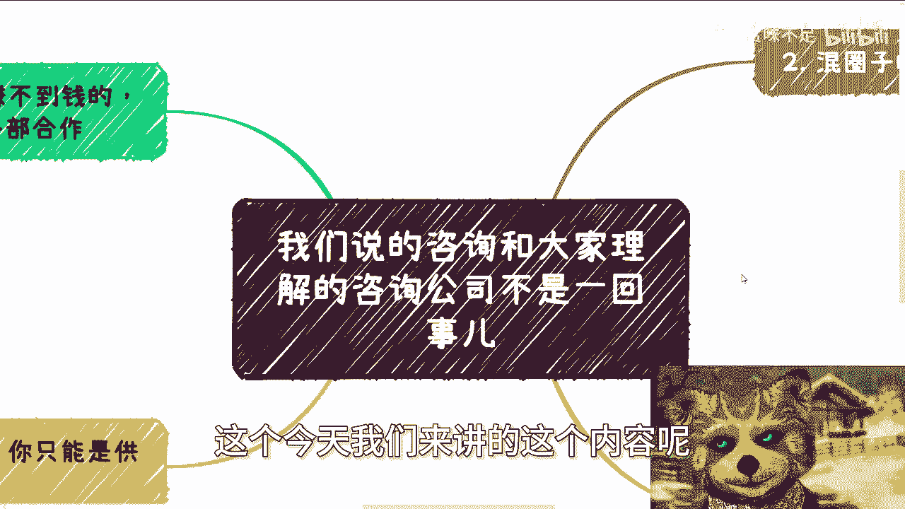
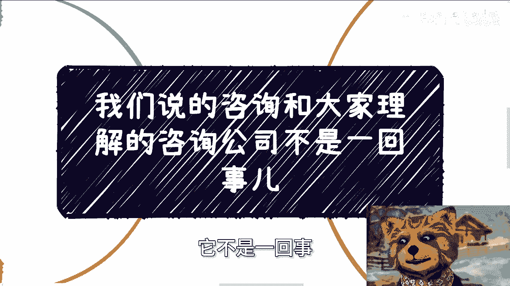
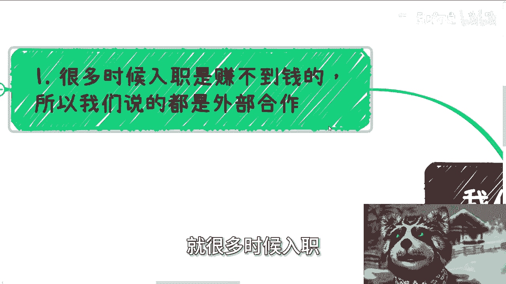
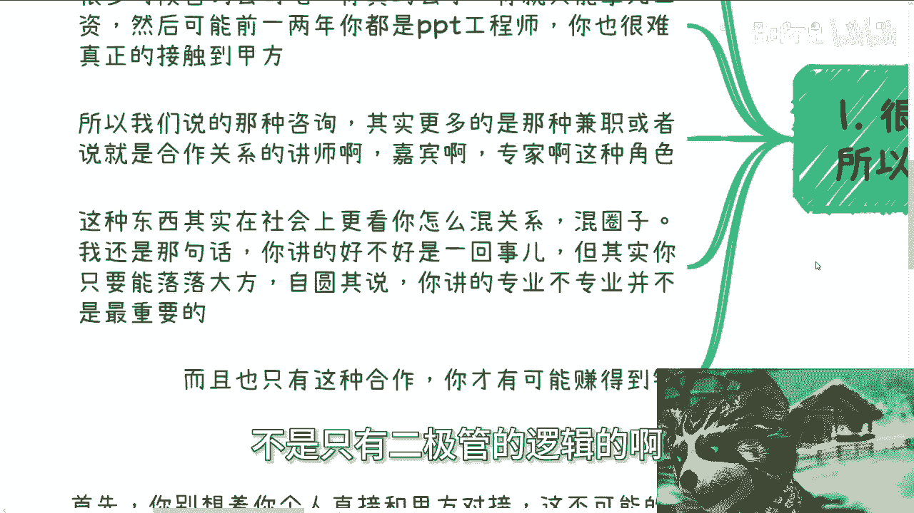
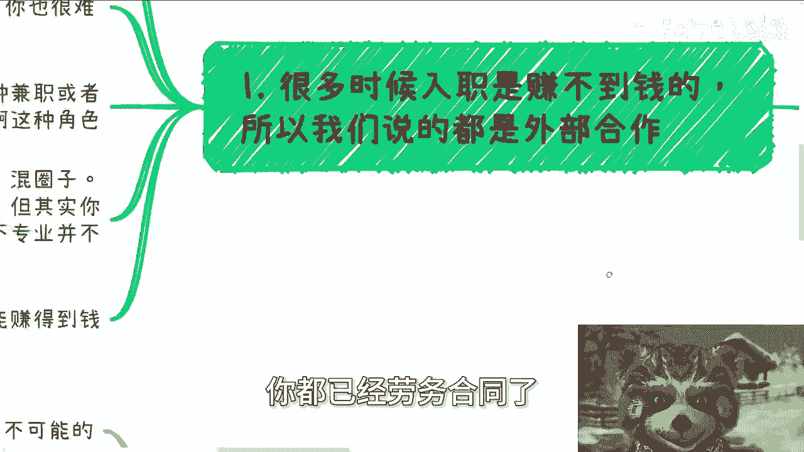
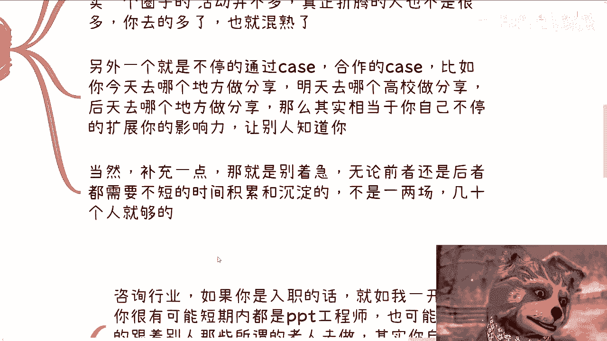
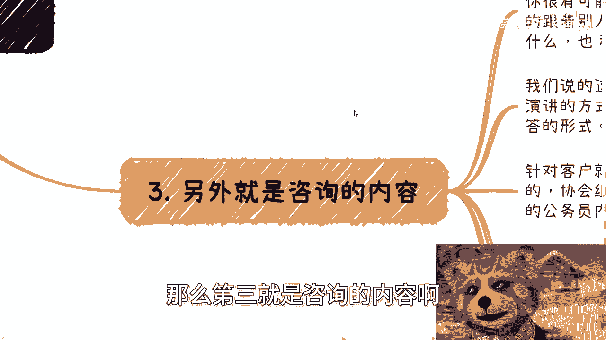
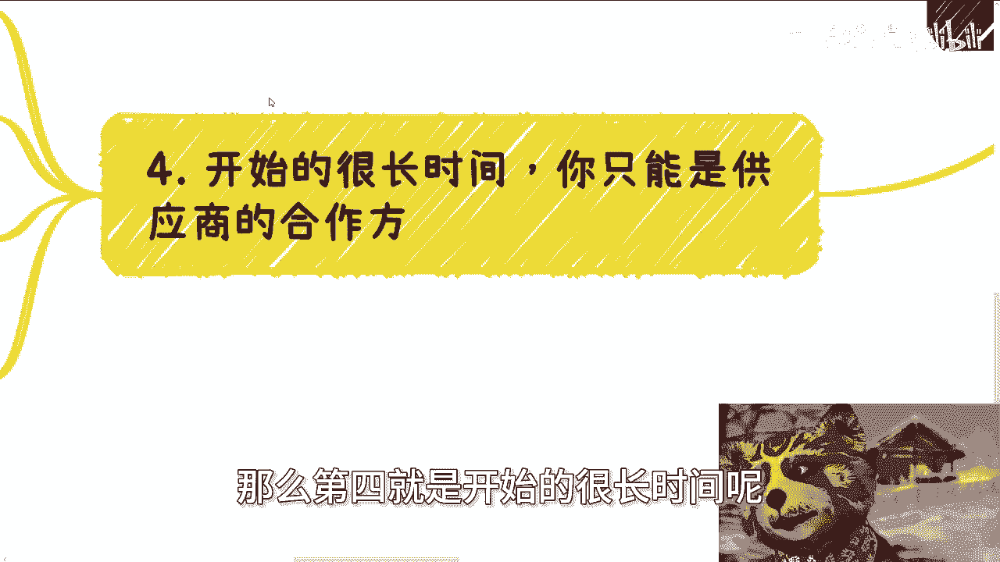
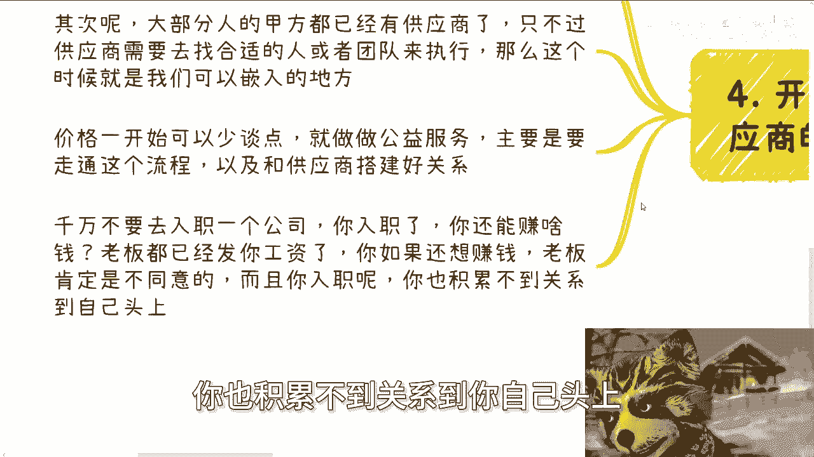
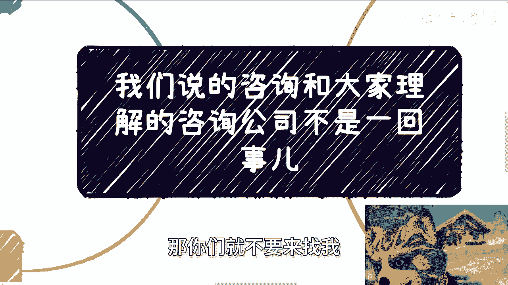

# 课程一：咨询业务模式解析 🧭

在本节课中，我们将要学习一种特定的“咨询”业务模式。这种模式与我们通常理解的入职咨询公司工作完全不同。我们将从合作模式、个人发展路径、内容构成以及起步策略四个方面，清晰地解析这种以外部合作为核心的咨询工作。

---

## 1. 核心模式：外部合作而非入职

上一节我们明确了学习目标，本节中我们来看看这种咨询业务的核心模式。

我们所说的咨询，与大众理解的入职咨询公司不是一回事。

很多人可能对我所讲的咨询业务有误解，认为需要入职公司。请记住，入职是赚不到可观收入的。我们讨论的都是外部合作。因为在中国市场，很多时候“外来的和尚好念经”，外部专家的身份更具价值。

许多咨询公司的入职门槛很高。当听到“咨询”时，不要误解为去咨询公司上班。入职咨询公司，通常只能获得固定工资，并且前几年很可能只是“PPT工程师”，难以真正接触甲方客户。

我们所说的咨询，更多是指以商业合作关系存在的角色，例如**讲师、嘉宾、兼职讲师、专家**。这种角色在社会上依赖于混圈子和经营关系。

你的演讲专业度并非最重要。关键在于你的台风、表现力以及吸引听众的能力。你需要落落大方，能够自圆其说。就像脱口秀演员一样，能抓住听众注意力，让他们不玩手机，这就是你的核心能力。

可能有疑问：咨询公司有全职讲师，为何需要外部兼职？世界很大，并非所有咨询或培训公司都养着全职嘉宾。中国存在大量第三方服务公司，它们只有商务人员，没有讲师，因为长期供养讲师成本过高。这时就需要我们这样的外部合作者。合作方式多样，并非非此即彼。

---

## 2. 发展路径：混圈子的两种方式

理解了核心的合作模式后，本节中我们来看看如何进入并拓展这个圈子。

只有通过外部合作，你才有可能获得高报酬，因为你拥有定价权。一旦入职签订劳务合同，便失去了议价空间。

混圈子主要有两种方式：

以下是两种具体的混圈子方法：
1.  **持续刷脸曝光**：你需要不断参加各类圈子活动，无论活动规格高低。这是没有其他资源时必要的方法。真正的行业活跃者并不多，只要你参加得足够多，就一定能混熟。
2.  **通过项目合作积累**：例如，今天去某企业做分享，明天去高校演讲，后天参加线上论坛。你需要线上线下同时拓展影响力，目的就是让更多人知道你。

补充一点：切勿急躁。许多人心态浮躁，尝试一两天就说做不了。无论上述哪种方式，都需要漫长的时间去沉淀和积累。这就像读书考学，需要多年的持续投入，不可能一蹴而就。

你不是参加一两场活动或认识几十个人就足够的，这远远不够。

---

## 3. 内容构成：宏观趋势与落地技术

明确了发展路径后，本节中我们来看看这种咨询具体讲什么内容。

在咨询行业，如果选择入职，短期内可能只是“PPT工程师”，跟着资深员工做事，自己难以积累独立项目经验。

而我们所说的兼职或按项目合作的分享，形式更多是培训或现场问答。客户可能是中小微企业、大厂，也可能是商会、协会、研究院或政府组织的内训（如公务员培训）。

你的演讲内容通常围绕以下两个核心：

以下是咨询内容的两个主要方向：
1.  **宏观趋势**：讲解国内外行业发展趋势，并分享国内的相关案例。
2.  **落地技术**：在特定领域内，讲解具体的技术框架。这包括框架的部署、API使用以及示例（Sample）等。公式可以概括为：`演讲内容 = 宏观趋势分析 + 具体技术框架讲解`。

内容基本围绕这些展开。培训时长方面，高校课程通常是1-5天，其他场合则多为1-3天，极少超过三天。

---

## 4. 起步策略：从供应商合作方开始

了解了内容构成，最后我们来看看如何迈出第一步。

在开始的很长时间里，你只能作为供应商的合作方。

首先，不要幻想以个人身份直接对接甲方客户，这不符合中国社会的普遍运作规则。

其次，甲方的业务通常已有固定供应商承接，但这些供应商需要寻找合适的个人或团队来执行具体项目。这里就存在我们的机会，可以作为一个突破口切入。

关于起步阶段的定价，初期可以少谈报酬，甚至以公益形式进行。主要目的是走通整个合作流程，并与供应商建立稳固关系。

**千万不要为了获取关系而去目标公司或单位入职**。这包括去学校当老师。一旦入职，你将受到诸多限制（如合同约束、竞业条款），想在外面赚取额外收入风险很高。而且，入职后积累的人脉关系属于公司或学校，而非你个人。

思考问题要抓住本质。例如，有人说需要政府关系就去考公务员，这非常离谱。你需要思考：入职后能积累到多高级别的关系？积累后如何在体制内变现？概率多大？曲线救国的过程是否过于曲折？

认识人的方式有千万种，可以通过正规拜访、线下活动等途径接触。对方也是人，也需要社交和拓展关系。总有方法可以认识到，绝非只有入职一条路。

做事情要切中目标。如果是为了赚钱，就直接奔着赚钱的方式去，不要绕远路浪费自己的时间。

---

## 总结

本节课中我们一起学习了一种独特的咨询业务模式。我们明确了它**不是入职咨询公司**，而是以**外部合作为核心**的讲师或专家角色。成功的关键在于**混圈子**（刷脸与合作积累）和**个人表现力**。演讲内容聚焦于**宏观趋势**与**落地技术**。起步时应从**供应商的合作方**做起，积累经验和人脉，切忌通过入职目标单位来获取关系的迂回策略。记住，所有改变都需要你亲自去实践和推进。