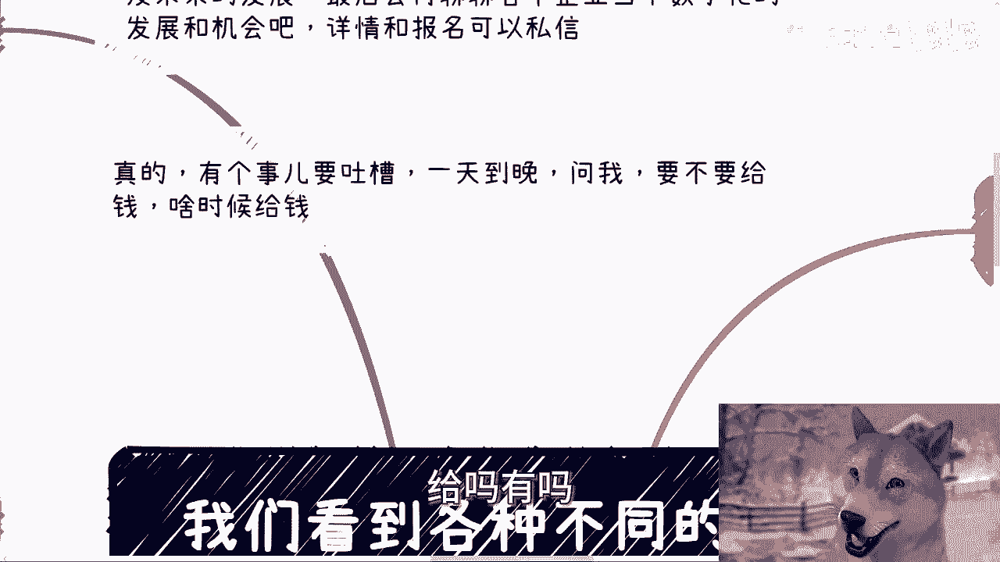

# 我们看得到各种不同的头衔介绍的思考方式 - P1 - 赏味不足 - BV1Ym421G7TN

好大家好啊，这个我是狗子啊。

我是狗子啊，哼是不是大家好像喜欢很喜欢这个狗子啊，因为我能给你们看到对吧，如此怎么说呢，智慧的眼神，啧啊嘶额好，那个这个言归正传啊。

这个下一期活动我已经定了，7月13号，7月13号在南京，南京啊，下午大概一点到六点这个样子，我头像太大了一点，稍微稍微小一点啊。

呃内容主题的话，一个是低空经济，一个呢我会给大家分析一下民企国央企，大厂，外企就当下入职的优缺点，跟一些啊未来的方向啊，然后最后呢聊聊当下企业数字化，包括数字经济发展的一些机会好吧。

然后详情和报名可以私信，OK好，然后呢有个事啊，有个有个事我真的要吐槽一下，就是一天到晚沟通的时候啊，就是你们知道吗，就是你们有有有很多人他会问出一些问题，然后让我觉得非常莫名其妙，就是他们问我。

他说陈老师我们跟别人合作，比如说他们要去邀请嘉宾，或者要去找场地对吧，或者怎么样，他就问我要不要给钱，什么时候给啊，然后他说我亏了怎么办，呵哼我这就把我气笑了，你知道吗，就是哎大哥，你要不要给钱。

不是你定的吗，我还有人他妈的拔刀架你脖子上，逼你给钱吗，你什么时候给你跟对方聊啊，对不对，亏不亏你自己算呐啊啊我操，我发现他妈的真的大家读书吗，读傻了是吧，对不对，哎你在社会上亏不亏钱，什么时候给钱。

你要不要给你定啊啊卧槽，有哪个法律规定说你什么时候给，或者你给不给嘛。

有吗，没有啊啊，懂不懂啊，懂不懂，就是你们做生意，大家为什么要去做生意，不就是为了赚钱吗，哦你现在反过来问我，我要不要给或者怎么样子，大哥你最终算的是利润，你利润怎么高，怎么来听得懂吗。

这他妈也要我交吗，我他妈也不明白了，卧槽我跟你们讲，我真的不明白啊。

好然后今天主题啊，是我们看到各种不同的这个头衔啊，介绍的这个反应啊。

这个其实好多小伙伴呢日常也碰见啊，然后也不知道怎么判断啊。

然后问我也比较多啊，我们这么说分成几种，一类呢是企业的啊，一类是协会的对吧，一类是这个呃协会协会的，一类是联盟组织类的，一类是产业园，生态园，创业创业园类的，然后最后一类就是政府类的啊。

其实啊我跟你讲这事也容易，我们跟别人聊的时候，一般不看抬头啊，因为我们说难听点，大家都都都他妈的是老江湖了对吧，就是啊你你这个双方心知肚明，当然啊，对你们来讲可能不是因为你们年纪还轻嘛对吧。

但你们可以参考我们的这个做事方式啊，我们看完一些介绍之后呢，其实这些所谓的title头衔对我们来讲不重要，重要的是它能带来什么啊，就是我们接下来就会从对话，或者说从这种呃合作当中就会去问他要东西。

那么他给不给的出来啊，那么这个是我们关心的啊，所以说这一大堆title，否则他妈没屁用啊，当然还有一个就是学历啊，这事呢也有个说法，我们一个个来说啊，第一先说学历啊，一般商业上相互介绍或者合作的时候。

不管你多大年龄，说学校真的很low，为什么，因为除非你是耶鲁，除非你是MIT或者QS顶级的top5或者top10的，你可以说别的没啥好说的，为什么呢，你说出来干嘛呢，这莫名其妙的，我就问你。

今天说你是清华北大毕业的，可以啊，能给我赚钱吗，能吗，对不对，那说白了你要么就告诉大家，你比如说你是学校里面专门组织留学生相亲，或者说你是专专门有什么几百人学生会啊，或者说你是专门组织酒会或者什么的。

也就是说你要告诉我你是有流量的，或者说你能够在学校这边动用一些，比如说导师啊对吧，或者说什么什么院士啊啊，或者说一些怎么样的一些资源，别的就别提了对吧，我跟你们讲，真的很多时候关系要直接一点。

不要那种模棱两可的啊，因为有很多人跟我说，什么爱我，我们这边和导师关系很好的，什么叫关系很好，关系很好，四个字你怎么定义对吧，我跟你们讲，我听到这种话就他妈的火很大，为什么，因为你跟我讲关系很好。

可以啊，那我就问你，我现在要他出来做嘉宾，你给我一个价有没有嘛，有几个人讲的出来的哦，非要跟我说，哎陈老师这个东西可能不太行，而这个东西我们要回去商量一下，商量你妹，我跟你讲，商量一下。

你压根就是没有关系，别跟我谈关系很好，对吧啊，然后还有就是什么，你单纯说一个学历出来，不管你什么学校或者什么学历，在这个社会上意味着什么，意味着你没有别的积累，跟别的价值，你没有别的沉淀。

你只能把你学校拿出来，那他这有什么好谈的呢，我还是那句话，你学校能给我赚钱吗，你学校能给你赚钱吗，如果不能的话，你讲出来干什么呢，你就是一个读书的一个工具人，nothing对不对，有的没的。

哎呀好像自己很自豪，你管你自豪好了，你自我感动好了，你又赚不到钱，有他妈屁用啊，啊对吧啊，这是学历啊，第三我们来说说企业类的抬头企业累啊，一般在外面社交或者对外头衔都会比较虚啊，比如说金融行业销售啊。

商务啊这些就更是了，动不动就是经理经理啊，总监啊，VP啊啊，但反正无所谓啊，无所谓，为什么，因为我不管你叫什么承担就行，对不对，我管你这个头衔大不大，这已经是过去式的事情了啊。

所以企业类的这个这个头衔我打错了啊，头衔这种东西啊，我们只要去关心他是否有实权，比如说他的上级是谁，是不是谈合作的时候有拍板的权利，就这么简单啊，这事儿其实不难，为什么。

因为你可以跟他聊聊具体的合作业务，你从购通当中，你大概也能知道他的认知跟格局有多高，就像我刚跟你们说的对吧，比如说聊一些什么东西啊，不要他到时候就跟你们说，哎我回去再商量商量讨论讨论滚吧，有多远滚多远。

对不对啊，另外真的业务呢要往下推进的时候呢，肯定会拉群啊，肯定是要拉群的啊，那么你到时候就去看拉群的对那个对话啊，因为团队的对话，你大概也能知道这个人的级别啊，说白了对外很多都是虚的。

你不用太在意啊，真的不用太在意，第四联盟啊，协会啊之类的，当然这地方可能会涉及到有些联盟，协会是政府直属的，有些是民营的。

有些是民非对吧好，那么其实这些事变得很简单，碰见这种啊，什么联盟啊，协会啊，呃你要记住啊，联盟也好，协会也好，他绝对都不可能属于执行层，它基本上都属于资源类的组织啊，那么所谓资源类组织他们有什么呢。

一个是专家智库，也就是说问他们要人要嘉宾，要专家，问他们要人啊，然后就说明码标价啊，我我是来白嫖你的，还是说我要给多少钱，你给我什么人对吧，一个呢就是他们有企业，有很多所谓的会员单位。

那么这些会员单位最好的切入点是什么，就是要么企业合作，看看他们要什么软件啊，要什么硬件啊，要什么服务啊，直接来对接甲乙方，要么就是找他们要赞助，要么就是邀请他们做培训对吧，就这么简单。

就是邀请他们做培训，就是去割他们对吧，要么就是帮助他们去拿政府的补贴没了呀对吧，那你作为一个资源型，我让我要的就是资源，就这些东西对吧，那么资源类的你要记住一点，就是去利用对吧。

就是你别管他是什么叫什么名字，什么协会啊啊协呃，学学会啊，还是商会啊，还是说直直属不直属的民营，非非民或者怎么样的，哎呦我他妈管你这么多对吧，还有些人怎么跑到北京去跟他说什么。

哎我们197几年就成立了对吧，什么鸟毛网友，我管几几年成立的，你要给我资源，然后我们双方这个资源能赚钱就好了，别跟我逼逼那些，对不对，你们也是一样的啊，所以说你们碰到这种就是去利用好。

开始我们就想着怎么帮助他们完成指标，等合作过一两次，熟悉了之后啊，操作空间大了啊，操作空间大了，我去了，我跟你们讲啊，这个里面利润油水空间大了去了啊，好那么最后一个就是所谓政府类。

政府类的话其实最重要的是什么，判断真假以及判断是否有实权，真假是什么意思，就是他的确是政府里面的人啊，然后不是狐假虎威的，别到最后他妈的根本不是政府里面的人，只是一个中介对吧，那这个东西我觉得很简单啊。

你你要么有名片对吧，要么有有官方的介绍，要么就是说我能够在官方组织架构里面找到你，那么否则滚蛋，对不对啊，那么实权的话呢，就是说合同签署，包括比如说呃你跟他聊，比如说哎我们有些合作要签合同。

或者有些东西要出红头文件对吧，那么政府，政府这边呢肯定是逃不脱要宴请的对吧，或者说给钱塞点红包啊，或者什么东西的，但是你一定要判断清楚这人是不是真的啊。

别到最后给钱都给错了，他妈的给到中介那边去啊，所以说啊我还是那句话，你们很多人会问啊，我们怎么判断这资源靠不靠谱，我们怎么判断怎么样怎么样，很简单啊，我还是那句话呀，你别老是你爸妈跟你说。

哎我们这边什么关系很好，你别日常碰到某些朋友唉跟你说，哎我们跟这个谁谁谁关系很好对吧，你也别身边碰到有些唱商业合作伙伴，跟你上来就他妈的吹逼，说我们什么时候关系很好，你别什么很好对吧，你要说到关系的。

还是还是比如说是一些书籍，还是说是什么什么什么统战的对吧，还是说是呃党支部的还是哪里的，你说清楚，就说关系很好，关系很好，四个字太虚了，懂吗啊，然后就是说你也一样的，对方在跟你装逼。

这个逼随便他装的多大和靠不靠谱，就是能不能给你赚到钱啊，只要不能给你赚到钱都滚蛋，对了，就这么简单，有什么好说的了。

好吧好，行啊就这么着啊，然后职业规划，商业规划啊，股权期权分红分润啊，呃商业计划书白皮书啊，包括你们手上有什么牌，你们没有什么牌，你们希望通过跟我的沟通啊，通过我的视角。

通过我的对于中国现在的一些经济上的认知，能够给予你们一些更接地气，更接地契的一些建议或者规划的话，那么你们整理好个人的问题，跟个人的详细背景好吧，然后我们再来走咨询啊。

