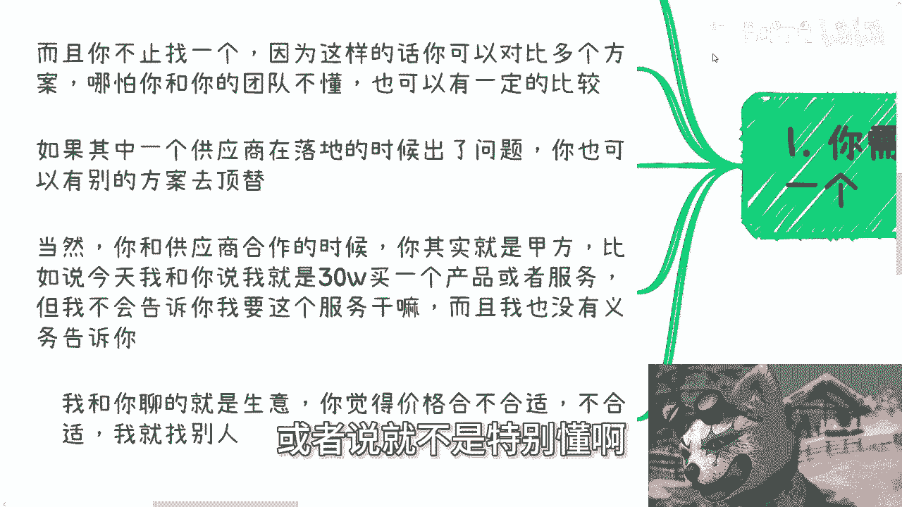
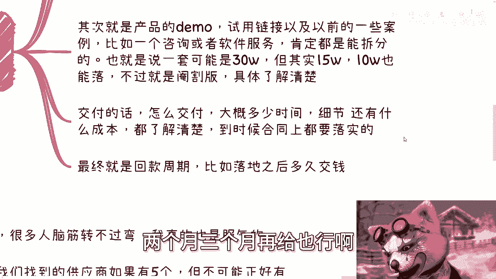
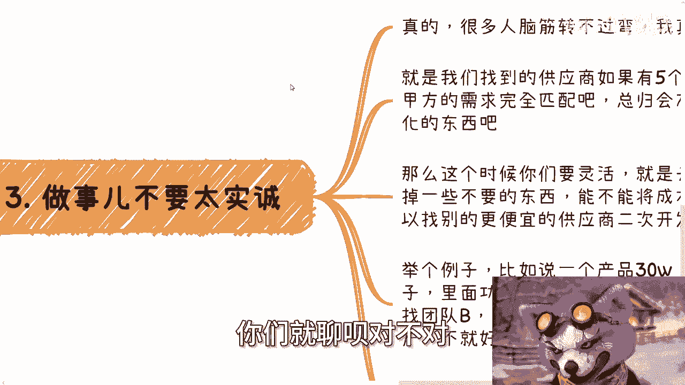
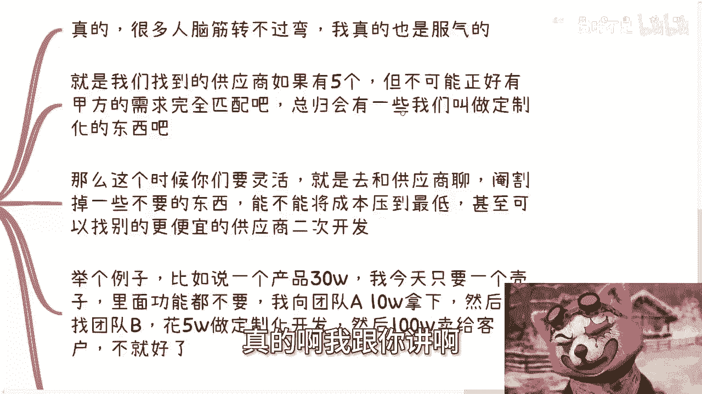
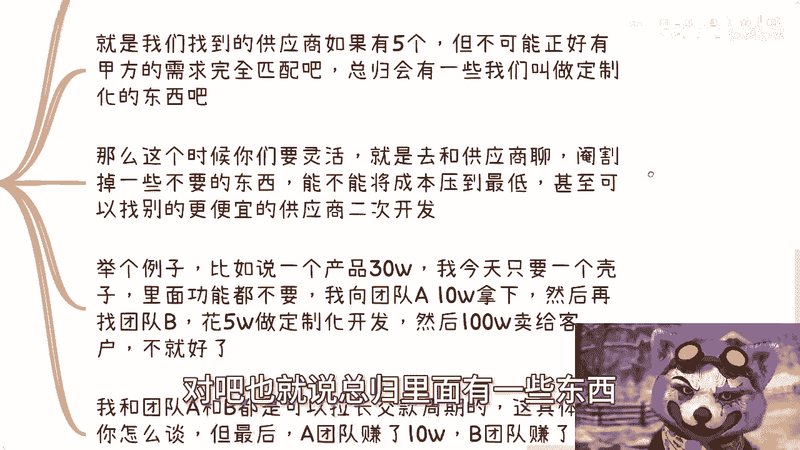
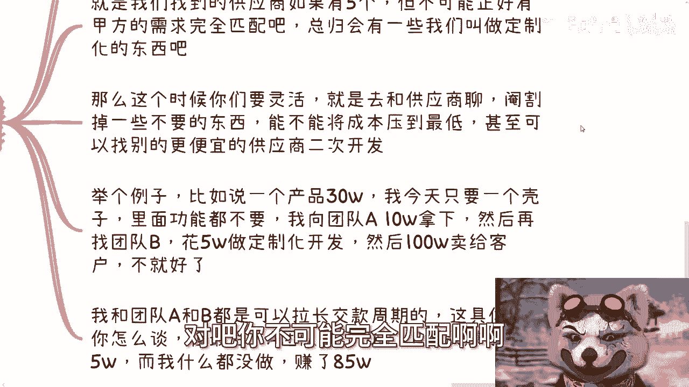
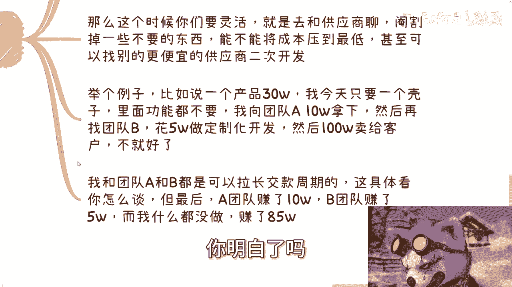
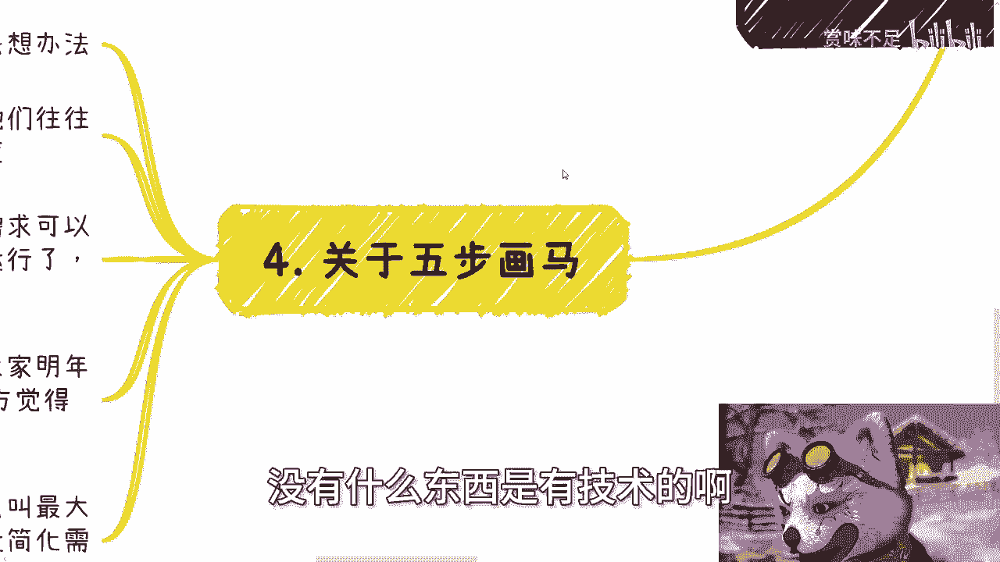

# 我们继续来聊聊社会商业上的五步画马 - P1 - 赏味不足 - BV1Nw4m1Y79h

好大家好，我们接着上一次的那个话题啊。

继续来聊一下五步画马的这个事对吧，我给你们列了一下什么叫五步画马对吧，第一步啊两个圈，第二步画上脚，第三步画上脸，第四步放上毛画，第五步啊对吧嗯对吧，懂吗啊，哼然后这个我们先说啊。

就下一期这个活动就是下周六啊，下周67月13号南京下午一点到六点地方，我已经订好了，在南京南站附近啊，内容主题的话，一个是低空经济啊，一个是分析一下民企国央企大厂。

外企当下的这个入职的优缺点以及未来的发展，呃，最后再聊一下各企业，当下数字化跟数字经济发展的这个机会好吧。

然后要了解详情和报名的，可以私信我啊，那我们来讲一下这个事啊，首先呃五步换码对吧，也就是说我们这个日常在社会上做项目啊。

啊基本上都是五步换马这个逻辑啊，呃你需要的是供应商，而且不止一个啊，其实我们一直说你日常要社交，要要社交，社交什么东西啊，本身找的是一些合作伙伴好，那么这些合作伙伴当中呢，肯定也会有比较多的供应商啊。

那么也就是我们说的乙方额，而且你肯定不止找一个，因为这样的话呢你可以对比多个解决方案，同同时呢呃也可以选择里面最优的，以及那个成本最低的额，哪怕你跟你的团队不懂啊，或者说就不是特别懂啊。

也可以有一定的比较，那么如果其中一个供应商呢，在落地的时候出了问题，那么你也可以有别的供应商去顶替对吧，也有很多人问我嘛，他说哎那陈老师我们做一个东西做到一半，如果有问题了或者怎么样子怎么办。

哎呀我跟你们讲，哼，我跟你们这么说，甲方绝对不是哦，就是甲方在跟你签这个合同，尤其是政企的单子的时候，就是他能够跟你签，也就意味着他已经明白了。

你肯定是能交付的啊，但是你交付的这个东西啊，就我们这边说的五步画嘛。

你交付到底是一还是五，那对他来讲不重要啊，你明白吗啊但是大概率啊，只要他不是个，大概率他一定会来看，就是说啊你是不是有这个交付能力啊，不太会出现说交付到一半不能交付的情况，那当然啊你跟供应商合作的时候。

你其实就是甲方啊，比如说今天我和你说，我就是买了个三啊，30万买一个产品或者服务，但是我不会告诉你我要这个服务干嘛，因为什么，因为我没有义务告诉你，我就是来跟你谈，一手交钱一手交货的对吧。

我跟你聊的是生意，你觉得价格合适就合适不合适。

拉倒我再找别人啊，对不对，好，那么第二你需要去了解的是。

产品成本和交付情况以及回款周期啊，你找到供应商要这么几个东西，一产品服务介绍，公司介绍，对方不给，那就不给下一个呗，总有人会给啊，对不对啊，当然你问别人要的时候也不能打直球啊对吧。

你你你你你总归要适当的画饼啊对吧，这事情我就不想多说了，他妈很多人真的就就直肠子，那你怎么跟人家聊啊，其次就是这个产品的demo对吧，试用链接以及以前的一些方案啊，一些案例。

比如说一个咨询或者一个软件服务，肯定都是能拆分的啊，他不可能说一一套方案，卧槽他妈就30万啊，10万能不能做也能做啊，阉割啊对吧，所以说一套方案如果是X那其实二分之X。

三分之1X甚至十分之1X它也能落地，无非就是落的是什么东西对吧，因为你你想啊，不管是服务产品还是软件，什么东西不能拆分啊，肯定都能拆呀啊那么交付的话怎么交付，大概多少时间，细节是什么。

成本是多少都了解清楚，那么到时候这些东西合同上都要写的哦，那么最终呢就是回款周期啊，比如说落地之后多久给钱对吧，因为你你可以分开来嘛，比如说对方如果要求你先先交一部分的预付款，那也行，嗯对吧。

那如果来说你就如果对方不提，你就不要脸啊，那么你说我可能等你交付之后，两个月三个月再给也行啊。

这东西没有一个规定的，就很多人也也也也那个的，就是一直问我说爱陈老师。

你觉得这个应该多少，我说这个东西没有规定的，你们就聊呗，对不对啊。

第三做事呢不要太实诚，真的啊，我跟你讲啊。

很多人这个脑子转不过弯来，我他妈也是服气的啊，就是我们找的供应商，我们假设啊如果有五个，那我们就这么说，就算你有五个，卧槽这空调他妈太冷了，等一下啊，让我调一下啊，啧我们打个比方，比如说供应商五个啊。

你别说五个了，你就算十个，你也不可能正正好好匹配甲方的需求吧对吧，也就是说总你柜里面有一些东西。

有一些服务，或者有些功能是甲方定制化的吧对吧，你不可能完全匹配啊啊。

这这才叫符合常理的事情对吧，那么这个时候你们要灵活，就是去跟供应商聊，怎么聊呢，阉割掉一些不要的东西，能不能将成本压到最低对吧，甚至你可以找别的更便宜的供应商二次开发，我举个例子啊。

比如说团队A我今天要一个产品30万，我说我今天不要这个产品，我只要这个产品的一个壳子里面的功能，我都不要，那多少钱呢，10万对吧好，那么我向团队A100000块钱拿下。

然后我再找找团队B花5万块钱甚至更低，比如说3万块钱，给这个壳子里面做一些定制化的功能，然后100万卖给客户不就好了吗，对不对，你能做事情灵活一点啊，同学们对吧，哦我跟团队A跟B都可以拉长交款的周期。

就回款的周期对吧，这具体看你怎么谈，但最后A团队赚了10万，B团队赚了3万到5万，而我什么都没做，赚了85万，这叫什么，这这才叫社会上的生意啊，对不对，你明白吗对吧，所以说你们会发现你A团队产品重要吗。

不重要，B团队的开发重要吗，也不重要，为什么，因为满地都是对吧，你今天找不到一个，找到一个不合适的，你就换，但是这里面最重要的是什么，是你为什么能接到这100万的单子，你明白了吗。

哦来跟我谈技术，没有什么东西是有技术的哦，第四关于五步换码啊。

我们做项目的时候需要适合的，学会帮甲方去想办法，什么意思啊，就简单来讲，就是说甲方的需求往往的确画一匹马，但是甲方往往对他们的需求并不了解，就是你们接触过很多甲方，你们就会知道你妈。

甲方对他们自己提出来的需求根本一无所知啊，我们需要帮他去分析啊，其实就是说跟他讲，哎你看第一步对吧，你哪怕五步画马的第一步画两个圈啊，他就能满足领导的需求，那么这个服务跟软件呢其实已经可以运行了啊。

只不过就说离开真正的这个码有点距离，但是无所谓啊，能用啊，对不对啊，那么后续的服务呢可以放到明年后年对吧，再去做，因为这样的话，你明年后年才会有更多的KPI啊，你还才才会有持续经费啊，然后你跟甲方聊聊。

哎你看这样子怎么样嗯对吧，什么叫做项目啊，做项目就是赚钱最大化，什么叫最大化，就是最低成本对吧，成本怎么低，那就尽量简化需求啊对吧，你别被别人牵着鼻子走啊。

为什么，因为甲方的目标真的目标，他不是为了完成这个东西。

它只是为了完成整个的流程，你明白吗，啊这你那当然啊，你换你话反过来讲，你你反过来想看，有很多人说在甲方不是啊，你跟甲方说，你忽悠不了甲方哥哥姐姐，我就问你们一个问题，如果甲方我们打个比方。

如果甲方今天对换码特别的了解，特别擅长，他找你干嘛啊，他他妈自己不能画吗，他有毛病吗，对不对，卧槽，他之所以能够会去找外部供应商，之所以会去找所谓的白名单额供应商来做，就他妈因为他不懂啊，呃你明白吗。

你甭管他是谁，我他妈做咨询做了这么多年，什么客户没接触过对吧，我就这么讲，剩下的你你央企国企，滴滴北，百度，腾讯，阿里哪家公司，我没去过，招行，农行，银行哪个地方我没去过，卧槽去，我就这么告诉你们。

去之前我都觉得卧槽牛逼对吧，大企业去之后，全他妈是，就这么简单，为什么，因为他不懂，他懂为什么找你啊，妈奇了怪嘞。

对不对，哎是吧啊。

嗯行吧啊，就这么着吧啊，然后那个呃活动好吧，下周六啊，这活动呃要报名的或者要了解的，你们继续私信我啊，然后职业规划商业规划啊，股权期权，商业计划书白皮书啊，分红分润啊，包括你们手上有什么牌。

你们没有什么牌，你们希望通过跟我的沟通啊，希望通过我的视角视野，能够给你们一些，更接地气的一些规划或者方案的话，那么你们可以整理好相关的问题跟个人背景，我们再来组咨询啊。

