# 我们继续来聊聊社会商业上的五步画马---P1---赏味不足---BV1Nw4m1Y79h

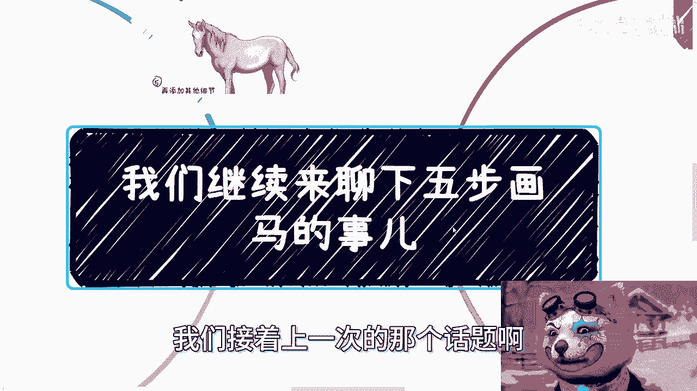

在本节课中，我们将学习一个在商业社会中常见的项目运作模式——“五步画马”。我们将解析其核心步骤与逻辑，帮助你理解如何在实际项目中，通过整合资源、管理供应商和简化需求来实现商业目标。

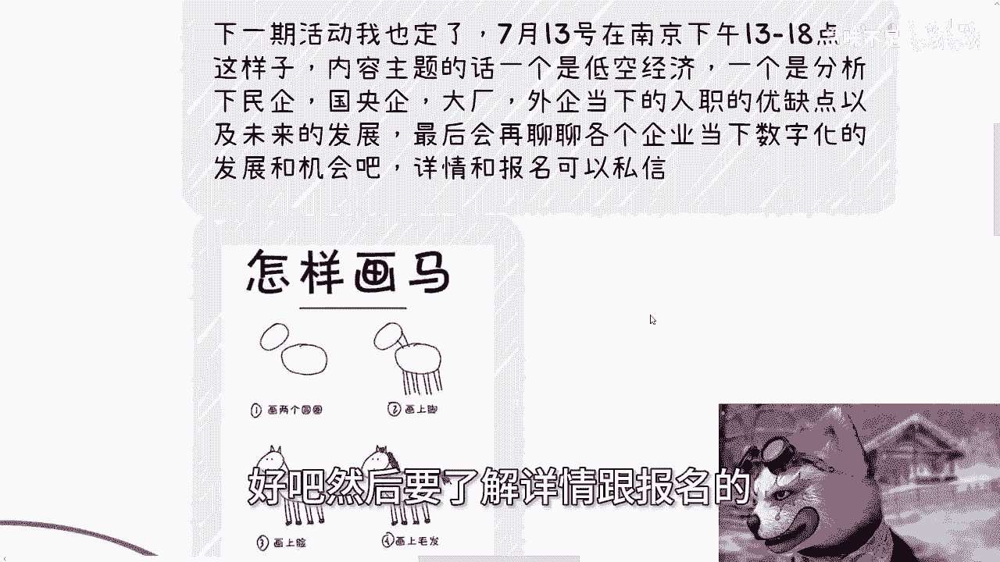

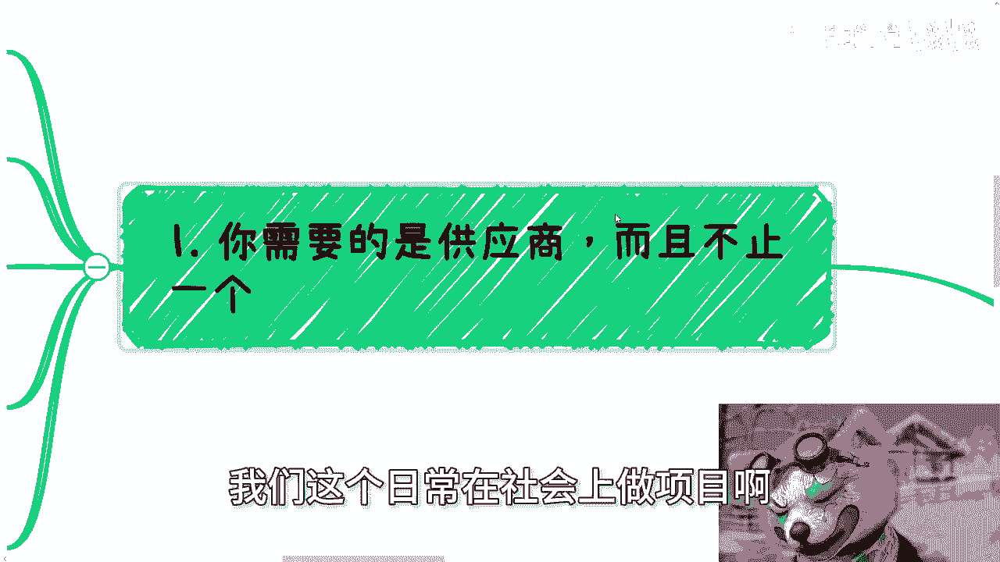

---

上一节我们介绍了“五步画马”的基本概念，本节中我们来看看其具体步骤。

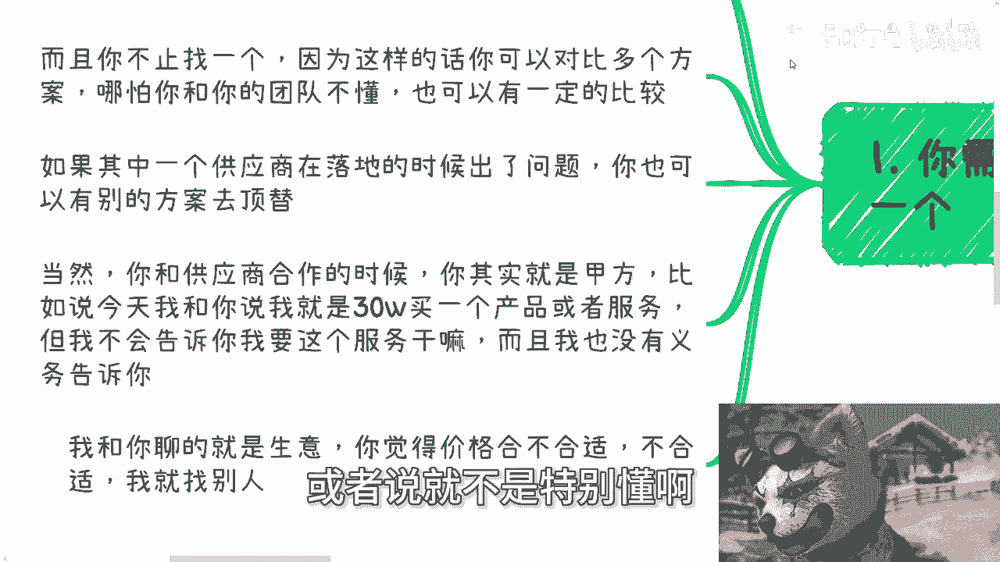

“五步画马”的步骤如下：
1.  画两个圈。
2.  画上脚。
3.  画上脸。
4.  画上鬃毛。
5.  完成。

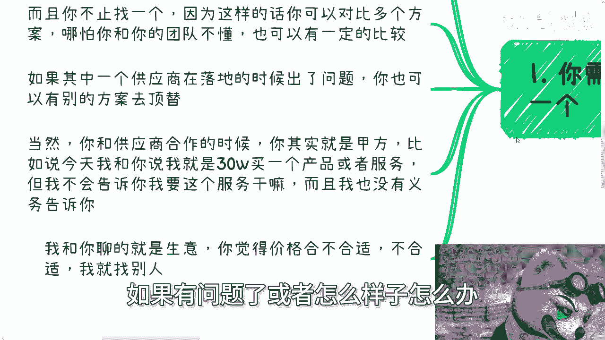

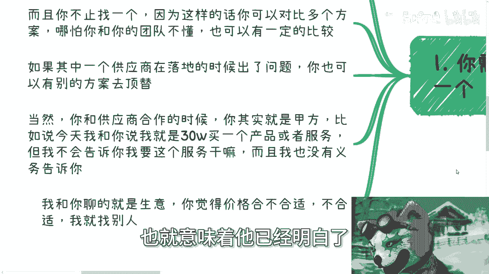

---

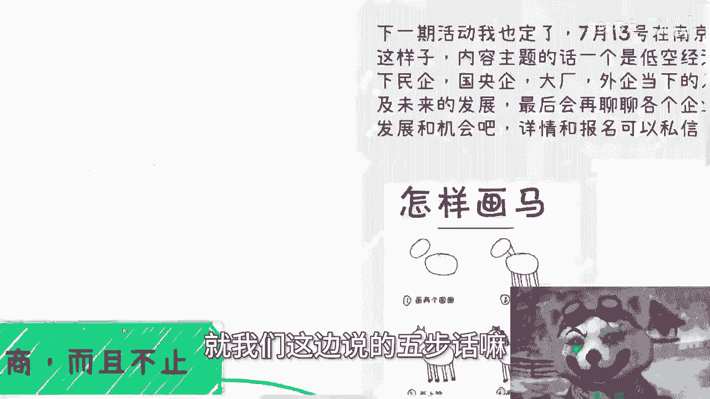

## 第一步：寻找并管理多个供应商 🤝

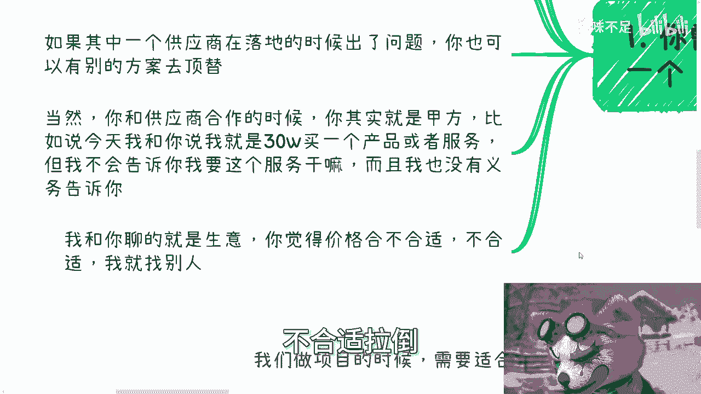

在社会上运作项目，基本都遵循“五步画马”的逻辑。你需要供应商，而且不止一个。日常社交的一个重要目的，就是寻找合作伙伴，其中就包含大量的供应商，也就是我们常说的乙方。

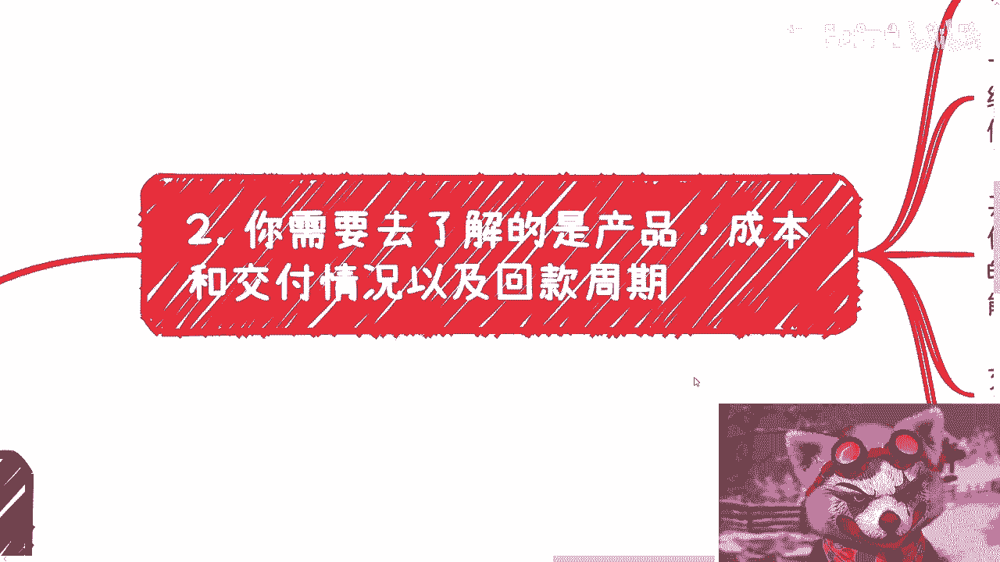

以下是寻找和管理供应商的几个要点：
*   **对比选择**：寻找多个供应商，可以对比不同的解决方案，从中选择最优或成本最低的。
*   **降低风险**：即使你和你的团队对项目细节不完全了解，通过对比也能有所判断。同时，如果一个供应商在落地时出现问题，你也有备选方案可以顶替。
*   **明确甲方立场**：当你与供应商合作时，你就是甲方。例如，你花30万购买一项产品或服务，但没有义务告知对方你的全部用途。你只需谈生意，价格合适就合作，不合适就寻找下一个。

---

## 第二步：深入了解产品与交付细节 📋

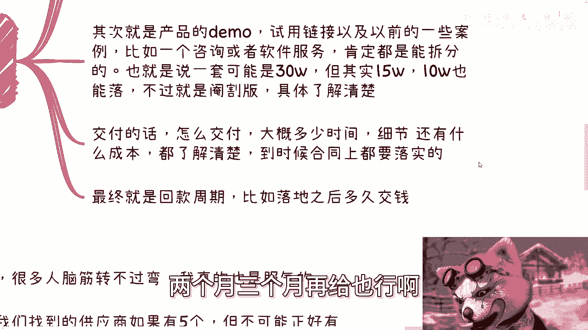

找到供应商后，你需要深入了解以下几方面信息。

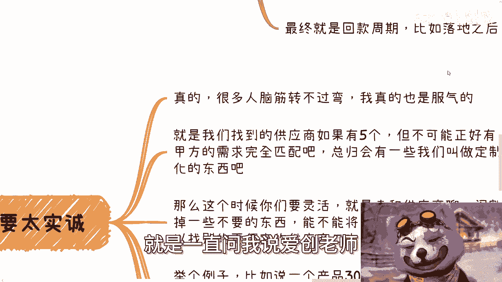

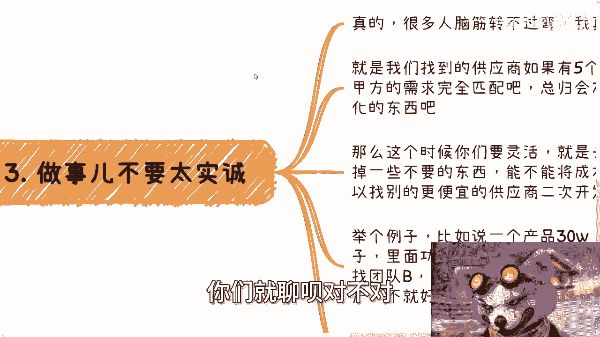

以下是需要向供应商了解的核心信息：
*   **基础资料**：要求对方提供产品服务介绍和公司介绍。如果对方不给，就换下一家。
*   **产品验证**：索取产品演示、试用链接以及过往的成功案例。
*   **方案拆分**：任何服务或软件方案都可以拆分。如果一套完整方案的价格是 **X**，那么 **X/2**、**X/3** 甚至 **X/10** 的简化版本也能落地，区别在于功能的多寡。
*   **交付与成本**：明确交付方式、时间、细节和具体成本，这些都需要在合同中写明。
*   **回款周期**：协商落地后的付款时间。例如，可以要求对方先交付，你在两三个月后再付款。这一点没有固定规则，全靠双方协商。

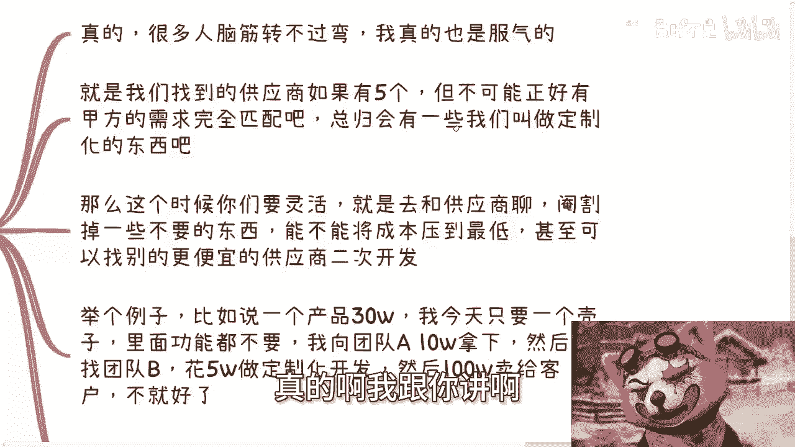

---

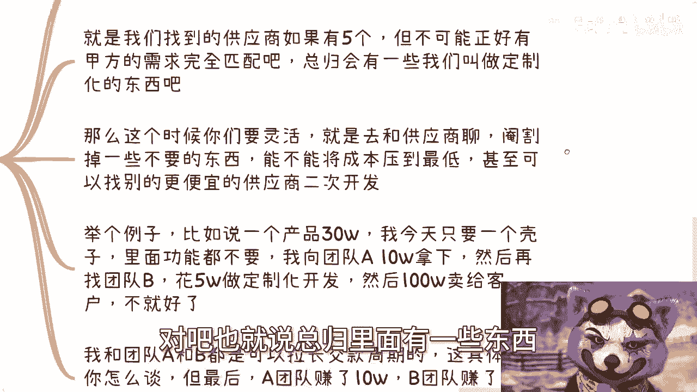

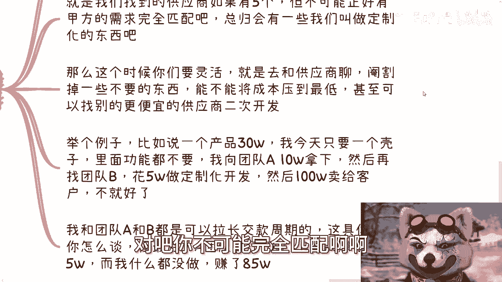

## 第三步：灵活整合资源，实现利润最大化 💡

做事不能太死板。即使你有五个甚至十个供应商，他们的方案也不可能完全匹配甲方所有的定制化需求。

以下是实现资源灵活整合的方法：
*   **需求阉割与成本控制**：与供应商协商，阉割掉一些非核心功能，将成本压到最低。
*   **二次开发与组合**：你可以从一个供应商那里以较低价格购买一个基础“壳子”，再找另一个更便宜的供应商为这个壳子开发定制化功能。
*   **案例说明**：例如，从团队A花10万买一个产品外壳，再找团队B花3万做定制开发，最后将这个组合方案以100万卖给客户。团队A赚10万，团队B赚3万，而你作为中间整合方，什么都没做却赚了85万。这体现了社会生意的本质。
*   **核心价值**：在这个过程中，A团队的产品和B团队的开发技术都不再是最重要的，因为市场上同类资源很多。真正的核心价值在于：**你为什么能接到那个100万的订单**。

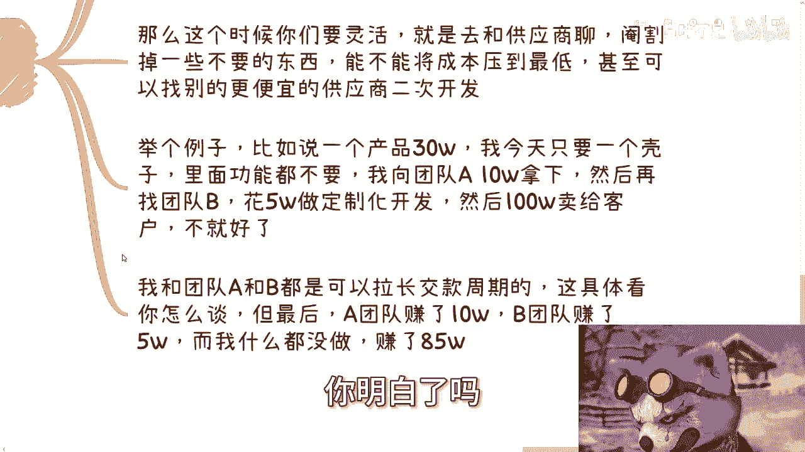

---

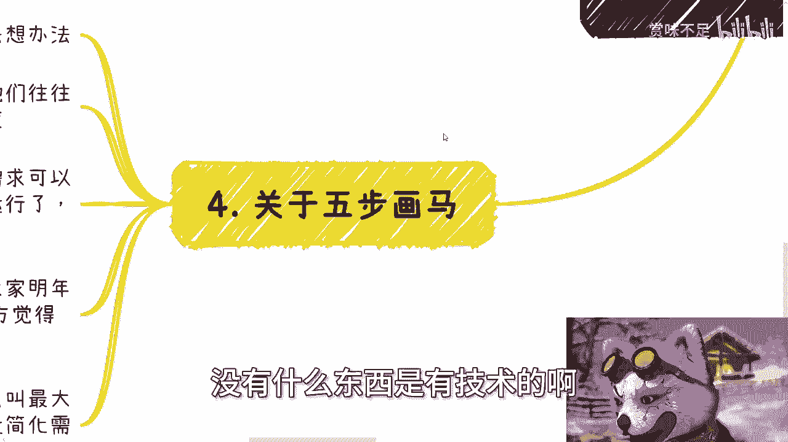

## 第四步：引导甲方需求，简化项目目标 🎯

在做项目时，需要学会帮助甲方分析并简化他们的需求。甲方的目标往往不是完成一个完美的产品，而是走完整个流程。

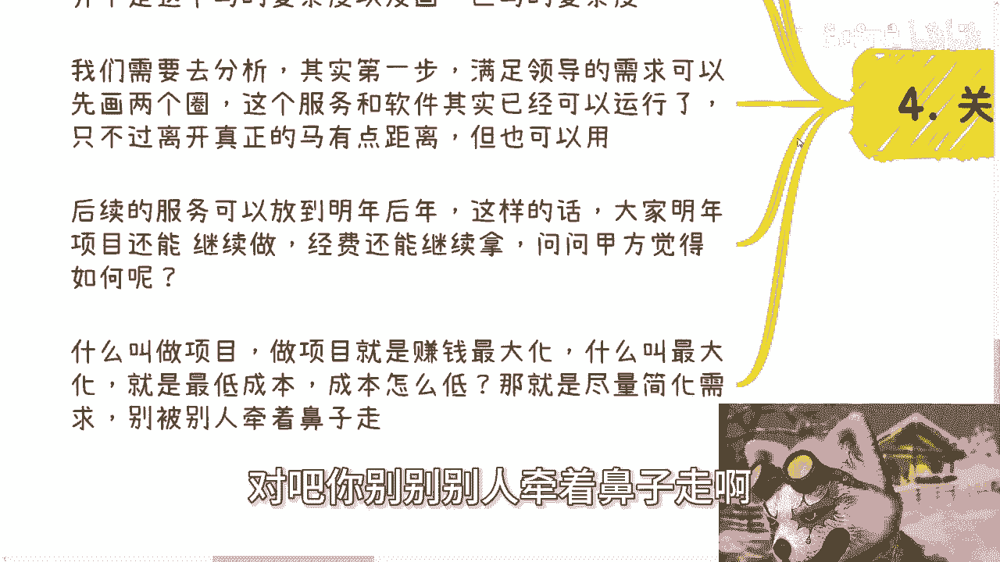

以下是引导甲方需求的关键：
*   **需求分析**：甲方往往对自己提出的需求并不完全了解。你需要帮他分析，告诉他哪怕只完成“五步画马”的第一步（画两个圈），可能就已经能满足领导的基本要求，系统已经可以运行了。
*   **分阶段实施**：你可以建议甲方，将完整需求拆解，把后续服务放到明年或后年再做。这样既能满足当前需要，又能为未来争取持续的经费和KPI。
*   **项目本质**：做项目的目的是**利润最大化**，而实现最大化往往意味着**成本最低化**。降低成本最有效的方法，就是尽量**简化需求**，不要被甲方不成熟的想法牵着鼻子走。
*   **根本逻辑**：如果甲方对某个领域非常精通，他就不需要找外部供应商了。正因为他不懂，才会寻求外部帮助，这就是你的机会所在。

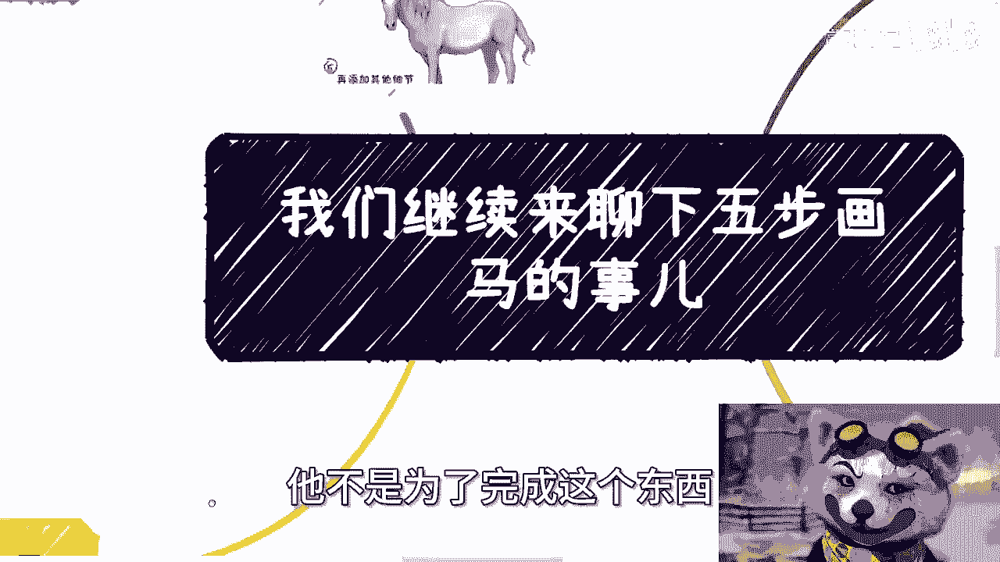

---

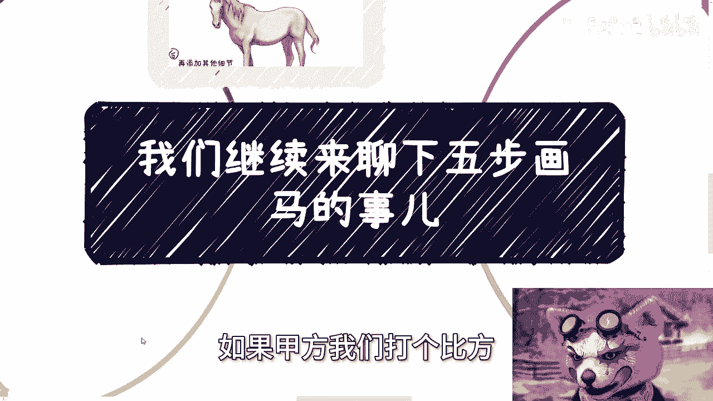

## 总结与下期活动预告 📅

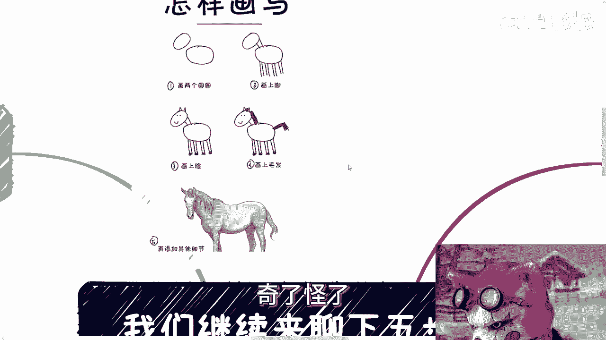

本节课中，我们一起学习了“五步画马”这一商业项目运作模式。我们探讨了如何通过管理多个供应商、深入了解产品细节、灵活整合资源以及引导甲方需求，来高效、低成本地完成项目，并实现商业利润的最大化。记住，在社会商业中，整合资源与把握需求的能力，往往比单纯的技术更重要。

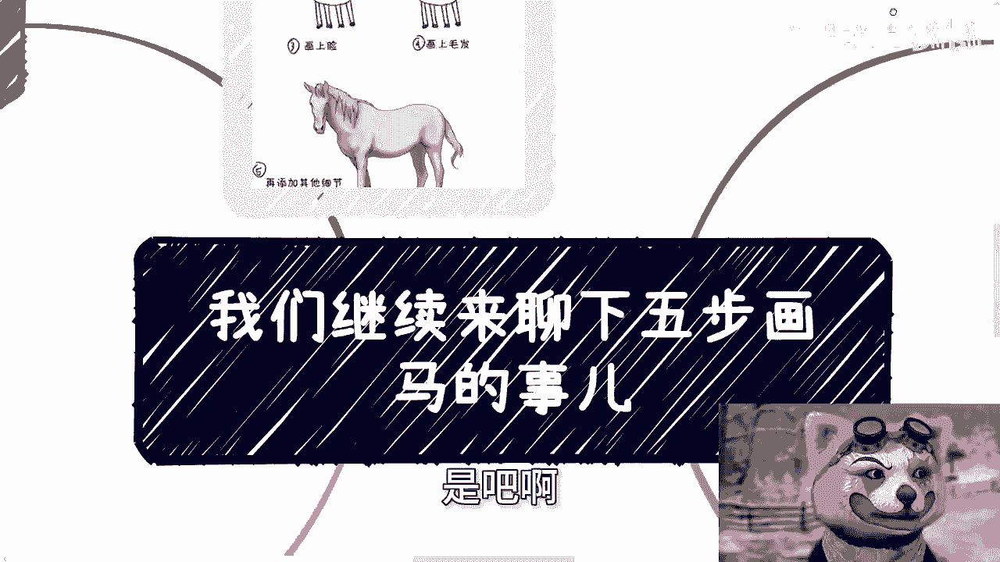

**下期活动预告**：下周六（7月13日）下午1点到6点，我们将在南京南站附近举办一场线下活动。主题将围绕“低空经济”发展，以及分析民营企业、国企央企、大厂、外企当前的入职优缺点与未来前景。最后，我们还会探讨各企业在数字化与数字经济时代的发展机会。如需了解详情或报名，请私信联系。

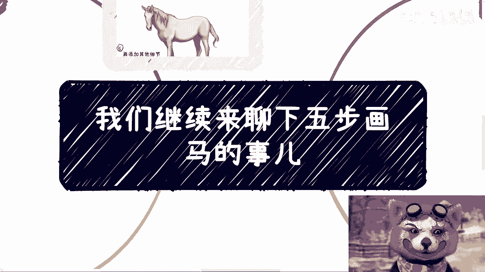

此外，如果你在职业规划、商业规划、股权期权、商业计划书撰写等方面需要更接地气的建议，或者希望我基于你的个人背景和资源（手中的“牌”）提供一些视角，可以整理好相关问题与我预约咨询。