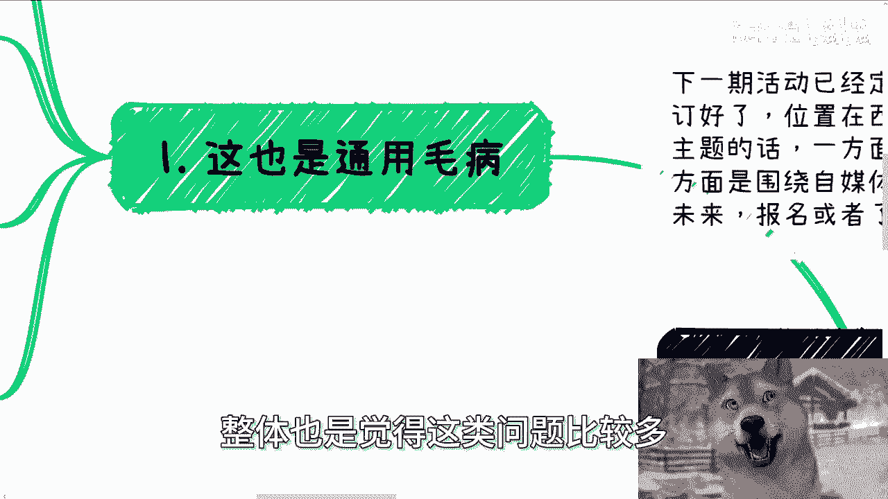
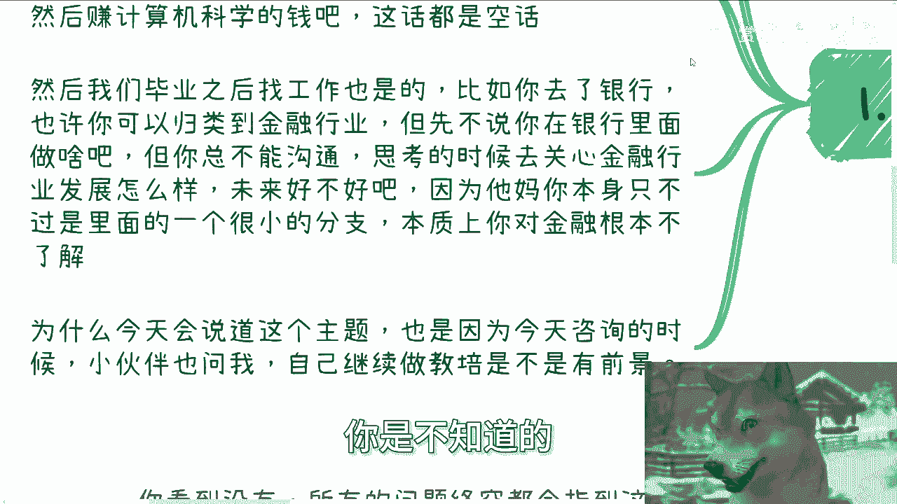
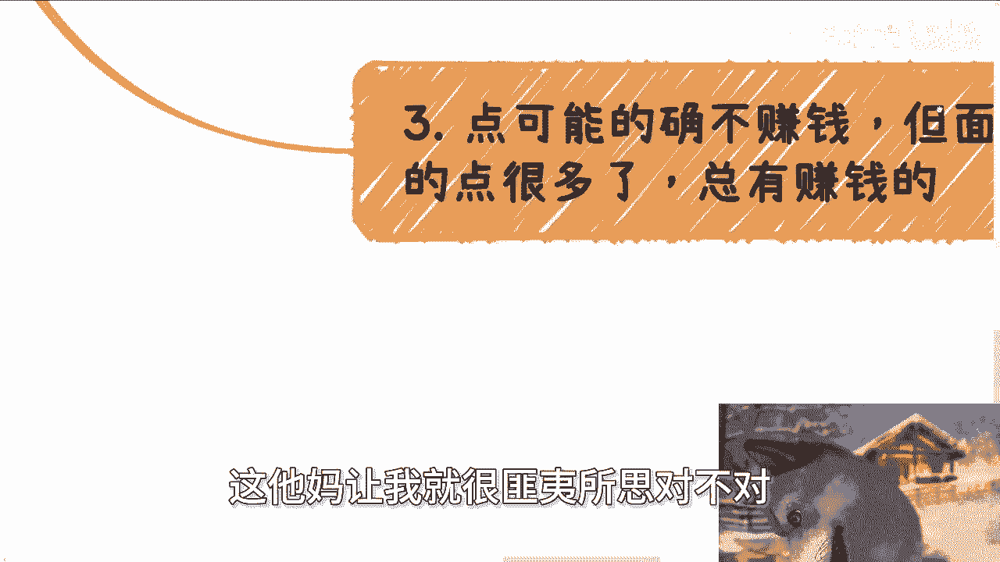
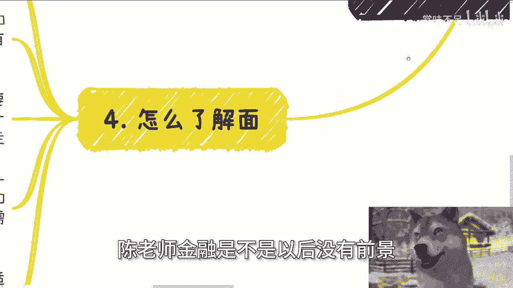

# 课程一：从“点”到“面”的认知升级 🧭

在本节课中，我们将要学习一个核心概念：为什么仅仅了解一个“点”不足以成功，以及如何通过理解“面”来发现真正的机会。许多人在学习和工作中接触到的只是孤立的“点”，却误以为这就是整个“面”。如果不了解这个“面”，几乎不可能赚到钱。

---

## 1. 问题的普遍性：我们常被“点”所局限

上一节我们提到了“点”与“面”的区别，本节中我们来看看这个问题是如何普遍发生的。

我们选择专业时，往往是模糊和宏观的。例如，**计算机科学（CS）** 是一个宏观概念。你不能说“我通过计算机科学这个赛道赚钱”，这没有意义。毕业后找工作也是如此。例如，你在银行工作，你和身边的人可能将其归类为金融行业。但你在银行里具体做的事情，只是金融行业中一个很小的分支。无论你在银行工作多少年，本质上你可能并不了解整个金融行业是如何赚钱和发展的。

**公式：** 点 ∈ 面
（“点”属于“面”的一部分，但不能等同于“面”）

你不能将你在银行工作的“点”，与整个金融行业的“面”划等号。

---

## 2. 为何要了解“面”：突破人造概念的束缚

了解了问题的普遍性后，我们需要明白为什么要去了解“面”。许多行业概念是人造出来的词汇，容易把人束缚住。

例如，前几年的区块链、元宇宙、数字藏品，本质上都是**区块链技术**，只是换了个新名词。再过五年十年，可能还会出现新词，但底层技术依然是去中心化技术。大众不懂这些，就会觉得是新东西、有前景。

以下是教育培训行业的例子，说明“面”的广阔性：
*   **服务对象**：企业、政府、高校、个人消费者（C端）都叫教育培训。
*   **内容类型**：技术类、学科类、证书类、补贴类、党课类等。

如果你只是在学科类教培公司做老师或运营，你就认为“教培行业”前景不好，这等同于否定了面向政府、企业的高价培训，也否定了证书、技术等所有培训类型。这显然是错误的。

教育培训行业，从宏观角度看，几乎是所有产业中**现金流最快、最健康**的领域之一。很多人身处一个健康、现金流快的“面”中，却因为自己那个不赚钱的“点”而怀疑整个行业的前景。

---

## 3. “点”不赚钱怎么办：在“面”中寻找新机会

上一节我们认识到“面”比“点”广阔得多，本节中我们来看看当你的“点”不赚钱时该怎么办。

一个“点”可能的确赚不到钱，也可能天时地利人和不行。但这个“点”所处的“面”下面，可能有很多其他的“点”。这些点里总有赚钱的，也总有各方面条件都合适的。

例如，你在学科教培行业工作，本质上做的是课程整理、营销、授课、对接老师。这些技能和经验，完全可以平移到整个“知识变现”的面上。

**核心逻辑：**
1.  你掌握的技能（如**课程开发、营销、交付**）是通用的。
2.  你可以选择“知识变现”这个“面”下，客单价更高或受众更广的“点”（如企业培训、专业证书培训、热点技能培训）。
3.  工作流程本质相同：整理课程 -> 宣传 -> 交付 -> 迭代。

人生的时间有限，工作中能学到的东西也有限。很多人因为自己所在的“点”不赚钱或性价比不高，就全盘否认整个“面”，这是错误的。

---

## 4. 如何了解“面”：两种核心路径

既然了解“面”如此重要，那么具体该如何去做呢？了解“面”的路径本质上只有两种：

1.  **贵人带你**：有经验的人为你指路。
2.  **自己了解**：通过主动探索和学习来获取认知。

对于大多数普通人来说，没有贵人，那就只能依靠自己了解。这里需要注意：

*   **谨慎对待网络信息**：网络上大量信息对你可能没有直接帮助，甚至会产生误导。
*   **不存在“标准案例”**：商业和赚钱相关的信息多是机密，没有人会提供像“游戏攻略”一样的完整步骤。期待一个“教科书式案例”是不现实的认知。

当你通过自己的努力，把一个“面”了解清楚之后，才能从中筛选出哪些可能是适合你的、能赚钱的“点”。然后你才能去深耕，从0到1地开始。

而不是随机选择一个专业，随机得到一个工作机会（一个“点”），然后因为这个“点”不行，就认为整个“面”也不行，接着既不探索也不改变，一条路走到黑并不断抱怨。这毫无意义。

---

## 5. 总结与行动建议

本节课中我们一起学习了“点”与“面”的核心区别。

**总结如下：**
*   我们常把工作中的“点”误认为是行业的“面”。
*   不了解广阔的“面”，就很难发现真正的机会和赚到钱。
*   当你的“点”不赚钱时，应在所处的“面”中，利用通用技能寻找新的“点”。
*   了解“面”主要靠**自己主动探索**，要抛弃寻找“标准答案”的幻想。
*   不要因为一个“点”的失败，就否定整个“面”，这会让你错失良机。

**行动建议：**
1.  **分析现状**：明确你当前的工作是哪个“面”下的一个“点”。
2.  **定义“面”**：研究这个“面”包含哪些其他分支、赛道和商业模式。
3.  **评估技能**：列出你在当前“点”上积累的**可迁移技能**（如运营、沟通、项目管理）。
4.  **探索新点**：基于你的技能，在那个“面”里寻找更有潜力的新“点”进行尝试。

记住，突破“点”的局限，建立“面”的认知，是走向更广阔天地的第一步。