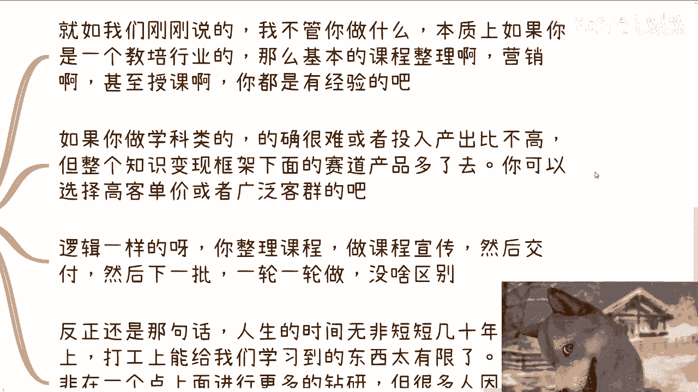
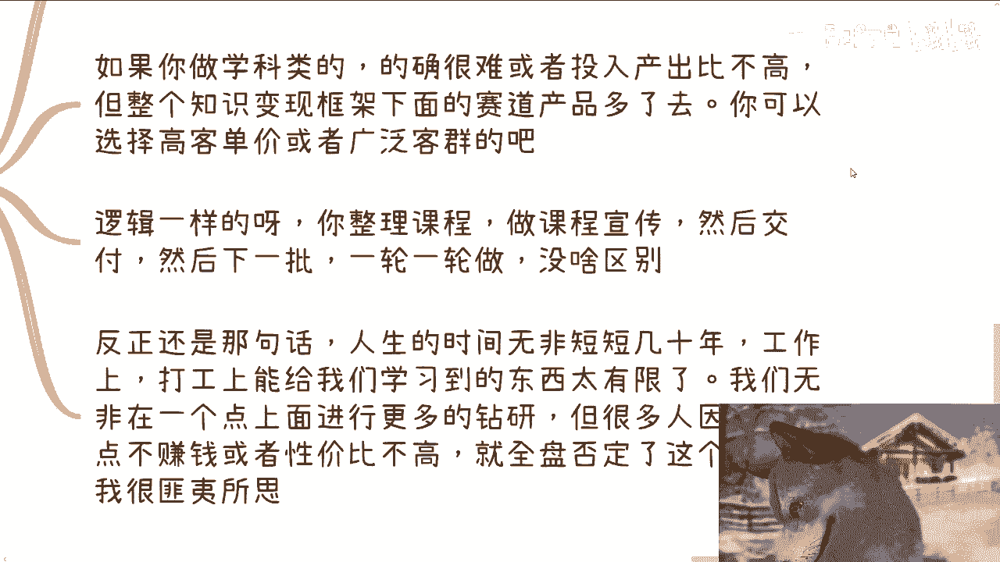
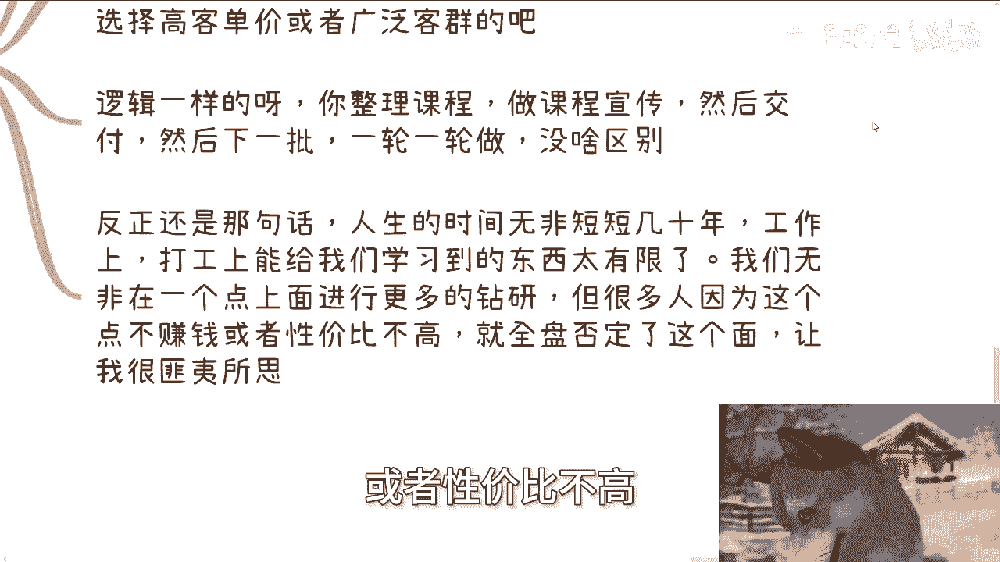

# 我们触到了点，但如果不了解面，大概率是赚不到钱的 - P1 - 赏味不足 - BV19y411e7QB

哦大家好啊，这个礼拜一了啊，礼拜一了，那么今天我们来讲的这个主题啊，叫做什么呢，就是呃大部分人啊在读书啊，工作的时候呢，其实我们接触到的是个点啊，呃然后呢就有很多人呢，他会把这个点误认为一个面啊。

但是如果来说你不了解这个面的，你是赚不到钱的，我基本上可以就是就是一棒子打死，我觉得就是赚不到钱哦，那么首先呢我们先说啊，就是说下期活动已经定了，在8月25号就是本周日啊，本周日场地位已经定好了。

位置在西安建筑科技大学，李家村这个地铁站附近啊，那么大干主题的话呢，一个是围绕不同企业的一些offer，就国央企啊，民企啊，这个额外企啊这些，那另外一方面就围绕这个自媒体和跨境电商。

然后最后我也会帮大家展望一下，这个未来报名或者了解详情的，你们可以继续私信我啊，额那么今天呢我主要讲究个原因啊，是因为最近沟通下来呢，整体也是觉得这类问题比较多。

而且比较通用啊，那么首先呢就是说我们选择专业的时候呢，其实都是模糊的啊，宏观的选项呃，我不管你们到底是找谁咨询过或者怎么样子，你因为这不重要，为什么，因为专业这个东西本身就是模糊的啊，当然这关系不大。

为什么，因为大家在学这个专业的时候，往往因为还比较年轻嘛对吧，那举个例子啊，这就好像我们之前说有一个专业叫cs啊，就计算机科学嗯嗯那么这就是个宏观的概念，因为你总不可能说啊，我问你。

我以前你以前做什么工作的啊，我以前做计算机科学的啊，然后我问你哪个领你选哪个赛道赚钱呢，我学计算机科学这个赛道赚钱，这他妈不扯淡嘛，对不对啊，然后呢我们毕业之后找工作，也是你比如说啊那个你去了银行。

也许呢你由于你的认知啊，也许呢你你和你身边的人，都会把银行归类到金融行业啊，但是呢我先不说啊，你在银行里面做点啥，因为说难听点，你在银行里面屁都学不到啊，呃但你总不能就是说啊，你总不能就是说沟通啊。

思考的时候去关心，比如说金融行业发展怎么样，未来好不好，因为他妈的你你说你在银行里面，你说你把它归类到金融领域，OK啊我可以认为没问题，但是你本身做的或者学的或者看到的。

无非只不过是金融里面很小的一个分支对吧，那么无论你在银行里面做了多少年，本质上你对金融是不了解的，或者说你对这个行业是不了解，这个行业大家到底怎么赚钱以及怎么发展，你是不知道的。

你不能划等号，那么为什么今天会说到这个主题，就是因为这两天咨询的时候呢，其实很多小伙伴也问我啊，就就提到一个东西，他说他问的问题是这样子，他说我自己继续做教培是不是有前景啊，嗯我听到这个话题的时候。

妈的我我我真的我我有种有种冲动啊，就必须他妈的喷啊，那么第二啊我们需要去了解面啊，那么再去看哪个方向更合适。

你就拿教培来讲，其实很多东西啊，你们要记住一点，都是人造出来的词汇啊，导致大家被束缚住，或者说大家觉得哎，好像这个跟那个不是一个东西，但他妈的其实上本质上都是一个东西。

你就拿前两年的区块链元宇宙数字藏品来讲，他妈的区块链元宇宙数字藏品都是区块链，他只不过造了一些新的名词而已对吧，而且我就这么跟你们讲哦，比如说过5年过10年啊。

可能用的还是一些decentralized的技术，就是去中心化的技术，他到时候给你换个词啊，底层还是区块链，跟你换个词，你就会觉得嗯这是一个新的东西，卧槽有发展前景，对不对，为什么。

因为老普罗大众懂个屁啊，对吧啊。

你比如说今天这位小伙伴啊，在教培里面做老师啊，可能又有运营啊，那么他就想着自己出来做或者兼职做点什么，但问题来了，教教育培训这个东西其实面很广对吧，企业政府高校C端都叫教育培训，技术类的，学科类的。

证书类的，补贴类的，你明白吗，就是说你真的拿那些企业，我们叫做要要出钱，比如说这一次的培训对吧，出30万，那你这个30万的名目上面写的是什么，就是培训对吧，那你总不可能跟我说哦，这个这个啊陈老师。

你这个这个这个叫什么定义不对啊，教培呢指的就是那种小学初中，高中啊，大学啊这种K12的对吧，或者说这种这种类似的这种教那个教育培训啊，更多的是说学校里的啊，包括学科这种就是跟双减啊。

或者跟其他的什么双创啊，这种教育相关的学校相关的有关的呵，那那我就笑了，那按照你这个说法，那怎么滴啊，哦我必须呃证书培训呃，证书类叫什么，叫证书培训技术，什么技术培训，学科培训，那他妈不都是培训吗。

你非要把它分开来干嘛呢，我也不明白了，对不对，这就好像这就好像你明明做的是一件事情，你前面有五条路通往罗马，你非要跟我说，他妈的，我只我只认这条路，另外四条路跟我没关系，那他妈怪谁呢，对不对哦。

那么问题就是说，如果你仅仅只是一个学科类的一个从业人员，甚至是一个教培领域，或者教培公司的一个打工人，难道你想用教育培训等同于这么多吗，对吧，你你说啊，这个我觉得教培做不好，我觉得教培收入不高。

我觉得怎么样子好，那就等同于政府企业高校对吧，证书类，学科类，培训类，补贴类，党课类都赚不到钱，都发展不好，那他妈能这么定吗对吧，你就像他今天问我哎，陈老师，我我继续做教培行业行不行对吧。

然后你觉得教培行业前景怎么样，其实就把我逗逗乐了，我怎么回答他呢，我说我说大哥教培行业，教育培训这个行业，你管你，从广泛宏观类角度来讲，我可以这么说，在所以几乎所有的产业里面。

可能教培这个产业是现金流最快以及最健康的，没有之一，明白吗，而且都是短平快的对吧，你也有的人不服，卧槽，他说那那那金融绝对比教培赚钱是啊，但金融风险高啊，教培有他妈毛的风险啊，那么搞笑嘞，对不对。

你就是他明明在一个最健康，最现金流最快的一个领域里面，他竟然还在问我前景怎么样，对不对，其实很多人都一样，就是你们只不过是做了一个点。

但你们认为这是个面，你明白吗，哦三是什么呢，就是点可能的确赚不到钱，也可能天时地利人和不行，但是这个点所处的面下面可能有其他很多点。

那这些点里面总有赚钱的，也总有怎么说呢，天时地利人和的，就如我们刚刚说的，我不管你做什么，本质上你说你在教育教培行业做的吧，好那么基本上你无非做的也就是课程整理营销，甚至授课对吧。

那这就跟老师跟讲师对接，你还能做什么呢，无非就做就做这些事情，我管你对接的是学科还是什么党课，有什么区别了。

对不对，你大概流程知道么就好了，那如果你做的学科类，我们就这么说，你可能投入产出比是不高的，但是我们把它发散到整个面上面。

我们可以统一啊，认为整个面就是知识变现，你在整个知识变现的框架下面，赛道多了去了，你可以选择里面高客单价的或者广泛客群的，都可以选，为什么一定要吊死在学科这个东西上面呢，对不对，逻辑都是一样的呀。

你整理课程做课程宣传，然后交付，然后再做下一批，一轮一轮做有什么区别呢。

反正还是那句话，人生的时间无非无非都是短短几十年，你工作上，打工上能给我们学到的东西太有限了对吧，我们无非是在一个点上面进行更多的钻研，或者说从每天重复劳动，每一年重复劳动。

但但很多人因为这个点不赚钱或者性价比不高。

就全盘否认这个面，这他妈让我就很匪夷所思，对不对。

这就好像他们在银行里面工作的，然后问我问我爱陈老师，金融是不是以后没有前景。

哎呀妈的我他妈气笑了，对不对啊，然后第四点怎么了解面，对不对，你看到没有啊，所有的问题终极问题是什么，都是回归到这个问题上面，怎么了解，对不对，那我就跟你们讲了，你从人类社会了解了解这个东西就两个。

要么贵人带你，要么自己了解，如果你跟我一样是普通人，那么我们没有贵人，那只有自己了解，没有了呀，对不对，那另外我还要跟你们讲了一点，就是网络上的信息尽量不要去看，因为对你们没有帮助，对不对。

还有人问我哎有没有什么案例了解，卧槽我说是难听点，我是真，我CPU都烧了，我都没想明白什么叫案例，我试图理解了一下，他的意思，可能是需要一部一个教科书，然后一步步的告诉他自己怎么去走。

那可能意思就是他需要一个游戏攻略，那我他妈要命的，我就不明白现在的孩子到底什么认知对吧，哦商业上所有的东西都是机密，更何况跟赚钱有关的，对不对啊，你问我要个案例，我都不知道这案例我怎么给你。

更何况你也没付钱对吧，我都我都不知道你去社交，去了解社会需要什么案例，我完完全get不到这个这个这个点啊，那么当你把这个面了解完了之后呢，我们才能去筛选出来哪些可能是适合我们的点，或者哪些才是赚钱的点。

然后我们再去深根，或者说做0~1，而不是说哎我们今天好像哦大学读完了对吧，或者学校里面出来进社会了，就随机选了个专业，然后随机找到了就选了一个offer，然后选了一个点，然后就认为哦这个点不行。

或者说认为这个点所所在的面也不行，然后就就虽然不行，但是自己也也也也不去了解别的，反正就这条路走到黑，然后还不停的抱怨，有意义的了，没有意义的呀，对不对，我，我说实话，我到今天啊。

我真的碰到过很好几个了，已经已经估计十几个都有了，就是他们以前做的可能是各种各样的，比如说有一些技术类培训的，有些是学科类培训的怎么样子的，然后由于自己赚的少，或者由于这公司这个怎么说呢，在压榨他们。

或者由于自己做的这个东西本身领域上不行，然后他就把整个教培，把整个培训的面全部否定掉了对吧，然后以至于我跟他们说，我说啊可能有企业家培训，有私董会对吧，可能有这种什么呃热点类的。

像什么人工智能或者别的东西培训，他们都会觉得很难做，就是那种这么一朝被蛇咬，10年怕井绳的这种感觉有什么意义呢，对不对，就是哎就是包括啊，昨天晚上我还拒绝了一个咨询啊，为什么，因为他写了很多背景给我。

而我从这些背景里面，我能得出一个结论，就是他太被太被自己的过去，跟所谓的各种各样的鸡毛蒜皮的事情，所牵绊住对吧，那我后来微信怎么跟他讲的，我说第一我不建议你找我咨询，你这个钱付了就真浪费。

第二我你要是让我给你一句建议对吧，或我只有一句话，我说你所有描述出来，你你在意的那些东西你要全部抛掉，如果你活到现在，这些东西你都抛不掉的话，你是赚不到钱的，就这么简单，好吧OK好，那么那个呃活动好吧。

西安啊，西安这边的活动继续报名啊，然后那个呃剩下就是职业规划，就包括你自己的工作上面啊，包括副业上面啊，或者主主业副业的一些平衡啊，啊包括你在副业当中跟别人合作过程当中，涉及到一些什么股权啊，分红啊。

丰润啊啊商业计划书啊，白皮书啊对吧，这个呃合同啊，期权啊，相关的啊，你希望通过我的一些认知，给你一些更呃接地气的一些建议，或者说少走点弯路的话，那么你们可以整理好对应的问题跟个人背景，好吧。

