# 我们赚钱的本质就是吃点渣渣，喝点汤 - P1 - 赏味不足 - BV1h5H9eUE8W

好大家好，这个有人哼问我。

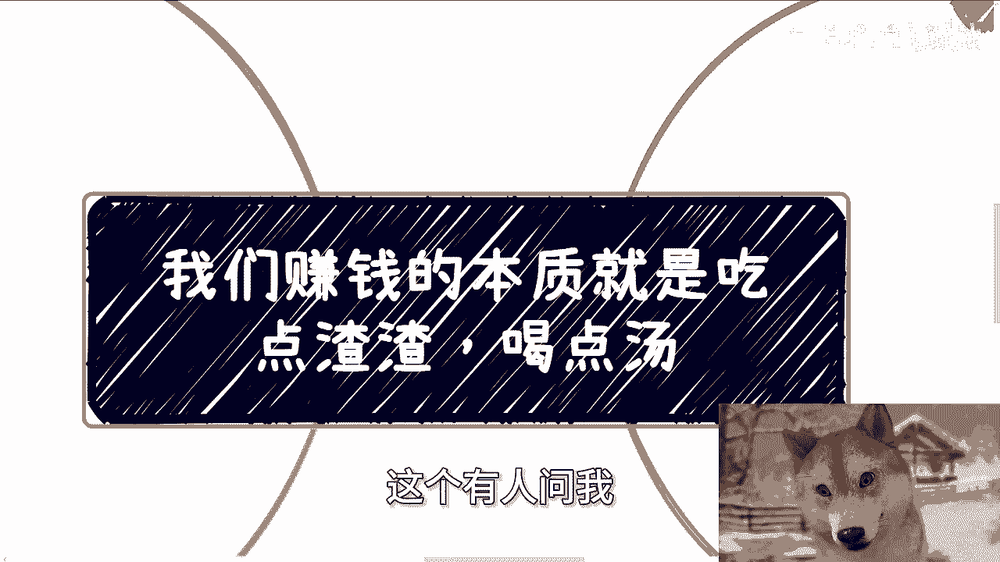

我们家咪咪在干什么是吧，我跟你们说啊，我们家咪咪妈每天他妈就干两件事。

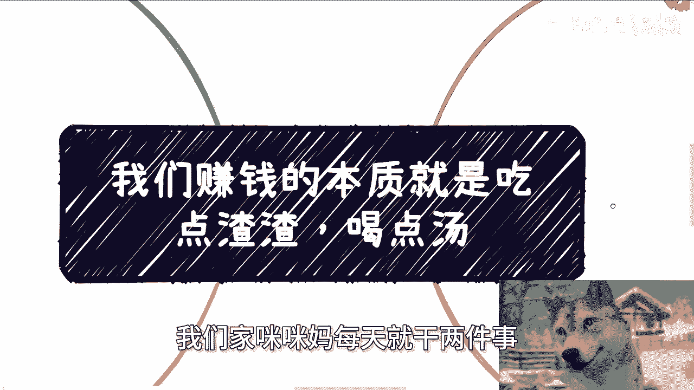

要么呢就是盯着我们家仓鼠看啊，要么就是他妈的咬电线啊。

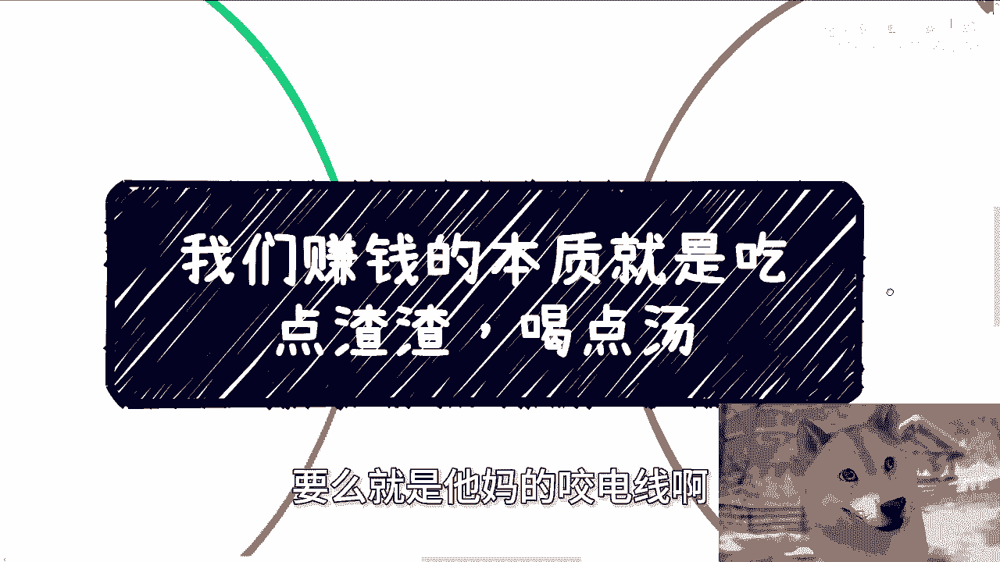

而且呢他很喜欢蹲在我下面咬网线对吧，他妈的哎他妈他妈要是把我网咬断了。

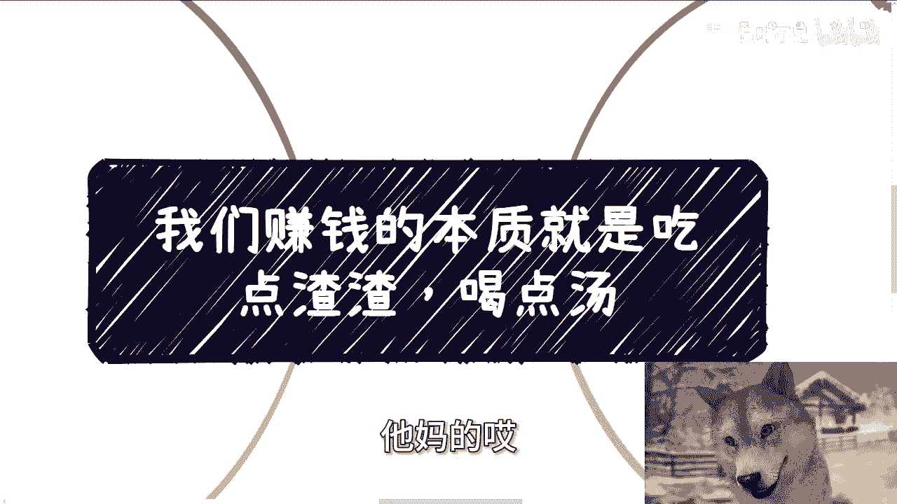

把那切揍他，真的是呵呵哦。

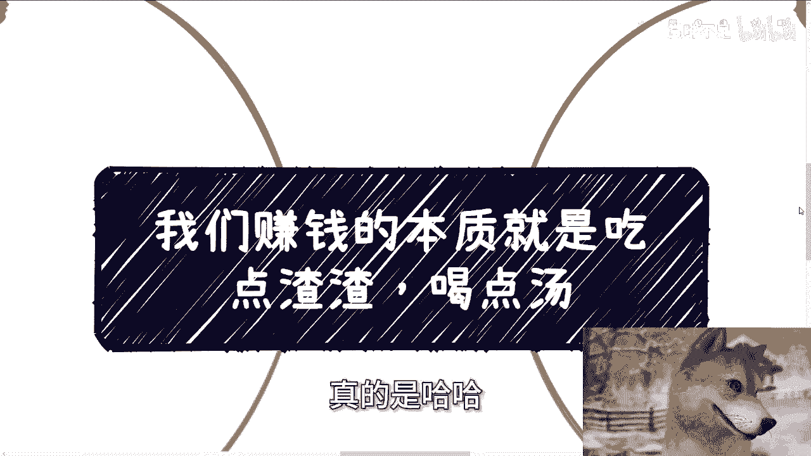

那个今天我们来讲的这个主题啊，其实昨天我就写好了啊，但是昨天太晚了。

我又懒，所以我就只能今天来做这句话啊，我不知道有多少人听到过，但是在我们以前互联网时常说的一句话，叫做什么呢，叫做我们赚钱的本质就是吃点渣渣喝点汤啊，呃咱有一说一啊，我以前最早听到这个话的时候呢。

我其实我的这个这个怎么说呢，表面上的理解啊，我理解就是说可能啊大家赚的少啊，或者说就说别人拿大头，我们拿小头，我后来做着做着就发现了，我的理解太肤浅啊，其实呢我就这么跟你们讲啊。

就是吃点渣渣喝点汤的意思是什么呢，就是其实本质上的意思就是说普通人啊，能赚点钱，能赚点性价比高的钱已经不容易了，或者来说可能也只有某些方式，可以赚性价比比较高的钱啊，但是你相比整个项目的经费来讲。

你其实就是渣渣和喝点汤哦。

那么当然你说大图小图对不对对，但这个只是表面现象啊，我们要看他的本质啊。

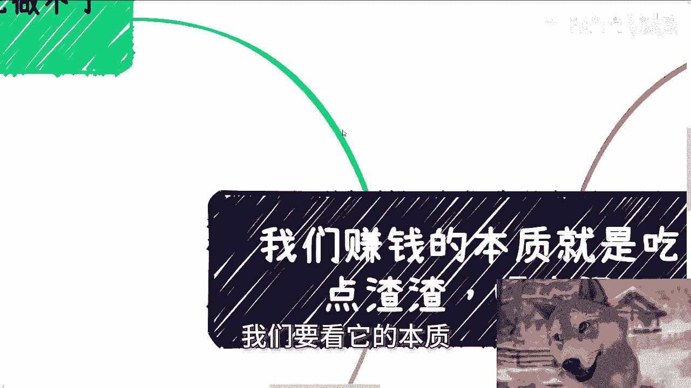

第一啊为什么你们会觉得自己做不了啊，某些项目或者合作啊。

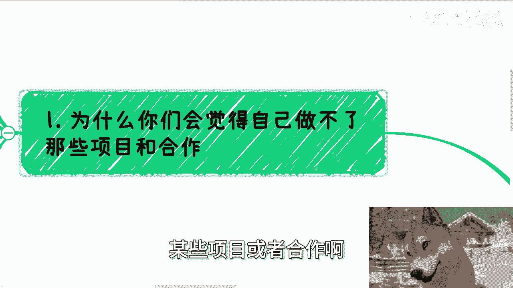

你们想想看啊，呃很多人第一反应就觉得自己什么都没有，对不对啊，行啊，我和你们这么讲，也许啊这件事情占一定的原因，但是我们今天假设我们我们就就怕，就怕我们这个摆事实讲道理嘛，对吧，呃我们我觉得有两点。

第一点是这种思想没有在应试教育里面，PUA给你们啊，我们想象一下，我们假设如果一开始对吧，比如说高中大学就教你们怎么在社会上合作，或者怎么样怎么样怎么样，就PUA，你们就说白了这也是一种PUA嘛对吧。

灌输嘛，那PUA你们，那么我相信你们甚至到今天就不会再去想什么，自己有什么东西啊，或者今自己有什么商业价值啊，啊自己有什么什么团队，有什么产品啊，你们什么都不会想，为什么。

因为你们会觉得这是一个default，就是我们说这是一个默认的事情，哎就好像觉得哎我就能做这个事情，为什么，因为你们是被PUA惯的，你你明白吧，你就说很多东西你觉得你会去思考，你觉得你会去想的原因。

是因为这个东西你不了解，但是你不了解的时候，你去想的时候，你是你是带着否定的态度的，你或者是你带着恐惧，带着就是那种怎么说呢，未知的态度，但其实你们仔细想想，就像我们刚刚说的，如果一开始PUA给你们。

其实你们现在还是什么都没有的，也许你们也是就是说啊没有什么商业价值，但是就不会阻止你们的脚步啊，对不对啊，这第一个，但是现在呢你们看看啊，就大家会变得畏首畏尾啊，就我跟你讲这个事情就很可笑。

因为但你其实就像我们刚刚说的，如果假设从小PUA，你觉得你现在有什么区别吗，没有区别，那无非就是脑子里面被归被灌输了别的东西，让社会的让社会的这个赚钱变得无知无畏，未知未知，让大家变得恐惧对吧。

那另外一点就是说，大家没有看到过更多的案例啊，就比如说你说啊我们新闻报道啊对吧，怎么样子啊啊那我们又假设啊，我们又假设如果媒体网络一直报道对吧，比如说某某某政府啊，企业合作啊，对吧啊。

这个这个某某某什么几几百万几千万的项目啊，是由这个哎哎出来不要动啊，是由是由这个比如说路人甲啊。

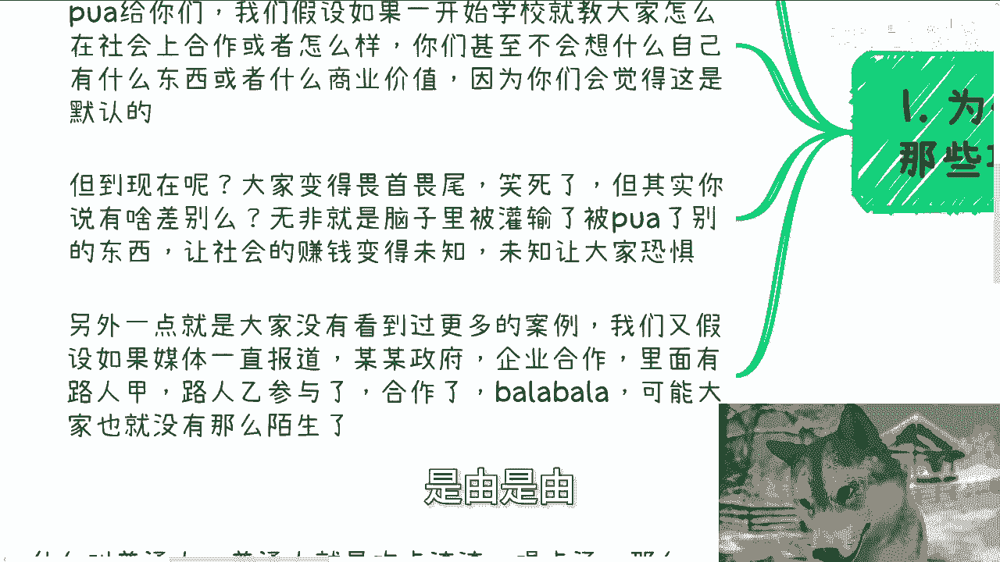

路人乙啊参与的对吧，就阿猫阿狗参与的合作了，巴拉巴拉巴拉，那我相信大家可能也就没这么陌生了，对不对，所以说你们仔细想想看。

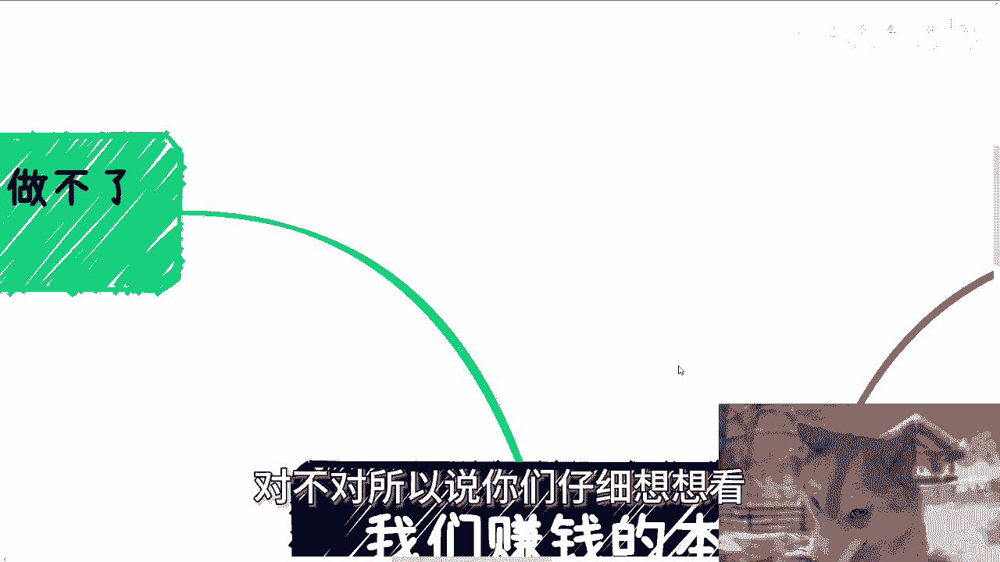

你说是因为我们就是很多人觉得是，因为我们什么都没有，真的是因为这个原因吗。

这他妈的不是啊啊第二，但是你想想看媒媒体它是不可能这样去报道的，为什么我就这么跟你们讲啊，2005年之后啊，就至少在我理解范围内啊，就是2000年之后，或者200005年10年左右嗯。

对吧就是说互联网的这个媒体宣发啊，其实大家默认都是虚的，为什么，因为没有办法，什么叫没有办法，就是当大家都在虚的时候，如果你不虚，那么你就是个垃圾，那当然你可能跟别人一样努力，你可能得到了这个很多啊。

或者你你你你就是付出了很多，但你就会在别人看来你不如别人，那虽然啊我们一直在说啊，不要在乎别人眼光，不要在乎别人眼光，对吧，对没有错，但是很多时候我们不是说要去在乎，但是你你你不去夸大，你不去虚。

你没钱啊，对不对，你对得起投资你的人吗，对得起自己的付出吗，你对不起啊对吧，但当大家宣发的时候，其实基本上都是实际融资的几倍啊，或者说那个五甚至是5~10倍，你你你们去往前翻，比如说翻2010年翻。

翻甚至更早的，你任何的融资啊，任何的合作，你但凡老老实实宣发的，那么你可能就没有后面接盘的资本了，那我就问你怎么办啊，你你就跟大家说，卧槽，因为因为我觉得这个啊诚信啊，我觉得这个老师是我最后的王牌。

要命了啊，卧槽他妈大牙都笑掉了，对不对啊，第三所以我们前两天给他们举的例子是这样子，我说咱就这么说啊，比如说今天研究院跟地方政府做了一个几千万，几个亿的项目啊，创办了一个园区啊，巴拉巴拉巴拉巴拉啊。

落了一个一个一个产业园对吧，或者怎么样子啊，好那么对于大众而言，参与方可能是研究院，某协会，某高校，某某地方政府对吧，然后比如说城投啊，资本啊对吧等等等没列呀，可能媒媒体就发这些对吧，但是我可以啊。

我在这个地方可以100%担保票的，跟你们讲啊，任何的合作，无论表面上多高大上，里面参与方一定会有别人啊，可能你告诉我可能只有啊研究院协会，高校地方政府承投资本吗，不可能对吧，里面难道真的只有这些组织。

真的只有大B端吗，也不可能好，那么我们来讲为什么很简单，因为无论甲方还是乙方哦，政府国央企是我们就这么问啊，政府国央企是他妈干活的单位吗，啊是他妈效率高的单位吗，不是对吧，你但凡接触过任何皮毛。

你就会明白他们最好就是躺着，然后他们你要帮他帮帮他们讲好故事，帮助他们怎么向上汇报，这就是他们要做事做的事情，而且就他们做事情的效率本身也不可能做好，那问题在于这几百万几千万，几个亿的项目要往前推动吗。

那我就问谁推动，谁来推动，我告诉你没人来推动，那这个时候就会有中间人，而且还不止一个对吧，就像我们说的，任何的项目合作当中总有脏活累活吧，对不对，那就是我们说的渣渣跟汤，总归有人要吃，总要有人喝吧对吧。

你让国央去吃，你让党媒央美吃，你让这些所谓的组织方吃，不好意思，大家谁都不买谁的账，谁都不愿意吃，因为谁觉得谁吃都是，清楚吧，对不对，那么一个项目如果真的咱们就说，如果一个项目真的透明的把参与方列出来。

当然这是不可能的，对不对，因为透明了就没有利润了，那么你就会发现它本身是一颗非常大的树，而不单单只是我们刚刚说的哦，就这些参与方，更何况这棵树越大。

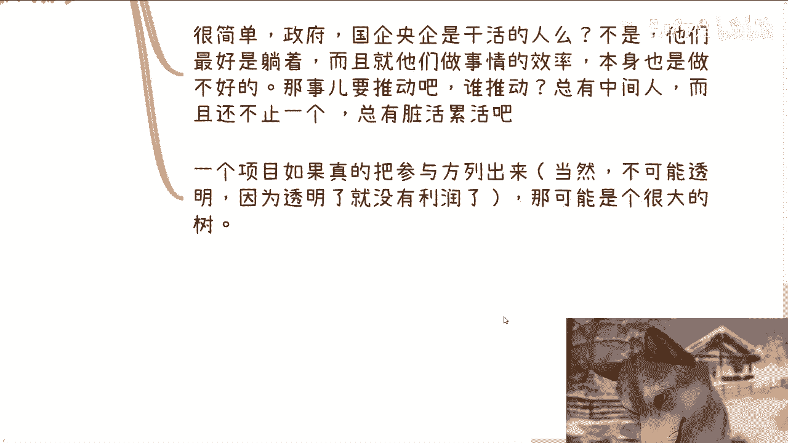

里面的油水就越多，里面的利润也就越高对吧。

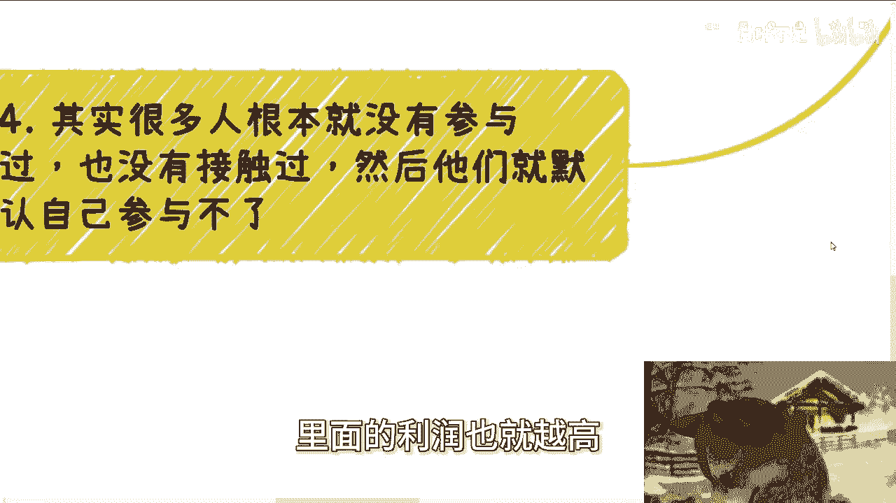

第四其实很多人根本就没有参与过，也没有接触过，然后他们默认自己参与不了。

那咱就这么说，你们口口声声都说哎我们是普通人，我们是普通人，从小PUA大，对吧好，那我就这么跟你们讲，普通人吃点渣渣，喝点汤，那么这里说的汤和渣渣是什么，那就是里面赚点小钱。

但是哪怕这些小钱的性价比也远远高于打工，对吧，完全不能比啊，当然我说你们记住啊，我们说的永远是性价比，不是单纯的金钱的量啊，就如我们刚刚说的，无论你做什么，你会在宣传里面吗，你会在媒体里面吗。

你会有露出吗，不会因为不配，对不对，因为你是nobody，但是你可以在里面拿钱啊，你明白吗，我配不配关又又关，你想想看，我比如说拿我来讲，我配不配我关心吗，我不关心我他妈只关心我能不能在里面拿钱。

对不对哦，我今天做了个项目，我还在宣发时，非要跟他妈的市政府说，你妈，对不对啊，当然有的人说到这，那我就跟他讲，怎么不服吗，还是觉得窝囊，没办法，我告诉你们，这就是我所知道的。

普通人唯一能高性价比赚钱的处境，没有了没了，你还能怎么办对吧，任何业务，无论你针对的是谁，上下游其实都很复杂，我们是不可能摸清楚的懂吗，就是你不可能说今天有跟你讲一个业务啊，你觉得哎呀很好像很简单。

我们举个例子，你比如说奶茶，奶茶里面有鲜果茶对吧，好我们就这么说，用糖浆的，它的成本很低，为什么，因为糖浆本身没有这么强的这个保质期对吧，同呃就是这种限制也没有，就是说受这温度很大的影响。

但是如你如果你做的是鲜果，真正的那些鲜果，那你就要去什么，你需要很强的冷链，你需要很强的供应链，对不对，但是我们仔细想想看，无论你今天做什么，你除非有本事啊，比如说奶茶的这种奶粉对吧，冲泡的啊。

包括就是说鲜奶啊，包括冷链，冷链里面，包括比如说卡车，包括冷链的技术对吧，包括仓库等等等，你除非告诉我所有东西全他妈是你做的，那没问题，你能控制你的成本，或者你的利润能够最高，但是你想想看。

如果啊但凡这当中有一个你是找别人合作的，或者怎么样子的，你上下游有这么容易吗，也就是说在这里面，每一层其实都有非常大的利润空间，或者都有非常大的油水，但只是我们不知道啊对吧，而且真正做业务。

谁会把所有东西都握在自己手上啊，那不现实的呀。

对不对，你就像那个大家都在吐槽三三大运营商啊，一天到晚他妈的打打打打，那个骚扰电话或者怎么样子，为什么，因为这种服务或者怎么样子早就外包了对吧，你让三大运营商里面的人啊，自己每天给你干活。

自己每天每天给你给你给你搞那些营销推推销，会不啦，我跟你们讲，你们你们就是没接触过，你们但凡接触过你们就会明白，不好意思，你们不配懂吗啊，就如我跟博士，那些博士前两天聊的就是看似方向很多。

但其实每个方向都有自己不了解的地方啊，也都是没有没有经历过的，那么只要你没有经历过，没有得到一个结果，那就不要纠结，你随便去找个去落，落不了就复盘看看缺什么对吧。

当下如果的确漏不了或者弥补不了你缺的东西，那就换方向对吧，我们要做的就是筛选，而不是让自己感觉他妈的哦，满地都是方向，然后卡在那边没有意义的呀，对不对，哦所以就是说我还是觉得啊。

就是说很多人嗯我之前就说的，就很多人就说听他是一个逻辑，就是你跟他讲的时候，他觉得有道理的，但是他自己去思考问题的时候，你会发现妈的哎，又回到了老的这个这个怎么说呢。

这个这个圈套或者这个这个这个PUA的，这个这个坑里面对吧，就是唉当然了，这事情也没这么快能解决，但是唉这不我每天每天给你们对吧，多讲讲呗，啊行啊，就这么着啊，然后那个呃大会大会的话，9月8号啊。

9月8号还能报名，继续报好吧，我会把那个活动链接放在评论区的啊，要报的话就直接报，然后剩下的话就直接规划商业规划啊对吧，就工作上面啊啊商业上面啊，你们有任何的自己的想法或者正在做的项目，有一些额需要额。

我给大家来做这种规划的，或者建议的，或者其他各个方面的，你们可以整理好对应的问题跟个人背景好吧，我们再来组咨询。

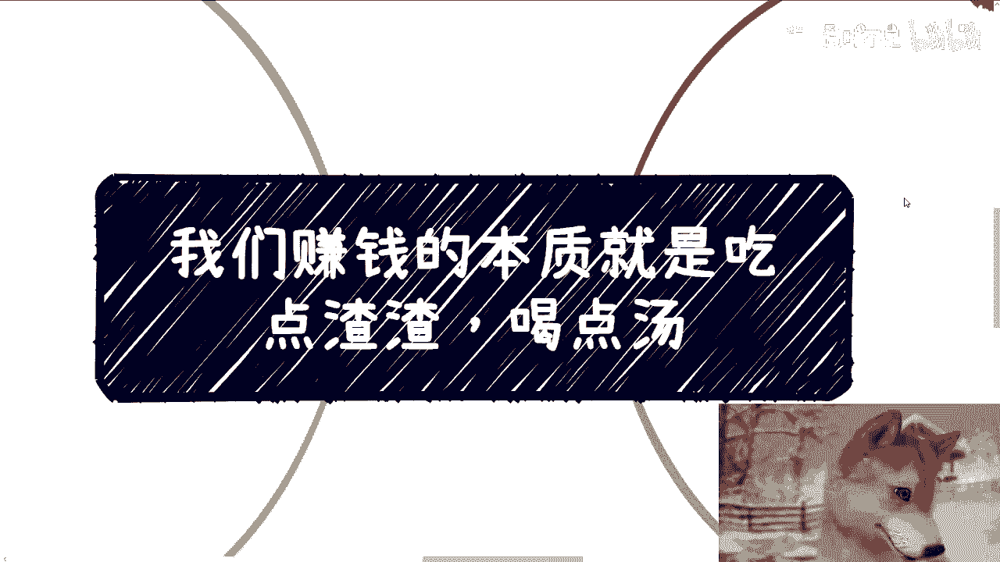