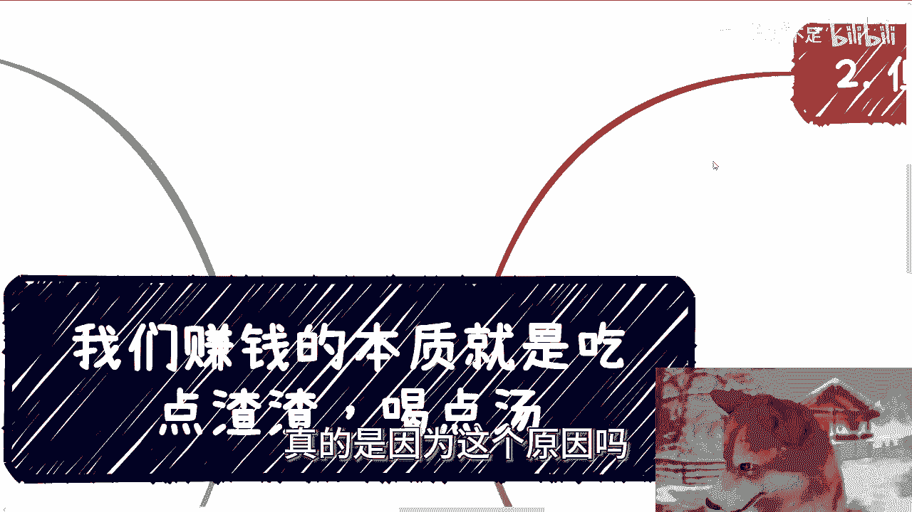
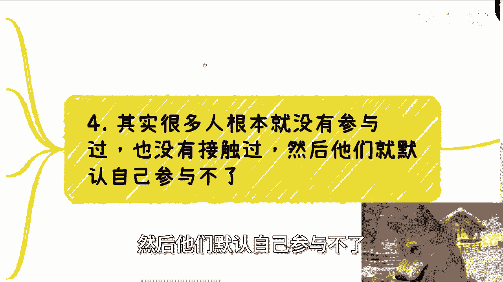

# 我们赚钱的本质就是吃点渣渣-喝点汤---P1---赏味不足---BV1h5H9eUE8W

在本节课中，我们将探讨一个在互联网领域流传已久的观点：“我们赚钱的本质就是吃点渣渣，喝点汤”。我们将深入分析这句话背后的多层含义，并解释为什么对于普通人而言，理解并实践这一理念是获取高性价比收入的关键。

## 核心概念解析

“吃点渣渣，喝点汤”这句话，表面上看是指赚得少，或者别人拿大头、自己拿小头。

但其本质含义是：普通人能赚到一些钱，尤其是性价比高的钱，已经非常不容易。在某些情况下，可能也只有特定的方式能让你赚到性价比高的钱。但相比于整个项目的总经费或总价值，你获得的这部分收益，确实只是“渣渣”和“汤”。

## 为何普通人觉得自己无法参与大项目？

以下是阻碍普通人参与项目或合作的两个关键心理因素。

第一点是，这种合作思维并未通过应试教育“灌输”给我们。试想，如果从高中或大学开始，教育体系就系统地教导我们如何在商业社会中合作，并不断强化这种观念，那么到今天，我们可能根本不会去纠结“自己有什么资源或商业价值”这个问题。我们会觉得参与合作是**默认（default）**的事情。正是因为缺乏这种前置的“灌输”，当我们面对未知的商业合作时，会本能地带着否定、恐惧和不确定的态度，从而变得畏首畏尾。

第二点是，大众媒体很少报道普通人参与大项目的案例。媒体通常只报道项目的主要参与方，如研究院、协会、高校、地方政府、城投、资本等。如果媒体能经常报道“某某几百万的项目是由路人甲、路人乙参与合作完成的”这类新闻，大家对于参与此类项目就不会感到如此陌生和遥远。因此，觉得自己“什么都没有”并非根本原因，信息环境和思维模式的局限才是关键。

## 商业世界的运行逻辑：为何“虚”是常态？

上一节我们分析了心理障碍，本节中我们来看看外部环境的现实逻辑。

自2005年或2010年左右以来，互联网领域的宣传报道普遍存在“虚报”现象。当整个行业都在夸大其词时，如果你如实宣发，反而会显得没有竞争力，可能因此失去后续的资本支持。这并非个人选择，而是一种市场环境下的无奈之举。为了对得起投资人和自己的付出，适度夸大有时是必要的生存策略。

## 大项目中的“渣渣”与“汤”在哪里？

理解了外部环境后，我们来看看大项目的内部结构。

任何大型合作项目，无论表面看起来多么“高大上”，其内部参与方都绝不仅仅是媒体报道的那些主要机构。无论是政府、国企还是央企，它们通常并非具体干活的执行单位，其运作效率也未必最高。一个几百万、几千万甚至上亿的项目要真正推动，必须依赖大量的“中间人”来承担那些“脏活累活”。

以下是项目结构的关键点：
1.  项目本身像一棵大树，主干是那些知名的机构，但繁茂的枝叶才是利润和机会真正分布的地方。
2.  这棵树越大，内部的“油水”和利润空间就越多。
3.  那些未被宣传的、由“nobody”承担的琐碎工作，就是所谓的“渣渣”和“汤”。参与其中，虽然名不见经传，但可以获得远高于打工的性价比回报。

## 如何找到并抓住“渣渣”与“汤”的机会？

那么，普通人具体该如何行动呢？

首先，必须摒弃“觉得自己不配参与”的心态。你的目标不是在宣传稿中露脸，而是在项目中拿到实实在在的回报。这是普通人能实现高性价比赚钱的少数可行路径之一。

其次，要认识到任何业务的上下游都非常复杂。以奶茶店为例，从糖浆、鲜奶、冷链运输到仓库管理，每一层都存在着巨大的利润空间和合作机会。没有人能完全掌控所有环节，这就为在不同层级“吃点渣渣，喝点汤”创造了条件。

最后，行动策略应该是“筛选”而非“空想”。看似方向很多，但每个方向都有你不了解的地方。正确的做法是：选择一个方向去尝试落地（`execute`），如果行不通就复盘缺什么；如果当下无法弥补欠缺的资源，那就果断换方向。核心是不断行动和测试，而不是停留在感觉“满地都是方向”却无从下手的焦虑中。

## 总结与行动建议

本节课中，我们一起学习了“赚钱的本质是吃点渣渣，喝点汤”这一核心观念。

我们分析了阻碍普通人参与商业合作的心理与信息壁垒，揭示了大项目内部真实的利润分配结构，并指出了普通人获取高性价比回报的具体路径——即放下“露脸”的执念，在复杂的商业链条中寻找并承担那些未被宣传但有利可图的环节。

记住，关键在于**行动**与**筛选**。如果你有具体的商业想法或项目需要梳理规划，可以整理好你的问题和个人背景，寻求进一步的咨询。

（大会报名信息：9月8日截止，活动链接见评论区。）