# 我发现了大部分人的一种思想钢印 - P1 - 赏味不足 - BV1Tg4y1C7fo

好大家好啊，呃今天礼拜几礼拜天啊，昨天那个上海活动啊是非常非常成功啊，真的是超乎我的意料呃，但是也有一个非常失败的地方，就是现场没空调啊，这个呃是我这个重大的问题，因为之前定的时候呢。

就觉得可能温度不是特别低啊，就没有那个，然后那个场地呢，现场的那些小伙伴没有办法去掉那个空调，都是需要物业的，所以说基本上昨天唉很冷啊，对不起大家呃，然后那个深圳啊，深圳活动时间已经定了。

放在1月13号，我看看啊，1月呃第二个礼拜的礼拜六礼拜六，然后月13号时间已经定了，场地也已经定了，钱已经付了，然后呢，大家反正要报名的，这个也可以私信我报名呃，钱跟之前一样的，反正一个人300。

然后找我咨询过，那么就打对折好吧，都一样都一样诶。

OK好，然后我们来讲主题啊，就是我发现了一个大部分人的啊，在三体中说的一种东西叫思想钢印啊。

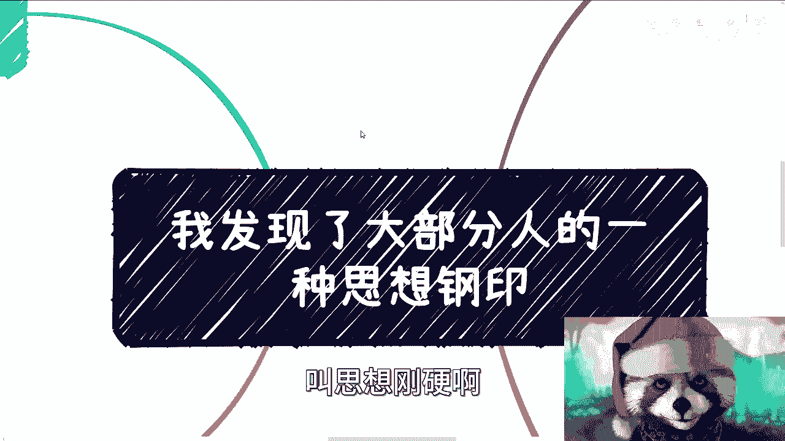

呃经过大量的沟通之后呢，我发现了一个问题啊，什么问题。

就是比如说我跟大家聊面试的问题啊，比如说我跟大家聊工作的问题，比如说我跟大家聊恋爱的问题，比如说我跟大家聊怎么去社交的问题，就是所有的这些问题当中。

就是我都发现了一种思想钢印，就是说貌似呢也许你们有自己的想法啊，然后呢也有自己的目的，也有自己的出发点，但是呢你会发现只要对方说什么，基本上他就会顺着对方的思维去思考。

然后呢就忘记了自己原本的目标和想法，就这个事怎么说呢，这个事呃你一次两次没关系啊，但是大部分情况是长期呃，长期经历的同时呢。

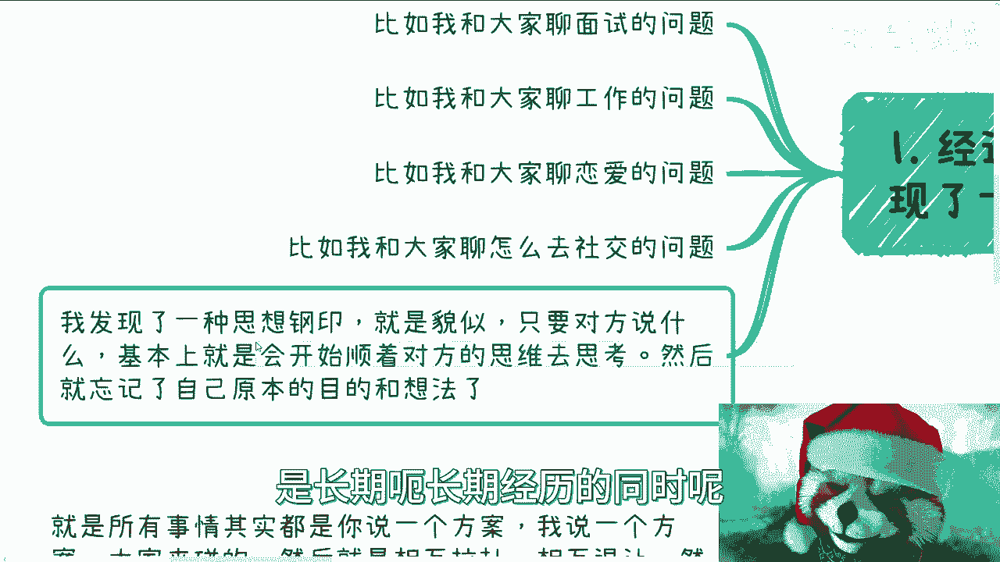

自己又没有太大感知啊，那么我仔细思考了一下这个事情，我觉得基本上呢还是说是呃这个应试教育，还有这个叫啊。

从小在这种家庭教育所导致的根本问题啊，那么一方面呢，很多人其实嗯没有太直接自己的想法，他就觉得你问我有什么东西我也不知道啊，然后呢他也不知道自己有了想法之后呢，对不对啊，所以说姑且当做没有。

那么另外一方面呢，当对方抛出一个想法之后呢，呃现在大部分人他也很难去判断对方，这个想法到底靠不靠谱啊，但是他在思考出来靠不靠谱之前呢，他就只能开始顺着思考，那么你说自卑也好或者不自信也好。

我觉得其实都不是根源的问题，还是在于他对于这个社会上生存的认知的误解，因为这种follow别人就我下面一直写嘛，就这种顺着别人的思路去走的逻辑，你会发现在进入社会之前都是OK的，也都走得通。

而且你也都能尝到甜头，为什么，因为你考试可以考得好啊对吧，然后你比如说作为一个乖乖的同学生，对老师喜欢对吧，然后家长也喜欢对吧，然后你就会觉得哎，我可能是活在这么一个框架当中对吧。

然后我觉得整个世界整个社会都是这样子的，然而并不然啊对吧。

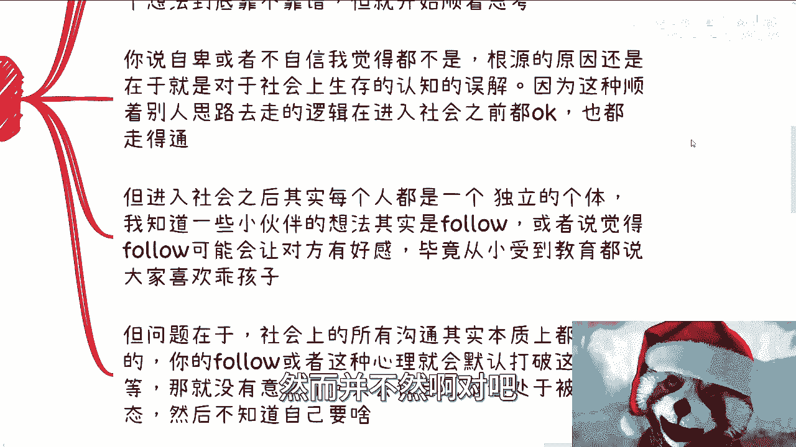

因为你他就说你只是在这进入社会之前，你按照这个方式去做呢，你是OK的啊，这个OK指的就是说你最多不会你不会犯错，同时呢你甚至还能得到别人的赞赏啊，但是问题就在于这里，就是这种不犯错或者这种赞赏。

就会让所有人会对这个社会上的生存的，这种模式产生一种误解，你进入社会之后，其实每一个人啊，每一个公司，每一个社会，每一个这个这个组织啊，他都是一个独立的主体，那你我知道一些小伙伴的想法是follow。

或者说觉得follow会让对方有好感对吧是的，我知道你们内心会有这种想法，就觉得啊这个人可能比较牛逼啊，我说我follow她一下对吧，怎么样啊，这个可能能更接近他一点对吧，或者怎么样。

那毕竟从小受到的教育。

都是说大家喜欢这么这么一个乖宝宝对吧，但问题在于，社会上所有的沟通其实本质都是平等的，就是你的follow或者这种心理，会默认打破这种平等啊，那么这种就没有意义了，因为你追求的是大家平等的沟通。

但是你的这种follow和这种心理，他会默认将大家沟通一下子变得不平等，而不平等之后，你又会处于一个完全被动的状态啊，那么最终就可能会白嫖啊，可能会被被被被割啊，或者被骗钱啊。

或者被怎么样子就导致了你又会去抱怨，就说啊，怎么社会上人都这么垃圾对吧，怎么都这样啊，怎么样怎么样怎么样对吧啊，这不是啊，因为本身社会跟整个世界它就这个样子，你不能因为说哦我从小受到教育不是这样子。

所以我去抱怨社会他妈的是。

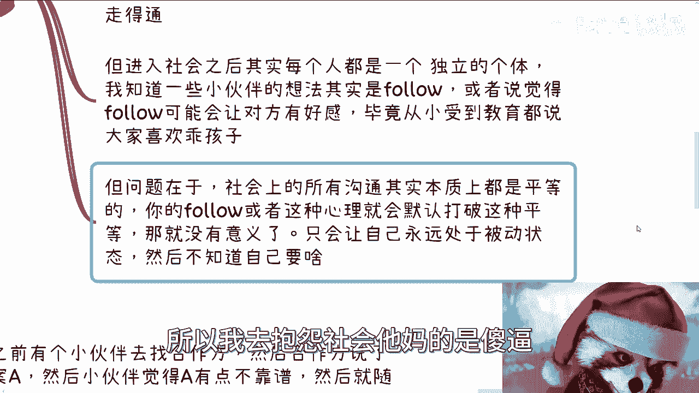

你觉得合理吗，对不对啊，那么我们来举个例来举一些例子。

比如说之前有小伙伴去找合作方啊，然后合作方说了一个方案A啊。

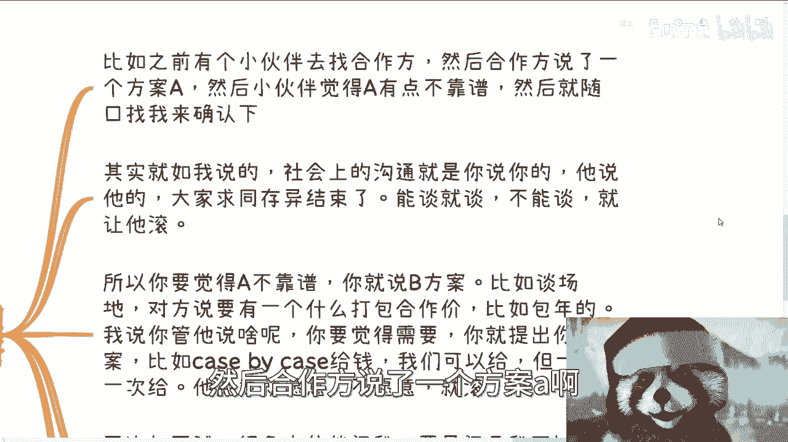

然后小伙伴觉得A有点不靠谱啊，当然我这边这是为了保护大家的一些隐私啊。

我就不去说了啊，就觉得A不靠谱，然后呢随口来找我确认一下啊，那其实呢我听下来呢，我就就我一下子就跟他讲了，我说你这个问题不是出在A方案靠不靠谱，是出在什么呢，就是我说的啊，社会上的沟通呢是你说你的。

他说他的，我说我的大家呢求同存异就over了，你明白吗，就是你讲的靠不靠谱没关系，我讲的靠不靠谱也没关系对吧，你比如说昨天上海活动啊，大家也见到了，我见到了张老师对吧，我跟张老师的合作其实都一样。

就是你比如说张老师昨天晚上回杭州对吧，他跟我说唉，他说我们有个什么东西合作一下啊，他给我抛了个方案，我说要不这样啊，我说这样子，我们回头呢找个时间啊，语音沟通一下，你说你方案。

我说我的想法大家拼一下对吧，比如说这个语音就10分钟，15分钟，大家15分钟之内讨论出个结论不就好了吗，对吧哦难道说是张老师给我一个方案，然后我就开始嗷嗷，张老师，我觉得你要不这样子。

比如说张老师说一次给我1万对吧，那我说要不张老师这样，你一次给我1万21万3，但问题不在这个地方，是在于这个方案，这是张老师想的，这不是我想的，我还没仔细看这件事情对吧，那么我只能跟他说的是。

我说等我们后面找个时间，你说你的方案，我说我的方案对吧，能谈就谈。

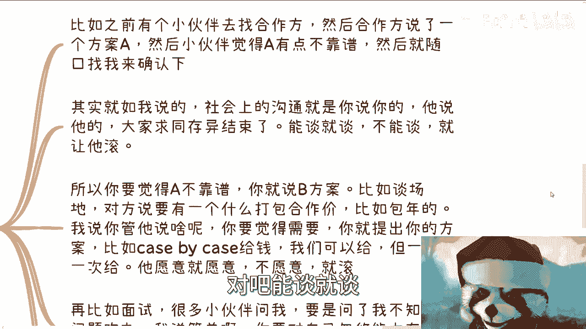

不能谈就滚，不就结束了吗，所有人都是一样的呀对吧，你说我跟他去聊这个东西啊，难道我们聊不通，觉得大家不能合作好，然后还在那边打语音，打一个小时有意义了，没有意义的，你对所有人都是一样。

就是你所谓在商言商是什么意思，就是撇开所有东西，大家就讨论这个方案合不合理对吧，所以就像我那个小伙伴来找我的，就是如果你觉得A方案不靠谱，那你就说一个你的方案，我们称之为plan b，对不对好。

那如果谈场地啊，对方说要一个什么打包价，比如说包年的对吧，一年比如说3万块钱对吧，那OK啊，我就跟他说，我说你管他说啥呢，他他妈说一年包10万都跟你没关系啊，为什么就是你先评估他的场地，他的给你的服务。

你要不要，如果你觉得诶我的确要的对吧，就比如说你自己评估下来，你觉得我的确是要的，同时呢我也愿意付钱的，那也很简单啊，你可以提出你的方案，比如说一次一次去付钱，case by case的去付钱。

我们不是不付，但是我一次次给，对不对，那一次给是什么意思啊，意思就是说我得先看你靠不靠谱啊，你凭什么让我付个年假对吧，我对你不了解我，我他妈一年不给你个包年假，我他妈脑子有毛病嘛对吧，就是我跟他讲了。

你就给他抛出你的方案，他要愿意就愿意不愿意不愿意，那就滚啊，你再比如面试，很多小伙伴问我，他说要是面试官问了我一个不知道的问题咋办，我说简单啊，你要对你的忽悠能力有信心，你就绕绕到对方晕啊。

绕到对方觉得卧槽，你回答出来了，牛逼对吧，你要没信心，你就说这块东西你不清楚就直接了，当你别跟他绕，你绕不过他的，你明白吧，你要没信心，你就说你不清楚。

但是啊但是接下来你就要说你了解的那部分，什么意思，就是在整个沟通当中，你要掌握主动权，因为本身面试这件事情是双方的啊，谁也都是面试官，谁也都是被面试的，不是说你去面试主动权都在对方那边啊，我就跟你们说。

我从我自从大概工作了45年之后啊，我出去面试，那我真的我说不好听点，我就除了我就差把脚抬到桌子上了，就我过去态度永远是很的，就是不是他来问我，你问我什么不重要，我跟你商量，我是我告诉你。

我会什么不是你来问我，我会什么就这么简单，为什么，因为我来是为了展示我自己哦，你一天到晚问我是不会的，那他妈你都会吗，对不对，有意问了没有意义的呀对吧，那我们作为一个去面试的人。

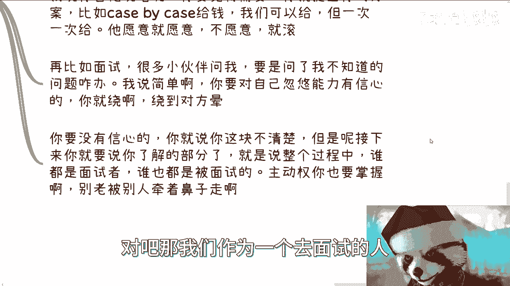

你老被别人牵着鼻子走有什么用呢，那么所以说你们回想回想日常所有的那些沟通，包括包括那个什么面试啊，其他的商业合作啊，包括一些东西，你们回想回想。

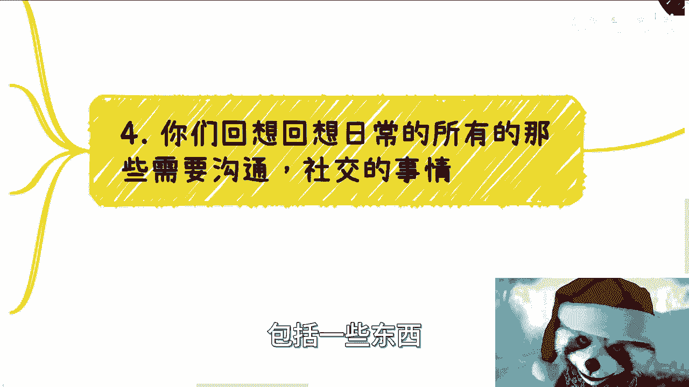

就是说所有的事情都是你说一个方案，我说一个方案，大家来碰呃，然后相互拉扯，相互退让，然后大家相互满意了就好了，你别管他怎么满意啊，对对方如果是真的满意，那最好，那对方如果憋屈的满意也行，为什么。

因为商业上本来就是这样子的呀，我只关心你同不同意，我只关心你愿不愿意，我只关心你最终合同敲不敲窗啊，你你比如说你今天跟别人合作，别人敲完章回回到家他妈摔东西对吧，回到公司他妈跟他合伙人吵架。

跟你有什么关系啊，这个啦为什么，因为一切以结果为导向没了呀，而不是说你要去顺着对方去想，因为很多时候我跟你讲啊，这种思想钢印很容易被对方看出来，对方只要有点经验，有点这种阅历的，它很容易看出来。

那么看出来之后呢，你还很容易被利用啊，那么基本上你就完全处于被动状态，没有意义的啊，我一直说有很多事情，很多问题我们真的需要自己去多看看自己，因为你的选择，你的态度，你的做事情方式也会改变。

别人对你的态度也会改变整个事情的走向，其实都是一样的，你不能就像我们刚刚说的，你不能说因为我受到的教育，这样子我出来发现社会跟我认知的不一样，我就不停的抱怨社会有用的啦，你想看有用的啦对吧。

就我发现很多人啊，他没有这个意识，就包括他们跟我在做咨询，在沟通的时候，我也是跟他们说，我说你们别跟着我说啊对吧，我说我只是跟你讲我的一个想法，我的一个建议，我说你要告诉我你的想法对吧。

哦你觉得应该怎么样子，然后我们来讨论嘛，我们来battle嘛对吧，这个是根本啊，你老跟着我说，跟着我想的有什么用呢，因为我不了解你呀，你必须给我提供更多的信息，那这样的话就说我比如说我给了你一个方案。

或者我给你个建议，那么你也可以跟我说，哎那个陈老师，我觉得你说这个当中呢，有些东西我可能做不了对吧，或者说你觉得这个当中以你的认知，觉得这地方有风险对吧，那大家在讨论嘛对吧。

不是说比如说我今天抛给你一个东西好，你就别想哦，好像有点道理啊，然后呢怎么样怎么样对吧，你就你就开始就说就说顺着这个方向去考虑了，你别去顺着他考虑对吧啊，所以说你很多就是这个合作或者很多东西啊。

你看似合作了，看似你成长了，其实没有啊对吧，因为你整个都是个follow，那那那怎么搞啊。

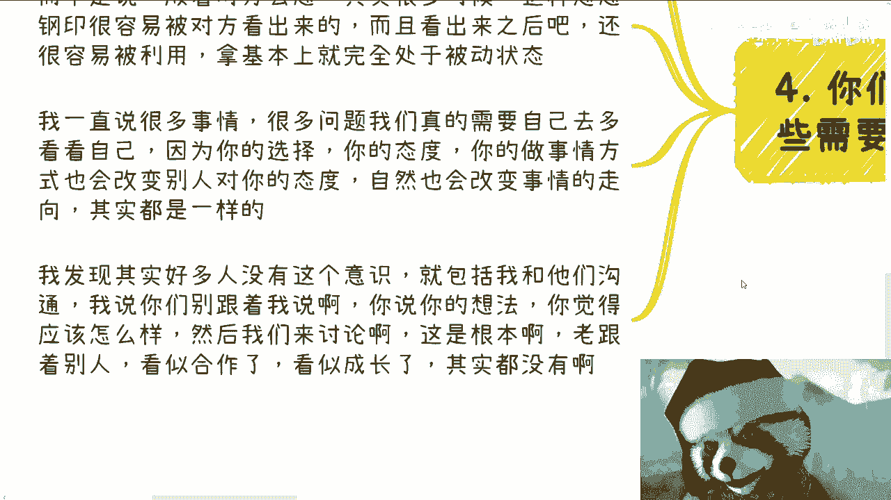

对吧，所以我就说啊，就是说就像我之前有一期内容里面。

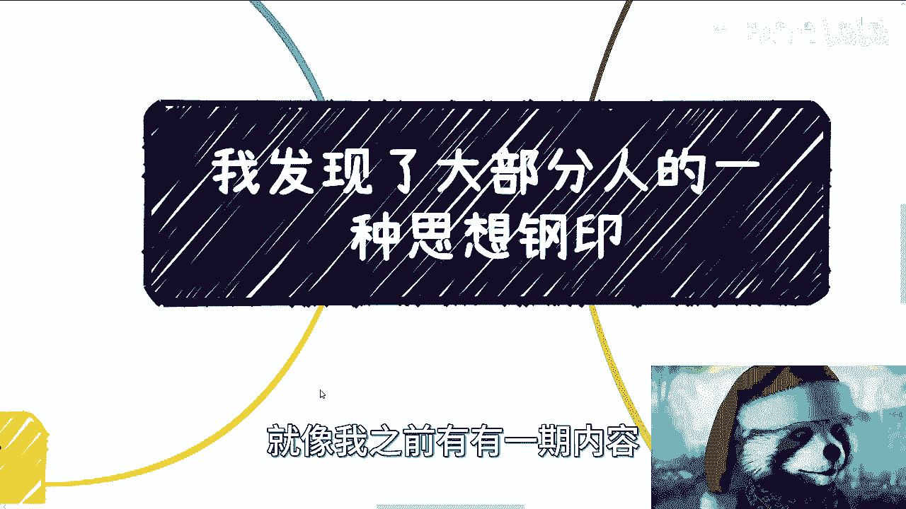

也跟大家讲这个讨价还价的问题，就是就是我觉得其实讨价还价是一个，非常体现自我能力啊，跟自我想法的这个这个过程对吧，那当然有些人我就我跟你们讲，有些人很搞笑的，就是他倒下还价，他也不看看自己是谁。

他也不看看自己有什么定那个这个立足点，然后就来讨价还价对吧，你讨价还价，你是要有资本的，行啊，那我们这一期就讲这么多吧好吧，然后深圳这边活动，明天我会发那个具体的那个介绍好吧，然后反正报名的话。

你们私信我行，那就这么着吧。

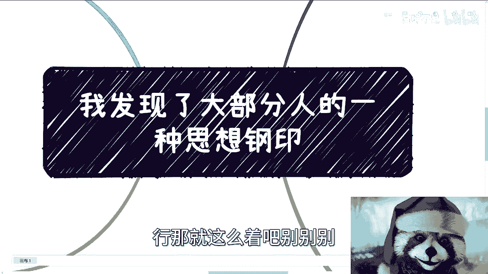