# 我发现了大部分人的一种思想钢印---P1---赏味不足---BV1Tg4y1C7fo

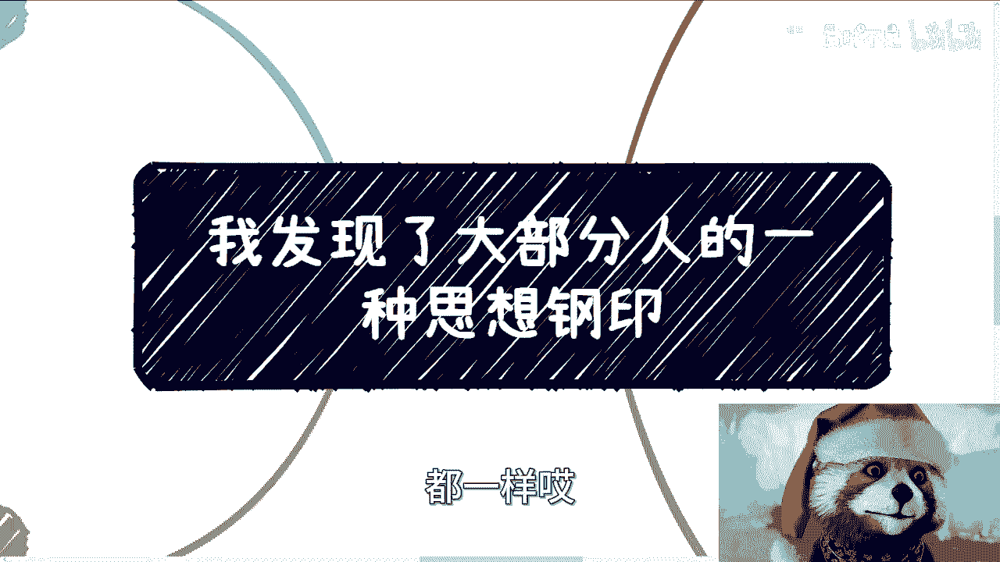

在本节课中，我们将探讨一种普遍存在的思维模式——“思想钢印”。这种模式会让我们在沟通中不自觉地跟随他人的思路，从而忘记自己的目标和想法。我们将分析其根源，并通过具体场景学习如何建立平等、主动的沟通方式。

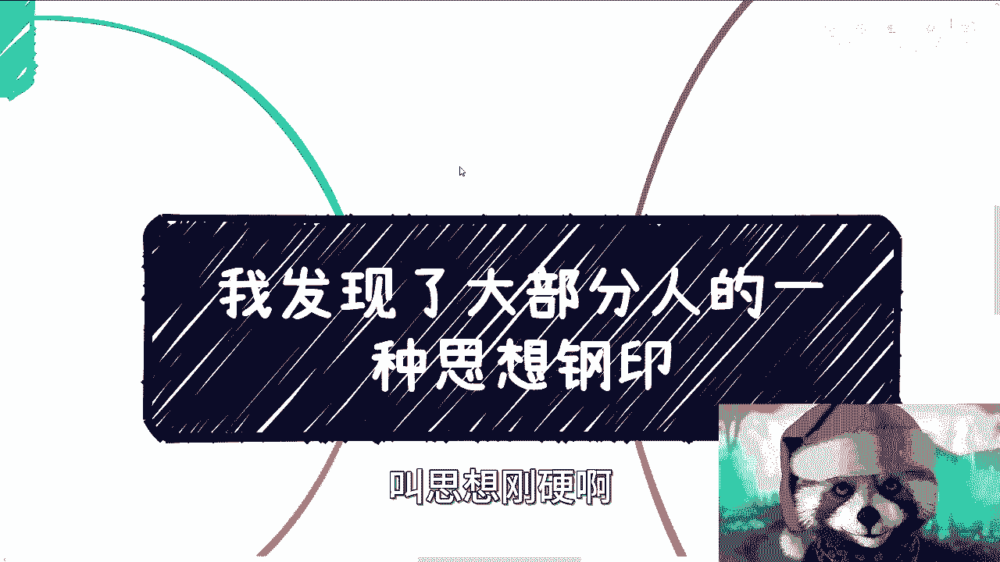

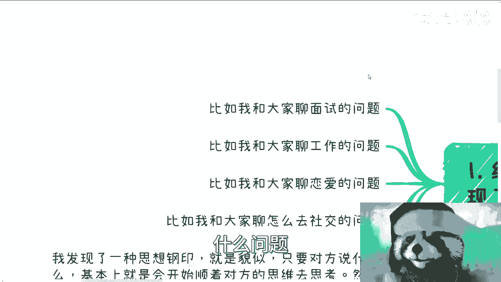

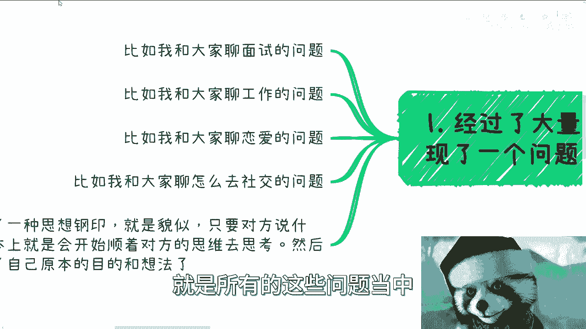

## 课程概述

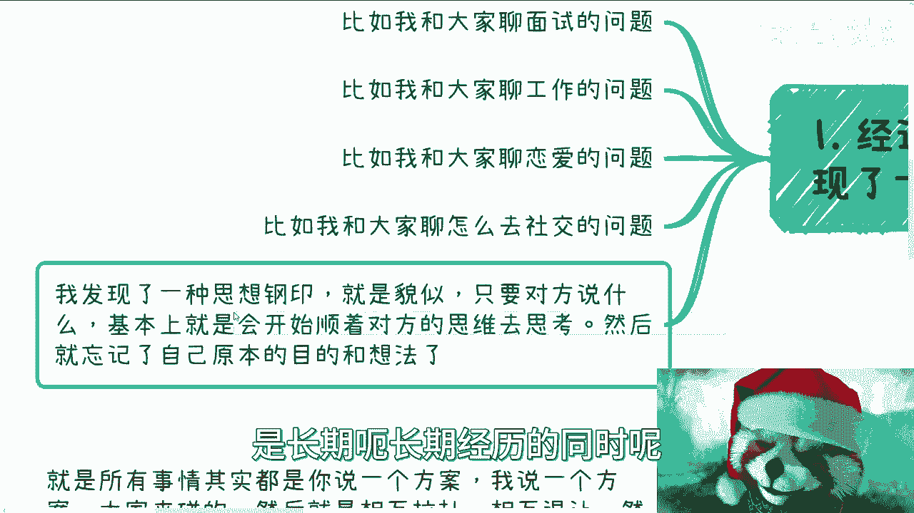

“思想钢印”一词源自科幻作品，它形象地描述了一种根深蒂固的思维惯性。在现实生活中，许多人习惯于在沟通中顺着对方的思路走，这可能导致在面试、商业合作等重要场合失去主动权。本节课程旨在帮助你识别这种模式，并学习如何打破它。

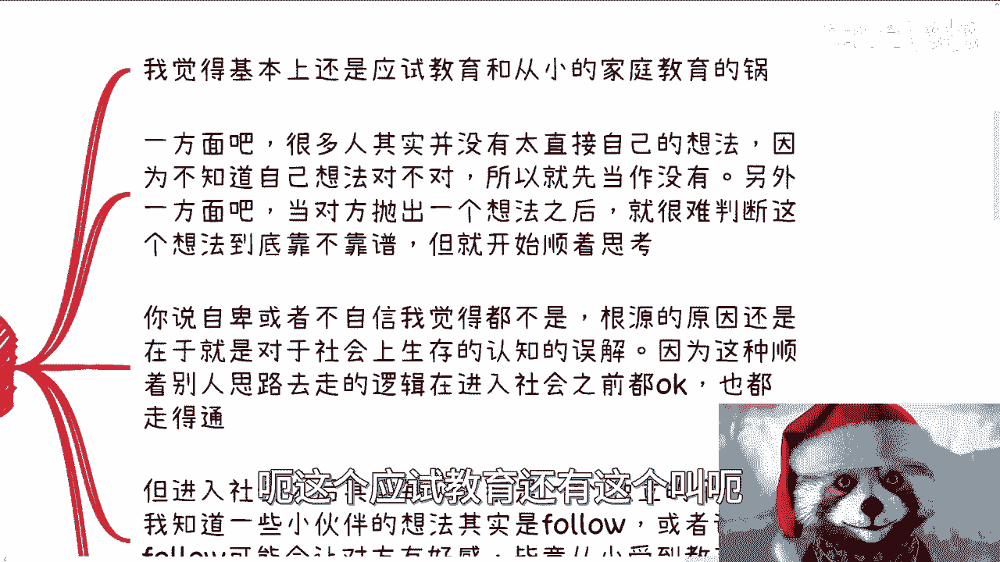

## “思想钢印”的表现与根源

上一节我们概述了“思想钢印”的概念，本节中我们来看看它的具体表现和形成原因。

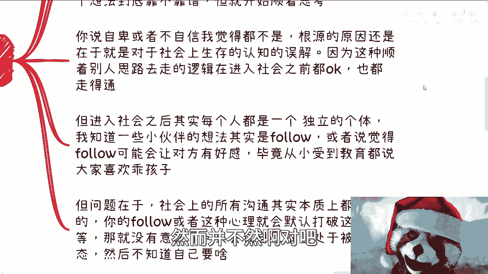

经过大量沟通观察，我发现一个普遍问题：在讨论面试、工作、恋爱或社交等话题时，许多人虽然有自己的想法和目标，但只要对方提出一个观点，他们就会立刻顺着对方的思维去思考，从而忘记了自己原本的意图。

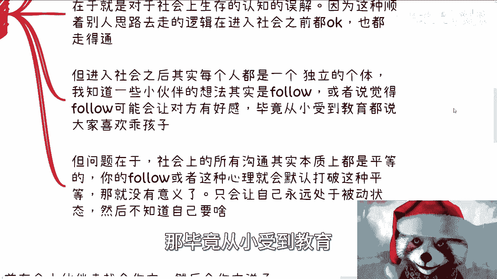

这种现象并非偶然。其根源主要在于长期的应试教育和家庭教育。一方面，很多人没有明确自己的想法，或者对自己的想法不自信；另一方面，当对方提出观点时，他们缺乏快速判断其可靠性的能力，于是只能先跟随思考。

这种“跟随”逻辑在进入社会前往往是有效的，例如能取得好成绩、成为老师家长喜欢的“乖孩子”。这会让人产生一种误解，认为整个社会的运行规则也是如此。然而，社会与学校是截然不同的。

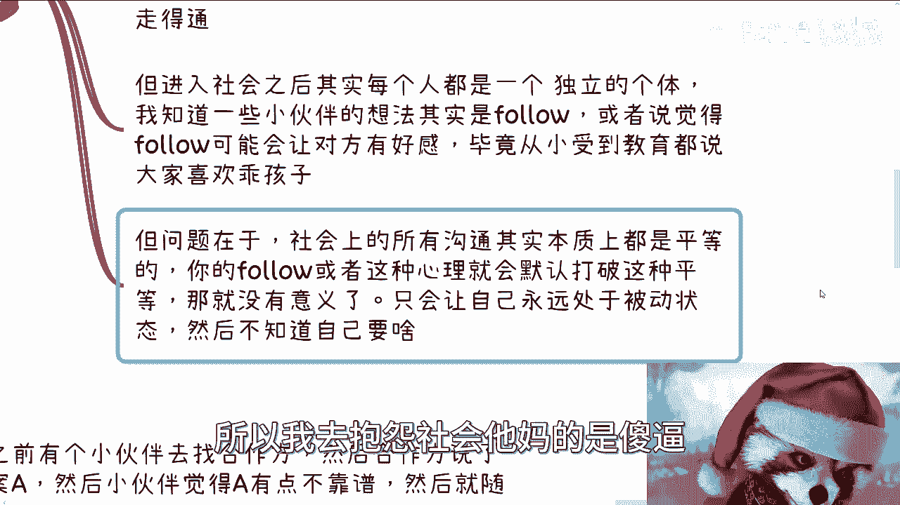

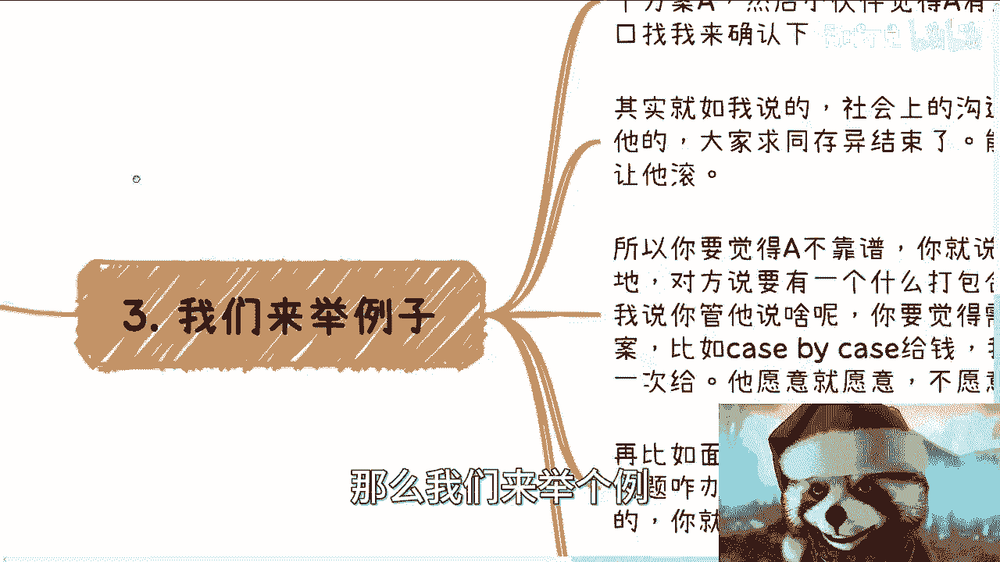

## 社会沟通的本质：平等与主动

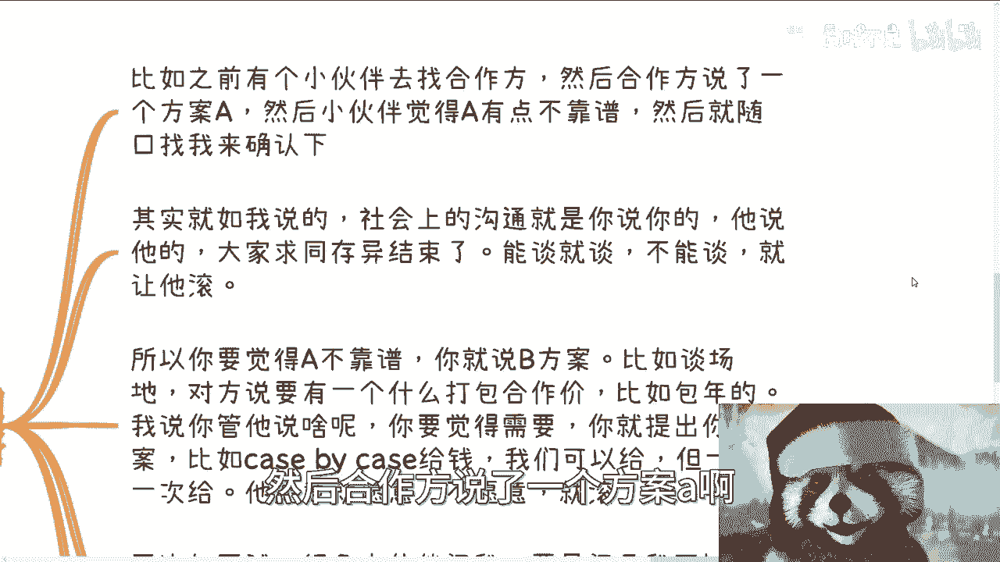

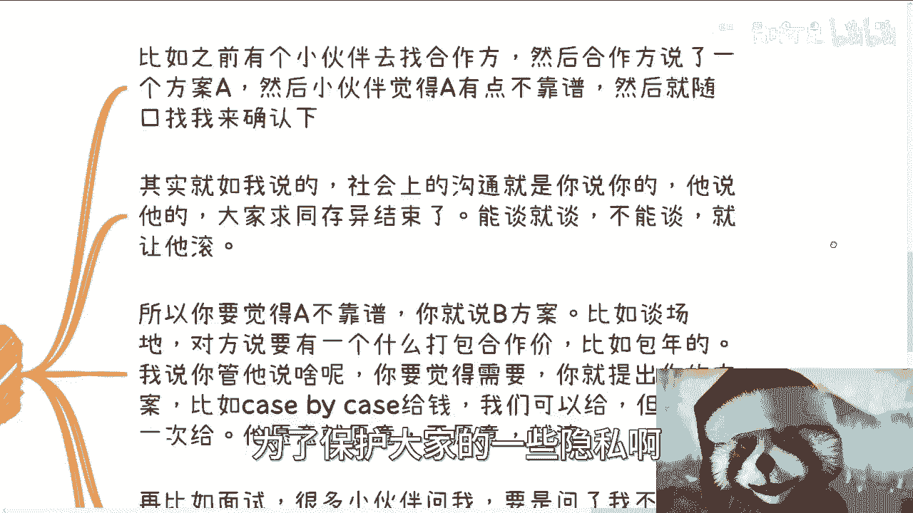

理解了“思想钢印”的根源后，本节我们来探讨社会沟通的真实规则。

社会上所有的沟通，本质都是平等的。你的“跟随”心理会默认打破这种平等，使你处于被动地位。被动可能导致你的利益受损，例如被“白嫖”、被欺骗等。此时抱怨社会是不合理的，因为社会本就如此，问题在于我们携带了错误的“操作手册”。

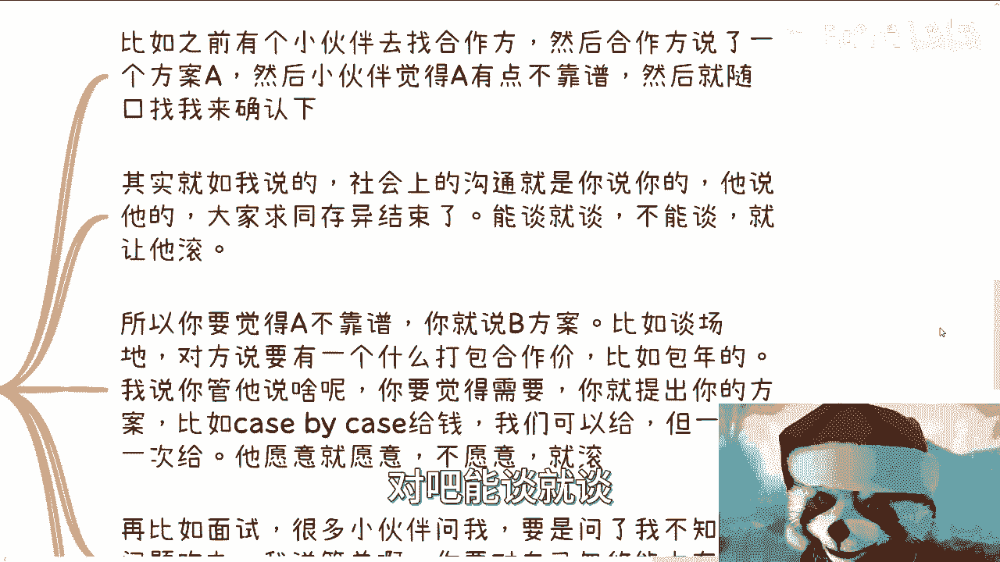

社会沟通的核心模式是：**你说你的，我说我的，大家求同存异**。其公式可以概括为：
```
有效沟通 = 提出己方方案 + 评估对方方案 + 平等协商
```

## 实战案例：如何在具体场景中应用

理论需要结合实践。下面我们通过几个常见场景，看看如何运用平等沟通的原则。

以下是几个打破“思想钢印”的实战案例：

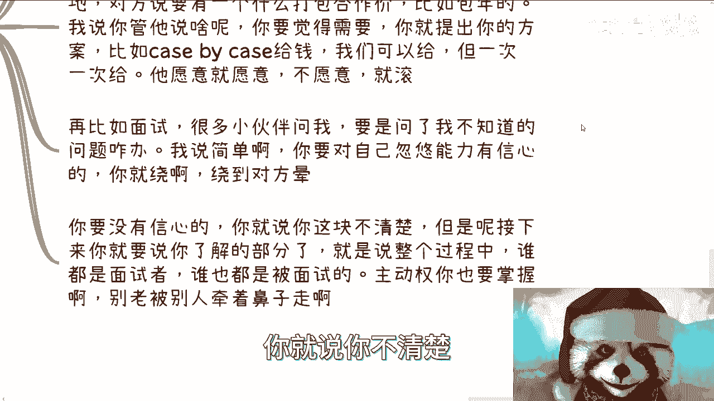

1.  **商业合作**
    *   **场景**：合作方提出了一个你觉得不靠谱的A方案。
    *   **错误做法**：反复思考A方案哪里不好，试图修改A方案。
    *   **正确做法**：直接提出你自己的B方案。例如，对方要求包年付费，你可以提出按次付费。能谈就谈，不能谈就结束。

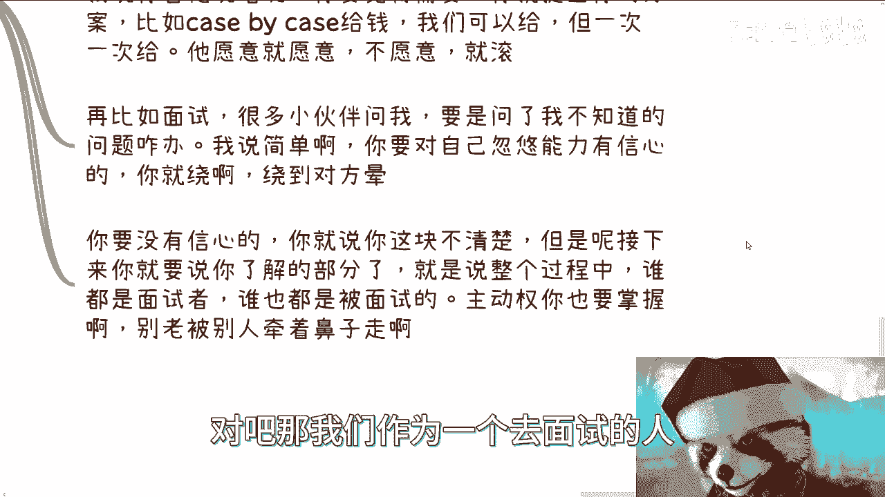

2.  **面试**
    *   **场景**：面试官问了一个你不会的问题。
    *   **错误做法**：硬着头皮胡扯，或陷入沉默。
    *   **正确做法**：
        *   如果善于表达，可以尝试将话题引向你熟悉的领域。
        *   如果不擅长，直接承认不了解，但紧接着要强调你了解的部分。例如：“这个问题我目前了解不深，但我对与之相关的XX领域有深入研究，我认为……”
        *   核心是掌握主动权，面试是双向选择，你也在面试对方。


3.  **日常咨询与沟通**
    *   **场景**：向他人（如导师、朋友）寻求建议。
    *   **错误做法**：全盘接受对方的建议，不再思考。
    *   **正确做法**：将对方的建议作为输入，结合自身情况提出你的想法和疑虑。例如：“您说的方案A很有启发，但我考虑到自身情况B，如果采用C方式调整是否可行？” 通过讨论和“Battle”得出最适合自己的结论。

## 核心心法与总结

本节课我们一起学习了“思想钢印”的识别与破解之道。

要打破“思想钢印”，关键在于转变心态：**从“跟随与回答”转向“提出与协商”**。所有的社会互动，无论是合作还是面试，都是一个双方抛出方案、相互拉扯、最终达成一致的过程。你只需要关心最终结果是否达成，而不必纠结于对方是否“舒服”。

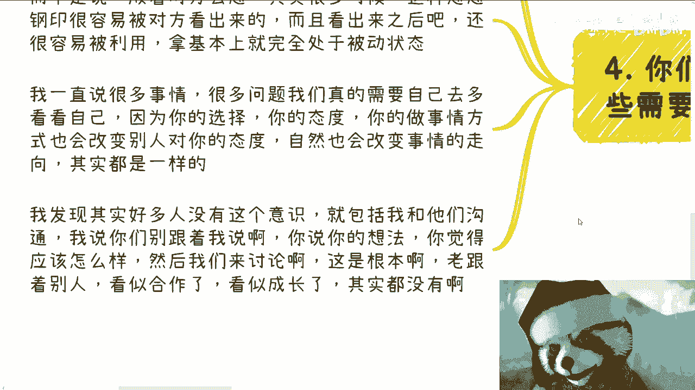

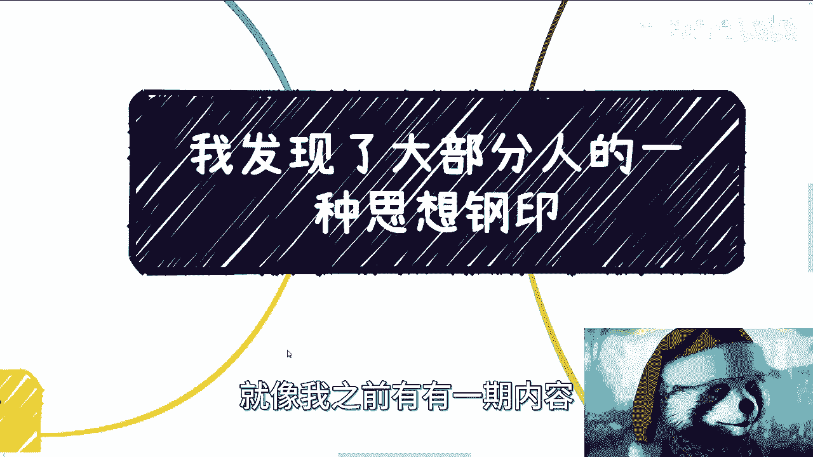

你的选择、态度和处事方式，会直接改变他人对你的态度以及事件的走向。就像讨价还价，你需要有自己的“资本”和“立足点”。请记住，有效的沟通始于平等的姿态和清晰的自我表达。

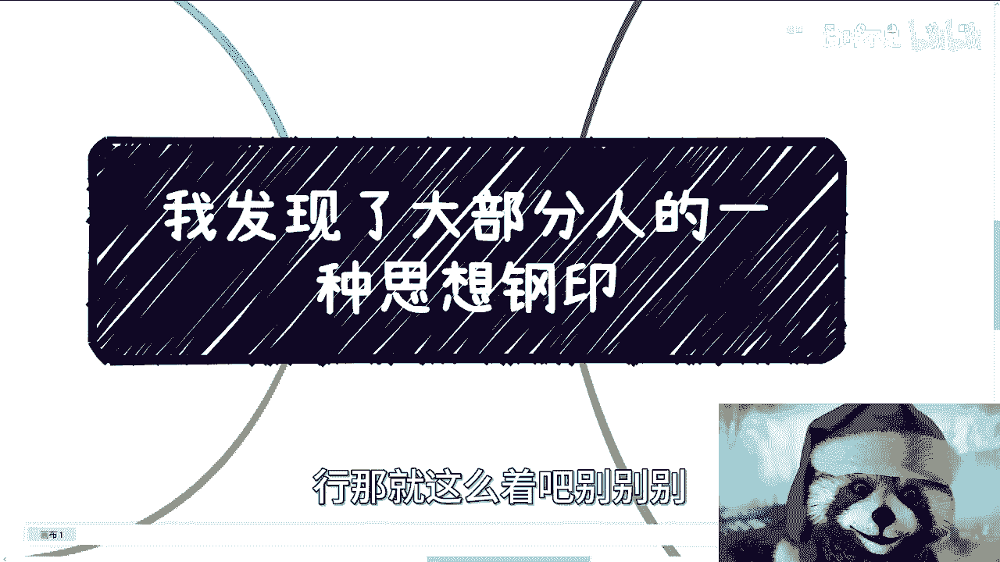

希望本课能帮助你建立更主动、更自信的沟通方式。