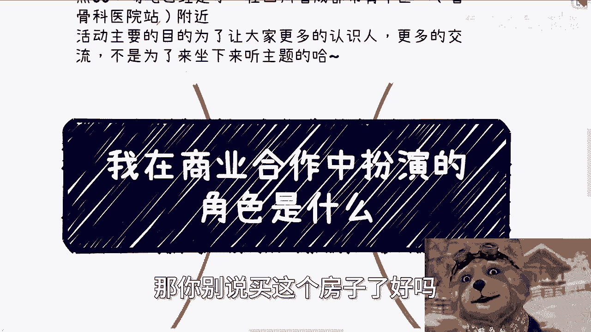

# 我在商业合作中扮演什么角色 - P1 - 赏味不足 - BV1h7421o7YF

好大家好啊，这个今天呢我们来讲的这个主题啊，是我在商业合作当中，表演扮演的这个角色是什么，呃之前其实也有就咨询当中，也有一些小伙伴问过这个问题啊，嗯而且呢其实可能大家也比较感兴趣对吧。

我扮演到底是个什么角色对吧，那当然啊就有一说一啊，就是并不是说只有中介跟不中介这个角色啊，你要是说那这个社会能有这么简单的话，那我们也不至于这么辛苦啊，然后关于我昨天买房子的事情，我也顺便提一点啊。

我买的呢是在新天地啊，然后你们可以查一下，新天地在上海是什么位置啊，然后呢也是天时地利人和机缘巧合，那个时候买的啊，2014年基本上就是涨的之前啊，然后呢嗯去年正好是10年的时间对吧。

10年的时间我把贷款还完了啊，反正就是这么个情况啊，就是我也不想表达别的意思啊，我想表达的意思就是说，如果我一直是一个工作的状态，我一直是只是一个工作的状态，那你别说买这个房子了好吗。

就这辈子我是没这个希望的，你们自己去查查看新天地现在是什么房价啊，那继续啊，本期活动程度已经定了，6月16号下午01：30到六点钟啊，场地已经定了，在青羊区省骨科医院附近好吧。

然后呃详情的话你们要报名的话，你们就是私信我，好吧啊，那么我从我毕业啊，到现在我给你们分了四个阶段，第一啊我刚毕业的一段时间啊，额在商业上面呢，那个时候呢就本质上我也没啥好懂商业的。

因为那个时候就不懂啊，现在呢据说其实都是他妈的马后炮啊，就就就就哼回头总结啊，那么事后诸葛亮，那么你比如说刚毕业的那几年呢，我觉得我商业上的角色就两个，一个是政企的咨询讲师啊，说是说咨询讲师啊。

当时讲的是安卓和OSIOS的技术嘛对吧，那你说是说咨询讲师，其实他妈就是工具人嘛对吧，那另外一个呢就是会议的主办方，就是我说的那种沙龙的主办方，因为我当时不是上一个视频，我不是也说了嘛对吧。

我想去了解各更多的一些信息，那我怎么办呢，我只能去半沙龙对吧，那听上去高大上，卧槽咨询讲师对吧，他妈的上轮主办方其实呢呃杂牌军啊，那么资深讲师这种呢其实就是通过线下啊，其实当时压根就没有多少线上的东西。

那跟现在不太一样嘛对吧，都是线下活动来的人啊，可能呢这些人里面有第三方的培训公司，有第三方咨询公司，也有可能是中介，也有可能是骗子啊，反正无所谓啊，反正陆陆续续就是都会找我，那么有的人白嫖。

有的人给我钱，呃反正我当时因为我毕毕竟刚毕业嘛，我也不懂嘛对吧，就是说难听点，你给我钱，你给不给都行啊，你你想怎么白嫖，怎么白嫖，反正我也不懂啊，我又没概念啊，能有人找我就不错了啊，那么我就很开心了。

然后呢一直做对吧，做了大概有个一年左右的时间啊，呃做了一年左右时间呢，我才知道我应该拿多少钱啊，然后呢为什么我知道啊，其实是因为信息差被抹平了，我给你们三秒钟时间，你们想想看，为什么啊，321对吧啊。

我跟你们讲啊，为什么啊，很简单就是因为找我的人越来越多，找我的人越来越多呢，我就会明白我应该拿多少钱对吧，你想想看，你比如说有的人跟我说啊，这个你应该多吃点苦，都被白嫖对吧，那么我又不懂得了。

那么我就以为我应该被白嫖对吧，好然后又有一些人呢可能跟我说，哎陈老师啊，你可能一次对吧，一个小时我给你个这个三四千对吧，两三千啊，那么我可能觉得哦好像蛮开心的对吧，因为我当时我毕业的时候。

我薪资才1600嘛，一个月嘛1600嘛，然后我就知道哦蛮开心的对吧，有钱就好对吧，我管你给我多少钱呢对吧，哎我我真的我还记得我当时在闵行这边吃那种，这个放就是那个叫什么叫呃自助烤肉，我记得很清楚。

当时在那个大学城这边呃，自助烤肉一个人才多少钱，才64吧，还是还是还是49啊，反正反正就是很便宜的，你说他一个小时给我2000块钱，我很开心了，对吧，然后做了一年左右呢，就是说有些机构就跟我说。

哎我们一般给讲师呢，可能比如说是一天啊，7000块钱，8000块钱对吧，因为我基本上是在工作，也不是工作吧，就做这个呃企企业咨询，差不多做了有个一年到两年左右的时间，一年半到两年吧。

我我基本上就稳定在了1万到1万2左右啊，但是还是那句话，我不我根本就不知道我应该拿多少钱，我只知道就是说这些找我的人里面，有人愿意出的钱的上限是多少，那么我就知道，既然有人有人愿意出1万2。

我就有这个资格出1万2对吧，那对方愿不愿意出，那他妈是他的事情，关我吊事对吧啊，那么其实当时在商业上呢，我就等于我们从法律角度来讲，我就等于签了一大堆兼职讲师的合同，但是说难听点啊，我根本就不看合同。

因为我也看不懂对吧，我就觉得他妈的有人愿意找我合作，已经是老天开眼了，这个就是当时一开始的时候，第二呢就来到了，我跟你们一直说的沙龙大会的阶段，就做了一段时间的小沙龙之后对吧。

那么我其实肯定要想着就是说啊，能不能做点呃变现的对吧，能不能做点就是说更更有商业价值的东西，当然当时没有这个词汇啊，那他妈懂个屁对吧啊，那么这个时候呢，其实你们想啊，如果你们是我的话。

应该也会往这方面走，就是你就会顺其自然的想，就是说我怎么利用好手上这些资源，那么最直接最无脑的方式就是做大会，为什么，因为你沙龙接那个积累的是什么，是用户，是老师对吧，实施一些嘉宾。

那你你最无脑的方式就是平移，平移的同时又能够赚钱是什么，那就是大会对吧，但是做大会的时候呢，我的角色其实就是说改变，就是说从之前的这个讲师工具人，我因为我身处八方嘛对吧，那我就变成了一个甲方。

但是呢其实是一个屁都没有的甲方，因为本质上是我想搭一个台子，但是我以前又没有台子啊，就是这么个逻辑，那么我相当于要去跟我的嘉宾打好关系啊，要去找渠道，要去卖票，要去到处闹，到处的拉赞助。

而且还要写大会方案，写策划方案，写流程方案，写赞助方案，当然啊我跟你们一样，我以前也都没有写过，所以写出来他妈的肯定都是一坨对吧啊，但是那个时候没有人关心啊，也无所谓啊，那么这个时候呢。

算是自己最早开始搭台子的一种雏形，因为我我没有这个概念嘛对吧，我现在跟你们讲话，是因为我已经知道了整个流程什么样子，但是你放到当时我肯定不知道对吧，或者来说我在当时呢就是这个阶段。

就属于各种拉资源来做的这么一个雏形啊，那么第三个阶段就到了后面全面创业的阶段，嗯其实呢就是说之前啊你们想想看啊，之前无论我做讲师还是做活动，我都是兼职的啊，毕竟我上班有8年的时间。

不是他妈的我不上班对吧，所以其实都是过家家啊，当然啊我我我感觉我要炫耀一下是吧，就是我在当年的时候啊，绩效好的时候啊，我一年能拿16个月的那个叫什么年终奖啊，然后我我一年是13星。

所以我一年能有29个月啊，嗯所以说呢就是说直到换了行业之后，差不多是17年左右呃，才处于全面创业阶段，当然啊这是个好听的说法，是事实上就是失业阶段，因为我换了个赛道之后，我根本就是不是说我不能找工作。

我可以找工作，但是我没有找，因为什么呢，因为我当时很清楚的知道我为什么要换行业，就是因为我再继续做下去就废了，就就你没法往上做了，就你肯定要失业，肯定要优化对吧，然后呢我要是换了个赛道，我再去找工作。

那他妈我是换赛道干嘛呢，我尼玛有病嘛，对不对对吧，你你失业也好，你优化也好，不会因为我换赛道就不被优化了，这个是我的年龄导致的啊，我们就就直白点说啊，就就这么个原因嘛，对吧好，那么我们继续来往下讲啊。

那么呃因为肯定呢我觉得工作呢越来越难找啊，而且呢越来越找不到，所以说就强行呢开始在外面全职浪，那么之前也有点积累嘛对吧，那么唉总归就是能吃吃老本啊，啊那么反正虽然还贷款嘛，但是这个吃吃老本还吃得了的。

嗯啊好哎这个这个东西的哈喽哈喽啊，这个初始化算了，就这样吧，那么这个时候呢扮演的角色啊，其实就到了各种项目的这种合伙人，或者说联合创始人这种角色，因为什么，因为我本身没什么东西对吧。

我我我说实话我对自己也没什么自信啊，那么呃所以呢我其实相当于一个寄生虫啊，寄生在就是别人各种牛逼的项目当中，这就像我现在跟你们讲的，就是到处就是去去去社交啊，去去干嘛对吧，去蹭啊，怎么样子。

那那你怎么办呢，就是你一样的呀，你哪怕是到了2017年18年，你问我自己对吧，你说我已经换了个赛道了，那我有什么呢，技术技术我不懂人脉，人脉我没有关系关系，我们有什么我都不懂，我懂啥呀。

我他妈就是个技术人员对吧，那这种时候怎么办呢，就是说我只能去往别人的这个，项目上面去蹭对吧，那么也就这个时候呢，我做了其实很多的融资啊对吧，包括FA啊，包括写白皮书啊，包括BP啊对吧。

包括跟各种天使投资人接触啊，为什么，因为我就相当于是游离在各种不同的项目之间，但是呢就是没有钱，为什么，因为这你你你就跟别人一起，联合创始人一起做东西，为什么别人愿意给你钱呢，可能别人自己都没有钱。

对吧啊好，那么我们继续来说，那么接下来那个一段时间呢就到了现在，现在就是变成了一个叫什么叫做稳定的合作，再加执行的这么一个关系，那什么意思呢，就是说呃也就是说之前经历了这么多，积累了这么多之后呢。

也认识到了很多人对吧，也也和这些人呢，就是说这关系当中建立了一定一定的关系，但是真的你你说这么多年下来啊，就真的靠谱的人很少，而且呢很多时候是跟行业有关的，你比如说打个比方说，你说哎陈老师很靠谱对吧。

我要跟你合作，那问题是时代会变化，对你哦，我我说不好听点，可能5年后我就落伍了，那那你说我再靠谱有什么用呢，你也不可能跟我合作的，对不对，那我给你带不来价值啊对吧。

所以说筛选出来的人呢其实都是跟时代有关的，跟一个就是这个这个叫什么阶段性有关的啊，那么我们就这么说啊，筛选出来的，现在这些人呢有的在资本里面，有的在高校里面对吧，有的在这个啊叫什么司法对吧，有的在政府。

有的在企业，有的在公安对吧，有的在各种各样的地方啊，那么他们呢就是现在近几年以来就对我来讲，最最核心的啊这么一个信息的来源，那么他们也很清楚啊，就对他们来讲呢，他们也很清楚，就是我能干嘛。

就我的现在这个角色呢，就变成了一个综合的一个怎么说呢，就是就是外嗯外部的外部的救火人员吧对吧。

就是我的角色，现就现在就变成了就是说帮助他们啊，比如说他们要去谈项目了啊，那么他们又没有什么专业的人啊，那么他们就说哎陈老师，你帮我们一起来谈对吧，比如说公安叫我去啊，我就是公安的对吧，那么司法叫我去。

我就是司法的，反正谁叫我去，我就是谁呗，无所谓啊，对不对啊，那么或者说有什么项目呢，他们不清楚的，那我帮他们做做评审对吧，或者说有什么要落地的啊，那么我就直接去落地，那么反正我现在就这种角色嘛对吧。

这些说白了，这也就是说我说的就是说对我来讲呢，我作为一个老百姓啊，我又我又不是什么这你你别说父母那个人，他妈的我我父母他妈从小就下岗对吧，那对我来讲啊，我是三界之外，就是我自己会很方便，我很自由。

没人束缚我，而且对他们来讲，其实你要这么想，资本也好，政府也好，企业也好，他们也需要我这么一个外部的人，而且不是我一个人啊，他们需要若干个这种外部的人也方便操作，而且可能我我我收的也比比较便宜。

当然啊对吧，我也比较便宜，因为我也没有什么政治地位，也没有社会地位嘛对吧，或者说可能很多一些灰色的业务对吧，我也可以做，因为我做起来比他们安全对吧，那那其实就是大家怎么说呢，就是各取所需嘛对吧。

各就这个世界上或者整个的这个规章制度上面，是需要我这么一个角色的对吧，那么我去扮演啊，所以呢我觉得你们可以从我这四个阶段，基本我觉得比较重要的四个阶段吧，你们可以参考一下对吧，是怎么一路走过来的。

所以说我跟你们讲了，就是你们现在最大的问题，就是你们没有我当年这么多的呃，比较好的，怎么说呢，比较好的这么一个土壤对吧，你们时间比较短啊，所以说就是反正你们再思考思考好吧行啊，那就这么着啊，那么呃好吧。

然后成都活动报名继续报啊，然后职业规划商业规划嗯，合同啊，股权啊，白皮书啊，商业计划书啊对吧，包括其他各个东西啊，你们呃手上有什么牌，你们没有牌的啊，你们希望通过跟我的沟通啊。

能够得到一些更贴近于当下社社会情况的一些，呃建议，那么你们可以来咨询啊，就整理好个人问题，整理好个人的背景好吧，我们来做咨询呃，如果你们想要从我这边得到嗯，就是说什么什么咨询完了就能够啊，赚到很多钱啊。

咨询完了就能够财务自由，咨询完了就怎么样怎么样的啊，你们就是纯希望从我这边，得到这种明确的东西呢，那你们就不要来找我，你们找别人去好吧。

