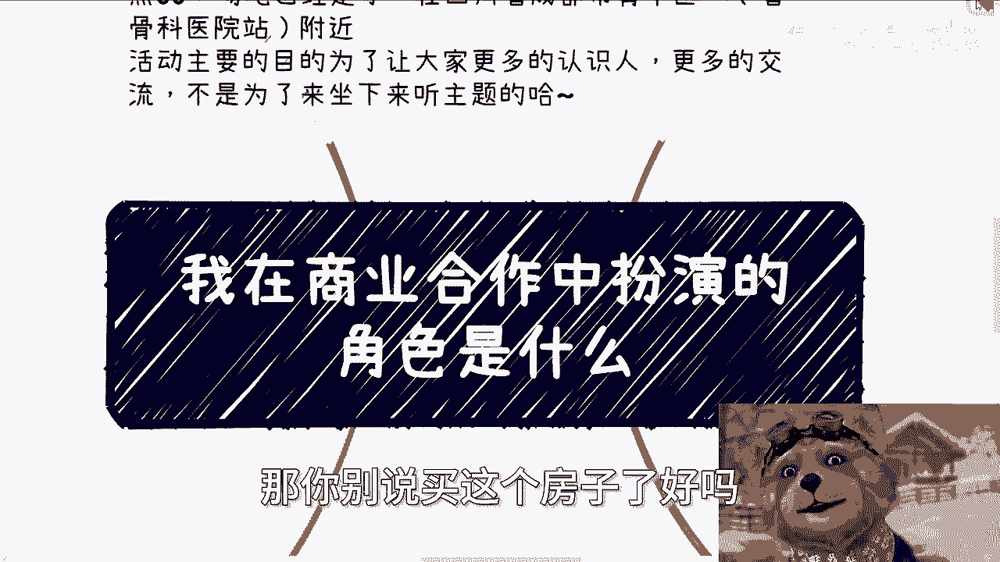
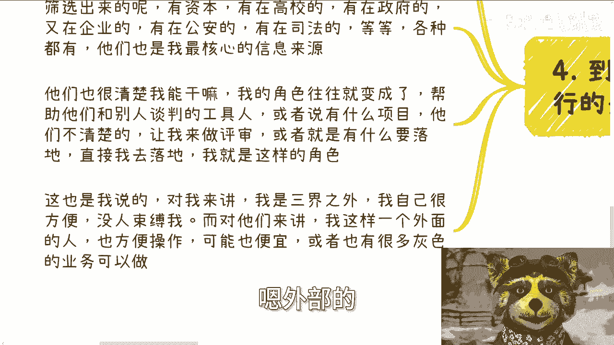
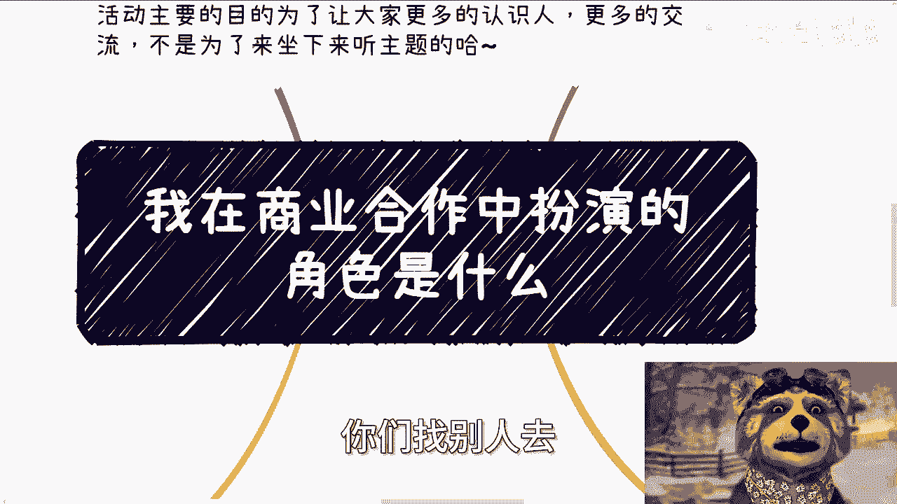

# 课程：我在商业合作中扮演的角色（P1）🎭

在本节课中，我们将一起回顾主讲人从毕业至今，在商业合作中扮演的不同角色及其演变过程。通过四个阶段的划分，我们可以清晰地看到个人在商业世界中的定位是如何随着经验、资源和认知的变化而发展的。

---

## 第一阶段：初入职场（毕业初期）

上一节我们介绍了课程概述，本节中我们来看看主讲人毕业初期的角色。

刚毕业时，主讲人对商业的理解有限。他在商业上的角色主要有两个。

以下是该阶段的两个核心角色：
*   **政企咨询讲师**：名义上是为企业和政府机构提供安卓与iOS技术培训的讲师，但本质上是一个“工具人”。
*   **沙龙会议主办方**：为了获取更多行业信息，自己组织小型线下沙龙活动。

当时主要通过线下活动积累人脉，接触了各类第三方公司、中介甚至骗子。由于缺乏经验和概念，对于报酬没有清晰认知，处于“有人找就不错”的状态。在做了一年左右后，通过接触越来越多的合作方，信息差逐渐被抹平，才明确了自身劳务的市场价值区间。

**核心状态公式**：`角色认知 = 被动接受 + 信息差`

---

## 第二阶段：搭建平台（沙龙大会阶段）

在积累了初步的用户和嘉宾资源后，很自然地会思考如何实现更多价值。

这个阶段，角色从被动的“讲师工具人”转变为主动的“平台搭建者”。虽然名义上是活动甲方，但最初是一个“没有资源的甲方”。需要从零开始策划大会方案、联络嘉宾、寻找渠道、销售门票和拉取赞助。

这是个人最早尝试独立搭建商业平台的雏形，核心是整合手头一切资源来促成活动。

**核心行动描述**：`角色 = 资源整合者 (嘉宾 + 渠道 + 赞助)`

---

## 第三阶段：全面探索（创业/失业阶段）

上一阶段是兼职尝试，而进入此阶段意味着全职投入商业世界。

大约在2017年换行业后，主讲人进入了“全面创业阶段”（实质是主动选择的失业状态）。因为意识到在原赛道发展受限，而换赛道后若再找工作则失去意义，故而开始全职在外寻找机会。

此时扮演的角色主要是各种项目的“合伙人”或“联合创始人”。由于自身缺乏核心技术或雄厚资源，更像一个“寄生虫”，依附于不同的项目之中。在此期间，接触了大量与融资相关的工作，如担任财务顾问（FA）、撰写商业计划书（BP）和白皮书、对接天使投资人等，但往往没有稳定收入。

**核心关系描述**：`自身角色 ∈ {项目A的合伙人， 项目B的联合创始人， ...}`

---

## 第四阶段：稳定协作（当前阶段）

经历了长期的积累和筛选，目前进入了一个相对稳定的合作模式。

当前的角色是一个“稳定的合作与执行者”。多年来筛选出的、分布在资本、高校、司法、政府、企业、公安等各领域的核心人脉，构成了主要的信息和项目来源。他们清楚主讲人能做什么，而主讲人的角色也随之演变为一个“外部综合救火队员”。

以下是该角色的几种常见任务：
*   **项目洽谈支持**：在合作方缺乏专业人员时，协助进行项目谈判。
*   **项目评审**：利用经验为合作方评审各类项目。
*   **落地执行**：直接负责项目的具体实施。

这种角色对合作各方而言是“安全且便利”的外部补充，形成了各取所需的共生关系。作为没有复杂背景的个体，反而在特定事务上具备了灵活性和可操作性。

**核心价值公式**：`价值 = 灵活性 + 执行力 + 跨领域经验`

---

## 总结与启示

本节课中，我们一起学习了主讲人在商业合作中角色的四个演变阶段：从**被动的工具人**，到**初级的资源整合者**，再到**广泛的项目参与者**，最终成为**稳定的跨界协作者**。

这一过程揭示了个人商业角色的成长并非一蹴而就，它依赖于持续的实践、人脉的积累、对信息的敏感度以及随环境变化而不断调整的定位。对于初学者而言，关键在于迈出第一步，在行动中逐步消除信息差，并思考如何将现有资源转化为下一步的杠杆。

---

**附：当前服务范围说明**
*   **线下活动**：成都活动持续接受报名。
*   **咨询服务**：提供职业规划、商业规划、合同、股权、商业计划书等方面的咨询。需咨询者提前整理好个人背景与具体问题。
*   **咨询定位声明**：咨询旨在提供基于社会现状的建议与思路，无法承诺直接带来财富或实现财务自由。抱有此类明确变现期望者，请寻求其他服务。