# 我对于web3公链现在的认知 - P1 - 赏味不足 - BV1fo4y1J7vZ

好吗，首先说web 3啊，公链这边呢是这样子的，鉴于可能有些小伙伴不了解啊，我在这个当中可能会稍微科普一下好吧。

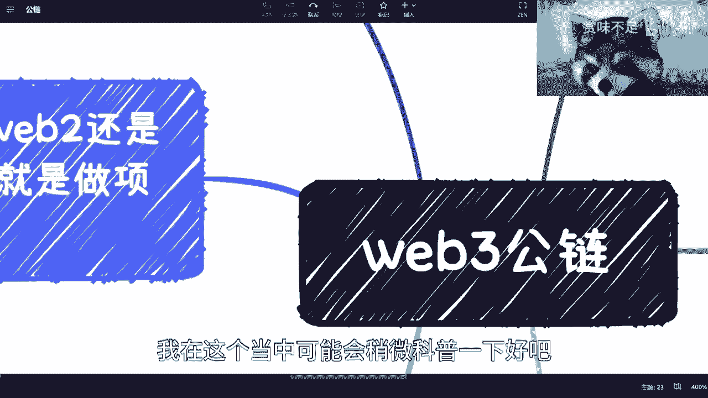

懂得同学啊，稍微忍受一下啊。

诶啊首先什么是公链对吧。

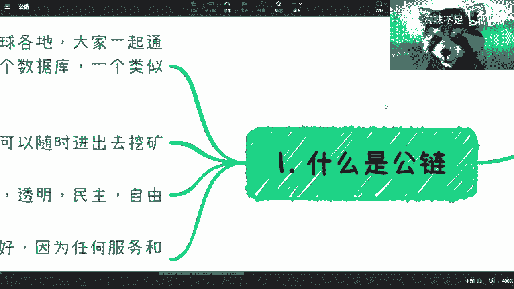

简单来讲呢就是服务器分布在各地啊，大家一起来通过公示机制来跑的一个服务，大家都知道嘛对吧，decentralized去中心化啊，然后我们称之为他跑的是一个服务，或者一个数据库。

或者一个类似于操作系统的东西，就是os啊，我先表达我的观点啊，我在任何一个视频里面，只要提到web 3，我都说过，就是我是支持的啊，我是支持的，而且我是看好web 3的未来的，因为从整个世界来讲。

我们需要有这么一块环境，或者这么一块技术来做支撑，但是呢就是当下情况呢就是还是很乱的哦，还是很乱的，这个不妨碍我支持他啊，啊这是第一个，第二个呢，就是说宫殿这边呢，就是相当于谁都可以随时进出去挖矿。

那挖矿的意思就是说做它的节点，那做它节点的意思就是说帮他去啊，做这个分布式记账对吧，就是分布式的这种叫做呃存储数据，那么你说你帮他去挖矿有什么用，那当然是给你对应的激励对吧，比如说代币啊对吧。

或者其他的一些东西啊，那么第三呢就特点的话呢，公开透明，这个是这个web 3最最核心的这么一个精神，那么公链这边呢，我觉得gas费的设计是非常好的，那gas费呢可以理解为是一个手续费啊。

就中介费或者是个手续费，那这个东西为什么特别好呢，是因为从本质上来讲啊，就是任何服务或者任何行为，其实都是需要收费的，就是收多收少，我们可以根据一个公式或者一个啊，你比如说呃模式去更改，这个倒问题不大。

但是呢就是说你收费之后，比如说你哪怕收一块九或九块九，你收费之后总比那个免费会来的好很多，就会筛选出一大部分的用户，你就比如说b站现在对吧，你说我发这个视频，这个视频啊，很多人对吧，是白嫖的对吧。

但是呢你会发现就是说我怎么知风白不白嫖呢，就那些只要来骂的啊，只要来喷的啊，就无脑来说的，那但凡都是白嫖的对吧，你说人家就在下面，至少大家有理性讨论的，但我不说三连吧对吧。

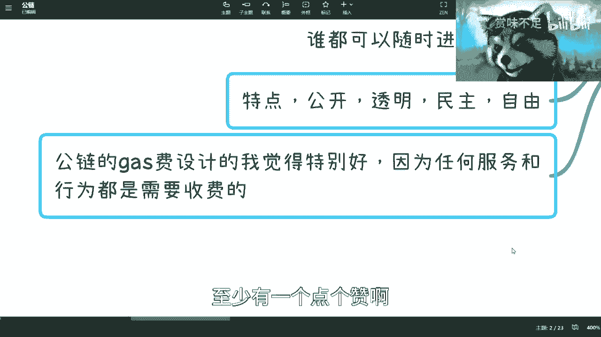

至少有一个点个赞啊，投个币啊都是有可能的对吧，但凡来喷的都是白嫖的啊。

那我觉得公链在这个设计上面其实是很好的，这是第一点啊。

第二点呢就面临着这个问题啊，因为目前你看啊，我去跟那些区块链相关的专业啊，啊，或者说这个刚毕业，就想去做web 3的这些小伙伴啊。

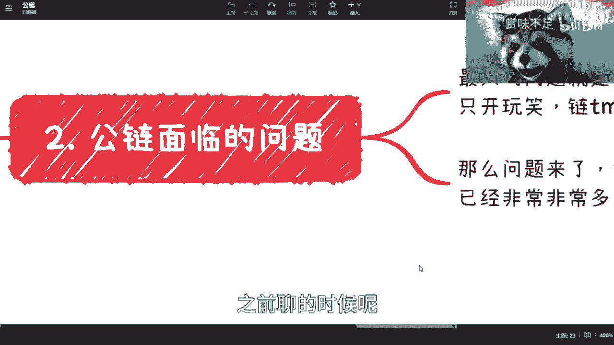

之前聊的时候呢，其实都会聊到过这么一个问题，就是最大的，现在web 3公链这边最大的问题是什么呢，就是生态就是它有啊，你不能说它没用，web 3生态还是还是蛮蛮怎么说呢，就是蛮完善的啊，各个角度都有啊。

但是呢他没有一个很好的良性的生态，就是他可能还处于一种混沌啊对吧，那个黑暗森林法则啊，这种生态当中啊，就是现在呢一直诶我这边写错了嗯，直对吧，就一直开玩笑，就是练他妈的比dp都多，什么意思呢。

就是就是现在练越来越多，你知道吗，就搞的就是那种哦好的，这种应用就是应用特别少，你就可以理解为就是说啊，安卓ios这种系统特别多，那上面的应用不少的可怜对吧，那这个就是个很神奇的一个一个东西。

就是嗯其实生态就没做起来嘛对吧，这是一块，那么问题来了，就是说你说web 3发展这么多年了对吧，然后也有比特币，以太坊或者索拉纳或者其他的呃，各个练就就明星练吧，来做支撑的对吧。

那么多生态就是包括deep就game fi呀，defy啊，各种fi对吧，这个东西我回头我会再讲一期啊，就是呃有这么多东西，为什么没有这么一个我们称之为什么没有生态，或者说为什么他没有个正健康的生态。

这个其实我觉得是一个核心，就是如果真的想要去了解，就不是说啊我进去淘金对吧，我进去这个击鼓传花了对吧，你但凡想要真的了解他，那你必须要去就回答这个问题，就是为什么这么多年他没有一个健康的生态，你知道吧。

包括所有这个创业的人，其实我觉得都得明白这个点。

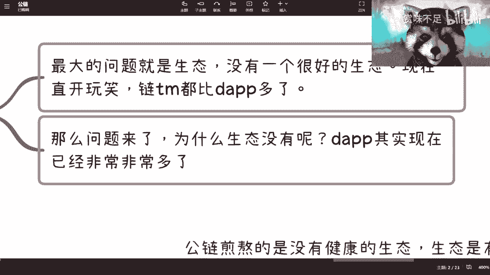

呃那么往下我们来看啊，其实目前来讲呢，呃你说宫殿也好，联盟链也好，那各有千秋对吧，那有很多人一刀切说功练不好的，说联盟链不好的对吧，说伪需求的很多很多。

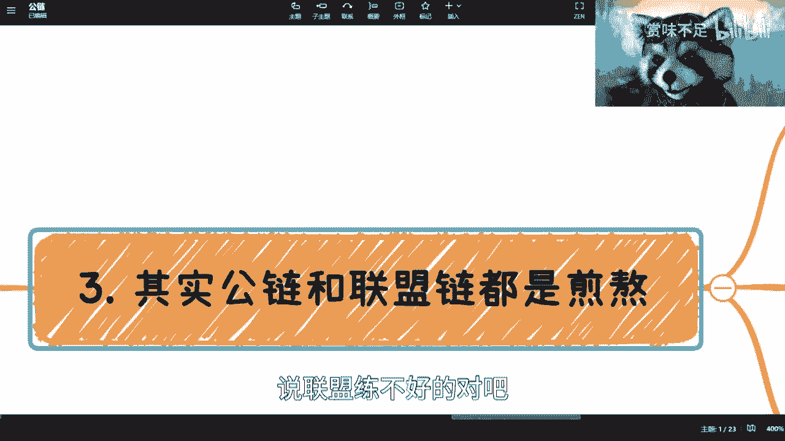

我先不在这个地方提这个问题啊，就是都是很煎熬，为什么呢，因为公链现在煎熬呢，是它有生态，但他没有健康的生态，用户也是有的，但是很畸形，什么叫畸形呢，就是用户进来就是为了赚钱的，没别的目的。

你别来跟我谈生态，也别来跟我谈项目，你知道吗，这就好像一个什么呢，这就好像你今天去找一个投资人啊，你说我有一个那个商业计划书对吧，我要创个业，我要做个呃产品，那个投资人直接跟你说。

你做任何产品都是bushit对吧，我不关心的啊，你就告诉我怎么赚钱对吧，就是这种情况下面呢，就是说嗯没有说它好或不好，对或不对啊，这种东西都是相对的，但是问题是对于大部分想要去创业，想要去做事情的人。

那么它就是一个很畸形的一个状态对吧，就是说所以你会发现公链现在很多的这种呃，dep就decentralized application对吧，就这些东西，它是一个披着金融模型的一个皮的一个产品。

就是你会发现不管是什么game fi啊，什么fia，social fi啊，各种fi对吧，就他的点其实都在金融上面，至于产品那个叫业务功能啊，业务形态和功能形态其实并不重要啊。

这个东西后面我会再来详细说的啊。

那么联盟链的金要在哪里呢，金要在于技术一直在发展啊，国家也一直在推广，但是呢真正落地的没有，你们可以列一个出来啊，你们回头要是觉得哎陈老师说的不对吧，啊你列个给我，我来跟你battle一下啊。

怎么算没有啊，那说白了呢，现在b和c就不知道为什么到底是为什么要做，就简单来讲就是说他们没有明白啊，就是我为什么要去做联盟链，我为什么不去用互联网中心化的技术技术去做，但凡这个点他说服不了自己。

或者他没有意识到这里面的问题和解决痛点，那这个东西和永久是落不了地的哦，永远是落不了地的，那联盟链从目前来讲呢，我这么跟你们讲吧，核心并不在链上，而在于真和院啊，核心不是练啊，跟练不练其实没有关系。

核心是智能合约，这个回头哎呀。

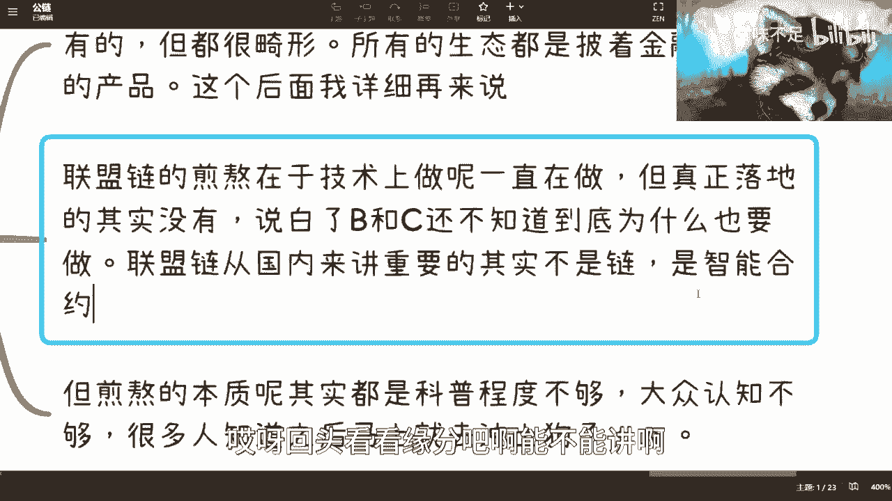

回头看看缘分吧啊能不能讲啊，但是呢本质呢就都是金啊，就是这两个东西就是两个生态都有好的地方，都有不好的地方，但是都很难啊，都很难，你别觉得就是啊这个暴富效应对吧，人家在里面做杠杆，做合约对吧。

然后100倍200倍对吧，就还是那句话嘛，你听到的大部分都是幸存者偏差啊，剩下的这个这个亏钱的你可能不知道，那当然大部分你自己是亏钱的是吧，所以本质上其实是web 3也好，web 2也好。

它的区块链的科普程度不够啊，大众认知认知度是不够的，很多人知道之后，其实他不不学习，你知道吗，就是就他不知道其实是什么，或者他也没有耐心对吧，我跟很多人说了，我说你至少白皮书就是不是白皮书来。

就是那个就是那个以太以太，以太坊比特币的白皮书，黄皮书对吧，技术的那个那个那个项目的你都得看吧对吧，看完之后你里面东西也要了解吧，聊问聊to对吧，联盟链去那个公链对吧，挖矿对吧，oracle对吧。

共识机制对吧，包括共识机制品里面的区分，包括现在呃那个stable coin，你都得去了解吧，很多人不要了解，你知道吗，就上来知道区块链好，我要冲了，我要去冲土狗了对吧，你们不知道的，我就不解释了。

你们自己去百度土狗项目对吧，我这就冲就对了。

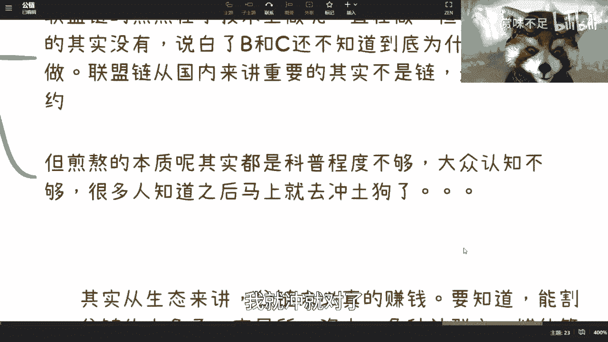

冲就完了，啊然后这个其实也是现在都病态的一个地方。

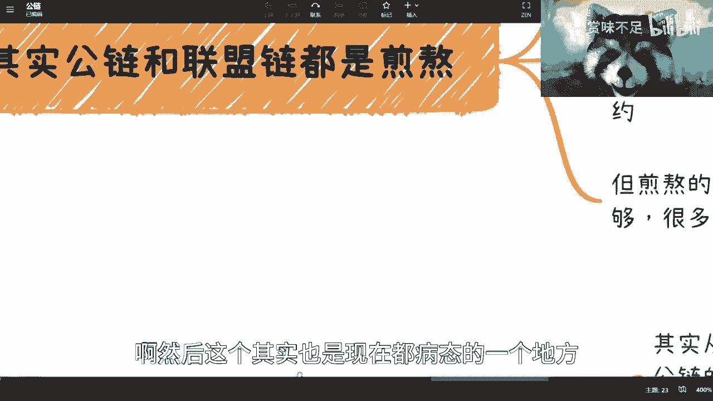

那第四个呢就是我以前也说过对吧。

就算你说让我去做公链，大概率我要么就是被割，要么就是割别人，我没得选择。

我跟你们讲，你们看啊，我给你们分析一下，为什么你从生态来讲，公链其实本质上未必是真的赚钱，你我跟你们说，但凡去了解过你们就会知道能割公练的太多了，我的交易所资本社群媒体，谁他妈都能割，你知道吗。

这简直就是个割割的什么生态链，你知道吗，就公链未必是顶层，是未必是中层，它有可能是底层，你知道吗啊这个就很尴尬了，甚至于吗用户都能够公里，你知道吗，有有有时候啊，那这是一个第二个问题呢。

其实公链最大的问题在于怎么做到多赢，其实你要说问题是怎么做到多赢吧，我觉得也不是就是他还有个更本质的点，更本质的一点是它没有应用生态，你知道吗，因为但凡你一个产品没有应用生态。

那它就会就会产生我这个地方写的这个问题，就是说你没有应用生态，就没有消耗，没有消耗就没有循环，你知道吗，那你现在没有循环，你这项目怎么做呢，你没法做对吧，但是你要营造出来一种循环，那怎么办呢。

就我们来问啊，你看啊，在一个攻略里面资本怎么赚钱啊，公链本身怎么赚钱，你们去想想看攻略本身怎么赚钱呃，dep怎么赚钱对吧，用户怎么赚钱对吧，你会发现所有的矛头都指向了二级市场没了，为什么。

因为他在整个生态里面怎么赚钱，这件事情他只有这一个出口对吧，那么这个里面其实有两个病态的地方，一个病态的地方，是不是一个生态里面，只有怎么赚钱这个问题的对吧，你们想想看，但凡今天我们用饿了么，用微信。

用qq，用b站用什么，我们所有的用户，包括我包括你们所有的用户，就问b站我们怎么赚钱，那你告诉我这产品该怎么做，这平台该怎么做，做个屁啊，不要做了，我们每天就发视频，就一句话，请问b站我们吊打蜀黍对吧。

你请问你怎么给我们赚钱，不给我们赚钱，你就是垃圾，那这平台怎么做，你告诉我对不对，那所以说这个是第一个病态，第二个平台在哪里呢，就是你整个的这个哎呀呃，你整个的这个应用里面它没有一个消耗。

或者说大家不是来运用你这个产品的，就是你没有一个完善的，一个一个一个一个解决某一个需求对吧，你像b站为什么能做起来，微博为什么能做起来，各平台为什么能做起来，是因为他大家有需求。

大家需求点并不在于说我用你这个平台，就平台就是一定要赚钱，我可能有很多人可能有各种各样别的需求，对不对，他最早的时候带不来钱，他总不能说大家都是只抱着来赚钱吧，他也得输出产品嘛，输出内容吧对吧。

所以说呢你会发现，就是说每一个人其实都有，解决他的一个痛点的地方，或者解决他需求的地方，甚至比如说有些人他说我就想我，我就想展示给大家，我就想一个人唱相声对吧，也可以，无所谓啊。

但是web 3现在这个生态就很难，因为你但凡想去想去做一个有生态的东西，有产品有需求的东西，你可能找不到施舍在什么地方，你找了半天需求就指向怎么赚钱，你知道吧，那这个是一个问题，所以说呢你说啊有人问我。

他说吕老师对吧，就不能好好做吗，能好好做，who care你明白吗，就谁谁来关心你，哼对吧，其实你好好做无所谓，你好好做呗，谁关心你，没人关心你，你到时候就募不到资，那我跟你讲募不到资，对不对，呃。

没有生态啊，没有用户，那就好好做呗，是不是你请问我就请问你吃什么喝什么，喝西北风吗啊啊。

然后就回到这个问题，就是我跟你们说，就但凡我去做。

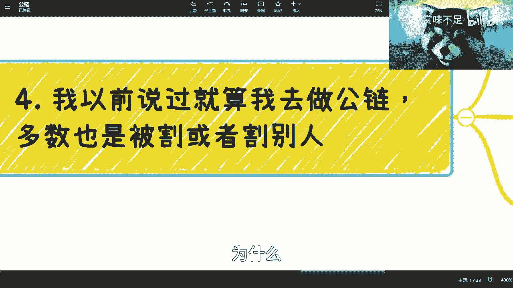

我也得跑，我也得隔，为什么，因为你在这么一个生态里面，你说我要去做一个长期项目，比如说12年23年长期项目，我有本事做，没本事做，每天用户都催着你啊，你怎么不拉盘对吧，我靠这个垃圾项目对吧。

我亏钱了对吧，你怎么做，就是你想去做项目，对方根本跟你鸡同鸭讲不在一个level上面，请问你怎么做，你最好的方式就是哥。

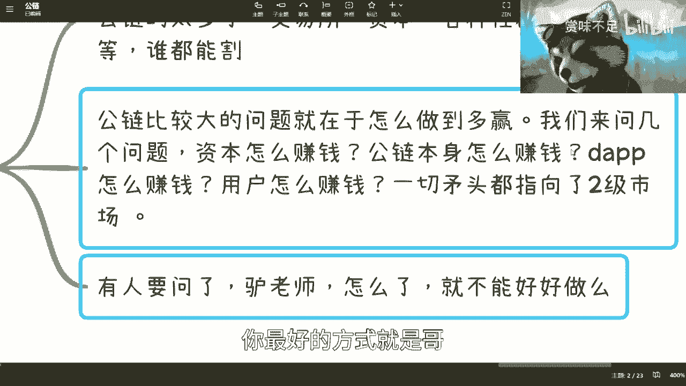

你知道吗，唉结束了，别逼逼，你知道吗啊。

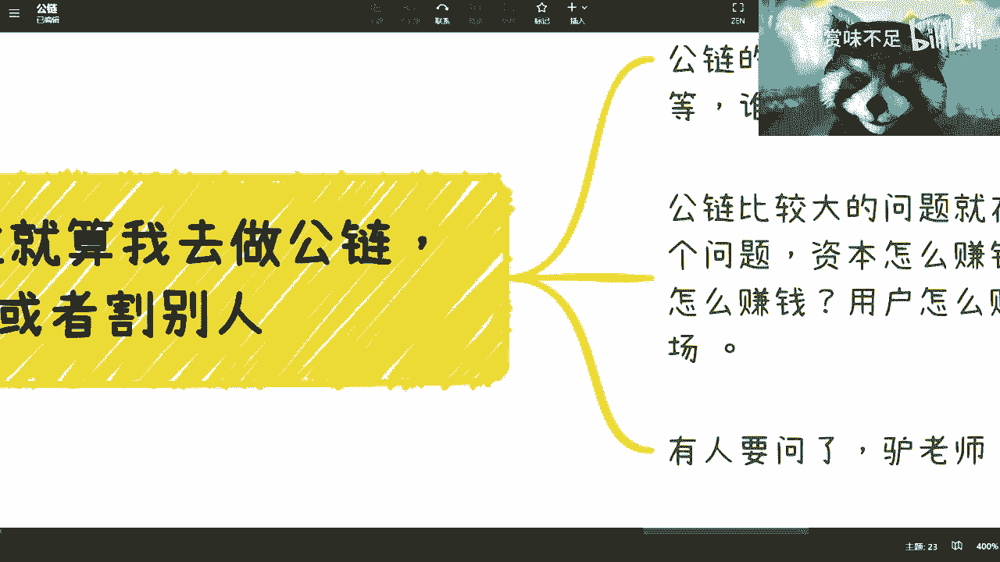

呃这个是四对吧，我们来看五啊。

无奈你看啊，在区块链里面，不管wb还是wb 3，我跟你说，我现在最怕听到的就是做项目，就是以前你知道吗，有一些香港和新加坡啊，然后法国英国的这种就是刚毕业的大学生，你知道吗，打电话咨询我的时候。

我每次都问他们，我说你们为什么会去想做区块链或者做web 3，我就怕他们跟我说，哎陈老师，我想创业，我靠我头就大了，你知道吗，就但凡他们跟我说啊，说我想割韭菜，好好好好，我两两手双手双脚赞成。

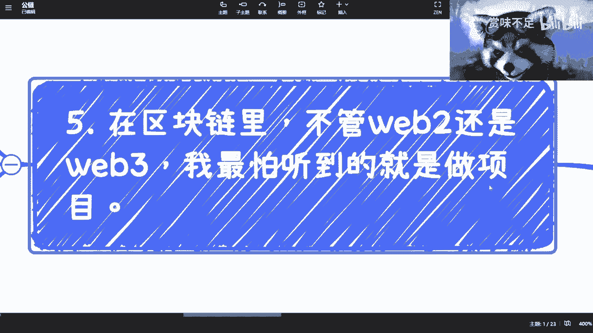

你知道吗，这些逻辑简单了啊，有什么好逼逼的，你说是吧啊，我跟你讲啊，整个生态web 3的那用户就是想来赚钱的对吧，你供需需求就在这个地方，你说你需要去做项目，给用户积分或者，你不管给用户什么。

你只要不给他赚钱，他都是，你明白吗，那有意义了没有意义的，你怎么可能做得起来呢，我就发现很多人真的在这方面创业，就是没有拎清楚这件事情，你知道吗，这低一点，而且另外一方面，你我还有那句话，你要明白的是。

资本关系是什么，资本关心的是你项目能做什么吗，no啊对不对，y82 呢，我跟你讲更搞笑了，web 2现在是什么，你需求跟用户都不知道在哪啊，就就这么，你知道吗，都不知道在哪，你告诉我你做啥。

哎我跟你们讲之前搞笑了，1718年，那个时候有很多这种，我早上九点钟被一个电话吵醒，然后说什么说啊，陈老师啊，我们咨询你一个项目啊，我说啊你说然后他说啊，我们想把什么什么什么什么跟区块链结合啊。

跟我说了一大堆，然后我就问他，你这玩意儿需求是你自己讲的，还是有用户这么需求的啊，这个整个生态都有这个需求的，我说你确定吗啊你想清楚吗，用户有这个需求啊，你去做过调研吗，什么都没有，对吧我跟你讲。

这就像什么，这就像很多人私信会这么跟我讲，就b站上私信会这么跟我说，他说我觉得有用的哦，我说什么用啊，但我觉得解决这个信任问题啊，这个信任是一个社会大问题，卧槽新人是个社会大问题。

我这还用你说呀啊再说今天能大到哪里去啊，大家他妈的没区块链不做了是吧，还是今天有多大的优先级，一定要解决这个信任问题，早呢啊，这你你就是你觉得这些有有很大危机，别人不觉得有这个危机有啥危机啊是吧。

然后有人问我跟你讲，我也不算怎么赚钱，我跟你说太简单了，你知道吗，根本就不用去学习，你就混圈子，像伊能静学习，你知道吗，混圈子早进早出一定能赚钱，别贪就ok了，记住混圈子早进早出别贪ok啊。

你能做到三点，你已经赢了99%的人啊对吧。

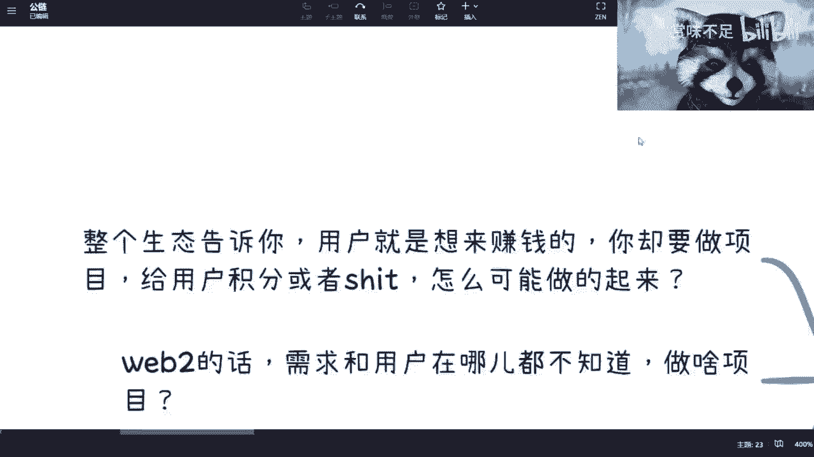

还有是什么呢，就是就业方面呢，我其实还推荐呢，什么意思呢，就是毕竟他还是个增量市场，虽然乱是乱了啊，但是就是你要做兼职，因为他还是有些好处的，你比如说你比如说很多工作，你是可以找remote的对吧。

就远程的，然后呢技术开发还是很缺的对吧，然后呢合约安全按按安全还是很缺的对吧，就是它相对来讲，就我们说啊，他作为一个新的市场增量市场，它相对来讲没有互联网这么卷，但你说现在卷吧也卷的啊。

但是相对没有这么卷啊，而且我觉得在这里面机会也多，因为你越混乱机会越多嘛对吧，所以我觉得在这方面我还是支持的，但是这个就看你们自己的本事了，就是一来看你们的本事，二看你们的性格合不合适对吧。

很多就是那种社恐啊，或者说内向的，我觉得就算了，就别做了对吧。

就打个工没啥意思，你还不如在尾巴尔打工，你知道吧。

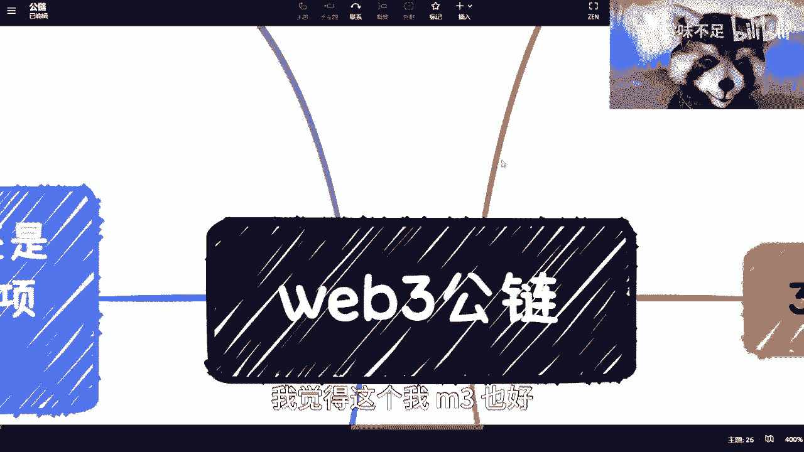

所以呢本质上来讲呢，我觉得这个wm 3也好，攻略也好，我都是看好的，我觉得这个生态都是很都很牛逼啊，绝对是人类历史上面很大的一个一个一个创新，怎么说呢，其实它它的在我看来啊，完全不在一个档次上面。

其实本质上是就目前看，但5b3 不一样啊。

它是一个嗯我不知道怎么怎么怎么形容啊，就可能信仰啊，当然这是一个理想状态，但是ai本身，我们说人工智能未来真的做的怎么样。

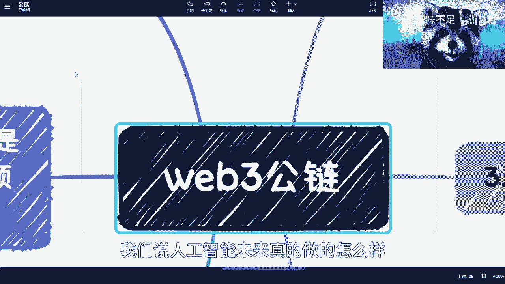

也是个理想状态对吧，那么同样理想状态，我还是觉得web 3比ai来的就是level高一点好吧。

反正基本上就这么个情况。

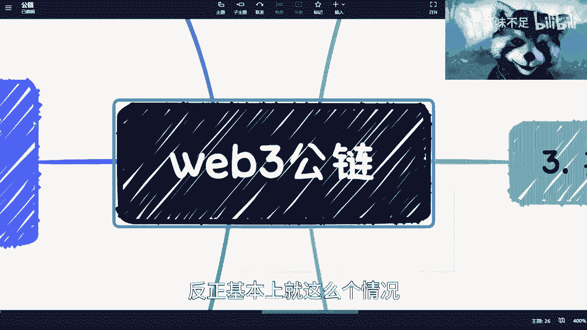

我也跟你们都说清楚了，就是我对于这个东西看法对吧，嗯包括现在这个痛点，反正你们要去做，那就去做，你们要觉得自己不合适，那就算了啊。

