# 我对于web3公链现在的认知---P1---赏味不足---BV1fo4y1J7vZ

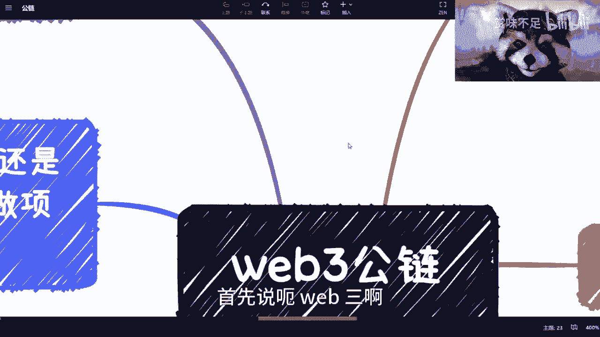

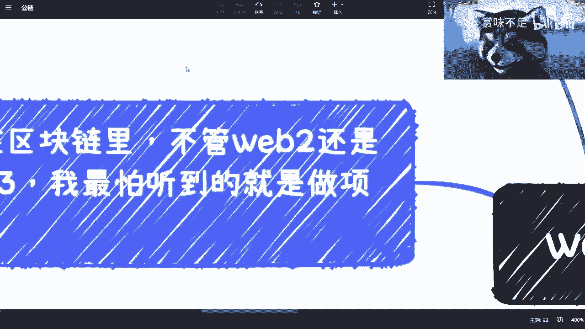

在本节课中，我们将要学习Web3公链的基本概念、核心特点、当前面临的主要问题以及生态现状。课程内容将帮助你理解公链的本质、其设计上的优势与挑战，并分析当前生态为何难以形成健康、可持续的发展模式。

---

## 什么是公链？🔗

简单来讲，公链是服务器分布在全球各地，通过共识机制共同运行的一个服务。它被称为去中心化的数据库或操作系统。

**核心公式/概念**：
*   **去中心化 (Decentralized)**: 网络不由单一实体控制。
*   **共识机制 (Consensus Mechanism)**: 如工作量证明 (PoW) 或权益证明 (PoS)，用于确保网络中的所有节点对数据状态达成一致。

---

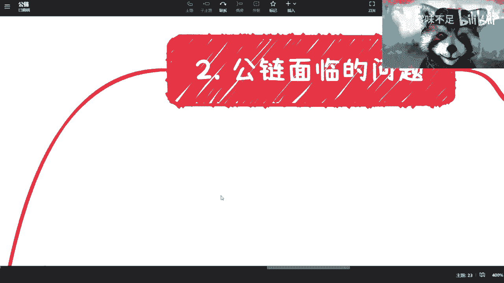

## 公链的核心特点与设计优势 ✨

上一节我们介绍了公链的基本定义，本节中我们来看看它的核心特点和一项关键的设计优势。

公链具备公开透明的特点，这是Web3最核心的精神。在众多设计中，Gas费机制被认为是非常好的。

**Gas费**可以理解为手续费或中介费。这项设计之所以好，是因为从本质上看，任何服务或行为都需要成本。收费（无论多少）总比完全免费要好，因为它能筛选掉一部分用户。这类似于一个内容平台，进行过互动（如点赞、投币）的用户通常比纯粹“白嫖”的用户更可能进行理性讨论。公链的Gas费设计在这一点上很有价值。

**核心概念**：
*   **Gas费**: 执行交易或智能合约操作所需支付的手续费，通常以该公链的原生代币计价（例如，以太坊的ETH）。

---

## 当前公链生态面临的核心问题 ⚠️

了解了公链的特点后，我们来看看它当前面临的最大挑战。目前Web3公链最大的问题在于生态：它并非没有生态，而是缺乏一个**健康、良性**的生态。

生态目前处于一种类似“黑暗森林”的混沌状态。一个形象的比喻是：“链他妈比DApp都多”。这意味着公链（类似安卓、iOS系统）数量众多，但上面真正有价值的去中心化应用却少得可怜。

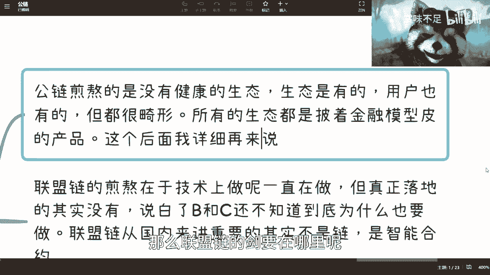

问题在于，Web3发展多年，出现了比特币、以太坊、Solana等明星公链，也衍生出DeFi、GameFi、SocialFi等各种赛道，但为何始终没有形成一个健康的生态？这是所有想要深入了解或在该领域创业的人必须思考的核心问题。

---

## 公链与联盟链的现状对比 ⚖️

上一节我们探讨了公链生态的困境，本节我们将对比公链和联盟链的不同处境。

目前，公链和联盟链各有千秋，但都面临艰难处境。

**公链的煎熬**在于它有生态，但不健康；它有用户，但很畸形。用户进入公链生态的主要甚至唯一目的就是**赚钱**，而非使用产品功能。这导致许多去中心化应用（DApp）本质上只是一个披着产品外衣的金融模型，其业务功能本身并不受重视。

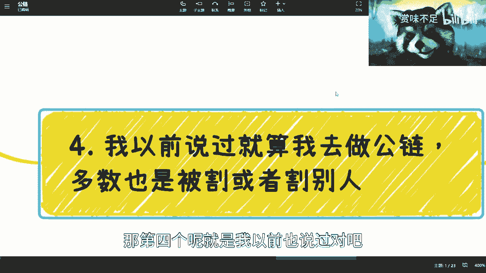

**联盟链的煎熬**则在于技术不断发展，国家也在推广，但真正落地的应用几乎没有。其核心问题在于，许多参与者并未想清楚“为什么一定要用联盟链，而不是用传统的中心化互联网技术”。联盟链的核心价值可能不在于“链”本身，而在于**智能合约**所能实现的自动化、可信执行。然而，说服市场接受这一点并找到刚需场景非常困难。

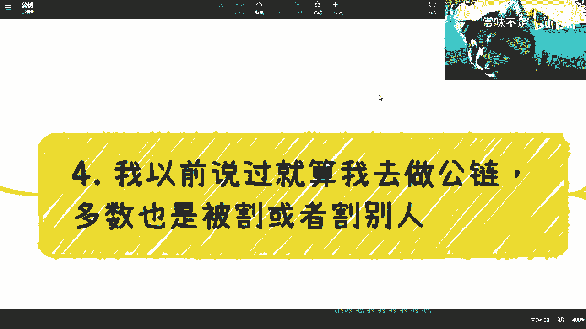

本质上，两者都很难。公链的“暴富效应”存在严重的幸存者偏差，大部分参与者实际上是亏损的。这反映出区块链（无论是Web3还是Web2范畴）的**大众认知度仍然不足**，许多人缺乏耐心去学习底层技术（如白皮书、黄皮书、共识机制、Oracle等），而是盲目追逐热点。

---

## 公链生态的深层矛盾与病态循环 🔄

我们看到了公链生态的用户动机问题，现在我们来深入分析其背后的结构性矛盾。

在公链生态中创业，可能会面临一个无奈的选择：要么被“割韭菜”，要么去“割别人”。原因在于当前生态的结构性问题。

从生态角色分析，能“收割”公链的环节太多了：交易所、资本、社群、媒体，甚至用户都可能“反割”项目方。公链本身未必是生态的顶层受益者。

更根本的问题是，公链缺乏真正的**应用生态**。没有应用生态，就没有真实的消耗场景，从而无法形成良性的经济循环。那么，在当前生态中，各方如何赚钱呢？

以下是各方盈利途径的简单分析：
*   **资本**：通过二级市场交易获利。
*   **公链本身**：通过原生代币增值获利。
*   **DApp项目方**：通过项目代币在二级市场表现获利。
*   **用户**：通过买卖各类代币在二级市场获利。

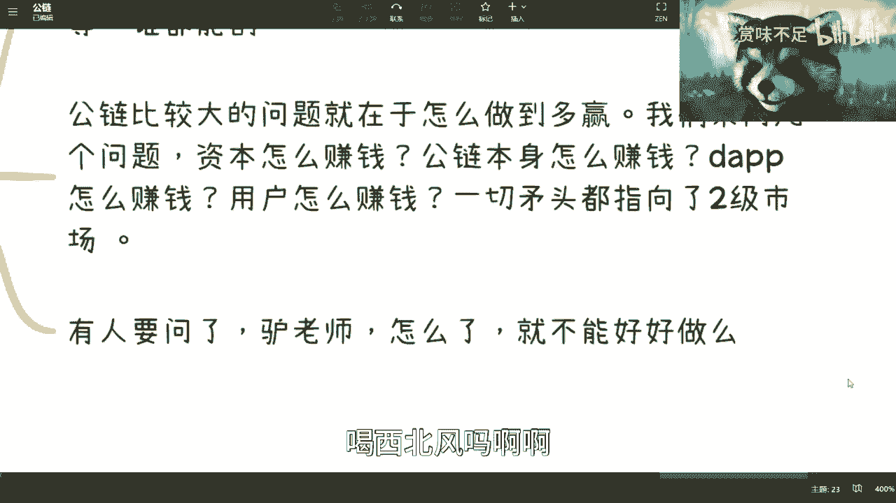

你会发现，几乎所有盈利矛头都指向了**二级市场**。这是第一个病态之处：一个健康的生态不应只围绕“如何赚钱”运转。试想，如果所有微信、B站用户只关心“我怎么从这个平台赚钱”，那平台根本无法运营。

第二个病态之处在于，整个生态缺乏解决真实需求的产品消耗场景。用户不是为了使用产品而来，而是为了投机。这使得任何想认真做产品、解决实际需求的创业者举步维艰。他们可能募不到资，因为资本只关心金融模型；也会面临用户的巨大压力，用户只关心币价是否上涨。在这种环境下，坚持长期主义变得异常困难，有时被迫选择短期投机行为反而成了“理性”选择。

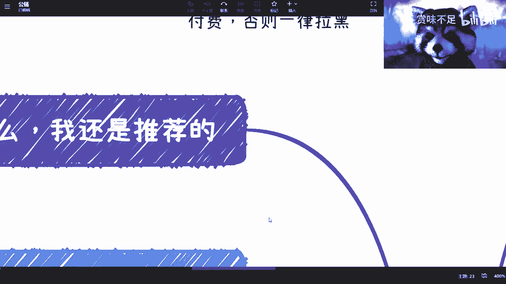

---

## 对从业者与创业者的现实建议 💼

分析了生态的矛盾后，本节我们来看看对于想进入这个领域的人有哪些现实建议。

在区块链领域，目前最令人担忧的创业动机是“我想做一个好项目”。因为在一个用户核心需求是“赚钱”的生态里，做一个不直接满足该需求的产品很难成功。供需关系决定了当前的市场逻辑。

对于Web2领域的联盟链创业，挑战在于需求模糊，难以找到必须使用区块链技术的刚需场景。许多想法停留在“解决信任问题”的层面，但这是一个宏大而优先级不明确的命题，难以落地。

**对于想通过投资获利的人**，策略可能很简单：混圈子、早进场、早退出、不贪婪。做到这三点，可能已经超过了大部分人。但这需要极强的纪律性和信息获取能力。

**对于考虑就业的人**，Web3领域仍是一个增量市场，虽然混乱但有机会。它提供了一些优势：
*   远程工作机会较多。
*   技术开发、智能合约安全等岗位需求大。
*   相比成熟互联网行业，竞争相对不那么“内卷”。

然而，这非常取决于个人能力和性格。性格内向、不善社交的人可能不太适合这个高度依赖社群和信息的领域。

---

## 总结与展望 🌅

本节课中我们一起学习了Web3公链的多个层面。

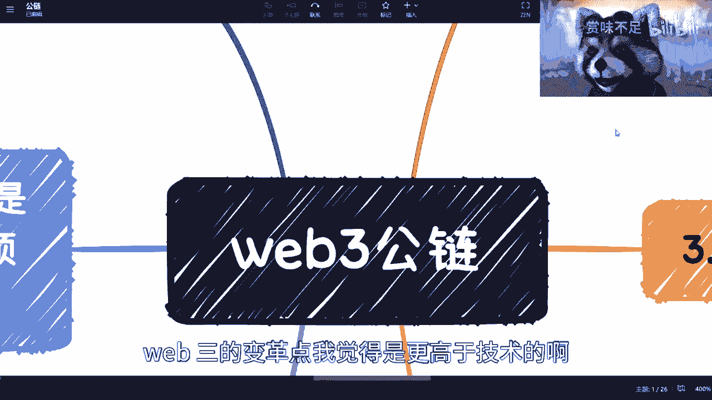

我们首先定义了公链作为去中心化服务的基本概念。然后，我们探讨了其公开透明和Gas费设计等核心特点与优势。接着，我们深入剖析了当前公链生态面临的核心问题：缺乏健康、良性的发展模式，用户动机畸形，以及由此导致的深层结构性矛盾——生态过度金融化，缺乏真实应用消耗场景，所有价值出口指向二级市场。

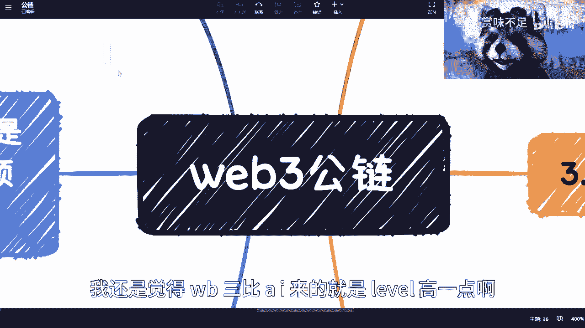

我们也对比了公链与联盟链各自面临的困境。最后，我们为不同目的的参与者（投资者、创业者、求职者）提供了现实的分析和建议。

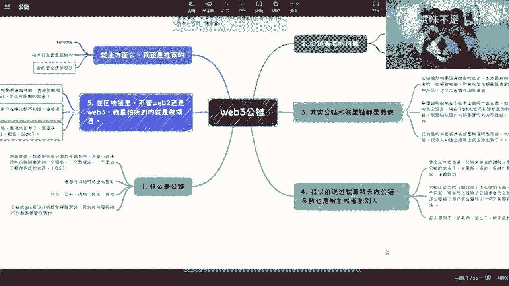

本质上，我仍然看好Web3和公链的未来。它代表了人类组织与协作方式的一次重大创新尝试，其理想层面具有很高的价值。尽管当前生态混乱且充满挑战，但它作为一个新兴的增量市场，依然蕴含着机会。是否进入以及如何参与，需要每个人基于清晰的认知和自我评估做出决定。