# 我就从来不说怎么卷职场-毕竟都是劳动人民相互伤害---P1---赏味不足---BV1FM411X7z

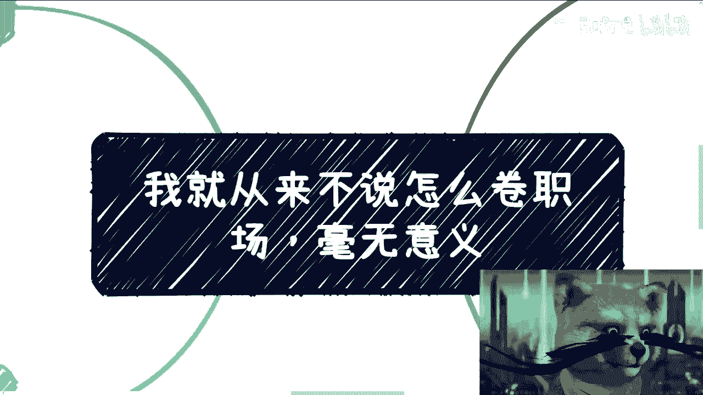

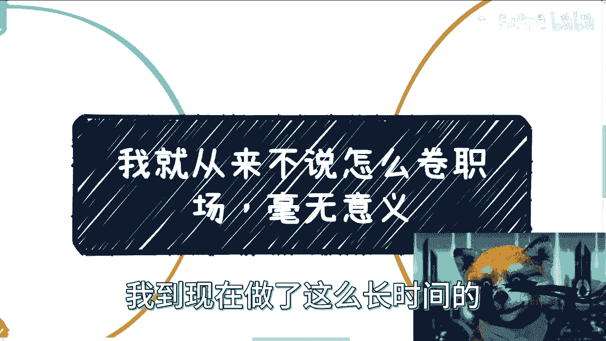

在本节课中，我们将探讨一个普遍现象——“职场内卷”，并分析其本质与影响。我们将从多个层面剖析为何“卷职场”是一种低效且无意义的竞争，并引导大家建立更健康、更长远的职业发展观。

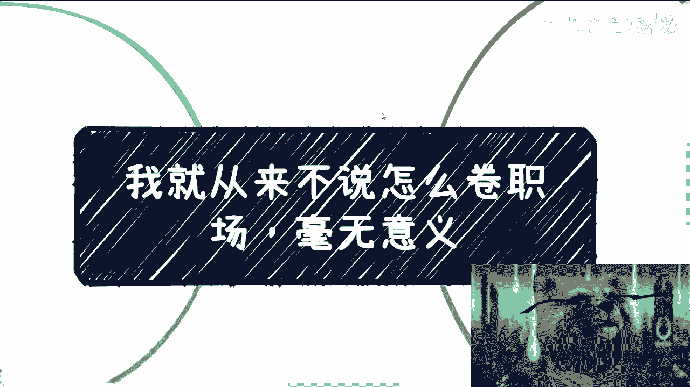

---

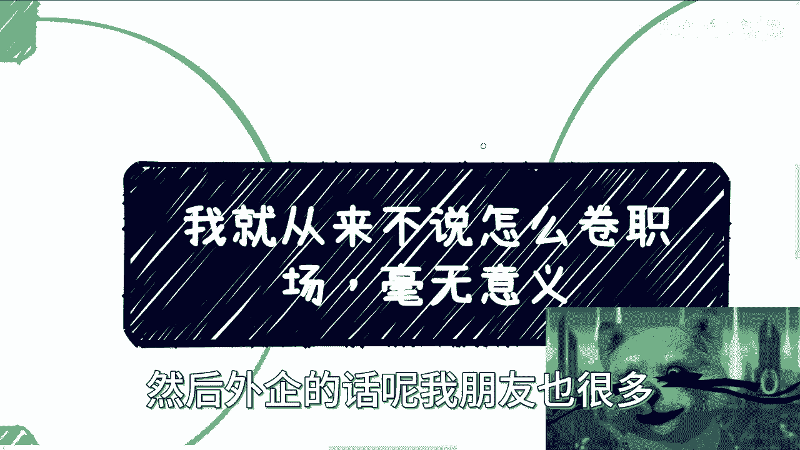

## 概述：职场内卷的本质

近期，许多关于“如何卷职场”的内容在网络上流行。我从事内容创作和分享已有很长时间，无论是在直播还是其他场合，我从不教授如何“卷职场”。

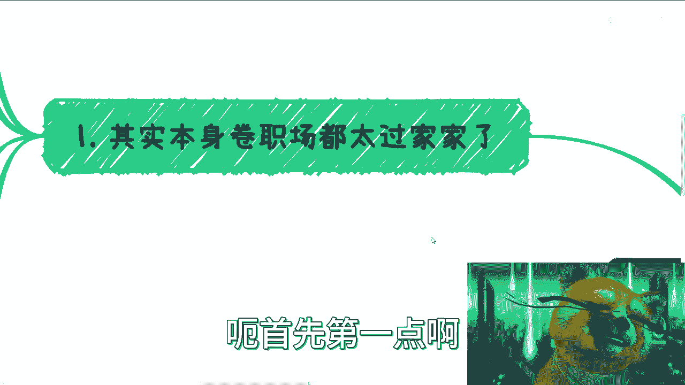

原因在于，根据我在创业公司、大公司以及从朋友处了解的外企经验来看，这种行为总体上没有意义。虽然每个人面临的具体问题、细节和压力各不相同，但我希望大众，尤其是看到这个视频或希望未来有所改变的人，能够树立正确的三观来看待这件事。

---

## 第一点：卷职场是“过家家”行为 🎭

对于大部分人而言，“卷职场”更像是一种幼稚的行为。这好比小学生作弊，自以为高明，但老师一个眼神就能看穿你的心思。

职场的本质与AI有些相似：许多核心逻辑是不变的，市场上只是不停地更换营销概念。当你拥有足够经验，例如成为30多岁、40多岁的资深人士，或是一名高级管理者时，你就会明白，职场无非就是那些事。

**核心公式：职场复杂性 ≈ 幼儿园级别**

它没有太多新花样，无非是职场斗争或人际关系。职场本身是一个相对单纯的环境，相比社会和商业世界，它简单得多。我常将其比喻为“幼儿园”，因为本质上没有区别。

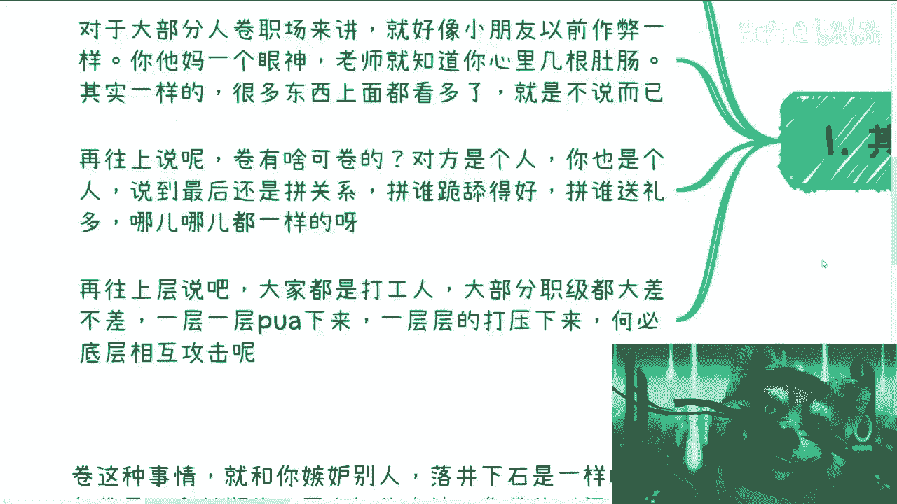

从更高层面看，许多事情司空见惯。你的上级或领导并非不懂，只是不说破而已。更进一步说，“卷”的意义何在？对方是人，你也是人，大家都被限制在一个非常小的框架体系内。

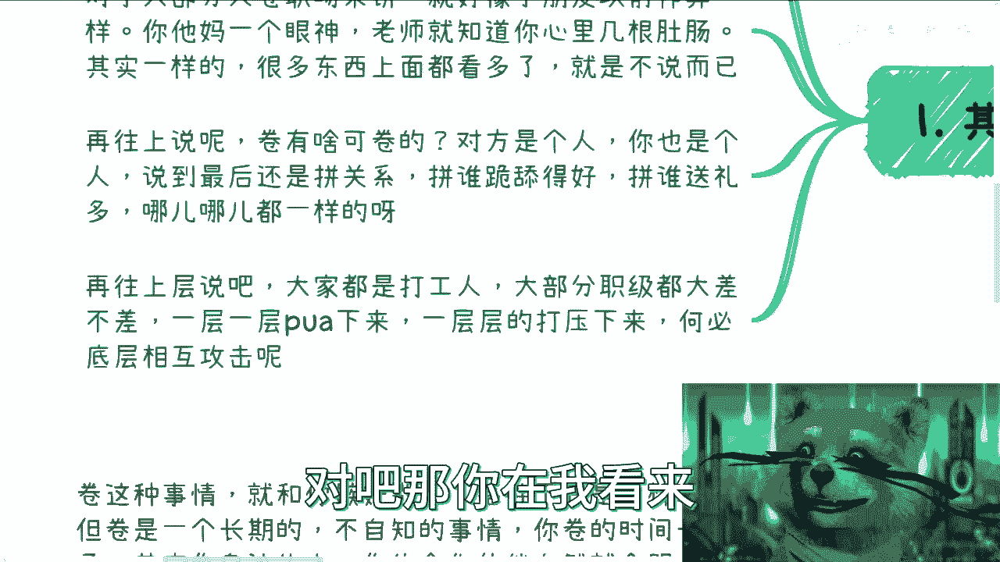

无论你在小公司、大公司还是外企，最终往往比拼的是关系、奉承或利益输送。在国企、央企等地，手段或许不同，但本质大同小异。这就像中国各地商业文化的差异，无非体现在请客吃饭的价位、红包金额、饭后是否去KTV等细节上。

不要认为这些是过时的观念，它们永远不会改变，始终存在。

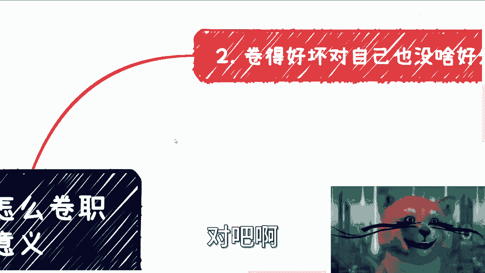

---

## 第二点：内卷对自身并无益处 📉

如果你是为了考试、学历或证书而努力，这无可厚非。这至少算是一种自我投资，尽管其实际作用可能有限，但有总比没有好。

然而，许多所谓的“卷”是教导人们如何在职场中“向上管理”、“向下管理”、玩弄“PUA”技巧或所谓的“平衡之道”，甚至牵强附会到古代帝王术。我想说的是，大家都是普通老百姓，领着固定工资，处于同一阶层，却还要搞这些无谓的争斗，良心不会痛吗？

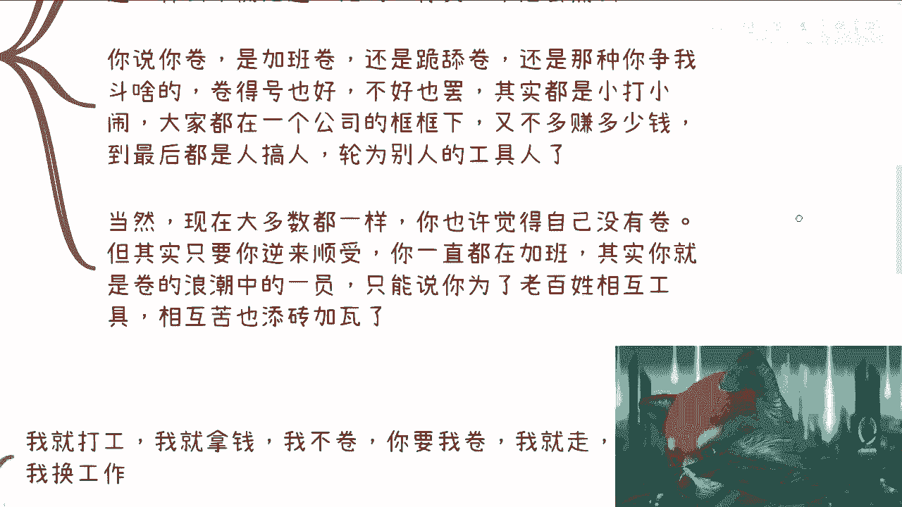

无论你是通过加班、奉承还是勾心斗角来“卷”，其实都是小打小闹。在一个固定的框架下，“卷”得好，你不会多赚几百万；“卷”得不好，你也不会亏几百万。这并非生死攸关的利益之争。最终，这只是底层人员相互攻击，沦为他人工具，意义何在？

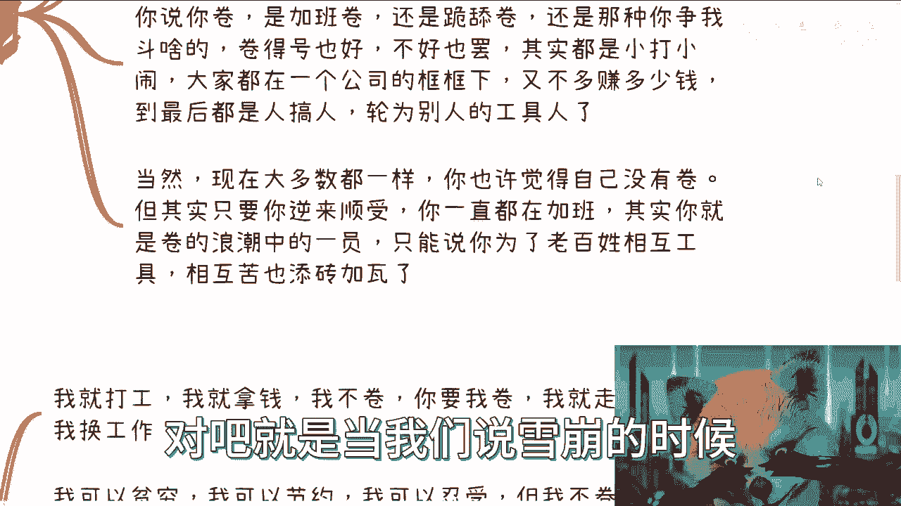

当前大多数环境都是如此。很多人可能觉得自己没有“卷”，但需要明白一个道理：**“雪崩时，没有一片雪花是无辜的。”**

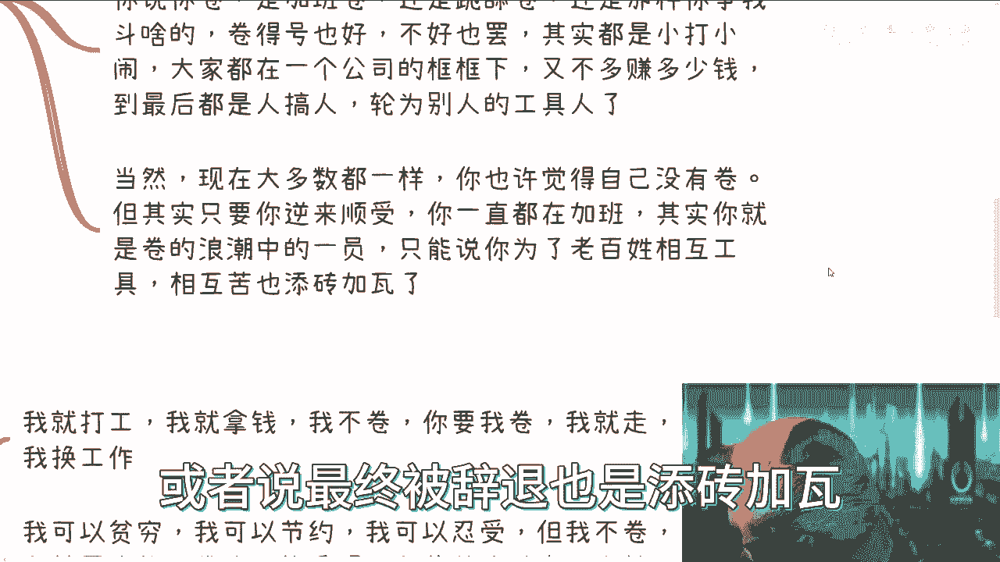

很多时候，我们每个人的逆来顺受、加班、奉承，都是内卷浪潮中的一部分。可以说，普通劳动者相互攻击、相互利用，最终加剧了整体的困境，甚至为被辞退的命运“添砖加瓦”。

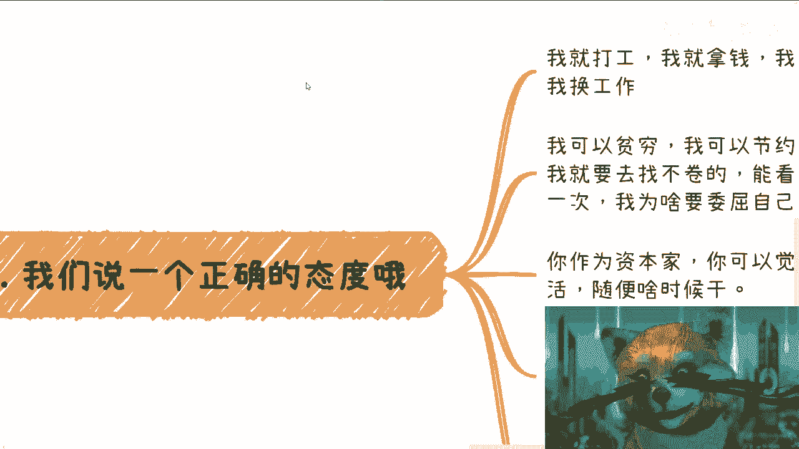

---

## 第三点：建立正确的职业态度 🧘

今天我想强调的核心是一种正确的态度。能否做到取决于个人，但态度本身很重要。

正确的态度是：我就是来打工赚钱的，没什么好“卷”的。如果环境要求我“卷”，我就离开，换一份工作。世界这么大，难道没有我的容身之处吗？我可以贫穷，可以节俭，可以忍受，但我不“卷”。我就是要寻找那些不“卷”、能认可我价值的地方。

每个人只活一次，为什么要委屈自己去“卷”呢？无论是在职场还是商业合作中，如果与对方（如政府、高校）谈不拢，那就换一个合作伙伴。我为什么要奉承你？世界这么大，难道没有人懂我的价值吗？我不相信。

另一种态度是：作为资本家，你可以认为付了钱，我就该随时为你干活。但我不必认同这种观点。你给我一万块钱，我就干价值一万块的活。双休日就不应该打扰我，除非支付加班工资或调休，并记住这份人情。签订劳动合同不等于卖身。

这并不是鼓励大家去“硬刚”或互怼，而是倡导一种**平起平坐的正常态度**。凭什么你就高人一等？

逻辑其实很简单。大部分人并非找不到工作，只是找不到理想的工作。降低薪资要求去做一份工作也没什么不好。更多时候，问题出在“面子”上——父母觉得工作不体面，自己觉得本科、硕士毕业做某些工作丢人。

但如果你静下心来思考，人总会变老，总要面对三年、五年、十年后的问题。从长远来看，到底是未来的发展、自身的积累、人脉的拓展、寻求改变更重要，还是那些虚无的面子和光环更重要？是几年后被辞退，还是年龄增长后失去竞争力更重要？每个人都需要思考这个问题。

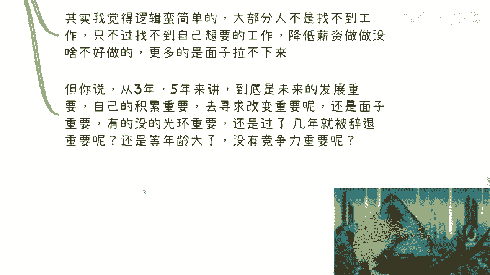

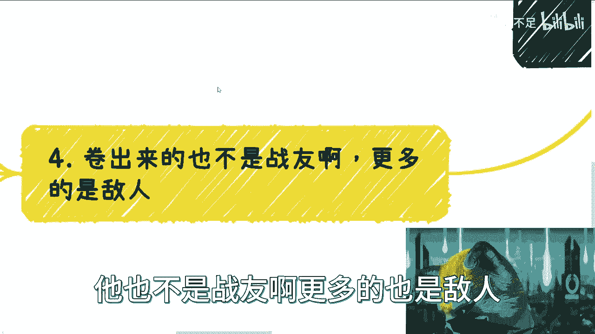

因为我们必须承认，无论“卷”与否，能爬到金字塔顶端的人永远是少数。我们都在博取概率，但在职场“内卷”中博取成功的概率、所能获得的资源总量以及赚钱的规模，与在外界（如商业世界）博取的概率完全不是一个量级。

---

## 第四点：“卷”出来的往往是敌人，而非战友 ⚔️

你需要明白，“卷”出来的往往不是战友，而是敌人。这种敌人层次很低，他们会使用各种下三滥的手段攻击你。

“卷”和各种嫉妒、落井下石的行为本质相同。一旦开始走上“卷”这条路，它就是一个长期且往往不自知的过程。你一直在“卷”，却不自知。时间长了，你身边的人和合作伙伴自然会看清你的为人和属性。

因为人与人的价值是相互的。比方说，你是一个很会“卷”的人，但在那些能够“四两拨千斤”、高性价比赚钱的人看来，你可能就是个“**nobody**”，而且是个“**高风险 nobody**”。

为什么？因为你会“卷”，说明你心思复杂、算计多。而你长期只在公司内部打转，也说明格局有限。当有一天你能接触到更高层次的圈子，或开始高性价比地赚钱时，你会发现，所有有能力赚钱的人只关心一点：**稳定与安全**。

赚钱的方式很多，但**安全与稳定永远是第一位的**。对于一个很会“卷”、却缺乏商业经验、只局限于公司内部的人来说，这就是一个定时炸弹。

很多时候，“卷”和变得嗜血、疯狂是一个道理。你以为在前进，其实是在原地打转，永远停留在同一个层次，并且攻击着同层次的人。这种“卷”既不能带来财富增长，也不能实现圈子的跃迁，毫无意义。

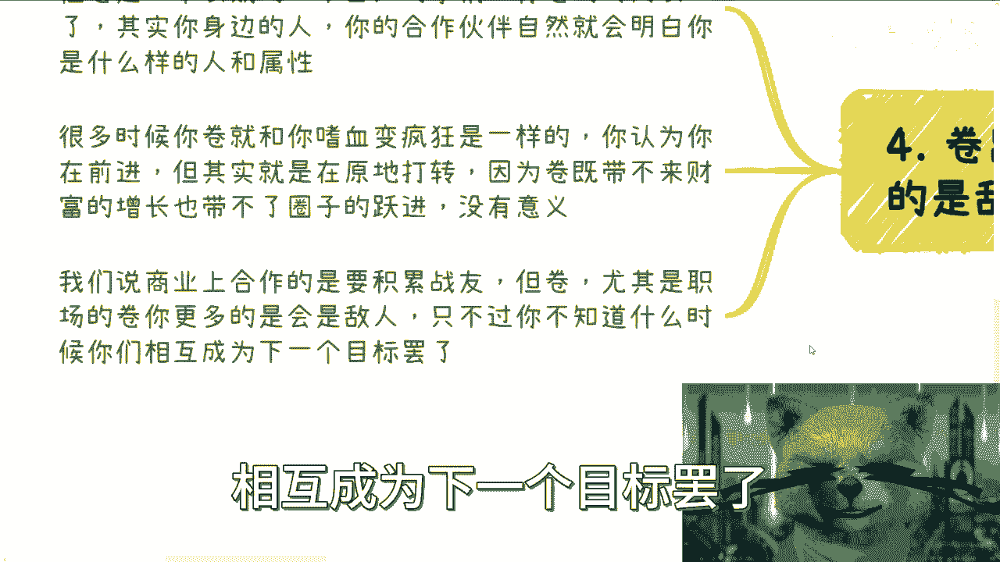

商业合作需要积累的是**信任**，是能够背靠背一起赚钱的、**安全稳定**的伙伴。而职场中的“卷”，更多只会留下敌人。为什么？因为缺乏底线。所有主动“卷”的人往往没有底线。当他们“杀红眼”时，根本不知道自己什么都没得到，只是沦为了别人的工具。

因此，相互“卷”的时候，你只是不知道何时会成为下一个被攻击的目标。

---

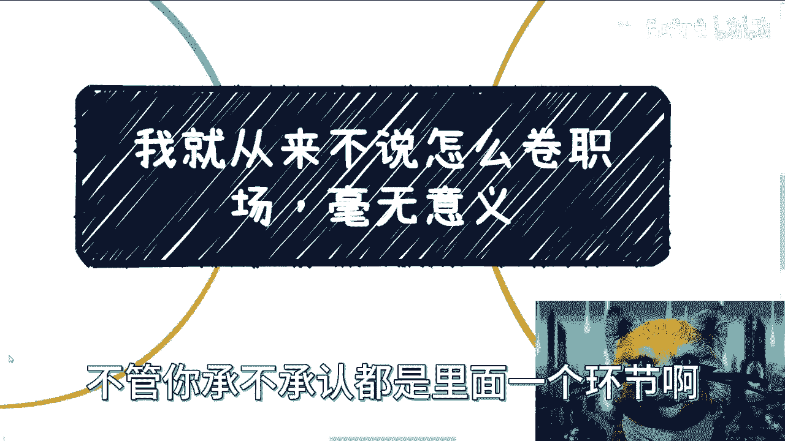

## 总结与反思 💡

本节课我们一起探讨了“职场内卷”的多个层面。

1.  **本质幼稚**：“卷职场”如同过家家，在更高维度看毫无新意，本质是低层次的零和博弈。
2.  **于己无益**：内卷消耗巨大精力，却难以带来实质性的财富或阶层跃升，往往是底层互害。
3.  **态度先行**：建立“平起平坐”的打工者心态，拒绝无意义内耗，寻找认可自身价值的环境，注重长期积累而非短期面子。
4.  **树敌而非交友**：内卷文化滋生的是低层次的敌人，而非商业世界所需的可信赖伙伴，且会给自己贴上“高风险”的标签。

你需要明白，无论是公司内的“卷”，还是自媒体教你“卷”，这都是一个**环环相扣的生态链**，如同割韭菜，上层割下层，层层传递。每一层最终都可能促成一场“雪崩”，只是规模大小不同。而我们每个人，无论承认与否，都是这个链条中的一环。

**最终公式：个人职场价值 = f(实际技能， 可信任度， 格局视野) - g(内卷消耗)**

与其将精力耗费在无意义的内卷上，不如投资于提升实际技能、建立可靠声誉和拓宽格局视野。这才是应对漫长职业生涯的稳健之道。

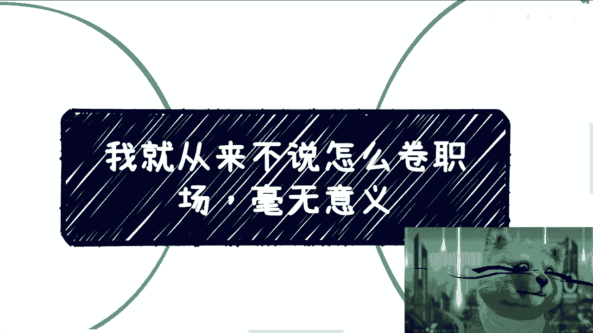

---
*（注：本课程内容基于特定观点分享，旨在引发思考。个人职业选择需结合自身情况慎重考量。）*